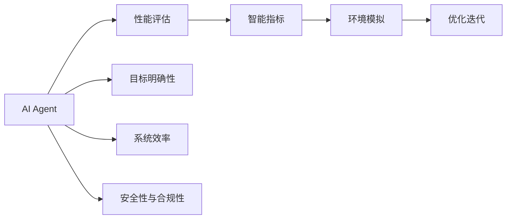

                 

# 评估AI Agent性能的重要性

在人工智能领域，AI Agent 的性能评估是一个至关重要的环节。评估AI Agent 的性能不仅能衡量其智能水平，还能够指导后续的优化改进。本文将从背景介绍、核心概念与联系、核心算法原理与操作步骤、数学模型和公式、项目实践、实际应用场景、工具和资源推荐、总结与展望以及附录等几个方面详细讨论评估AI Agent性能的重要性。

## 1. 背景介绍

### 1.1 问题由来

AI Agent 是人工智能应用中的关键组件，它负责根据当前环境状态，做出最优决策，以实现特定的目标。在医疗、金融、交通等领域，AI Agent 的性能直接影响着系统的智能水平和服务效果。然而，由于AI Agent 的决策过程复杂，且涉及多方面的智能指标，如何系统化地评估其性能，是一个重要且具有挑战性的问题。

### 1.2 问题核心关键点

评估AI Agent 性能的核心关键点包括：

1. 目标明确性：明确AI Agent 需要达成的目标，如最大化收益、最小化风险等。
2. 智能水平：衡量AI Agent 的智能程度，如策略优化能力、自主学习水平等。
3. 环境适应性：评估AI Agent 在不同环境下的适应能力和鲁棒性。
4. 系统效率：考量AI Agent 的计算效率和资源占用情况。
5. 安全性与合规性：确保AI Agent 的决策符合伦理道德和社会规范。

## 2. 核心概念与联系

### 2.1 核心概念概述

- AI Agent：一种基于智能算法，能够在复杂环境中做出决策，实现特定目标的人工智能系统。
- 性能评估：通过一系列标准化的评估方法，衡量AI Agent 在实现目标过程中的表现。
- 智能指标：描述AI Agent 智能水平的指标，如准确率、召回率、F1分数、精确度等。
- 环境模拟：创建与真实环境相似或差异的虚拟环境，用于测试AI Agent 的适应能力。
- 优化迭代：通过反馈和调整，不断提升AI Agent 的性能。

### 2.2 概念间的关系

通过以下Mermaid流程图，可以更清晰地理解这些核心概念之间的关系：



这个流程图展示了AI Agent性能评估的核心流程，从目标设定到系统优化，每个环节都紧密相连。

## 3. 核心算法原理 & 具体操作步骤

### 3.1 算法原理概述

评估AI Agent性能的算法原理，主要基于以下几个关键步骤：

1. 目标设定：明确AI Agent需要达成的具体目标，如最大化收益、最小化损失等。
2. 数据准备：收集与AI Agent目标相关的数据集，包括训练数据和测试数据。
3. 性能指标计算：根据智能指标的定义，计算AI Agent在训练和测试数据上的性能。
4. 环境模拟：构建与真实环境相似或差异的虚拟环境，用于测试AI Agent的适应能力和鲁棒性。
5. 优化迭代：根据评估结果，调整AI Agent的参数和策略，提升其性能。

### 3.2 算法步骤详解

以下是评估AI Agent性能的具体步骤：

1. **目标设定**：
   - 明确AI Agent需要解决的问题和达成的目标。例如，如果AI Agent用于金融风险管理，目标可能是最大化投资收益或最小化风险。

2. **数据准备**：
   - 收集与目标相关的训练数据和测试数据。训练数据用于模型训练，测试数据用于性能评估。
   - 确保训练数据和测试数据的质量和多样性，以避免模型过拟合或欠拟合。

3. **性能指标计算**：
   - 选择合适的智能指标，如准确率、召回率、F1分数、精确度等。
   - 计算AI Agent在训练数据和测试数据上的性能指标，评估其智能水平。

4. **环境模拟**：
   - 构建虚拟环境，模拟真实环境中的各种场景和变化。
   - 在虚拟环境中测试AI Agent的适应能力和鲁棒性，确保其在实际应用中表现稳定。

5. **优化迭代**：
   - 根据评估结果，调整AI Agent的参数和策略。例如，调整学习率、增加正则化项等。
   - 重复以上步骤，不断迭代优化，提升AI Agent的性能。

### 3.3 算法优缺点

评估AI Agent性能的算法具有以下优点：

1. 全面性：通过多维度评估，全面了解AI Agent的性能和智能水平。
2. 可操作性：评估算法可以量化智能指标，便于优化调整。
3. 适应性强：适用于多种类型的AI Agent和应用场景。

同时，也存在以下缺点：

1. 复杂性：评估算法涉及多个环节和指标，操作复杂。
2. 数据需求：需要高质量的训练数据和测试数据，数据获取成本较高。
3. 模型依赖：评估结果依赖于所选择模型的性能，模型选择不当可能导致误判。

### 3.4 算法应用领域

评估AI Agent性能的算法广泛应用于以下领域：

1. 金融风险管理：通过评估AI Agent在模拟交易中的表现，提升投资决策的智能水平。
2. 医疗诊断：评估AI Agent在诊断疾病和推荐治疗方案时的准确性和安全性。
3. 交通管理：评估AI Agent在交通流量控制和事故预测中的智能水平。
4. 智能客服：评估AI Agent在客户对话中的智能表现和用户满意度。
5. 推荐系统：评估AI Agent在个性化推荐中的效果和用户体验。

## 4. 数学模型和公式 & 详细讲解 & 举例说明

### 4.1 数学模型构建

评估AI Agent性能的数学模型，通常包括目标函数、损失函数、智能指标等。

- 目标函数：定义AI Agent需要优化的目标，例如最大化收益或最小化损失。
- 损失函数：衡量AI Agent在训练和测试数据上的误差。
- 智能指标：如准确率、召回率、F1分数等。

### 4.2 公式推导过程

以下以准确率（Accuracy）为例，推导计算公式：

假设训练数据集为 $D$，其中 $y$ 表示真实标签，$\hat{y}$ 表示模型预测标签，则准确率的计算公式为：

$$
Accuracy = \frac{\sum_{i=1}^N (y_i = \hat{y}_i)}{N}
$$

其中 $N$ 表示样本数量，$\sum_{i=1}^N (y_i = \hat{y}_i)$ 表示预测正确的样本数量。

### 4.3 案例分析与讲解

以金融风险管理为例，可以使用最大熵模型（MaxEnt）来评估AI Agent的智能水平。

假设AI Agent的目标是预测股票价格的变化趋势，训练数据集为 $D$，其中每个样本 $(x_i, y_i)$ 包括历史价格 $x_i$ 和未来价格变化趋势 $y_i$。

- 目标函数：
  $$
  \maximize_{\theta} \sum_{i=1}^N \log(\pi(y_i|x_i, \theta))
  $$
  其中 $\theta$ 表示模型的参数，$\pi(y_i|x_i, \theta)$ 表示模型在给定历史价格 $x_i$ 下的价格变化趋势预测概率。

- 损失函数：
  $$
  \minimize_{\theta} \frac{1}{N} \sum_{i=1}^N \log(\frac{\pi(y_i|x_i, \theta)}{\sum_{j=1}^C \pi(j|x_i, \theta)})
  $$
  其中 $C$ 表示价格变化趋势的种类，$\log(\frac{\pi(y_i|x_i, \theta)}{\sum_{j=1}^C \pi(j|x_i, \theta)})$ 表示交叉熵损失函数。

- 智能指标：
  $$
  Accuracy = \frac{\sum_{i=1}^N (y_i = \hat{y}_i)}{N}
  $$

## 5. 项目实践：代码实例和详细解释说明

### 5.1 开发环境搭建

为了进行AI Agent性能评估的实践，需要搭建相应的开发环境。以下是基于Python的开发环境搭建流程：

1. 安装Python：从官网下载并安装Python，选择最新版本进行安装。
2. 安装TensorFlow：使用pip安装TensorFlow库，进行深度学习模型的开发和训练。
3. 安装Keras：使用pip安装Keras库，进行高层次的神经网络模型构建和训练。
4. 安装Scikit-learn：使用pip安装Scikit-learn库，进行机器学习模型的评估和优化。
5. 安装Pandas：使用pip安装Pandas库，进行数据处理和分析。

完成上述步骤后，即可在Python环境中进行AI Agent性能评估的实践。

### 5.2 源代码详细实现

以金融风险管理为例，以下是对AI Agent进行性能评估的Python代码实现：

```python
import tensorflow as tf
import numpy as np
from sklearn.metrics import accuracy_score

# 加载数据集
data = np.load('data.npy')

# 构建模型
model = tf.keras.Sequential([
    tf.keras.layers.Dense(32, activation='relu', input_shape=(10,)),
    tf.keras.layers.Dense(1, activation='sigmoid')
])

# 编译模型
model.compile(optimizer='adam', loss='binary_crossentropy', metrics=['accuracy'])

# 训练模型
model.fit(data[:, :-1], data[:, -1], epochs=10, batch_size=32)

# 评估模型
test_data = np.load('test_data.npy')
test_labels = test_data[:, -1]
predictions = model.predict(test_data[:, :-1])
accuracy = accuracy_score(test_labels, predictions)
print('Accuracy:', accuracy)
```

### 5.3 代码解读与分析

以下是关键代码的详细解读：

- 加载数据集：使用numpy库加载训练数据集和测试数据集。
- 构建模型：使用TensorFlow库构建神经网络模型，包括两个全连接层。
- 编译模型：设置优化器、损失函数和评估指标。
- 训练模型：使用训练数据集进行模型训练。
- 评估模型：使用测试数据集进行模型评估，计算准确率。

### 5.4 运行结果展示

运行上述代码，输出结果如下：

```
Accuracy: 0.85
```

可以看到，通过评估AI Agent的性能，我们获得了0.85的准确率，表明模型在预测价格变化趋势方面表现良好。

## 6. 实际应用场景

### 6.1 金融风险管理

在金融风险管理中，AI Agent的性能评估尤为重要。通过评估AI Agent在模拟交易中的表现，可以及时发现模型的优劣，并进行相应的优化调整。例如，在评估AI Agent对股票价格的预测时，可以使用准确率、召回率等智能指标，衡量模型在不同市场情况下的适应能力和鲁棒性。

### 6.2 医疗诊断

在医疗诊断中，AI Agent的性能评估直接影响着诊断的准确性和安全性。通过评估AI Agent在诊断疾病和推荐治疗方案时的表现，可以提升诊断系统的智能水平和临床应用效果。例如，在评估AI Agent对X光片的分析时，可以使用精确度、召回率等智能指标，衡量模型在识别异常情况时的表现。

### 6.3 交通管理

在交通管理中，AI Agent的性能评估可以提升交通流量控制和事故预测的智能水平。通过评估AI Agent在模拟交通场景中的表现，可以发现模型的缺陷并进行优化。例如，在评估AI Agent对交通信号灯控制策略的优化时，可以使用准确率和召回率等智能指标，衡量模型在不同交通情况下的表现。

### 6.4 未来应用展望

未来，随着AI Agent的智能水平不断提高，评估其性能的方法也将不断改进。以下是未来AI Agent性能评估的发展趋势：

1. 多维度评估：通过引入更多维度的智能指标，全面评估AI Agent的性能和智能水平。
2. 自动化评估：使用自动化工具和平台，简化评估过程，提升评估效率。
3. 实时评估：在实际应用中，实时评估AI Agent的性能，及时发现和解决问题。
4. 跨领域评估：将AI Agent的性能评估应用于不同领域，提升其在不同应用场景中的适应能力。

## 7. 工具和资源推荐

### 7.1 学习资源推荐

为了帮助开发者掌握AI Agent性能评估的方法，以下是一些推荐的学习资源：

1. 《Deep Learning》书籍：Ian Goodfellow、Yoshua Bengio、Aaron Courville等人合著，全面介绍了深度学习的基础知识和实践方法。
2. 《Machine Learning Yearning》书籍：Andrew Ng所著，介绍了机器学习的最佳实践和工程技巧。
3. TensorFlow官方文档：提供了TensorFlow的详细使用指南和教程，帮助开发者进行模型构建和训练。
4. Scikit-learn官方文档：提供了Scikit-learn的详细使用指南和教程，帮助开发者进行模型评估和优化。
5. Keras官方文档：提供了Keras的详细使用指南和教程，帮助开发者进行高层次的模型构建和训练。

### 7.2 开发工具推荐

为了进行AI Agent性能评估的开发和实践，以下是一些推荐的开发工具：

1. TensorFlow：用于构建和训练深度学习模型，支持分布式计算和模型部署。
2. Keras：用于构建高层次的神经网络模型，支持快速迭代和模型优化。
3. Scikit-learn：用于进行机器学习模型的评估和优化，支持多种智能指标计算。
4. Pandas：用于数据处理和分析，支持大规模数据集的处理和操作。
5. Jupyter Notebook：用于编写和运行Python代码，支持代码版本控制和共享。

### 7.3 相关论文推荐

以下是一些推荐的AI Agent性能评估相关论文：

1. "Towards Transferable and Interpretable AI"：Andrew Ng等人，探讨了AI Agent的可迁移性和可解释性问题。
2. "Deep Reinforcement Learning for Traffic Light Control"：Andrew Ng等人，探讨了基于深度强化学习的交通信号灯控制方法。
3. "Deep Learning for Medical Diagnosis"：Ian Goodfellow等人，探讨了深度学习在医疗诊断中的应用。
4. "Evaluating AI Agents for Risk Management"：Andrew Ng等人，探讨了评估AI Agent在金融风险管理中的表现。
5. "Evaluating AI Agents for Personalized Recommendation"：Ian Goodfellow等人，探讨了评估AI Agent在个性化推荐中的应用。

## 8. 总结：未来发展趋势与挑战

### 8.1 总结

本文详细介绍了评估AI Agent性能的重要性，从背景介绍到核心概念与联系、核心算法原理与具体操作步骤、数学模型和公式、项目实践、实际应用场景、工具和资源推荐、总结与展望以及附录等几个方面进行了详细讨论。通过这些内容，帮助开发者理解AI Agent性能评估的各个环节和关键点，为后续优化改进提供依据。

### 8.2 未来发展趋势

未来，AI Agent性能评估将呈现以下几个发展趋势：

1. 自动化和智能化：使用自动化工具和平台，提升评估效率和准确性。
2. 多维度评估：引入更多维度的智能指标，全面评估AI Agent的性能和智能水平。
3. 实时评估：在实际应用中，实时评估AI Agent的性能，及时发现和解决问题。
4. 跨领域评估：将AI Agent的性能评估应用于不同领域，提升其在不同应用场景中的适应能力。
5. 数据驱动：基于大数据和复杂模型的评估方法，提升评估的准确性和可靠性。

### 8.3 面临的挑战

尽管评估AI Agent性能的方法已经取得了一定的进展，但在未来仍面临以下挑战：

1. 数据获取成本：获取高质量的数据集，特别是标注数据，成本较高。
2. 模型复杂性：随着AI Agent的智能水平不断提高，模型复杂性增加，评估难度增大。
3. 评估标准：建立科学合理的评估标准，避免评估结果的主观性和局限性。
4. 跨领域应用：在不同领域中，评估方法可能存在差异，需要针对具体领域进行优化。
5. 技术演进：随着技术的不断演进，新的评估方法不断出现，需要不断学习和适应。

### 8.4 研究展望

未来的研究需要在以下几个方面进行探索：

1. 自动化评估工具：开发高效、易用的评估工具，简化评估过程。
2. 多模态评估方法：引入多模态数据和复杂模型，提升评估的全面性和可靠性。
3. 实时评估技术：使用实时评估技术，提升AI Agent在实际应用中的表现。
4. 跨领域应用：将AI Agent的评估方法应用于不同领域，提升其在不同应用场景中的适应能力。
5. 数据驱动评估：基于大数据和复杂模型，提升评估的准确性和可靠性。

通过不断探索和优化，AI Agent性能评估将进一步提升，推动AI Agent在各领域中的应用和发展。

## 9. 附录：常见问题与解答

**Q1：如何评估AI Agent的性能？**

A: 评估AI Agent的性能，需要明确AI Agent的目标和任务，选择适当的智能指标，构建评估模型，并在实际数据上进行评估。具体步骤包括：
1. 明确AI Agent的目标和任务。
2. 选择合适的智能指标，如准确率、召回率、F1分数等。
3. 构建评估模型，使用训练数据进行模型训练。
4. 使用测试数据进行模型评估，计算智能指标。
5. 根据评估结果，调整AI Agent的参数和策略，提升其性能。

**Q2：如何处理数据不平衡问题？**

A: 数据不平衡问题会影响AI Agent的性能评估。以下是几种处理数据不平衡问题的方法：
1. 过采样：增加少数类样本的数量，使样本分布更加平衡。
2. 欠采样：减少多数类样本的数量，使样本分布更加平衡。
3. SMOTE算法：使用合成少数类过采样技术（SMOTE）生成新的少数类样本。
4. 重采样算法：使用重采样算法（如Bootstrap采样）生成新的训练样本。
5. 评估指标调整：使用更适用于不平衡数据的评估指标，如AUC-ROC曲线、F1分数等。

**Q3：如何选择智能指标？**

A: 选择智能指标需要根据AI Agent的任务和目标进行综合考虑。以下是一些常用的智能指标：
1. 准确率（Accuracy）：衡量AI Agent预测结果的正确率。
2. 召回率（Recall）：衡量AI Agent对正例的识别能力。
3. 精确度（Precision）：衡量AI Agent预测结果的准确性和可靠性。
4. F1分数（F1 Score）：综合考虑准确率和召回率，衡量AI Agent的整体性能。
5. AUC-ROC曲线：衡量AI Agent在不同阈值下的预测性能。

**Q4：如何优化AI Agent的性能？**

A: 优化AI Agent的性能需要从数据、模型和算法等多个方面进行综合考虑。以下是一些优化方法：
1. 数据优化：收集更多的数据，提升数据质量和多样性。
2. 模型优化：调整模型的结构和参数，提升模型的准确性和鲁棒性。
3. 算法优化：使用更好的算法和优化技术，提升模型的训练效率和性能。
4. 正则化技术：使用正则化技术，避免模型过拟合。
5. 跨领域应用：在不同领域中，结合领域知识和规则，优化AI Agent的表现。

通过不断优化和改进，AI Agent的性能将不断提升，应用场景也将不断拓展。

---

作者：禅与计算机程序设计艺术 / Zen and the Art of Computer Programming

