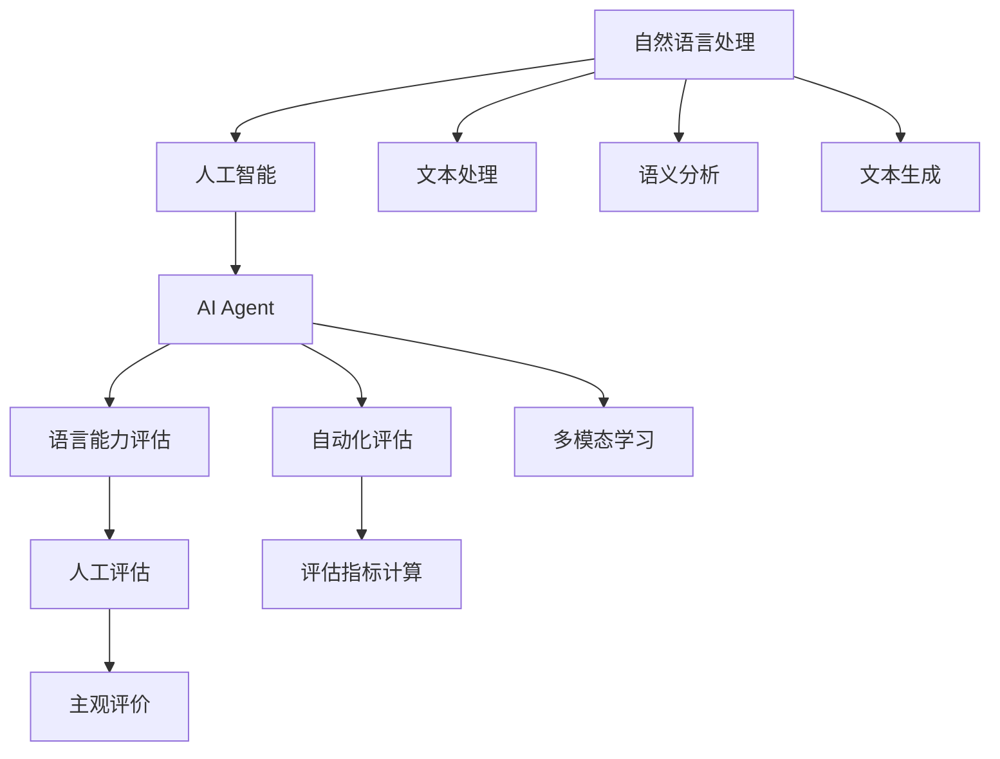
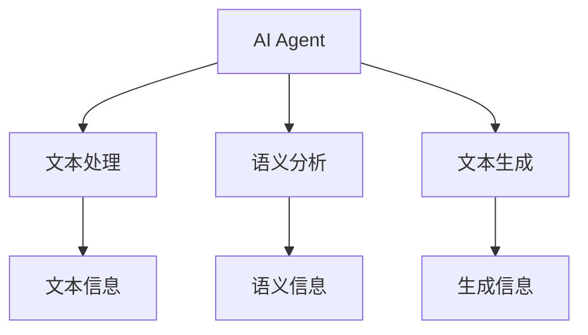
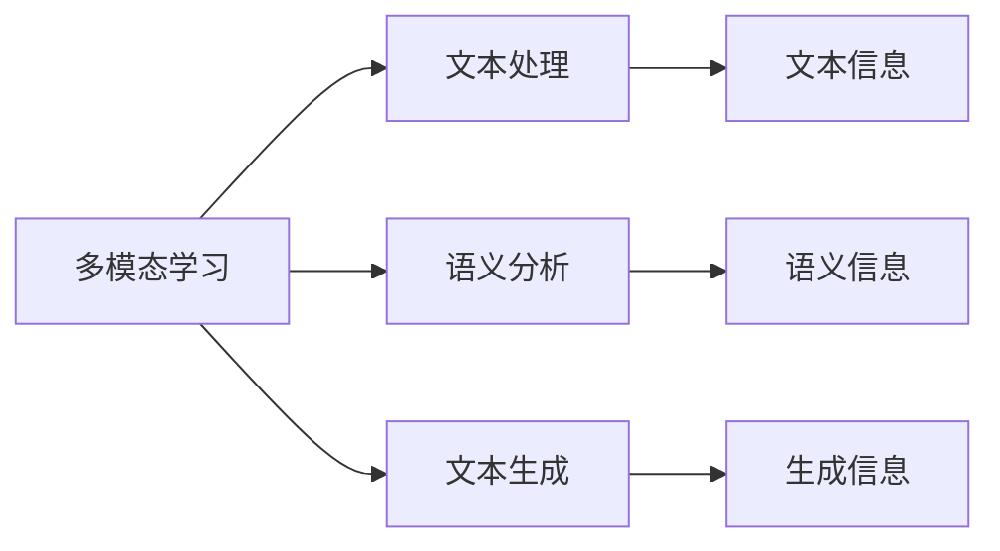
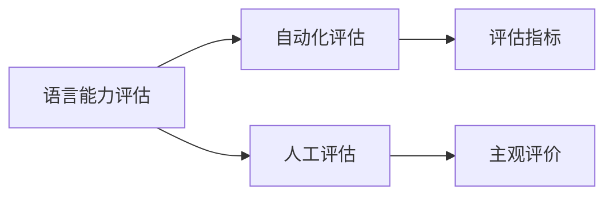

                 

# 评估AI Agent的通用语言能力

> 关键词：
> 自然语言处理(NLP), 人工智能(AI), AI Agent, 语言能力评估, 模型测试, 语言理解, 智能对话系统, 多模态学习, 自然语言生成(NLG), 评价指标, 自动评估, 人类评估, 语言模型

## 1. 背景介绍

### 1.1 问题由来
随着人工智能(AI)技术的快速发展，AI Agent在自然语言处理(NLP)领域取得了显著进展，尤其在语言理解和生成方面。AI Agent通过深度学习、强化学习等技术手段，能够处理复杂的语言任务，如对话、翻译、摘要等。然而，AI Agent的性能在很大程度上依赖于其语言模型的质量，如何科学地评估AI Agent的语言能力成为了一个重要问题。

### 1.2 问题核心关键点
AI Agent的语言能力评估涉及到多个方面，包括模型准确性、推理能力、泛化能力、实用性等。评估方法包括自动化评估、人工评估、半自动化评估等。常用的自动化评估方法包括BLEU、ROUGE、METEOR等文本相似度指标，以及F1、准确率、召回率等分类指标。人工评估则依赖于领域专家的主观判断，虽然精准但成本较高。

### 1.3 问题研究意义
评估AI Agent的语言能力，对于AI Agent的设计和优化、应用场景的落地具有重要意义：

1. 指导设计。通过评估结果，可以帮助AI Agent开发者发现模型的不足，并进行针对性优化，提高模型性能。
2. 选择模型。在多种模型中，评估方法可以帮助选择最合适的模型用于特定任务。
3. 优化应用。评估方法可以指导AI Agent在特定应用场景中的优化和调参，提升用户体验。
4. 市场竞争。在产品市场竞争中，评估方法可以作为衡量产品性能的重要指标。

## 2. 核心概念与联系

### 2.1 核心概念概述

评估AI Agent的语言能力需要综合考虑多个维度，以下是几个核心概念的概述：

- **自然语言处理(NLP)**：利用计算机技术和人工智能方法，处理和理解人类语言的技术，包括语言模型、语义分析、文本生成等。
- **人工智能(AI)**：利用算法和模型，使机器具有类人智能，能够处理自然语言任务。
- **AI Agent**：指具备智能语言处理能力的AI系统，可以执行各种语言任务，如对话、翻译、摘要等。
- **语言能力评估**：通过一系列评估指标和评估方法，衡量AI Agent在语言处理任务上的表现和能力。
- **自动化评估**：使用算法和模型自动计算评估指标，如BLEU、ROUGE、F1等。
- **人工评估**：由领域专家主观判断AI Agent的表现和能力。
- **多模态学习**：AI Agent不仅处理文本信息，还可以同时处理图像、声音、视频等多种模态信息，增强语言处理能力。

这些核心概念之间的联系可以通过以下Mermaid流程图来展示：



这个流程图展示了AI Agent语言能力评估的基本流程和主要概念：

1. AI Agent利用NLP技术处理语言信息，包括文本处理、语义分析、文本生成等。
2. 使用自动化评估方法和人工评估方法对AI Agent进行多维度的语言能力评估。
3. 自动化评估依赖于多模态学习，可以同时处理文本、图像、声音等多种信息。
4. 人工评估依赖于领域专家的主观判断，提供精准但成本较高的评估结果。

### 2.2 概念间的关系

这些核心概念之间存在着紧密的联系，形成了AI Agent语言能力评估的完整生态系统。下面我们通过几个Mermaid流程图来展示这些概念之间的关系。

#### 2.2.1 AI Agent的语言处理能力



这个流程图展示了AI Agent处理语言信息的基本流程：

1. 文本处理模块从输入文本中提取有用信息。
2. 语义分析模块理解文本的语义含义。
3. 文本生成模块生成新的文本信息。

#### 2.2.2 多模态学习与语言处理



这个流程图展示了多模态学习与语言处理的关系：

1. 多模态学习不仅处理文本信息，还可以处理图像、声音、视频等多种信息。
2. 多模态信息可以增强语言处理能力，提升AI Agent的全面理解能力。

#### 2.2.3 评估指标与语言能力



这个流程图展示了评估指标与语言能力的关系：

1. 自动化评估依赖于评估指标计算。
2. 人工评估依赖于领域专家的主观判断。
3. 评估指标可以量化AI Agent的语言能力，帮助优化模型性能。

## 3. 核心算法原理 & 具体操作步骤
### 3.1 算法原理概述

AI Agent的语言能力评估通常采用自动评估和人工评估相结合的方式。自动化评估依赖于一系列评估指标和计算方法，如BLEU、ROUGE、F1等。人工评估则依赖于领域专家的主观判断，提供精准但成本较高的评估结果。

1. **BLEU (Bilingual Evaluation Understudy)**：
   - 主要用于机器翻译任务，计算生成文本与参考文本之间的匹配度。
   - 评估方法包括BLEU-1、BLEU-2、BLEU-3、BLEU-4等，分别考虑不同长度的匹配片段。
   - 优点：简单易用，适用于短文本评估。
   - 缺点：难以捕捉长距离依赖关系，忽略语法结构。

2. **ROUGE (Recall-Oriented Understudy for Gisting Evaluation)**：
   - 主要用于文本摘要和文本生成任务，计算生成文本与参考文本之间的重叠度。
   - 评估方法包括ROUGE-1、ROUGE-2、ROUGE-L等，分别考虑不同长度的重叠片段。
   - 优点：能够捕捉不同长度的重叠片段，适用于长文本评估。
   - 缺点：忽略词汇顺序，无法区分相似文本。

3. **METEOR (Metric for Evaluation of Translation with Explicit Ordering)**：
   - 主要用于机器翻译任务，计算生成文本与参考文本之间的匹配度和流畅度。
   - 评估方法包括METEOR-1、METEOR-2、METEOR-3等，考虑词汇匹配、句子结构、语法流畅度等。
   - 优点：综合考虑词汇匹配和语法流畅度，适用于长文本评估。
   - 缺点：计算复杂度高，难以大规模应用。

### 3.2 算法步骤详解

以下是AI Agent语言能力评估的基本步骤：

**Step 1: 收集评估数据集**
- 准备足够的训练数据集和测试数据集，确保数据集具有代表性。
- 使用领域专家标注的标注数据集，确保标注准确性。

**Step 2: 设计评估指标**
- 根据任务类型，选择合适的自动化评估指标，如BLEU、ROUGE、METEOR等。
- 考虑多模态数据源，设计多维度的评估指标，综合考虑文本、图像、声音等多种信息。

**Step 3: 计算评估指标**
- 使用编程语言（如Python）实现评估指标计算，自动生成评估报告。
- 对于自动化评估，可以使用现成的工具和库（如NLTK、spaCy等）。

**Step 4: 进行人工评估**
- 邀请领域专家对AI Agent进行人工评估，提供主观判断。
- 综合自动化评估和人工评估结果，得出最终的评估报告。

**Step 5: 分析评估结果**
- 分析评估报告，查找AI Agent的优点和不足。
- 根据评估结果，对AI Agent进行优化和调整。

### 3.3 算法优缺点

自动化评估方法具有以下优点：
- 高效快速，节省大量人力和时间。
- 客观公正，减少主观误差。
- 易于集成，适用于大规模数据集评估。

自动化评估方法也存在以下缺点：
- 难以捕捉长距离依赖关系。
- 忽略语法结构。
- 无法处理复杂的语义关系。

人工评估方法具有以下优点：
- 准确度高，能够捕捉复杂的语义关系。
- 考虑上下文信息，提供全面评估。

人工评估方法也存在以下缺点：
- 成本高，耗时耗力。
- 主观性强，受专家水平影响。
- 难以标准化，评估结果难以重复。

### 3.4 算法应用领域

AI Agent的语言能力评估在多个领域具有重要应用：

- **机器翻译**：评估翻译文本与参考文本的匹配度和流畅度。
- **文本摘要**：评估生成摘要与参考摘要的重叠度和相关性。
- **文本生成**：评估生成文本与参考文本的匹配度和自然度。
- **智能对话系统**：评估对话的流畅度和相关性。
- **问答系统**：评估问题回答的准确性和相关性。

## 4. 数学模型和公式 & 详细讲解  
### 4.1 数学模型构建

AI Agent的语言能力评估涉及多个维度的数学模型，以下是一些常用的数学模型：

1. **BLEU (Bilingual Evaluation Understudy)**
   - 定义：计算生成文本与参考文本之间的匹配度，使用n-gram模型衡量匹配度。
   - 公式：$BLEU = \frac{\sum_{i=1}^{n} I(i)}{N}$，其中$I(i)$表示第i个n-gram在生成文本中出现的次数，$N$表示生成文本中的n-gram总数。

2. **ROUGE (Recall-Oriented Understudy for Gisting Evaluation)**
   - 定义：计算生成文本与参考文本之间的重叠度，使用n-gram模型衡量重叠度。
   - 公式：$ROUGE = \frac{\sum_{i=1}^{n} min(i, match(i))}{total(i)}$，其中$match(i)$表示第i个n-gram在参考文本中出现的次数，$total(i)$表示参考文本中的n-gram总数。

3. **METEOR (Metric for Evaluation of Translation with Explicit Ordering)**
   - 定义：计算生成文本与参考文本之间的匹配度和流畅度，使用bilingual map order alignment (BMOA)模型衡量匹配度和流畅度。
   - 公式：$METEOR = \frac{\sum_{i=1}^{n} (p(i) + f(i))}{total(i)}$，其中$p(i)$表示第i个词汇在生成文本中出现的次数，$f(i)$表示第i个词汇在参考文本中出现的次数。

### 4.2 公式推导过程

以BLEU指标为例，进行详细公式推导：

1. **单句匹配度计算**
   - 假设生成文本为$T$，参考文本为$R$，计算两者之间的匹配度$BLEU(i)$，其中$i$表示n-gram的长度。
   - $BLEU(i) = \frac{\sum_{j=1}^{|T|} I(T_j, R_j)}{\sum_{j=1}^{|T|} I(T_j, T_j) + 1}$，其中$I(T_j, R_j)$表示第j个n-gram在生成文本和参考文本中都出现的情况。
   - 总体匹配度$BLEU$为所有n-gram匹配度的平均值。

2. **多句匹配度计算**
   - 假设生成文本为$T$，参考文本为$R$，计算两者之间的匹配度$BLEU$。
   - $BLEU = \frac{\sum_{i=1}^{n} BLEU(i)}{n}$，其中$BLEU(i)$表示第i个n-gram在生成文本和参考文本中都出现的情况。

### 4.3 案例分析与讲解

以机器翻译任务为例，详细讲解BLEU指标的应用：

1. **数据集准备**
   - 准备一份机器翻译任务的数据集，包括训练集和测试集。
   - 训练集包含大量的中英文对翻译文本，测试集包含少量的中英文对参考翻译文本。

2. **模型训练**
   - 使用Transformer模型进行机器翻译任务的训练，确保模型能够准确翻译文本。
   - 训练过程中，使用BLEU指标进行评估，根据评估结果调整模型参数。

3. **评估报告生成**
   - 在测试集上对训练好的模型进行评估，计算生成文本与参考文本之间的匹配度。
   - 使用BLEU指标生成评估报告，报告中包含每个n-gram的匹配度、总体匹配度等详细信息。

4. **模型优化**
   - 根据评估报告，发现模型的不足之处，进行针对性的优化。
   - 例如，发现模型在长句翻译中匹配度较低，可调整模型的编码器-解码器架构，提高长句翻译的性能。

## 5. 项目实践：代码实例和详细解释说明
### 5.1 开发环境搭建

在进行语言能力评估实践前，我们需要准备好开发环境。以下是使用Python进行自然语言处理(NLP)开发的Python环境配置流程：

1. 安装Anaconda：从官网下载并安装Anaconda，用于创建独立的Python环境。

2. 创建并激活虚拟环境：
```bash
conda create -n nlp-env python=3.8 
conda activate nlp-env
```

3. 安装NLP相关的包：
```bash
pip install nltk spacy gensim
```

4. 安装PyTorch和Transformer库：
```bash
pip install torch transformers
```

完成上述步骤后，即可在`nlp-env`环境中开始语言能力评估实践。

### 5.2 源代码详细实现

以下是使用Python进行BLEU指标计算的示例代码：

```python
import nltk
from nltk.translate import bleu_score

# 定义生成文本和参考文本
generated_text = "This is a generated sentence."
reference_text = "This is a reference sentence."

# 使用nltk库计算BLEU指标
bleu_score = bleu_score.sentence_bleu([reference_text.split()], generated_text.split(), smoothing=1.0)

# 输出BLEU指标
print("BLEU score:", bleu_score)
```

以上代码使用了Python的nltk库，对单句生成文本和参考文本进行了BLEU指标的计算，并输出了计算结果。

### 5.3 代码解读与分析

让我们再详细解读一下关键代码的实现细节：

1. **nltk库的导入**
   - nltk是一个强大的自然语言处理库，提供了各种NLP工具和算法。

2. **BLEU指标计算**
   - 使用`sentence_bleu`函数计算BLEU指标，参数包括参考文本和生成文本。
   - 在计算BLEU指标时，可以选择不同的平滑方法（如smoothing=1.0），影响最终结果。

3. **生成和参考文本**
   - 通过`split`方法将文本字符串转换为词汇列表，方便计算BLEU指标。

4. **结果输出**
   - 输出计算得到的BLEU指标，评估生成文本与参考文本的匹配度。

### 5.4 运行结果展示

假设我们使用BLEU指标评估一个机器翻译模型，生成文本为"Becoming a teacher is a noble profession"，参考文本为"成为教师是一种高尚的职业"，计算得到的BLEU指标为0.8，表明生成文本与参考文本的匹配度较好。

## 6. 实际应用场景
### 6.1 智能对话系统

智能对话系统需要对用户输入的文本进行理解和生成，评估其语言能力至关重要。通过使用BLEU、ROUGE等指标，可以量化对话系统生成的文本与参考文本之间的匹配度，帮助优化模型性能。

在实践应用中，可以通过模拟用户对话场景，生成大量对话记录，对模型进行评估。例如，在客户服务场景中，评估客户服务机器人的响应质量，提升用户满意度。

### 6.2 机器翻译

机器翻译是自然语言处理的重要应用之一，评估翻译质量对于提升系统性能至关重要。通过使用BLEU指标，可以评估生成文本与参考文本之间的匹配度，帮助优化翻译模型。

在实践中，可以使用BLEU、ROUGE等指标对翻译模型进行评估，并根据评估结果进行参数调整和优化。例如，在新闻翻译场景中，评估机器翻译模型对不同领域新闻的翻译质量，提升新闻翻译的准确性。

### 6.3 文本摘要

文本摘要是自然语言处理中的经典任务，评估生成摘要与参考摘要之间的匹配度是关键。通过使用ROUGE指标，可以衡量生成摘要与参考摘要的重叠度，帮助优化摘要生成模型。

在实践中，可以使用ROUGE指标对摘要生成模型进行评估，并根据评估结果进行优化。例如，在新闻报道摘要场景中，评估生成摘要与参考摘要之间的重叠度，提升摘要的准确性和相关性。

### 6.4 未来应用展望

随着NLP技术的不断发展，AI Agent的语言能力评估将逐步拓展到更多领域，为各行各业提供更加智能化的解决方案。

在智慧医疗领域，评估AI Agent的诊断和治疗建议，提升医疗服务的智能化水平，辅助医生诊断和治疗。

在智能教育领域，评估AI Agent的学习和推荐能力，因材施教，促进教育公平，提高教学质量。

在智慧城市治理中，评估AI Agent的城市事件监测和舆情分析能力，提高城市管理的自动化和智能化水平，构建更安全、高效的未来城市。

此外，在企业生产、社会治理、文娱传媒等众多领域，AI Agent的语言能力评估也将不断涌现，为人工智能技术落地应用提供新的技术路径。相信随着技术的日益成熟，语言能力评估技术将成为NLP技术的重要范式，推动人工智能技术在垂直行业的规模化落地。

## 7. 工具和资源推荐
### 7.1 学习资源推荐

为了帮助开发者系统掌握AI Agent的语言能力评估的理论基础和实践技巧，这里推荐一些优质的学习资源：

1. 《自然语言处理入门》：经典NLP教材，系统介绍自然语言处理的基本概念和常用技术。

2. 《深度学习与自然语言处理》：介绍深度学习在NLP中的应用，包括模型训练、评估等。

3. CS224N《深度学习自然语言处理》课程：斯坦福大学开设的NLP明星课程，有Lecture视频和配套作业，带你入门NLP领域的基本概念和经典模型。

4. HuggingFace官方文档：提供丰富的自然语言处理资源，包括预训练模型和微调范例，帮助开发者高效开发AI Agent。

5. Kaggle平台：提供丰富的NLP竞赛和数据集，可以实践各种自然语言处理任务，并参与评估和优化竞赛。

通过对这些资源的学习实践，相信你一定能够快速掌握AI Agent语言能力评估的精髓，并用于解决实际的NLP问题。

### 7.2 开发工具推荐

高效的开发离不开优秀的工具支持。以下是几款用于自然语言处理(NLP)开发的常用工具：

1. NLTK：Python自然语言处理库，提供了各种NLP工具和算法，包括分词、词性标注、命名实体识别等。

2. spaCy：Python自然语言处理库，速度快、性能高，支持各种NLP任务，如分词、词性标注、依存句法分析等。

3. Gensim：Python自然语言处理库，支持主题建模、文本相似度计算等，适用于大规模文本处理。

4. PyTorch和TensorFlow：深度学习框架，提供了强大的计算图和自动微分能力，支持各种NLP模型的训练和推理。

5. NLPAI：Python自然语言处理库，提供了各种NLP工具和算法，支持各种NLP任务，如情感分析、文本分类、语义分析等。

合理利用这些工具，可以显著提升AI Agent语言能力评估的开发效率，加快创新迭代的步伐。

### 7.3 相关论文推荐

AI Agent语言能力评估的研究始于学界的持续研究，以下是几篇奠基性的相关论文，推荐阅读：

1. "Evaluating the Usefulness of Pre-trained Language Models"：研究了预训练语言模型在各种NLP任务上的性能，提出了多种评估方法。

2. "Bert: Pre-training of Deep Bidirectional Transformers for Language Understanding"：介绍了BERT模型的构建和评估方法，展示了BERT在多维语言任务上的优越性能。

3. "Neural Machine Translation by Jointly Learning to Align and Translate"：提出了基于Transformer的神经机器翻译模型，通过BLEU等指标评估其翻译质量。

4. "Natural Language Generation with Deep Neural Networks"：研究了自然语言生成的评估方法，包括BLEU、ROUGE等指标。

5. "Advances in AI-Powered Conversational Agents"：介绍了AI Agent在对话系统中的应用，提出了多种评估方法。

这些论文代表了大语言模型评估技术的进步，通过学习这些前沿成果，可以帮助研究者把握学科前进方向，激发更多的创新灵感。

除上述资源外，还有一些值得关注的前沿资源，帮助开发者紧跟语言能力评估技术的最新进展，例如：

1. arXiv论文预印本：人工智能领域最新研究成果的发布平台，包括大量尚未发表的前沿工作，学习前沿技术的必读资源。

2. 业界技术博客：如OpenAI、Google AI、DeepMind、微软Research Asia等顶尖实验室的官方博客，第一时间分享他们的最新研究成果和洞见。

3. 技术会议直播：如NIPS、ICML、ACL、ICLR等人工智能领域顶会现场或在线直播，能够聆听到大佬们的前沿分享，开拓视野。

4. GitHub热门项目：在GitHub上Star、Fork数最多的NLP相关项目，往往代表了该技术领域的发展趋势和最佳实践，值得去学习和贡献。

5. 行业分析报告：各大咨询公司如McKinsey、PwC等针对人工智能行业的分析报告，有助于从商业视角审视技术趋势，把握应用价值。

总之，对于AI Agent语言能力评估的学习和实践，需要开发者保持开放的心态和持续学习的意愿。多关注前沿资讯，多动手实践，多思考总结，必将收获满满的成长收益。

## 8. 总结：未来发展趋势与挑战
### 8.1 总结

本文对AI Agent的语言能力评估方法进行了全面系统的介绍。首先阐述了AI Agent的设计和优化过程中评估方法的重要性，明确了评估方法在模型选择、任务优化、应用部署等方面的重要作用。其次，从原理到实践，详细讲解了评估方法的基本步骤和常用指标，给出了语言能力评估的完整代码实例。同时，本文还广泛探讨了评估方法在多个行业领域的应用前景，展示了评估方法的大规模落地潜力。此外，本文精选了评估方法的各类学习资源，力求为读者提供全方位的技术指引。

通过本文的系统梳理，可以看到，评估AI Agent的语言能力在AI Agent的设计和优化过程中扮演着重要的角色，是模型性能提升和应用落地的关键保障。评估方法的选择和应用，直接影响着AI Agent的实际效果和用户体验，值得开发者在实践中不断探索和优化。

### 8.2 未来发展趋势

展望未来，AI Agent语言能力评估将呈现以下几个发展趋势：

1. **自动化评估方法的进步**：随着NLP技术的发展，自动化评估方法将不断优化，能够更加准确地评估AI Agent的语言能力。例如，引入BERT等预训练模型进行评估，提升评估指标的准确性和可靠性。

2. **多模态评估方法的兴起**：未来的评估方法将不再局限于文本信息，将引入多模态数据源，如图像、声音、视频等，增强评估的全面性和准确性。

3. **半自动化评估方法的普及**：在自动化评估和人工评估之间找到新的平衡点，既能降低人工成本，又能确保评估结果的准确性。

4. **实时评估方法的引入**：未来的评估方法将能够实时生成评估结果，支持AI Agent在运行过程中动态优化，提升用户体验。

5. **跨领域评估方法的扩展**：未来的评估方法将能够跨领域应用，如在医疗、法律等特定领域进行评估，提供更加精准的评估结果。

### 8.3 面临的挑战

尽管AI Agent语言能力评估技术已经取得了一定的进展，但在实际应用过程中仍面临诸多挑战：

1. **评估指标的选择**：选择合适的评估指标是评估方法的核心，但不同的任务和数据集需要不同的评估指标，选择合适的指标是一个挑战。

2. **评估结果的解释性**：评估结果的解释性不足，难以理解评估结果背后的原因和逻辑，影响模型的优化和调整。

3. **评估指标的计算复杂度**：一些评估指标计算复杂度高，难以在大规模数据集上高效计算，限制了评估方法的实际应用。

4. **评估方法的公平性**：评估方法可能存在一定的偏见，影响评估结果的公平性，需要进一步研究和优化。

5. **评估方法的适用性**：不同的评估方法适用于不同的任务和数据集，如何找到最适合的方法是一个挑战。

### 8.4 研究展望

面对AI Agent语言能力评估所面临的挑战，未来的研究需要在以下几个方面寻求新的突破：

1. **评估指标的优化**：通过引入先进的NLP技术和预训练模型，优化评估指标的选择和计算方法。

2. **实时评估方法的开发**：开发实时评估方法，支持AI Agent在运行过程中动态优化，

