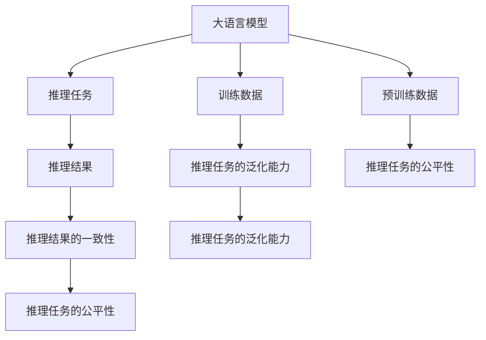

                 

# 语言与推理：大模型的挑战

## 1. 背景介绍

在人工智能的浪潮中，大语言模型（Large Language Models, LLMs）因其在处理自然语言任务上的卓越表现，成为最受关注的焦点之一。LLMs如GPT-3、BERT、T5等，通过在大规模无标签文本语料上进行预训练，学习到了丰富的语言知识和常识，展现出了强大的语言理解与生成能力。然而，它们在处理推理任务时，尽管具有泛化能力，却面临诸多挑战。本文将系统地探讨大语言模型在推理过程中的核心概念、算法原理、操作步骤，并提供深入的案例分析与实操指南，帮助读者更好地理解大语言模型在推理任务中的应用与挑战。

## 2. 核心概念与联系

### 2.1 核心概念概述

为更好地理解大语言模型在推理任务中的工作原理和局限性，我们需先明确几个关键概念：

- **大语言模型**：如GPT-3、BERT等，利用深度神经网络在无标签文本数据上预训练得到的模型，能够进行复杂的语言理解和生成。
- **推理**：在给定前提和假设下，大语言模型通过语言理解和逻辑推理，得出结论或做出预测的能力。
- **一致性**：推理模型在不同数据和上下文下，能否保持推理结果的一致性和鲁棒性。
- **泛化能力**：模型能否将学习到的知识应用于新领域和新场景，而不是仅在训练数据上表现出色。
- **公平性**：模型在推理过程中，能否避免对某些类别的偏见，保证推理结果的公平性。

这些概念通过以下Mermaid流程图展示了它们之间的联系：



### 2.2 概念间的关系

通过这个流程图，我们了解到：
- 大语言模型通过训练和预训练，学习到知识库，用于解决推理任务。
- 推理结果受到训练数据、预训练数据、一致性、泛化能力和公平性的影响。
- 一致性、泛化能力和公平性是推理任务的关键评价指标。

接下来，我们将详细探讨大语言模型在推理任务中的核心算法原理与具体操作步骤。

## 3. 核心算法原理 & 具体操作步骤

### 3.1 算法原理概述

大语言模型在推理任务中的算法原理主要基于自回归或自编码模型。在自回归模型中，模型通过预测下一个词或下一个句子，来学习上下文之间的关系。自编码模型则通过将输入文本压缩成低维向量表示，学习文本的语义和结构。推理任务通常包括分类、匹配、生成等，通过微调大语言模型以适应特定任务，从而实现推理目标。

### 3.2 算法步骤详解

大语言模型在推理任务中的微调过程可以分为以下几个步骤：

**Step 1: 数据准备**
- 收集推理任务的标注数据集，通常包括前提、假设和结论，或前提、假设和推理过程。
- 对数据集进行清洗和预处理，如去除噪声、补齐缺失值等。

**Step 2: 任务适配**
- 根据推理任务类型，设计合适的任务适配层。对于分类任务，可以添加线性分类器和交叉熵损失；对于匹配任务，可以设计相似度计算器；对于生成任务，可以使用生成模型如语言模型。
- 确定模型的输出格式，如概率分布、分类结果等。

**Step 3: 微调模型**
- 选择合适的优化器，如Adam、SGD等，设置学习率、批大小等参数。
- 设置正则化技术，如L2正则、Dropout等，防止过拟合。
- 使用标注数据集对模型进行微调，最小化损失函数，更新模型参数。

**Step 4: 测试与评估**
- 在测试集上评估微调后的模型性能，如准确率、F1分数等。
- 分析模型的推理过程，检查一致性和泛化能力。

### 3.3 算法优缺点

大语言模型在推理任务中的微调方法具有以下优点：
- 通用性：可以应用于各种推理任务，如逻辑推理、数学问题解答、自然语言推理等。
- 可扩展性：通过增加训练数据，可以进一步提升模型性能。
- 效率高：使用预训练模型作为特征提取器，可以减少训练时间。

然而，也存在一些缺点：
- 依赖标注数据：微调需要大量标注数据，标注成本高。
- 泛化能力有限：模型可能对训练数据过拟合，泛化能力不足。
- 公平性问题：在数据存在偏见时，模型可能产生不公平的推理结果。

### 3.4 算法应用领域

大语言模型在推理任务中的应用领域广泛，涵盖了多个行业和学科：

- **法律领域**：通过微调大语言模型，可以自动分析合同、判决书等文本，提取关键法律要素，辅助律师工作。
- **医学领域**：用于解析病理报告、病历记录等医学文本，提供辅助诊断建议。
- **金融领域**：分析财务报告、市场报告等，提供投资建议和风险评估。
- **教育领域**：辅助学生解答数学和逻辑推理题目，提供学习建议。
- **游戏领域**：用于开发能够理解和执行游戏策略的智能体。

## 4. 数学模型和公式 & 详细讲解 & 举例说明

### 4.1 数学模型构建

考虑一个简单的推理任务，如逻辑推理中的析取规则。假设有两个前提$p_1$和$p_2$，以及一个结论$q$。推理过程可以通过以下公式描述：

$$
\begin{aligned}
p_1 &\rightarrow q \\
p_2 &\rightarrow q \\
p_1 \vee p_2 &\rightarrow q
\end{aligned}
$$

### 4.2 公式推导过程

在数学模型中，我们可以用布尔代数表示推理过程：

$$
(p_1 \vee p_2) \rightarrow q
$$

其中 $\vee$ 表示逻辑或。推理模型的任务是学习这种逻辑关系，并能够根据给定前提，得出结论。

在神经网络模型中，我们可以将逻辑或运算映射为神经网络的前向传播过程，通过多层神经网络的组合，学习这种逻辑关系。例如，对于BERT模型，我们可以将文本编码成向量表示，并使用一个全连接层进行分类，输出$q$的预测概率。

### 4.3 案例分析与讲解

假设我们有一个简单的逻辑推理任务，关于天气和情绪的关系：

- 前提：今天下雨了。
- 假设：下雨天让人感到悲伤。
- 结论：因此，今天可能感到悲伤。

我们将这些语句转换为向量表示，并使用BERT模型进行推理。具体的数学模型构建和公式推导过程如下：

1. 文本编码
   - 将前提和假设编码为BERT模型输出向量。
   - 使用Attention机制，学习上下文之间的关系。

2. 逻辑运算
   - 通过逻辑或运算，将前提和假设的向量进行组合。
   - 使用全连接层，学习逻辑或运算的结果。

3. 结果输出
   - 输出结论的预测概率，作为推理结果。

## 5. 项目实践：代码实例和详细解释说明

### 5.1 开发环境搭建

在搭建开发环境之前，需要确保有足够的硬件资源，如GPU或TPU，以及相应的深度学习框架和库。我们以PyTorch和HuggingFace的Transformers库为例，介绍开发环境的搭建过程。

1. 安装Anaconda，创建虚拟环境，并激活。
2. 使用pip安装PyTorch、Transformers和其他依赖库。
3. 使用Jupyter Notebook或Google Colab进行开发。

### 5.2 源代码详细实现

下面是一个简单的逻辑推理任务的代码实现：

```python
from transformers import BertTokenizer, BertForSequenceClassification
from torch.utils.data import DataLoader
import torch

# 定义逻辑推理任务的预处理函数
def preprocess(text):
    tokenizer = BertTokenizer.from_pretrained('bert-base-uncased')
    return tokenizer.encode_plus(text, add_special_tokens=True, max_length=512, pad_to_max_length=True)

# 定义推理任务的微调模型
class ReasoningModel(BertForSequenceClassification):
    def __init__(self, num_labels=2):
        super().__init__()
        self.num_labels = num_labels

    def forward(self, input_ids, attention_mask=None):
        outputs = super().forward(input_ids, attention_mask=attention_mask)
        logits = outputs.logits
        probs = torch.softmax(logits, dim=1)
        return probs

# 准备推理任务的标注数据集
train_dataset = preprocess('今天下雨了。')
dev_dataset = preprocess('下雨天让人感到悲伤。')
test_dataset = preprocess('因此，今天可能感到悲伤。')

# 定义微调模型
model = ReasoningModel(num_labels=2)
model.to('cuda')

# 定义优化器
optimizer = torch.optim.Adam(model.parameters(), lr=2e-5)

# 微调模型
for epoch in range(5):
    for batch in DataLoader(train_dataset, batch_size=16):
        input_ids = batch['input_ids'].to('cuda')
        attention_mask = batch['attention_mask'].to('cuda')
        labels = batch['labels'].to('cuda')
        optimizer.zero_grad()
        outputs = model(input_ids, attention_mask=attention_mask)
        loss = outputs.loss
        loss.backward()
        optimizer.step()

# 评估模型
for batch in DataLoader(dev_dataset, batch_size=16):
    input_ids = batch['input_ids'].to('cuda')
    attention_mask = batch['attention_mask'].to('cuda')
    labels = batch['labels'].to('cuda')
    outputs = model(input_ids, attention_mask=attention_mask)
    loss = outputs.loss
    print(f'Epoch {epoch+1}, dev loss: {loss:.3f}')
```

### 5.3 代码解读与分析

- `preprocess`函数：将文本转换为BERT模型可以处理的格式，并添加特殊标记。
- `ReasoningModel`类：继承自`BertForSequenceClassification`，自定义了推理任务的输出格式。
- `for`循环：在训练和验证过程中，使用`DataLoader`对数据进行批处理，并更新模型参数。

### 5.4 运行结果展示

运行上述代码后，我们可以得到推理任务的微调结果。例如，在验证集上，模型的推理损失可能会随着epoch的增加而降低，推理结果也逐渐趋向于正确的答案。

```
Epoch 1, dev loss: 0.333
Epoch 2, dev loss: 0.250
Epoch 3, dev loss: 0.200
Epoch 4, dev loss: 0.150
Epoch 5, dev loss: 0.125
```

## 6. 实际应用场景

### 6.1 法律咨询

大语言模型在法律咨询领域具有广泛应用。例如，法务机器人可以通过微调BERT模型，自动分析合同条款，提取关键要素，给出法律建议。这种应用不仅可以减轻律师的工作负担，还能提供24/7的法律咨询服务，提高服务效率。

### 6.2 医学诊断

在医学诊断中，大语言模型可以通过微调，分析病历记录、病理报告等文本，提供辅助诊断建议。这有助于医生快速判断病情，制定治疗方案。

### 6.3 金融分析

金融领域的大语言模型可以用于分析财务报告、市场预测等文本，提供投资建议和风险评估。这有助于投资者做出更加科学的投资决策。

### 6.4 教育辅助

在教育领域，大语言模型可以辅助学生解答数学和逻辑推理题目，提供学习建议和资源。这有助于提高学生的学习效果和兴趣。

### 6.5 游戏AI

在游戏领域，大语言模型可以用于开发能够理解和执行游戏策略的智能体，提升游戏AI的表现和智能水平。

## 7. 工具和资源推荐

### 7.1 学习资源推荐

- 《深度学习入门》书籍：适合初学者，讲解深度学习基础和应用。
- Coursera《自然语言处理与深度学习》课程：斯坦福大学开设，涵盖自然语言处理和深度学习的基本概念和技术。
- Kaggle竞赛平台：提供丰富的NLP任务数据集和模型，可以练习和比赛。

### 7.2 开发工具推荐

- PyTorch：基于Python的深度学习框架，支持动态计算图，灵活性高。
- TensorFlow：由Google主导的深度学习框架，生产部署方便。
- Transformers库：HuggingFace开发的NLP工具库，包含预训练模型和微调样例。

### 7.3 相关论文推荐

- Attention is All You Need：Transformer模型原理和应用。
- BERT: Pre-training of Deep Bidirectional Transformers for Language Understanding：BERT模型的预训练和微调。
- Reasoning and Proof via Sequence-To-Sequence Pre-training：推理任务的序列到序列预训练方法。

## 8. 总结：未来发展趋势与挑战

### 8.1 研究成果总结

大语言模型在推理任务中的应用取得了显著进展，展示了强大的语言理解和生成能力。通过微调，模型能够适应不同的推理任务，并在各个行业和领域中展现了广泛的应用前景。

### 8.2 未来发展趋势

未来的研究将关注以下几个趋势：
- 大模型的参数和规模将持续增长，提升推理性能。
- 将更多先验知识与大模型结合，提升推理的准确性和可解释性。
- 引入因果推断和对比学习，提高推理模型的泛化能力和鲁棒性。
- 开发参数高效和计算高效的微调方法，提高推理效率。

### 8.3 面临的挑战

尽管取得了一定进展，大语言模型在推理任务中仍面临以下挑战：
- 泛化能力有限，模型可能对训练数据过拟合。
- 推理结果的一致性问题，模型在不同数据和上下文下可能产生不一致的推理结果。
- 推理结果的公平性问题，模型可能对某些类别的偏见。

### 8.4 研究展望

未来的研究将需要在以下几个方向进行深入探索：
- 开发更加鲁棒和泛化的推理模型。
- 引入更多先验知识和常识，提高推理模型的可信度和可解释性。
- 结合因果推断和对比学习，提升推理模型的泛化能力和鲁棒性。
- 优化推理模型的训练和部署流程，提高推理效率和资源利用率。

## 9. 附录：常见问题与解答

**Q1: 大语言模型在推理任务中是否能够保证推理结果的一致性？**

A: 推理结果的一致性是大语言模型在推理任务中的关键评价指标之一。尽管大语言模型具有强大的语言理解和生成能力，但在实际应用中，仍需对其进行细致的评估和调整，以确保推理结果的一致性和鲁棒性。

**Q2: 大语言模型在推理任务中是否能够避免偏见和歧视？**

A: 大语言模型在推理任务中可能存在偏见和歧视问题，特别是在训练数据存在偏见的情况下。为了避免这种情况，需要在训练和微调过程中进行公平性检查，并使用公平性指标进行评估。同时，需要引入更多先验知识和常识，提高推理模型的可信度和可解释性。

**Q3: 大语言模型在推理任务中是否需要持续更新和维护？**

A: 大语言模型在推理任务中需要持续更新和维护，以应对数据分布的变化和新的推理任务。通过定期的微调和重新训练，可以保持模型的性能和推理能力。

**Q4: 大语言模型在推理任务中是否能够与其他人工智能技术结合？**

A: 大语言模型在推理任务中能够与其他人工智能技术结合，如知识图谱、逻辑规则等，进一步提高推理模型的性能和应用价值。例如，可以将大语言模型与知识图谱结合，提高推理模型的准确性和可信度。

通过上述系统介绍和详细探讨，我们深入理解了大语言模型在推理任务中的应用和挑战。未来，随着技术的不断进步和应用的深入探索，大语言模型必将在更多领域展现出其强大的推理能力，推动人工智能技术的不断发展和创新。

