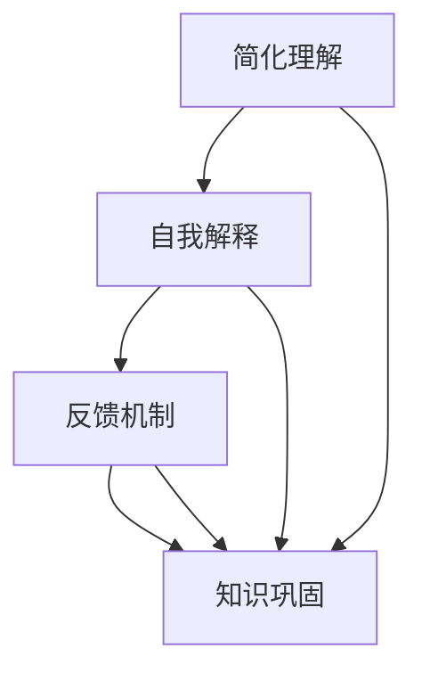

                 

# 费曼提问法促进团队学习与成长

## 1. 背景介绍

### 1.1 问题由来
在当今快速变化的科技环境中，技术团队不断面临新的挑战和问题，如何有效地促进团队成员的学习和成长，成为每个技术管理者关注的焦点。费曼提问法（Feynman Technique）作为一种创新的学习方法，已被广泛应用于科学、教育等多个领域，并逐渐引起IT行业的关注。本文将探讨费曼提问法在IT团队学习和成长中的价值，分析其核心原理和具体操作方法，并通过案例展示其应用效果。

### 1.2 问题核心关键点
费曼提问法，也被称为费曼学习法，是一种基于自我解释和反馈的教学方法。其主要思想是：通过将复杂问题简化为易于理解的问题，并尝试用简洁的语言向他人解释，以检测和纠正自身的理解。该方法旨在通过不断的提问和解答，增强学习者的认知深度和知识广度。

在IT团队中，费曼提问法的应用可以提升团队的技术能力、协作效率和创新能力。具体来说：
- **技术能力**：通过深入理解复杂技术问题，团队成员可以提升问题解决能力和编码水平。
- **协作效率**：促进知识共享和跨团队协作，加速问题的解决和技术的传播。
- **创新能力**：激发团队成员的好奇心和探索精神，推动新技术的创新和应用。

## 2. 核心概念与联系

### 2.1 核心概念概述
费曼提问法由著名物理学家理查德·费曼（Richard Feynman）提出，其核心包括以下几个概念：

- **概念简化**：将复杂问题分解为更小、更易于理解的部分，以便更好地掌握。
- **自我解释**：通过口头或书面形式向他人解释问题，以检测和纠正自己的理解。
- **反馈机制**：通过他人的反馈，及时调整和优化自己的解释和理解。
- **知识巩固**：通过反复提问和解答，加深对知识的理解和记忆。

### 2.2 概念间的关系

费曼提问法的核心概念可以概括为：简化理解、自我解释、反馈迭代和知识巩固。这些概念之间的逻辑关系可以通过以下Mermaid流程图来展示：



这个流程图展示了费曼提问法的基本流程：
1. 首先，简化理解，将复杂问题分解为更小、更易于理解的部分。
2. 接着，自我解释，尝试用简洁的语言向他人解释问题。
3. 然后，通过他人的反馈，调整和优化自己的解释。
4. 最后，通过反复提问和解答，加深对知识的理解和记忆。

## 3. 核心算法原理 & 具体操作步骤
### 3.1 算法原理概述

费曼提问法的核心在于通过简化和解释，增强学习者对知识的理解和记忆。其算法原理主要包括以下几个步骤：

1. **概念选择**：选择一个复杂的技术问题或概念，作为学习和解释的对象。
2. **简化理解**：将问题分解为更小、更易于理解的部分，以便更好地掌握。
3. **自我解释**：用简洁的语言向他人解释问题，检测和纠正自己的理解。
4. **反馈迭代**：根据他人的反馈，调整和优化自己的解释。
5. **知识巩固**：通过反复提问和解答，加深对知识的理解和记忆。

### 3.2 算法步骤详解

以下是费曼提问法在IT团队中的应用详细步骤：

**Step 1: 选择学习内容**
- 团队成员选择感兴趣或需要解决的技术问题，作为学习的主题。
- 问题应具备挑战性和实用性，既能激发学习热情，又能解决实际问题。

**Step 2: 分解问题**
- 将问题分解为更小、更易于理解的部分，例如：理解某个库的原理、实现某个算法等。
- 通过细化问题，使得团队成员更容易入手和掌握。

**Step 3: 自我解释**
- 尝试用简洁的语言向他人解释问题，检测和纠正自己的理解。
- 解释应避免使用技术术语，尽量用通俗易懂的语言描述。
- 可以使用文字、绘图、代码片段等形式进行解释。

**Step 4: 获取反馈**
- 将解释展示给团队成员或同事，获取他们的反馈。
- 反馈应具体、建设性，指出解释中的错误或不足，提出改进建议。
- 团队成员可以采用提问的方式进行反馈，例如：“这里我有些不理解，你能再解释一下吗？”

**Step 5: 优化解释**
- 根据反馈调整和优化自己的解释，确保准确性和清晰度。
- 可能需要进行多次迭代，直到解释被他人完全理解。

**Step 6: 知识巩固**
- 通过反复提问和解答，加深对知识的理解和记忆。
- 可以设立团队知识分享会，定期回顾和讨论所学内容。

### 3.3 算法优缺点

费曼提问法的优点包括：
1. **深入理解**：通过不断的提问和解答，深入理解复杂的技术问题。
2. **知识传播**：促进团队成员之间的知识共享和跨团队协作。
3. **创新能力**：激发团队成员的好奇心和探索精神，推动新技术的创新和应用。

其缺点包括：
1. **时间和成本**：需要花费大量时间和精力进行解释和反馈，对于紧急任务可能不适用。
2. **依赖反馈**：依赖他人的反馈，如果反馈不够建设性，可能影响学习效果。

### 3.4 算法应用领域

费曼提问法在IT团队中的应用领域非常广泛，包括但不限于以下方面：

- **技术培训**：在技术培训中，通过费曼提问法帮助学员深入理解复杂技术，提升学习效果。
- **代码评审**：在代码评审中，通过费曼提问法促进团队成员对代码的理解和讨论，提高代码质量。
- **技术讨论**：在技术讨论中，通过费曼提问法激发创新思维，推动技术探索和应用。
- **知识分享**：在知识分享会中，通过费曼提问法帮助团队成员巩固所学知识，促进知识传播。

## 4. 数学模型和公式 & 详细讲解  
### 4.1 数学模型构建

费曼提问法主要依赖人类的认知和交流能力，其数学模型相对简单。我们可以将其建模为如下形式：

- 设问题为 $Q$，简化理解为 $Q'$，自我解释为 $E$，反馈为 $F$，知识巩固为 $K$。
- 问题简化和自我解释过程可以表示为 $Q' = \text{Simplify}(Q)$，$E = \text{Explain}(Q')$。
- 获取反馈过程可以表示为 $F = \text{GetFeedback}(E)$。
- 知识巩固过程可以表示为 $K = \text{Consolidate}(Q', E, F)$。

### 4.2 公式推导过程

假设 $Q$ 为一个复杂问题，其简化理解为 $Q'$，自我解释为 $E$，反馈为 $F$，知识巩固为 $K$。则费曼提问法的迭代过程可以表示为：

$$
Q' = \text{Simplify}(Q)
$$
$$
E = \text{Explain}(Q')
$$
$$
F = \text{GetFeedback}(E)
$$
$$
Q' = \text{Adjust}(Q', F)
$$
$$
K = \text{Consolidate}(Q', E, F)
$$

其中，$\text{Adjust}(Q', F)$ 表示根据反馈调整问题简化理解，$\text{Consolidate}(Q', E, F)$ 表示将简化理解、自我解释和反馈进行整合，形成新的知识巩固。

### 4.3 案例分析与讲解

假设团队成员需要掌握某个新的机器学习算法，我们可以应用费曼提问法进行学习：

**Step 1: 选择学习内容**
- 选择机器学习算法作为学习主题。

**Step 2: 分解问题**
- 将算法分解为算法原理、代码实现、模型应用等部分。

**Step 3: 自我解释**
- 尝试用简洁的语言向他人解释算法原理和代码实现，检测和纠正自己的理解。

**Step 4: 获取反馈**
- 将解释展示给团队成员或同事，获取他们的反馈。
- 反馈可能包括：“这里有些细节没说清楚，能否再详细解释一下？”

**Step 5: 优化解释**
- 根据反馈调整和优化自己的解释，确保准确性和清晰度。
- 可能需要进行多次迭代，直到解释被他人完全理解。

**Step 6: 知识巩固**
- 通过反复提问和解答，加深对算法的理解和记忆。
- 可以设立团队知识分享会，定期回顾和讨论所学内容。

## 5. 项目实践：代码实例和详细解释说明
### 5.1 开发环境搭建

要进行费曼提问法的实践，首先需要搭建一个适合团队协作的环境。以下是具体的步骤：

**Step 1: 选择工具**
- 选择一个支持远程协作的工具，如Slack、Microsoft Teams等。
- 配置适当的团队频道和讨论组，以便进行有效的知识共享和讨论。

**Step 2: 设置规则**
- 制定明确的知识共享规则，鼓励团队成员积极参与讨论和反馈。
- 定期举办知识分享会，回顾和讨论所学内容。

**Step 3: 工具配置**
- 配置工具以支持文件共享、代码审查、即时消息等功能。
- 利用GitHub等代码托管平台，方便团队成员协作开发和分享代码。

### 5.2 源代码详细实现

以下是一个基于Slack的费曼提问法实践示例，展示了如何通过Slack进行知识分享和讨论：

1. **创建知识分享渠道**
   ```bash
   slack create #knowledge-sharing
   ```

2. **发布学习内容**
   ```bash
   slack post #knowledge-sharing "我正在学习新的机器学习算法，想与大家分享我的理解。"

   # 在帖子中添加详细的解释和代码示例
   ```

3. **获取反馈**
   ```bash
   slack post #knowledge-sharing "小王，你能帮我解释一下这个算法的原理吗？"

   # 小王回复并提出进一步的问题
   ```

4. **优化解释**
   ```bash
   slack post #knowledge-sharing "根据小王的反馈，我调整了算法解释，请再给我一些反馈。"

   # 小王回复并进一步提出问题
   ```

5. **知识巩固**
   ```bash
   slack create #weekly-review
   ```

6. **定期回顾**
   ```bash
   slack post #weekly-review "本周我们回顾了机器学习算法的学习内容，有哪些收获和困惑？"

   # 团队成员积极参与讨论
   ```

### 5.3 代码解读与分析

以下是对费曼提问法实践代码的详细解读：

1. **创建知识分享渠道**
   ```python
   def create_channel(slack, channel_name):
       response = slack.api_call("channels.create", channel_name=channel_name)
       if response["ok"]:
           print(f"Channel '{channel_name}' created successfully.")
       else:
           print(f"Failed to create channel '{channel_name}'.")
   ```

2. **发布学习内容**
   ```python
   def post_content(slack, channel_id, content):
       response = slack.api_call("chat.postMessage", channel=channel_id, text=content)
       if response["ok"]:
           print(f"Content posted to '{channel_id}'.")
       else:
           print(f"Failed to post content to '{channel_id}'.")
   ```

3. **获取反馈**
   ```python
   def ask_feedback(slack, channel_id, feedback_prompt):
       response = slack.api_call("chat.postMessage", channel=channel_id, text=feedback_prompt)
       if response["ok"]:
           print(f"Feedback requested on '{channel_id}'.")
       else:
           print(f"Failed to request feedback on '{channel_id}'.")
   ```

4. **优化解释**
   ```python
   def adjust_explanation(slack, channel_id, explanation, feedback):
       response = slack.api_call("chat.postMessage", channel=channel_id, text=f"反馈内容：{feedback}")
       if response["ok"]:
           print(f"Feedback acknowledged on '{channel_id}'.")
       else:
           print(f"Failed to acknowledge feedback on '{channel_id}'.")
   ```

5. **知识巩固**
   ```python
   def weekly_review(slack, channel_id):
       response = slack.api_call("chat.postMessage", channel=channel_id, text="本周回顾开始。")
       if response["ok"]:
           print(f"Weekly review initiated on '{channel_id}'.")
       else:
           print(f"Failed to initiate weekly review on '{channel_id}'.")
   ```

### 5.4 运行结果展示

假设在一个软件开发团队中，通过Slack进行费曼提问法实践：

1. **知识分享**
   ```
   # 小张在知识分享渠道发布新的机器学习算法学习内容
   slack post #knowledge-sharing "我正在学习新的机器学习算法，想与大家分享我的理解。"

   # 小王回复并提出进一步的问题
   slack post #knowledge-sharing "小张，你能帮我解释一下这个算法的原理吗？"

   # 小张调整解释
   slack post #knowledge-sharing "根据小王的反馈，我调整了算法解释，请再给我一些反馈。"
   ```

2. **知识巩固**
   ```
   # 团队成员定期参加知识分享会，回顾和讨论所学内容
   slack post #weekly-review "本周我们回顾了机器学习算法的学习内容，有哪些收获和困惑？"
   ```

通过以上代码和示例，展示了如何在Slack中实现费曼提问法实践，帮助团队成员提升学习效果，促进知识共享和创新。

## 6. 实际应用场景
### 6.1 智能客服系统

智能客服系统需要处理大量的用户咨询，涉及多个技术和业务领域。通过费曼提问法，智能客服系统团队可以提升技术能力和知识水平，快速响应和解决用户问题：

1. **问题分解**
   - 将复杂问题分解为技术实现、自然语言理解、对话管理等部分。
   - 通过细化问题，使得团队成员更容易入手和掌握。

2. **自我解释**
   - 尝试用简洁的语言向同事解释技术问题和算法实现，检测和纠正自己的理解。

3. **获取反馈**
   - 将解释展示给团队成员或同事，获取他们的反馈。
   - 反馈可能包括：“这里有些细节没说清楚，能否再详细解释一下？”

4. **优化解释**
   - 根据反馈调整和优化自己的解释，确保准确性和清晰度。
   - 可能需要进行多次迭代，直到解释被他人完全理解。

5. **知识巩固**
   - 通过反复提问和解答，加深对问题的理解和记忆。
   - 可以设立团队知识分享会，定期回顾和讨论所学内容。

### 6.2 金融科技

金融科技领域涉及复杂的算法和数据处理，团队成员需要不断学习和掌握新知识。通过费曼提问法，金融科技团队可以提升技术能力和创新能力：

1. **问题分解**
   - 将复杂的金融算法和数据处理问题分解为算法原理、数据预处理、模型训练等部分。
   - 通过细化问题，使得团队成员更容易入手和掌握。

2. **自我解释**
   - 尝试用简洁的语言向同事解释金融算法和数据处理流程，检测和纠正自己的理解。

3. **获取反馈**
   - 将解释展示给团队成员或同事，获取他们的反馈。
   - 反馈可能包括：“这里有些细节没说清楚，能否再详细解释一下？”

4. **优化解释**
   - 根据反馈调整和优化自己的解释，确保准确性和清晰度。
   - 可能需要进行多次迭代，直到解释被他人完全理解。

5. **知识巩固**
   - 通过反复提问和解答，加深对金融算法和数据处理流程的理解和记忆。
   - 可以设立团队知识分享会，定期回顾和讨论所学内容。

### 6.3 企业信息化

企业信息化涉及大量的技术架构和业务流程优化，团队成员需要不断学习和掌握新知识。通过费曼提问法，企业信息化团队可以提升技术能力和创新能力：

1. **问题分解**
   - 将复杂的技术架构和业务流程问题分解为技术实现、数据整合、系统集成等部分。
   - 通过细化问题，使得团队成员更容易入手和掌握。

2. **自我解释**
   - 尝试用简洁的语言向同事解释技术架构和业务流程，检测和纠正自己的理解。

3. **获取反馈**
   - 将解释展示给团队成员或同事，获取他们的反馈。
   - 反馈可能包括：“这里有些细节没说清楚，能否再详细解释一下？”

4. **优化解释**
   - 根据反馈调整和优化自己的解释，确保准确性和清晰度。
   - 可能需要进行多次迭代，直到解释被他人完全理解。

5. **知识巩固**
   - 通过反复提问和解答，加深对技术架构和业务流程的理解和记忆。
   - 可以设立团队知识分享会，定期回顾和讨论所学内容。

## 7. 工具和资源推荐
### 7.1 学习资源推荐

为了帮助开发者系统掌握费曼提问法的应用，这里推荐一些优质的学习资源：

1. **《费曼学习法：通过思考与理解提升学习效率》**：介绍费曼提问法的核心思想和操作步骤，并提供了具体的实践案例。
2. **Coursera的《学习科学和设计》课程**：包含关于学习理论和实践的教学内容，涵盖费曼提问法在内的多种学习方法。
3. **Udemy的《费曼学习法：掌握高效学习技巧》课程**：深入浅出地介绍了费曼提问法的原理和应用，适合初学者。

### 7.2 开发工具推荐

要进行费曼提问法的实践，选择合适的工具非常重要。以下是几款常用的工具：

1. **Slack**：支持即时消息、文件共享、代码审查等功能，适合团队协作和知识共享。
2. **Microsoft Teams**：支持即时消息、文件共享、代码审查等功能，适合远程协作和知识共享。
3. **Zoom**：支持视频会议、屏幕共享、实时讨论等功能，适合远程会议和知识分享会。
4. **Google Docs**：支持文档编辑、评论、共享等功能，适合团队协作和知识记录。

### 7.3 相关论文推荐

以下是几篇关于费曼提问法的经典论文，推荐阅读：

1. **《费曼学习法：一种创新的学习方法》**：详细介绍了费曼提问法的核心思想和操作步骤。
2. **《费曼学习法在教育中的应用》**：介绍了费曼提问法在教育领域的应用效果，提供了具体的实践案例。
3. **《费曼学习法在科技公司中的应用》**：介绍了费曼提问法在科技公司中的实际应用，分享了经验与教训。

## 8. 总结：未来发展趋势与挑战
### 8.1 总结

本文对费曼提问法在IT团队学习和成长中的价值进行了详细探讨，分析了其核心原理和具体操作步骤。通过分析实际应用场景和案例，展示了费曼提问法在多个领域的广泛应用。最后，推荐了相关的学习资源、开发工具和论文，为费曼提问法的实践提供了全面的指导。

通过本文的系统梳理，可以看到，费曼提问法是一种高效、灵活的学习方法，有助于团队成员深入理解复杂问题，提升技术能力和协作效率。在IT团队中，费曼提问法不仅能提升团队成员的学习效果，还能促进知识共享和创新，助力企业实现技术突破和业务升级。

### 8.2 未来发展趋势

展望未来，费曼提问法将在多个方面迎来新的发展：

1. **技术集成**：与其他学习工具和技术平台集成，提升学习效果。例如，结合在线课程平台和知识管理系统，形成更全面的学习生态。
2. **数据驱动**：利用数据分析和机器学习技术，优化学习路径和反馈机制，提高学习效率。
3. **多模态学习**：结合文字、视频、音频等多模态学习形式，丰富学习体验，提升学习效果。
4. **社交化学习**：在社交媒体、知识共享平台等场景中推广费曼提问法，扩大其影响力和应用范围。

### 8.3 面临的挑战

尽管费曼提问法在多个领域取得了显著效果，但在推广和应用过程中仍面临以下挑战：

1. **文化差异**：不同团队和组织的文化背景、沟通习惯不同，费曼提问法的效果可能有所差异。
2. **时间投入**：费曼提问法需要投入大量时间和精力进行解释和反馈，可能影响日常工作。
3. **反馈质量**：依赖他人的反馈，如果反馈不够建设性，可能影响学习效果。
4. **技术门槛**：部分团队成员可能对技术解释和反馈有较高要求，难以达到理想效果。

### 8.4 研究展望

未来，对于费曼提问法的深入研究和应用，可以从以下几个方向进行探索：

1. **改进学习路径**：结合机器学习和数据分析，优化学习路径和反馈机制，提高学习效率。
2. **多模态学习**：结合文字、视频、音频等多模态学习形式，丰富学习体验，提升学习效果。
3. **社交化学习**：在社交媒体、知识共享平台等场景中推广费曼提问法，扩大其影响力和应用范围。
4. **跨领域应用**：将费曼提问法应用于更多领域，如医疗、法律、艺术等，探索其在不同领域的应用效果和改进策略。

总之，费曼提问法作为一种创新的学习方法，已在多个领域展现出巨大的潜力和应用价值。通过不断优化和改进，费曼提问法必将在未来的学习和教育领域发挥更大的作用，推动人类认知智能的发展。

## 9. 附录：常见问题与解答
----------------------------------------------------------------

**Q1: 费曼提问法是否适用于所有学习场景？**

A: 费曼提问法适用于任何需要深入理解复杂问题的学习场景，特别是在技术领域。但在某些简单的学习场景中，费曼提问法可能显得过于繁琐。

**Q2: 如何进行高效的费曼提问法实践？**

A: 高效的费曼提问法实践需要以下步骤：
1. 选择合适的学习内容。
2. 将问题分解为更小、更易于理解的部分。
3. 尝试用简洁的语言向他人解释问题。
4. 获取他人的反馈，并根据反馈调整和优化解释。
5. 通过反复提问和解答，加深对知识的理解和记忆。

**Q3: 费曼提问法是否需要大量的时间投入？**

A: 费曼提问法需要投入大量时间和精力进行解释和反馈，但可以显著提升学习效果。对于紧急任务，可以适当简化操作，保持团队协作的平衡。

**Q4: 如何确保费曼提问法的反馈质量？**

A: 确保反馈质量的关键在于建立建设性的反馈文化。团队成员应积极参与讨论，提出具体、建设性的反馈，避免泛泛而谈。

**Q5: 费曼提问法在团队中的应用效果如何？**

A: 费曼提问法在团队中的应用效果显著，可以提升技术能力和协作效率，激发团队成员的好奇心和探索精神，推动技术创新。

总之，费曼提问法作为一种创新的学习方法，在IT团队中具有广泛的应用前景和显著的学习效果。通过不断优化和改进，费曼提问法必将在未来的学习和教育领域发挥更大的作用，推动人类认知智能的发展。

