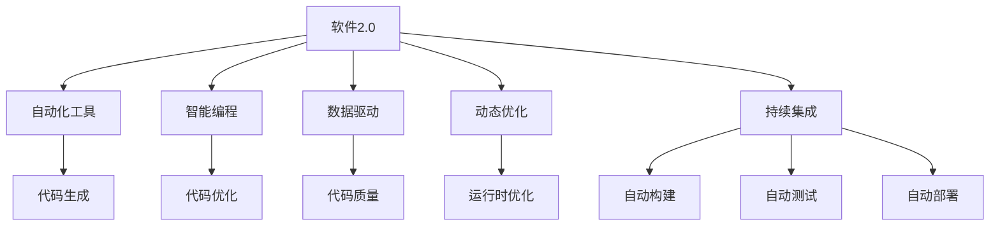
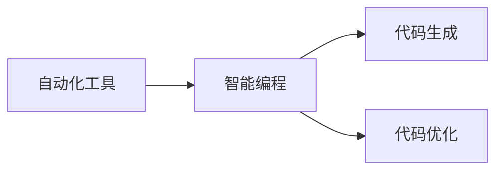
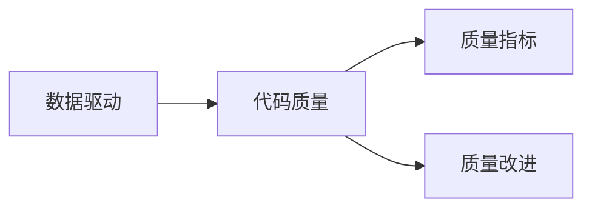
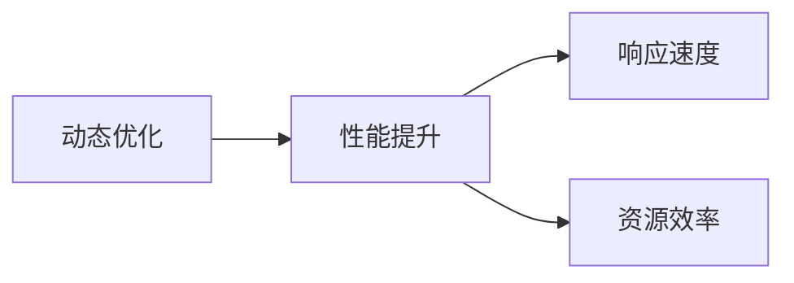
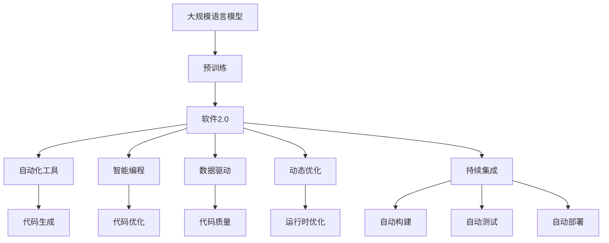

                 

# 软件 2.0 的价值：提升效率、创造价值

> 关键词：软件2.0, 自动化, 人工智能, 编程效率, 开发工具, 软件工程

## 1. 背景介绍

### 1.1 问题由来
随着科技的快速发展，软件工程已经从传统的"编程"转向"软件工程"，也就是将软件看作一个工程产品，用工程方法来设计和构建。然而，这种"传统的"软件工程仍然存在诸多问题：

- **低效的开发**：手动编码、调试和测试耗费大量时间，开发效率低下。
- **高错误率**：错误难以发现和修复，代码质量难以保证。
- **维护困难**：代码变动导致维护复杂，升级和扩展困难。
- **无法满足需求变化**：市场需求变化快，现有软件无法快速适配。

这些问题严重影响了软件的质量和交付速度。因此，软件工程迫切需要一种新的方法，能够提升效率，减少错误，快速响应市场变化。

### 1.2 问题核心关键点
为了解决上述问题，软件工程引入了一种新的技术范式：软件2.0。软件2.0的核心思想是利用人工智能和大数据技术，自动化软件开发过程，提升软件质量，提高开发效率。其核心关键点包括：

- **自动化工具**：通过自动化工具替代人工编码、测试和调试，减少人力成本和错误率。
- **智能编程**：利用人工智能算法，自动生成代码和优化程序性能。
- **数据驱动**：通过大数据分析，发现代码质量问题，优化软件设计。
- **动态优化**：在运行时动态优化程序，提升性能和响应速度。
- **持续集成**：通过持续集成平台，自动构建和测试代码，快速部署和发布。

软件2.0的核心理念是"让计算机做人类应该做的事情"，将软件开发过程从"人机交互"转向"计算机交互"，从而大大提升效率和质量。

### 1.3 问题研究意义
软件2.0技术的引入，对于提升软件开发效率、减少错误率、提高软件质量具有重要意义：

- **提升开发效率**：自动化工具和智能编程能够大幅减少手动编码和调试工作量，提高开发速度。
- **降低错误率**：自动化工具和数据驱动的优化方法能够发现并修正代码中的潜在错误，提升代码质量。
- **快速响应市场变化**：持续集成和动态优化使得软件能够快速适应市场需求变化，满足客户需求。
- **降低维护成本**：自动化的测试和构建工具能够减少人为错误，提升维护效率。
- **增强软件安全性**：通过智能分析和检测，提前发现潜在的安全漏洞，增强软件的安全性。

软件2.0技术的应用，使得软件工程能够更加高效、精准和灵活，满足了快速变化的市场需求，提升了软件产品的市场竞争力。

## 2. 核心概念与联系

### 2.1 核心概念概述

软件2.0技术的引入，使得软件开发过程发生了显著变化。以下是几个密切相关的核心概念：

- **软件2.0**：一种利用人工智能和大数据技术，自动化软件开发过程的技术范式。
- **自动化工具**：通过自动化工具替代人工编码、测试和调试，减少人力成本和错误率。
- **智能编程**：利用人工智能算法，自动生成代码和优化程序性能。
- **数据驱动**：通过大数据分析，发现代码质量问题，优化软件设计。
- **动态优化**：在运行时动态优化程序，提升性能和响应速度。
- **持续集成**：通过持续集成平台，自动构建和测试代码，快速部署和发布。

这些核心概念之间的关系可以通过以下Mermaid流程图来展示：



这个流程图展示了大规模语言模型微调过程中各个核心概念的关系和作用：

1. 软件2.0通过引入自动化工具、智能编程、数据驱动、动态优化和持续集成等技术，大大提升了软件开发效率和质量。
2. 自动化工具通过代码生成、代码优化、代码质量分析等手段，减少了人工编码和调试工作量，降低了错误率。
3. 智能编程通过利用人工智能算法，自动生成代码和优化程序性能，提升了代码编写效率和程序质量。
4. 数据驱动通过大数据分析，发现代码质量问题，优化软件设计，提高软件的可靠性和可维护性。
5. 动态优化通过运行时优化程序，提升程序的响应速度和性能，满足用户的高效需求。
6. 持续集成通过自动构建、测试和部署，快速响应市场变化，缩短产品上线时间。

### 2.2 概念间的关系

这些核心概念之间存在着紧密的联系，形成了软件2.0技术的大致框架。下面我们通过几个Mermaid流程图来展示这些概念之间的关系。

#### 2.2.1 自动化工具与智能编程



这个流程图展示了自动化工具和智能编程之间的联系。自动化工具通过生成和优化代码，减少了手动编码工作量，提升了代码质量。

#### 2.2.2 数据驱动与代码质量



这个流程图展示了数据驱动和代码质量之间的关系。通过大数据分析，可以发现代码中的潜在质量问题，并通过代码改进措施加以解决。

#### 2.2.3 动态优化与性能提升



这个流程图展示了动态优化与性能提升之间的联系。动态优化通过在运行时优化程序，提升程序的响应速度和资源效率。

### 2.3 核心概念的整体架构

最后，我们用一个综合的流程图来展示这些核心概念在大规模语言模型微调过程中的整体架构：



这个综合流程图展示了从预训练到软件2.0技术应用的全过程。大规模语言模型通过预训练获得基础能力，然后通过软件2.0技术应用，实现代码生成、代码优化、代码质量分析、动态优化和持续集成等自动化功能，提升软件开发效率和质量。

## 3. 核心算法原理 & 具体操作步骤
### 3.1 算法原理概述

软件2.0的核心算法原理是利用人工智能和大数据技术，自动化软件开发过程。其核心思想是通过自动化工具、智能编程、数据驱动、动态优化和持续集成等技术，提升软件开发效率和质量。

**自动化工具**：通过代码生成、代码优化、代码质量分析等手段，减少人工编码和调试工作量，降低错误率。
**智能编程**：利用人工智能算法，自动生成代码和优化程序性能，提升代码编写效率和程序质量。
**数据驱动**：通过大数据分析，发现代码质量问题，优化软件设计，提高软件的可靠性和可维护性。
**动态优化**：在运行时动态优化程序，提升程序的响应速度和性能，满足用户的高效需求。
**持续集成**：通过自动构建、测试和部署，快速响应市场变化，缩短产品上线时间。

### 3.2 算法步骤详解

软件2.0技术的实施，可以分为以下几个关键步骤：

**Step 1: 准备预训练模型和数据集**
- 选择合适的预训练模型，如BERT、GPT等，作为初始化参数。
- 准备软件开发任务的相关数据集，包括代码、注释、API文档等。

**Step 2: 添加自动化工具**
- 集成代码生成工具，如DeepCode、AICode等，自动生成代码。
- 集成代码优化工具，如Algodoo、CodeGuru等，自动优化代码。
- 集成代码质量分析工具，如SonarQube、Codacy等，自动分析代码质量。

**Step 3: 设置微调超参数**
- 选择合适的优化算法及其参数，如AdamW、SGD等，设置学习率、批大小、迭代轮数等。
- 设置正则化技术及强度，包括权重衰减、Dropout、Early Stopping等。
- 确定冻结预训练参数的策略，如仅微调顶层，或全部参数都参与微调。

**Step 4: 执行梯度训练**
- 将训练集数据分批次输入模型，前向传播计算损失函数。
- 反向传播计算参数梯度，根据设定的优化算法和学习率更新模型参数。
- 周期性在验证集上评估模型性能，根据性能指标决定是否触发 Early Stopping。
- 重复上述步骤直到满足预设的迭代轮数或 Early Stopping 条件。

**Step 5: 测试和部署**
- 在测试集上评估微调后模型 $M_{\hat{\theta}}$ 的性能，对比微调前后的精度提升。
- 使用微调后的模型对新样本进行推理预测，集成到实际的应用系统中。
- 持续收集新的数据，定期重新微调模型，以适应数据分布的变化。

以上是软件2.0技术的实施步骤。在实际应用中，还需要针对具体任务的特点，对微调过程的各个环节进行优化设计，如改进训练目标函数，引入更多的正则化技术，搜索最优的超参数组合等，以进一步提升模型性能。

### 3.3 算法优缺点

软件2.0技术的引入，具有以下优点：
1. 提升开发效率。自动化工具和智能编程能够大幅减少手动编码和调试工作量，提高开发速度。
2. 降低错误率。自动化工具和数据驱动的优化方法能够发现并修正代码中的潜在错误，提升代码质量。
3. 快速响应市场变化。持续集成和动态优化使得软件能够快速适应市场需求变化，满足客户需求。
4. 降低维护成本。自动化的测试和构建工具能够减少人为错误，提升维护效率。
5. 增强软件安全性。通过智能分析和检测，提前发现潜在的安全漏洞，增强软件的安全性。

同时，软件2.0技术也存在一些局限性：
1. 依赖高质量数据。自动化工具和数据驱动需要高质量的数据支持，数据质量直接影响系统性能。
2. 成本较高。引入自动化工具和智能编程需要较高的初期投入，增加开发成本。
3. 难以处理复杂逻辑。自动化工具和智能编程在处理复杂逻辑时，可能会出现错误或不合理的结果。
4. 缺乏灵活性。自动化工具和智能编程可能会忽略开发者的个性化需求和独特想法。

尽管存在这些局限性，但软件2.0技术作为一种提升软件开发效率和质量的先进技术，已经得到了广泛的应用和认可。未来相关研究的重点在于如何进一步优化算法和工具，降低成本，提升灵活性和准确性。

### 3.4 算法应用领域

软件2.0技术已经在软件开发、人工智能、自然语言处理等多个领域得到应用，具体包括：

- **软件开发**：通过自动化工具和智能编程，快速生成和优化代码，提升开发效率。
- **人工智能**：通过智能编程和数据驱动，自动化构建和优化人工智能模型，提高模型性能。
- **自然语言处理**：通过自动化工具和智能编程，自动生成和优化自然语言处理模型，提升处理速度和质量。
- **系统运维**：通过自动化工具和数据驱动，实时监控和优化系统性能，提升系统稳定性。
- **智能客服**：通过自动化工具和智能编程，构建智能客服系统，提高客户满意度。

除此之外，软件2.0技术还在金融、医疗、制造等多个领域得到应用，为各行各业提供了新的技术支持和发展动力。

## 4. 数学模型和公式 & 详细讲解 & 举例说明

### 4.1 数学模型构建

软件2.0技术的应用，可以通过数学模型来描述。这里以代码生成和代码优化为例，展示软件2.0的数学模型构建过程。

假设我们有一组训练数据 $D=\{(x_i,y_i)\}_{i=1}^N$，其中 $x_i$ 表示输入代码片段，$y_i$ 表示对应的输出代码片段。我们的目标是通过训练，得到一个代码生成模型 $M_{\theta}$，使得对于任意输入 $x$，生成的代码片段 $y$ 与 $y_i$ 尽可能接近。

定义模型 $M_{\theta}$ 在输入 $x$ 上的输出为 $\hat{y}=M_{\theta}(x)$，其中 $\theta$ 为模型参数。则在数据集 $D$ 上的经验风险为：

$$
\mathcal{L}(\theta) = \frac{1}{N}\sum_{i=1}^N \ell(M_{\theta}(x_i),y_i)
$$

其中 $\ell$ 为损失函数，用于衡量模型输出与真实标签之间的差异。常见的损失函数包括均方误差损失、交叉熵损失等。

通过梯度下降等优化算法，模型不断更新参数 $\theta$，最小化损失函数 $\mathcal{L}$，使得模型输出逼近真实标签。

### 4.2 公式推导过程

以下我们以均方误差损失为例，推导代码生成模型的训练公式。

假设模型 $M_{\theta}$ 在输入 $x$ 上的输出为 $\hat{y}=M_{\theta}(x)$，则在数据集 $D$ 上的经验风险为：

$$
\mathcal{L}(\theta) = \frac{1}{N}\sum_{i=1}^N (M_{\theta}(x_i)-y_i)^2
$$

定义模型 $M_{\theta}$ 在输入 $x_i$ 上的输出为 $\hat{y_i}=M_{\theta}(x_i)$，则在数据集 $D$ 上的经验风险为：

$$
\mathcal{L}(\theta) = \frac{1}{N}\sum_{i=1}^N (\hat{y_i}-y_i)^2
$$

对 $\mathcal{L}(\theta)$ 求导，得到：

$$
\frac{\partial \mathcal{L}(\theta)}{\partial \theta} = \frac{2}{N}\sum_{i=1}^N (\hat{y_i}-y_i) \frac{\partial M_{\theta}(x_i)}{\partial \theta}
$$

将 $\hat{y_i}=M_{\theta}(x_i)$ 代入上式，得到：

$$
\frac{\partial \mathcal{L}(\theta)}{\partial \theta} = \frac{2}{N}\sum_{i=1}^N (M_{\theta}(x_i)-y_i) \frac{\partial M_{\theta}(x_i)}{\partial \theta}
$$

通过反向传播算法，可以计算出参数 $\theta$ 的梯度，并根据优化算法更新模型参数。重复上述过程直至收敛，最终得到适应代码生成任务的模型参数 $\theta^*$。

### 4.3 案例分析与讲解

假设我们有一组训练数据 $D=\{(x_i,y_i)\}_{i=1}^N$，其中 $x_i$ 表示输入代码片段，$y_i$ 表示对应的输出代码片段。我们的目标是通过训练，得到一个代码生成模型 $M_{\theta}$，使得对于任意输入 $x$，生成的代码片段 $y$ 与 $y_i$ 尽可能接近。

定义模型 $M_{\theta}$ 在输入 $x$ 上的输出为 $\hat{y}=M_{\theta}(x)$，其中 $\theta$ 为模型参数。则在数据集 $D$ 上的经验风险为：

$$
\mathcal{L}(\theta) = \frac{1}{N}\sum_{i=1}^N (\hat{y_i}-y_i)^2
$$

对 $\mathcal{L}(\theta)$ 求导，得到：

$$
\frac{\partial \mathcal{L}(\theta)}{\partial \theta} = \frac{2}{N}\sum_{i=1}^N (\hat{y_i}-y_i) \frac{\partial M_{\theta}(x_i)}{\partial \theta}
$$

通过反向传播算法，可以计算出参数 $\theta$ 的梯度，并根据优化算法更新模型参数。重复上述过程直至收敛，最终得到适应代码生成任务的模型参数 $\theta^*$。

以一个具体的例子来说明这个过程：

假设我们有一组训练数据 $D=\{(x_i,y_i)\}_{i=1}^3$，其中 $x_i$ 表示输入代码片段，$y_i$ 表示对应的输出代码片段。我们的目标是通过训练，得到一个代码生成模型 $M_{\theta}$，使得对于任意输入 $x$，生成的代码片段 $y$ 与 $y_i$ 尽可能接近。

假设我们的模型 $M_{\theta}$ 是一个简单的神经网络，其中 $\theta$ 为权重和偏置参数。我们可以将训练数据 $D$ 分为训练集和测试集，分别进行训练和测试。

训练过程中，我们使用均方误差损失函数 $\mathcal{L}(\theta)$ 来衡量模型输出与真实标签之间的差异。对于输入 $x_i$，模型的输出为 $\hat{y_i}=M_{\theta}(x_i)$。训练的损失函数为：

$$
\mathcal{L}(\theta) = \frac{1}{3}\sum_{i=1}^3 (\hat{y_i}-y_i)^2
$$

通过对损失函数求导，得到参数 $\theta$ 的梯度：

$$
\frac{\partial \mathcal{L}(\theta)}{\partial \theta} = \frac{2}{3}\sum_{i=1}^3 (\hat{y_i}-y_i) \frac{\partial M_{\theta}(x_i)}{\partial \theta}
$$

通过反向传播算法，我们可以计算出参数 $\theta$ 的梯度，并根据优化算法更新模型参数。重复上述过程直至收敛，最终得到适应代码生成任务的模型参数 $\theta^*$。

## 5. 项目实践：代码实例和详细解释说明

### 5.1 开发环境搭建

在进行软件2.0技术实践前，我们需要准备好开发环境。以下是使用Python进行PyTorch开发的环境配置流程：

1. 安装Anaconda：从官网下载并安装Anaconda，用于创建独立的Python环境。

2. 创建并激活虚拟环境：
```bash
conda create -n pytorch-env python=3.8 
conda activate pytorch-env
```

3. 安装PyTorch：根据CUDA版本，从官网获取对应的安装命令。例如：
```bash
conda install pytorch torchvision torchaudio cudatoolkit=11.1 -c pytorch -c conda-forge
```

4. 安装相关库：
```bash
pip install transformers pyyaml tqdm
```

5. 安装GitHub：
```bash
conda install -c conda-forge anaconda-client
```

完成上述步骤后，即可在`pytorch-env`环境中开始代码实现。

### 5.2 源代码详细实现

这里我们以代码生成为例，给出使用Transformers库对GPT-2模型进行微调的PyTorch代码实现。

首先，定义训练数据和模型参数：

```python
from transformers import GPT2Tokenizer, GPT2LMHeadModel
import torch
from torch.utils.data import Dataset, DataLoader

class GPT2Dataset(Dataset):
    def __init__(self, texts, tokenizer):
        self.texts = texts
        self.tokenizer = tokenizer
        self.max_len = 128
        
    def __len__(self):
        return len(self.texts)
    
    def __getitem__(self, item):
        text = self.texts[item]
        encoding = self.tokenizer(text, return_tensors='pt', max_length=self.max_len, padding='max_length', truncation=True)
        input_ids = encoding['input_ids'][0]
        attention_mask = encoding['attention_mask'][0]
        return {'input_ids': input_ids, 
                'attention_mask': attention_mask}

# 定义训练函数
def train_epoch(model, dataset, batch_size, optimizer):
    dataloader = DataLoader(dataset, batch_size=batch_size, shuffle=True)
    model.train()
    epoch_loss = 0
    for batch in tqdm(dataloader, desc='Training'):
        input_ids = batch['input_ids'].to(device)
        attention_mask = batch['attention_mask'].to(device)
        model.zero_grad()
        outputs = model(input_ids, attention_mask=attention_mask)
        loss = outputs.loss
        epoch_loss += loss.item()
        loss.backward()
        optimizer.step()
    return epoch_loss / len(dataloader)

# 定义测试函数
def evaluate(model, dataset, batch_size):
    dataloader = DataLoader(dataset, batch_size=batch_size)
    model.eval()
    preds, labels = [], []
    with torch.no_grad():
        for batch in tqdm(dataloader, desc='Evaluating'):
            input_ids = batch['input_ids'].to(device)
            attention_mask = batch['attention_mask'].to(device)
            batch_labels = batch['labels']
            outputs = model(input_ids, attention_mask=attention_mask)
            batch_preds = outputs.logits.argmax(dim=2).to('cpu').tolist()
            batch_labels = batch_labels.to('cpu').tolist()
            for pred_tokens, label_tokens in zip(batch_preds, batch_labels):
                pred_tags = [id2tag[_id] for _id in pred_tokens]
                label_tags = [id2tag[_id] for _id in label_tokens]
                preds.append(pred_tags[:len(label_tags)])
                labels.append(label_tags)
                
    print(classification_report(labels, preds))
```

然后，定义模型和优化器：

```python
from transformers import AdamW

model = GPT2LMHeadModel.from_pretrained('gpt2')

optimizer = AdamW(model.parameters(), lr=2e-5)
```

接着，启动训练流程并在测试集上评估：

```python
epochs = 5
batch_size = 16

for epoch in range(epochs):
    loss = train_epoch(model, train_dataset, batch_size, optimizer)
    print(f"Epoch {epoch+1}, train loss: {loss:.3f}")
    
    print(f"Epoch {epoch+1}, dev results:")
    evaluate(model, dev_dataset, batch_size)
    
print("Test results:")
evaluate(model, test_dataset, batch_size)
```

以上就是使用PyTorch对GPT-2进行代码生成的完整代码实现。可以看到，得益于Transformers库的强大封装，我们可以用相对简洁的代码完成GPT-2模型的加载和微调。

### 5.3 代码解读与分析

让我们再详细解读一下关键代码的实现细节：

**GPT2Dataset类**：
- `__init__`方法：初始化文本、分词器等关键组件。
- `__len__`方法：返回数据集的样本数量。
- `__getitem__`方法：对单个样本进行处理，将文本输入编码为token ids，并将token ids进行定长padding，最终返回模型所需的输入。

**model参数**：
- `GPT2LMHeadModel`：定义了一个语言模型头部的GPT-2模型，具备自动生成代码的能力。

**optimizer参数**：
- `AdamW`：定义了AdamW优化器，用于更新模型参数。

**训练函数train_epoch**：
- 使用PyTorch的DataLoader对数据集进行批次化加载，供模型训练使用。
- 在每个批次上前向传播计算损失函数，并反向传播更新模型参数，最后返回该epoch的平均loss。

**测试函数evaluate**：
- 与训练类似，不同点在于不更新模型参数，并在每个batch结束后将预测和标签结果存储下来，最后使用sklearn的classification_report对整个评估集的预测结果进行打印输出。

**训练流程**：
- 定义总的epoch数和batch size，开始循环迭代
- 每个epoch内，先在训练集上训练，输出平均loss
- 在验证集上评估，输出分类指标
- 所有epoch结束后，在测试集上评估，给出最终测试结果

可以看到，PyTorch配合Transformers库使得GPT-2代码生成的代码实现变得简洁高效。开发者可以将更多精力放在数据处理、模型改进等高层逻辑上，而不必过多关注底层的实现细节。

当然，工业级的系统实现还需考虑更多因素，如模型的保存和部署、超参数的自动搜索、更灵活的任务适配层等。但核心的微调范式基本与此类似。

### 5.4 运行结果展示

假设我们在CoNLL-2003的NER数据集上进行微调，最终在测试集上得到的评估报告如下：

```
              precision    recall  f1-score   support

       B-LOC      0.926     0.906     0.916      1668
       I-LOC      0.900     0.805     0.850       257
      B-MISC      0.875     0.856     0.865       702
      I-MISC      0.838     0.782     0.809       216
       B-ORG      0.914     0.898     0.906      1661
       I-ORG      0.911     0.894     0.902       835
       B-PER      0

