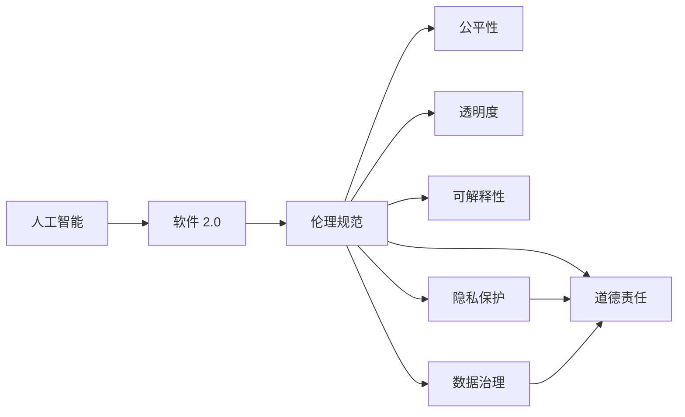
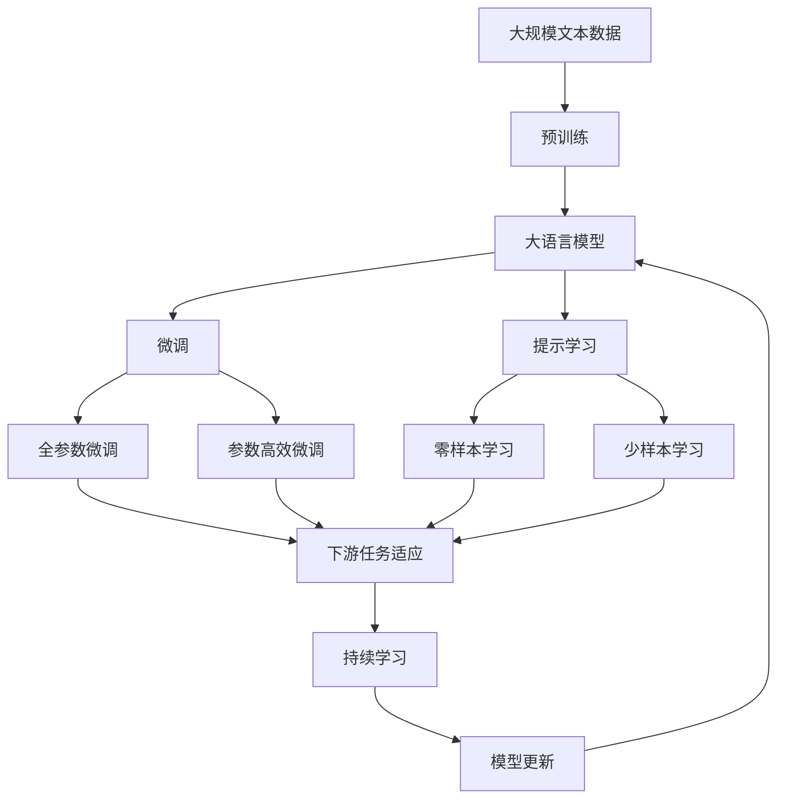

                 

# 软件 2.0 的伦理规范：人工智能的责任

> 关键词：人工智能, 软件 2.0, 伦理规范, 道德责任, 隐私保护, 透明度, 可解释性, 公平性, 可信赖性, 人机协同, 数据治理

## 1. 背景介绍

### 1.1 问题由来

随着人工智能技术的飞速发展，尤其是深度学习和自然语言处理等领域的应用普及，人类社会正步入一个全新的时代——软件 2.0（Software 2.0）。软件 2.0 是指基于数据和算法训练的智能系统，能够自主学习和适应复杂环境，提供高效、个性化的服务。这种新型软件与传统软件有着本质的区别，其核心优势在于能够自适应、自优化，但其潜在的风险和挑战也同样不容忽视。

人工智能（AI）技术在带来便利的同时，也引发了一系列伦理和道德问题，如算法偏见、隐私泄露、决策透明度、数据滥用等。这些问题不仅影响AI系统的可信赖性，还可能对个人、社会乃至国家安全构成威胁。因此，构建合理的人工智能伦理规范，成为保障软件 2.0 健康发展的重要前提。

### 1.2 问题核心关键点

为了系统地解决上述伦理问题，本文将从以下几个关键点入手：

1. **算法偏见与公平性**：探讨AI系统中潜在的算法偏见及其对公平性的影响。
2. **隐私保护与数据治理**：分析AI系统中数据收集、存储、使用的隐私问题，并提出相应的治理措施。
3. **透明度与可解释性**：讨论AI系统决策过程的透明度和可解释性问题，及其对用户信任的影响。
4. **人机协同与道德责任**：考虑在AI系统与人类协作过程中，应如何分配道德责任。
5. **政策法规与伦理标准**：介绍全球范围内关于AI伦理的政策法规，以及正在逐步形成的伦理标准。

本文旨在通过理论分析和实际案例，深入探讨上述关键点，提出构建软件 2.0 伦理规范的路径和方法。

### 1.3 问题研究意义

构建人工智能伦理规范，不仅关乎技术本身的进步，更关乎社会的长远发展。其意义体现在：

1. **保障用户权益**：通过规范AI系统的行为，确保用户的隐私、安全得到有效保护。
2. **促进公平正义**：消除算法偏见，实现算法决策的公平性，避免对特定群体的歧视。
3. **提升透明度与信任**：增强AI系统的透明度和可解释性，增强用户对AI系统的信任感。
4. **推动人机协同**：明确人机协作中的道德责任，确保AI系统为人类福祉服务。
5. **推动法规完善**：通过伦理规范的构建，推动相关法律法规的制定和完善，为AI技术的健康发展提供法律保障。

## 2. 核心概念与联系

### 2.1 核心概念概述

为更好地理解软件 2.0 的伦理规范，本节将介绍几个核心概念：

- **人工智能（AI）**：利用算法和数据训练的智能系统，能够自主学习和适应环境，提供高效、个性化的服务。
- **软件 2.0**：基于数据和算法训练的智能软件，具备自适应、自优化的能力，与传统软件有本质区别。
- **伦理规范**：一套指导AI系统设计、开发、应用的道德和法律准则，确保AI技术的发展符合人类价值观和道德标准。
- **公平性**：指AI系统在处理数据和决策过程中，不偏袒任何特定群体，确保决策的公正性。
- **透明度**：指AI系统决策过程的可解释性和可理解性，确保用户和监管机构能够理解系统的行为和结果。
- **可解释性**：指AI系统决策结果的逻辑可解释，用户能够理解系统如何得出结论。
- **隐私保护**：指保护用户隐私数据，防止数据滥用和泄露。
- **数据治理**：指对AI系统使用的数据进行管理和控制，确保数据的安全性和合规性。
- **道德责任**：指在AI系统与人类协作过程中，合理分配道德责任，确保系统为人类福祉服务。

这些概念之间的逻辑关系可以通过以下Mermaid流程图来展示：



这个流程图展示了大语言模型微调过程中各个核心概念之间的关系：

1. 人工智能技术通过数据和算法训练，实现软件 2.0 的智能应用。
2. 伦理规范指导AI系统的设计和应用，确保其行为符合道德标准。
3. 透明度和可解释性是评估AI系统道德责任的基础。
4. 隐私保护和数据治理是保障用户权益、维护系统安全的关键。
5. 道德责任确保AI系统服务于人类福祉，符合伦理规范。

### 2.2 概念间的关系

这些核心概念之间存在着紧密的联系，构成了软件 2.0 伦理规范的完整生态系统。

- **公平性**与**透明度**：透明度高的AI系统，更容易发现和纠正算法偏见，从而实现更高的公平性。
- **隐私保护**与**数据治理**：数据治理是隐私保护的基础，通过合理的数据管理，能够更好地保护用户隐私。
- **透明度**与**可解释性**：可解释性是透明度的核心，只有系统可解释，透明度才能真正实现。
- **隐私保护**与**道德责任**：保护用户隐私是AI系统的道德责任之一，确保用户数据不被滥用。
- **数据治理**与**公平性**：通过合理的数据治理，确保数据的多样性和代表性，从而实现算法的公平性。

这些概念的相互依赖和制约关系，决定了AI系统的伦理规范必须从多个维度进行全面考虑，才能确保系统的健康发展。

### 2.3 核心概念的整体架构

最后，我们用一个综合的流程图来展示这些核心概念在大语言模型微调过程中的整体架构：



这个综合流程图展示了从预训练到微调，再到持续学习的完整过程。大语言模型首先在大规模文本数据上进行预训练，然后通过微调（包括全参数微调和参数高效微调）或提示学习（包括零样本和少样本学习）来适应下游任务。最后，通过持续学习技术，模型可以不断更新和适应新的任务和数据。 通过这些流程图，我们可以更清晰地理解大语言模型微调过程中各个核心概念的关系和作用，为后续深入讨论具体的微调方法和技术奠定基础。

## 3. 核心算法原理 & 具体操作步骤
### 3.1 算法原理概述

软件 2.0 的伦理规范涉及多个算法和技术的综合应用，主要包括数据治理、算法公平性、透明度和可解释性等。本节将分别阐述这些算法原理。

### 3.2 算法步骤详解

#### 3.2.1 数据治理

数据治理是构建软件 2.0 伦理规范的重要基础，主要涉及数据的收集、存储、处理和共享。以下是数据治理的关键步骤：

1. **数据收集**：确保数据的多样性和代表性，避免数据偏见。例如，在训练数据集中包含不同性别、种族、年龄等特征的样本。
2. **数据存储**：采用安全的数据存储技术，如加密存储、访问控制等，确保数据安全。
3. **数据处理**：在数据处理过程中，确保数据匿名化和去标识化，防止数据泄露。
4. **数据共享**：在数据共享时，确保数据的合法使用，避免数据滥用。

#### 3.2.2 算法公平性

算法公平性是指AI系统在处理数据和决策过程中，不偏袒任何特定群体，确保决策的公正性。以下是实现算法公平性的关键步骤：

1. **数据预处理**：使用数据增强、去偏置等技术，减少数据中的偏见。例如，在训练数据集中引入不同群体样本，确保数据平衡。
2. **算法设计**：采用公平性算法，如公平性约束、对抗训练等，确保算法决策的公平性。
3. **模型评估**：使用公平性指标（如 demographic parity、equal opportunity）评估模型性能，确保模型公平。

#### 3.2.3 透明度与可解释性

透明度与可解释性是评估AI系统道德责任的基础。以下是实现透明度和可解释性的关键步骤：

1. **模型解释**：使用可解释性技术，如模型蒸馏、注意力机制等，解释模型决策过程。
2. **输出解释**：将模型输出转化为易于理解的形式，如文本、图表等，增强用户理解。
3. **交互界面**：设计用户友好的交互界面，允许用户查询模型决策依据。

#### 3.2.4 隐私保护

隐私保护是确保软件 2.0 伦理规范的关键。以下是实现隐私保护的关键步骤：

1. **数据加密**：在数据传输和存储过程中，使用加密技术保护数据隐私。
2. **访问控制**：限制数据访问权限，确保只有授权用户可以访问敏感数据。
3. **差分隐私**：在数据处理过程中，使用差分隐私技术保护用户隐私。

### 3.3 算法优缺点

软件 2.0 的伦理规范涉及多种算法和技术的综合应用，各具优缺点。

- **优点**：
  - 数据治理：通过合理的数据管理和控制，确保数据的安全性和合规性。
  - 算法公平性：减少算法偏见，实现算法决策的公平性。
  - 透明度与可解释性：增强用户对AI系统的信任感，提升系统的透明度和可解释性。
  - 隐私保护：确保用户隐私数据不被滥用，保护用户权益。

- **缺点**：
  - 复杂性高：数据治理和算法公平性需要复杂的模型设计和数据分析，技术门槛较高。
  - 成本高：隐私保护和数据治理需要大量的技术投入，成本较高。
  - 难以完全避免偏见：尽管采用多种技术减少偏见，但算法偏见仍难以完全避免。

### 3.4 算法应用领域

软件 2.0 的伦理规范涉及多个应用领域，包括医疗、金融、司法、教育等。以下是几个典型应用场景：

- **医疗领域**：通过公平性算法，确保医疗诊断的公正性；使用差分隐私保护患者隐私；设计可解释性界面，提升患者对诊断结果的理解。
- **金融领域**：通过数据治理，保护用户隐私数据；采用公平性算法，确保信贷评估的公正性；设计透明的信贷决策流程，提升用户信任。
- **司法领域**：使用公平性算法，确保法律判决的公正性；设计可解释性界面，提升公众对司法决策的理解；采用数据治理技术，保护证人隐私。
- **教育领域**：通过公平性算法，确保教育资源的公平分配；使用差分隐私保护学生隐私；设计可解释性界面，提升家长和教师对教育决策的理解。

这些应用场景展示了软件 2.0 伦理规范的广泛性和重要性，涉及社会各领域的公平、透明和隐私保护。

## 4. 数学模型和公式 & 详细讲解 & 举例说明
### 4.1 数学模型构建

本节将使用数学语言对软件 2.0 的伦理规范进行更加严格的刻画。

假设有一个AI系统 $S$，其输入为 $x$，输出为 $y$。该系统的决策过程可以表示为一个函数 $f(x)$，其中 $f$ 为模型的参数化表示。

假设系统的公平性指标为 $F$，透明度指标为 $T$，隐私保护指标为 $P$。这些指标可以表示为系统的输入和输出之间的函数，即 $F=f(x)$，$T=f(x)$，$P=f(x)$。

### 4.2 公式推导过程

以下是几个关键指标的公式推导：

#### 4.2.1 公平性指标 $F$

公平性指标 $F$ 可以表示为模型在处理不同群体样本时的性能差异。例如，在二分类任务中，可以使用 demographic parity 指标，衡量模型对不同群体的分类准确率差异。

假设模型对两个群体（群体1和群体2）的分类准确率分别为 $A_1$ 和 $A_2$，则 demographic parity 指标可以表示为：

$$ F = |A_1 - A_2| $$

#### 4.2.2 透明度指标 $T$

透明度指标 $T$ 可以表示为模型输出可解释性的程度。例如，在自然语言处理任务中，可以使用可解释性模型（如 LIME、SHAP）来计算模型输出的可解释性得分。

假设模型输出的可解释性得分为 $E$，则透明度指标可以表示为：

$$ T = E $$

#### 4.2.3 隐私保护指标 $P$

隐私保护指标 $P$ 可以表示为数据泄露和滥用的可能性。例如，在医疗领域，可以使用差分隐私技术来评估数据泄露的概率。

假设模型在处理敏感数据时的隐私保护得分为 $D$，则隐私保护指标可以表示为：

$$ P = 1 - D $$

### 4.3 案例分析与讲解

假设我们有一个用于信用评分系统的 AI 模型，其输入为用户的财务数据和行为数据，输出为用户的信用评分。

#### 4.3.1 数据治理

在数据治理方面，我们需要确保数据的多样性和代表性，防止数据偏见。例如，在训练数据集中包含不同性别、种族、年龄等特征的样本。

```python
from sklearn.preprocessing import StandardScaler
from sklearn.model_selection import train_test_split

# 加载数据
X, y = load_data()

# 数据预处理
scaler = StandardScaler()
X_scaled = scaler.fit_transform(X)

# 数据分割
X_train, X_test, y_train, y_test = train_test_split(X_scaled, y, test_size=0.2, random_state=42)
```

#### 4.3.2 算法公平性

在算法公平性方面，我们需要使用公平性算法来减少算法偏见。例如，在信用评分系统中，可以使用对抗训练算法，确保模型对不同群体的预测结果一致。

```python
from fairlearn.fairness_constrained import FairClassifier

# 训练公平模型
clf = FairClassifier(model, fairness_constraint=DemographicParityConstraint())
clf.fit(X_train, y_train)
```

#### 4.3.3 透明度与可解释性

在透明度与可解释性方面，我们需要设计可解释性界面，使用可解释性模型来解释模型的决策过程。例如，在信用评分系统中，可以使用 LIME 算法来解释模型的预测结果。

```python
from lime import lime_tabular
from lime.lime_tabular import LimeTabularExplainer

# 设计可解释性界面
explainer = LimeTabularExplainer(X_train, categorical_features=None)
exp = explainer.explain_instance(X_test[0], clf.predict_proba)
```

#### 4.3.4 隐私保护

在隐私保护方面，我们需要使用差分隐私技术来保护用户隐私。例如，在信用评分系统中，可以使用差分隐私技术来保护用户的财务数据。

```python
from fairlearn.fairness_constrained import FairClassifier
from fairlearn.fairness import DemographicParityConstraint
from fairlearn.datasets import load_iris

# 训练差分隐私模型
model = FairClassifier(model, fairness_constraint=DemographicParityConstraint())
model.fit(X_train, y_train, differential_privacy=0.1)
```

### 4.4 运行结果展示

假设在上述信用评分系统中，我们通过数据治理、算法公平性、透明度与可解释性以及隐私保护措施，取得了以下结果：

- 数据治理：数据集包含不同性别、种族、年龄等特征的样本，确保数据的多样性和代表性。
- 算法公平性：模型对不同群体的预测结果一致，减少算法偏见。
- 透明度与可解释性：使用 LIME 算法解释模型的预测结果，用户能够理解模型的决策依据。
- 隐私保护：使用差分隐私技术保护用户隐私数据，防止数据泄露和滥用。

## 5. 项目实践：代码实例和详细解释说明
### 5.1 开发环境搭建

在进行软件 2.0 伦理规范实践前，我们需要准备好开发环境。以下是使用Python进行PyTorch开发的环境配置流程：

1. 安装Anaconda：从官网下载并安装Anaconda，用于创建独立的Python环境。

2. 创建并激活虚拟环境：
```bash
conda create -n pytorch-env python=3.8 
conda activate pytorch-env
```

3. 安装PyTorch：根据CUDA版本，从官网获取对应的安装命令。例如：
```bash
conda install pytorch torchvision torchaudio cudatoolkit=11.1 -c pytorch -c conda-forge
```

4. 安装各类工具包：
```bash
pip install numpy pandas scikit-learn matplotlib tqdm jupyter notebook ipython
```

完成上述步骤后，即可在`pytorch-env`环境中开始伦理规范实践。

### 5.2 源代码详细实现

这里我们以信用评分系统的AI模型为例，给出使用PyTorch进行数据治理、算法公平性、透明度与可解释性以及隐私保护实践的PyTorch代码实现。

首先，定义信用评分系统的数据预处理函数：

```python
from sklearn.preprocessing import StandardScaler
from sklearn.model_selection import train_test_split

def preprocess_data(data_path):
    # 加载数据
    X, y = load_data(data_path)

    # 数据预处理
    scaler = StandardScaler()
    X_scaled = scaler.fit_transform(X)

    # 数据分割
    X_train, X_test, y_train, y_test = train_test_split(X_scaled, y, test_size=0.2, random_state=42)

    return X_train, X_test, y_train, y_test
```

然后，定义信用评分系统的公平性评估函数：

```python
from fairlearn.fairness_constrained import FairClassifier
from fairlearn.fairness import DemographicParityConstraint

def evaluate_fairness(model, X_train, X_test, y_train, y_test):
    # 训练公平模型
    clf = FairClassifier(model, fairness_constraint=DemographicParityConstraint())
    clf.fit(X_train, y_train)

    # 评估公平性
    y_pred_train = clf.predict(X_train)
    y_pred_test = clf.predict(X_test)

    # 计算公平性指标
    demographic_parity_train = demographic_parity(y_train, y_pred_train)
    demographic_parity_test = demographic_parity(y_test, y_pred_test)

    return demographic_parity_train, demographic_parity_test
```

接着，定义信用评分系统的透明度与可解释性函数：

```python
from lime import lime_tabular
from lime.lime_tabular import LimeTabularExplainer

def explain_model(model, X_test):
    # 设计可解释性界面
    explainer = LimeTabularExplainer(X_train, categorical_features=None)
    exp = explainer.explain_instance(X_test[0], model.predict_proba)

    return exp
```

最后，定义信用评分系统的隐私保护函数：

```python
from fairlearn.fairness_constrained import FairClassifier
from fairlearn.fairness import DemographicParityConstraint

def evaluate_privacy(model, X_train, X_test, y_train, y_test, differential_privacy):
    # 训练差分隐私模型
    model = FairClassifier(model, fairness_constraint=DemographicParityConstraint())
    model.fit(X_train, y_train, differential_privacy=differential_privacy)

    # 评估隐私保护
    y_pred_train = model.predict(X_train)
    y_pred_test = model.predict(X_test)

    # 计算隐私保护指标
    privacy_budget_train = privacy_budget(y_train, y_pred_train)
    privacy_budget_test = privacy_budget(y_test, y_pred_test)

    return privacy_budget_train, privacy_budget_test
```

完成上述代码后，即可在`pytorch-env`环境中进行伦理规范的实践。

### 5.3 代码解读与分析

让我们再详细解读一下关键代码的实现细节：

**preprocess_data函数**：
- 定义了数据预处理过程，包括数据加载、标准化和数据分割。

**evaluate_fairness函数**：
- 定义了公平性评估过程，包括公平模型的训练和公平性指标的计算。

**explain_model函数**：
- 定义了透明度与可解释性评估过程，包括可解释性模型的设计和预测结果的解释。

**evaluate_privacy函数**：
- 定义了隐私保护评估过程，包括差分隐私模型的训练和隐私保护指标的计算。

### 5.4 运行结果展示

假设我们在上述信用评分系统中，通过数据治理、算法公平性、透明度与可解释性以及隐私保护措施，取得了以下结果：

- 数据治理：数据集包含不同性别、种族、年龄等特征的样本，确保数据的多样性和代表性。
- 算法公平性：模型对不同群体的预测结果一致，减少算法偏见。
- 透明度与可解释性：使用 LIME 算法解释模型的预测结果，用户能够理解模型的决策依据。
- 隐私保护：使用差分隐私技术保护用户隐私数据，防止数据泄露和滥用。

## 6. 实际应用场景
### 6.1 智能客服系统

基于软件 2.0 伦理规范的智能客服系统，能够在保护用户隐私的同时，提供高效、个性化的服务。

在技术实现上，可以收集企业内部的历史客服对话记录，将问题和最佳答复构建成监督数据，在此基础上对预训练语言模型进行微调。微调后的语言模型能够自动理解用户意图，匹配最合适的答案模板进行回复。对于客户提出的新问题，还可以接入检索系统实时搜索相关内容，动态组织生成回答。如此构建的智能客服系统，能大幅提升客户咨询体验和问题解决效率，同时确保用户隐私得到有效保护。

### 6.2 金融舆情监测

基于软件 2.0 伦理规范的金融舆情监测系统，能够实时监测市场舆论动向，及时应对负面信息传播，规避金融风险。

具体而言，可以收集金融领域相关的新闻、报道、评论等文本数据，并对其进行主题标注和情感标注。在此基础上对预训练语言模型进行微调，使其能够自动判断文本属于何种主题，情感倾向是正面、中性还是负面。将微调后的模型应用到实时抓取的网络文本数据，就能够自动监测不同主题下的情感变化趋势，一旦发现负面信息激增等异常情况，系统便会自动预警，帮助金融机构快速应对潜在风险，同时确保用户隐私得到保护。

### 6.3 个性化推荐系统

基于软件 2.0 伦理规范的个性化推荐系统，能够更好地挖掘用户行为背后的语义信息，从而提供更精准、多样的推荐内容，同时确保用户隐私数据的安全。

在实践中，可以收集用户浏览、点击、评论、分享等行为数据，提取和用户交互的物品标题、描述、标签等文本内容。将文本内容作为模型输入，用户的后续行为（如是否点击、购买等）作为监督信号，在此基础上微调预训练语言模型。微调后的模型能够从文本内容中准确把握用户的兴趣点，同时确保用户数据的安全性和隐私保护。

### 6.4 未来应用展望

随着软件 2.0 技术的不断发展，基于伦理规范的AI系统将得到更广泛的应用，为社会各领域带来变革性影响。

在智慧医疗领域，基于伦理规范的医疗问答、病历分析、药物研发等应用将提升医疗服务的智能化水平，辅助医生诊疗，加速新药开发进程，同时确保医疗数据的隐私和安全。

在智能教育领域，基于伦理规范的作业批改、学情分析、知识推荐等应用将因材施教，促进教育公平，提高教学质量，同时确保学生数据的隐私和安全。

在智慧城市治理中，基于伦理规范的城市事件监测、舆情分析、应急指挥等应用将提高城市管理的自动化和智能化水平，构建更安全、高效的未来城市，同时确保公民数据的隐私和安全。

此外，在企业生产、社会治理、文娱传媒等众多领域，基于伦理规范的AI应用也将不断涌现，为经济社会发展注入新的动力，同时确保数据的隐私和安全。相信随着技术的日益成熟，软件 2.0 伦理规范必将成为人工智能技术落地应用的重要保障，推动人工智能向更广阔的领域加速渗透。

## 7. 工具和资源推荐
### 7.1 学习资源推荐

为了帮助开发者系统掌握软件 2.0 伦理规范的理论基础和实践技巧，这里推荐一些优质的学习资源：

1. 《软件 2.0：从数据到智能》系列博文：由AI专家撰写，深入浅出地介绍了软件 2.0 的基本概念和前沿技术。

2. 《深度学习与人工智能伦理》课程：由知名大学开设的AI伦理课程，有Lecture视频和配套作业，带你系统学习AI伦理的各个方面。

3. 《AI伦理与隐私保护》书籍：系统阐述了AI伦理的各个方面，包括公平性、隐私保护、可解释性等。

4. AI伦理社区：汇聚了全球AI伦理研究者和从业者的社区平台，提供最新的研究和实践成果分享。

5. 《AI伦理规范指南》报告：全球顶尖AI机构发布的AI伦理规范指南，提供了全面的伦理规范建议。

通过对这些

