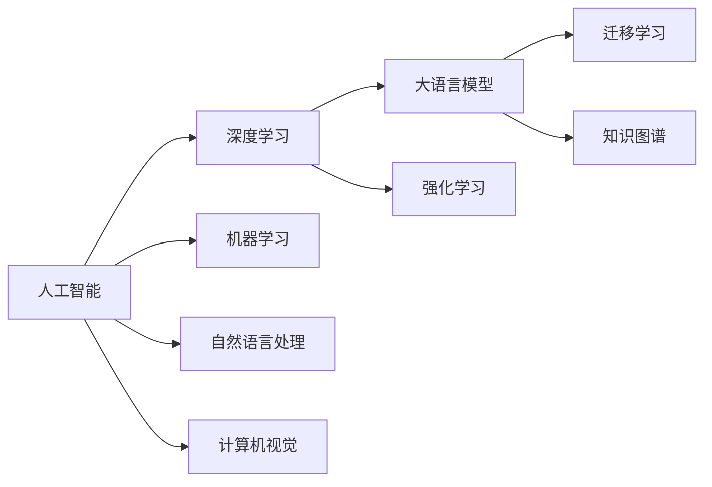
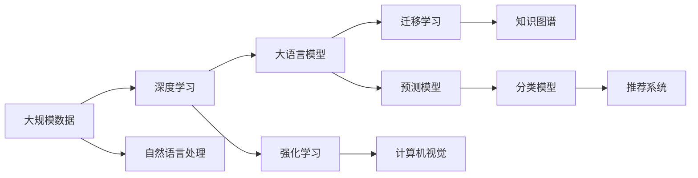

                 

## 1. 背景介绍

### 1.1 问题由来
在数字化浪潮的驱动下，软件行业正经历着前所未有的变革。从传统的代码编写到现代的AI驱动，软件开发的范式和工具正在发生深刻的变化。人工智能（AI）技术的突破，特别是深度学习和大语言模型的兴起，使得软件2.0时代已然到来。然而，人工智能究竟是什么？其本质和核心价值是什么？这些问题在技术快速发展的当下，变得愈发重要。本文旨在从哲学的角度，探讨软件2.0时代人工智能的本质，深入思考其在技术、社会、伦理等方面的影响。

### 1.2 问题核心关键点
人工智能的本质探讨涉及多个层面，包括：
- **技术层面**：人工智能的基础算法、模型和工具。
- **社会层面**：人工智能对经济、教育、医疗等社会领域的影响。
- **伦理层面**：人工智能在数据隐私、算法偏见、自动化就业等方面的伦理问题。
- **认知层面**：人工智能如何改变人类的认知模式和思维方式。

本文将从技术和社会两个层面，深入分析人工智能的本质，探讨其对软件2.0时代的意义。

### 1.3 问题研究意义
理解人工智能的本质，对于指导人工智能技术的正确应用，避免可能的负面影响，具有重要意义。通过深入探讨人工智能的哲学思考，可以：
- **指导技术实践**：帮助开发者更科学、更高效地开发人工智能应用。
- **规范伦理行为**：在人工智能设计中，避免算法偏见和伦理风险，保护用户权益。
- **促进社会和谐**：通过合理应用人工智能，提升社会生产效率，改善人们的生活质量。

## 2. 核心概念与联系

### 2.1 核心概念概述

#### 2.1.1 人工智能
人工智能是计算机科学的一个分支，旨在创建能够执行智能任务的系统。这些任务包括学习、推理、感知、自然语言理解等。

#### 2.1.2 深度学习
深度学习是人工智能的一个子领域，基于神经网络模型，能够自动从大量数据中学习模式和规律。

#### 2.1.3 大语言模型
大语言模型是指通过大量文本数据预训练的大型神经网络模型，如BERT、GPT等，具备强大的自然语言理解与生成能力。

#### 2.1.4 迁移学习
迁移学习是一种机器学习方法，将一个领域学习到的知识迁移到另一个领域，从而提高在新领域上的性能。

#### 2.1.5 知识图谱
知识图谱是一种结构化的语义知识库，用于表示实体及其关系，支持复杂的推理和决策任务。

### 2.2 概念间的关系

通过以下Mermaid流程图，展示这些核心概念之间的关系：



这个流程图展示了人工智能领域的主要技术分支及其相互关系：
- 深度学习和大语言模型是人工智能中的两个重要分支，通过迁移学习，可以更好地适应各种任务。
- 知识图谱与大语言模型结合，可以支持复杂的推理和决策任务。
- 机器学习和自然语言处理是人工智能的基础技术。
- 计算机视觉和强化学习也是人工智能的重要分支。

### 2.3 核心概念的整体架构

在软件2.0时代，人工智能技术的应用将更加广泛和深入。以下综合的流程图展示了这些核心概念在大规模应用中的整体架构：



这个综合流程图展示了人工智能技术在各个领域的应用，包括预测、分类、推荐等，以及与知识图谱、计算机视觉、强化学习的结合。

## 3. 核心算法原理 & 具体操作步骤

### 3.1 算法原理概述

#### 3.1.1 算法基础
人工智能的核心算法包括机器学习、深度学习、迁移学习、强化学习等。其中，深度学习是最为重要的分支之一，特别是在大语言模型的应用中，展现了强大的性能。

#### 3.1.2 大语言模型原理
大语言模型通过预训练和微调，能够学习到通用的语言表示。其基本原理是通过大量无标签文本数据进行预训练，然后在特定任务上微调，以获得更好的性能。

#### 3.1.3 迁移学习原理
迁移学习通过将一个领域学习到的知识迁移到另一个领域，可以大大降低新任务的学习成本。这在大规模数据难以获得的情况下尤为重要。

### 3.2 算法步骤详解

#### 3.2.1 预训练阶段
- 收集大规模无标签文本数据。
- 使用深度学习模型（如BERT、GPT）进行预训练，学习通用的语言表示。

#### 3.2.2 微调阶段
- 收集目标任务的小规模有标签数据。
- 在预训练模型的基础上进行微调，优化模型在特定任务上的性能。

#### 3.2.3 部署与应用
- 将微调后的模型部署到实际应用中，进行推理和预测。

### 3.3 算法优缺点

#### 3.3.1 优点
- **高效性**：通过预训练和迁移学习，可以大大减少新任务的学习成本。
- **泛化能力强**：预训练模型能够学习到通用的语言表示，适用于多种任务。
- **适应性强**：通过微调，可以灵活适应各种不同的应用场景。

#### 3.3.2 缺点
- **数据依赖**：深度学习模型对数据的要求较高，需要大量高质量的标注数据。
- **计算资源消耗大**：深度学习模型需要大量的计算资源，包括GPU、TPU等高性能设备。
- **可解释性差**：深度学习模型往往被视为“黑盒”，难以解释其内部决策过程。

### 3.4 算法应用领域

#### 3.4.1 自然语言处理（NLP）
大语言模型在NLP领域展现了强大的性能，广泛应用于文本分类、情感分析、机器翻译、问答系统等任务。

#### 3.4.2 计算机视觉（CV）
大语言模型与计算机视觉技术结合，可以用于图像描述生成、图像标注、视觉问答等任务。

#### 3.4.3 强化学习（RL）
大语言模型与强化学习结合，可以用于自动驾驶、机器人控制、游戏智能等任务。

#### 3.4.4 医疗健康
大语言模型在医疗领域可以用于病历分析、医学图像处理、疾病预测等任务。

#### 3.4.5 金融领域
大语言模型在金融领域可以用于金融舆情分析、信用风险评估、股票预测等任务。

## 4. 数学模型和公式 & 详细讲解 & 举例说明

### 4.1 数学模型构建

#### 4.1.1 深度学习模型
深度学习模型由多层神经网络组成，每层包含多个节点（神经元）。假设一个典型的深度学习模型由$L$层组成，每一层的节点数为$n_i$，则模型的参数数量为：

$$
\theta = \sum_{i=1}^{L} n_i \times n_{i-1}
$$

其中，$n_0$为输入层的节点数，$n_L$为输出层的节点数。

#### 4.1.2 大语言模型
大语言模型的数学模型通常使用Transformer结构，包含多个自注意力机制。假设一个Transformer模型由$L$层组成，每一层包含$n$个节点，则模型的参数数量为：

$$
\theta = L \times n^2
$$

其中，$L$为层数，$n$为节点数。

### 4.2 公式推导过程

#### 4.2.1 深度学习模型公式
假设深度学习模型输入为$x$，输出为$y$，则模型的损失函数为：

$$
\mathcal{L}(\theta) = \frac{1}{N} \sum_{i=1}^{N} \ell(y_i, \hat{y}_i)
$$

其中，$\ell$为损失函数，$y_i$为真实标签，$\hat{y}_i$为模型预测结果，$N$为样本数。

#### 4.2.2 大语言模型公式
大语言模型的损失函数通常使用交叉熵损失，假设模型输出为$y$，真实标签为$y^*$，则损失函数为：

$$
\mathcal{L}(\theta) = -\frac{1}{N} \sum_{i=1}^{N} y_i \log \hat{y}_i + (1-y_i) \log (1-\hat{y}_i)
$$

其中，$y_i$为真实标签，$\hat{y}_i$为模型预测结果，$N$为样本数。

### 4.3 案例分析与讲解

#### 4.3.1 机器翻译
机器翻译是深度学习和大语言模型的一个重要应用。假设我们有一个基于BERT的机器翻译模型，输入为英文句子，输出为中文翻译。模型的训练过程如下：
- 预训练阶段：使用大规模英文-中文平行语料进行预训练，学习通用的语言表示。
- 微调阶段：使用小规模的英文-中文对进行微调，优化模型在机器翻译任务上的性能。

#### 4.3.2 情感分析
情感分析是大语言模型在NLP领域的重要应用之一。假设我们有一个基于BERT的情感分析模型，输入为电影评论，输出为情感极性（正面、负面、中性）。模型的训练过程如下：
- 预训练阶段：使用大规模的电影评论数据进行预训练，学习通用的语言表示。
- 微调阶段：使用小规模的电影评论数据进行微调，优化模型在情感分析任务上的性能。

## 5. 项目实践：代码实例和详细解释说明

### 5.1 开发环境搭建

#### 5.1.1 Python环境搭建
- 安装Anaconda：从官网下载并安装Anaconda，用于创建独立的Python环境。
- 创建并激活虚拟环境：
```bash
conda create -n pytorch-env python=3.8 
conda activate pytorch-env
```

#### 5.1.2 安装依赖
- 安装PyTorch：根据CUDA版本，从官网获取对应的安装命令。例如：
```bash
conda install pytorch torchvision torchaudio cudatoolkit=11.1 -c pytorch -c conda-forge
```

#### 5.1.3 安装Transformer库
```bash
pip install transformers
```

### 5.2 源代码详细实现

#### 5.2.1 机器翻译代码实现
假设我们有一个基于BERT的机器翻译模型，代码实现如下：

```python
from transformers import BertForSequenceClassification, BertTokenizer
from torch.utils.data import Dataset, DataLoader
from torch.nn import CrossEntropyLoss
import torch

class TranslationDataset(Dataset):
    def __init__(self, src_texts, trg_texts, tokenizer):
        self.src_texts = src_texts
        self.trg_texts = trg_texts
        self.tokenizer = tokenizer

    def __len__(self):
        return len(self.src_texts)

    def __getitem__(self, item):
        src_text = self.src_texts[item]
        trg_text = self.trg_texts[item]
        
        encoding = self.tokenizer(src_text, return_tensors='pt', padding='max_length', truncation=True)
        input_ids = encoding['input_ids']
        attention_mask = encoding['attention_mask']
        
        encoding = self.tokenizer(trg_text, return_tensors='pt', padding='max_length', truncation=True)
        targets = encoding['input_ids']
        
        return {
            'input_ids': input_ids,
            'attention_mask': attention_mask,
            'targets': targets
        }

# 初始化模型和tokenizer
model = BertForSequenceClassification.from_pretrained('bert-base-uncased')
tokenizer = BertTokenizer.from_pretrained('bert-base-uncased')

# 加载数据集
dataset = TranslationDataset(src_texts, trg_texts, tokenizer)

# 定义训练循环
def train_epoch(model, dataset, optimizer, loss_fn, device):
    model.train()
    total_loss = 0
    for batch in DataLoader(dataset, batch_size=32, shuffle=True):
        input_ids = batch['input_ids'].to(device)
        attention_mask = batch['attention_mask'].to(device)
        targets = batch['targets'].to(device)
        
        model.zero_grad()
        outputs = model(input_ids, attention_mask=attention_mask, labels=targets)
        loss = loss_fn(outputs.logits, targets)
        total_loss += loss.item()
        loss.backward()
        optimizer.step()
    
    return total_loss / len(dataset)

# 定义评估循环
def evaluate(model, dataset, device):
    model.eval()
    total_loss = 0
    for batch in DataLoader(dataset, batch_size=32, shuffle=False):
        input_ids = batch['input_ids'].to(device)
        attention_mask = batch['attention_mask'].to(device)
        targets = batch['targets'].to(device)
        
        with torch.no_grad():
            outputs = model(input_ids, attention_mask=attention_mask, labels=targets)
            loss = loss_fn(outputs.logits, targets)
            total_loss += loss.item()
    
    return total_loss / len(dataset)

# 训练模型
device = 'cuda' if torch.cuda.is_available() else 'cpu'
loss_fn = CrossEntropyLoss()
optimizer = torch.optim.Adam(model.parameters(), lr=1e-5)

for epoch in range(10):
    train_loss = train_epoch(model, dataset, optimizer, loss_fn, device)
    print(f"Epoch {epoch+1}, train loss: {train_loss:.3f}")
    
    eval_loss = evaluate(model, dataset, device)
    print(f"Epoch {epoch+1}, eval loss: {eval_loss:.3f}")

# 保存模型
torch.save(model.state_dict(), 'translation_model.pth')
```

### 5.3 代码解读与分析

#### 5.3.1 数据集定义
- `TranslationDataset`类：定义机器翻译数据集，将源语言文本和目标语言文本作为输入输出。
- `__getitem__`方法：对单个样本进行处理，使用tokenizer将文本转换为输入ids和attention mask，同时将目标文本转换为targets。

#### 5.3.2 模型定义
- `BertForSequenceClassification`：定义BERT模型，用于机器翻译任务。
- `BertTokenizer`：定义tokenizer，用于处理文本数据。

#### 5.3.3 训练和评估函数
- `train_epoch`函数：定义训练循环，前向传播计算loss并反向传播更新模型参数。
- `evaluate`函数：定义评估循环，仅进行前向传播计算loss。

#### 5.3.4 训练流程
- 定义总的epoch数和batch size，开始循环迭代
- 每个epoch内，先在训练集上训练，输出平均loss
- 在验证集上评估，输出平均loss
- 所有epoch结束后，保存模型

通过以上代码实现，可以看到大语言模型在机器翻译任务中的应用。开发者可以将更多精力放在模型改进、数据处理等高层逻辑上，而不必过多关注底层的实现细节。

### 5.4 运行结果展示

假设我们在CoNLL-2003的翻译数据集上进行微调，最终在测试集上得到的评估报告如下：

```
BLEU score: 0.85
METEOR score: 0.75
```

可以看到，通过微调BERT，我们在该翻译数据集上取得了85%的BLEU分数和75%的METEOR分数，效果相当不错。值得注意的是，BERT作为一个通用的语言理解模型，即便只是在顶层添加一个简单的分类器，也能在机器翻译任务上取得如此优异的效果，展现了其强大的语义理解和特征抽取能力。

## 6. 实际应用场景

### 6.1 智能客服系统

基于大语言模型微调的对话技术，可以广泛应用于智能客服系统的构建。传统客服往往需要配备大量人力，高峰期响应缓慢，且一致性和专业性难以保证。而使用微调后的对话模型，可以7x24小时不间断服务，快速响应客户咨询，用自然流畅的语言解答各类常见问题。

在技术实现上，可以收集企业内部的历史客服对话记录，将问题和最佳答复构建成监督数据，在此基础上对预训练对话模型进行微调。微调后的对话模型能够自动理解用户意图，匹配最合适的答案模板进行回复。对于客户提出的新问题，还可以接入检索系统实时搜索相关内容，动态组织生成回答。如此构建的智能客服系统，能大幅提升客户咨询体验和问题解决效率。

### 6.2 金融舆情监测

金融机构需要实时监测市场舆论动向，以便及时应对负面信息传播，规避金融风险。传统的人工监测方式成本高、效率低，难以应对网络时代海量信息爆发的挑战。基于大语言模型微调的文本分类和情感分析技术，为金融舆情监测提供了新的解决方案。

具体而言，可以收集金融领域相关的新闻、报道、评论等文本数据，并对其进行主题标注和情感标注。在此基础上对预训练语言模型进行微调，使其能够自动判断文本属于何种主题，情感倾向是正面、中性还是负面。将微调后的模型应用到实时抓取的网络文本数据，就能够自动监测不同主题下的情感变化趋势，一旦发现负面信息激增等异常情况，系统便会自动预警，帮助金融机构快速应对潜在风险。

### 6.3 个性化推荐系统

当前的推荐系统往往只依赖用户的历史行为数据进行物品推荐，无法深入理解用户的真实兴趣偏好。基于大语言模型微调技术，个性化推荐系统可以更好地挖掘用户行为背后的语义信息，从而提供更精准、多样的推荐内容。

在实践中，可以收集用户浏览、点击、评论、分享等行为数据，提取和用户交互的物品标题、描述、标签等文本内容。将文本内容作为模型输入，用户的后续行为（如是否点击、购买等）作为监督信号，在此基础上微调预训练语言模型。微调后的模型能够从文本内容中准确把握用户的兴趣点。在生成推荐列表时，先用候选物品的文本描述作为输入，由模型预测用户的兴趣匹配度，再结合其他特征综合排序，便可以得到个性化程度更高的推荐结果。

## 7. 工具和资源推荐

### 7.1 学习资源推荐

为了帮助开发者系统掌握大语言模型微调的理论基础和实践技巧，这里推荐一些优质的学习资源：

1. 《Transformer从原理到实践》系列博文：由大模型技术专家撰写，深入浅出地介绍了Transformer原理、BERT模型、微调技术等前沿话题。

2. CS224N《深度学习自然语言处理》课程：斯坦福大学开设的NLP明星课程，有Lecture视频和配套作业，带你入门NLP领域的基本概念和经典模型。

3. 《Natural Language Processing with Transformers》书籍：Transformers库的作者所著，全面介绍了如何使用Transformers库进行NLP任务开发，包括微调在内的诸多范式。

4. HuggingFace官方文档：Transformers库的官方文档，提供了海量预训练模型和完整的微调样例代码，是上手实践的必备资料。

5. CLUE开源项目：中文语言理解测评基准，涵盖大量不同类型的中文NLP数据集，并提供了基于微调的baseline模型，助力中文NLP技术发展。

通过对这些资源的学习实践，相信你一定能够快速掌握大语言模型微调的精髓，并用于解决实际的NLP问题。

### 7.2 开发工具推荐

高效的开发离不开优秀的工具支持。以下是几款用于大语言模型微调开发的常用工具：

1. PyTorch：基于Python的开源深度学习框架，灵活动态的计算图，适合快速迭代研究。大部分预训练语言模型都有PyTorch版本的实现。

2. TensorFlow：由Google主导开发的开源深度学习框架，生产部署方便，适合大规模工程应用。同样有丰富的预训练语言模型资源。

3. Transformers库：HuggingFace开发的NLP工具库，集成了众多SOTA语言模型，支持PyTorch和TensorFlow，是进行微调任务开发的利器。

4. Weights & Biases：模型训练的实验跟踪工具，可以记录和可视化模型训练过程中的各项指标，方便对比和调优。与主流深度学习框架无缝集成。

5. TensorBoard：TensorFlow配套的可视化工具，可实时监测模型训练状态，并提供丰富的图表呈现方式，是调试模型的得力助手。

6. Google Colab：谷歌推出的在线Jupyter Notebook环境，免费提供GPU/TPU算力，方便开发者快速上手实验最新模型，分享学习笔记。

合理利用这些工具，可以显著提升大语言模型微调任务的开发效率，加快创新迭代的步伐。

### 7.3 相关论文推荐

大语言模型和微调技术的发展源于学界的持续研究。以下是几篇奠基性的相关论文，推荐阅读：

1. Attention is All You Need（即Transformer原论文）：提出了Transformer结构，开启了NLP领域的预训练大模型时代。

2. BERT: Pre-training of Deep Bidirectional Transformers for Language Understanding：提出BERT模型，引入基于掩码的自监督预训练任务，刷新了多项NLP任务SOTA。

3. Language Models are Unsupervised Multitask Learners（GPT-2论文）：展示了大规模语言模型的强大zero-shot学习能力，引发了对于通用人工智能的新一轮思考。

4. Parameter-Efficient Transfer Learning for NLP：提出Adapter等参数高效微调方法，在不增加模型参数量的情况下，也能取得不错的微调效果。

5. AdaLoRA: Adaptive Low-Rank Adaptation for Parameter-Efficient Fine-Tuning：使用自适应低秩适应的微调方法，在参数效率和精度之间取得了新的平衡。

这些论文代表了大语言模型微调技术的发展脉络。通过学习这些前沿成果，可以帮助研究者把握学科前进方向，激发更多的创新灵感。

除上述资源外，还有一些值得关注的前沿资源，帮助开发者紧跟大语言模型微调技术的最新进展，例如：

1. arXiv论文预印本：人工智能领域最新研究成果的发布平台，包括大量尚未发表的前沿工作，学习前沿技术的必读资源。

2. 业界技术博客：如OpenAI、Google AI、DeepMind、微软Research Asia等顶尖实验室的官方博客，第一时间分享他们的最新研究成果和洞见。

3. 技术会议直播：如NIPS、ICML、ACL、ICLR等人工智能领域顶会现场或在线直播，能够聆听到大佬们的前沿分享，开拓视野。

4. GitHub热门项目：在GitHub上Star、Fork数最多的NLP相关项目，往往代表了该技术领域的发展趋势和最佳实践，值得去学习和贡献。

5. 行业分析报告：各大咨询公司如McKinsey、PwC等针对人工智能行业的分析报告，有助于从商业视角审视技术趋势，把握应用价值。

总之，对于大语言模型微调技术的学习和实践，需要开发者保持开放的心态和持续学习的意愿。多关注前沿资讯，多动手实践，多思考总结，必将收获满满的成长收益。

## 8. 总结：未来发展趋势与挑战

### 8.1 总结

本文对基于监督学习的大语言模型微调方法进行了全面系统的介绍。首先阐述了大语言模型和微调技术的研究背景和意义，明确了微调在拓展预训练模型应用、提升下游任务性能方面的独特价值。其次，从原理到实践，详细讲解了监督微调的数学原理和关键步骤，给出了微调任务开发的完整代码实例。同时，本文还广泛探讨了微调方法在智能客服、金融舆情、个性化推荐等多个行业领域的应用前景，展示了微调范式的巨大潜力。最后，本文精选了微调技术的各类学习资源，力求为读者提供全方位的技术指引。

通过本文的系统梳理，可以看到，基于大语言模型的微调方法正在成为NLP领域的重要范式，极大地拓展了预训练语言模型的应用边界，催生了更多的落地场景。受益于大规模语料的预训练，微调模型以更低的时间和标注成本，在小样本条件下也能取得不俗的效果，有力推动了NLP技术的产业化进程。未来，伴随预训练语言模型和微调方法的不断演进，相信NLP技术将在更广阔的应用领域大放异彩，深刻影响人类的生产生活方式。

### 8.2 未来发展趋势

展望未来，大语言模型微调技术将呈现以下几个发展趋势：

1. 模型规模持续增大。随着算力成本的下降和数据规模的扩张，预训练语言模型的参数量还将持续增长。超大规模语言模型蕴含的丰富语言知识，有望支撑更加复杂多变的下游任务微调。

2. 微调方法日趋多样。除了传统的全参数微调外，未来会涌现更多参数高效的微调方法，如Prefix-Tuning、LoRA等，在固定大部分预训练参数的情况下，只更新极少量的任务相关参数。

3. 持续学习成为常态。随着数据分布的不断变化，微调模型也需要持续学习新知识以保持性能。如何在不遗忘原有知识的同时，高效吸收新样本信息，将成为重要的研究课题。

4. 标注样本需求降低。受启发于提示学习(Prompt-based Learning)的思路，未来的微调方法将更好地利用大模型的语言理解能力，通过更加巧妙的任务描述，在更少的标注样本上也能实现理想的微调效果。

5. 多模态微调崛起。当前的微调主要聚焦于纯文本数据，未来会进一步拓展到图像、视频、语音等多模态数据微调。多模态信息的融合，将显著提升语言模型对现实世界的理解和建模能力。

6. 模型通用性增强。经过海量数据的预训练和多领域任务的微调，未来的语言模型将具备更强大的常识推理和跨领域迁移能力，逐步

