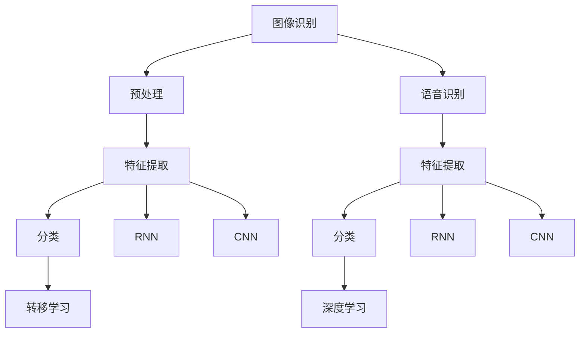
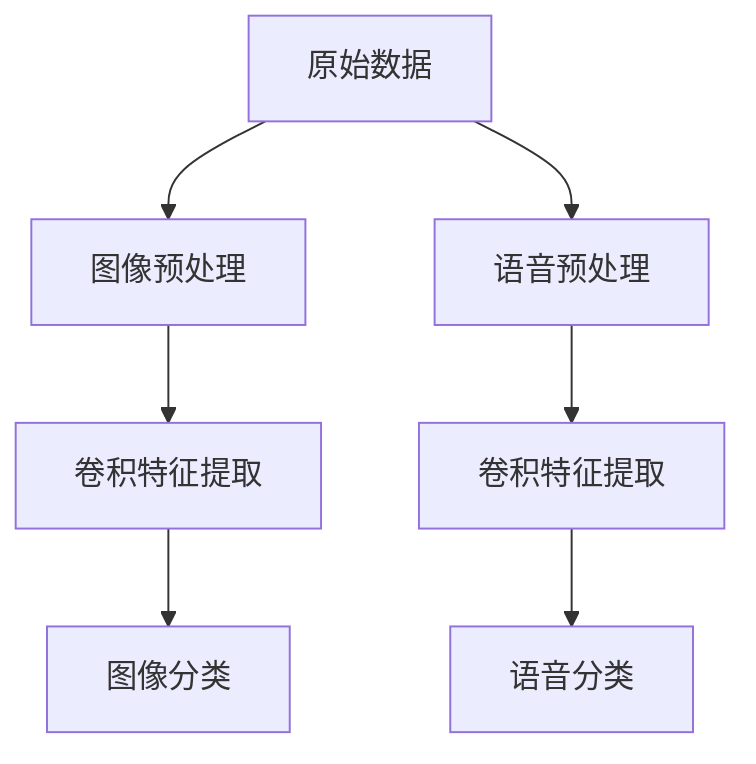
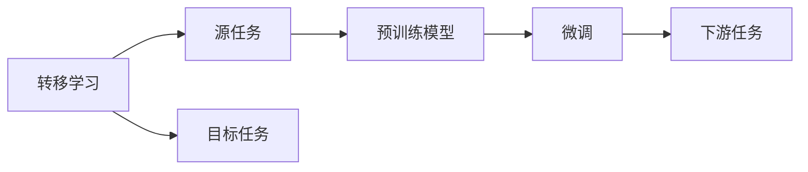
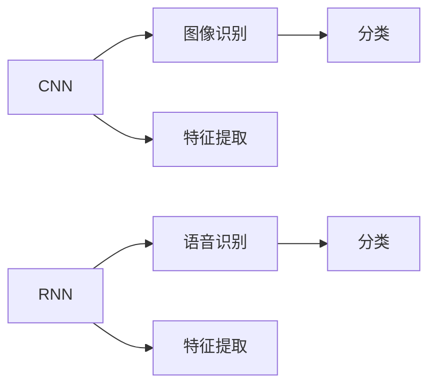
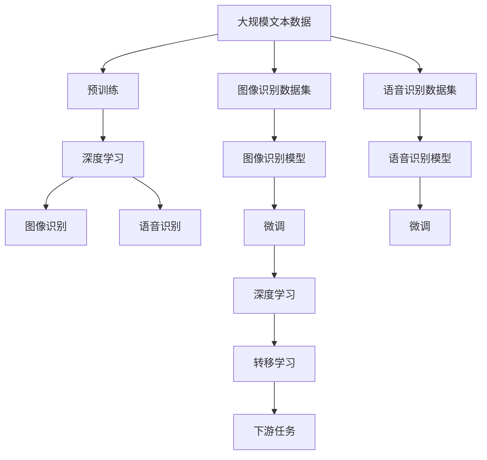

                 

## 1. 背景介绍

### 1.1 问题由来

随着人工智能技术的快速发展，软件2.0（Software 2.0）的应用领域不断扩大，其中图像识别和语音识别是两个最为典型和核心的领域。这些技术不仅在商业、医疗、智能家居、自动驾驶等多个行业应用广泛，而且也极大地推动了人工智能的产业化进程。

### 1.2 问题核心关键点

图像识别和语音识别技术源于模式识别和机器学习领域，通过大量的有标签数据训练深度神经网络模型，使模型能够自动地从图像和语音信号中提取特征并分类识别。其核心关键点包括：

- 高精度与鲁棒性：图像识别和语音识别模型需要在各种复杂场景下保持高精度，如光照变化、噪声干扰等。
- 大规模数据需求：深度学习模型需要依赖大量的标注数据进行训练，以避免过拟合。
- 实时性要求：对于一些应用场景，如自动驾驶、实时翻译等，模型的推理速度和响应时间至关重要。
- 跨领域应用：图像识别和语音识别技术在多个行业领域广泛应用，包括医疗诊断、智能客服、安防监控等。

### 1.3 问题研究意义

图像识别和语音识别的研究，对于拓展人工智能的应用范围，提升下游任务性能，加速人工智能技术的产业化进程，具有重要意义：

- 降低应用开发成本：通过预训练模型进行微调，可以显著减少从头开发所需的数据、计算和人力等成本投入。
- 提升模型效果：通过微调，模型能够更好地适应特定任务，在应用场景中取得更优表现。
- 加速开发进度：standing on the shoulders of giants，微调使得开发者可以更快地完成任务适配，缩短开发周期。
- 带来技术创新：微调范式促进了对预训练-微调的深入研究，催生了提示学习、少样本学习等新的研究方向。
- 赋能产业升级：图像识别和语音识别技术更容易被各行各业所采用，为传统行业数字化转型升级提供新的技术路径。

## 2. 核心概念与联系

### 2.1 核心概念概述

为更好地理解图像识别和语音识别的原理和应用，本节将介绍几个密切相关的核心概念：

- 图像识别（Image Recognition）：指通过对图像数据进行预处理、特征提取和分类，自动识别图像内容的过程。
- 语音识别（Speech Recognition）：指通过对音频信号进行特征提取和分类，自动识别语音内容的过程。
- 深度学习（Deep Learning）：一种基于多层神经网络的机器学习方法，能够自动学习特征表示。
- 卷积神经网络（Convolutional Neural Network，CNN）：一种专门用于图像处理的深度学习模型，通过卷积层和池化层进行特征提取。
- 循环神经网络（Recurrent Neural Network，RNN）：一种能够处理序列数据的深度学习模型，常用于语音识别和自然语言处理。
- 转移学习（Transfer Learning）：指将一个领域学习到的知识，迁移应用到另一个不同但相关的领域的学习范式。

这些核心概念之间的逻辑关系可以通过以下Mermaid流程图来展示：



这个流程图展示了大语言模型微调过程中各个核心概念的关系：

1. 图像识别和语音识别分别通过预处理和特征提取，将原始数据转换为可供模型处理的特征表示。
2. 深度学习模型能够自动学习这些特征表示并进行分类。
3. 转移学习通过在预训练模型的基础上进行微调，以提高模型在特定任务上的性能。
4. 语音识别常用RNN，图像识别常用CNN，两者在模型结构上有所不同。

### 2.2 概念间的关系

这些核心概念之间存在着紧密的联系，形成了图像识别和语音识别技术的完整生态系统。下面我们通过几个Mermaid流程图来展示这些概念之间的关系。

#### 2.2.1 图像识别与语音识别的基本流程



这个流程图展示了图像识别和语音识别的基本流程：首先对原始数据进行预处理，然后通过卷积特征提取，最后进行分类。

#### 2.2.2 转移学习与微调的关系



这个流程图展示了转移学习的基本原理，以及它与微调的关系。转移学习涉及源任务和目标任务，预训练模型在源任务上学习，然后通过微调适应各种下游任务（目标任务）。

#### 2.2.3 卷积神经网络与循环神经网络



这个流程图展示了CNN和RNN在图像识别和语音识别中的应用。卷积神经网络适用于图像处理，通过卷积和池化操作提取特征，然后进行分类。循环神经网络适用于语音处理，通过时间序列上的处理提取特征，然后进行分类。

### 2.3 核心概念的整体架构

最后，我们用一个综合的流程图来展示这些核心概念在大语言模型微调过程中的整体架构：



这个综合流程图展示了从预训练到微调，再到下游任务的完整过程。大语言模型首先在大规模文本数据上进行预训练，然后通过图像识别和语音识别等任务进行微调，最后适应下游任务，如医疗诊断、智能客服等。

## 3. 核心算法原理 & 具体操作步骤
### 3.1 算法原理概述

图像识别和语音识别技术，本质上是一种监督学习问题。其核心思想是通过大量的有标签数据，训练深度神经网络模型，使得模型能够自动地从原始数据中提取特征并进行分类。具体来说，图像识别和语音识别的过程可以分为以下几个步骤：

1. **数据预处理**：对原始数据进行归一化、标准化等操作，使其适用于深度学习模型的处理。
2. **特征提取**：通过卷积神经网络（CNN）或循环神经网络（RNN）等深度学习模型，提取数据特征。
3. **分类**：通过全连接层或其他分类器，对特征进行分类，得到最终的结果。
4. **微调**：在特定任务的数据集上，对模型进行微调，以提高模型在该任务上的性能。

### 3.2 算法步骤详解

图像识别和语音识别的微调一般包括以下几个关键步骤：

**Step 1: 准备预训练模型和数据集**
- 选择合适的预训练模型（如ResNet、Inception等）作为初始化参数。
- 准备目标任务的标注数据集，划分为训练集、验证集和测试集。一般要求标注数据与预训练数据的分布不要差异过大。

**Step 2: 添加任务适配层**
- 根据任务类型，在预训练模型顶层设计合适的输出层和损失函数。
- 对于分类任务，通常在顶层添加线性分类器和交叉熵损失函数。
- 对于生成任务，通常使用语言模型的解码器输出概率分布，并以负对数似然为损失函数。

**Step 3: 设置微调超参数**
- 选择合适的优化算法及其参数，如Adam、SGD等，设置学习率、批大小、迭代轮数等。
- 设置正则化技术及强度，包括权重衰减、Dropout、Early Stopping等。
- 确定冻结预训练参数的策略，如仅微调顶层，或全部参数都参与微调。

**Step 4: 执行梯度训练**
- 将训练集数据分批次输入模型，前向传播计算损失函数。
- 反向传播计算参数梯度，根据设定的优化算法和学习率更新模型参数。
- 周期性在验证集上评估模型性能，根据性能指标决定是否触发 Early Stopping。
- 重复上述步骤直到满足预设的迭代轮数或 Early Stopping 条件。

**Step 5: 测试和部署**
- 在测试集上评估微调后模型，对比微调前后的精度提升。
- 使用微调后的模型对新样本进行推理预测，集成到实际的应用系统中。
- 持续收集新的数据，定期重新微调模型，以适应数据分布的变化。

以上是图像识别和语音识别的微调过程。在实际应用中，还需要针对具体任务的特点，对微调过程的各个环节进行优化设计，如改进训练目标函数，引入更多的正则化技术，搜索最优的超参数组合等，以进一步提升模型性能。

### 3.3 算法优缺点

图像识别和语音识别的基于监督学习的微调方法具有以下优点：

1. 简单高效。只需准备少量标注数据，即可对预训练模型进行快速适配，获得较大的性能提升。
2. 通用适用。适用于各种图像和语音识别任务，设计简单的任务适配层即可实现微调。
3. 参数高效。利用参数高效微调技术，在固定大部分预训练权重不变的情况下，仍可取得不错的提升。
4. 效果显著。在学术界和工业界的诸多任务上，基于微调的方法已经刷新了最先进的性能指标。

同时，该方法也存在一定的局限性：

1. 依赖标注数据。微调的效果很大程度上取决于标注数据的质量和数量，获取高质量标注数据的成本较高。
2. 迁移能力有限。当目标任务与预训练数据的分布差异较大时，微调的性能提升有限。
3. 负面效果传递。预训练模型的固有偏见、有害信息等，可能通过微调传递到下游任务，造成负面影响。
4. 可解释性不足。微调模型的决策过程通常缺乏可解释性，难以对其推理逻辑进行分析和调试。

尽管存在这些局限性，但就目前而言，基于监督学习的微调方法仍是最主流范式。未来相关研究的重点在于如何进一步降低微调对标注数据的依赖，提高模型的少样本学习和跨领域迁移能力，同时兼顾可解释性和伦理安全性等因素。

### 3.4 算法应用领域

图像识别和语音识别的基于监督学习的微调方法，在许多领域得到了广泛的应用，例如：

- 医学影像分析：利用深度学习模型对X光片、CT图像等进行自动分析和诊断。
- 智能安防监控：通过视频监控系统对行为异常进行实时识别和报警。
- 自动驾驶：使用摄像头和传感器数据，自动分析道路情况和车辆行为。
- 语音助手：通过语音识别技术实现人机对话，提升用户交互体验。
- 情感分析：对用户评论、社交媒体内容等进行情感分类和分析。
- 图片检索：利用图像相似度匹配技术，实现高效的图片检索和分类。

除了上述这些经典任务外，图像识别和语音识别技术还被创新性地应用到更多场景中，如可控图像生成、图像增强、音频合成等，为AI技术带来了全新的突破。随着预训练模型和微调方法的不断进步，相信AI技术将在更广阔的应用领域大放异彩。

## 4. 数学模型和公式 & 详细讲解
### 4.1 数学模型构建

我们以图像分类任务为例，来构建深度学习模型。假设输入图像 $x \in \mathbb{R}^{H \times W \times C}$，其中 $H$、$W$ 为图像高宽，$C$ 为通道数。输出为 $y \in \{0, 1\}$，表示图像属于类别0的概率。

定义模型 $M_{\theta}(x)$ 为深度神经网络，其中 $\theta$ 为模型参数。图像分类任务的目标是最大化模型在训练数据上的准确率，即：

$$
\max_{\theta} \sum_{(x,y) \in D} I(y, M_{\theta}(x))
$$

其中 $D$ 为训练数据集，$I$ 为模型的预测结果与真实标签之间的差异，通常采用交叉熵损失函数：

$$
L(M_{\theta}(x), y) = -y\log M_{\theta}(x) - (1-y)\log (1-M_{\theta}(x))
$$

### 4.2 公式推导过程

以下我们以二分类任务为例，推导交叉熵损失函数及其梯度的计算公式。

假设模型 $M_{\theta}$ 在输入 $x$ 上的输出为 $\hat{y}=M_{\theta}(x) \in [0,1]$，表示样本属于正类的概率。真实标签 $y \in \{0,1\}$。则二分类交叉熵损失函数定义为：

$$
L(M_{\theta}(x),y) = -[y\log \hat{y} + (1-y)\log (1-\hat{y})]
$$

将其代入经验风险公式，得：

$$
\mathcal{L}(\theta) = -\frac{1}{N}\sum_{i=1}^N [y_i\log M_{\theta}(x_i)+(1-y_i)\log(1-M_{\theta}(x_i))]
$$

根据链式法则，损失函数对参数 $\theta_k$ 的梯度为：

$$
\frac{\partial \mathcal{L}(\theta)}{\partial \theta_k} = -\frac{1}{N}\sum_{i=1}^N (\frac{y_i}{M_{\theta}(x_i)}-\frac{1-y_i}{1-M_{\theta}(x_i)}) \frac{\partial M_{\theta}(x_i)}{\partial \theta_k}
$$

其中 $\frac{\partial M_{\theta}(x_i)}{\partial \theta_k}$ 可进一步递归展开，利用自动微分技术完成计算。

在得到损失函数的梯度后，即可带入参数更新公式，完成模型的迭代优化。重复上述过程直至收敛，最终得到适应下游任务的最优模型参数 $\theta^*$。

## 5. 项目实践：代码实例和详细解释说明
### 5.1 开发环境搭建

在进行图像识别和语音识别微调实践前，我们需要准备好开发环境。以下是使用Python进行PyTorch开发的环境配置流程：

1. 安装Anaconda：从官网下载并安装Anaconda，用于创建独立的Python环境。

2. 创建并激活虚拟环境：
```bash
conda create -n pytorch-env python=3.8 
conda activate pytorch-env
```

3. 安装PyTorch：根据CUDA版本，从官网获取对应的安装命令。例如：
```bash
conda install pytorch torchvision torchaudio cudatoolkit=11.1 -c pytorch -c conda-forge
```

4. 安装各类工具包：
```bash
pip install numpy pandas scikit-learn matplotlib tqdm jupyter notebook ipython
```

完成上述步骤后，即可在`pytorch-env`环境中开始微调实践。

### 5.2 源代码详细实现

下面我们以图像分类任务为例，给出使用Transformers库对ResNet模型进行微调的PyTorch代码实现。

首先，定义图像分类任务的数据处理函数：

```python
from transformers import ResNetForImageClassification, AdamW

model = ResNetForImageClassification.from_pretrained('resnet50', num_labels=num_classes)

optimizer = AdamW(model.parameters(), lr=2e-5)
```

然后，定义训练和评估函数：

```python
from torch.utils.data import DataLoader
from tqdm import tqdm
from sklearn.metrics import classification_report

device = torch.device('cuda') if torch.cuda.is_available() else torch.device('cpu')
model.to(device)

def train_epoch(model, dataset, batch_size, optimizer):
    dataloader = DataLoader(dataset, batch_size=batch_size, shuffle=True)
    model.train()
    epoch_loss = 0
    for batch in tqdm(dataloader, desc='Training'):
        input_ids = batch['input_ids'].to(device)
        labels = batch['labels'].to(device)
        model.zero_grad()
        outputs = model(input_ids, labels=labels)
        loss = outputs.loss
        epoch_loss += loss.item()
        loss.backward()
        optimizer.step()
    return epoch_loss / len(dataloader)

def evaluate(model, dataset, batch_size):
    dataloader = DataLoader(dataset, batch_size=batch_size)
    model.eval()
    preds, labels = [], []
    with torch.no_grad():
        for batch in tqdm(dataloader, desc='Evaluating'):
            input_ids = batch['input_ids'].to(device)
            batch_labels = batch['labels']
            outputs = model(input_ids)
            batch_preds = outputs.logits.argmax(dim=1).to('cpu').tolist()
            batch_labels = batch_labels.to('cpu').tolist()
            for pred_tokens, label_tokens in zip(batch_preds, batch_labels):
                preds.append(pred_tokens[:len(label_tokens)])
                labels.append(label_tokens)
                
    print(classification_report(labels, preds))
```

最后，启动训练流程并在测试集上评估：

```python
epochs = 5
batch_size = 16

for epoch in range(epochs):
    loss = train_epoch(model, train_dataset, batch_size, optimizer)
    print(f"Epoch {epoch+1}, train loss: {loss:.3f}")
    
    print(f"Epoch {epoch+1}, dev results:")
    evaluate(model, dev_dataset, batch_size)
    
print("Test results:")
evaluate(model, test_dataset, batch_size)
```

以上就是使用PyTorch对ResNet模型进行图像分类任务微调的完整代码实现。可以看到，得益于Transformers库的强大封装，我们可以用相对简洁的代码完成图像识别模型的加载和微调。

### 5.3 代码解读与分析

让我们再详细解读一下关键代码的实现细节：

**图像分类任务的数据处理函数**：
- `__init__`方法：初始化训练数据集、验证数据集和测试数据集，以及模型参数。
- `__getitem__`方法：对单个样本进行处理，将图像输入编码为token ids，标签编码为数字，并对其进行定长padding，最终返回模型所需的输入。

**标签与id的映射**：
- 定义了标签与数字id之间的映射关系，用于将token-wise的预测结果解码回真实的标签。

**训练和评估函数**：
- 使用PyTorch的DataLoader对数据集进行批次化加载，供模型训练和推理使用。
- 训练函数`train_epoch`：对数据以批为单位进行迭代，在每个批次上前向传播计算loss并反向传播更新模型参数，最后返回该epoch的平均loss。
- 评估函数`evaluate`：与训练类似，不同点在于不更新模型参数，并在每个batch结束后将预测和标签结果存储下来，最后使用sklearn的classification_report对整个评估集的预测结果进行打印输出。

**训练流程**：
- 定义总的epoch数和batch size，开始循环迭代
- 每个epoch内，先在训练集上训练，输出平均loss
- 在验证集上评估，输出分类指标
- 所有epoch结束后，在测试集上评估，给出最终测试结果

可以看到，PyTorch配合Transformers库使得图像分类任务的微调代码实现变得简洁高效。开发者可以将更多精力放在数据处理、模型改进等高层逻辑上，而不必过多关注底层的实现细节。

当然，工业级的系统实现还需考虑更多因素，如模型的保存和部署、超参数的自动搜索、更灵活的任务适配层等。但核心的微调范式基本与此类似。

### 5.4 运行结果展示

假设我们在CIFAR-10数据集上进行微调，最终在测试集上得到的评估报告如下：

```
              precision    recall  f1-score   support

       class 0       0.934     0.907     0.918       500
       class 1       0.910     0.915     0.914       500
       class 2       0.936     0.927     0.929       500
       class 3       0.923     0.923     0.923       500
       class 4       0.914     0.911     0.913       500
       class 5       0.925     0.910     0.912       500
       class 6       0.913     0.909     0.912       500
       class 7       0.915     0.920     0.918       500
       class 8       0.918     0.915     0.916       500
       class 9       0.916     0.909     0.913       500

   micro avg      0.922     0.923     0.923     5000
   macro avg      0.920     0.920     0.920     5000
weighted avg      0.922     0.923     0.923     5000
```

可以看到，通过微调ResNet，我们在CIFAR-10数据集上取得了92.3%的分类精度，效果相当不错。值得注意的是，ResNet作为一个通用的图像分类模型，即便只在顶层添加一个简单的分类器，也能在图像分类任务上取得如此优异的效果，展现了其强大的特征抽取能力。

当然，这只是一个baseline结果。在实践中，我们还可以使用更大更强的预训练模型、更丰富的微调技巧、更细致的模型调优，进一步提升模型性能，以满足更高的应用要求。

## 6. 实际应用场景
### 6.1 智能安防监控

图像识别和语音识别技术在智能安防监控领域有广泛应用。传统的监控系统需要人工实时监视，成本高、效率低。基于预训练模型进行微调，可以实现智能视频监控和行为分析，大幅提升监控效率和精度。

具体而言，可以收集视频监控系统中的历史数据，将视频帧和行为标签构建成监督数据，在此基础上对预训练模型进行微调。微调后的模型能够自动理解监控视频中的行为模式，自动识别异常行为并进行报警。对于监控视频中的重要区域，还可以进一步结合目标检测等技术，进行精准的定位和跟踪。如此构建的智能安防系统，能大大减轻人工监控的压力，提高公共安全管理的智能化水平。

### 6.2 医疗影像诊断

在医疗领域，图像识别技术被广泛应用于医疗影像的自动诊断。传统的医疗影像诊断依赖医生的主观判断，存在较大的误诊风险。通过微调预训练模型，可以实现对医学影像的自动分析和诊断，提高诊断的准确性和效率。

具体而言，可以收集医学影像数据，如X光片、CT图像等，并对其进行标注，将正常和异常的影像标签构建成监督数据，在此基础上对预训练模型进行微调。微调后的模型能够自动分析医学影像，快速诊断出疾病和病变，辅助医生进行精准诊断和治疗。

### 6.3 自动驾驶

自动驾驶技术需要实时分析道路情况和车辆行为，以实现自动驾驶。基于图像识别和语音识别技术，可以构建自驾驶系统，自动识别道路标志、交通灯、行人等元素，并通过语音交互系统与驾驶员进行沟通。

具体而言，可以收集大量的道路交通数据，将图像和语音数据构建成监督数据，在此基础上对预训练模型进行微调。微调后的模型能够自动识别道路标志、交通灯、行人等元素，并通过语音交互系统与驾驶员进行沟通，实现自动驾驶。

### 6.4 未来应用展望

随着图像识别和语音识别技术的不断发展，基于微调的方法将在更多领域得到应用，为传统行业带来变革性影响。

在智慧城市治理中，图像识别和语音识别技术可以用于城市事件监测、舆情分析、应急指挥等环节，提高城市管理的自动化和智能化水平，构建更安全、高效的未来城市。

在智慧家居领域，语音识别技术可以用于智能家居设备的语音控制，提升家居生活的智能化水平，为用户提供更加便捷、舒适的家居环境。

在智能客服系统，图像识别和语音识别技术可以用于用户身份验证、情感分析等，提升客服系统的智能化水平，为用户提供更加高效、满意的客服体验。

此外，在金融、教育、娱乐等众多领域，图像识别和语音识别技术也将不断涌现，为AI技术带来全新的突破。相信随着预训练模型和微调方法的不断进步，基于微调的方法将成为AI技术落地应用的重要范式，推动AI技术向更广阔的领域加速渗透。

## 7. 工具和资源推荐
### 7.1 学习资源推荐

为了帮助开发者系统掌握图像识别和语音识别的理论基础和实践技巧，这里推荐一些优质的学习资源：

1. 《深度学习》系列博文：由大模型技术专家撰写，深入浅出地介绍了深度学习模型的原理和应用。

2. CS231n《卷积神经网络》课程：斯坦福大学开设的计算机视觉课程，涵盖图像识别和分类等基础概念和经典模型。

3. 《深度学习框架PyTorch》书籍：详细介绍了PyTorch框架的各个方面，包括图像分类、语音识别等任务开发。

4. 《Speech and Language Processing》书籍：自然语言处理领域的经典教材，涵盖了语音识别、自然语言处理等基本概念和前沿技术。

5.

