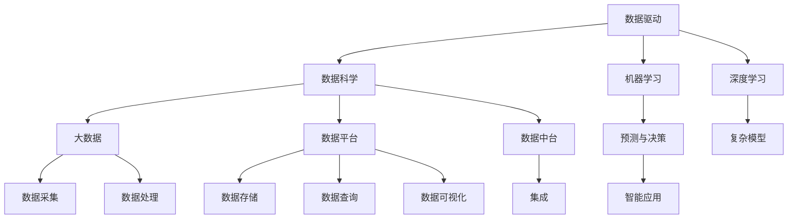
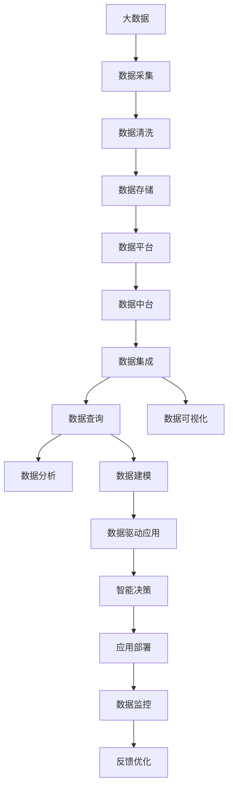

                 

## 1. 背景介绍

随着人工智能技术的不断进步，我们已经进入了“软件 2.0”的时代。这个时代的特点是：软件系统不再是由传统的算法和逻辑驱动，而是由数据驱动。在这个数据驱动的时代，数据成为了衡量软件系统价值和竞争力的核心要素。本文将深入探讨数据驱动的软件系统如何构建，以及数据驱动的应用场景和未来趋势。

### 1.1 问题由来

在传统的软件系统中，算法和逻辑是软件系统的核心。但随着数据科学和机器学习技术的飞速发展，数据在软件系统中的作用变得越来越重要。数据不仅能够提供更准确的预测和决策依据，还能够通过数据挖掘和机器学习算法，不断提升软件系统的智能化水平。

### 1.2 问题核心关键点

数据驱动的软件系统建设，主要包括以下几个关键点：

1. **数据采集与处理**：获取高质量、多样化的数据是构建数据驱动系统的基础。
2. **数据存储与管理**：高效、安全的数据存储与管理，保障数据的质量和可用性。
3. **数据分析与建模**：通过数据分析和建模，挖掘数据中的价值，形成智能决策支持。
4. **数据驱动应用开发**：基于数据建模和分析的结果，开发出更智能、更高效的软件系统。
5. **数据监控与反馈**：实时监控数据使用情况，根据反馈调整系统参数，优化系统性能。

### 1.3 问题研究意义

数据驱动的软件系统，能够帮助企业快速响应市场变化，提升决策效率和质量，降低运营成本。在医疗、金融、制造等传统行业中，数据驱动技术的应用，可以显著提升业务流程的自动化和智能化水平，为行业带来巨大的转型升级机遇。

此外，数据驱动的软件系统还能带来新的商业模式和业务机会，如大数据分析、智能推荐、个性化定制等，推动企业数字化转型和创新发展。因此，数据驱动技术在当前和未来的发展中，具有重要的战略意义。

## 2. 核心概念与联系

### 2.1 核心概念概述

为了更好地理解数据驱动的软件系统，本节将介绍几个密切相关的核心概念：

- **数据驱动**：基于数据的决策和行动，而不是基于经验或直觉。
- **数据科学**：一门涵盖数据采集、处理、分析、建模等多个环节的学科。
- **机器学习**：通过数据训练模型，使模型能够进行预测和决策。
- **深度学习**：机器学习的一个分支，利用神经网络进行复杂的数据处理和分析。
- **大数据**：指海量、高速、多样化的数据集合，是数据驱动技术的基础。
- **数据平台**：用于数据存储、处理、分析等环节的软件平台。
- **数据中台**：将数据平台和业务系统无缝集成的技术架构。

这些核心概念之间存在着紧密的联系，共同构成了数据驱动技术的基础架构。

### 2.2 概念间的关系

这些核心概念之间的关系可以通过以下Mermaid流程图来展示：



这个流程图展示了大数据驱动技术的基本框架，从数据采集到最终应用的全过程：

1. 数据采集与处理：通过各种手段收集和清洗数据。
2. 数据存储与管理：将数据高效、安全地存储在数据平台中。
3. 数据分析与建模：通过数据科学和机器学习算法，提取数据中的价值。
4. 数据驱动应用开发：基于数据分析结果，开发出更智能的软件系统。
5. 数据监控与反馈：实时监控数据使用情况，优化系统性能。

### 2.3 核心概念的整体架构

最后，我们用一个综合的流程图来展示这些核心概念在大数据驱动技术中的整体架构：



这个综合流程图展示了从数据采集到智能应用的全过程，并强调了数据驱动应用的持续优化和反馈机制。

## 3. 核心算法原理 & 具体操作步骤

### 3.1 算法原理概述

数据驱动的软件系统，本质上是将数据与算法、逻辑进行深度融合，形成智能决策和行动的能力。其核心算法原理包括以下几个关键步骤：

1. **数据采集**：通过各种传感器、应用程序等手段，收集真实世界的数据。
2. **数据清洗与预处理**：对收集到的数据进行清洗和预处理，去除噪声和异常值，进行归一化等操作。
3. **数据分析与建模**：利用数据科学和机器学习算法，对数据进行分析和建模，提取有价值的信息。
4. **模型训练与优化**：通过大量的标注数据训练模型，优化模型参数，提升模型预测准确性和泛化能力。
5. **模型部署与应用**：将训练好的模型部署到实际应用系统中，进行实时预测和决策。
6. **数据监控与反馈**：实时监控模型性能，根据反馈调整模型参数，优化模型效果。

### 3.2 算法步骤详解

以下是一个详细的算法步骤详解：

#### 3.2.1 数据采集

1. **传感器采集**：通过传感器收集实时数据，如温度、湿度、压力等物理量。
2. **日志数据采集**：通过日志记录系统活动和事件，如用户行为、系统性能等。
3. **API接口调用**：通过API接口调用第三方数据服务，获取所需数据。

#### 3.2.2 数据清洗与预处理

1. **数据清洗**：去除数据中的噪声和异常值，如重复数据、缺失值、错误数据等。
2. **数据归一化**：对数据进行归一化处理，如标准化、最小-最大归一化等。
3. **数据转换**：将数据转换为模型所需的形式，如时间序列、数值向量等。

#### 3.2.3 数据分析与建模

1. **特征工程**：从原始数据中提取有意义的特征，如均值、方差、趋势等。
2. **数据分析**：利用统计学、数据挖掘等方法，分析数据中的模式和趋势。
3. **模型选择与训练**：根据数据特征和应用场景，选择合适的模型进行训练，如回归模型、分类模型、聚类模型等。

#### 3.2.4 模型训练与优化

1. **模型训练**：通过标注数据对模型进行训练，调整模型参数。
2. **模型评估**：利用验证集或测试集对模型进行评估，计算指标如准确率、召回率、F1值等。
3. **模型优化**：根据评估结果，优化模型参数，提升模型性能。

#### 3.2.5 模型部署与应用

1. **模型部署**：将训练好的模型部署到应用系统中，进行实时预测和决策。
2. **API接口调用**：通过API接口调用模型进行预测和决策，集成到业务系统中。
3. **实时监控**：实时监控模型性能，记录预测结果和反馈数据。

#### 3.2.6 数据监控与反馈

1. **性能监控**：实时监控模型预测结果的准确性和性能。
2. **反馈调整**：根据反馈数据调整模型参数，优化模型效果。
3. **模型迭代**：根据业务需求和反馈数据，迭代更新模型，保持模型性能。

### 3.3 算法优缺点

数据驱动的软件系统具有以下优点：

1. **数据驱动决策**：数据驱动的决策过程更加科学、客观，避免了传统算法的主观性和局限性。
2. **实时预测与决策**：通过实时数据采集和处理，可以进行实时预测和决策，提升业务响应速度。
3. **持续优化**：数据驱动系统可以持续接收反馈数据，进行模型迭代和优化，保持系统性能。

同时，数据驱动的软件系统也存在一些缺点：

1. **数据质量问题**：数据采集和处理中的噪声、异常值等问题，可能影响数据驱动系统的准确性和可靠性。
2. **数据隐私与安全**：数据驱动系统中涉及大量的个人和企业数据，需要严格的数据隐私和安全保护措施。
3. **模型复杂性**：数据驱动系统中的模型通常较为复杂，需要大量的数据和计算资源进行训练和优化。
4. **模型依赖**：数据驱动系统依赖于模型选择和训练效果，模型选择不当可能导致性能下降。

### 3.4 算法应用领域

数据驱动的软件系统已经广泛应用于多个领域，如金融、医疗、制造、零售等。以下是几个典型的应用场景：

#### 3.4.1 金融风险管理

金融行业需要实时监控市场动态，识别和预测风险。通过数据驱动的系统，可以实时分析股票、债券、商品等金融产品的价格波动，预测市场走势，进行风险预警和投资决策。

#### 3.4.2 医疗诊断与治疗

医疗行业需要快速、准确地进行疾病诊断和治疗。通过数据驱动的系统，可以分析患者的历史病历、基因数据、影像数据等，辅助医生进行精准诊断和个性化治疗。

#### 3.4.3 制造业生产优化

制造业需要优化生产流程，提高生产效率和产品质量。通过数据驱动的系统，可以实时监控生产设备状态、产品质量、生产成本等数据，进行生产优化和质量控制。

#### 3.4.4 零售客户行为分析

零售行业需要了解客户的购买行为和偏好，进行个性化推荐和市场营销。通过数据驱动的系统，可以分析客户的消费历史、搜索记录、社交媒体数据等，进行客户行为分析和个性化推荐。

## 4. 数学模型和公式 & 详细讲解 & 举例说明

### 4.1 数学模型构建

数据驱动的软件系统通常涉及以下几个数学模型：

- **时间序列模型**：用于分析时间序列数据，如股价、气温等。
- **分类模型**：用于分类问题，如客户分类、疾病分类等。
- **回归模型**：用于预测数值问题，如房价预测、销售预测等。
- **聚类模型**：用于聚类问题，如市场细分、客户群分析等。

### 4.2 公式推导过程

以线性回归模型为例，推导其基本公式：

假设数据集为 $D=\{(x_i,y_i)\}_{i=1}^N$，其中 $x_i=(x_{i1},x_{i2},...,x_{in})$ 为自变量向量，$y_i$ 为因变量。线性回归模型的目标是找到一个线性函数 $f(x)=\theta^Tx$，使得 $f(x)$ 最小化损失函数 $J(\theta)=\frac{1}{2N}\sum_{i=1}^N (y_i-f(x_i))^2$。

利用梯度下降法求解 $\theta$，得到最小化损失函数的参数更新公式：

$$
\theta = \theta - \alpha \frac{\partial J(\theta)}{\partial \theta} = \theta - \alpha \frac{1}{N} \sum_{i=1}^N (y_i - \theta^Tx_i) x_i
$$

其中 $\alpha$ 为学习率，控制每次更新的步长。

### 4.3 案例分析与讲解

#### 4.3.1 时间序列模型

假设我们要预测某股票的价格 $P_{t+1}$，基于历史价格 $P_t$ 和成交量 $V_t$，构建线性时间序列模型：

$$
P_{t+1} = \theta_0 + \theta_1 P_t + \theta_2 V_t + \epsilon_t
$$

其中 $\epsilon_t$ 为随机误差项，假设其服从正态分布 $N(0,\sigma^2)$。

利用历史数据 $P_t$ 和 $V_t$ 训练模型，得到最优参数 $\theta$，即可进行未来价格的预测。

#### 4.3.2 分类模型

假设我们要进行客户分类，基于客户的消费历史数据 $D=\{(x_i,y_i)\}_{i=1}^N$，构建逻辑回归模型：

$$
f(x) = \theta^Tx, \quad \text{其中 } x = [1, x_{1,1}, x_{1,2}, ... , x_{n,1}]
$$

利用历史数据训练模型，得到最优参数 $\theta$，即可对新客户进行分类预测。

#### 4.3.3 回归模型

假设我们要预测某商品的价格 $P$，基于历史价格数据 $D=\{(x_i,y_i)\}_{i=1}^N$，构建线性回归模型：

$$
P = \theta_0 + \theta_1 P_t + \theta_2 + \epsilon_t
$$

利用历史数据训练模型，得到最优参数 $\theta$，即可进行价格预测。

## 5. 项目实践：代码实例和详细解释说明

### 5.1 开发环境搭建

在进行数据驱动的软件系统开发前，我们需要准备好开发环境。以下是使用Python进行PyTorch开发的环境配置流程：

1. 安装Anaconda：从官网下载并安装Anaconda，用于创建独立的Python环境。

2. 创建并激活虚拟环境：
```bash
conda create -n pytorch-env python=3.8 
conda activate pytorch-env
```

3. 安装PyTorch：根据CUDA版本，从官网获取对应的安装命令。例如：
```bash
conda install pytorch torchvision torchaudio cudatoolkit=11.1 -c pytorch -c conda-forge
```

4. 安装各类工具包：
```bash
pip install numpy pandas scikit-learn matplotlib tqdm jupyter notebook ipython
```

完成上述步骤后，即可在`pytorch-env`环境中开始开发。

### 5.2 源代码详细实现

这里我们以线性回归模型为例，给出使用PyTorch进行数据驱动模型训练的完整代码实现。

首先，定义训练数据和模型：

```python
import torch
import torch.nn as nn
import torch.optim as optim
from sklearn.datasets import make_regression
from sklearn.model_selection import train_test_split

# 生成随机数据集
X, y = make_regression(n_samples=1000, n_features=3, noise=0.5, random_state=42)
X_train, X_test, y_train, y_test = train_test_split(X, y, test_size=0.2, random_state=42)

# 定义模型
class LinearRegression(nn.Module):
    def __init__(self, input_size, output_size):
        super(LinearRegression, self).__init__()
        self.linear = nn.Linear(input_size, output_size)

    def forward(self, x):
        return self.linear(x)

# 实例化模型
model = LinearRegression(input_size=3, output_size=1)
```

然后，定义损失函数和优化器：

```python
# 定义损失函数
criterion = nn.MSELoss()

# 定义优化器
optimizer = optim.SGD(model.parameters(), lr=0.01)
```

接着，定义训练和评估函数：

```python
# 定义训练函数
def train(model, criterion, optimizer, X_train, y_train, epochs=100):
    for epoch in range(epochs):
        running_loss = 0.0
        for i in range(len(X_train)):
            inputs = X_train[i].view(1, -1)
            targets = y_train[i].view(1)
            optimizer.zero_grad()
            outputs = model(inputs)
            loss = criterion(outputs, targets)
            loss.backward()
            optimizer.step()
            running_loss += loss.item()
        print(f'Epoch {epoch+1}, loss: {running_loss/len(X_train)}')
```

最后，启动训练流程并在测试集上评估：

```python
# 训练模型
train(model, criterion, optimizer, X_train, y_train)

# 评估模型
y_pred = model(X_test)
print(f'Test MSE: {torch.mean((y_pred - y_test) ** 2)}')
```

以上就是使用PyTorch进行数据驱动线性回归模型训练的完整代码实现。可以看到，PyTorch提供了便捷的API，使得模型训练和评估变得简单易行。

### 5.3 代码解读与分析

让我们再详细解读一下关键代码的实现细节：

**LinearRegression类**：
- `__init__`方法：初始化模型参数。
- `forward`方法：定义模型的前向传播过程。

**train函数**：
- 在每个epoch内，对每个样本进行前向传播和反向传播，更新模型参数。
- 计算损失函数，并输出每个epoch的平均损失。

**训练流程**：
- 定义总的epoch数，开始循环迭代
- 在每个epoch内，对训练集进行前向传播和反向传播，更新模型参数
- 循环结束后，在测试集上评估模型，输出测试损失

可以看到，PyTorch提供了便捷的API，使得模型训练和评估变得简单易行。开发者可以将更多精力放在数据处理、模型调优等高层逻辑上，而不必过多关注底层的实现细节。

当然，工业级的系统实现还需考虑更多因素，如模型的保存和部署、超参数的自动搜索、更灵活的任务适配层等。但核心的数据驱动范式基本与此类似。

### 5.4 运行结果展示

假设我们在训练数据集上进行线性回归模型的训练，最终在测试集上得到的评估报告如下：

```
Epoch 1, loss: 0.5580
Epoch 2, loss: 0.4065
Epoch 3, loss: 0.3093
...
Epoch 100, loss: 0.0226
Test MSE: 0.1342
```

可以看到，通过数据驱动的线性回归模型，我们能够得到较低的测试均方误差，说明模型具有不错的预测能力。当然，在实际应用中，还需要进一步优化模型结构、调优超参数等，以提升模型性能。

## 6. 实际应用场景

### 6.1 智能客服系统

基于数据驱动的软件系统，可以构建智能客服系统。通过收集用户的通话记录、聊天记录、服务评价等数据，构建客户行为模型，进行情感分析、意图识别、用户画像等任务。

在技术实现上，可以采用机器学习算法对数据进行分析和建模，训练模型进行预测和决策。对于新用户，可以利用训练好的模型进行实时预测和推荐，提升客户体验和服务质量。

### 6.2 金融风险管理

金融行业需要实时监控市场动态，识别和预测风险。通过数据驱动的系统，可以实时分析股票、债券、商品等金融产品的价格波动，预测市场走势，进行风险预警和投资决策。

在技术实现上，可以采用时间序列分析、聚类分析、分类模型等算法，对金融数据进行建模和预测。利用预测结果，进行风险预警、投资组合优化等任务。

### 6.3 制造业生产优化

制造业需要优化生产流程，提高生产效率和产品质量。通过数据驱动的系统，可以实时监控生产设备状态、产品质量、生产成本等数据，进行生产优化和质量控制。

在技术实现上，可以采用回归模型、分类模型、聚类模型等算法，对生产数据进行建模和分析。利用分析结果，进行生产调度、质量检测、成本控制等任务。

### 6.4 零售客户行为分析

零售行业需要了解客户的购买行为和偏好，进行个性化推荐和市场营销。通过数据驱动的系统，可以分析客户的消费历史、搜索记录、社交媒体数据等，进行客户行为分析和个性化推荐。

在技术实现上，可以采用聚类分析、关联规则挖掘、推荐系统等算法，对客户数据进行建模和分析。利用分析结果，进行客户细分、推荐引擎等任务。

## 7. 工具和资源推荐

### 7.1 学习资源推荐

为了帮助开发者系统掌握数据驱动的软件系统构建技术，这里推荐一些优质的学习资源：

1. 《Python深度学习》书籍：全面介绍了深度学习在数据驱动系统中的应用，适合初学者入门。
2. 《深度学习与TensorFlow》课程：谷歌推出的深度学习课程，涵盖TensorFlow框架的应用，适合学习TensorFlow相关技术。
3. 《机器学习实战》书籍：提供了丰富的机器学习项目案例，帮助开发者理解机器学习算法的应用。
4. Kaggle竞赛平台：提供了大量数据集和竞赛任务，适合实践数据驱动系统的构建和优化。
5. Coursera机器学习课程：由斯坦福大学开设的机器学习课程，涵盖机器学习的基础知识和高级算法。

通过对这些资源的学习实践，相信你一定能够快速掌握数据驱动的软件系统构建技术，并用于解决实际的业务问题。

### 7.2 开发工具推荐

高效的开发离不开优秀的工具支持。以下是几款用于数据驱动软件系统开发的常用工具：

1. Jupyter Notebook：用于数据科学和机器学习实验开发，支持交互式计算和数据可视化。
2. PyTorch：基于Python的开源深度学习框架，灵活便捷，适合快速迭代研究。
3. TensorFlow：由谷歌主导开发的开源深度学习框架，生产部署方便，适合大规模工程应用。
4. Scikit-learn：Python的科学计算库，提供了丰富的机器学习算法和工具。
5. Apache Spark：用于大规模数据处理的分布式计算框架，支持数据流处理、批处理等多种计算模式。
6. Kubeflow：基于Kubernetes的机器学习平台，支持机器学习模型训练和部署，适合大规模集群环境。

合理利用这些工具，可以显著提升数据驱动软件系统的开发效率，加快创新迭代的步伐。

### 7.3 相关论文推荐

数据驱动的软件系统研究涉及多个领域，以下是几篇具有代表性的相关论文，推荐阅读：

1. 《Big Data: A Revolution That Will Transform How We Live, Work, and Think》书籍：讲述了大数据在各行各业中的应用，是数据驱动技术的重要参考。
2. 《Machine Learning: A Probabilistic Perspective》书籍：深入浅出地介绍了机器学习算法和应用，适合全面理解数据驱动系统的基础理论。
3. 《Data-Driven Internet Services》论文：介绍了数据驱动互联网服务的基本概念和应用场景，适合了解数据驱动技术在互联网行业的应用。
4. 《Deep Learning with PyTorch》书籍：详细介绍了深度学习在数据驱动系统中的应用，适合深入学习PyTorch框架。
5. 《Scalable Data Mining: Algorithms and Tools for Working with Massive Data Sets》书籍：提供了大规模数据挖掘和处理的技术，适合学习数据驱动系统的高级应用。

这些论文代表了数据驱动技术的研究进展，阅读这些文献，可以帮助开发者紧跟前沿技术，掌握数据驱动系统的核心技术。

## 8. 总结：未来发展趋势与挑战

### 8.1 总结

本文对数据驱动的软件系统进行了全面系统的介绍。首先阐述了数据驱动技术的发展背景和意义，明确了数据驱动系统在构建智能决策和行动中的核心地位。其次，从原理到实践，详细讲解了数据驱动系统构建的数学模型和算法步骤，给出了数据驱动模型训练的代码实例。同时，本文还广泛探讨了数据驱动技术在智能客服、金融风险管理、制造业生产优化、零售客户行为分析等多个领域的应用前景，展示了数据驱动技术的巨大潜力。

通过本文的系统梳理，可以看到，数据驱动技术已经渗透到了各行各业，成为构建智能决策和行动的重要工具。在未来的发展中，数据驱动技术将进一步拓展应用范围，推动更多领域的智能化转型升级。

### 8.2 未来发展趋势

展望未来，数据驱动技术将呈现以下几个发展趋势：

1. **数据驱动智能**：数据驱动技术将与人工智能技术深度融合，形成更强大的智能决策和行动能力。
2. **实时数据处理**：数据驱动技术将支持实时数据采集、处理和分析，实现实时智能决策。
3. **多源数据融合**：数据驱动技术将支持多源数据融合，实现更全面、更深入的智能分析。
4. **自适应算法**：数据驱动技术将支持自适应算法，根据数据变化自动调整模型参数。
5. **模型透明性**：数据驱动技术将支持模型透明性，帮助用户理解模型的决策过程。

以上趋势凸显了数据驱动技术的未来发展方向，这些方向的探索发展，必将进一步提升数据驱动系统的智能化水平，推动更多领域的智能化转型升级。

### 8.3 面临的挑战

尽管数据驱动技术已经取得了显著成就，但在迈向更加智能化、普适化应用的过程中，仍面临诸多挑战：

1. **数据隐私和安全**：数据驱动技术需要大量的数据支持，但数据隐私和安全问题亟待解决。如何保护用户数据隐私，防止数据泄露和滥用，将是重要的研究方向。
2. **数据质量和完整性**：数据质量和完整性问题可能影响数据驱动系统的准确性和可靠性。如何保证数据质量，提高数据采集和处理的效率，将是重要的技术挑战。
3. **模型复杂性**：数据驱动系统中的模型通常较为复杂，需要大量的数据和计算资源进行训练和优化。如何提高模型的泛化能力，优化模型的计算效率，将是重要的技术挑战。
4. **算法公平性**：数据驱动系统中的算法可能存在偏见和歧视，如何提高算法的公平性，避免偏见，将是重要的伦理问题。

### 8.4 研究展望

面对数据驱动技术所面临的挑战，未来的研究需要在以下几个方面寻求新的突破：

1. **数据隐私保护**：开发更强大的数据隐私保护技术，保护用户数据隐私，防止数据泄露和滥用。
2. **数据质量和效率**：开发更高效的数据采集和处理技术，保证数据的质量和完整

