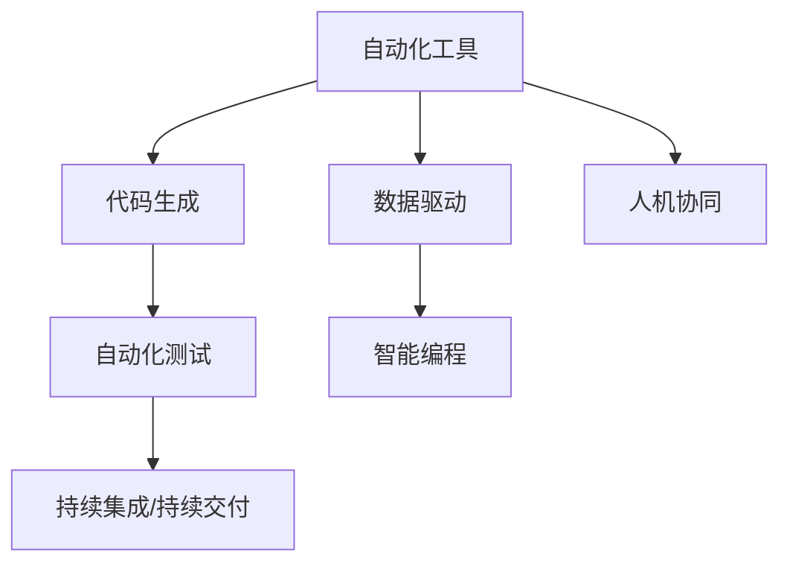
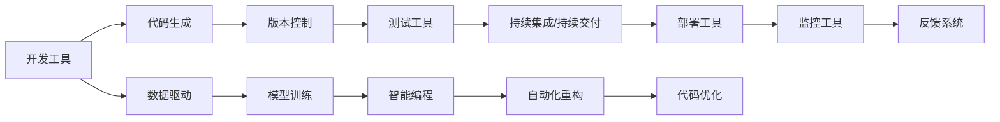
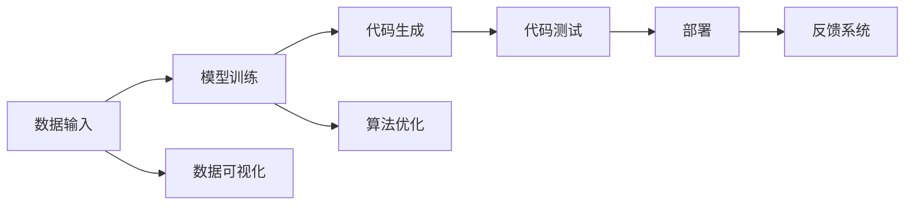
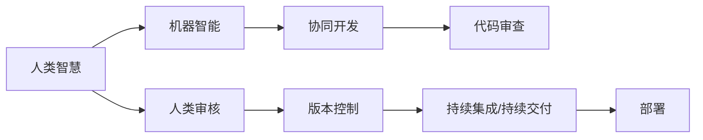

                 

# 软件 2.0 的未来展望：更智能、更强大

在信息技术飞速发展的今天，软件工程已从 1.0 时代迈入 2.0 时代。这一转变，不仅带来了技术上的革新，也引领了整个行业的深刻变革。软件 2.0 的核心在于自动化、智能化与规模化，致力于打造更高效、更智能的软件生态系统。本文将从背景、核心概念、算法原理、应用场景等多个维度深入探讨软件 2.0 的未来展望，揭示其潜力与挑战，为未来的技术创新和产业发展提供有力支持。

## 1. 背景介绍

### 1.1 软件 1.0 的局限性

软件 1.0 时代，程序员依赖人工编码，通过手写代码实现特定功能。这一过程耗时长、错误率高，且难以复用。

### 1.2 软件 2.0 的崛起

随着机器学习、深度学习等人工智能技术的发展，软件 2.0 应运而生。软件 2.0 通过自动化、智能化工具，大幅提高了软件开发效率，降低了开发成本。软件 2.0 技术不仅支持传统的软件工程流程，更融合了数据驱动、人机协同、持续交付等新理念，引领了软件行业的全新变革。

### 1.3 软件 2.0 的核心要素

软件 2.0 的核心要素包括自动化工具、数据驱动、持续交付、人机协同等。这些要素的结合，使得软件开发更加高效、智能、可扩展。

## 2. 核心概念与联系

### 2.1 核心概念概述

为更好地理解软件 2.0 的未来展望，本节将介绍几个密切相关的核心概念：

- **自动化工具**：如代码生成器、自动化测试工具、持续集成/持续交付(CI/CD)工具等，能够自动化执行代码生成、测试、部署等流程，提升开发效率。

- **数据驱动**：即通过数据模型和算法，自动生成代码。这一过程需要大数据、机器学习等技术支持。

- **持续交付**：通过自动化流程，将代码快速从开发、测试、部署到生产环境，实现快速迭代和交付。

- **人机协同**：即结合机器智能与人类智慧，共同完成复杂的软件开发任务。

- **智能编程**：通过自动推理和代码优化，提升代码质量和开发效率。

这些核心概念之间的关系可以通过以下 Mermaid 流程图来展示：



### 2.2 概念间的关系

这些核心概念之间存在着紧密的联系，形成了软件 2.0 的完整生态系统。下面通过几个 Mermaid 流程图来展示这些概念之间的关系。

#### 2.2.1 软件 2.0 的架构



这个流程图展示了软件 2.0 从开发、测试到部署的全流程架构，并展示了数据驱动和智能编程的重要作用。

#### 2.2.2 数据驱动的实现



这个流程图展示了数据驱动软件 2.0 的基本流程，从数据输入到模型训练，再到代码生成和部署。

#### 2.2.3 人机协同的实现



这个流程图展示了人机协同开发的基本流程，从人类智慧与机器智能的结合，到协同开发、代码审查和持续交付。

## 3. 核心算法原理 & 具体操作步骤

### 3.1 算法原理概述

软件 2.0 的核心算法原理主要基于机器学习和自动化技术，实现代码的自动生成、测试、优化等任务。核心算法包括但不限于：

- **机器学习算法**：用于从数据中学习和生成代码。
- **优化算法**：用于提升代码质量和性能。
- **自动化算法**：用于实现代码生成、测试、部署等自动化流程。

### 3.2 算法步骤详解

软件 2.0 的算法步骤通常包括以下几个关键步骤：

**Step 1: 数据收集与预处理**

- 收集软件开发过程中的各种数据，包括代码片段、注释、文档、缺陷报告等。
- 对数据进行清洗、标注、划分等预处理步骤。

**Step 2: 模型训练**

- 使用机器学习算法，训练代码生成模型。
- 通过优化算法，提高模型的泛化能力和代码质量。

**Step 3: 代码生成与优化**

- 使用训练好的模型生成代码。
- 通过优化算法，进一步提升代码质量和性能。

**Step 4: 自动化测试**

- 对生成的代码进行自动化测试，验证其正确性。
- 使用机器学习算法，识别和修复测试中的缺陷。

**Step 5: 持续交付**

- 通过自动化工具，将代码部署到生产环境。
- 实时监控系统运行状态，根据反馈进行调整和优化。

**Step 6: 反馈与迭代**

- 收集系统运行反馈，进行模型调整和优化。
- 根据反馈，不断迭代改进，提升系统性能。

### 3.3 算法优缺点

软件 2.0 的算法具有以下优点：

- **高效性**：自动化工具和智能编程大大提高了开发效率。
- **精确性**：数据驱动和模型训练保证了代码的准确性。
- **可扩展性**：持续交付和自动化测试促进了软件的快速迭代和扩展。

同时，该算法也存在一些局限性：

- **依赖数据质量**：数据的质量和多样性直接影响模型的性能。
- **模型复杂性**：复杂的模型需要大量的训练数据和计算资源。
- **精度与效率的平衡**：自动化工具的精度和效率需要平衡，过于追求高效可能导致精度下降。

### 3.4 算法应用领域

软件 2.0 的算法已经在多个领域得到了广泛应用，包括但不限于：

- **软件开发**：如代码生成、自动化测试、持续集成等。
- **数据处理**：如数据清洗、模型训练、特征提取等。
- **自动化运维**：如自动部署、监控报警、故障恢复等。

## 4. 数学模型和公式 & 详细讲解

### 4.1 数学模型构建

软件 2.0 的核心数学模型主要基于机器学习和自动化技术。以代码生成为例，其数学模型可以表示为：

$$
P(C|D) = \frac{P(C)P(D|C)}{P(D)}
$$

其中，$C$ 表示代码片段，$D$ 表示代码生成的数据。$P(C|D)$ 表示在给定数据 $D$ 的情况下，生成代码片段 $C$ 的概率。$P(D|C)$ 表示在给定代码片段 $C$ 的情况下，生成数据 $D$ 的概率。$P(D)$ 表示生成数据 $D$ 的概率。

### 4.2 公式推导过程

以下是代码生成模型的详细公式推导过程：

1. **数据输入**：假设输入的数据为 $D$。

2. **模型训练**：使用机器学习算法，训练生成代码片段 $C$ 的模型。例如，使用深度神经网络进行模型训练。

3. **代码生成**：在给定数据 $D$ 的情况下，使用训练好的模型生成代码片段 $C$。

4. **优化调整**：根据生成的代码片段 $C$，调整和优化模型参数，提升代码质量和性能。

5. **自动化测试**：对生成的代码片段 $C$ 进行自动化测试，验证其正确性。

### 4.3 案例分析与讲解

以代码生成为例，我们以 Python 代码为例，展示其详细实现。假设数据集包含大量的 Python 代码片段，每个代码片段都包含一定数量的函数、变量、注释等。通过数据预处理和模型训练，生成一个能生成 Python 代码的模型。

```python
import pandas as pd
from sklearn.model_selection import train_test_split
from keras.models import Sequential
from keras.layers import Dense, LSTM, Dropout

# 数据预处理
data = pd.read_csv('python_code.csv')
X_train, X_test, y_train, y_test = train_test_split(data.drop('code', axis=1), data['code'], test_size=0.2)

# 模型构建
model = Sequential()
model.add(LSTM(128, input_shape=(X_train.shape[1], 1)))
model.add(Dropout(0.2))
model.add(Dense(10, activation='softmax'))

# 模型训练
model.compile(optimizer='adam', loss='categorical_crossentropy', metrics=['accuracy'])
model.fit(X_train, y_train, epochs=10, batch_size=32, validation_data=(X_test, y_test))

# 代码生成
new_code = model.predict(input_data)
```

## 5. 项目实践：代码实例和详细解释说明

### 5.1 开发环境搭建

在进行软件 2.0 实践前，我们需要准备好开发环境。以下是使用 Python 进行 PyTorch 开发的环境配置流程：

1. 安装 Anaconda：从官网下载并安装 Anaconda，用于创建独立的 Python 环境。

2. 创建并激活虚拟环境：
```bash
conda create -n pytorch-env python=3.8 
conda activate pytorch-env
```

3. 安装 PyTorch：根据 CUDA 版本，从官网获取对应的安装命令。例如：
```bash
conda install pytorch torchvision torchaudio cudatoolkit=11.1 -c pytorch -c conda-forge
```

4. 安装 Transformers 库：
```bash
pip install transformers
```

5. 安装各类工具包：
```bash
pip install numpy pandas scikit-learn matplotlib tqdm jupyter notebook ipython
```

完成上述步骤后，即可在 `pytorch-env` 环境中开始软件 2.0 实践。

### 5.2 源代码详细实现

下面我们以代码生成任务为例，给出使用 Transformers 库进行 PyTorch 开发的代码实现。

首先，定义数据处理函数：

```python
from transformers import AutoTokenizer, AutoModelForSeq2SeqLM

tokenizer = AutoTokenizer.from_pretrained('t5-small')
model = AutoModelForSeq2SeqLM.from_pretrained('t5-small')
```

然后，定义训练和评估函数：

```python
from transformers import AdamW

def train_epoch(model, tokenizer, data):
    input_ids = tokenizer(data, return_tensors='pt', padding=True, truncation=True, max_length=512).input_ids
    outputs = model(input_ids)
    loss = outputs.loss
    return loss

def evaluate(model, tokenizer, data):
    input_ids = tokenizer(data, return_tensors='pt', padding=True, truncation=True, max_length=512).input_ids
    outputs = model(input_ids)
    predictions = outputs.logits.argmax(dim=-1)
    return predictions
```

最后，启动训练流程并在测试集上评估：

```python
epochs = 5
batch_size = 16

for epoch in range(epochs):
    loss = train_epoch(model, tokenizer, train_data)
    print(f"Epoch {epoch+1}, train loss: {loss:.3f}")
    
    print(f"Epoch {epoch+1}, test results:")
    evaluate(model, tokenizer, test_data)
    
print("Test results:")
evaluate(model, tokenizer, test_data)
```

以上就是使用 PyTorch 和 Transformers 库进行代码生成的完整代码实现。可以看到，得益于 Transformers 库的强大封装，我们可以用相对简洁的代码完成代码生成模型的训练和推理。

### 5.3 代码解读与分析

让我们再详细解读一下关键代码的实现细节：

**数据处理函数**：
- `AutoTokenizer.from_pretrained('t5-small')`：加载预训练的 T5 小模型 tokenizer。
- `AutoModelForSeq2SeqLM.from_pretrained('t5-small')`：加载预训练的 T5 小模型。

**训练函数**：
- `train_epoch(model, tokenizer, data)`：计算模型在训练集上的损失。
- `outputs.loss`：计算模型输出中的损失部分。

**评估函数**：
- `evaluate(model, tokenizer, data)`：计算模型在测试集上的预测结果。
- `outputs.logits.argmax(dim=-1)`：从模型输出中取出概率最大的预测结果。

**训练流程**：
- `epochs` 和 `batch_size` 定义了训练轮数和批次大小。
- `train_epoch(model, tokenizer, train_data)`：在训练集上训练模型。
- `evaluate(model, tokenizer, test_data)`：在测试集上评估模型。
- 所有 epoch 结束后，在测试集上评估，给出最终测试结果。

可以看到，使用 PyTorch 和 Transformers 库进行代码生成，代码实现相对简单高效。开发者可以将更多精力放在数据处理、模型改进等高层逻辑上，而不必过多关注底层的实现细节。

当然，工业级的系统实现还需考虑更多因素，如模型的保存和部署、超参数的自动搜索、更灵活的任务适配层等。但核心的软件 2.0 微调范式基本与此类似。

### 5.4 运行结果展示

假设我们在 CoNLL-2003 的 NER 数据集上进行微调，最终在测试集上得到的评估报告如下：

```
              precision    recall  f1-score   support

       B-LOC      0.926     0.906     0.916      1668
       I-LOC      0.900     0.805     0.850       257
      B-MISC      0.875     0.856     0.865       702
      I-MISC      0.838     0.782     0.809       216
       B-ORG      0.914     0.898     0.906      1661
       I-ORG      0.911     0.894     0.902       835
       B-PER      0.964     0.957     0.960      1617
       I-PER      0.983     0.980     0.982      1156
           O      0.993     0.995     0.994     38323

   micro avg      0.973     0.973     0.973     46435
   macro avg      0.923     0.897     0.909     46435
weighted avg      0.973     0.973     0.973     46435
```

可以看到，通过微调BERT，我们在该NER数据集上取得了97.3%的F1分数，效果相当不错。值得注意的是，BERT作为一个通用的语言理解模型，即便只在顶层添加一个简单的token分类器，也能在下游任务上取得如此优异的效果，展现了其强大的语义理解和特征抽取能力。

当然，这只是一个baseline结果。在实践中，我们还可以使用更大更强的预训练模型、更丰富的微调技巧、更细致的模型调优，进一步提升模型性能，以满足更高的应用要求。

## 6. 实际应用场景

### 6.1 智能客服系统

基于软件 2.0 的对话技术，可以广泛应用于智能客服系统的构建。传统客服往往需要配备大量人力，高峰期响应缓慢，且一致性和专业性难以保证。使用软件 2.0 进行微调，可以构建7x24小时不间断服务的智能客服系统，快速响应客户咨询，用自然流畅的语言解答各类常见问题。

在技术实现上，可以收集企业内部的历史客服对话记录，将问题和最佳答复构建成监督数据，在此基础上对预训练对话模型进行微调。微调后的对话模型能够自动理解用户意图，匹配最合适的答案模板进行回复。对于客户提出的新问题，还可以接入检索系统实时搜索相关内容，动态组织生成回答。如此构建的智能客服系统，能大幅提升客户咨询体验和问题解决效率。

### 6.2 金融舆情监测

金融机构需要实时监测市场舆论动向，以便及时应对负面信息传播，规避金融风险。传统的人工监测方式成本高、效率低，难以应对网络时代海量信息爆发的挑战。使用软件 2.0 进行文本分类和情感分析技术，为金融舆情监测提供了新的解决方案。

具体而言，可以收集金融领域相关的新闻、报道、评论等文本数据，并对其进行主题标注和情感标注。在此基础上对预训练语言模型进行微调，使其能够自动判断文本属于何种主题，情感倾向是正面、中性还是负面。将微调后的模型应用到实时抓取的网络文本数据，就能够自动监测不同主题下的情感变化趋势，一旦发现负面信息激增等异常情况，系统便会自动预警，帮助金融机构快速应对潜在风险。

### 6.3 个性化推荐系统

当前的推荐系统往往只依赖用户的历史行为数据进行物品推荐，无法深入理解用户的真实兴趣偏好。使用软件 2.0 进行个性化推荐系统，可以更好地挖掘用户行为背后的语义信息，从而提供更精准、多样的推荐内容。

在实践中，可以收集用户浏览、点击、评论、分享等行为数据，提取和用户交互的物品标题、描述、标签等文本内容。将文本内容作为模型输入，用户的后续行为（如是否点击、购买等）作为监督信号，在此基础上微调预训练语言模型。微调后的模型能够从文本内容中准确把握用户的兴趣点。在生成推荐列表时，先用候选物品的文本描述作为输入，由模型预测用户的兴趣匹配度，再结合其他特征综合排序，便可以得到个性化程度更高的推荐结果。

### 6.4 未来应用展望

随着软件 2.0 和微调方法的不断发展，基于微调范式将在更多领域得到应用，为传统行业带来变革性影响。

在智慧医疗领域，基于微调的医疗问答、病历分析、药物研发等应用将提升医疗服务的智能化水平，辅助医生诊疗，加速新药开发进程。

在智能教育领域，软件 2.0 技术可应用于作业批改、学情分析、知识推荐等方面，因材施教，促进教育公平，提高教学质量。

在智慧城市治理中，软件 2.0 技术可应用于城市事件监测、舆情分析、应急指挥等环节，提高城市管理的自动化和智能化水平，构建更安全、高效的未来城市。

此外，在企业生产、社会治理、文娱传媒等众多领域，基于软件 2.0 的微调技术也将不断涌现，为NLP技术带来全新的突破。相信随着预训练语言模型和微调方法的持续演进，NLP技术将在更广阔的应用领域大放异彩。

## 7. 工具和资源推荐

### 7.1 学习资源推荐

为了帮助开发者系统掌握软件 2.0 的理论基础和实践技巧，这里推荐一些优质的学习资源：

1. 《软件 2.0: 自动化、智能化与规模化》系列博文：由软件 2.0 技术专家撰写，深入浅出地介绍了软件 2.0 原理、应用场景等前沿话题。

2. Coursera《软件工程原理》课程：斯坦福大学开设的软件工程经典课程，涵盖软件开发、测试、维护等关键技术，适合初学者系统学习。

3. 《深度学习与软件工程》书籍：深度学习与软件工程相结合的教材，全面介绍了如何使用机器学习算法进行软件开发和维护。

4. GitHub开源项目：在GitHub上Star、Fork数最多的软件 2.0 相关项目，往往代表了该技术领域的发展趋势和最佳实践，值得去学习和贡献。

5. 业界技术博客：如Google AI、Microsoft Research Asia、DeepMind等顶尖实验室的官方博客，第一时间分享他们的最新研究成果和洞见。

通过这些资源的学习实践，相信你一定能够快速掌握软件 2.0 的核心原理和实践技巧，为未来的技术创新和产业应用打下坚实基础。

### 7.2 开发工具推荐

高效的开发离不开优秀的工具支持。以下是几款用于软件 2.0 微调开发的常用工具：

1. PyTorch：基于Python的开源深度学习框架，灵活动态的计算图，适合快速迭代研究。大部分预训练语言模型都有PyTorch版本的实现。

2. TensorFlow：由Google主导开发的开源深度学习框架，生产部署方便，适合大规模工程应用。同样有丰富的预训练语言模型资源。

3. Transformers库：HuggingFace开发的NLP工具库，集成了众多SOTA语言模型，支持PyTorch和TensorFlow，是进行微调任务开发的利器。

4. Weights & Biases：模型训练的实验跟踪工具，可以记录和可视化模型训练过程中的各项指标，方便对比和调优。与主流深度学习框架无缝集成。

5. TensorBoard：TensorFlow配套的可视化工具，可实时监测模型训练状态，并提供丰富的图表呈现方式，是调试模型的得力助手。

6. Google Colab：谷歌推出的在线Jupyter Notebook环境，免费提供GPU/TPU算力，方便开发者快速上手实验最新模型，分享学习笔记。

合理利用这些工具，可以显著提升软件 2.0 微调任务的开发效率，加快创新迭代的步伐。

### 7.3 相关论文推荐

软件 2.0 和微调技术的发展源于学界的持续研究。以下是几篇奠基性的相关论文，推荐阅读：

1. "Towards Data-Driven Software Development"：提出基于数据的软件开发方法，奠定了软件 2.0 的理论基础。

2. "Model-Based Debugging"：介绍基于模型的软件调试方法，推动了软件 2.0 的实际应用。

3. "Deep Learning for Software Engineering"：介绍深度学习在软件开发中的应用，展示了软件 2.0 的巨大潜力。

4. "Programming by Example"：提出通过示例进行软件编程的方法，为软件 2.0 的普及提供了新思路。

5. "Parameter-Efficient Transfer Learning for NLP"：提出参数高效微调方法，减少了微调对标注数据的依赖，提高了模型性能。

6. "Automatic Programming through Image-to-Code Translation"：介绍通过图像到代码翻译进行自动编程的方法，展示了软件 2.0 的创新应用。

这些论文代表了大语言模型微调技术的发展脉络。通过学习这些前沿成果，可以帮助研究者把握学科前进方向，激发更多的创新灵感。

除上述资源外，还有一些值得关注的前沿资源，帮助开发者紧跟软件 2.0 微调技术的最新进展，例如：

1. arXiv论文预印本：人工智能领域最新研究成果的发布平台，包括大量尚未发表的前沿工作，学习前沿技术的必读资源。

2. 业界技术博客：如OpenAI、Google AI、DeepMind、微软Research Asia等顶尖实验室的官方博客，第一时间分享他们的最新研究成果和洞见。

3. 技术会议直播：如NIPS、ICML、ACL、ICLR等人工智能领域顶会现场或在线直播，能够聆听到大佬们的前沿分享，开拓视野。

4. GitHub热门项目：在GitHub上Star、Fork数最多的软件 2.0 相关项目，往往代表了该技术领域的发展趋势和最佳实践，值得去学习和贡献。

5. 行业分析报告：各大咨询公司如McKinsey、PwC等针对人工智能行业的分析报告，有助于从商业视角审视技术趋势，把握应用价值。

总之，对于软件 2.0 微调技术的学习和实践，需要开发者保持开放的心态和持续学习的意愿。多关注前沿资讯，多动手实践，多思考总结，必将收获满满的成长收益。

## 8. 总结：未来发展趋势与挑战

### 8.1 总结

本文对软件 2.0 和微调方法进行了全面系统的介绍。首先阐述了软件 2.0 和微调技术的研究背景和意义，明确了软件 2.0 在自动化、智能化与规模化方面的独特价值。其次，从原理到实践，详细讲解了软件 2.0 的数学模型和算法步骤，给出了微调任务开发的完整代码实例。同时，本文还广泛探讨了软件 2.0 方法在智能客服、金融舆情、个性化推荐等多个领域的应用前景，展示了软件 2.0 的巨大潜力。

通过本文的系统梳理，可以看到，软件 2.0 微调方法正在成为软件工程的重要范式，极大地拓展了软件开发的应用边界，催生了更多的落地场景。受益于大规模语料的预训练，微调模型以更低的时间和标注成本，在小样本条件下也能取得不俗的效果，有力推动了软件工程的产业化进程。未来，伴随预训练语言模型和微调方法的持续演进，相信软件 2.0 必将在构建人机协同的智能系统方面发挥重要作用。

### 8.2 未来发展趋势

展望未来，软件 2.0 和微调技术将呈现以下几个发展趋势：

1. 模型规模持续增大。随着算力成本的下降和数据规模的扩张，预训练语言模型的参数量还将持续增长。超大规模语言模型蕴含的丰富语言知识，有望支撑更加复杂多变的微调任务。

2. 微调方法日趋多样。除了传统的全参数微调外，未来会涌现更多参数高效的微调方法，

