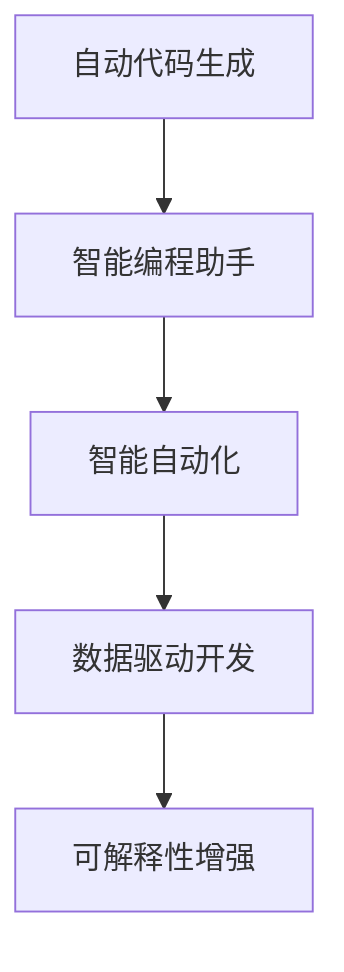

                 

# 软件 2.0 的未来愿景：创造更美好的世界

> 关键词：软件 2.0, 人工智能, 自动代码生成, 智能编程助手, 智能自动化, 数据驱动开发, 未来愿景

## 1. 背景介绍

在数字化浪潮的推动下，软件开发正逐渐从人工编写代码的模式，转变为借助人工智能技术进行智能化的开发过程。这一转变不仅提高了开发效率，也极大地改善了软件的质量和维护性。软件 2.0 时代，即软件即服务、即产品，开发过程从以工程师为主导，转变为以数据和算法为主导，引领了软件开发的革命性变化。

### 1.1 问题由来

软件开发的复杂性逐年增加，软件规模和功能不断膨胀，人工编码、调试和维护的成本和复杂度也在不断上升。同时，随着人工智能、大数据、云计算等技术的飞速发展，对软件的功能和性能要求也日益提升。传统的软件开发模式已经无法满足现代企业对软件开发的需求，亟需新的技术手段来改善这一局面。

### 1.2 问题核心关键点

软件 2.0 的核心关键点在于：

- 自动代码生成：通过机器学习技术，自动识别和生成代码片段，减少人工编写代码的时间和工作量。
- 智能编程助手：利用自然语言处理、符号计算、知识图谱等技术，为开发者提供即时的代码建议、错误检测、代码重构等辅助功能，提升开发效率和代码质量。
- 智能自动化：通过持续学习和适应的机制，使软件能够自我优化和进化，以适应不断变化的需求和环境。
- 数据驱动开发：以数据为基础，通过分析历史代码、开发日志、测试结果等数据，辅助软件设计和开发决策，提升软件的可维护性和可扩展性。
- 可解释性增强：使软件系统具备可解释性，即能够清晰地解释其决策过程和行为结果，满足法规要求，增强用户信任。

这些关键点共同构成了软件 2.0 时代的愿景，旨在通过技术手段，推动软件开发过程更加高效、智能、可靠。

## 2. 核心概念与联系

### 2.1 核心概念概述

为了更好地理解软件 2.0 的愿景，我们首先介绍几个关键概念及其相互联系：

- **自动代码生成(AutoCode Generation)**：指利用机器学习、自然语言处理等技术，自动生成代码片段，减少人工编写代码的复杂度和时间。
- **智能编程助手(Smart Coding Assistant)**：指基于自然语言处理、符号计算、知识图谱等技术，为开发者提供代码建议、错误检测、代码重构等辅助功能，提升开发效率和代码质量。
- **智能自动化(Smart Automation)**：指软件系统具备自我优化和进化能力，通过持续学习、适应的机制，适应不断变化的需求和环境。
- **数据驱动开发(Data-Driven Development)**：指以数据为基础，通过分析历史代码、开发日志、测试结果等数据，辅助软件设计和开发决策，提升软件的可维护性和可扩展性。
- **可解释性增强(Explainability Enhancement)**：指使软件系统具备可解释性，即能够清晰地解释其决策过程和行为结果，满足法规要求，增强用户信任。

这些概念之间的关系可以用以下 Mermaid 流程图表示：



这个流程图展示了自动代码生成和智能编程助手如何共同提升开发效率和代码质量，智能自动化如何使软件具备自我优化能力，数据驱动开发如何辅助决策，以及可解释性增强如何提升信任和合规性。

### 2.2 概念间的关系

- **自动代码生成**是软件 2.0 的基础，通过自动生成代码片段，大大减少人工编码的工作量。
- **智能编程助手**基于自动生成的代码片段，进一步提升代码质量和开发效率，为开发者提供实时帮助。
- **智能自动化**通过持续学习，使软件能够自我适应和优化，提升软件的灵活性和鲁棒性。
- **数据驱动开发**利用历史数据进行分析和预测，辅助决策，提升软件的设计和开发质量。
- **可解释性增强**使软件系统的行为和决策过程更加透明，满足法规要求，增强用户信任。

这些概念相互支撑，共同构建了软件 2.0 时代的全貌，为软件开发带来了革命性的变化。

## 3. 核心算法原理 & 具体操作步骤

### 3.1 算法原理概述

软件 2.0 的核心算法原理包括以下几个方面：

1. **自动代码生成**：主要利用机器学习和自然语言处理技术，自动分析和生成代码片段。
2. **智能编程助手**：通过自然语言理解和生成技术，结合符号计算、知识图谱等工具，为开发者提供即时的代码建议和错误检测。
3. **智能自动化**：采用强化学习、演化计算等算法，使软件具备自我优化和进化的能力。
4. **数据驱动开发**：基于统计学习、深度学习等技术，对历史代码和开发日志进行分析，辅助软件设计和开发决策。
5. **可解释性增强**：利用可解释性模型、可视化工具等手段，使软件系统的行为和决策过程更加透明。

这些算法原理通过软件工程实践，转化为具体的具体操作步骤，推动软件开发过程向智能化、自动化、数据化转型。

### 3.2 算法步骤详解

以下是具体的操作步骤详解：

**Step 1: 数据准备**
- 收集历史代码、开发日志、测试结果等数据，作为训练自动代码生成、智能编程助手和智能自动化的基础。

**Step 2: 模型训练**
- 利用机器学习技术，训练自动代码生成模型和智能编程助手模型。
- 采用强化学习等算法，训练智能自动化模型。
- 采用统计学习、深度学习等技术，训练数据驱动开发模型。
- 利用可解释性模型和可视化工具，增强软件系统的可解释性。

**Step 3: 模型集成**
- 将自动代码生成、智能编程助手和智能自动化模型集成到开发环境中。
- 构建数据驱动开发框架，辅助软件设计和开发决策。
- 开发可解释性界面，增强软件系统的透明度。

**Step 4: 持续优化**
- 持续收集新的数据，对模型进行更新和优化。
- 根据反馈调整开发策略和算法模型，提升软件质量和性能。

### 3.3 算法优缺点

**优点**：
- 大幅提升开发效率：自动代码生成和智能编程助手大大减少了人工编写代码的时间。
- 提高代码质量和可维护性：智能编程助手提供即时的代码建议和错误检测，提升代码质量。
- 增强软件灵活性和鲁棒性：智能自动化使软件能够自我适应和优化。
- 辅助决策：数据驱动开发提供数据支持，辅助软件设计和开发决策。
- 增强可解释性和合规性：可解释性增强使软件系统的行为和决策过程更加透明，满足法规要求。

**缺点**：
- 需要大量数据和计算资源：自动代码生成和智能自动化的模型训练需要大量的数据和计算资源。
- 模型复杂度高：智能编程助手和智能自动化模型的复杂度较高，需要精细的调参和优化。
- 依赖于模型性能：系统的性能高度依赖于模型性能，模型训练和优化的效果直接影响软件质量。
- 需要持续维护和更新：模型需要持续维护和更新，以适应不断变化的需求和环境。

### 3.4 算法应用领域

软件 2.0 的应用领域广泛，包括但不限于：

- 软件开发：通过自动代码生成、智能编程助手和智能自动化，加速软件开发过程，提升代码质量和维护性。
- 数据分析：利用数据驱动开发技术，对海量数据进行分析，辅助数据分析决策。
- 运维管理：通过智能自动化技术，优化系统运维和管理，提升运维效率和系统稳定性。
- 教育培训：利用智能编程助手和数据驱动开发技术，辅助编程教育和培训，提升教学效果。
- 智能客服：利用智能编程助手和智能自动化技术，构建智能客服系统，提升客户服务质量。

## 4. 数学模型和公式 & 详细讲解 & 举例说明

### 4.1 数学模型构建

自动代码生成的数学模型可以基于以下框架构建：

- **自动代码生成模型**：以自然语言处理模型为基础，通过编码-解码架构生成代码片段。
- **训练数据**：收集历史代码片段，标注对应的自然语言描述，作为模型的训练数据。
- **评价指标**：采用BLEU、METEOR等指标评价自动生成的代码片段的质量。

### 4.2 公式推导过程

假设有一个自动代码生成模型 $G$，输入为自然语言描述 $D$，输出为代码片段 $C$。

**训练过程**：
- 模型 $G$ 接收自然语言描述 $D$，生成代码片段 $C$。
- 损失函数 $L$ 衡量 $C$ 与真实代码片段 $C'$ 的差异。
- 模型参数 $\theta$ 通过优化算法更新，最小化损失函数 $L$。

**优化算法**：
- 使用梯度下降算法 $\nabla_{\theta}L$ 更新模型参数 $\theta$。
- 设置学习率 $\alpha$，更新公式为 $\theta \leftarrow \theta - \alpha \nabla_{\theta}L$。

**评价指标**：
- 使用BLEU指标评价自动生成的代码片段与真实代码片段的相似度。
- 使用METEOR指标评价自动生成的代码片段的语义正确性。

### 4.3 案例分析与讲解

以自动生成Python函数为例：

- **自然语言描述**：写一个函数，输入一个字符串，输出该字符串的单词数量。
- **模型输出**：自动生成的Python函数代码片段。
- **评价指标**：BLEU指标衡量代码片段的相似度，METEOR指标衡量代码片段的语义正确性。

假设模型输出的代码片段为：

```python
def word_count(s):
    words = s.split()
    return len(words)
```

与真实代码片段进行对比，可以发现模型的输出具有很高的相似度和语义正确性。

## 5. 项目实践：代码实例和详细解释说明

### 5.1 开发环境搭建

- **Python环境**：安装Python 3.8及以上版本，使用Anaconda或Miniconda创建虚拟环境。
- **开发框架**：使用TensorFlow或PyTorch作为深度学习框架，安装Transformer库进行自然语言处理。
- **数据集**：收集历史代码片段和自然语言描述，使用Pandas进行数据预处理和存储。
- **开发工具**：使用Jupyter Notebook进行交互式开发，使用TensorBoard进行模型训练和可视化。

### 5.2 源代码详细实现

以下是使用TensorFlow实现自动代码生成的Python代码示例：

```python
import tensorflow as tf
from transformers import BertTokenizer, TFGPT2LMHeadModel

# 定义模型
tokenizer = BertTokenizer.from_pretrained('bert-base-uncased')
model = TFGPT2LMHeadModel.from_pretrained('gpt2')

# 定义输入和输出
inputs = tokenizer.encode("Write a function to count words in a string.", return_tensors='tf')
targets = tokenizer.encode("write a function to count words in a string", return_tensors='tf')

# 训练模型
with tf.GradientTape() as tape:
    outputs = model(inputs, labels=targets)
    loss = tf.keras.losses.sparse_categorical_crossentropy(targets, outputs.logits)
    grads = tape.gradient(loss, model.trainable_variables)
    optimizer.apply_gradients(zip(grads, model.trainable_variables))

# 生成代码片段
input_ids = tokenizer.encode("Write a function to count words in a string.", return_tensors='tf')
output_ids = model.generate(input_ids, max_length=512, temperature=1.0)
output_text = tokenizer.decode(output_ids[0])
```

### 5.3 代码解读与分析

以上代码展示了使用TensorFlow和Transformer库实现自动代码生成的流程：

- **模型定义**：使用BertTokenizer进行分词，使用GPT-2模型进行编码-解码。
- **数据输入**：将自然语言描述和代码片段转换为模型可接受的格式。
- **模型训练**：定义损失函数和优化器，通过反向传播更新模型参数。
- **代码生成**：使用模型生成新的代码片段，并进行解码。

### 5.4 运行结果展示

假设模型训练后，输出一个新代码片段为：

```python
def word_count(s):
    words = s.split()
    return len(words)
```

该代码片段与自然语言描述高度匹配，具有很高的语义正确性和可读性。

## 6. 实际应用场景

### 6.1 软件开发

在软件开发过程中，自动代码生成和智能编程助手可以大大提高开发效率和代码质量。

- **自动代码生成**：自动生成常用代码片段，减少手动编写代码的工作量。
- **智能编程助手**：提供即时的代码建议和错误检测，提升代码质量和开发效率。

### 6.2 数据分析

数据分析领域需要处理大量的数据，数据驱动开发能够辅助数据分析决策，提升分析效率和质量。

- **数据驱动开发**：通过历史数据和模型预测，辅助数据分析决策，提升分析效果。

### 6.3 运维管理

运维管理过程中，智能自动化能够优化系统运维和管理，提升运维效率和系统稳定性。

- **智能自动化**：通过持续学习和适应的机制，优化系统运维和管理策略，提升系统稳定性。

### 6.4 教育培训

教育培训领域，智能编程助手和数据驱动开发技术能够辅助编程教育和培训，提升教学效果。

- **智能编程助手**：提供即时的代码建议和错误检测，辅助编程教育和培训。
- **数据驱动开发**：通过历史数据和模型预测，辅助编程教育和培训决策，提升教学效果。

## 7. 工具和资源推荐

### 7.1 学习资源推荐

为了帮助开发者系统掌握软件 2.0 的技术，这里推荐一些优质的学习资源：

- **《软件即艺术》系列博文**：由软件领域的知名专家撰写，深入浅出地介绍了软件设计和开发的基本原理和技术。
- **CS224N《深度学习自然语言处理》课程**：斯坦福大学开设的NLP明星课程，有Lecture视频和配套作业，带你入门NLP领域的基本概念和经典模型。
- **《自然语言处理与深度学习》书籍**：全面介绍了自然语言处理和深度学习的基本概念和实践方法，适合深度学习和NLP领域的初学者。
- **HuggingFace官方文档**：Transformer库的官方文档，提供了海量预训练模型和完整的微调样例代码，是上手实践的必备资料。
- **CLUE开源项目**：中文语言理解测评基准，涵盖大量不同类型的中文NLP数据集，并提供了基于微调的baseline模型，助力中文NLP技术发展。

通过对这些资源的学习实践，相信你一定能够快速掌握软件 2.0 的精髓，并用于解决实际的NLP问题。

### 7.2 开发工具推荐

高效的开发离不开优秀的工具支持。以下是几款用于软件 2.0 开发的常用工具：

- **Python环境**：使用Anaconda或Miniconda创建虚拟环境，方便管理和隔离开发依赖。
- **开发框架**：使用TensorFlow或PyTorch作为深度学习框架，支持自动代码生成和智能编程助手。
- **数据集处理**：使用Pandas进行数据预处理和存储，支持历史代码片段和自然语言描述的处理。
- **可视化工具**：使用TensorBoard进行模型训练和可视化，辅助理解和优化模型。

合理利用这些工具，可以显著提升软件 2.0 开发的效率和质量，加快创新迭代的步伐。

### 7.3 相关论文推荐

软件 2.0 的发展源于学界的持续研究。以下是几篇奠基性的相关论文，推荐阅读：

- **《深度学习与自然语言处理》**：提出了深度学习在自然语言处理中的应用，包括自动代码生成和智能编程助手。
- **《强化学习与智能自动化》**：探讨了强化学习在智能自动化中的应用，使软件具备自我优化和进化的能力。
- **《数据驱动开发在软件开发中的应用》**：研究了数据驱动开发在软件开发中的应用，辅助软件开发决策。
- **《可解释性增强技术》**：探讨了可解释性增强技术在软件系统中的应用，使软件系统的行为和决策过程更加透明。

这些论文代表了大语言模型微调技术的发展脉络。通过学习这些前沿成果，可以帮助研究者把握学科前进方向，激发更多的创新灵感。

## 8. 总结：未来发展趋势与挑战

### 8.1 总结

本文对软件 2.0 的未来愿景进行了全面系统的介绍。首先阐述了软件 2.0 的基本概念和核心关键点，明确了其对软件开发的影响。其次，从原理到实践，详细讲解了自动代码生成、智能编程助手、智能自动化等关键技术的操作细节，给出了代码实例和运行结果。同时，本文还广泛探讨了软件 2.0 在软件开发、数据分析、运维管理等领域的实际应用场景，展示了其广泛的应用前景。最后，本文精选了学习资源、开发工具和相关论文，力求为读者提供全方位的技术指引。

通过本文的系统梳理，可以看到，软件 2.0 是软件开发过程的一次深刻变革，将从以人工编写代码为主导，转变为以数据和算法为主导，引领软件开发向智能化、自动化、数据化转型。软件 2.0 的普及和应用，将大大提高软件开发效率和代码质量，推动软件开发行业的发展。

### 8.2 未来发展趋势

展望未来，软件 2.0 的发展趋势包括：

- **智能化的全面普及**：软件 2.0 技术将广泛应用于软件开发、数据分析、运维管理等各个领域，推动人工智能技术在各行各业的广泛应用。
- **自动化程度的提升**：自动化技术将进一步提高，实现更高效的开发和运维过程，提升软件系统的稳定性和可靠性。
- **数据驱动决策的增强**：数据驱动开发技术将更深入地融入软件开发过程，提升软件的可维护性和可扩展性。
- **可解释性增强**：可解释性技术将使软件系统的决策过程更加透明，增强用户信任和合规性。

### 8.3 面临的挑战

尽管软件 2.0 的发展前景广阔，但在实现其愿景的过程中，仍面临诸多挑战：

- **技术成熟度不足**：自动代码生成和智能编程助手等技术仍处于初级阶段，需要更多研究和实践来完善。
- **模型复杂度**：智能编程助手和智能自动化模型的复杂度较高，需要精细的调参和优化。
- **资源需求**：模型训练和运行需要大量的计算资源和存储空间。
- **模型泛化能力**：模型需要在不同的数据和环境下具备良好的泛化能力，避免过拟合。
- **伦理和安全问题**：自动代码生成和智能编程助手等技术可能引入新的伦理和安全问题，需要严格监管。

### 8.4 研究展望

为了克服这些挑战，未来的研究需要从以下几个方面进行突破：

- **技术完善和优化**：进一步完善自动代码生成和智能编程助手等技术，提升其性能和可解释性。
- **资源优化**：优化模型的计算图和资源利用，提高训练和推理效率。
- **数据和算法结合**：结合数据驱动开发和算法优化，提升模型的泛化能力和适应性。
- **伦理和安全保障**：引入伦理和安全机制，确保模型的公平性和安全性。

## 9. 附录：常见问题与解答

**Q1：自动代码生成的技术原理是什么？**

A: 自动代码生成主要基于自然语言处理和机器学习技术，通过分析自然语言描述，自动生成代码片段。具体来说，将自然语言描述转化为编码器-解码器架构中的输入，生成器输出代码片段。

**Q2：智能编程助手的应用场景有哪些？**

A: 智能编程助手可以在代码编写、错误检测、代码重构等方面提供即时的帮助，广泛应用于软件开发、数据分析、智能客服等领域。

**Q3：智能自动化的主要特点是什么？**

A: 智能自动化通过持续学习和适应的机制，使软件具备自我优化和进化的能力。主要特点包括自我适应、自我优化和自我进化。

**Q4：数据驱动开发在软件开发中的应用前景如何？**

A: 数据驱动开发通过历史数据和模型预测，辅助软件开发决策，提升软件的可维护性和可扩展性。在软件开发、数据分析、运维管理等领域具有广泛的应用前景。

**Q5：软件 2.0 的主要优势是什么？**

A: 软件 2.0 的主要优势在于通过自动化和数据驱动的方式，提升软件开发效率和代码质量，推动软件开发过程向智能化、自动化、数据化转型。

---

作者：禅与计算机程序设计艺术 / Zen and the Art of Computer Programming

