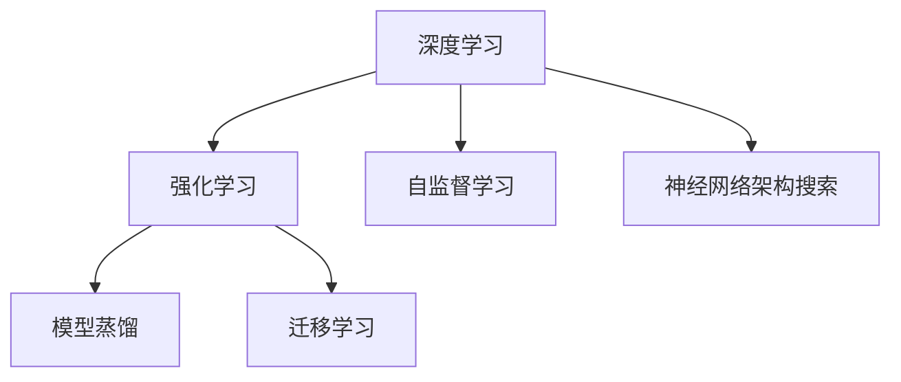
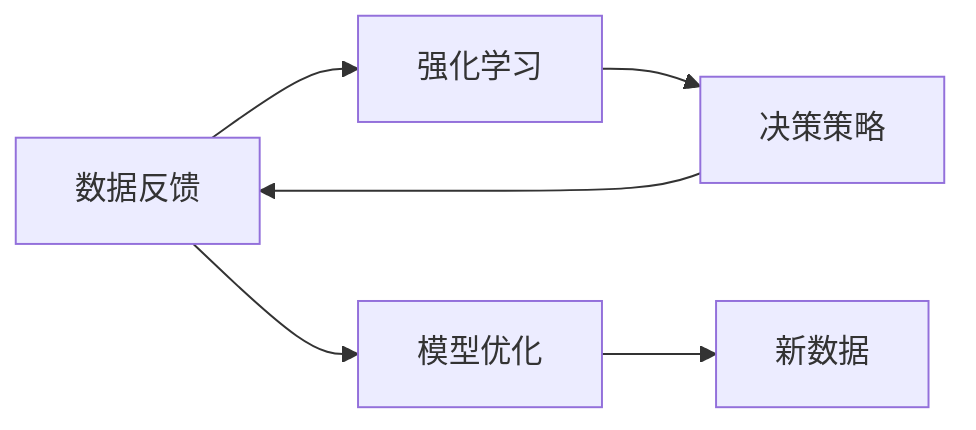
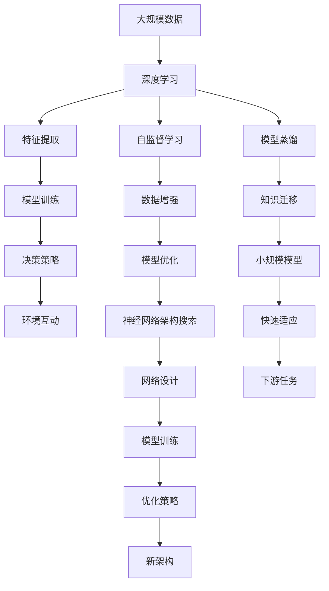

                 

# 软件 2.0 的未来趋势：深度学习、强化学习

## 1. 背景介绍

### 1.1 问题由来
随着计算资源和数据量的飞速增长，软件工程正在经历一场深刻的变革。人工智能技术，特别是深度学习和强化学习的兴起，使得传统的软件开发模式无法满足日益增长的需求。传统的软件开发模式强调的是代码的编写和调试，而人工智能则注重数据驱动的模型训练和优化，这一转变对软件开发产生了深远的影响。

### 1.2 问题核心关键点
软件 2.0 的核心在于利用人工智能技术，特别是深度学习和强化学习，进行软件系统的自动构建和优化。其关键点包括：

- 软件系统的大规模自动构建。利用深度学习和强化学习，能够自动设计、构建和优化复杂的软件系统。
- 软件系统的持续优化。通过不断的训练和优化，软件系统能够自动适应环境变化，提高性能和效率。
- 软件系统的自动化测试和调试。利用深度学习模型进行自动化测试和调试，能够快速定位和解决问题。
- 软件系统的知识积累和复用。通过强化学习，软件系统能够积累和复用开发经验，提升开发效率。

### 1.3 问题研究意义
研究软件 2.0 的趋势和应用，对于软件开发模式的变革，软件系统的智能化和自动化，以及软件开发的持续创新具有重要意义：

1. 提高软件开发效率。通过自动化构建和优化，能够大幅缩短软件开发周期，减少人力和资源投入。
2. 提升软件系统性能。深度学习和强化学习能够发现最优的设计方案，优化软件系统性能。
3. 增强软件系统适应性。通过持续优化和自动化测试，软件系统能够更好地适应环境变化和用户需求。
4. 推动软件系统创新。人工智能技术为软件开发带来了新的思路和方法，促进了软件系统的创新。

## 2. 核心概念与联系

### 2.1 核心概念概述

为更好地理解软件 2.0 的趋势和应用，本节将介绍几个密切相关的核心概念：

- 深度学习(Deep Learning)：利用多层神经网络模型，通过大量的数据进行训练，从而进行复杂的模式识别和预测。
- 强化学习(Reinforcement Learning)：通过与环境互动，模型通过奖励机制来学习最优的决策策略。
- 自监督学习(Self-supervised Learning)：利用未标注的数据进行训练，无需人工标注。
- 神经网络架构搜索(Neural Architecture Search, NAS)：利用深度学习模型自动搜索最优的网络架构。
- 模型蒸馏(Model Distillation)：利用大规模的预训练模型进行知识迁移，训练更小的模型。
- 迁移学习(Transfer Learning)：将一个大规模预训练模型的知识迁移到一个小规模模型上，进行快速适应。

这些核心概念之间的逻辑关系可以通过以下Mermaid流程图来展示：



这个流程图展示了大规模人工智能技术之间的相互关系：

1. 深度学习和大规模的神经网络模型相关，能够进行复杂的模式识别和预测。
2. 强化学习通过与环境互动，进行决策策略的学习。
3. 自监督学习利用未标注的数据进行训练，无需人工标注。
4. 神经网络架构搜索用于自动设计最优的网络结构。
5. 模型蒸馏用于知识迁移，训练更小的模型。
6. 迁移学习将大规模预训练模型的知识迁移到小规模模型上，进行快速适应。

这些概念共同构成了软件 2.0 的核心理论基础，为其在软件开发中的应用提供了可能。

### 2.2 概念间的关系

这些核心概念之间存在着紧密的联系，形成了软件 2.0 的核心生态系统。下面我们通过几个Mermaid流程图来展示这些概念之间的关系。

#### 2.2.1 深度学习和强化学习的关系



这个流程图展示了深度学习和强化学习之间的相互关系：

1. 深度学习通过大量的数据进行模型训练，获取特征表示。
2. 强化学习通过与环境互动，进行决策策略的学习。
3. 决策策略用于控制环境中的操作。
4. 数据反馈用于优化模型。
5. 新数据用于进一步训练模型。

#### 2.2.2 自监督学习和深度学习的关系


这个流程图展示了自监督学习和深度学习之间的相互关系：

1. 自监督学习利用未标注的数据进行训练，无需人工标注。
2. 深度学习通过特征提取和模型训练，获取数据表示。
3. 数据增强用于丰富训练集，提升模型泛化能力。
4. 模型优化用于提升模型性能。

#### 2.2.3 神经网络架构搜索和深度学习的关系


这个流程图展示了神经网络架构搜索和深度学习之间的相互关系：

1. 神经网络架构搜索用于自动设计最优的网络结构。
2. 深度学习通过网络设计进行模型训练。
3. 模型训练用于验证新架构的性能。
4. 优化策略用于调整架构参数。
5. 新架构用于指导下一轮搜索。

#### 2.2.4 模型蒸馏和深度学习的关系


这个流程图展示了模型蒸馏和深度学习之间的相互关系：

1. 模型蒸馏用于知识迁移，训练更小的模型。
2. 深度学习利用大规模模型进行特征提取和训练。
3. 知识迁移用于传递模型的知识。
4. 小规模模型用于快速适应新任务。
5. 快速适应用于提升模型性能。

#### 2.2.5 迁移学习和深度学习的关系


这个流程图展示了迁移学习和深度学习之间的相互关系：

1. 迁移学习用于将大规模预训练模型的知识迁移到小规模模型上。
2. 深度学习利用预训练模型进行特征提取和训练。
3. 微调用于适应下游任务。
4. 下游任务用于验证模型性能。

### 2.3 核心概念的整体架构

最后，我们用一个综合的流程图来展示这些核心概念在大规模人工智能技术中的应用：



这个综合流程图展示了从大规模数据到模型优化，再到快速适应新任务的完整过程。

## 3. 核心算法原理 & 具体操作步骤
### 3.1 算法原理概述

软件 2.0 的核心理论是深度学习和强化学习。其核心思想是利用这些技术，通过大量的数据和计算资源，自动构建和优化软件系统。

深度学习通过神经网络模型，从大规模数据中自动学习复杂的特征表示，可以进行复杂的模式识别和预测。强化学习通过与环境互动，学习最优的决策策略，能够自动进行软件系统的构建和优化。自监督学习利用未标注数据，无需人工标注，提升模型的泛化能力。神经网络架构搜索用于自动设计最优的网络结构，提升模型的性能。模型蒸馏和迁移学习用于知识迁移，训练更小的模型，适应新的任务。

### 3.2 算法步骤详解

软件 2.0 的构建和优化主要包括以下几个关键步骤：

**Step 1: 准备数据和计算资源**
- 收集大规模的数据集，包括训练集和测试集。
- 准备足够的计算资源，如GPU、TPU等。

**Step 2: 设计模型架构**
- 选择合适的深度学习模型架构，如卷积神经网络(CNN)、循环神经网络(RNN)、变压器(Transformer)等。
- 确定模型参数，如隐藏层数、神经元数等。

**Step 3: 训练模型**
- 将数据集划分为训练集和验证集。
- 使用深度学习框架如TensorFlow、PyTorch等，训练模型。
- 使用自监督学习、迁移学习等技术，优化模型性能。

**Step 4: 优化模型**
- 使用强化学习算法，如Q-learning、Deep Q-Learning等，优化模型的决策策略。
- 使用神经网络架构搜索，自动设计最优的网络结构。
- 使用模型蒸馏，将大规模预训练模型的知识迁移到小规模模型上。

**Step 5: 构建软件系统**
- 将优化后的模型应用到软件系统的构建和优化中。
- 进行持续优化和迭代，提升软件系统的性能和效率。

**Step 6: 测试和部署**
- 在测试集上评估软件系统的性能。
- 将软件系统部署到实际应用环境中，进行持续监控和优化。

以上是软件 2.0 的基本流程。在实际应用中，还需要根据具体任务进行优化和调整，以提升模型的性能和效率。

### 3.3 算法优缺点

软件 2.0 的构建和优化方法具有以下优点：

1. 自动化构建和优化。利用深度学习和强化学习，能够自动设计、构建和优化复杂的软件系统，减少人工干预。
2. 高效利用数据和计算资源。深度学习和大规模计算资源能够快速训练高性能模型。
3. 持续优化和适应。通过不断的训练和优化，软件系统能够适应环境变化和用户需求。
4. 提升开发效率。利用自动化构建和优化，能够显著缩短软件开发周期。

同时，这些方法也存在以下缺点：

1. 对数据和计算资源的要求高。需要大量的数据和计算资源，初期投入成本较高。
2. 模型复杂度高。深度学习和强化学习模型往往结构复杂，难以调试和解释。
3. 模型的可解释性不足。深度学习模型通常缺乏可解释性，难以理解其内部工作机制。
4. 模型鲁棒性有待提高。在面对新数据和环境变化时，模型的鲁棒性还有待提高。

尽管存在这些局限性，但软件 2.0 的构建和优化方法在许多实际应用中已经得到了广泛应用，展示了其巨大的潜力。未来，随着技术的不断进步，这些缺点也将逐渐被克服，软件 2.0 将进一步推动软件开发模式的变革。

### 3.4 算法应用领域

软件 2.0 的构建和优化方法已经在多个领域得到了广泛应用，包括：

- 自然语言处理(NLP)：利用深度学习和自监督学习，进行文本分类、情感分析、机器翻译等任务。
- 计算机视觉(CV)：利用卷积神经网络等模型，进行图像分类、目标检测、图像生成等任务。
- 语音识别(SR)：利用深度学习和自监督学习，进行语音识别、语音合成、情感识别等任务。
- 强化学习游戏(AI Game)：利用强化学习算法，训练自动游戏玩家，进行策略优化和自动学习。
- 自动驾驶(Autonomous Driving)：利用深度学习和强化学习，进行路径规划、避障、决策优化等任务。
- 机器人控制(Robotics)：利用深度学习和强化学习，进行机器人导航、路径规划、动作控制等任务。

除了这些领域，软件 2.0 的方法还将在更多领域得到应用，为人工智能技术的发展带来新的机遇。

## 4. 数学模型和公式 & 详细讲解  
### 4.1 数学模型构建

本节将使用数学语言对软件 2.0 的构建和优化过程进行更加严格的刻画。

记深度学习模型为 $f(x;\theta)$，其中 $x$ 为输入，$\theta$ 为模型参数。假设训练集为 $D=\{(x_i,y_i)\}_{i=1}^N$，其中 $y_i$ 为标签。模型的目标是最小化训练集的损失函数 $\mathcal{L}(\theta)$，使得模型在测试集上的泛化误差最小。

定义损失函数为：

$$
\mathcal{L}(\theta) = \frac{1}{N}\sum_{i=1}^N \ell(f(x_i;\theta),y_i)
$$

其中 $\ell$ 为特定任务下的损失函数，如均方误差、交叉熵等。

通过梯度下降等优化算法，模型参数 $\theta$ 不断更新，使得损失函数 $\mathcal{L}(\theta)$ 不断减小，最终逼近最优参数。

### 4.2 公式推导过程

以下我们以二分类任务为例，推导交叉熵损失函数及其梯度的计算公式。

假设模型 $f(x;\theta)$ 在输入 $x$ 上的输出为 $\hat{y}=f(x;\theta)$，表示样本属于正类的概率。真实标签 $y \in \{0,1\}$。则二分类交叉熵损失函数定义为：

$$
\ell(f(x;\theta),y) = -[y\log f(x;\theta)+(1-y)\log(1-f(x;\theta))]
$$

将其代入经验风险公式，得：

$$
\mathcal{L}(\theta) = -\frac{1}{N}\sum_{i=1}^N [y_i\log f(x_i;\theta)+(1-y_i)\log(1-f(x_i;\theta))]
$$

根据链式法则，损失函数对参数 $\theta_k$ 的梯度为：

$$
\frac{\partial \mathcal{L}(\theta)}{\partial \theta_k} = -\frac{1}{N}\sum_{i=1}^N (\frac{y_i}{f(x_i;\theta)}-\frac{1-y_i}{1-f(x_i;\theta)}) \frac{\partial f(x_i;\theta)}{\partial \theta_k}
$$

其中 $\frac{\partial f(x_i;\theta)}{\partial \theta_k}$ 为模型输出对参数 $\theta_k$ 的梯度，可通过反向传播算法高效计算。

在得到损失函数的梯度后，即可带入梯度下降算法，完成模型的迭代优化。重复上述过程直至收敛，最终得到适应任务的模型参数 $\theta^*$。

## 5. 项目实践：代码实例和详细解释说明
### 5.1 开发环境搭建

在进行软件 2.0 的构建和优化实践前，我们需要准备好开发环境。以下是使用Python进行PyTorch开发的环境配置流程：

1. 安装Anaconda：从官网下载并安装Anaconda，用于创建独立的Python环境。

2. 创建并激活虚拟环境：
```bash
conda create -n pytorch-env python=3.8 
conda activate pytorch-env
```

3. 安装PyTorch：根据CUDA版本，从官网获取对应的安装命令。例如：
```bash
conda install pytorch torchvision torchaudio cudatoolkit=11.1 -c pytorch -c conda-forge
```

4. 安装TensorFlow：根据Google Cloud GPU版本，安装对应的TensorFlow版本。

5. 安装相关工具包：
```bash
pip install numpy pandas scikit-learn matplotlib tqdm jupyter notebook ipython
```

完成上述步骤后，即可在`pytorch-env`环境中开始软件 2.0 的构建和优化实践。

### 5.2 源代码详细实现

这里我们以图像分类任务为例，给出使用TensorFlow对深度学习模型进行构建和优化的PyTorch代码实现。

首先，定义模型和损失函数：

```python
import tensorflow as tf
from tensorflow.keras import layers, models

model = models.Sequential([
    layers.Conv2D(32, (3,3), activation='relu', input_shape=(32,32,3)),
    layers.MaxPooling2D((2,2)),
    layers.Conv2D(64, (3,3), activation='relu'),
    layers.MaxPooling2D((2,2)),
    layers.Flatten(),
    layers.Dense(64, activation='relu'),
    layers.Dense(10, activation='softmax')
])

loss_fn = tf.keras.losses.SparseCategoricalCrossentropy(from_logits=True)

optimizer = tf.keras.optimizers.Adam(learning_rate=0.001)
```

接着，定义训练和评估函数：

```python
@tf.function
def train_step(x, y):
    with tf.GradientTape() as tape:
        logits = model(x, training=True)
        loss = loss_fn(y, logits)
    grads = tape.gradient(loss, model.trainable_variables)
    optimizer.apply_gradients(zip(grads, model.trainable_variables))
    return loss

@tf.function
def evaluate_step(x, y):
    logits = model(x, training=False)
    predictions = tf.argmax(logits, axis=-1)
    loss = loss_fn(y, logits)
    accuracy = tf.reduce_mean(tf.cast(tf.equal(y, predictions), dtype=tf.float32))
    return loss, accuracy
```

最后，启动训练流程并在测试集上评估：

```python
epochs = 10
batch_size = 32

for epoch in range(epochs):
    loss = 0
    accuracy = 0
    for x, y in train_dataset:
        loss += train_step(x, y)
        accuracy += evaluate_step(x, y)
    print(f"Epoch {epoch+1}, train loss: {loss/n}, train accuracy: {accuracy/n}")
    
    print(f"Epoch {epoch+1}, dev results:")
    for x, y in dev_dataset:
        loss, accuracy = evaluate_step(x, y)
        print(f"Loss: {loss.numpy():.3f}, Accuracy: {accuracy.numpy():.3f}")
    
print("Test results:")
for x, y in test_dataset:
    loss, accuracy = evaluate_step(x, y)
    print(f"Loss: {loss.numpy():.3f}, Accuracy: {accuracy.numpy():.3f}")
```

以上就是使用TensorFlow对深度学习模型进行图像分类任务构建和优化的完整代码实现。可以看到，TensorFlow提供了便捷的高阶API，使得模型构建和训练过程变得简单高效。

### 5.3 代码解读与分析

让我们再详细解读一下关键代码的实现细节：

**模型定义**：
- 使用 `tf.keras.Sequential` 定义模型结构，包括卷积层、池化层、全连接层等。
- 使用 `softmax` 激活函数进行分类预测。

**损失函数定义**：
- 使用 `tf.keras.losses.SparseCategoricalCrossentropy` 定义交叉熵损失函数。
- 设置 `from_logits=True`，表示输出层的激活函数是 `softmax`，无须进行激活函数处理。

**优化器定义**：
- 使用 `tf.keras.optimizers.Adam` 定义优化器，设置学习率等超参数。

**训练和评估函数定义**：
- `train_step` 函数：计算单个训练步的损失和梯度，并更新模型参数。
- `evaluate_step` 函数：计算单个测试步的损失和准确率，评估模型性能。

**训练流程**：
- 循环迭代多个epoch，在每个epoch中，在训练集上计算损失和准确率，并在验证集上进行测试。
- 使用 `tf.function` 对模型训练和测试过程进行图优化，提升运行效率。

以上代码展示了TensorFlow在深度学习模型构建和优化中的应用，使得模型训练过程变得简单高效。开发者只需专注于模型的设计和优化，而无需过多关注底层计算图的细节。

## 6. 实际应用场景
### 6.1 智能推荐系统

基于深度学习和强化学习的推荐系统，能够自动构建和优化推荐模型，根据用户的历史行为和实时数据，进行个性化推荐。传统的推荐系统依赖于人工设计推荐算法，难以全面覆盖用户需求。而利用深度学习和强化学习，推荐系统能够自动学习用户的兴趣偏好，进行实时动态推荐，提升用户体验和推荐效果。

在技术实现上，可以收集用户的历史行为数据，构建推荐系统的输入特征。利用深度学习模型，从用户行为中学习用户的兴趣模式。通过强化学习算法，自动设计推荐策略，根据实时数据进行个性化推荐。如此构建的推荐系统，能够实时动态调整推荐内容，满足用户的个性化需求。

### 6.2 智能医疗诊断

在医疗领域，利用深度学习和强化学习进行智能医疗诊断，能够显著提升诊断的准确性和效率。传统的医疗诊断依赖于医生的经验判断，难以应对复杂的病例。而利用深度学习和强化学习，医疗诊断系统能够自动学习医学知识，进行疾病的诊断和预测。

在技术实现上，可以收集大量的医疗数据，包括病人的临床数据、影像数据等，构建医疗诊断系统的输入特征。利用深度学习模型，从医疗数据中学习医学知识，提取疾病的特征。通过强化学习算法，自动设计诊断策略，根据病人的症状和历史数据进行诊断。如此构建的医疗诊断系统，能够自动分析复杂的病例，提高诊断的准确性和效率。

### 6.3 自动驾驶

自动驾驶是人工智能技术的一个重要应用领域，利用深度学习和强化学习进行路径规划、避障、决策优化等任务，能够显著提升驾驶的安全性和效率。传统的自动驾驶依赖于人工设计算法，难以应对复杂多变的驾驶场景。而利用深度学习和强化学习，自动驾驶系统能够自动学习驾驶经验，进行路径规划和决策优化。

在技术实现上，可以收集大量的驾驶数据，包括道路环境、交通情况等，构建自动驾驶系统的输入特征。利用深度学习模型，从驾驶数据中学习驾驶经验，提取道路特征和交通规则。通过强化学习算法，自动设计驾驶策略，进行路径规划和决策优化。如此构建的自动驾驶系统，能够自动应对复杂多变的驾驶场景，提高驾驶的安全性和效率。

### 6.4 金融风控

在金融领域，利用深度学习和强化学习进行风险评估和欺诈检测，能够显著提升风险控制的效果。传统的金融风控依赖于人工设计算法，难以应对复杂多变的金融数据。而利用深度学习和强化学习，金融风控系统能够自动学习金融知识，进行风险评估和欺诈检测。

在技术实现上，可以收集大量的金融数据，包括交易记录、用户行为等，构建金融风控系统的输入特征。利用深度学习模型，从金融数据中学习金融知识，提取风险特征和欺诈行为。通过强化学习算法，自动设计风控策略，进行风险评估和欺诈检测。如此构建的金融风控系统，能够自动分析复杂的金融数据，提高风险控制的效果。

### 6.5 智能客服

基于深度学习和强化学习的智能客服系统，能够自动构建和优化客服模型，提供24小时不间断的客户服务。传统的客服依赖于人工客服，难以应对大规模的客户需求。而利用深度学习和强化学习，智能客服系统能够自动学习客户需求，进行实时动态响应。

在技术实现上，可以收集大量的客服数据，包括客户对话记录、问题类型等，构建客服系统的输入特征。利用深度学习模型，从客服数据中学习客户需求，提取问题特征和回答模板。通过强化学习算法，自动设计客服策略，进行实时动态响应。如此构建的智能客服系统，能够自动分析客户需求，提供实时动态响应，提高客户服务质量。

### 6.6 工业互联网

在工业互联网领域，利用深度学习和强化学习进行设备维护和生产优化，能够显著提升工业生产效率和设备寿命。传统的工业互联网依赖于人工设计算法，难以应对复杂多变的生产环境。而利用深度学习和强化学习，工业互联网系统能够自动学习生产知识，进行设备维护和生产优化。

在技术实现上，可以收集大量的工业数据，包括设备运行数据、生产环境等，构建工业互联网系统的输入特征。利用深度学习模型，从工业数据中学习生产知识，提取设备状态和生产环境特征。通过强化学习算法，自动设计维护策略，进行设备维护和生产优化。如此构建的工业互联网系统，能够自动分析复杂多变的生产环境，提高生产效率和设备寿命。

## 7. 工具和资源推荐
### 7.1 学习资源推荐

为了帮助开发者系统掌握深度学习、强化学习的基本概念和实践技巧，这里推荐一些优质的学习资源：

1. 《深度学习》（Ian Goodfellow著）：深度学习领域的经典教材，详细介绍了深度学习的原理和应用。
2. 《Reinforcement Learning: An Introduction》（Richard S. Sutton、Andrew G. Barto著）：强化学习的经典教材，介绍了强化学习的基本概念和算法。
3. 《TensorFlow实战》（Alex De Fauw著）：TensorFlow实战指南，介绍了TensorFlow的高级API和实际应用。
4. 《PyTorch深度学习》（Eli Stevens、Andrej Karpathy著）：PyTorch深度学习实战指南，介绍了PyTorch的高级API和实际应用。
5. 《Keras深度学习》（François Chollet著）：Keras深度学习实战指南，介绍了

