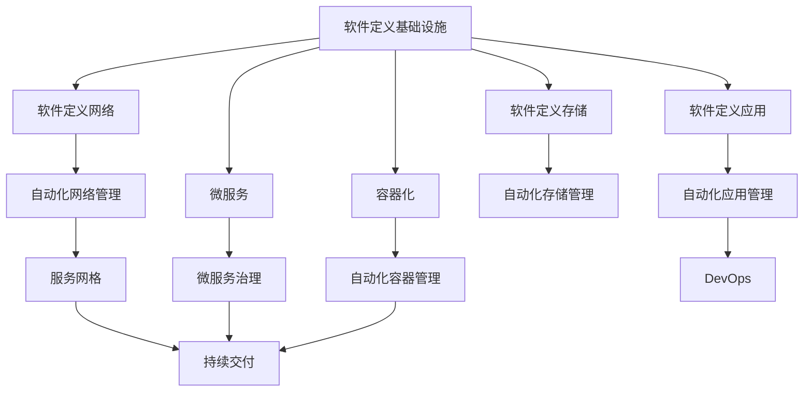

                 

# 软件2.0如何改变云计算架构

> 关键词：软件2.0,云计算,架构,自动化,人工智能,服务网格

## 1. 背景介绍

### 1.1 问题由来

随着数字化转型的加速，企业对于云架构的需求日益增长。传统云计算架构中，企业依赖于虚拟化技术和IaaS服务，通过提供虚拟机和网络服务来支撑应用运行。然而，随着云计算的不断演进，新兴的SaaS（软件即服务）和PaaS（平台即服务）成为新的趋势，企业能够更加灵活地进行资源管理和应用部署。与此同时，微服务和容器技术的兴起，进一步推动了应用架构的微小化和模块化。

然而，随着应用的日益复杂和多样化，云架构的管理和优化变得愈发困难。传统云计算架构已无法适应新的应用场景和业务需求，需要一种新的架构理念和方法，以实现更高的效率、可扩展性和弹性。这时，软件2.0理念应运而生，为云计算架构带来了革命性的变革。

### 1.2 问题核心关键点

软件2.0的核心在于将软件定义和自动化带入云计算架构，通过软件定义网络(SDN)、软件定义存储(SDS)、软件定义应用(SDA)等技术，实现对基础设施的自动化管理和优化。软件2.0不仅实现了传统云计算架构的自动化，还引入了人工智能和大数据技术，提升云平台的管理能力和智能化水平，使其更加敏捷和自适应。

软件2.0的核心理念在于通过软件定义，将硬件资源抽象为软件资源，使得基础设施可以像软件一样进行编程和管理。这使得云平台能够灵活地响应业务需求，实现更高效的资源利用和管理。同时，软件2.0还强调了对人工智能和大数据技术的利用，通过自动化和大数据分析，提升云平台的智能化水平，实现更精准的资源分配和性能优化。

## 2. 核心概念与联系

### 2.1 核心概念概述

为了更好地理解软件2.0如何改变云计算架构，本节将介绍几个密切相关的核心概念：

- **软件定义基础设施(SDI)**：将传统硬件资源抽象为软件资源，通过编程和管理软件资源来实现基础设施的自动化。
- **软件定义网络(SDN)**：通过软件方式定义和控制网络，实现网络资源的高效管理和优化。
- **软件定义存储(SDS)**：通过软件方式定义和控制存储资源，实现存储资源的灵活管理和优化。
- **软件定义应用(SDA)**：通过软件方式定义和控制应用，实现应用的自动化部署和管理。
- **服务网格(Istio)**：一个开放源代码的云原生网络管理工具，用于实现微服务的自动化治理和流量管理。
- **微服务**：将应用拆分为多个小模块，每个模块可以独立部署、更新和扩展，提升应用的灵活性和可维护性。
- **容器化**：将应用及其依赖打包在容器中，实现应用的自动化部署、扩展和管理，提升应用的可靠性和可移植性。
- **DevOps**：一种结合软件开发和运维的方法论，强调持续交付、持续集成、持续部署等自动化实践，提升应用的交付速度和质量。

这些核心概念之间的逻辑关系可以通过以下Mermaid流程图来展示：



这个流程图展示了大语言模型的核心概念及其之间的关系：

1. 软件定义基础设施是整个架构的基础，通过软件定义实现了基础设施的自动化管理和优化。
2. 软件定义网络、存储和应用是基础设施的重要组成部分，通过软件定义实现了这些资源的自动化管理。
3. 微服务和容器化是应用架构的创新实践，通过这些技术提升了应用的灵活性和可扩展性。
4. DevOps是整个架构的实践保障，通过自动化实现持续交付、持续集成和持续部署。
5. 服务网格是微服务治理的重要工具，实现了微服务的自动化管理和流量控制。

## 3. 核心算法原理 & 具体操作步骤

### 3.1 算法原理概述

软件2.0的实现主要依赖于自动化和大数据技术，通过软件定义和编程方式实现基础设施的自动化管理和优化。

### 3.2 算法步骤详解

以下是软件2.0实现的主要步骤：

1. **软件定义基础设施**：将硬件资源抽象为软件资源，通过编程和管理软件资源来实现基础设施的自动化。
2. **自动化网络管理**：通过软件定义网络，实现网络资源的高效管理和优化。
3. **自动化存储管理**：通过软件定义存储，实现存储资源的灵活管理和优化。
4. **自动化应用管理**：通过软件定义应用，实现应用的自动化部署和管理。
5. **微服务治理**：使用服务网格等工具，实现微服务的自动化治理和流量管理。
6. **持续交付**：通过DevOps方法论，实现应用的持续交付、持续集成和持续部署。

### 3.3 算法优缺点

软件2.0具有以下优点：

1. **高效资源利用**：通过软件定义，实现了基础设施的自动化管理和优化，提高了资源利用效率。
2. **灵活应用部署**：微服务架构和容器化技术提升了应用的灵活性和可扩展性，支持快速部署和扩展。
3. **智能治理与优化**：利用大数据和人工智能技术，实现自动化的网络管理、存储管理和应用管理，提升了系统的智能水平。
4. **持续交付与部署**：DevOps方法论实现了持续交付和持续部署，提升了应用交付速度和质量。

然而，软件2.0也存在一些缺点：

1. **学习曲线陡峭**：需要一定的专业知识才能实现软件定义和自动化管理，学习曲线较陡峭。
2. **初期投入高**：实现软件2.0需要一定的初期投入，包括硬件升级、软件部署和技能培训等。
3. **复杂性高**：涉及多个领域的复杂技术，管理和优化难度较大。
4. **安全性挑战**：自动化和大数据技术带来了新的安全风险，需要加强安全管理和防护。

### 3.4 算法应用领域

软件2.0的应用领域非常广泛，包括但不限于：

1. **云平台优化**：通过软件定义基础设施和自动化管理，提升云平台的管理效率和资源利用率。
2. **网络优化**：通过软件定义网络，实现网络资源的灵活配置和优化。
3. **存储优化**：通过软件定义存储，实现存储资源的智能分配和管理。
4. **应用部署与治理**：通过微服务架构和容器化技术，实现应用的灵活部署和治理。
5. **企业数字化转型**：通过自动化和大数据技术，支持企业数字化转型，实现业务流程自动化。
6. **智能运维**：利用人工智能和大数据技术，实现智能运维，提升系统监控和故障处理的效率。

## 4. 数学模型和公式 & 详细讲解

### 4.1 数学模型构建

在软件2.0中，数学模型主要涉及资源分配和调度的优化问题。以网络资源为例，假设网络中有N个节点，每个节点有M个接口，节点间的通信需求可以用需求矩阵 $\mathbf{D} \in \mathbb{R}^{N \times M}$ 表示。每个节点的带宽限制为 $\mathbf{C} \in \mathbb{R}^{N \times M}$。网络的目标是最大化传输速率，即最小化传输延时。

### 4.2 公式推导过程

使用线性规划方法，目标函数为：

$$
\max_{\mathbf{x}} \sum_{i=1}^N \sum_{j=1}^M d_{ij}x_{ij}
$$

约束条件为：

$$
\begin{cases}
\sum_{j=1}^M x_{ij} \leq c_{ij} & \text{每个节点带宽限制} \\
x_{ij} \geq 0 & \text{非负约束}
\end{cases}
$$

其中 $x_{ij}$ 表示节点 $i$ 到节点 $j$ 的通信需求。

通过求解上述线性规划问题，可以得到最优的资源分配方案，实现网络资源的高效利用。

### 4.3 案例分析与讲解

以阿里云的ECS（弹性计算服务）为例，通过软件定义基础设施，实现计算资源的自动化管理和优化。阿里云使用弹性的云服务器ECS，通过软件定义实现了计算资源的自动化管理和优化。ECS能够根据业务需求动态调整计算资源，实现资源的高效利用。

## 5. 项目实践：代码实例和详细解释说明

### 5.1 开发环境搭建

要进行软件2.0的实践，需要先搭建开发环境。以下是使用Kubernetes和Istio搭建微服务架构的示例：

1. 安装Kubernetes：
   ```bash
   kubectl cluster-info
   ```

2. 安装Istio：
   ```bash
   istioctl install --set profile=demo
   ```

3. 部署微服务应用：
   ```bash
   kubectl apply -f <your-app.yaml>
   ```

### 5.2 源代码详细实现

以下是使用Kubernetes和Istio部署微服务应用的示例代码：

```yaml
apiVersion: apps/v1
kind: Deployment
metadata:
  name: my-service
spec:
  replicas: 3
  selector:
    matchLabels:
      app: my-service
  template:
    metadata:
      labels:
        app: my-service
    spec:
      containers:
      - name: my-service
        image: my-service:1.0.0
        ports:
        - containerPort: 8080
```

### 5.3 代码解读与分析

这里我们解释一下上述代码的关键部分：

- `apiVersion`：指定了API版本。
- `kind`：指定了资源类型，这里是Deployment。
- `metadata`：指定了资源的元数据，如名称、标签等。
- `spec`：指定了资源的具体配置，如复制数、选择器、模板等。
- `template`：指定了Pod的配置，如标签、容器等。
- `containers`：指定了Pod中的容器配置，如名称、镜像、端口等。

### 5.4 运行结果展示

假设我们使用上述代码部署了一个名为`my-service`的微服务应用，可以通过以下命令查看应用状态：

```bash
kubectl get pods
kubectl get service
```

## 6. 实际应用场景

### 6.1 云平台优化

阿里云、AWS、腾讯云等云平台都采用了软件2.0理念，实现了云基础设施的自动化管理和优化。云平台能够根据业务需求动态调整资源，实现资源的高效利用。

### 6.2 网络优化

通过软件定义网络，企业能够实现网络资源的灵活配置和优化。例如，微软Azure网络服务通过软件定义网络，实现了网络资源的自动化管理和优化。

### 6.3 存储优化

通过软件定义存储，企业能够实现存储资源的智能分配和管理。例如，AWS通过软件定义存储，实现了存储资源的自动化管理和优化。

### 6.4 应用部署与治理

通过微服务架构和容器化技术，企业能够实现应用的灵活部署和治理。例如，滴滴出行采用了微服务架构，通过容器化技术实现了应用的快速部署和扩展。

### 6.5 企业数字化转型

通过自动化和大数据技术，企业能够实现业务流程的自动化，提升数字化转型速度和效率。例如，平安银行采用了软件2.0理念，实现了金融服务的数字化转型。

## 7. 工具和资源推荐

### 7.1 学习资源推荐

为了帮助开发者系统掌握软件2.0的理论基础和实践技巧，这里推荐一些优质的学习资源：

1. **《软件定义网络：SDN与网络虚拟化》**：介绍SDN的基本原理和应用场景，深入浅出地讲解了SDN的核心技术。
2. **《软件定义应用：SDA与微服务架构》**：介绍SDA的基本原理和应用场景，讲解了微服务架构的设计和实现。
3. **《云原生架构：Kubernetes与Istio》**：介绍Kubernetes和Istio的基本原理和应用场景，讲解了微服务的自动化治理和流量管理。
4. **《软件定义基础设施：SDI与云计算》**：介绍SDI的基本原理和应用场景，讲解了云计算架构的自动化管理和优化。
5. **《DevOps实践指南》**：介绍DevOps的基本原理和应用场景，讲解了持续交付、持续集成和持续部署的实现。

### 7.2 开发工具推荐

高效的开发离不开优秀的工具支持。以下是几款用于软件2.0开发的常用工具：

1. **Kubernetes**：Kubernetes是一个开源的容器编排系统，支持动态调度和资源管理，是微服务架构的核心工具。
2. **Istio**：Istio是一个开源的服务网格平台，用于实现微服务的自动化治理和流量管理。
3. **Prometheus**：Prometheus是一个开源的监控系统，用于收集和分析容器化应用的运行数据。
4. **Jenkins**：Jenkins是一个开源的持续集成和持续部署工具，支持自动化构建、测试和部署。
5. **Grafana**：Grafana是一个开源的可视化工具，用于监控和管理容器化应用的运行状态。

### 7.3 相关论文推荐

软件2.0的研究涉及多个领域的前沿技术，以下是几篇奠基性的相关论文，推荐阅读：

1. **《软件定义基础设施：SDI与云计算》**：介绍SDI的基本原理和应用场景，讲解了云计算架构的自动化管理和优化。
2. **《软件定义应用：SDA与微服务架构》**：介绍SDA的基本原理和应用场景，讲解了微服务架构的设计和实现。
3. **《软件定义网络：SDN与网络虚拟化》**：介绍SDN的基本原理和应用场景，讲解了网络资源的自动化管理和优化。
4. **《云原生架构：Kubernetes与Istio》**：介绍Kubernetes和Istio的基本原理和应用场景，讲解了微服务的自动化治理和流量管理。
5. **《DevOps实践指南》**：介绍DevOps的基本原理和应用场景，讲解了持续交付、持续集成和持续部署的实现。

这些论文代表了软件2.0技术的发展脉络。通过学习这些前沿成果，可以帮助研究者把握学科前进方向，激发更多的创新灵感。

## 8. 总结：未来发展趋势与挑战

### 8.1 总结

本文对软件2.0在云计算架构中的应用进行了全面系统的介绍。首先阐述了软件2.0的理念和优势，明确了其在云计算架构中的应用前景。其次，从原理到实践，详细讲解了软件2.0的核心算法和具体操作步骤，给出了软件2.0的代码实现和运行结果。同时，本文还广泛探讨了软件2.0在云平台优化、网络优化、存储优化、应用部署与治理等多个领域的应用场景，展示了软件2.0的巨大潜力。此外，本文精选了软件2.0技术的各类学习资源，力求为读者提供全方位的技术指引。

通过本文的系统梳理，可以看到，软件2.0理念为云计算架构带来了革命性的变革，显著提升了云平台的管理效率和资源利用率。得益于软件定义和大数据技术，企业能够实现基础设施的自动化管理和优化，提升了应用的灵活性和可扩展性，满足了多样化的业务需求。未来，伴随软件2.0技术的不断演进，相信云计算架构将迎来新的发展高峰，成为企业数字化转型的重要助力。

### 8.2 未来发展趋势

展望未来，软件2.0将呈现以下几个发展趋势：

1. **软件定义全栈**：软件2.0技术将覆盖基础设施的各个层面，包括网络、存储、应用、安全等，实现全栈的自动化管理和优化。
2. **自动化与智能化融合**：软件2.0将与人工智能和大数据技术深度融合，实现更精准的资源分配和性能优化。
3. **边缘计算的应用**：软件2.0将应用于边缘计算场景，实现本地资源的自动化管理和优化，提升边缘计算的效率和可靠性。
4. **微服务架构的演进**：微服务架构将不断演进，引入更多的服务治理和调度机制，提升应用的灵活性和可扩展性。
5. **容器化技术的普及**：容器化技术将进一步普及，成为企业应用开发和部署的标准方式，提升应用的可靠性和可移植性。
6. **DevOps方法论的成熟**：DevOps方法论将不断成熟，实现更高效的持续交付和持续部署，提升应用的交付速度和质量。

以上趋势凸显了软件2.0技术的广阔前景。这些方向的探索发展，必将进一步提升云计算架构的智能化水平和自动化程度，为数字化转型提供更可靠的技术支持。

### 8.3 面临的挑战

尽管软件2.0技术已经取得了显著进展，但在迈向更加智能化、普适化应用的过程中，仍面临诸多挑战：

1. **技术复杂性**：软件2.0技术涉及多个领域的复杂技术，管理和优化难度较大。
2. **初期投入高**：实现软件2.0需要一定的初期投入，包括硬件升级、软件部署和技能培训等。
3. **学习曲线陡峭**：需要一定的专业知识才能实现软件定义和自动化管理，学习曲线较陡峭。
4. **安全性挑战**：自动化和大数据技术带来了新的安全风险，需要加强安全管理和防护。
5. **成本控制**：实现自动化管理和优化需要持续的资源投入，成本控制难度较大。

### 8.4 研究展望

面向未来，软件2.0技术需要在以下几个方面寻求新的突破：

1. **自动化与智能化的深度融合**：实现更精准的资源分配和性能优化，提升系统的智能化水平。
2. **开源社区的贡献**：积极参与开源社区的贡献和交流，推动软件2.0技术的普及和应用。
3. **新应用的探索**：探索软件2.0技术在新兴应用场景中的应用，如边缘计算、物联网、区块链等。
4. **跨领域的融合**：与其他前沿技术如人工智能、区块链、物联网等进行更深入的融合，推动技术进步和应用创新。
5. **标准化的推动**：推动软件2.0技术标准的制定和推广，提升技术的规范化和可互操作性。

总之，软件2.0技术的应用前景广阔，但需要在技术复杂性、安全性、成本控制等方面持续改进和优化。通过积极探索和突破，软件2.0技术必将迎来更广阔的应用空间，为云计算架构带来革命性的变革。

## 9. 附录：常见问题与解答

**Q1：软件2.0与传统云计算架构有何不同？**

A: 软件2.0与传统云计算架构的最大不同在于自动化和大数据技术的引入。软件2.0通过软件定义基础设施和自动化管理，实现了对基础设施的自动化管理和优化。而传统云计算架构则依赖于虚拟化技术和IaaS服务，缺乏对基础设施的自动化管理能力。

**Q2：软件2.0是否适用于所有云平台？**

A: 软件2.0技术适用于多种云平台，包括AWS、阿里云、腾讯云等。不同云平台提供了不同的API和工具支持，但软件2.0的核心思想和实现方法是一致的。

**Q3：软件2.0的学习曲线是否陡峭？**

A: 软件2.0的学习曲线相对较陡峭，需要一定的专业知识才能实现软件定义和自动化管理。然而，随着技术的不断演进和普及，学习成本正在逐渐降低，越来越多的开发者正在掌握这一技术。

**Q4：软件2.0在安全性方面有哪些挑战？**

A: 软件2.0的自动化和大数据技术带来了新的安全风险，如数据泄露、服务中断等。因此，在实现软件2.0的同时，需要加强安全管理和防护，如数据加密、权限管理、监控告警等。

**Q5：软件2.0在成本控制方面有哪些挑战？**

A: 软件2.0的实现需要持续的资源投入，包括硬件升级、软件部署和技能培训等。因此，在推进软件2.0技术时，需要进行成本效益分析，平衡资源投入和产出。

总之，软件2.0技术的应用前景广阔，但需要在技术复杂性、安全性、成本控制等方面持续改进和优化。通过积极探索和突破，软件2.0技术必将迎来更广阔的应用空间，为云计算架构带来革命性的变革。

