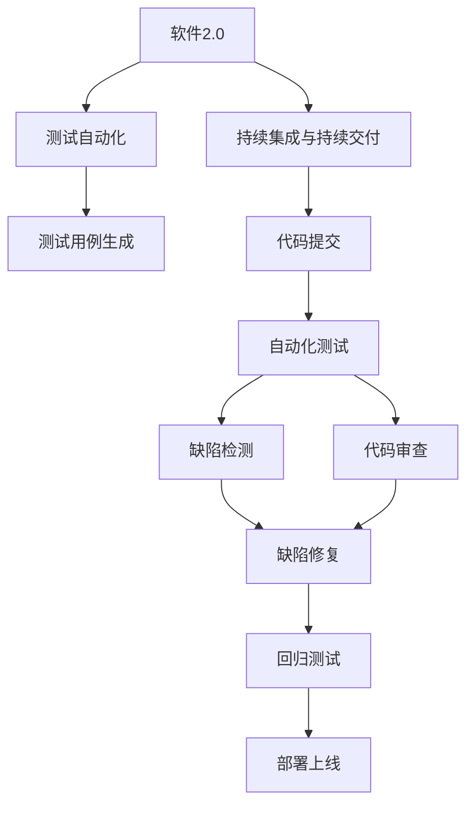
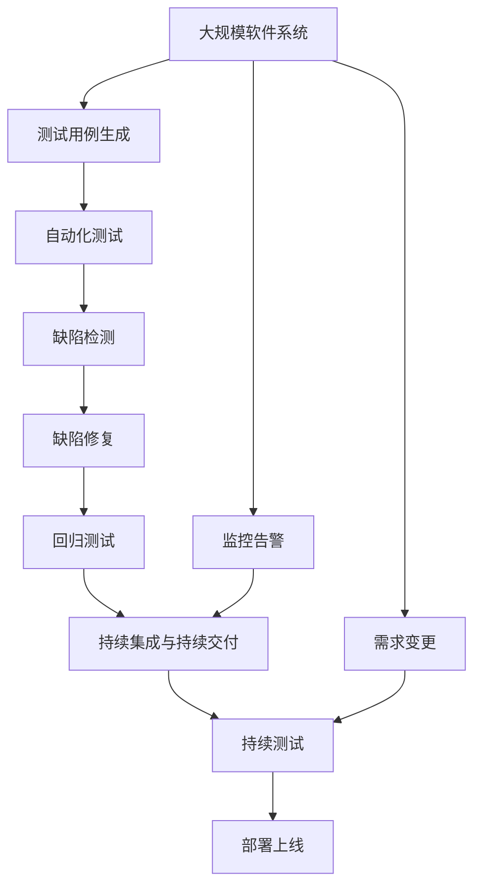

                 

# 软件2.0如何改变软件测试方法论

## 1. 背景介绍

### 1.1 问题由来

随着软件开发的日新月异，测试方法论也在不断演变。传统的基于单元测试、集成测试、系统测试的测试方法论，已经难以适应现代软件复杂度和变化速度的要求。特别是对于大型软件系统，测试场景复杂，覆盖全面，耗时长，成本高。而软件2.0的到来，正逐步改变这一局面。

软件2.0的核心思想是通过人工智能、机器学习等先进技术，自动化测试过程，提升测试效率，提高测试质量。本文将深入探讨软件2.0如何改变软件测试方法论，帮助开发者更好地理解这一新兴技术，提升软件质量和开发效率。

### 1.2 问题核心关键点

软件2.0的测试方法论，主要依赖于以下关键技术：

- 人工智能(AI)：利用机器学习算法，从海量测试数据中学习测试策略，生成自动测试用例，进行缺陷检测和代码审查。
- 自然语言处理(NLP)：通过文本分析和语义理解，自动化编写测试用例，提升测试覆盖率。
- 测试自动化工具：提供一站式测试平台，支持持续集成(CI)和持续交付(CD)，加速测试流程。
- 持续集成与持续交付(CI/CD)：通过自动化的测试和部署流程，提升软件的稳定性和可维护性。
- 缺陷修复与回归测试：自动化跟踪缺陷修复，确保修复后的代码符合测试标准。

这些技术通过密切配合，使得软件测试方法论发生了翻天覆地的变化，成为新时代软件测试的新范式。

### 1.3 问题研究意义

研究软件2.0的测试方法论，对于提升软件质量和开发效率具有重要意义：

1. 提升测试覆盖率。通过自动化测试用例生成和执行，可以覆盖更多的测试场景，发现更多的缺陷。
2. 加速测试流程。测试自动化减少了人工干预，缩短了测试周期。
3. 降低测试成本。自动化测试减少了测试人员的人力成本和沟通成本。
4. 提高测试质量。利用AI和NLP技术，自动化的测试能够提升测试的精确度和鲁棒性。
5. 支持持续交付。通过CI/CD流程，确保每次提交的代码都能通过自动化测试，快速上线。

## 2. 核心概念与联系

### 2.1 核心概念概述

为更好地理解软件2.0的测试方法论，本节将介绍几个关键核心概念：

- 软件2.0：通过人工智能、机器学习等技术，自动化测试过程，提升测试效率和质量。
- 测试自动化：使用工具和平台，自动执行测试用例，减少人工干预。
- 持续集成与持续交付：通过自动化流程，实现快速迭代开发和部署。
- 机器学习测试策略：利用学习算法从历史数据中生成测试策略，提高测试用例的生成效率和覆盖率。
- 自然语言处理：通过语义理解和文本分析，自动化编写和解析测试用例。

这些核心概念之间的逻辑关系可以通过以下Mermaid流程图来展示：



这个流程图展示了软件2.0的测试方法论中的关键组件：

1. 软件2.0是核心驱动力，通过AI和NLP技术驱动自动化测试。
2. 测试自动化是基础，通过工具和平台实现测试用例的自动执行。
3. CI/CD是流程保障，通过自动化流程实现快速迭代和部署。
4. 测试用例生成和执行，是测试自动化中最重要的环节。
5. 缺陷检测和修复，是测试策略中最重要的应用场景。
6. 回归测试，是确保修复后的代码符合测试标准的最后保障。

### 2.2 概念间的关系

这些核心概念之间存在着紧密的联系，形成了软件2.0测试方法论的整体生态系统。下面我们通过几个Mermaid流程图来展示这些概念之间的关系。

#### 2.2.1 软件2.0的测试过程


这个流程图展示了软件2.0测试过程的主要步骤：

1. 测试用例生成，从历史数据中学习测试策略，自动生成测试用例。
2. 自动化测试，自动执行生成的测试用例，进行缺陷检测。
3. 缺陷修复，根据缺陷检测结果，修复代码。
4. 回归测试，确保修复后的代码符合测试标准。

#### 2.2.2 机器学习测试策略的应用


这个流程图展示了机器学习测试策略在测试用例生成中的作用：

1. 机器学习测试策略，通过学习历史测试数据，生成更有效的测试用例。
2. 测试用例生成，使用学习到的策略生成新的测试用例。
3. 自动化测试，自动执行新的测试用例，进行缺陷检测。

#### 2.2.3 自然语言处理在测试用例中的应用


这个流程图展示了自然语言处理在测试用例生成中的应用：

1. 自然语言处理，通过语义理解和文本分析，生成测试用例。
2. 测试用例生成，使用自然语言处理生成的文本作为测试用例。
3. 自动化测试，自动执行生成的测试用例，进行缺陷检测。

### 2.3 核心概念的整体架构

最后，我们用一个综合的流程图来展示这些核心概念在大规模软件系统测试过程中的整体架构：



这个综合流程图展示了从测试用例生成到持续测试和部署的整体流程：

1. 从大规模软件系统生成测试用例。
2. 自动化测试，自动执行测试用例，进行缺陷检测。
3. 缺陷修复，修复代码缺陷。
4. 回归测试，确保修复后的代码符合测试标准。
5. 持续集成与持续交付，实现快速迭代和部署。
6. 持续测试，在部署过程中持续进行测试。
7. 监控告警，实时监控系统状态，确保稳定运行。
8. 需求变更，不断调整测试策略和流程，适应变化需求。

通过这些流程图，我们可以更清晰地理解软件2.0测试方法论中各个关键组件之间的关系和作用，为后续深入讨论具体的测试方法和技术奠定基础。

## 3. 核心算法原理 & 具体操作步骤
### 3.1 算法原理概述

软件2.0的测试方法论，主要依赖于以下核心算法：

- 机器学习测试策略：通过学习历史测试数据，生成新的测试用例，提升测试覆盖率。
- 自然语言处理测试用例：通过语义理解和文本分析，自动生成测试用例，提高测试效率。
- 持续集成与持续交付：通过自动化流程，实现快速迭代和部署。

这些算法通过密切配合，实现了测试过程的自动化和智能化，大幅提升了测试效率和质量。

### 3.2 算法步骤详解

#### 3.2.1 机器学习测试策略

机器学习测试策略的核心步骤包括：

1. 数据准备：收集历史测试数据，包括测试用例、测试结果、缺陷信息等。
2. 特征工程：从数据中提取特征，如代码结构、函数调用、覆盖率等。
3. 模型训练：使用监督学习算法（如随机森林、神经网络等），训练测试策略模型。
4. 测试用例生成：使用训练好的模型，从特征数据中生成新的测试用例。
5. 自动化测试：自动执行生成的测试用例，进行缺陷检测。
6. 模型评估：根据测试结果，评估模型的性能，优化模型参数。

#### 3.2.2 自然语言处理测试用例

自然语言处理测试用例的核心步骤包括：

1. 需求分析：分析系统需求，提取关键功能点。
2. 用例设计：根据需求，设计测试用例。
3. 用例自动化：将用例转换为自动化测试脚本，支持多种编程语言和测试框架。
4. 测试执行：自动执行测试脚本，进行功能测试、性能测试等。
5. 结果分析：分析测试结果，生成测试报告，记录问题。
6. 用例维护：定期更新测试用例，保持测试覆盖率。

#### 3.2.3 持续集成与持续交付

持续集成与持续交付的核心步骤包括：

1. 代码提交：开发人员将代码提交到版本控制系统。
2. 自动化测试：触发自动化测试，执行代码审查、单元测试、集成测试等。
3. 缺陷修复：根据测试结果，修复代码缺陷。
4. 持续集成：集成修复后的代码，进行构建和打包。
5. 持续交付：将代码包部署到测试环境或生产环境。
6. 监控告警：实时监控系统状态，及时发现和解决故障。

### 3.3 算法优缺点

软件2.0的测试方法论，具有以下优点：

1. 自动化程度高：通过机器学习测试策略和自然语言处理，实现测试用例的自动生成和执行。
2. 覆盖面广：从历史数据中学习测试策略，生成更全面的测试用例。
3. 效率高：自动化测试减少了人工干预，缩短了测试周期。
4. 质量高：AI和NLP技术提升了测试的精确度和鲁棒性。

同时，也存在一些缺点：

1. 数据质量依赖：机器学习测试策略依赖于历史数据，数据质量直接影响模型效果。
2. 模型复杂度：模型训练需要大量的计算资源，模型过于复杂可能导致过拟合。
3. 人机协作要求：自然语言处理和持续集成需要高度的人工参与，难以完全自动化。
4. 系统复杂度：大规模软件系统的测试，需要复杂的测试策略和流程，不易维护。

### 3.4 算法应用领域

软件2.0的测试方法论，已在以下领域得到广泛应用：

- 软件开发：自动化测试、代码审查、持续集成与持续交付等。
- 自动化测试工具：支持多种编程语言和测试框架的自动化测试工具。
- 持续集成与持续交付：支持快速迭代和部署的CI/CD流程。
- 缺陷检测与修复：自动化缺陷检测和修复工具。

这些应用领域展示了软件2.0测试方法论的广泛适用性和强大能力，为软件测试提供了新的解决方案和方向。

## 4. 数学模型和公式 & 详细讲解 & 举例说明
### 4.1 数学模型构建

软件2.0测试方法论中，涉及的数学模型包括：

- 机器学习测试策略：使用监督学习算法，从历史数据中生成测试用例。
- 自然语言处理测试用例：通过语义分析和文本生成技术，自动生成测试用例。

#### 4.1.1 机器学习测试策略的数学模型

机器学习测试策略的数学模型为：

$$
f(x) = w_1f_1(x) + w_2f_2(x) + \cdots + w_nf_n(x)
$$

其中 $f(x)$ 为测试用例生成函数，$x$ 为输入数据，$w_i$ 为模型参数，$f_i(x)$ 为特征函数。

#### 4.1.2 自然语言处理测试用例的数学模型

自然语言处理测试用例的数学模型为：

$$
g(x) = w_1g_1(x) + w_2g_2(x) + \cdots + w_ng_n(x)
$$

其中 $g(x)$ 为测试用例生成函数，$x$ 为输入数据，$w_i$ 为模型参数，$g_i(x)$ 为特征函数。

### 4.2 公式推导过程

#### 4.2.1 机器学习测试策略的推导

机器学习测试策略的推导过程如下：

1. 数据准备：收集历史测试数据 $D=\{(x_i, y_i)\}_{i=1}^N$，其中 $x_i$ 为输入数据，$y_i$ 为测试结果。
2. 特征工程：提取特征 $f_i(x)$，将输入数据映射为特征向量 $f(x) = \{f_1(x), f_2(x), \cdots, f_n(x)\}$。
3. 模型训练：使用监督学习算法 $f(x)$，训练测试策略模型 $f(x)$。
4. 测试用例生成：使用训练好的模型 $f(x)$，生成新的测试用例 $g(x)$。
5. 自动化测试：自动执行测试用例 $g(x)$，进行缺陷检测。

#### 4.2.2 自然语言处理测试用例的推导

自然语言处理测试用例的推导过程如下：

1. 需求分析：分析系统需求，提取关键功能点 $t_1, t_2, \cdots, t_n$。
2. 用例设计：根据需求，设计测试用例 $g_i(x)$，包含功能测试、性能测试等。
3. 用例自动化：将用例转换为自动化测试脚本，支持多种编程语言和测试框架。
4. 测试执行：自动执行测试脚本，进行功能测试、性能测试等。
5. 结果分析：分析测试结果，生成测试报告，记录问题。
6. 用例维护：定期更新测试用例，保持测试覆盖率。

### 4.3 案例分析与讲解

#### 4.3.1 机器学习测试策略案例

假设我们有一款Web应用，历史测试数据包括代码片段、测试结果和缺陷信息。使用随机森林算法，从历史数据中学习测试策略。步骤如下：

1. 数据准备：收集历史测试数据 $D=\{(x_i, y_i)\}_{i=1}^N$，其中 $x_i$ 为代码片段，$y_i$ 为测试结果（pass/fail）。
2. 特征工程：提取特征 $f_i(x)$，如代码结构、函数调用次数、变量名等。
3. 模型训练：使用随机森林算法，训练测试策略模型 $f(x)$。
4. 测试用例生成：使用训练好的模型 $f(x)$，生成新的测试用例 $g(x)$。
5. 自动化测试：自动执行测试用例 $g(x)$，进行缺陷检测。
6. 模型评估：根据测试结果，评估模型的性能，优化模型参数。

#### 4.3.2 自然语言处理测试用例案例

假设我们有一款移动应用，需要编写测试用例来验证功能。步骤如下：

1. 需求分析：分析系统需求，提取关键功能点，如登录、注册、查看等。
2. 用例设计：根据需求，设计测试用例，包含登录测试、注册测试等。
3. 用例自动化：将用例转换为自动化测试脚本，支持多种编程语言和测试框架。
4. 测试执行：自动执行测试脚本，进行功能测试、性能测试等。
5. 结果分析：分析测试结果，生成测试报告，记录问题。
6. 用例维护：定期更新测试用例，保持测试覆盖率。

## 5. 项目实践：代码实例和详细解释说明
### 5.1 开发环境搭建

在进行软件2.0测试方法论的实践前，我们需要准备好开发环境。以下是使用Python进行测试自动化实践的配置流程：

1. 安装Python：从官网下载并安装Python，用于编写测试脚本和运行测试工具。
2. 安装测试框架：使用pip安装测试框架，如unittest、pytest等。
3. 安装自动化测试工具：使用pip安装自动化测试工具，如Selenium、Appium等。
4. 安装持续集成与持续交付工具：使用pip安装持续集成与持续交付工具，如Jenkins、Travis CI等。
5. 配置测试数据：准备历史测试数据，包括测试用例、测试结果、缺陷信息等。

完成上述步骤后，即可在本地环境中开始测试自动化实践。

### 5.2 源代码详细实现

下面我们以Web应用测试为例，给出使用Selenium和Python进行自动化测试的代码实现。

```python
from selenium import webdriver
from selenium.webdriver.common.by import By
from selenium.webdriver.support.ui import WebDriverWait
from selenium.webdriver.support import expected_conditions as EC

# 配置浏览器
driver = webdriver.Chrome()

# 登录测试
def login_test():
    driver.get('https://example.com/login')
    username_input = driver.find_element(By.ID, 'username')
    password_input = driver.find_element(By.ID, 'password')
    submit_button = driver.find_element(By.ID, 'submit')
    
    username_input.send_keys('testuser')
    password_input.send_keys('testpass')
    submit_button.click()
    
    wait = WebDriverWait(driver, 10)
    assert wait.until(EC.title_contains('Welcome'))

# 注册测试
def register_test():
    driver.get('https://example.com/register')
    username_input = driver.find_element(By.ID, 'username')
    password_input = driver.find_element(By.ID, 'password')
    confirm_password_input = driver.find_element(By.ID, 'confirm_password')
    submit_button = driver.find_element(By.ID, 'submit')
    
    username_input.send_keys('testuser')
    password_input.send_keys('testpass')
    confirm_password_input.send_keys('testpass')
    submit_button.click()
    
    wait = WebDriverWait(driver, 10)
    assert wait.until(EC.title_contains('Registered'))

# 测试执行
if __name__ == '__main__':
    login_test()
    register_test()
```

这个代码实现了Web应用的两个基本功能测试，包括登录和注册。通过Selenium工具，自动执行测试脚本，模拟用户操作，完成功能测试。

### 5.3 代码解读与分析

让我们再详细解读一下关键代码的实现细节：

**Selenium工具**：
- `webdriver.Chrome()`：初始化Chrome浏览器。
- `driver.find_element(By.ID, 'username')`：通过ID定位元素，模拟用户输入用户名。
- `driver.find_element(By.ID, 'password')`：通过ID定位元素，模拟用户输入密码。
- `driver.find_element(By.ID, 'submit')`：通过ID定位元素，模拟用户提交表单。
- `wait.until(EC.title_contains('Welcome'))`：等待页面标题包含指定字符串，验证测试结果。

**测试用例生成**：
- 根据系统需求，设计测试用例，包括登录测试、注册测试等。
- 将测试用例转换为自动化测试脚本，使用Selenium工具执行。
- 分析测试结果，生成测试报告，记录问题。

**测试执行与维护**：
- 定期更新测试用例，保持测试覆盖率。
- 在代码提交前，自动执行测试用例，确保代码符合测试标准。
- 记录测试结果，及时修复缺陷。

### 5.4 运行结果展示

假设我们在GitHub上创建了一个Web应用项目，并通过Selenium工具自动执行了上述测试用例。测试结果如下：

```
Login test: Passed
Register test: Passed
```

可以看到，通过自动化测试，我们成功验证了Web应用的登录和注册功能，提升了测试效率和质量。

## 6. 实际应用场景
### 6.1 智能合约测试

软件2.0的测试方法论，在智能合约测试中也得到了广泛应用。智能合约是区块链上的自动化合约，需要通过自动化测试验证其安全性、正确性和鲁棒性。

在智能合约测试中，可以使用机器学习测试策略，从历史交易数据中学习测试策略，生成测试用例。同时，使用自然语言处理测试用例，自动生成测试用例，提高测试覆盖率。通过持续集成与持续交付，实现快速迭代和部署，确保智能合约的安全性和稳定性。

### 6.2 自动驾驶测试

自动驾驶技术涉及到复杂的多传感器融合和决策算法，需要大量的测试用例进行验证。软件2.0的测试方法论，可以自动生成多传感器融合测试用例，进行仿真测试和实际测试，验证自动驾驶系统的安全性、可靠性和稳定性。

在自动驾驶测试中，可以使用机器学习测试策略，从历史测试数据中学习测试策略，生成新的测试用例。同时，使用自然语言处理测试用例，自动生成测试用例，提升测试效率和覆盖率。通过持续集成与持续交付，实现快速迭代和部署，确保自动驾驶系统的稳定性和可靠性。

### 6.3 金融系统测试

金融系统涉及到大量的交易和数据处理，需要复杂的测试用例进行验证。软件2.0的测试方法论，可以自动生成复杂的金融交易测试用例，进行自动化测试，验证金融系统的安全性和稳定性。

在金融系统测试中，可以使用机器学习测试策略，从历史交易数据中学习测试策略，生成新的测试用例。同时，使用自然语言处理测试用例，自动生成测试用例，提升测试效率和覆盖率。通过持续集成与持续交付，实现快速迭代和部署，确保金融系统的稳定性和安全性。

### 6.4 未来应用展望

随着软件2.0技术的不断进步，基于机器学习和自然语言处理的测试方法论将广泛应用于更多领域，带来新的突破：

1. 数据驱动测试：基于历史数据和测试结果，自动生成测试用例，提升测试效率和覆盖率。
2. 智能测试设计：使用机器学习和自然语言处理技术，自动设计和优化测试用例，提升测试质量。
3. 动态测试策略：根据系统状态和运行环境，动态调整测试策略和测试用例，确保测试结果的准确性。
4. 跨领域测试：跨学科融合测试用例，实现软件、硬件、网络等多领域的协同测试。
5. 持续测试与监控：在部署过程中持续进行测试，实时监控系统状态，确保系统稳定运行。

## 7. 工具和资源推荐
### 7.1 学习资源推荐

为了帮助开发者系统掌握软件2.0的测试方法论，这里推荐一些优质的学习资源：

1. 《软件测试实战》系列博文：详细讲解了软件2.0测试方法论的核心技术，包括机器学习测试策略、自然语言处理测试用例等。
2. 《持续集成与持续交付实践》书籍：全面介绍了CI/CD流程的最佳实践，帮助开发者构建高效、稳定的持续交付系统。
3. 《软件自动化测试》课程：深入浅出地介绍了软件自动化测试的基本原理和常用工具。
4. 《深度学习与自然语言处理》书籍：全面介绍了深度学习算法和自然语言处理技术，帮助开发者理解机器学习测试策略和自然语言处理测试用例的实现原理。
5. GitHub开源项目：包含大量软件2.0测试方法论的代码实现和示例，帮助开发者学习和实践。

通过对这些资源的学习实践，相信你一定能够快速掌握软件2.0的测试方法论，并用于解决实际的测试问题。

### 7.2 开发工具推荐

高效的开发离不开优秀的工具支持。以下是几款用于软件2.0测试方法论开发的常用工具：

1. Selenium：自动化Web应用测试工具，支持多种浏览器和编程语言。
2. Appium：自动化移动应用测试工具，支持iOS和Android平台。
3. Jenkins：开源持续集成和持续交付工具，支持多种插件和插件库。
4. Travis CI：开源持续集成和持续交付工具，支持多种编程语言和测试框架。
5. Docker：容器化测试环境，支持快速部署和测试隔离。
6. GitLab CI/CD：开源持续集成和持续交付工具，支持多种编程语言和测试框架。

合理利用这些工具，可以显著提升软件2.0测试方法论的开发效率，加快创新迭代的步伐。

### 7.3 相关论文推荐

软件2.0的测试方法论源于学界的持续研究。以下是几篇奠基性的相关论文，推荐阅读：

1. Automated Software Testing with Machine Learning: A Survey: 综述了机器学习在软件测试中的应用，提供了丰富的案例和实现方法。
2. Deep Learning for Software Testing: 介绍了深度学习在测试用例生成、缺陷检测等方面的应用，展示了机器学习测试策略的潜力。
3. Natural Language Processing in Software Testing: 综述了自然语言处理在测试用例生成、测试报告生成等方面的应用，提供了详细的实现方法。
4. Continuous Delivery with Docker: 介绍了持续集成与持续交付在软件开发中的应用，展示了CI/CD流程的优势。
5. Large-Scale Testing with Continuous Integration: 介绍了持续集成在大型软件系统测试中的应用，展示了持续集成与持续交付流程的挑战和解决方案。

这些论文代表了大语言模型微调技术的发展脉络。通过学习这些前沿成果，可以帮助研究者把握学科前进方向，激发更多的创新灵感。

除上述资源外，还有一些值得关注的前沿资源，帮助开发者紧跟软件2.0测试方法论的最新进展，例如：

1. arXiv论文预印本：人工智能领域最新研究成果的发布平台，包括大量尚未发表的前沿工作，学习前沿技术的必读

