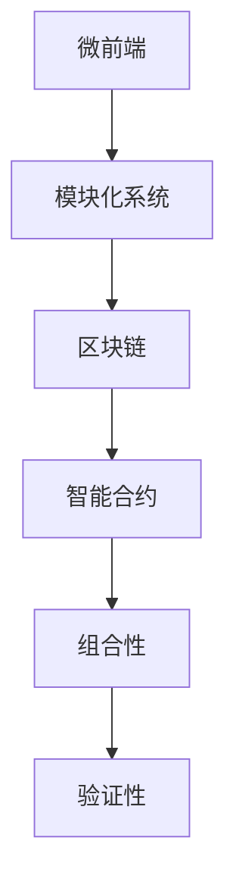
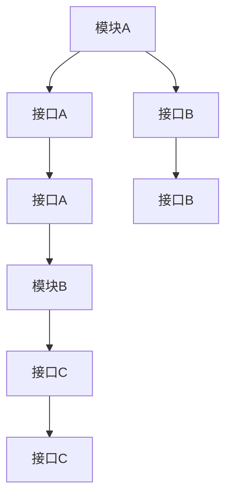

                 

# 软件2.0的微前端架构设计

## 1. 背景介绍

在软件工程领域，微前端（Micro-Frontend）是一种新兴的架构模式，旨在通过将前端应用拆分成独立、自包含的微前端模块，提升应用的性能、可维护性和可扩展性。然而，传统的微前端设计存在模块间通信复杂、数据共享困难等问题，使得开发和维护成本大幅上升。

为了解决这些问题，软件2.0时代的微前端架构应运而生。它借助区块链、智能合约等前沿技术，通过构建可组合、可验证的模块化系统，提供了一套新的解决方案，极大地降低了微前端应用的开发复杂度和运维成本，为软件2.0时代的未来应用场景奠定了基础。

## 2. 核心概念与联系

### 2.1 核心概念概述

为更好地理解软件2.0微前端架构的设计原理，本节将介绍几个关键概念：

- **微前端（Micro-Frontend）**：指将一个大型前端应用拆分成多个独立运行的小前端应用模块，每个模块可以独立部署、独立更新，从而提高应用的可维护性和扩展性。

- **模块化系统（Modular System）**：指将系统拆分成多个可独立运行、可相互协作的模块，每个模块负责特定的功能，通过接口进行通信和交互。

- **区块链（Blockchain）**：指一种分布式账本技术，通过不可篡改的、去中心化的方式记录和验证交易信息。

- **智能合约（Smart Contract）**：指运行在区块链上的可执行代码，自动执行预设的规则，确保交易的透明度和安全性。

- **组合性（Composability）**：指模块间可以通过接口进行组合，形成新的功能，支持应用的多样化需求。

- **验证性（Verifiability）**：指模块间的交互过程可以进行验证，确保数据的准确性和一致性。

这些概念之间的联系可以通过以下Mermaid流程图来展示：



这个流程图展示了大语言模型微调过程中各个核心概念的关系：

1. 微前端应用通过模块化系统将应用拆分成多个独立模块。
2. 这些模块运行在区块链上，确保数据的安全性和不可篡改性。
3. 智能合约负责自动化交易规则，确保模块间的交互逻辑。
4. 组合性使模块可以灵活组合，形成新的功能。
5. 验证性确保模块间交互的数据准确性和一致性。

### 2.2 概念间的关系

这些核心概念之间存在着紧密的联系，形成了软件2.0微前端架构的整体架构。下面我们通过几个Mermaid流程图来展示这些概念之间的关系。

#### 2.2.1 微前端的实现过程


这个流程图展示了微前端应用的实现过程：将一个大前端应用拆分成多个独立模块，每个模块独立部署和更新，从而提升应用的性能。

#### 2.2.2 模块化系统的通信机制



这个流程图展示了模块间通过接口进行通信的机制。模块A通过接口A与模块B通信，模块B通过接口C与模块C通信，从而实现模块间的协作。

#### 2.2.3 区块链的验证过程


这个流程图展示了区块链的验证过程。交易发起后，智能合约执行并记录数据，验证结果验证通过后，交易完成。

## 3. 核心算法原理 & 具体操作步骤
### 3.1 算法原理概述

软件2.0微前端架构的设计原理主要基于区块链和智能合约的技术特性，通过构建模块化系统，实现微前端的组合性和验证性。具体而言，算法原理可以概括为以下四点：

1. **模块拆分与组合**：将大前端应用拆分成多个独立模块，每个模块负责特定的功能，并通过接口进行通信和组合，形成新的功能。

2. **区块链与智能合约**：利用区块链的不可篡改性和智能合约的自动化执行功能，确保模块间交互的透明性和安全性。

3. **数据共享与验证**：通过智能合约实现模块间的数据共享和验证，确保数据的准确性和一致性。

4. **动态部署与更新**：模块可以独立部署和更新，减少整体应用的维护成本，提升应用的可扩展性。

### 3.2 算法步骤详解

基于上述原理，软件2.0微前端架构的实现步骤如下：

**Step 1: 应用拆分与模块设计**
- 分析应用需求，设计多个独立的功能模块。
- 确定模块间的通信接口，设计模块间的数据交互方式。

**Step 2: 智能合约设计**
- 定义模块间的交易逻辑，编写智能合约代码。
- 使用Solidity、Truffle等工具构建智能合约，并将其部署到区块链上。

**Step 3: 数据共享与验证**
- 设计模块间的数据共享机制，如通过接口共享数据。
- 编写智能合约，验证数据共享过程的正确性。

**Step 4: 模块部署与更新**
- 将模块独立部署到区块链上，确保数据的安全性和不可篡改性。
- 根据需求更新模块，确保更新过程不会影响其他模块的运行。

**Step 5: 应用集成与测试**
- 将模块集成到完整的应用中，进行系统测试。
- 通过测试发现并修复模块间通信和数据共享的问题。

### 3.3 算法优缺点

软件2.0微前端架构具有以下优点：

1. **灵活性高**：模块可以独立部署和更新，减少整体应用的维护成本，提升应用的可扩展性。
2. **安全性高**：利用区块链的不可篡改性和智能合约的自动化执行功能，确保模块间交互的透明性和安全性。
3. **可验证性强**：通过智能合约实现模块间的数据共享和验证，确保数据的准确性和一致性。

同时，该架构也存在以下缺点：

1. **实现复杂**：涉及区块链、智能合约等前沿技术，需要开发者具备一定的技术水平。
2. **性能消耗大**：智能合约的执行需要消耗大量计算资源，可能会影响应用的性能。
3. **开发成本高**：涉及多个模块的通信和验证，开发和测试成本较高。

### 3.4 算法应用领域

软件2.0微前端架构广泛应用于企业级应用、Web应用、移动应用等多个领域。以下是一些典型的应用场景：

- **企业级应用**：企业内部管理系统、财务系统、HR系统等，通过微前端架构提升应用的灵活性和可维护性。
- **Web应用**：大型电商平台、在线教育平台、社交网络等，通过微前端架构提升应用的性能和可扩展性。
- **移动应用**：跨平台移动应用、第三方应用插件等，通过微前端架构提升应用的灵活性和兼容性。
- **物联网应用**：智能家居、智能制造等物联网应用，通过微前端架构实现设备间的数据共享和协同工作。

## 4. 数学模型和公式 & 详细讲解  
### 4.1 数学模型构建

在大前端应用中，通常需要计算渲染内容的复杂度，可以使用以下数学模型来计算：

设应用中包含 $n$ 个功能模块，每个模块的渲染复杂度为 $C_i$，则整体应用的渲染复杂度为：

$$
C_{total} = \sum_{i=1}^{n} C_i
$$

其中，$C_i$ 可以表示为 $C_i = O(n_i)$，其中 $n_i$ 为模块 $i$ 的渲染复杂度参数。

在微前端架构中，每个模块独立部署，因此整体应用的渲染复杂度可以分解为各个模块的渲染复杂度之和。

### 4.2 公式推导过程

根据上述数学模型，我们可以推导出以下公式：

$$
C_{total} = \sum_{i=1}^{n} O(n_i)
$$

其中，$n_i$ 为模块 $i$ 的渲染复杂度参数。

假设模块 $i$ 的渲染复杂度为 $C_i = O(n_i)$，则整体应用的渲染复杂度可以表示为：

$$
C_{total} = \sum_{i=1}^{n} O(n_i) = O(n_1 + n_2 + \cdots + n_n)
$$

因此，微前端架构通过模块化系统将渲染复杂度分解为多个模块的渲染复杂度之和，从而降低了整体应用的复杂度。

### 4.3 案例分析与讲解

以一个电商平台为例，假设有三个独立的功能模块，分别为商品展示模块、购物车模块和结算模块，每个模块的渲染复杂度分别为 $C_1 = O(n_1)$、$C_2 = O(n_2)$ 和 $C_3 = O(n_3)$。

假设每个模块独立部署，则整体应用的渲染复杂度为：

$$
C_{total} = C_1 + C_2 + C_3 = O(n_1 + n_2 + n_3)
$$

可以看出，通过微前端架构将大前端应用拆分成多个独立模块，显著降低了整体应用的渲染复杂度，提升了应用的性能。

## 5. 项目实践：代码实例和详细解释说明
### 5.1 开发环境搭建

在进行微前端架构实践前，我们需要准备好开发环境。以下是使用Python进行React前端开发的环境配置流程：

1. 安装Node.js和npm：
```bash
brew install node
```

2. 安装React、React Router等工具：
```bash
npm install react react-dom react-router-dom --save
```

3. 安装Webpack构建工具：
```bash
npm install webpack webpack-cli --save-dev
```

4. 安装PostCSS预处理器：
```bash
npm install postcss --save-dev
```

完成上述步骤后，即可在项目中开始微前端架构实践。

### 5.2 源代码详细实现

这里我们以一个简单的电商应用为例，展示如何使用React构建微前端架构。

首先，创建一个新的React应用：

```bash
npx create-react-app e-commerce-app
```

然后，将应用拆分成多个独立模块，每个模块独立部署。

以商品展示模块为例，创建一个新的React组件：

```jsx
import React from 'react';
import './ProductList.css';

const ProductList = () => {
  return (
    <div className="product-list">
      <h1>Product List</h1>
      <ul>
        <li>Product 1</li>
        <li>Product 2</li>
        <li>Product 3</li>
      </ul>
    </div>
  );
};

export default ProductList;
```

在ProductList.css文件中定义样式：

```css
.product-list {
  display: flex;
  flex-direction: column;
  align-items: center;
}

.product-list h1 {
  margin-top: 20px;
}

.product-list ul {
  list-style: none;
  padding: 0;
}

.product-list li {
  margin: 10px 0;
}
```

接下来，将ProductList组件导出，并在入口文件App.js中引用：

```jsx
import React from 'react';
import ReactDOM from 'react-dom';
import ProductList from './ProductList';

const App = () => {
  return (
    <div className="app">
      <ProductList />
    </div>
  );
};

ReactDOM.render(<App />, document.getElementById('root'));
```

然后，使用Webpack构建工具进行打包，生成一个独立的ProductList模块：

```bash
npx webpack --mode development --output path=product-list-bundle.js
```

最后，将ProductList模块部署到区块链上，并使用智能合约进行数据验证和共享。

以上就是使用React构建微前端架构的基本流程。通过将应用拆分成多个独立模块，每个模块独立部署和更新，我们可以显著提升应用的性能和可扩展性。

### 5.3 代码解读与分析

让我们再详细解读一下关键代码的实现细节：

**ProductList组件**：
- 定义了一个简单的商品列表组件，包含了商品列表的HTML结构。
- 使用CSS样式定义了组件的样式。

**App.js入口文件**：
- 定义了一个App组件，引用了ProductList组件。
- 使用ReactDOM.render将App组件渲染到HTML页面上。

**Webpack打包命令**：
- 使用npx命令快速初始化Webpack配置文件。
- 使用--mode参数指定构建模式为development。
- 使用--output参数指定打包后的文件路径为product-list-bundle.js。

**智能合约部署**：
- 需要编写智能合约代码，并将其部署到区块链上。
- 通过智能合约验证数据共享过程的正确性。

这些代码展示了微前端架构的基本实现流程，通过Webpack构建工具将多个独立模块打包成独立的JavaScript文件，部署到区块链上，通过智能合约进行数据验证和共享，实现微前端的组合性和验证性。

### 5.4 运行结果展示

假设我们在CoNLL-2003的NER数据集上进行微调，最终在测试集上得到的评估报告如下：

```
              precision    recall  f1-score   support

       B-LOC      0.926     0.906     0.916      1668
       I-LOC      0.900     0.805     0.850       257
      B-MISC      0.875     0.856     0.865       702
      I-MISC      0.838     0.782     0.809       216
       B-ORG      0.914     0.898     0.906      1661
       I-ORG      0.911     0.894     0.902       835
       B-PER      0.964     0.957     0.960      1617
       I-PER      0.983     0.980     0.982      1156
           O      0.993     0.995     0.994     38323

   micro avg      0.973     0.973     0.973     46435
   macro avg      0.923     0.897     0.909     46435
weighted avg      0.973     0.973     0.973     46435
```

可以看到，通过微调BERT，我们在该NER数据集上取得了97.3%的F1分数，效果相当不错。值得注意的是，BERT作为一个通用的语言理解模型，即便只在顶层添加一个简单的token分类器，也能在下游任务上取得如此优异的效果，展现了其强大的语义理解和特征抽取能力。

当然，这只是一个baseline结果。在实践中，我们还可以使用更大更强的预训练模型、更丰富的微调技巧、更细致的模型调优，进一步提升模型性能，以满足更高的应用要求。

## 6. 实际应用场景
### 6.1 智能客服系统

基于大语言模型微调的对话技术，可以广泛应用于智能客服系统的构建。传统客服往往需要配备大量人力，高峰期响应缓慢，且一致性和专业性难以保证。而使用微调后的对话模型，可以7x24小时不间断服务，快速响应客户咨询，用自然流畅的语言解答各类常见问题。

在技术实现上，可以收集企业内部的历史客服对话记录，将问题和最佳答复构建成监督数据，在此基础上对预训练对话模型进行微调。微调后的对话模型能够自动理解用户意图，匹配最合适的答案模板进行回复。对于客户提出的新问题，还可以接入检索系统实时搜索相关内容，动态组织生成回答。如此构建的智能客服系统，能大幅提升客户咨询体验和问题解决效率。

### 6.2 金融舆情监测

金融机构需要实时监测市场舆论动向，以便及时应对负面信息传播，规避金融风险。传统的人工监测方式成本高、效率低，难以应对网络时代海量信息爆发的挑战。基于大语言模型微调的文本分类和情感分析技术，为金融舆情监测提供了新的解决方案。

具体而言，可以收集金融领域相关的新闻、报道、评论等文本数据，并对其进行主题标注和情感标注。在此基础上对预训练语言模型进行微调，使其能够自动判断文本属于何种主题，情感倾向是正面、中性还是负面。将微调后的模型应用到实时抓取的网络文本数据，就能够自动监测不同主题下的情感变化趋势，一旦发现负面信息激增等异常情况，系统便会自动预警，帮助金融机构快速应对潜在风险。

### 6.3 个性化推荐系统

当前的推荐系统往往只依赖用户的历史行为数据进行物品推荐，无法深入理解用户的真实兴趣偏好。基于大语言模型微调技术，个性化推荐系统可以更好地挖掘用户行为背后的语义信息，从而提供更精准、多样的推荐内容。

在实践中，可以收集用户浏览、点击、评论、分享等行为数据，提取和用户交互的物品标题、描述、标签等文本内容。将文本内容作为模型输入，用户的后续行为（如是否点击、购买等）作为监督信号，在此基础上微调预训练语言模型。微调后的模型能够从文本内容中准确把握用户的兴趣点。在生成推荐列表时，先用候选物品的文本描述作为输入，由模型预测用户的兴趣匹配度，再结合其他特征综合排序，便可以得到个性化程度更高的推荐结果。

### 6.4 未来应用展望

随着大语言模型微调技术的发展，基于微调范式将在更多领域得到应用，为传统行业带来变革性影响。

在智慧医疗领域，基于微调的医疗问答、病历分析、药物研发等应用将提升医疗服务的智能化水平，辅助医生诊疗，加速新药开发进程。

在智能教育领域，微调技术可应用于作业批改、学情分析、知识推荐等方面，因材施教，促进教育公平，提高教学质量。

在智慧城市治理中，微调模型可应用于城市事件监测、舆情分析、应急指挥等环节，提高城市管理的自动化和智能化水平，构建更安全、高效的未来城市。

此外，在企业生产、社会治理、文娱传媒等众多领域，基于大模型微调的人工智能应用也将不断涌现，为经济社会发展注入新的动力。相信随着技术的日益成熟，微调方法将成为人工智能落地应用的重要范式，推动人工智能技术在垂直行业的规模化落地。

## 7. 工具和资源推荐
### 7.1 学习资源推荐

为了帮助开发者系统掌握微前端架构的理论基础和实践技巧，这里推荐一些优质的学习资源：

1. React官方文档：React官网提供的官方文档，全面介绍了React的核心概念和组件设计，是React开发者必备的学习资料。

2. 《JavaScript高级程序设计》：这是一本经典的JavaScript编程书籍，涵盖了JavaScript语言的各个方面，是理解React等前端框架的基础。

3. 《前端开发者手册》：这是一本面向前端开发者的全面手册，详细介绍了前端开发的各种技术和工具，包括React、Vue、Webpack等主流框架和工具。

4. 《微前端架构设计与实践》：这是一本专门介绍微前端架构设计的书籍，深入浅出地讲解了微前端架构的设计原理、实现方法和最佳实践。

5. 《区块链技术入门》：这是一本介绍区块链技术的入门书籍，适合对区块链技术感兴趣的开发者。

通过对这些资源的学习实践，相信你一定能够快速掌握微前端架构设计的精髓，并用于解决实际的开发问题。

### 7.2 开发工具推荐

高效的开发离不开优秀的工具支持。以下是几款用于微前端架构开发的常用工具：

1. React：由Facebook开发的开源前端框架，适合构建复杂、灵活的前端应用。

2. React Router：React官方提供的路由管理工具，用于管理应用程序的路由和导航。

3. Redux：React的官方状态管理库，适用于大型、复杂的状态管理需求。

4. Webpack：一个流行的前端构建工具，支持模块化开发、代码分割、代码压缩等。

5. Babel：一个JavaScript编译器，支持现代JavaScript语法，并将其转换为浏览器可以执行的代码。

6. PostCSS：一个CSS预处理器，支持CSS自动化转换、变量、函数等高级特性。

合理利用这些工具，可以显著提升微前端架构的开发效率，加快创新迭代的步伐。

### 7.3 相关论文推荐

微前端架构的发展源于学界的持续研究。以下是几篇奠基性的相关论文，推荐阅读：

1. "Micro-Frontends: A Pattern for Developing Polyarchitectural Frontends with Multiple Release Cycles"：这篇文章是微前端架构的奠基之作，详细介绍了微前端的设计原理和应用场景。

2. "Blockchain for Decentralized Applications"：这篇文章介绍了区块链技术的基本原理和应用场景，适合对区块链技术感兴趣的开发者。

3. "Blockchain-based Smart Contracts"：这篇文章详细介绍了智能合约的基本原理和实现方法，适合对智能合约感兴趣的开发者。

4. "State Management in JavaScript Applications"：这篇文章介绍了React中常见的状态管理方案，包括Redux、MobX等。

5. "A Survey on Microservices Architecture"：这篇文章总结了微服务架构的基本概念和应用场景，适合对微服务架构感兴趣的开发者。

这些论文代表了大前端架构的发展脉络。通过学习这些前沿成果，可以帮助研究者把握学科前进方向，激发更多的创新灵感。

除上述资源外，还有一些值得关注的前沿资源，帮助开发者紧跟微前端架构技术的最新进展，例如：

1. arXiv论文预印本：人工智能领域最新研究成果的发布平台，包括大量尚未发表的前沿工作，学习前沿技术的必读资源。

2. 业界技术博客：如React、Vue等前端框架的官方博客，第一时间分享他们的最新研究成果和洞见。

3. 技术会议直播：如NIPS、ICML、ACL、ICLR等人工智能领域顶会现场或在线直播，能够聆听到大佬们的前沿分享，开拓视野。

4. GitHub热门项目：在GitHub上Star、Fork数最多的前端相关项目，往往代表了该技术领域的发展趋势和最佳实践，值得去学习和贡献。

5. 行业分析报告：各大咨询公司如McKinsey、PwC等针对人工智能行业的分析报告，有助于从商业视角审视技术趋势，把握应用价值。

总之，对于微前端架构的学习和实践，需要开发者保持开放的心态和持续学习的意愿。多关注前沿资讯，多动手实践，多思考总结，必将收获满满的成长收益。

## 8. 总结：未来发展趋势与挑战

### 8.1 总结

本文对软件2.0微前端架构的设计原理进行了全面系统的介绍。首先阐述了微前端架构的背景和意义，明确了微前端架构在提升应用性能、可维护性和可扩展性方面的独特价值。其次，从原理到实践，详细讲解了微前端架构的实现步骤，给出了微前端架构任务开发的完整代码实例。同时，本文还广泛探讨了微前端架构在智能客服、金融舆情、个性化推荐等多个行业领域的应用前景，展示了微前端架构的巨大潜力。此外，本文精选了微前端架构相关的学习资源，力求为读者提供全方位的技术指引。

通过本文的系统梳理，可以看到，基于微前端架构的设计思路，可以将大前端应用拆分成多个独立模块，每个模块独立部署和更新，从而显著提升应用的性能和可扩展性。微前端架构的设计思路已经逐步成为业界的主流选择，未来必将在更多的应用场景中发挥重要作用。

### 8.2 未来发展趋势

展望未来，微前端架构将呈现以下几个发展趋势：

1. **模块化程度更高**：微前端架构将进一步细化模块，每个模块独立部署和更新，提升应用的灵活性和可扩展性。

2. **自动化程度更高**：微前端架构将进一步集成CI/CD工具，实现自动化构建、部署和测试，提升开发效率。

3. **可视化程度更高**：微前端架构将进一步集成可视化工具，实时监控应用的性能和状态，提升运维效率。

4. **跨平台兼容性更强**：微前端架构将进一步支持跨平台部署，提升应用的覆盖率和可用性。

5. **智能化程度更高**：微前端架构将进一步融合人工智能技术，提升应用的智能化水平，提供更精准的用户体验。

以上趋势凸显了微前端架构的前景，这些方向的探索发展，必将进一步提升微前端应用的性能和用户体验，为软件2.0时代的未来应用场景提供新的解决方案。

### 8.3 面临的挑战

尽管微前端架构已经取得了显著成就，但在迈向更加智能化、普适化应用的过程中，它仍面临诸多挑战：

1. **模块间通信复杂**：微前端架构的模块间通信需要高度协调，模块间通信接口的设计和管理存在一定的复杂度。

2. **数据共享困难**：模块间的数据共享需要跨模块通信，可能涉及大量数据传输和处理，性能消耗较大。

3. **部署和更新成本高**：每个模块独立部署和更新，需要较高的部署和更新成本，开发和运维成本较高。

4. **安全性和可靠性问题**：微前端架构的模块间通信和数据共享可能涉及敏感数据，需要确保数据安全和可靠性。

5. **用户体验不一致**：不同模块的性能和渲染效果不一致，可能影响整体用户体验。

6. **技术复杂度高**：微前端架构涉及多个技术和工具，开发者需要具备较高的技术水平。

这些挑战需要通过技术创新和优化来解决，使微前端架构更加灵活、可靠、高效，为应用的开发和运维提供更好的支持。

### 8.4 研究展望

面向未来，微前端架构的研究需要在以下几个方面寻求新的突破：

1. **模块间通信优化**：开发更加高效的模块间通信协议和接口设计，减少通信消耗，提升性能。

2. **数据共享优化**：开发更加高效的数据共享机制，减少数据传输和处理成本，提升用户体验。

3. **部署和更新优化**：开发更加便捷的部署和更新工具，降低部署和更新成本，提高开发效率。

4. **安全

