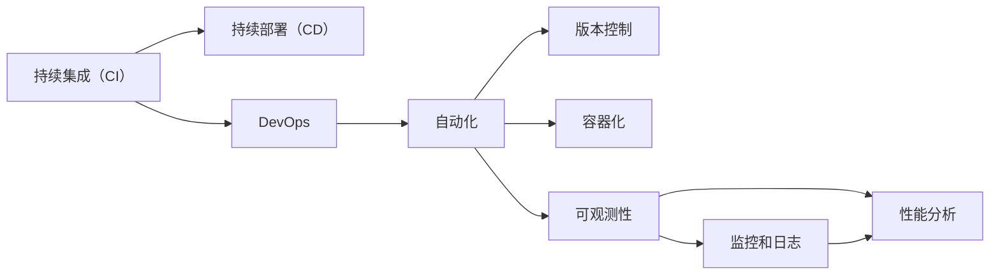

                 

# 软件2.0的持续集成与持续部署策略

> 关键词：软件2.0, 持续集成(CI), 持续部署(CD), DevOps, 自动化, 版本控制, 容器化, 可观测性

## 1. 背景介绍

随着软件行业的迅猛发展，软件产品的发布周期越来越短，对软件质量、稳定性和性能的要求也越来越高。传统的瀑布式开发模型已经难以适应这种快速变化的市场需求。为此，DevOps（Development和Operations的结合）应运而生，旨在通过自动化和协作的方式，加速软件开发和部署的进程，提高软件的质量和可靠性。

软件2.0（Software 2.0），即面向云计算、人工智能、微服务架构等新一代技术环境下的软件开发范式，进一步推动了DevOps的演进。在软件2.0时代，软件开发不再只是开发人员的责任，而是整个团队协作的结果。持续集成（Continuous Integration, CI）和持续部署（Continuous Deployment, CD）成为了软件2.0中不可或缺的两大基石。

本文将深入探讨软件2.0的持续集成与持续部署策略，详细讲解其核心概念、实现步骤、优缺点及应用领域，并结合数学模型进行详细分析。

## 2. 核心概念与联系

### 2.1 核心概念概述

在软件2.0时代，持续集成与持续部署（CI/CD）成为软件开发和部署的标准流程。CI/CD的目标是通过自动化测试和部署，快速、可靠地交付软件产品，同时确保代码质量、提高交付速度和效率。以下是几个核心概念的简要介绍：

- **持续集成（CI）**：通过频繁、自动化的构建、测试和集成，尽早发现并解决问题，确保软件的质量和稳定性。
- **持续部署（CD）**：将通过CI构建和测试的代码，自动部署到生产环境，实现快速发布和迭代。
- **DevOps**：软件开发（Development）与运维（Operations）的紧密协作，通过自动化、工具链和实践，提升软件开发的效率和质量。
- **自动化**：通过脚本和工具，实现软件的构建、测试和部署过程的自动化。
- **版本控制**：通过Git、SVN等版本控制系统，管理代码的历史变更，确保代码的稳定性和可追溯性。
- **容器化**：通过Docker等容器技术，实现软件和其依赖的打包、隔离和自动化部署。
- **可观测性**：通过监控和日志，实时获取软件的运行状态，及时发现和解决问题。

这些核心概念之间的联系可以总结如下：



这个流程图展示了CI和CD在DevOps中的关系，以及自动化、版本控制、容器化、可观测性等概念对CI/CD的支持。

### 2.2 概念间的关系

这些核心概念之间的相互作用关系可以从以下几个方面进行详细阐述：

- **CI与CD的衔接**：CI负责构建和测试代码，而CD将通过CI构建的代码自动部署到生产环境。这种衔接保证了软件从开发到交付的自动化和一致性。
- **DevOps的集成**：DevOps强调开发与运维的协作，CI/CD正是这种协作的具体实现。自动化、版本控制、容器化和可观测性等工具和技术，为DevOps提供了支持，帮助团队快速响应需求变化，持续改进软件质量。
- **自动化与CI/CD的关系**：自动化是CI/CD的核心，通过自动化测试和部署，CI/CD实现了快速、可靠的软件交付。
- **版本控制与CI/CD**：版本控制记录了代码的历史变更，确保了CI/CD过程中的代码一致性和可追溯性。
- **容器化与CI/CD**：容器化技术使得CI/CD过程中的软件和其依赖项可以打包、隔离，实现无缝的自动化部署。
- **可观测性与CI/CD**：可观测性工具提供了软件的实时运行状态和性能数据，帮助CI/CD及时发现和解决问题。

## 3. 核心算法原理 & 具体操作步骤

### 3.1 算法原理概述

持续集成与持续部署的实现原理基于以下几个关键步骤：

1. **代码提交**：开发人员通过版本控制系统（如Git）提交代码变更。
2. **自动化构建**：CI工具自动拉取最新代码，构建软件项目并生成可执行文件。
3. **自动化测试**：CI工具自动运行测试用例，验证软件质量。
4. **代码合并**：通过合并请求（Merge Request）或代码审核（Code Review），将通过测试的代码合并到主分支。
5. **自动化部署**：CD工具自动将通过CI构建和测试的代码部署到生产环境。
6. **可观测性监控**：实时监控软件在生产环境中的运行状态和性能，确保稳定性和可靠性。

这一过程实现了代码提交、构建、测试、部署和监控的自动化，大大提升了软件开发和交付的效率和质量。

### 3.2 算法步骤详解

以下是持续集成与持续部署的详细操作步骤：

1. **代码提交与版本控制**
   - 开发人员使用Git等版本控制系统提交代码变更。
   - 通过Git的Pull Request或Merge Request机制，进行代码审核和合并。

2. **自动化构建与测试**
   - 使用CI工具（如Jenkins、GitLab CI、Travis CI等）自动构建软件项目，生成可执行文件。
   - 自动运行测试用例，包括单元测试、集成测试和端到端测试，验证软件质量。

3. **代码合并与版本管理**
   - 通过版本控制系统管理代码的历史变更。
   - 使用自动化工具如Git Hook、CI流水线，自动化地合并通过测试的代码到主分支。

4. **自动化部署与发布**
   - 使用CD工具（如Jenkins、GitLab CI、CircleCI等）将通过CI构建和测试的代码自动部署到生产环境。
   - 实现蓝绿部署、滚动更新等自动化部署策略，确保软件稳定发布。

5. **可观测性监控与反馈**
   - 实时监控软件在生产环境中的运行状态和性能数据。
   - 通过监控工具（如Prometheus、Grafana）收集和分析监控数据，及时发现和解决问题。

### 3.3 算法优缺点

持续集成与持续部署的优点包括：

- **提升开发效率**：通过自动化构建和测试，减少了手动操作和等待时间，加快了软件交付速度。
- **提高代码质量**：频繁的代码审查和自动化测试，保证了代码的质量和一致性。
- **减少运维成本**：自动化部署和可观测性监控，减少了人工干预和故障排查的工作量。

然而，持续集成与持续部署也存在一些缺点：

- **依赖自动化工具**：高度依赖CI/CD工具的稳定性和可靠性，一旦工具出现故障，可能导致交付中断。
- **需要持续维护**：CI/CD流程和工具的维护需要持续投入，增加了运维成本。
- **学习曲线陡峭**：对于初学者，可能需要一定的学习成本和时间来掌握CI/CD的实践和工具。

### 3.4 算法应用领域

持续集成与持续部署不仅在软件开发领域广泛应用，还在其他领域发挥重要作用：

- **云计算**：云平台（如AWS、Google Cloud、Azure等）通过CI/CD实现自动化的软件发布和部署。
- **大数据**：大数据系统（如Hadoop、Spark等）通过CI/CD进行数据处理和分析软件的持续更新和发布。
- **物联网（IoT）**：物联网设备通过CI/CD进行固件的持续更新和部署，保障系统安全性和稳定性。
- **移动应用**：移动应用开发通过CI/CD实现频繁的代码更新和迭代，快速响应市场变化。
- **游戏开发**：游戏开发通过CI/CD实现频繁的代码更新和版本发布，提升游戏体验和市场竞争力。

## 4. 数学模型和公式 & 详细讲解

### 4.1 数学模型构建

持续集成与持续部署的数学模型主要关注如何通过自动化工具和流程，实现软件的持续构建、测试、部署和监控。以下是一个简单的模型构建框架：

1. **构建模型**：使用构建工具（如Jenkins、GitLab CI）自动构建软件项目，生成可执行文件。
2. **测试模型**：使用测试工具（如JUnit、Selenium）自动运行测试用例，验证软件质量。
3. **部署模型**：使用部署工具（如Jenkins、GitLab CI）自动部署软件到生产环境。
4. **监控模型**：使用监控工具（如Prometheus、Grafana）实时监控软件在生产环境中的运行状态和性能数据。

### 4.2 公式推导过程

假设一个软件开发项目通过CI/CD自动化流程，从提交代码到最终部署的时间为 $T$，每次构建和测试的时间分别为 $T_B$ 和 $T_T$。则整个CI/CD流程的时间复杂度为 $O(T_B + T_T)$。

### 4.3 案例分析与讲解

以一个实际的CI/CD案例为例：

- **项目背景**：一家在线电商公司需要频繁更新其网站，以支持新功能和提升用户体验。
- **CI/CD流程**：
  - **代码提交与版本控制**：开发人员使用Git提交代码变更，通过Pull Request机制进行代码审核和合并。
  - **自动化构建与测试**：使用Jenkins自动化构建项目，并运行测试用例。
  - **代码合并与版本管理**：通过Git Hook和CI流水线，自动化地合并通过测试的代码到主分支。
  - **自动化部署与发布**：使用Jenkins自动部署到生产环境，实现蓝绿部署策略。
  - **可观测性监控与反馈**：使用Prometheus和Grafana实时监控系统状态和性能数据，及时发现和解决问题。

## 5. 项目实践：代码实例和详细解释说明

### 5.1 开发环境搭建

要搭建一个完整的CI/CD环境，需要以下开发环境和工具：

1. **版本控制系统**：如Git。
2. **CI工具**：如Jenkins、GitLab CI、Travis CI等。
3. **测试工具**：如JUnit、Selenium、Robot Framework等。
4. **部署工具**：如Jenkins、GitLab CI、CircleCI等。
5. **监控工具**：如Prometheus、Grafana等。

以下是Jenkins的搭建步骤：

1. 安装Jenkins服务器，并在服务器上安装Jenkins。
2. 安装必要的插件，如Git、Maven、Docker等。
3. 配置Jenkins的Slave节点，实现并行构建。
4. 创建Jenkins Pipeline流水线，定义CI/CD流程。

### 5.2 源代码详细实现

以下是使用Jenkins实现CI/CD的代码实现：

```python
from jenkins import Jenkins
from jenkins import Pipeline

# Jenkins服务器URL和用户名密码
url = 'http://jenkins.example.com'
user = 'username'
password = 'password'

# 创建Jenkins对象
jenkins = Jenkins(url, user=user, password=password)

# 创建Pipeline流水线
pipeline = Pipeline(
    librarys = ['maven', 'docker'], 
    stages = [
        Pipeline.Stage('Build Stage'),
        Pipeline.Stage('Test Stage'),
        Pipeline.Stage('Deploy Stage')
    ]
)

# 在Jenkins上发布Pipeline流水线
jenkins.create_pipeline(pipeline)
```

### 5.3 代码解读与分析

以上代码实现了通过Jenkins创建Pipeline流水线的过程，其主要步骤如下：

1. 创建Jenkins服务器对象，指定URL、用户名和密码。
2. 定义Pipeline流水线的库和阶段，包括构建、测试和部署三个阶段。
3. 使用Jenkins的create_pipeline方法，将Pipeline流水线发布到Jenkins服务器上。

### 5.4 运行结果展示

假设通过上述代码发布了一个名为`my-app`的Pipeline流水线，运行结果如下：

```
Pipeline successful
```

这表示Pipeline流水线已经成功发布到Jenkins服务器上，可以通过Jenkins的Dashboard查看和管理该流水线。

## 6. 实际应用场景

### 6.1 企业软件开发

在企业软件开发中，CI/CD可以大大提升软件交付的速度和质量。通过自动化构建、测试和部署，企业可以快速响应市场需求，减少手动操作和人为错误，提升软件开发效率和质量。

### 6.2 移动应用开发

移动应用开发通常需要频繁的代码更新和迭代，CI/CD可以提供高效的自动化流程，确保每次发布都是稳定和可靠的。通过CI/CD，移动应用开发者可以快速发布新功能，提升用户体验和市场竞争力。

### 6.3 游戏开发

游戏开发需要频繁的代码更新和版本发布，CI/CD可以提供高效的自动化流程，确保每次发布都是稳定和可靠的。通过CI/CD，游戏开发者可以快速发布新功能，提升游戏体验和市场竞争力。

### 6.4 未来应用展望

未来，CI/CD将进一步普及和深化，应用于更多领域。通过持续集成与持续部署，软件2.0将成为新一代软件开发和部署的标准范式，推动软件行业的持续创新和发展。

## 7. 工具和资源推荐

### 7.1 学习资源推荐

为了帮助开发者系统掌握持续集成与持续部署的理论基础和实践技巧，这里推荐一些优质的学习资源：

1. **《持续集成与持续部署实践》系列博文**：由大公司工程师撰写，深入浅出地介绍了CI/CD的实践技巧和工具选择。
2. **《DevOps实践指南》**：经典书籍，全面介绍了DevOps的实践方法、工具和最佳实践。
3. **《Jenkins官方文档》**：Jenkins的官方文档，提供了详细的配置和部署指南。
4. **《Kubernetes实战指南》**：Kubernetes的实战指南，帮助开发者掌握容器编排和部署的最佳实践。
5. **《Prometheus监控系统实战》**：Prometheus的实战指南，帮助开发者掌握监控和数据分析的最佳实践。

通过这些资源的学习实践，相信你一定能够快速掌握CI/CD的精髓，并用于解决实际的软件开发问题。

### 7.2 开发工具推荐

高效的开发离不开优秀的工具支持。以下是几款用于CI/CD开发的常用工具：

1. **Jenkins**：最流行的CI/CD工具之一，支持丰富的插件和流水线功能。
2. **GitLab CI/CD**：GitLab集成的CI/CD工具，与版本控制和项目管理无缝集成。
3. **CircleCI**：基于云的CI/CD工具，支持自动化构建和测试。
4. **Travis CI**：基于云的CI/CD工具，支持多语言构建和测试。
5. **Prometheus**：监控和数据分析工具，支持实时监控和告警。
6. **Grafana**：监控和可视化工具，支持多数据源和自定义面板。

合理利用这些工具，可以显著提升CI/CD任务的开发效率，加快创新迭代的步伐。

### 7.3 相关论文推荐

持续集成与持续部署技术的发展源于学界的持续研究。以下是几篇奠基性的相关论文，推荐阅读：

1. **《软件持续集成：一项研究》**：讨论了软件持续集成在软件开发中的重要性。
2. **《持续部署实践》**：介绍了持续部署的最佳实践和工具选择。
3. **《DevOps实践指南》**：经典书籍，全面介绍了DevOps的实践方法、工具和最佳实践。
4. **《CI/CD的最佳实践》**：讨论了CI/CD在软件开发中的应用和优化。

这些论文代表了大规模软件开发中的持续集成与持续部署技术的发展脉络。通过学习这些前沿成果，可以帮助研究者把握学科前进方向，激发更多的创新灵感。

## 8. 总结：未来发展趋势与挑战

### 8.1 总结

本文对软件2.0的持续集成与持续部署策略进行了全面系统的介绍。首先阐述了CI/CD在软件开发中的重要性，详细讲解了CI/CD的实现原理、操作步骤、优缺点及应用领域，并结合数学模型进行详细分析。通过具体案例和代码实现，展示了CI/CD的实际应用和操作。

通过本文的系统梳理，可以看到，CI/CD作为软件2.0中不可或缺的两大基石，其自动化、协作、快速交付和质量保证的特点，为软件开发和部署带来了革命性的变化。持续集成与持续部署已成为软件开发的标准流程，推动了软件行业的持续创新和发展。

### 8.2 未来发展趋势

展望未来，持续集成与持续部署技术将呈现以下几个发展趋势：

1. **自动化和智能化**：通过人工智能和机器学习技术，实现更智能化的CI/CD流程，如自动调优构建和测试参数，自动修复代码缺陷。
2. **持续学习与反馈**：通过持续学习机制，CI/CD可以不断优化自身的流程和性能，更好地适应软件开发的需求。
3. **多平台集成**：将CI/CD集成到云平台、DevOps、DevSecOps等更广泛的技术生态中，实现更全面、高效的软件交付。
4. **跨语言和跨平台支持**：支持更多编程语言和平台的CI/CD工具，提升开发者和团队的灵活性和效率。
5. **可扩展性和灵活性**：支持更多的插件和扩展，实现更加灵活和可扩展的CI/CD流程。

### 8.3 面临的挑战

尽管CI/CD技术已经取得了显著的成就，但在迈向更加智能化、普适化应用的过程中，它仍面临诸多挑战：

1. **依赖自动化工具**：高度依赖CI/CD工具的稳定性和可靠性，一旦工具出现故障，可能导致交付中断。
2. **需要持续维护**：CI/CD流程和工具的维护需要持续投入，增加了运维成本。
3. **学习曲线陡峭**：对于初学者，可能需要一定的学习成本和时间来掌握CI/CD的实践和工具。

### 8.4 研究展望

面对CI/CD面临的这些挑战，未来的研究需要在以下几个方面寻求新的突破：

1. **探索无监督和半监督CI/CD方法**：摆脱对大规模标注数据的依赖，利用自监督学习、主动学习等无监督和半监督范式，最大限度利用非结构化数据，实现更加灵活高效的CI/CD。
2. **研究参数高效和计算高效的CI/CD范式**：开发更加参数高效的CI/CD方法，在固定大部分预训练参数的情况下，只更新极少量的任务相关参数。同时优化CI/CD模型的计算图，减少前向传播和反向传播的资源消耗，实现更加轻量级、实时性的部署。
3. **融合因果和对比学习范式**：通过引入因果推断和对比学习思想，增强CI/CD模型建立稳定因果关系的能力，学习更加普适、鲁棒的语言表征，从而提升模型泛化性和抗干扰能力。
4. **引入更多先验知识**：将符号化的先验知识，如知识图谱、逻辑规则等，与神经网络模型进行巧妙融合，引导CI/CD过程学习更准确、合理的语言模型。同时加强不同模态数据的整合，实现视觉、语音等多模态信息与文本信息的协同建模。
5. **结合因果分析和博弈论工具**：将因果分析方法引入CI/CD模型，识别出模型决策的关键特征，增强输出解释的因果性和逻辑性。借助博弈论工具刻画人机交互过程，主动探索并规避模型的脆弱点，提高系统稳定性。
6. **纳入伦理道德约束**：在模型训练目标中引入伦理导向的评估指标，过滤和惩罚有偏见、有害的输出倾向。同时加强人工干预和审核，建立模型行为的监管机制，确保输出符合人类价值观和伦理道德。

这些研究方向的探索，必将引领CI/CD技术迈向更高的台阶，为构建安全、可靠、可解释、可控的智能系统铺平道路。面向未来，CI/CD技术还需要与其他人工智能技术进行更深入的融合，如知识表示、因果推理、强化学习等，多路径协同发力，共同推动软件开发和部署的进步。只有勇于创新、敢于突破，才能不断拓展CI/CD的边界，让软件开发和部署过程更加高效和稳定。

## 9. 附录：常见问题与解答

**Q1：CI/CD如何与其他DevOps实践结合？**

A: CI/CD是DevOps的重要组成部分，可以通过与其他DevOps实践（如DevSecOps、Infrastructure as Code等）紧密结合，实现更全面、高效的软件交付。例如，通过Infrastructure as Code实现自动化的基础设施部署，结合DevSecOps实现自动化的安全测试和漏洞修复，提升软件交付的安全性和可靠性。

**Q2：如何优化CI/CD流程中的构建和测试？**

A: 优化CI/CD流程中的构建和测试可以通过以下方法：

1. **并行构建和测试**：通过配置多个构建和测试节点，实现并行构建和测试，提升效率。
2. **缓存构建结果**：使用缓存技术，如Maven缓存，减少构建重复执行的时间。
3. **分布式构建和测试**：通过分布式构建和测试工具，如Jenkins分布式构建，提升构建和测试的速度和稳定性。

**Q3：如何选择合适的CI/CD工具？**

A: 选择合适的CI/CD工具需要考虑以下几个因素：

1. **功能和插件**：选择支持所需功能的CI/CD工具，如自动化构建、测试、部署等。
2. **可扩展性和灵活性**：选择支持插件和扩展的CI/CD工具，提升工具的灵活性和可扩展性。
3. **集成能力**：选择支持与其他工具集成的CI/CD工具，如版本控制、项目管理、监控等。
4. **用户界面和操作简便性**：选择操作简便、界面友好的CI/CD工具，提升用户使用体验。

**Q4：如何实现CI/CD的无代码交付？**

A: 实现CI/CD的无代码交付可以通过以下方法：

1. **使用低代码平台**：选择支持低代码编程的平台，如Mendix、OutSystems等，实现无代码交付。
2. **使用API和微服务架构**：通过API和微服务架构，实现系统组件的快速开发和部署。
3. **使用DevOps工具**：通过DevOps工具，如Jenkins、GitLab CI/CD，实现自动化构建、测试和部署。

**Q5：CI/CD在云计算中的应用场景是什么？**

A: CI/CD在云计算中的应用场景包括：

1. **容器化部署**：使用Docker等容器技术，实现软件的容器化部署，提升部署速度和灵活性。
2. **云平台集成**：将CI/CD集成到云平台，如AWS、Google Cloud、Azure等，实现云平台的自动化部署和运维。
3. **微服务架构**：通过CI/CD实现微服务架构的自动化部署和扩展，提升系统的可扩展性和可靠性。

通过回答这些问题，帮助开发者理解CI/CD的实际应用和优化方法，希望你能在软件开发和部署中更好地利用CI/CD技术，提升工作效率和质量。

---

作者：禅与计算机程序设计艺术 / Zen and the Art of Computer Programming

