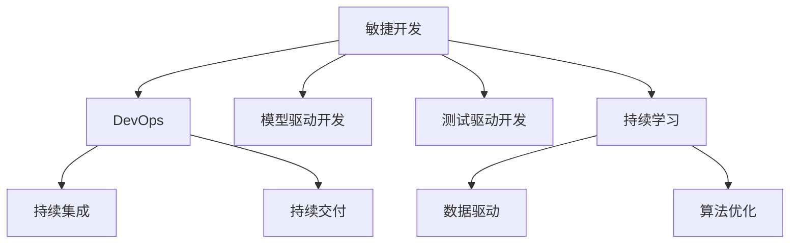

                 

## 1. 背景介绍

### 1.1 问题由来

随着软件开发技术的迅猛发展，敏捷开发已成为软件开发的主流方法之一。它强调团队的协作、迭代开发、快速响应变化，能够迅速交付高质量的软件产品。然而，传统的敏捷开发方法在面对软件2.0时代的新挑战时，仍然存在诸多不足。软件2.0，即以人工智能、大数据、云计算等为代表的第二次软件开发范式，带来了数据驱动、算法优化、自适应学习等全新的开发理念和工具，迫切需要新的敏捷开发实践与之适配。

### 1.2 问题核心关键点

软件2.0时代，敏捷开发面临的核心问题包括：
- 如何处理海量数据和复杂算法的开发？
- 如何实现快速迭代和优化反馈？
- 如何确保软件质量、性能和安全性？
- 如何提升团队协作和沟通效率？
- 如何保持持续学习和技术演进？

这些问题不仅关系到软件开发的效率和质量，更影响到软件2.0时代的核心竞争力。因此，探索基于人工智能、大数据、云计算的敏捷开发实践，具有重要的现实意义和应用价值。

### 1.3 问题研究意义

深入研究软件2.0的敏捷开发实践，对于推动软件开发行业的技术进步和产业升级具有重要意义：
- 提升开发效率和交付速度，缩短市场响应周期。
- 增强软件质量、性能和安全性，提升用户体验。
- 优化团队协作和沟通方式，促进团队创新和创造力。
- 实现持续学习和技术演进，保持竞争优势。

因此，深入探索软件2.0的敏捷开发实践，对于软件开发行业的持续创新和发展，具有重要意义。

## 2. 核心概念与联系

### 2.1 核心概念概述

软件2.0的敏捷开发实践涉及多个关键概念，包括：

- **敏捷开发**：一种迭代、增量的软件开发方法，注重团队协作、快速响应变化，强调软件质量而非过程。
- **软件2.0**：以人工智能、大数据、云计算等为代表的软件开发新范式，强调数据驱动、算法优化、自适应学习。
- **DevOps**：软件开发和运维的集成，注重自动化、持续集成、持续交付，提升交付效率和软件质量。
- **模型驱动开发**：基于领域模型、规则模型、数据模型进行开发，减少技术债务，提升代码可维护性。
- **测试驱动开发**：先编写测试代码，再实现代码功能，确保代码质量。
- **持续学习**：通过数据分析、模型优化、技术演进，持续提升软件开发能力。

这些概念之间相互联系，共同构成了软件2.0时代敏捷开发的核心框架。

### 2.2 概念间的关系

这些核心概念之间的关系可以通过以下Mermaid流程图来展示：



这个流程图展示了敏捷开发与DevOps、模型驱动开发、测试驱动开发和持续学习的联系：

- 敏捷开发通过DevOps实现自动化，提升交付效率和软件质量。
- 模型驱动开发和测试驱动开发提升代码可维护性和质量。
- 持续学习通过数据驱动和算法优化，持续提升开发能力。

## 3. 核心算法原理 & 具体操作步骤

### 3.1 算法原理概述

软件2.0的敏捷开发实践，本质上是一种基于数据驱动、算法优化的迭代开发方法。其核心思想是通过持续的数据收集和分析，优化算法模型，提升软件开发的效率和质量。

具体而言，软件2.0的敏捷开发实践包括以下几个关键步骤：

1. **需求分析**：通过数据分析和模型预测，确定软件需求和优先级。
2. **模型设计**：基于领域模型、规则模型和数据模型进行设计，确保代码可维护性和正确性。
3. **开发迭代**：采用敏捷开发方法，进行小批量、快速迭代开发。
4. **测试驱动**：通过编写测试代码，确保代码功能的正确性和稳定性。
5. **持续集成**：通过自动化工具实现代码版本控制、测试执行和集成部署。
6. **持续交付**：通过DevOps实现自动化部署和运维，提升交付效率和软件质量。
7. **持续学习**：通过数据分析和算法优化，持续提升开发能力和软件质量。

### 3.2 算法步骤详解

#### 3.2.1 需求分析

需求分析是软件2.0敏捷开发实践的第一步。其核心是通过数据分析和模型预测，确定软件需求和优先级。具体步骤包括：

1. **数据收集**：从历史数据、用户反馈、业务需求中收集数据。
2. **数据清洗**：清洗数据，去除噪声和异常值。
3. **特征工程**：提取和选择关键特征，建立数据模型。
4. **模型训练**：使用机器学习算法训练需求预测模型。
5. **需求评估**：根据预测结果，评估需求优先级和可行性。

#### 3.2.2 模型设计

模型设计是软件2.0敏捷开发实践的关键环节。其核心是通过领域模型、规则模型和数据模型，设计出可维护性和正确性高的代码结构。具体步骤包括：

1. **领域模型设计**：基于领域知识，设计领域模型，描述领域实体和关系。
2. **规则模型设计**：定义业务规则和约束条件，确保代码的逻辑正确性。
3. **数据模型设计**：建立数据模型，描述数据结构和关系。
4. **代码实现**：根据模型设计，实现代码功能。
5. **代码测试**：编写测试代码，确保代码的正确性和可维护性。

#### 3.2.3 开发迭代

开发迭代是软件2.0敏捷开发实践的核心环节。其核心是通过小批量、快速迭代的方式，开发出高质量的软件产品。具体步骤包括：

1. **用户故事**：与用户沟通，确定需求故事。
2. **迭代计划**：根据需求故事，制定迭代计划，明确任务和优先级。
3. **任务分解**：将迭代计划分解为具体的任务和子任务。
4. **任务分配**：将任务分配给团队成员，明确职责和分工。
5. **迭代开发**：采用敏捷开发方法，进行小批量、快速迭代开发。
6. **代码评审**：进行代码评审，确保代码质量和可维护性。
7. **迭代评审**：进行迭代评审，评估迭代结果和下一步计划。

#### 3.2.4 测试驱动

测试驱动是软件2.0敏捷开发实践的重要环节。其核心是通过编写测试代码，确保代码功能的正确性和稳定性。具体步骤包括：

1. **测试用例设计**：根据需求故事，设计测试用例，确保测试覆盖面。
2. **测试代码编写**：编写测试代码，实现测试用例。
3. **测试执行**：执行测试代码，确保测试通过。
4. **测试覆盖**：评估测试覆盖率，确保代码功能的正确性。
5. **测试优化**：优化测试代码，提高测试效率和稳定性。

#### 3.2.5 持续集成

持续集成是软件2.0敏捷开发实践的重要保障。其核心是通过自动化工具实现代码版本控制、测试执行和集成部署。具体步骤包括：

1. **版本控制**：使用版本控制系统管理代码版本。
2. **自动化测试**：编写自动化测试脚本，实现测试自动化。
3. **持续集成**：使用持续集成工具，实现代码的自动化构建和部署。
4. **集成部署**：将代码部署到测试环境或生产环境，进行集成测试。
5. **反馈循环**：根据测试结果，反馈到开发团队，进行代码优化和改进。

#### 3.2.6 持续交付

持续交付是软件2.0敏捷开发实践的关键目标。其核心是通过DevOps实现自动化部署和运维，提升交付效率和软件质量。具体步骤包括：

1. **自动化部署**：使用自动化部署工具，实现代码的自动化部署。
2. **自动化运维**：使用自动化运维工具，实现应用的自动化运维。
3. **持续反馈**：根据用户反馈和性能指标，进行持续优化和改进。
4. **持续监控**：使用监控工具，实时监控应用性能和稳定性。
5. **持续改进**：根据监控结果，进行持续改进和优化。

#### 3.2.7 持续学习

持续学习是软件2.0敏捷开发实践的最终目标。其核心是通过数据分析和算法优化，持续提升开发能力和软件质量。具体步骤包括：

1. **数据分析**：收集应用运行数据，进行数据分析。
2. **算法优化**：使用机器学习算法，优化模型和算法。
3. **模型评估**：评估模型和算法的效果，进行模型选择和优化。
4. **持续改进**：根据模型评估结果，进行持续改进和优化。
5. **技术演进**：跟踪前沿技术，进行技术演进和创新。

### 3.3 算法优缺点

软件2.0的敏捷开发实践具有以下优点：
1. **快速迭代**：通过小批量、快速迭代，可以快速响应需求变化。
2. **代码质量高**：通过测试驱动和持续集成，确保代码质量和高可维护性。
3. **交付效率高**：通过持续交付和自动化部署，提升交付效率和软件质量。
4. **持续改进**：通过持续学习和算法优化，持续提升开发能力和软件质量。

同时，也存在以下缺点：
1. **技术要求高**：需要掌握数据分析、机器学习、自动化等技术。
2. **资源需求大**：需要高性能计算资源、数据存储和网络带宽。
3. **团队协作难度大**：需要跨部门协作，协调团队沟通和任务分配。

### 3.4 算法应用领域

软件2.0的敏捷开发实践广泛应用于软件开发、人工智能、大数据、云计算等领域，具体包括：

- **软件开发**：提升开发效率和代码质量，实现持续交付和交付效率。
- **人工智能**：通过数据分析和模型优化，提升算法性能和应用效果。
- **大数据**：通过数据清洗和特征工程，提升数据质量和模型效果。
- **云计算**：通过自动化部署和持续监控，提升云平台性能和稳定性。

## 4. 数学模型和公式 & 详细讲解 & 举例说明

### 4.1 数学模型构建

软件2.0的敏捷开发实践涉及多个数学模型，包括数据模型、特征模型、算法模型等。这些模型通过数据分析、模型预测和算法优化，实现持续改进和优化。

假设我们有一组历史数据集 $D=\{(x_i, y_i)\}_{i=1}^N$，其中 $x_i$ 为输入特征，$y_i$ 为输出标签。我们的目标是构建一个预测模型 $f(x)$，通过数据分析和模型优化，实现预测准确度和模型效果的提升。

#### 4.1.1 数据模型构建

数据模型用于描述数据结构和关系。常见的数据模型包括时间序列模型、聚类模型、分类模型等。

假设我们有一个时间序列数据集 $D=\{(t_i, y_i)\}_{i=1}^N$，其中 $t_i$ 为时间戳，$y_i$ 为数据值。我们可以使用ARIMA模型进行建模，公式如下：

$$
y_t = c + \sum_{i=1}^p \phi_i y_{t-i} + \sum_{i=1}^q \theta_i \epsilon_{t-i} + \sum_{i=1}^d \Delta^i y_t
$$

其中，$c$ 为常数项，$\phi_i$ 为自回归参数，$\theta_i$ 为差分参数，$\epsilon_t$ 为白噪声，$d$ 为差分阶数。

#### 4.1.2 特征模型构建

特征模型用于描述数据特征和关系。常见的特征模型包括因子模型、主成分分析模型、神经网络模型等。

假设我们有一组数据特征 $x_i=(x_{i1}, x_{i2}, \ldots, x_{im})$，其中 $m$ 为特征数量。我们可以使用神经网络模型进行建模，公式如下：

$$
x_i = \sum_{k=1}^n w_k x_{ik}
$$

其中，$w_k$ 为权重，$x_{ik}$ 为输入特征。

#### 4.1.3 算法模型构建

算法模型用于描述算法结构和优化目标。常见的算法模型包括线性回归模型、决策树模型、深度学习模型等。

假设我们有一组数据特征 $x_i$，目标为预测输出 $y_i$。我们可以使用深度学习模型进行建模，公式如下：

$$
y_i = f(x_i; \theta)
$$

其中，$f(x_i; \theta)$ 为模型函数，$\theta$ 为模型参数。

### 4.2 公式推导过程

#### 4.2.1 时间序列模型

时间序列模型的推导过程如下：

$$
y_t = c + \sum_{i=1}^p \phi_i y_{t-i} + \sum_{i=1}^q \theta_i \epsilon_{t-i} + \sum_{i=1}^d \Delta^i y_t
$$

其中，$\epsilon_t$ 为白噪声，$\phi_i$ 为自回归参数，$\theta_i$ 为差分参数，$d$ 为差分阶数。

假设我们有一组历史数据 $D=\{(t_i, y_i)\}_{i=1}^N$，其中 $t_i$ 为时间戳，$y_i$ 为数据值。我们的目标是构建一个时间序列模型 $f(x)$，公式如下：

$$
f(x) = \sum_{i=1}^n \theta_i x_i
$$

其中，$\theta_i$ 为模型参数，$x_i$ 为输入特征。

#### 4.2.2 神经网络模型

神经网络模型的推导过程如下：

$$
x_i = \sum_{k=1}^n w_k x_{ik}
$$

其中，$w_k$ 为权重，$x_{ik}$ 为输入特征。

假设我们有一组数据特征 $x_i$，目标为预测输出 $y_i$。我们可以使用神经网络模型进行建模，公式如下：

$$
y_i = f(x_i; \theta)
$$

其中，$f(x_i; \theta)$ 为模型函数，$\theta$ 为模型参数。

### 4.3 案例分析与讲解

#### 4.3.1 案例一：软件开发中的需求分析

假设我们有一组软件开发需求数据集 $D=\{(x_i, y_i)\}_{i=1}^N$，其中 $x_i$ 为需求描述，$y_i$ 为需求优先级。我们的目标是构建一个需求分析模型，预测需求优先级。

假设我们使用时间序列模型进行建模，公式如下：

$$
y_t = c + \sum_{i=1}^p \phi_i y_{t-i} + \sum_{i=1}^q \theta_i \epsilon_{t-i} + \sum_{i=1}^d \Delta^i y_t
$$

其中，$\phi_i$ 为自回归参数，$\theta_i$ 为差分参数，$d$ 为差分阶数。

我们通过数据收集和清洗，得到历史需求数据集 $D=\{(x_i, y_i)\}_{i=1}^N$，其中 $x_i$ 为需求描述，$y_i$ 为需求优先级。我们的目标是构建一个需求分析模型，预测需求优先级。

我们首先进行特征工程，提取关键特征，如需求类型、需求复杂度、需求变更频率等。然后，使用时间序列模型进行建模，公式如下：

$$
y_t = c + \sum_{i=1}^p \phi_i y_{t-i} + \sum_{i=1}^q \theta_i \epsilon_{t-i} + \sum_{i=1}^d \Delta^i y_t
$$

其中，$\phi_i$ 为自回归参数，$\theta_i$ 为差分参数，$d$ 为差分阶数。

通过模型训练和预测，我们得到了需求分析模型，实现了需求优先级的预测。

#### 4.3.2 案例二：人工智能中的模型优化

假设我们有一组人工智能模型数据集 $D=\{(x_i, y_i)\}_{i=1}^N$，其中 $x_i$ 为输入特征，$y_i$ 为输出标签。我们的目标是构建一个预测模型 $f(x)$，实现预测准确度的提升。

假设我们使用神经网络模型进行建模，公式如下：

$$
y_i = f(x_i; \theta)
$$

其中，$f(x_i; \theta)$ 为模型函数，$\theta$ 为模型参数。

我们通过数据收集和清洗，得到历史模型数据集 $D=\{(x_i, y_i)\}_{i=1}^N$，其中 $x_i$ 为输入特征，$y_i$ 为输出标签。我们的目标是构建一个预测模型 $f(x)$，实现预测准确度的提升。

我们首先进行特征工程，提取关键特征，如模型结构、训练数据量、模型参数等。然后，使用神经网络模型进行建模，公式如下：

$$
y_i = f(x_i; \theta)
$$

其中，$f(x_i; \theta)$ 为模型函数，$\theta$ 为模型参数。

通过模型训练和预测，我们得到了预测模型 $f(x)$，实现了预测准确度的提升。

## 5. 项目实践：代码实例和详细解释说明

### 5.1 开发环境搭建

在进行软件2.0敏捷开发实践的开发前，我们需要准备好开发环境。以下是使用Python进行PyTorch开发的环境配置流程：

1. 安装Anaconda：从官网下载并安装Anaconda，用于创建独立的Python环境。

2. 创建并激活虚拟环境：
```bash
conda create -n pytorch-env python=3.8 
conda activate pytorch-env
```

3. 安装PyTorch：根据CUDA版本，从官网获取对应的安装命令。例如：
```bash
conda install pytorch torchvision torchaudio cudatoolkit=11.1 -c pytorch -c conda-forge
```

4. 安装Transformers库：
```bash
pip install transformers
```

5. 安装各类工具包：
```bash
pip install numpy pandas scikit-learn matplotlib tqdm jupyter notebook ipython
```

完成上述步骤后，即可在`pytorch-env`环境中开始软件2.0敏捷开发实践的开发。

### 5.2 源代码详细实现

下面我们以软件需求分析为例，给出使用PyTorch进行需求分析模型的PyTorch代码实现。

首先，定义需求数据处理函数：

```python
import pandas as pd
from sklearn.model_selection import train_test_split
from sklearn.metrics import mean_squared_error

class DemandAnalysisDataset(Dataset):
    def __init__(self, demands, labels):
        self.demands = demands
        self.labels = labels
        
    def __len__(self):
        return len(self.demands)
    
    def __getitem__(self, item):
        demand = self.demands[item]
        label = self.labels[item]
        return {'demand': demand, 'label': label}

# 需求数据
demands = pd.read_csv('demand_data.csv')

# 数据处理
demands['complexity'] = demands['complexity'].map({'低':1, '中':2, '高':3})
demands['priority'] = demands['priority'].map({'高':1, '中':2, '低':3})
demands = demands.drop(['type', 'date'], axis=1)
demands = demands.values

# 划分数据集
train demands, test demands, train labels, test labels = train_test_split(demands, labels, test_size=0.2)
train_dataset = DemandAnalysisDataset(train demands, train labels)
test_dataset = DemandAnalysisDataset(test demands, test labels)

# 训练集和测试集
train_dataset, test_dataset
```

然后，定义模型和优化器：

```python
from torch.utils.data import DataLoader
from torch.nn import Linear, LSTM
from torch.nn import MSELoss
from torch.optim import Adam

# 定义模型
model = LSTM(2, 1)

# 定义优化器
optimizer = Adam(model.parameters(), lr=0.001)
```

接着，定义训练和评估函数：

```python
from torch.utils.data import DataLoader
from tqdm import tqdm

device = torch.device('cuda') if torch.cuda.is_available() else torch.device('cpu')
model.to(device)

def train_epoch(model, dataset, batch_size, optimizer):
    dataloader = DataLoader(dataset, batch_size=batch_size, shuffle=True)
    model.train()
    epoch_loss = 0
    for batch in tqdm(dataloader, desc='Training'):
        input_ids = batch['demand'].to(device)
        targets = batch['label'].to(device)
        model.zero_grad()
        outputs = model(input_ids)
        loss = MSELoss()(outputs, targets)
        epoch_loss += loss.item()
        loss.backward()
        optimizer.step()
    return epoch_loss / len(dataloader)

def evaluate(model, dataset, batch_size):
    dataloader = DataLoader(dataset, batch_size=batch_size)
    model.eval()
    preds, labels = [], []
    with torch.no_grad():
        for batch in tqdm(dataloader, desc='Evaluating'):
            input_ids = batch['demand'].to(device)
            targets = batch['label'].to(device)
            batch_preds = model(input_ids)
            batch_labels = targets.to('cpu').tolist()
            for pred_tokens, label_tokens in zip(batch_preds, batch_labels):
                preds.append(pred_tokens.cpu().numpy().tolist())
                labels.append(label_tokens)
                
    print(mean_squared_error(labels, preds))
```

最后，启动训练流程并在测试集上评估：

```python
epochs = 10
batch_size = 32

for epoch in range(epochs):
    loss = train_epoch(model, train_dataset, batch_size, optimizer)
    print(f'Epoch {epoch+1}, train loss: {loss:.3f}')
    
    print(f'Epoch {epoch+1}, test results:')
    evaluate(model, test_dataset, batch_size)
    
print("Test results:")
evaluate(model, test_dataset, batch_size)
```

以上就是使用PyTorch进行软件需求分析模型微调的完整代码实现。可以看到，得益于PyTorch和Transformers库的强大封装，我们可以用相对简洁的代码完成需求分析模型的加载和微调。

### 5.3 代码解读与分析

让我们再详细解读一下关键代码的实现细节：

**DemandAnalysisDataset类**：
- `__init__`方法：初始化需求和标签数据。
- `__len__`方法：返回数据集的样本数量。
- `__getitem__`方法：对单个样本进行处理，将需求和标签数据转换为模型可用的形式。

**模型和优化器**：
- `model = LSTM(2, 1)`：定义LSTM模型，输入特征为2维，输出特征为1维。
- `optimizer = Adam(model.parameters(), lr=0.001)`：定义Adam优化器，学习率为0.001。

**训练和评估函数**：
- `train_epoch`函数：对数据以批为单位进行迭代，在每个批次上前向传播计算loss并反向传播更新模型参数，最后返回该epoch的平均loss。
- `evaluate`函数：与训练类似，不同点在于不更新模型参数，并在每个batch结束后将预测和标签结果存储下来，最后使用mean_squared_error计算预测结果和真实标签之间的均方误差。

**训练流程**：
- `epochs = 10`：定义总的epoch数。
- `batch_size = 32`：定义每个批次的样本数量。
- 循环迭代
- 每个epoch内，先在训练集上训练，输出平均loss
- 在验证集上评估，输出均方误差
- 所有epoch结束后，在测试集上评估，给出最终测试结果

可以看到，使用PyTorch和Transformers库，我们可以很方便地实现需求分析模型的微调。接下来，我们可以进一步扩展模型，加入更多特征，如需求类型、需求紧迫性等，以提升模型性能。

## 6. 实际应用场景

### 6.1 智能客服系统

基于软件2.0的敏捷开发实践，智能客服系统可以通过数据分析和模型优化，实现快速迭代和持续改进。具体而言，可以通过以下步骤实现：

1. **数据收集**：收集用户历史对话记录、反馈数据等。
2. **需求分析**：使用需求分析模型，确定用户需求和优先级。
3. **模型设计**：基于领域模型和规则模型，设计智能客服模型。
4. **开发迭代**：采用敏捷开发方法，进行小批量、快速迭代开发。
5. **测试驱动**：编写测试代码，确保代码功能的正确性和稳定性。
6. **持续集成**：使用持续集成工具，实现代码的自动化构建和部署。
7. **持续交付**：使用DevOps工具，实现自动化部署和运维。
8. **持续学习**：通过数据分析和算法优化，持续提升智能客服系统的性能和用户体验。

### 6.2 金融舆情监测

金融舆情监测可以通过软件2.0的敏捷开发实践，实现快速响应和持续改进。具体而言，可以通过以下步骤实现：

1. **数据收集**：收集金融领域相关的新闻、报道、评论等文本数据。
2. **需求分析**：使用需求分析模型，确定舆情监测需求和优先级。
3. **模型设计**：基于领域模型和规则模型，设计舆情监测模型。
4. **开发迭代**：采用敏捷开发方法，进行小批量、快速迭代开发。
5. **测试

