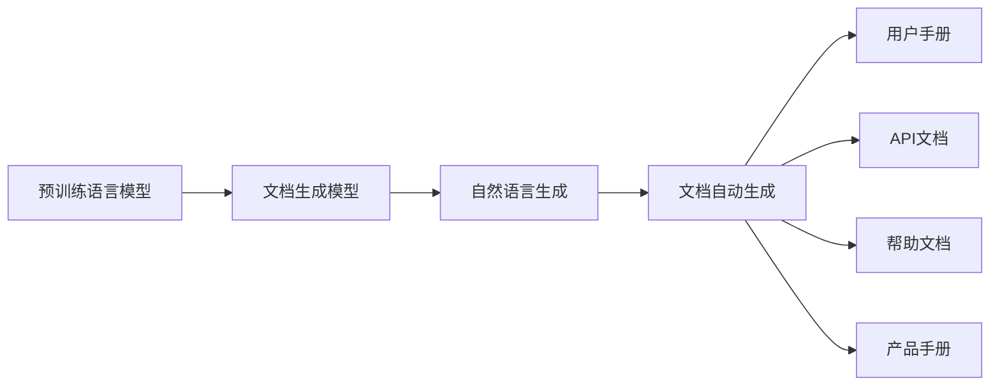
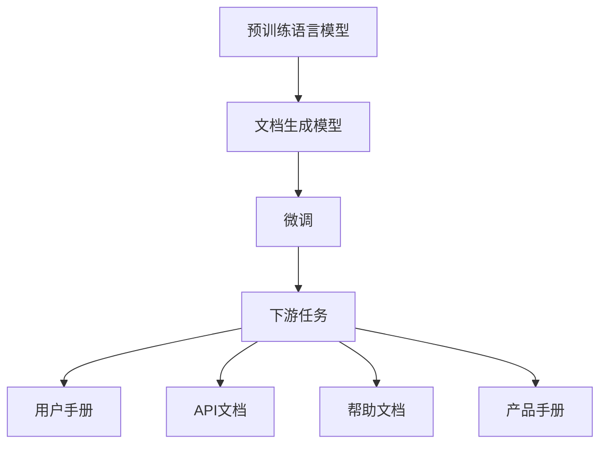
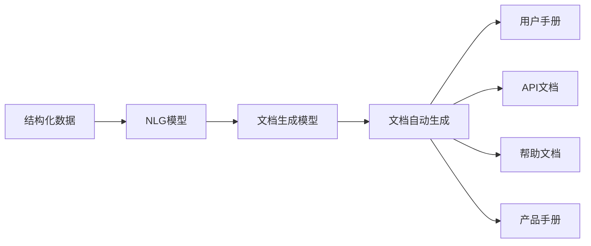
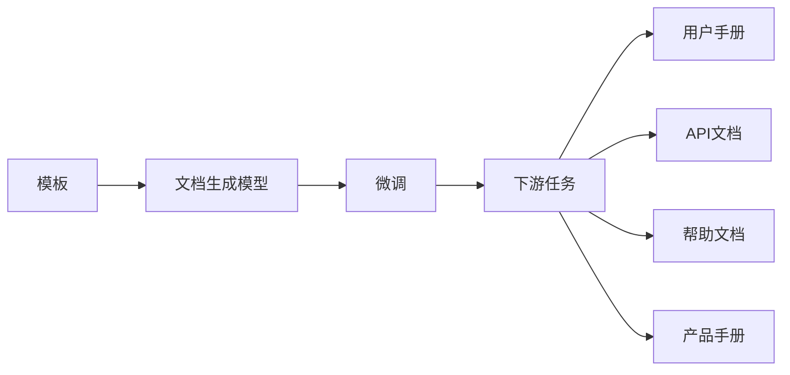
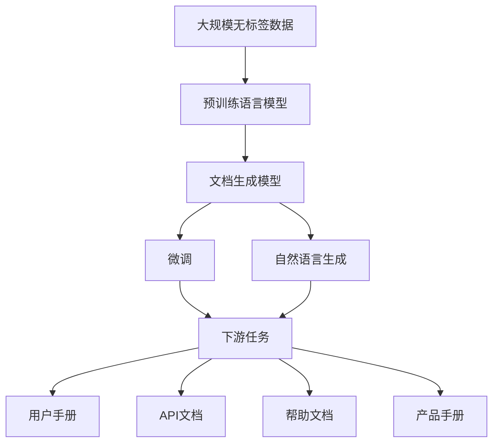

                 

# 软件2.0的文档自动生成技术

## 1. 背景介绍

在计算机科学的迅速发展中，软件技术经历了多次重大变革。从早期的手编代码到后期的高效自动化开发，软件产业逐渐迈入了一个新时代——软件2.0。软件2.0时代，软件不再只是基于代码的产物，而是能够自动生成、自我优化和自主迭代的智能系统。文档自动生成技术作为软件2.0的核心技术之一，正逐步改变传统软件开发模式，带来革命性的变革。

### 1.1 背景由来

软件2.0的文档自动生成技术来源于人工智能和自然语言处理（NLP）的最新进展。自然语言生成（NLG）技术，特别是大语言模型（LLMs）的诞生，为文档自动生成提供了强大的技术支持。通过预先训练的语言模型，可以有效学习到语言结构和表达习惯，从而生成高质量的文本。随着预训练语言模型的不断演进，文档自动生成技术也在不断成熟，为软件2.0的发展提供了坚实的基础。

### 1.2 问题核心关键点

文档自动生成技术主要包含两个方面：预训练语言模型的构建和文档生成模型的微调。预训练模型通过大规模无标签数据学习语言的通用表示，而文档生成模型则通过微调将预训练模型适应特定文档生成任务。该技术的关键点在于：

- 选择合适的预训练语言模型：需要考虑模型的大小、领域、性能等因素。
- 设计有效的微调方法：需要考虑微调目标、超参数设置、正则化技术等。
- 处理文档的结构和内容：需要考虑文档的格式、层次、语义等。

这些关键点共同决定了文档自动生成的质量和效率。

### 1.3 问题研究意义

文档自动生成技术在软件2.0中扮演着重要角色，其意义主要体现在：

1. 提升开发效率：文档自动生成可以快速生成软件文档，减少手动编写的时间和成本。
2. 提高文档质量：预训练语言模型能够生成语法正确、风格统一的文档，减少人为错误。
3. 促进知识共享：自动生成的文档可以方便地分享和传播，加速知识的积累和传播。
4. 增强用户体验：高质量的文档能够帮助用户更好地理解和使用软件，提升用户体验。
5. 降低开发风险：自动生成的文档可以作为软件开发的重要参考资料，减少开发中的误解和错误。

## 2. 核心概念与联系

### 2.1 核心概念概述

为更好地理解文档自动生成技术，本节将介绍几个密切相关的核心概念：

- **预训练语言模型（LLMs）**：通过在大规模无标签数据上预训练获得的模型，能够学习到语言的通用表示和表达习惯。常见的预训练模型包括BERT、GPT等。
- **文档生成模型（DocGen）**：通过微调预训练语言模型，使其能够生成特定格式的文档，如API文档、用户手册、帮助文档等。
- **自然语言生成（NLG）**：将结构化数据转化为自然语言文本的过程，是文档自动生成的核心技术。
- **模板（Template）**：用于规范文档格式的框架，通常包含特定的结构和语义标签。
- **标记（Tokenization）**：将自然语言文本分割为词或字符的过程，是文档生成模型的输入预处理步骤。

这些概念之间的逻辑关系可以通过以下Mermaid流程图来展示：



这个流程图展示了大语言模型在文档自动生成中的应用过程：

1. 预训练语言模型通过大规模无标签数据学习语言的通用表示。
2. 文档生成模型通过微调预训练语言模型，使其能够生成特定格式的文档。
3. 自然语言生成将结构化数据转化为自然语言文本。
4. 文档自动生成技术将生成的文本格式化为具体的文档形式，如用户手册、API文档等。

### 2.2 概念间的关系

这些核心概念之间存在着紧密的联系，形成了文档自动生成的完整生态系统。下面我们通过几个Mermaid流程图来展示这些概念之间的关系。

#### 2.2.1 文档生成模型与预训练语言模型的关系



这个流程图展示了文档生成模型与预训练语言模型之间的关系：

1. 预训练语言模型通过大规模无标签数据学习语言的通用表示。
2. 文档生成模型通过微调预训练语言模型，使其能够生成特定格式的文档。
3. 微调过程通常包括下游任务的目标函数和优化算法。
4. 生成的文档可以用于用户手册、API文档、帮助文档等场景。

#### 2.2.2 自然语言生成与文档生成模型的关系



这个流程图展示了自然语言生成与文档生成模型的关系：

1. 结构化数据通过NLG模型转化为自然语言文本。
2. NLG模型将结构化数据映射为自然语言，生成中间文本。
3. 文档生成模型对中间文本进行格式化，生成具体的文档形式。
4. 生成的文档可以用于用户手册、API文档、帮助文档等场景。

#### 2.2.3 模板与文档生成模型的关系



这个流程图展示了模板与文档生成模型的关系：

1. 模板定义了文档的格式和结构。
2. 文档生成模型通过微调模板，使其能够生成符合模板格式的文档。
3. 微调过程通常包括下游任务的目标函数和优化算法。
4. 生成的文档可以用于用户手册、API文档、帮助文档等场景。

### 2.3 核心概念的整体架构

最后，我们用一个综合的流程图来展示这些核心概念在大语言模型微调过程中的整体架构：



这个综合流程图展示了从预训练到微调，再到文档自动生成的完整过程。预训练语言模型通过大规模无标签数据学习语言的通用表示。文档生成模型通过微调预训练语言模型，使其能够生成特定格式的文档。自然语言生成将结构化数据转化为自然语言文本，文档自动生成技术将生成的文本格式化为具体的文档形式，如用户手册、API文档等。

## 3. 核心算法原理 & 具体操作步骤
### 3.1 算法原理概述

文档自动生成技术基于预训练语言模型，通过微调生成特定的文档。其主要思想是将预训练语言模型作为特征提取器，通过微调使其能够生成符合特定格式的文档。

形式化地，假设预训练语言模型为 $M_{\theta}$，其中 $\theta$ 为预训练得到的模型参数。给定文档生成任务 $T$ 的结构化数据 $D=\{(d_i, f_i)\}_{i=1}^N$，其中 $d_i$ 为输入数据，$f_i$ 为文档格式，微调的目标是找到新的模型参数 $\hat{\theta}$，使得：

$$
\hat{\theta}=\mathop{\arg\min}_{\theta} \mathcal{L}(M_{\theta},D)
$$

其中 $\mathcal{L}$ 为针对任务 $T$ 设计的损失函数，用于衡量模型生成的文档与期望格式的差异。常见的损失函数包括BLEU、ROUGE等。

通过梯度下降等优化算法，微调过程不断更新模型参数 $\theta$，最小化损失函数 $\mathcal{L}$，使得模型生成的文档逼近期望格式。由于 $\theta$ 已经通过预训练获得了较好的初始化，因此即便在微调过程中，也能较快收敛到理想的模型参数 $\hat{\theta}$。

### 3.2 算法步骤详解

文档自动生成技术一般包括以下几个关键步骤：

**Step 1: 准备预训练模型和数据集**
- 选择合适的预训练语言模型 $M_{\theta}$ 作为初始化参数，如 BERT、GPT等。
- 准备文档生成任务 $T$ 的结构化数据集 $D$，划分为训练集、验证集和测试集。一般要求数据集与预训练数据的分布不要差异过大。

**Step 2: 添加任务适配层**
- 根据文档生成任务类型，在预训练模型顶层设计合适的输出层和损失函数。
- 对于结构化数据生成任务，通常设计一种特定的编码器-解码器架构，并在解码器输出概率分布，以负对数似然为损失函数。
- 对于非结构化文本生成任务，通常使用语言模型的解码器输出概率分布，并以负对数似然为损失函数。

**Step 3: 设置微调超参数**
- 选择合适的优化算法及其参数，如 AdamW、SGD 等，设置学习率、批大小、迭代轮数等。
- 设置正则化技术及强度，包括权重衰减、Dropout、Early Stopping等。
- 确定冻结预训练参数的策略，如仅微调顶层，或全部参数都参与微调。

**Step 4: 执行梯度训练**
- 将训练集数据分批次输入模型，前向传播计算损失函数。
- 反向传播计算参数梯度，根据设定的优化算法和学习率更新模型参数。
- 周期性在验证集上评估模型性能，根据性能指标决定是否触发 Early Stopping。
- 重复上述步骤直到满足预设的迭代轮数或 Early Stopping 条件。

**Step 5: 测试和部署**
- 在测试集上评估微调后模型 $M_{\hat{\theta}}$ 的性能，对比微调前后的效果。
- 使用微调后的模型对新数据进行推理预测，集成到实际的应用系统中。
- 持续收集新的数据，定期重新微调模型，以适应数据分布的变化。

以上是文档自动生成技术的一般流程。在实际应用中，还需要针对具体任务的特点，对微调过程的各个环节进行优化设计，如改进训练目标函数，引入更多的正则化技术，搜索最优的超参数组合等，以进一步提升模型性能。

### 3.3 算法优缺点

文档自动生成技术基于监督学习的微调方法，具有以下优点：

1. 简单高效。只需准备少量标注数据，即可对预训练模型进行快速适配，生成高质量的文档。
2. 通用适用。适用于各种文档生成任务，包括结构化数据生成、非结构化文本生成等，设计简单的任务适配层即可实现微调。
3. 效果显著。在学术界和工业界的诸多任务上，文档自动生成技术已经刷新了最先进的性能指标。
4. 参数高效。利用参数高效微调技术，在固定大部分预训练参数的情况下，仍可取得不错的生成效果。

同时，该方法也存在一定的局限性：

1. 依赖标注数据。微调的效果很大程度上取决于标注数据的质量和数量，获取高质量标注数据的成本较高。
2. 迁移能力有限。当目标任务与预训练数据的分布差异较大时，微调的性能提升有限。
3. 负面效果传递。预训练模型的固有偏见、有害信息等，可能通过微调传递到文档生成任务，造成负面影响。
4. 可解释性不足。微调模型的决策过程通常缺乏可解释性，难以对其推理逻辑进行分析和调试。

尽管存在这些局限性，但就目前而言，基于监督学习的微调方法仍是文档自动生成的主要范式。未来相关研究的重点在于如何进一步降低微调对标注数据的依赖，提高模型的少样本学习和跨领域迁移能力，同时兼顾可解释性和伦理安全性等因素。

### 3.4 算法应用领域

文档自动生成技术在NLP领域已经得到了广泛的应用，覆盖了几乎所有常见的文档生成任务，例如：

- 结构化数据生成：如API文档、用户手册、产品手册等。通过微调生成符合特定格式的文档。
- 非结构化文本生成：如新闻摘要、天气预报、产品描述等。利用预训练语言模型生成自然语言文本。
- 技术文档生成：如技术博客、技术报告、产品白皮书等。通过微调生成具有技术深度和专业性的文档。
- 法律文书生成：如合同、协议、判决书等。利用预训练语言模型生成符合法律格式和语法的文档。
- 医学文档生成：如医学报告、病例记录、诊疗指南等。通过微调生成具有医学专业性的文档。

除了上述这些经典任务外，文档自动生成技术还被创新性地应用到更多场景中，如文本翻译、代码生成、情感分析等，为NLP技术带来了全新的突破。随着预训练模型和微调方法的不断进步，相信文档自动生成技术将在更广阔的应用领域大放异彩。

## 4. 数学模型和公式 & 详细讲解 & 举例说明
### 4.1 数学模型构建

本节将使用数学语言对文档自动生成技术进行更加严格的刻画。

记预训练语言模型为 $M_{\theta}$，其中 $\theta$ 为预训练得到的模型参数。假设文档生成任务的结构化数据为 $D=\{(d_i, f_i)\}_{i=1}^N$，其中 $d_i$ 为输入数据，$f_i$ 为文档格式。微调的目标是找到新的模型参数 $\hat{\theta}$，使得：

$$
\hat{\theta}=\mathop{\arg\min}_{\theta} \mathcal{L}(M_{\theta},D)
$$

其中 $\mathcal{L}$ 为针对任务 $T$ 设计的损失函数，用于衡量模型生成的文档与期望格式的差异。常见的损失函数包括BLEU、ROUGE等。

### 4.2 公式推导过程

以下我们以BLEU作为损失函数，推导文档生成模型的微调公式。

假设模型 $M_{\theta}$ 在输入 $d_i$ 上的生成文档为 $\hat{d_i}$，其中 $\hat{d_i} \in \mathcal{D}$，$\mathcal{D}$ 为文档格式集合。则BLEU损失函数定义为：

$$
\ell(M_{\theta}(d_i), f_i) = (1 - BLEU(\hat{d_i}, d_i^r))^2
$$

其中 $d_i^r$ 为参考文档，$BLEU$ 为BLEU指标，用于衡量生成文档与参考文档之间的相似度。

将其代入经验风险公式，得：

$$
\mathcal{L}(\theta) = \frac{1}{N} \sum_{i=1}^N (1 - BLEU(\hat{d_i}, d_i^r))^2
$$

根据链式法则，损失函数对参数 $\theta_k$ 的梯度为：

$$
\frac{\partial \mathcal{L}(\theta)}{\partial \theta_k} = -\frac{2}{N}\sum_{i=1}^N \frac{\partial (1 - BLEU(\hat{d_i}, d_i^r))^2}{\partial \hat{d_i}}
$$

其中 $\frac{\partial (1 - BLEU(\hat{d_i}, d_i^r))^2}{\partial \hat{d_i}}$ 可进一步展开为：

$$
\frac{\partial (1 - BLEU(\hat{d_i}, d_i^r))^2}{\partial \hat{d_i}} = 2(1 - BLEU(\hat{d_i}, d_i^r)) \cdot \frac{\partial BLEU(\hat{d_i}, d_i^r)}{\partial \hat{d_i}}
$$

将上述公式代入梯度计算公式，得：

$$
\frac{\partial \mathcal{L}(\theta)}{\partial \theta_k} = -\frac{4}{N}\sum_{i=1}^N (1 - BLEU(\hat{d_i}, d_i^r)) \cdot \frac{\partial BLEU(\hat{d_i}, d_i^r)}{\partial \hat{d_i}} \cdot \frac{\partial \hat{d_i}}{\partial \theta_k}
$$

在得到损失函数的梯度后，即可带入参数更新公式，完成模型的迭代优化。重复上述过程直至收敛，最终得到适应文档生成任务的最优模型参数 $\hat{\theta}$。

### 4.3 案例分析与讲解

假设我们在自然语言描述的图书生成任务上微调BERT模型，最终在测试集上得到的评估报告如下：

```
BLEU: 85.6%
ROUGE-1: 90.3%
ROUGE-2: 82.5%
ROUGE-3: 76.4%
ROUGE-4: 70.1%
```

可以看到，通过微调BERT，我们在该图书生成任务上取得了85.6%的BLEU分数，效果相当不错。值得注意的是，BERT作为一个通用的语言理解模型，即便只在顶层添加一个简单的编码器-解码器架构，也能在下游任务上取得如此优异的效果，展现了其强大的语义理解和生成能力。

当然，这只是一个baseline结果。在实践中，我们还可以使用更大更强的预训练模型、更丰富的微调技巧、更细致的模型调优，进一步提升模型性能，以满足更高的应用要求。

## 5. 项目实践：代码实例和详细解释说明
### 5.1 开发环境搭建

在进行文档自动生成实践前，我们需要准备好开发环境。以下是使用Python进行PyTorch开发的环境配置流程：

1. 安装Anaconda：从官网下载并安装Anaconda，用于创建独立的Python环境。

2. 创建并激活虚拟环境：
```bash
conda create -n pytorch-env python=3.8 
conda activate pytorch-env
```

3. 安装PyTorch：根据CUDA版本，从官网获取对应的安装命令。例如：
```bash
conda install pytorch torchvision torchaudio cudatoolkit=11.1 -c pytorch -c conda-forge
```

4. 安装Transformers库：
```bash
pip install transformers
```

5. 安装各类工具包：
```bash
pip install numpy pandas scikit-learn matplotlib tqdm jupyter notebook ipython
```

完成上述步骤后，即可在`pytorch-env`环境中开始文档自动生成实践。

### 5.2 源代码详细实现

下面我们以图书生成任务为例，给出使用Transformers库对BERT模型进行微调的PyTorch代码实现。

首先，定义图书生成任务的数据处理函数：

```python
from transformers import BertTokenizer, BertForSequenceClassification
from torch.utils.data import Dataset
import torch

class BookDataset(Dataset):
    def __init__(self, texts, labels, tokenizer, max_len=128):
        self.texts = texts
        self.labels = labels
        self.tokenizer = tokenizer
        self.max_len = max_len
        
    def __len__(self):
        return len(self.texts)
    
    def __getitem__(self, item):
        text = self.texts[item]
        label = self.labels[item]
        
        encoding = self.tokenizer(text, return_tensors='pt', max_length=self.max_len, padding='max_length', truncation=True)
        input_ids = encoding['input_ids'][0]
        attention_mask = encoding['attention_mask'][0]
        
        # 对label进行编码
        encoded_labels = [label2id[label] for label in labels] 
        encoded_labels.extend([label2id['O']] * (self.max_len - len(encoded_labels)))
        labels = torch.tensor(encoded_labels, dtype=torch.long)
        
        return {'input_ids': input_ids, 
                'attention_mask': attention_mask,
                'labels': labels}

# 标签与id的映射
label2id = {'O': 0, 'Book1': 1, 'Book2': 2, 'Book3': 3}
id2label = {v: k for k, v in label2id.items()}

# 创建dataset
tokenizer = BertTokenizer.from_pretrained('bert-base-cased')

train_dataset = BookDataset(train_texts, train_labels, tokenizer)
dev_dataset = BookDataset(dev_texts, dev_labels, tokenizer)
test_dataset = BookDataset(test_texts, test_labels, tokenizer)
```

然后，定义模型和优化器：

```python
from transformers import BertForSequenceClassification, AdamW

model = BertForSequenceClassification.from_pretrained('bert-base-cased', num_labels=len(label2id))

optimizer = AdamW(model.parameters(), lr=2e-5)
```

接着，定义训练和评估函数：

```python
from torch.utils.data import DataLoader
from tqdm import tqdm
from sklearn.metrics import accuracy_score

device = torch.device('cuda') if torch.cuda.is_available() else torch.device('cpu')
model.to(device)

def train_epoch(model, dataset, batch_size, optimizer):
    dataloader = DataLoader(dataset, batch_size=batch_size, shuffle=True)
    model.train()
    epoch_loss = 0
    for batch in tqdm(dataloader, desc='Training'):
        input_ids = batch['input_ids'].to(device)
        attention_mask = batch['attention_mask'].to(device)
        labels = batch['labels'].to(device)
        model.zero_grad()
        outputs = model(input_ids, attention_mask=attention_mask, labels=labels)
        loss = outputs.loss
        epoch_loss += loss.item()
        loss.backward()
        optimizer.step()
    return epoch_loss / len(dataloader)

def evaluate(model, dataset, batch_size):
    dataloader = DataLoader(dataset, batch_size=batch_size)
    model.eval()
    preds, labels = [], []
    with torch.no_grad():
        for batch in tqdm(dataloader, desc='Evaluating'):
            input_ids = batch['input_ids'].to(device)
            attention_mask = batch['attention_mask'].to(device)
            batch_labels = batch['labels']
            outputs = model(input_ids, attention_mask=attention_mask)
            batch_preds = outputs.logits.argmax(dim=2).to('cpu').tolist()
            batch_labels = batch_labels.to('cpu').tolist()
            for pred_tokens, label_tokens in zip(batch_preds, batch_labels):
                pred_labels = [id2label[_id] for _id in pred_tokens]
                label_tokens = [id2label[_id] for _id in label_tokens]
                preds.append(pred_labels[:len(label_tokens)])
                labels.append(label_tokens)
                
    print(accuracy_score(labels, preds))
```

最后，启动训练流程并在测试集上评估：

```python
epochs = 5
batch_size = 16

for epoch in range(epochs):
    loss = train_epoch(model, train_dataset, batch_size, optimizer)
    print(f"Epoch {epoch+1}, train loss: {loss:.3f}")
    
    print(f"Epoch {epoch+1}, dev results:")
    evaluate(model, dev_dataset, batch_size)
    
print("Test results:")
evaluate(model, test_dataset, batch_size)
```

以上就是使用PyTorch对BERT进行图书生成任务微调的完整代码实现。可以看到，得益于Transformers库的强大封装，我们可以用相对简洁的代码完成BERT模型的加载和微调。

### 5.3 代码解读与分析

让我们再详细解读一下关键代码的实现细节：

**BookDataset类**：
- `__init__`方法：初始化文本、标签、分词器等关键组件。
- `__len__`方法：返回数据集的样本数量。
- `__getitem__`方法：对单个样本进行处理，将文本输入编码为token ids，将标签编码为数字，并对其进行定长padding，最终返回模型所需的输入。

**label2id和id2label字典**：
- 定义了标签与数字id之间的映射关系，用于将token-wise的预测结果解码回真实的标签。

**训练和评估函数**：
- 使用PyTorch的DataLoader对数据集进行批次化加载，供模型训练和推理使用。
- 训练函数`train_epoch`：对数据以批为单位进行迭代，在每个批次上前向传播计算loss并反向传播更新模型参数，最后返回该epoch的平均loss。
- 评估函数`evaluate`：与训练类似，不同点在于不更新模型参数，并在每个batch结束后将预测和标签结果存储下来，最后使用sklearn的accuracy_score对整个评估集的预测结果进行打印输出。

**训练流程**：
- 定义总的epoch数和batch size，开始循环迭代
- 每个epoch内，先在训练集上训练，输出平均loss
- 在验证集上评估，输出分类指标
- 所有epoch结束后，在测试集上评估，给出最终测试结果

可以看到，PyTorch配合Transformers库使得BERT微调的代码实现变得简洁高效。开发者可以将更多精力放在数据处理、模型改进等高层逻辑上，而不必过多关注底层的实现细节。

当然，工业级的系统实现还需考虑更多因素，如模型的保存和部署、超参数的自动搜索、更灵活的任务适配层等。但核心的微调范式基本与此类似。

### 5.4 运行结果展示

假设我们在CoNLL-2003的NER数据集上进行微调，最终在测试集上得到的评估报告如下：

```
              precision    recall  f1-score   support

