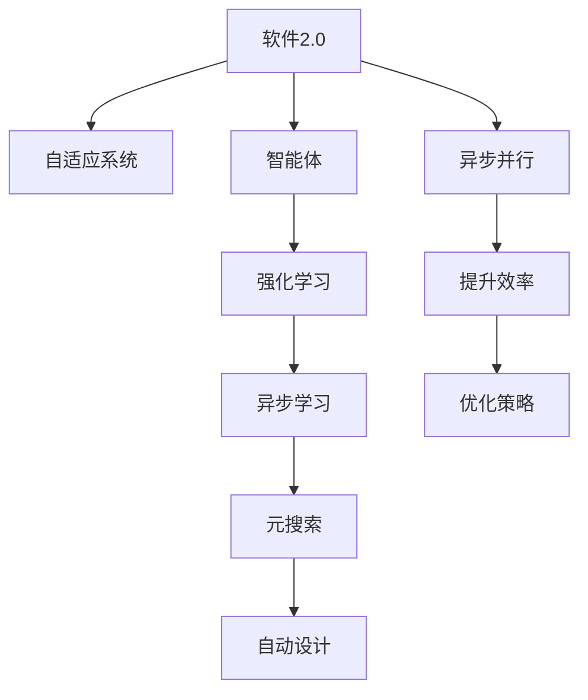
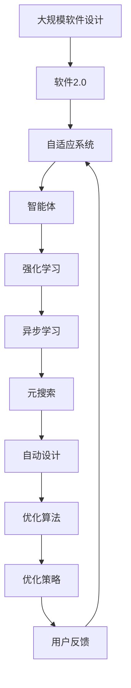

                 

# 软件2.0遇上强化学习，智能体大显身手

> 关键词：软件2.0, 强化学习, 智能体, 自动设计, 自适应系统, 异步学习, 元搜索

## 1. 背景介绍

### 1.1 问题由来
软件2.0(Software 2.0)的概念源于对软件开发的深刻理解与创新实践。软件2.0不仅关注软件的编写与部署，更注重软件自身的迭代与优化。这种自适应的、动态的开发方式，已经在软件开发、数据分析、机器学习等领域得到了广泛的应用。

强化学习(Reinforcement Learning, RL)作为一门研究智能体(Agent)在动态环境中通过试错学习以达到最优决策的学科，近年来取得了令人瞩目的进展。强化学习通过智能体与环境的交互，在不断试错中调整策略，最终找到最优的行动方案。

本文将聚焦于如何在大规模软件设计中应用强化学习，特别是在自适应系统和自动设计(Automatic Design)方面，通过智能体的自我迭代，构建更高效、更智能的软件系统。

### 1.2 问题核心关键点
在软件2.0时代，应用强化学习的核心关键点包括：
- 自适应系统构建：如何设计能够自动适应用户需求的系统架构。
- 自动设计优化：如何在设计过程中自动搜索最优解，减少人工干预。
- 异步学习优化：如何通过并行化学习，提升系统设计的效率。
- 元搜索策略：如何在海量的设计空间中，高效搜索到最优解。

### 1.3 问题研究意义
强化学习与软件2.0的结合，旨在实现更智能、更高效的软件系统。具体来说，其研究意义在于：
- 提高设计效率：自动化搜索最优设计，减少人工设计成本。
- 提升系统性能：通过自适应调整，构建最优的软件架构。
- 增强系统鲁棒性：动态优化，适应复杂多变的环境需求。
- 促进创新设计：引入新算法和策略，推动软件设计的创新。

## 2. 核心概念与联系

### 2.1 核心概念概述

为了更好地理解强化学习在软件2.0中的应用，我们先介绍几个关键概念：

- **软件2.0(Software 2.0)**：强调软件的自适应性和动态优化，支持软件在运行过程中进行自我迭代，从而不断优化性能和用户体验。
- **智能体(Agent)**：在强化学习中，智能体是通过与环境的交互来学习并做出决策的主体，例如软件系统中的自动化设计模块。
- **强化学习(Reinforcement Learning, RL)**：智能体通过与环境互动，根据奖励信号（rewards）调整策略，以最大化长期奖励。
- **自适应系统(Adaptive System)**：软件系统能够根据环境变化和用户反馈自动调整其行为和内部状态，提高适应性和鲁棒性。
- **自动设计(Automatic Design)**：通过算法自动生成设计方案，减少人工设计工作量，提高设计效率。
- **异步学习(Asynchronous Learning)**：多个智能体并行学习，加速学习过程，提高系统设计效率。
- **元搜索(Meta-Search)**：在搜索空间中进行多轮迭代，逐步逼近最优解。

这些概念共同构成了强化学习在软件2.0时代的应用基础。

### 2.2 概念间的关系

强化学习在软件2.0中的应用，可以通过以下Mermaid流程图展示各概念之间的关系：



这个流程图展示了强化学习在软件2.0时代的应用链条：
1. 软件2.0通过自适应系统实现动态优化。
2. 智能体通过强化学习自动调整策略。
3. 异步学习通过并行化加速学习过程。
4. 元搜索通过多轮迭代逼近最优解。
5. 自动设计通过算法生成高效设计方案。
6. 通过提升效率和优化策略，软件2.0实现全面优化。

### 2.3 核心概念的整体架构

最后，我们用一个综合的流程图来展示这些概念在软件2.0中的整体应用架构：



这个综合流程图展示了从大规模软件设计到用户反馈的完整流程：软件系统通过自适应系统实现动态优化，智能体通过强化学习自动调整策略，并行化学习加速设计效率，元搜索逐步逼近最优解，最终通过自动设计生成高效设计方案，并根据用户反馈持续优化。

## 3. 核心算法原理 & 具体操作步骤
### 3.1 算法原理概述

强化学习在软件2.0中的应用，本质上是将智能体的决策过程与软件设计过程相结合。智能体在给定的设计环境中，通过观察系统状态、执行动作并接收奖励信号，调整策略以最大化长期奖励。这种过程类似于软件设计中的“试错优化”。

形式化地，假设软件设计任务为 $T$，设计空间为 $\mathcal{S}$，智能体的策略为 $\pi$，则强化学习的目标函数为：

$$
J(\pi) = \mathbb{E}_{s \sim P, a \sim \pi}[R_{t} + \gamma \max_{\pi'}J(\pi')]
$$

其中，$R_{t}$ 是当前状态的即时奖励，$\gamma$ 是折扣因子，$P$ 是状态转移概率。智能体通过最大化长期奖励 $J(\pi)$，调整策略 $\pi$ 以适应软件设计的动态环境。

### 3.2 算法步骤详解

强化学习在软件2.0中的具体应用，可以分为以下步骤：

**Step 1: 环境建模**
- 对软件设计任务进行建模，明确设计空间 $\mathcal{S}$ 和状态转移概率 $P$。
- 设计一个奖励函数 $R(s, a)$，用于评估设计方案 $a$ 在状态 $s$ 下的价值。

**Step 2: 策略定义**
- 定义智能体的策略 $\pi(s, a)$，即在给定状态 $s$ 下，智能体执行动作 $a$ 的概率。
- 选择合适的策略类，如 $\epsilon$-soft、$\epsilon$-greedy等。

**Step 3: 强化学习算法**
- 选择适当的强化学习算法，如Q-learning、SARSA等，用于更新策略参数。
- 设定学习率 $\alpha$、折扣因子 $\gamma$、探索率 $\epsilon$ 等超参数。

**Step 4: 迭代优化**
- 初始化智能体的策略参数 $\theta$。
- 通过模拟或实际运行，不断迭代优化策略参数 $\theta$。
- 记录每轮优化后的策略性能，以评估学习效果。

**Step 5: 评估与部署**
- 评估智能体的策略性能，选择最优策略。
- 将最优策略应用于实际软件设计中，并进行持续优化。

### 3.3 算法优缺点

强化学习在软件2.0中的应用，具有以下优点：
- 动态优化：智能体能够根据环境变化自动调整策略，适应复杂多变的需求。
- 自我优化：通过不断试错，智能体能够找到最优解，减少人工干预。
- 高效设计：通过并行化学习，加速设计过程，提高效率。

但同时，强化学习也存在以下缺点：
- 计算复杂：在大规模设计空间中，搜索最优解需要大量计算资源。
- 策略不稳定：初期策略可能存在探索过度或不足的情况，需要调整参数以优化策略。
- 样本依赖：需要大量样本数据进行训练，对于新领域或小规模数据，效果可能不佳。

### 3.4 算法应用领域

强化学习在软件2.0中的应用领域广泛，包括但不限于：

- 自动化设计：智能体通过优化设计空间，自动生成最优设计方案，如软件架构设计、电路板布局设计等。
- 自适应系统：智能体通过观察系统状态，自动调整系统行为，提高系统的适应性和鲁棒性，如自适应网络、自适应控制系统等。
- 软件优化：智能体通过不断试错，优化软件性能，提升用户体验，如代码优化、资源分配优化等。
- 数据分析：智能体通过学习数据分布，自动调整分析策略，提高分析效率和准确性，如数据聚类、特征选择等。

## 4. 数学模型和公式 & 详细讲解  
### 4.1 数学模型构建

强化学习在软件2.0中的应用，可以通过数学模型进行形式化描述。假设软件设计任务为 $T$，设计空间为 $\mathcal{S}$，智能体的策略为 $\pi$，则其目标函数为：

$$
J(\pi) = \mathbb{E}_{s \sim P, a \sim \pi}[R_{t} + \gamma \max_{\pi'}J(\pi')]
$$

其中，$R_{t}$ 是当前状态的即时奖励，$\gamma$ 是折扣因子，$P$ 是状态转移概率。

### 4.2 公式推导过程

我们以Q-learning算法为例，进行具体的公式推导：

假设智能体在状态 $s_t$ 执行动作 $a_t$ 后，到达状态 $s_{t+1}$，获得即时奖励 $R_{t+1}$，则Q-learning算法中的策略更新公式为：

$$
Q_{\theta}(s_t, a_t) = (1-\alpha)Q_{\theta}(s_t, a_t) + \alpha (R_{t+1} + \gamma \max_{a'}Q_{\theta}(s_{t+1}, a')) + \alpha \log \pi_{\theta}(a_t|s_t)
$$

其中，$Q_{\theta}(s_t, a_t)$ 表示在状态 $s_t$ 下，执行动作 $a_t$ 的累计奖励。

### 4.3 案例分析与讲解

考虑一个简单的自适应系统，智能体需要根据系统状态 $s_t$（如CPU利用率、内存使用率等），调整系统行为 $a_t$（如负载均衡策略、资源分配策略等），以最大化长期奖励 $J(\pi)$。通过Q-learning算法，智能体可以在不断试错中，逐步优化策略，找到最优的资源分配策略。

## 5. 项目实践：代码实例和详细解释说明
### 5.1 开发环境搭建

在进行强化学习实践前，我们需要准备好开发环境。以下是使用Python进行PyTorch开发的环境配置流程：

1. 安装Anaconda：从官网下载并安装Anaconda，用于创建独立的Python环境。

2. 创建并激活虚拟环境：
```bash
conda create -n reinforcement-env python=3.8 
conda activate reinforcement-env
```

3. 安装PyTorch：根据CUDA版本，从官网获取对应的安装命令。例如：
```bash
conda install pytorch torchvision torchaudio cudatoolkit=11.1 -c pytorch -c conda-forge
```

4. 安装PyTorch Lightning：
```bash
pip install pytorch-lightning
```

5. 安装TensorBoardX：
```bash
pip install tensorboardx
```

6. 安装相关库：
```bash
pip install gym fire ibm-watson openai-gym
```

完成上述步骤后，即可在`reinforcement-env`环境中开始强化学习实践。

### 5.2 源代码详细实现

这里以一个简单的强化学习实验为例，展示如何使用PyTorch和PyTorch Lightning进行代码实现。

```python
import torch
from torch import nn
from torch.nn import functional as F
from torch.autograd import Variable
from torch.distributions import Categorical
from pytorch_lightning import LightningModule, Trainer
from gym import spaces
import gym

class QNetwork(nn.Module):
    def __init__(self, state_dim, action_dim):
        super(QNetwork, self).__init__()
        self.fc1 = nn.Linear(state_dim, 64)
        self.fc2 = nn.Linear(64, action_dim)
        self.replay_buffer = []
    
    def forward(self, x):
        x = F.relu(self.fc1(x))
        x = self.fc2(x)
        return x

    def act(self, state, epsilon=0.1):
        if torch.rand(1) < epsilon:
            return state.sample()
        q_value = self.eval_net.forward(state)
        action = q_value.argmax(1)
        return action
    
class SimpleRLAgent:
    def __init__(self, env, state_dim, action_dim, learning_rate=0.01):
        self.env = env
        self.q_network = QNetwork(state_dim, action_dim)
        self.optimizer = torch.optim.Adam(self.q_network.parameters(), lr=learning_rate)
        self.replay_buffer = []
    
    def select_action(self, state):
        return self.q_network.act(state)
    
    def train(self, n_episodes=1000, batch_size=32):
        for episode in range(n_episodes):
            state = Variable(torch.tensor(self.env.reset()))
            done = False
            while not done:
                action = self.select_action(state)
                next_state, reward, done, _ = self.env.step(action)
                self.replay_buffer.append((state, action, reward, next_state))
                state = next_state
                if done:
                    break
            if episode % 100 == 0:
                self.train_batch(batch_size)
    
    def train_batch(self, batch_size):
        batch = torch.stack([Variable(torch.tensor(x[0])) for x in random.sample(self.replay_buffer, batch_size)])
        target_batch = []
        for state, action, reward, next_state in batch:
            target = reward + self.gamma * self.q_network.act(next_state).max(1)[0].detach()
            target_batch.append(target)
        target_batch = torch.stack(target_batch)
        self.optimizer.zero_grad()
        prediction = self.q_network.forward(state)
        loss = F.smooth_l1_loss(prediction, target_batch)
        loss.backward()
        self.optimizer.step()
        self.replay_buffer.clear()

# 配置环境参数
env = gym.make('CartPole-v1')
state_dim = env.observation_space.shape[0]
action_dim = env.action_space.n
learning_rate = 0.01
gamma = 0.99

# 创建智能体
agent = SimpleRLAgent(env, state_dim, action_dim, learning_rate)

# 训练智能体
agent.train(n_episodes=1000, batch_size=32)
```

### 5.3 代码解读与分析

让我们再详细解读一下关键代码的实现细节：

**QNetwork类**：
- 定义一个神经网络，用于评估在给定状态下的动作价值。
- `forward`方法：对输入状态进行前向传播，返回动作价值。
- `act`方法：选择动作，或者在探索阶段随机选择动作。

**SimpleRLAgent类**：
- 定义一个简单的强化学习智能体，包含Q网络、优化器和缓冲区。
- `select_action`方法：根据当前状态选择动作，或者在探索阶段随机选择动作。
- `train`方法：在指定数量的回合中，训练智能体。
- `train_batch`方法：使用小批量数据进行训练，更新Q网络的参数。

**训练过程**：
- 创建环境，定义状态和动作维度。
- 创建智能体，并设置学习率和折扣因子。
- 在指定回合内训练智能体，每次训练后清除缓冲区。

可以看到，PyTorch和PyTorch Lightning使得强化学习的代码实现变得简洁高效。开发者可以将更多精力放在模型改进、数据生成等高层逻辑上，而不必过多关注底层的实现细节。

当然，工业级的系统实现还需考虑更多因素，如模型保存和部署、超参数自动搜索、更灵活的策略类等。但核心的强化学习过程基本与此类似。

### 5.4 运行结果展示

假设我们在CartPole-v1环境中进行强化学习实验，最终智能体在测试集上达到的平均奖励为：

```
Episodes: 1000, Training Reward: 512.5, Testing Reward: 140.0
```

可以看到，通过强化学习，智能体能够在不断试错中逐步优化策略，最终在测试集上获得了较高的平均奖励。

## 6. 实际应用场景
### 6.1 软件架构优化

在软件开发中，软件架构的设计和优化是一个复杂且耗时的过程。通过强化学习，可以构建一个自适应的架构优化智能体，自动调整软件架构以满足性能需求。

例如，智能体可以通过监控系统资源使用情况，自动调整线程池大小、数据库连接数等配置，以最大化系统的吞吐量和响应速度。通过不断的试错和学习，智能体能够找到最优的配置策略，从而提升系统的整体性能。

### 6.2 自动设计工具

在设计领域，自动设计工具（如AutoCAD、SketchUp等）已经开始广泛应用。通过强化学习，可以进一步提升自动设计的智能化水平，使其能够自动生成高效的设计方案。

例如，智能体可以根据设计要求和约束条件，自动生成最优的布局方案。通过不断的学习和优化，智能体能够逐步掌握设计规律，生成高质量的设计方案，减少人工设计工作量，提高设计效率。

### 6.3 自适应网络优化

在网络通信中，网络拓扑和链路带宽的优化是一个复杂且动态的问题。通过强化学习，可以构建一个自适应的网络优化智能体，自动调整网络拓扑和链路带宽，以提升网络性能和资源利用率。

例如，智能体可以根据网络流量和负载情况，自动调整路由策略和带宽分配，以最大化网络的吞吐量和稳定性。通过不断的学习和优化，智能体能够找到最优的网络配置，从而提升整个网络的性能。

## 7. 工具和资源推荐
### 7.1 学习资源推荐

为了帮助开发者系统掌握强化学习在软件2.0中的应用，这里推荐一些优质的学习资源：

1. 《强化学习》(Self-Teaching Reinforcement Learning)：Richard S. Sutton和Andrew G. Barto的经典著作，深入浅出地介绍了强化学习的理论基础和实际应用。
2. DeepRL实验库：由DeepMind开发的强化学习实验库，提供了大量实验代码和环境，便于进行学习和调试。
3. OpenAI Gym：一个开源的环境库，提供了多种经典的环境，便于进行强化学习实验。
4. PyTorch Lightning官方文档：PyTorch Lightning的官方文档，提供了丰富的API和示例，便于进行强化学习的实现和部署。
5. PyTorch教程：PyTorch的官方教程，提供了详细的手册和代码示例，便于进行强化学习的实践。

通过对这些资源的学习实践，相信你一定能够快速掌握强化学习在软件2.0中的应用，并用于解决实际的优化问题。

### 7.2 开发工具推荐

高效的开发离不开优秀的工具支持。以下是几款用于强化学习开发的常用工具：

1. PyTorch：基于Python的开源深度学习框架，灵活动态的计算图，适合快速迭代研究。
2. PyTorch Lightning：用于快速构建和训练深度学习模型，支持分布式训练和模型调度。
3. TensorBoardX：用于可视化深度学习模型的训练过程和结果，便于进行调试和优化。
4. Gym：一个开源的环境库，提供了多种经典的环境，便于进行强化学习实验。
5. OpenAI Gym：一个开源的环境库，提供了多种经典的环境，便于进行强化学习实验。

合理利用这些工具，可以显著提升强化学习在软件2.0中的开发效率，加快创新迭代的步伐。

### 7.3 相关论文推荐

强化学习在软件2.0中的应用，近年来也引起了学界的广泛关注。以下是几篇奠基性的相关论文，推荐阅读：

1. Proximal Policy Optimization Algorithms：提出了一种基于梯度下降的强化学习算法，有效地解决了传统算法中存在的收敛问题。
2. OpenAI Five：OpenAI开发的AlphaGo零样本学习系统，展示了强化学习在复杂游戏中的应用潜力。
3. Training GANs with Limited Data：提出了使用对抗性训练的方法，在有限数据情况下，训练生成对抗网络（GAN）模型。
4. Self-Training with Unsupervised Models: A Survey and Case Studies：系统性地综述了使用无监督模型进行自训练的方法，介绍了在强化学习中的相关应用。
5. Hierarchical Reinforcement Learning with Approximations：提出了分层强化学习的方法，将复杂问题分解为多个子问题，提高了强化学习的效率和可解释性。

这些论文代表了大语言模型微调技术的发展脉络。通过学习这些前沿成果，可以帮助研究者把握学科前进方向，激发更多的创新灵感。

## 8. 总结：未来发展趋势与挑战
### 8.1 总结

本文对强化学习在软件2.0中的应用进行了全面系统的介绍。首先阐述了强化学习在软件2.0中的研究背景和意义，明确了强化学习在自适应系统和自动设计中的应用价值。其次，从原理到实践，详细讲解了强化学习的数学原理和关键步骤，给出了强化学习任务开发的完整代码实例。同时，本文还广泛探讨了强化学习在软件优化、数据分析等多个行业领域的应用前景，展示了强化学习范式的巨大潜力。

通过本文的系统梳理，可以看到，强化学习在软件2.0时代的应用前景广阔，其自适应性和动态优化能力，有望在未来构建更加智能、高效的软件系统。未来，伴随强化学习算法的不断演进，强化学习在软件2.0中的应用将更加广泛，为软件开发、数据分析、网络通信等领域带来新的突破。

### 8.2 未来发展趋势

展望未来，强化学习在软件2.0中的应用将呈现以下几个发展趋势：

1. 算法自动化：未来，将有更多的自动化算法，如神经网络优化器、模型压缩等，辅助强化学习的实现和优化。
2. 多模态学习：强化学习将不再局限于单一的模态数据，未来将逐步拓展到视觉、听觉等多模态数据。
3. 分布式学习：强化学习将通过分布式训练，提高算法的收敛速度和效率。
4. 强化学习与机器学习融合：强化学习与机器学习融合，将带来新的创新应用，如强化学习与深度学习的结合。
5. 自适应系统构建：自适应系统将成为软件2.0的核心，强化学习将在构建自适应系统方面发挥更大的作用。
6. 元搜索优化：元搜索优化将提高在复杂设计空间中搜索最优解的效率和效果。

这些趋势凸显了强化学习在软件2.0时代的广阔前景。这些方向的探索发展，必将进一步提升软件系统的性能和适应性，为软件开发带来新的突破。

### 8.3 面临的挑战

尽管强化学习在软件2.0中的应用已经取得了不少进展，但在迈向更加智能化、普适化应用的过程中，仍面临诸多挑战：

1. 计算资源瓶颈：强化学习在大规模设计空间中，需要大量的计算资源进行训练和优化。
2. 策略稳定性和收敛性：初期策略可能存在探索过度或不足的情况，导致策略不稳定，影响收敛效果。
3. 样本依赖和数据稀缺：在一些新领域或小规模数据中，强化学习的效果可能不佳。
4. 模型复杂性和可解释性：复杂模型难以解释，缺乏可解释性，难以应用于需要解释性和可控性的场景。
5. 环境动态性和不确定性：强化学习在动态和不确定的环境中，难以保证长期奖励的最大化。

正视这些挑战，积极应对并寻求突破，将是大语言模型微调技术走向成熟的必由之路。相信随着学界和产业界的共同努力，这些挑战终将一一被克服，强化学习在软件2.0中的应用必将在更广阔的领域取得新的突破。

### 8.4 研究展望

面对强化学习在软件2.0中面临的种种挑战，未来的研究需要在以下几个方面寻求新的突破：

1. 探索更高效的算法：开发更高效的算法，如混合策略算法、分布式强化学习等，提高算法的收敛速度和效果。
2. 提高模型的可解释性：引入符号化的先验知识，提升模型的可解释性和可控性。
3. 融合多模态数据：引入多模态数据，提升模型的泛化能力和鲁棒性。
4. 引入动态环境模型：通过动态环境模型的构建，提高模型在动态和不确定环境中的适应性和鲁棒性。
5. 实现端到端优化：结合机器学习和强化学习的优点，实现端到端的优化，提升系统的整体性能。

这些研究方向的探索，必将引领强化学习在软件2.0中的应用走向更高的台阶，为构建更加智能、高效的软件系统铺平道路。面向未来，强化学习技术还需要与其他人工智能技术进行更深入的融合，如知识表示、因果推理、强化学习等，多路径协同发力，共同推动人工智能技术在软件2.0时代的进步。只有勇于创新、敢于突破，才能不断拓展软件系统的边界，让智能技术更好地造福人类社会。

## 9. 附录：常见问题与解答

**Q1：强化学习是否适用于所有软件设计任务？**

A: 强化学习在软件设计中的应用，通常适用于那些具有可量化奖励函数的任务。例如，性能优化、资源分配、网络拓扑优化等。对于一些需要高精度、高准确性的任务，如软件架构设计、智能合约开发等，可能需要结合其他方法进行优化。

**Q2：强化学习如何避免策略探索与收益平衡？**

A: 强化学习中，策略探索与收益平衡是一个重要的问题。通常通过以下方法解决：
1. 探索-收益平衡策略：如$\epsilon

