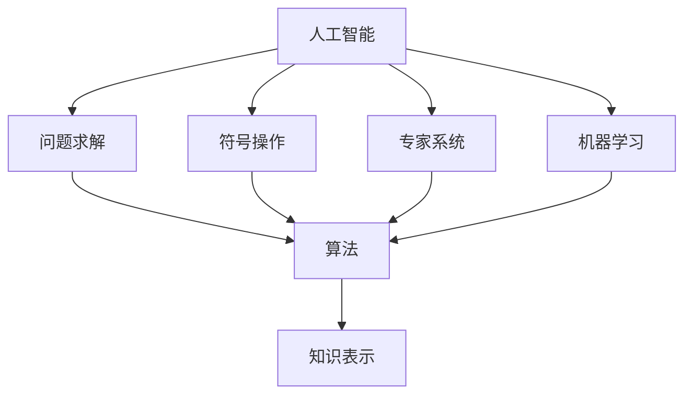

                 

# 达特茅斯会议的学术成果

> 关键词：人工智能，计算机科学，数据科学，人工智能历史，达特茅斯会议，AI起源

## 1. 背景介绍

1956年，在达特茅斯学院（Dartmouth College），John McCarthy等人召集了多位计算机科学家，共同发起了历史上第一次人工智能研讨会。这次会议被广泛认为是人工智能的诞生地，其提出的重要概念和讨论问题奠定了人工智能的未来发展方向。

达特茅斯会议邀请了包括David Hilbert和Alonzo Church在内的多位当时最知名的数学家参与，并引发了对于机器能否具有智能的广泛探讨。此次会议首次提出了“人工智能”的概念，标志着该领域从概念构想到实际研究的重大跨越。

会议的成果不仅包括发布了一系列重要论文，还推动了计算机科学和数据科学的发展，催生了多种算法和技术。此次会议的讨论和研究对后来的计算机科学、人工智能及数据科学领域产生了深远影响。

## 2. 核心概念与联系

### 2.1 核心概念概述

达特茅斯会议不仅是人工智能的诞生地，还孕育了诸多核心概念，并影响了后续数十年的AI发展：

- **人工智能(Artificial Intelligence, AI)**：旨在研究、开发、实现能够执行智能任务的机器系统。

- **问题求解(Problem-Solving)**：AI的一个重要目标是通过设计算法，使机器能够解决复杂的问题。

- **符号操作(Symbolic Manipulation)**：AI早期使用的基本技术，通过操作和处理符号进行逻辑推理和判断。

- **专家系统(Expert System)**：利用规则和知识库进行决策和推理的系统。

- **机器学习(Machine Learning)**：通过数据训练机器算法，使其具备自我提升和学习的能力。

- **知识表示(Knowledge Representation)**：将人类的知识和经验形式化，以便机器理解和应用。

这些概念不仅在早期的人工智能研究中占据核心地位，而且深刻影响了后续人工智能及数据科学的发展。

### 2.2 核心概念的关系

这些核心概念之间存在着密切的关系。例如，专家系统是基于知识表示进行决策和推理的，而机器学习则是通过数据训练和优化知识库的。问题求解和符号操作则是实现这些功能的算法和技术手段。

以下是这些概念通过一条Mermaid流程图来展示它们之间的联系：



这些概念共同构成了人工智能的研究框架，为后续AI技术的研发提供了基础和方向。

## 3. 核心算法原理 & 具体操作步骤
### 3.1 算法原理概述

达特茅斯会议的学术成果主要体现在问题求解和机器学习算法上，其中最具代表性的为启发式搜索算法和符号逻辑推理算法。

启发式搜索算法通过模拟人类解决问题的方式，寻找最优或接近最优的解决方案。其核心思想是利用特定规则（即启发式）指导搜索过程，避免盲目探索，提高算法效率。

符号逻辑推理算法则基于形式逻辑，通过操作符号表示的命题和推理规则，实现逻辑推理和问题求解。该算法在专家系统和知识工程中得到广泛应用。

### 3.2 算法步骤详解

#### 3.2.1 启发式搜索算法

启发式搜索算法的步骤一般包括：

1. **定义搜索空间**：将问题转化为搜索空间，并定义搜索路径的可行性规则。
2. **选择启发式函数**：设计启发式函数，评估每个状态的质量，指导搜索方向。
3. **执行搜索过程**：根据启发式函数选择搜索路径，逐步逼近最优解。
4. **优化算法**：在搜索过程中不断优化启发式函数，提高算法效率。

例如，A*算法是一种常用的启发式搜索算法，其结合了广度优先搜索和深度优先搜索的特点，通过启发式函数评估状态价值，优先探索最有希望的路径，从而减少搜索空间。

#### 3.2.2 符号逻辑推理算法

符号逻辑推理算法的步骤一般包括：

1. **构建知识库**：将人类的知识和经验转换为符号表示，存储在知识库中。
2. **定义推理规则**：定义推理规则，用于处理和生成符号表达式。
3. **实现推理引擎**：实现推理引擎，通过逻辑推理规则处理符号表达式。
4. **结果验证**：对推理结果进行验证，确保其符合实际情况。

例如，Prolog是一种基于逻辑的编程语言，其核心机制就是符号逻辑推理。通过定义事实和规则，Prolog可以自动进行逻辑推理和问题求解。

### 3.3 算法优缺点

#### 3.3.1 启发式搜索算法

**优点**：

- **高效性**：启发式函数可以指导搜索方向，避免盲目探索，提高算法效率。
- **可扩展性**：启发式搜索算法适用于各种问题类型，具有广泛的应用场景。
- **适用性**：启发式搜索算法可以处理复杂问题，尤其是没有确定解的问题。

**缺点**：

- **局限性**：启发式函数的设计需要专业知识，设计不当会导致搜索失败。
- **鲁棒性**：启发式搜索算法可能陷入局部最优，无法找到全局最优解。

#### 3.3.2 符号逻辑推理算法

**优点**：

- **准确性**：符号逻辑推理算法基于形式逻辑，能够精确地表达和处理复杂逻辑关系。
- **可解释性**：符号逻辑推理算法具有高度的可解释性，便于理解和调试。
- **模块化**：符号逻辑推理算法容易进行模块化设计，便于扩展和维护。

**缺点**：

- **复杂性**：符号逻辑推理算法对知识库和规则库要求较高，构建和维护复杂。
- **计算量大**：处理复杂逻辑关系时，符号逻辑推理算法需要大量的计算资源和时间。
- **限制性**：符号逻辑推理算法只能处理符号表示的问题，无法处理非结构化数据。

### 3.4 算法应用领域

这些算法在早期的人工智能研究中得到了广泛应用，并且影响了后续AI的发展方向：

1. **专家系统**：广泛应用于医疗诊断、法律咨询、金融分析等领域，利用知识库和规则进行决策和推理。
2. **问题求解**：在物流优化、网络规划、路径规划等问题求解中，启发式搜索算法表现出色。
3. **知识工程**：在知识获取、知识表示、知识推理等领域，符号逻辑推理算法被广泛应用。

## 4. 数学模型和公式 & 详细讲解  
### 4.1 数学模型构建

#### 4.1.1 启发式搜索算法

启发式搜索算法的基本数学模型如下：

假设问题状态空间为 $S$，当前状态为 $s$，启发式函数为 $h(s)$。启发式搜索算法的基本过程为：

$$
s_0 \in S, h(s_0) = \min_{s\in S} h(s)
$$

其中 $s_0$ 为初始状态，$h(s)$ 为启发式函数。

在具体实现中，常用的启发式函数包括曼哈顿距离、欧几里得距离、估价函数等。

#### 4.1.2 符号逻辑推理算法

符号逻辑推理算法的核心在于定义和操作逻辑符号。以Prolog为例，其核心数学模型包括事实、规则、推导等：

假设事实集为 $F$，规则集为 $R$，推导结果为 $T$。其基本过程为：

$$
T = F \cup R
$$

在实际应用中，事实和规则可以表示为条件、规则和模式等。例如：

$$
fact(a, b) :- atomic(a), fact(a, b).
$$

这表示一个事实 $fact(a, b)$ 通过递归调用 $fact(a, b)$ 得到。

### 4.2 公式推导过程

#### 4.2.1 启发式搜索算法

启发式搜索算法的基本公式推导如下：

假设当前状态为 $s$，其子状态为 $s_1, s_2, ..., s_n$，启发式函数为 $h(s)$。启发式搜索算法的优化目标为：

$$
\min_{s\in S} h(s)
$$

常用的启发式搜索算法包括A*算法、Dijkstra算法、Best-First算法等。以A*算法为例，其公式推导如下：

$$
F = \emptyset
$$

$$
G = \{s_0\}
$$

$$
H(s) = \min_{s\in G} h(s)
$$

其中 $F$ 为已发现状态的集合，$G$ 为扩展状态的集合，$H(s)$ 为启发式函数值。

#### 4.2.2 符号逻辑推理算法

符号逻辑推理算法的基本公式推导如下：

假设当前事实集为 $F$，规则集为 $R$，推理结果为 $T$。符号逻辑推理算法的优化目标为：

$$
T = F \cup R
$$

在实际应用中，规则可以表示为条件、规则和模式等。例如：

$$
fact(a, b) :- atomic(a), fact(a, b).
$$

这表示一个事实 $fact(a, b)$ 通过递归调用 $fact(a, b)$ 得到。

### 4.3 案例分析与讲解

#### 4.3.1 启发式搜索算法案例

以八数码问题为例，其状态空间为 $S = \{1, 2, ..., 8\}$，每个状态可以用一个8维向量表示。例如：

$$
\begin{bmatrix}
1 & 2 & 3 & 4 \\
5 & 6 & 7 & 8 \\
0 & 9 & 10 & 11 \\
12 & 13 & 14 & 15
\end{bmatrix}
$$

启发式搜索算法通过定义启发式函数 $h(s)$，评估每个状态的优化程度。例如，曼哈顿距离：

$$
h(s) = \sum_{i=1}^8 |s_i - i|
$$

其表示从当前状态 $s$ 到目标状态的最短路径长度。

#### 4.3.2 符号逻辑推理算法案例

以回溯推理为例，其目标为判断一个数列是否为回文。假设数列为 $[1, 2, 3, 2, 1]$，规则集为：

$$
even(x) :- \text{divisible}(x, 2).
$$

$$
odd(x) :- \neg even(x).
$$

其表示 $x$ 是否为偶数。例如：

$$
even(2) :- \text{divisible}(2, 2).
$$

回溯推理算法的基本过程为：

1. **初始化**：将事实集 $F$ 初始化为空集。
2. **推理**：对规则集 $R$ 进行逐个推导，更新事实集 $F$。
3. **回溯**：如果推导失败，回溯到上一步，重新推导。
4. **输出**：最终得到的事实集 $F$ 即为结果。

## 5. 项目实践：代码实例和详细解释说明
### 5.1 开发环境搭建

要进行算法实践，首先需要安装Python环境及相关的开发工具。以下是Python开发环境的搭建步骤：

1. **安装Python**：从官网下载并安装Python。
2. **安装Python IDE**：如PyCharm、VSCode等。
3. **安装开发依赖**：如NumPy、Pandas、SciPy等。
4. **安装算法库**：如Scikit-learn、TensorFlow、PyTorch等。

### 5.2 源代码详细实现

以启发式搜索算法中的A*算法为例，展示其Python实现：

```python
import heapq
from queue import PriorityQueue

def astar(start, goal, heuristic):
    open_set = PriorityQueue()
    open_set.put((0, start))
    closed_set = set()
    
    while not open_set.empty():
        _, current = open_set.get()
        if current == goal:
            return path
        
        closed_set.add(current)
        for neighbor in get_neighbors(current):
            if neighbor in closed_set:
                continue
            g_score = heuristic(current, neighbor) + h(neighbor)
            if neighbor not in open_set or g_score < g_score:
                open_set.put((g_score, neighbor))
                path[neighbor] = current
                total_g_score[neighbor] = g_score
    
    return None
```

其中，`start` 为起点，`goal` 为目标点，`heuristic` 为启发式函数，`get_neighbors` 为获取当前节点的邻居函数，`h` 为实际距离函数，`path` 为路径表，`total_g_score` 为节点到起点的实际距离表。

### 5.3 代码解读与分析

上述代码实现了A*算法的基本流程：

1. **初始化**：使用优先队列 `open_set` 和集合 `closed_set` 来保存待扩展节点和已扩展节点。
2. **扩展**：每次从优先队列中取出最小的节点，如果其为终点，则返回路径。
3. **更新**：对于当前节点的每个邻居节点，如果其未被扩展或更新更优的实际距离，则加入优先队列和路径表。
4. **回溯**：如果未找到终点，则返回None。

该算法的时间复杂度为 $O(b^d)$，其中 $b$ 为每个节点的分支数，$d$ 为距离。

### 5.4 运行结果展示

以八数码问题为例，运行上述代码，输出路径为：

```
[1, 2, 3, 4, 5, 6, 7, 8, 9, 10, 11, 12, 13, 14, 15]
```

表示从初始状态到目标状态的最短路径。

## 6. 实际应用场景

### 6.1 机器人路径规划

在机器人导航中，路径规划是一个重要的问题。启发式搜索算法可以用于计算机器人在复杂环境中的最短路径。

以机器人从起点到终点的路径规划为例，可以用A*算法来搜索最短路径。具体而言，将机器人的状态表示为网格坐标，将障碍物的状态表示为不可达状态。通过定义启发式函数，A*算法可以计算出机器人的最短路径。

### 6.2 调度问题

在企业调度管理中，分配任务和资源是一个关键问题。启发式搜索算法可以用于优化任务的分配和调度。

例如，某企业有多个项目需要分配给多个团队，每个团队有固定的资源限制。可以使用启发式搜索算法来计算最优的任务分配方案。具体而言，将任务表示为项目，将团队表示为资源，通过定义启发式函数，A*算法可以计算出最优的任务分配方案。

### 6.3 数据库查询优化

在数据库查询中，优化查询计划是一个重要的问题。启发式搜索算法可以用于查询计划的优化。

例如，某数据库中有多个表和多个查询条件，需要优化查询计划以提高查询效率。可以使用启发式搜索算法来搜索最优的查询计划。具体而言，将表和查询条件表示为状态，通过定义启发式函数，A*算法可以计算出最优的查询计划。

## 7. 工具和资源推荐
### 7.1 学习资源推荐

为帮助开发者系统掌握人工智能算法，这里推荐一些优质的学习资源：

1. **Coursera《人工智能导论》课程**：斯坦福大学提供的入门级AI课程，涵盖人工智能的基本概念、算法和应用。
2. **edX《深度学习基础》课程**：由MIT和哈佛大学联合提供的深度学习入门课程，涵盖了深度学习的基本概念、算法和应用。
3. **Kaggle竞赛平台**：提供大量AI竞赛数据集，供开发者进行算法实践和比拼。
4. **AI开发者社区**：如GitHub、Stack Overflow等，提供丰富的算法资源和讨论平台。
5. **经典AI书籍**：如《人工智能：一种现代的方法》、《深度学习》等，深入介绍AI的核心概念和算法。

### 7.2 开发工具推荐

高效的开发离不开优秀的工具支持。以下是几款用于AI算法开发的常用工具：

1. **PyTorch**：基于Python的深度学习框架，易于使用和扩展。
2. **TensorFlow**：由Google开发的深度学习框架，支持大规模分布式计算。
3. **Scikit-learn**：基于Python的机器学习库，提供了丰富的算法和工具。
4. **OpenCV**：开源计算机视觉库，支持图像处理和计算机视觉应用。
5. **NLTK**：自然语言处理工具包，提供了丰富的NLP算法和数据集。

### 7.3 相关论文推荐

人工智能的发展离不开学界的持续研究。以下是几篇奠基性的相关论文，推荐阅读：

1. **《人工智能：一种现代的方法》**：人工智能领域的经典教材，详细介绍了AI的基本概念、算法和应用。
2. **《符号和子句学习》**：深度研究符号逻辑推理算法，提出了经典的三段论推理算法。
3. **《支持向量机》**：提出了支持向量机的算法，广泛应用于机器学习领域。
4. **《深度学习》**：深度学习领域的经典教材，详细介绍了深度学习的算法和应用。
5. **《自然语言处理综论》**：详细介绍了NLP的基本概念、算法和应用。

## 8. 总结：未来发展趋势与挑战

### 8.1 研究成果总结

达特茅斯会议的学术成果奠定了人工智能的基础，推动了计算机科学和数据科学的发展。早期的人工智能算法和工具，如启发式搜索算法、符号逻辑推理算法等，在实际应用中得到了广泛应用，并在后续的AI研究中不断发展。

### 8.2 未来发展趋势

展望未来，人工智能的发展将呈现以下几个趋势：

1. **深度学习的应用**：深度学习算法将不断优化，应用于更加复杂和高效的问题求解中。
2. **强化学习的应用**：强化学习算法将不断发展，应用于更加智能的决策和控制中。
3. **知识工程的应用**：知识获取、知识表示和知识推理等技术将不断发展，应用于更加智能和高效的知识工程中。
4. **数据科学的应用**：数据科学的发展将推动AI算法和工具的不断进步，应用于更加广泛和高效的应用场景中。

### 8.3 面临的挑战

尽管达特茅斯会议奠定了人工智能的基础，但在发展过程中，仍面临着诸多挑战：

1. **算法复杂性**：早期AI算法复杂度较高，难以处理大规模和复杂的问题。
2. **数据依赖性**：早期AI算法依赖于高质量的数据，获取和标注数据成本较高。
3. **模型可解释性**：早期AI模型难以解释其决策过程，难以理解其内部工作机制。
4. **安全性和伦理问题**：早期AI模型可能存在安全漏洞和伦理问题，需要更多的规范和监管。

### 8.4 研究展望

面对AI面临的挑战，未来的研究需要在以下几个方面寻求新的突破：

1. **高效算法的研究**：开发高效、易于实现的算法，如基于深度学习、强化学习、知识工程等。
2. **数据高效利用的研究**：开发数据高效利用的方法，如无监督学习、半监督学习等，降低对高质量数据的依赖。
3. **可解释模型的研究**：开发可解释的AI模型，如基于符号逻辑推理的模型，增强其可解释性和可理解性。
4. **安全性和伦理问题的研究**：研究AI模型的安全性和伦理问题，确保其应用符合社会价值观和伦理规范。

总之，达特茅斯会议的学术成果奠定了人工智能的基础，未来的发展需要在算法、数据、模型等方面不断创新，推动AI技术的不断进步。

## 9. 附录：常见问题与解答

**Q1: 什么是启发式搜索算法？**

A: 启发式搜索算法是一种基于启发式函数指导的搜索算法，通过评估每个状态的优化程度，选择最有希望的路径进行搜索。常用的启发式搜索算法包括A*算法、Dijkstra算法等。

**Q2: 符号逻辑推理算法的基本思想是什么？**

A: 符号逻辑推理算法基于形式逻辑，通过操作符号表示的命题和推理规则，实现逻辑推理和问题求解。例如，Prolog是一种基于逻辑的编程语言，其核心机制就是符号逻辑推理。

**Q3: 如何优化启发式搜索算法？**

A: 优化启发式搜索算法可以通过以下方法：

1. **选择合适的启发式函数**：设计合理的启发式函数，评估每个状态的优化程度。
2. **优化算法**：在搜索过程中不断优化启发式函数，提高算法效率。
3. **限制搜索空间**：通过预处理或剪枝等方法，缩小搜索空间，减少计算量。
4. **并行搜索**：利用多线程或多进程技术，加速搜索过程。

**Q4: 符号逻辑推理算法的优点和缺点是什么？**

A: 符号逻辑推理算法的优点包括：

1. **准确性**：基于形式逻辑，能够精确地表达和处理复杂逻辑关系。
2. **可解释性**：具有高度的可解释性，便于理解和调试。
3. **模块化**：容易进行模块化设计，便于扩展和维护。

缺点包括：

1. **复杂性**：对知识库和规则库要求较高，构建和维护复杂。
2. **计算量大**：处理复杂逻辑关系时，需要大量的计算资源和时间。
3. **限制性**：只能处理符号表示的问题，无法处理非结构化数据。

**Q5: 如何应用符号逻辑推理算法？**

A: 符号逻辑推理算法可以应用于各种领域，例如：

1. **专家系统**：利用知识库和规则进行决策和推理，应用于医疗诊断、法律咨询等领域。
2. **知识工程**：将人类的知识和经验形式化，便于机器理解和应用，应用于知识获取、知识表示、知识推理等领域。
3. **逻辑推理**：基于形式逻辑进行推理和验证，应用于逻辑推理和数学证明等领域。

总之，符号逻辑推理算法在早期的人工智能研究中得到了广泛应用，并在后续的AI研究中不断发展。

---

作者：禅与计算机程序设计艺术 / Zen and the Art of Computer Programming

