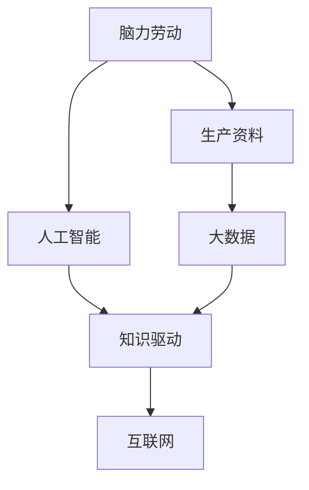
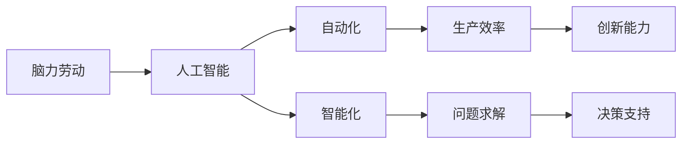
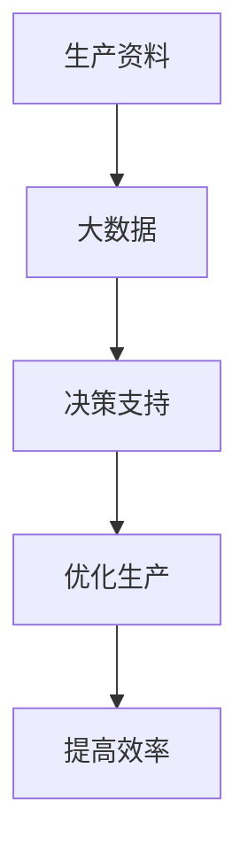
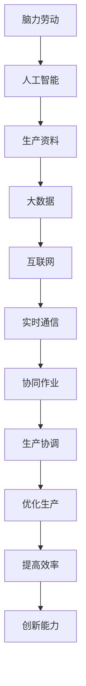

                 

## 1. 背景介绍

### 1.1 问题由来
在过去的几十年里，全球经济发展的驱动力主要依赖于体力劳动和生产资料的结合。这种发展模式在一定程度上推动了经济增长和社会进步，但也存在着诸多问题，如资源浪费、环境污染、社会不公等。

随着科技的不断进步，特别是计算机和互联网技术的广泛应用，人类社会正在进入一个新的发展阶段。在这个阶段，体力劳动的重要性逐渐减弱，而脑力劳动的作用则愈发凸显。脑力劳动和生产资料的结合，将成为未来经济发展的关键驱动力。

### 1.2 问题核心关键点
过去几十年的经济发展主要依赖体力加生产资料的模式，这种模式具有以下特点：

- **资源依赖**：经济增长主要依赖于原材料、能源等生产资料的消耗。
- **生产效率低**：体力劳动效率较低，对生产资料的利用率有限。
- **环境污染**：大量消耗自然资源，导致环境污染问题严重。
- **社会不公**：体力劳动和生产资料的结合，使得社会阶层固化，贫富差距扩大。

未来，随着科技的进步，脑力劳动和生产资料的结合将成为新的发展模式。这种模式具有以下特点：

- **知识驱动**：经济增长主要依赖于知识的积累和应用。
- **生产效率高**：脑力劳动效率高，对生产资料的利用率更高。
- **环境友好**：知识驱动的发展模式对环境的负面影响更小。
- **社会公平**：脑力劳动的普及将有助于缩小贫富差距，实现社会公平。

## 2. 核心概念与联系

### 2.1 核心概念概述

为更好地理解脑力加生产资料的结合，本节将介绍几个密切相关的核心概念：

- **脑力劳动**：指通过智力、创造力和知识技能的劳动。包括研发、设计、管理、教育等。
- **生产资料**：指生产过程中所必需的各种要素，包括原材料、设备、资金等。
- **知识驱动**：指经济增长主要依赖于知识的积累、应用和创新。
- **人工智能**：指通过计算机算法模拟人类智能，实现问题求解、决策支持、自动化等。
- **大数据**：指通过收集和分析大规模数据，提取有价值的信息和知识。
- **互联网**：指连接全球的信息网络，实现数据的共享和通信。

这些核心概念之间的逻辑关系可以通过以下Mermaid流程图来展示：



这个流程图展示了大规模生产过程中脑力劳动和生产资料结合的整体架构：

1. 脑力劳动通过人工智能实现自动化和智能化，提高生产效率。
2. 生产资料与大数据结合，提供决策支持，优化生产流程。
3. 人工智能和互联网的结合，实现数据的实时共享和通信，提升生产协调能力。

### 2.2 概念间的关系

这些核心概念之间存在着紧密的联系，形成了脑力加生产资料结合的完整生态系统。下面我们通过几个Mermaid流程图来展示这些概念之间的关系。

#### 2.2.1 脑力劳动和人工智能的结合



这个流程图展示了脑力劳动通过人工智能实现自动化和智能化的过程：

1. 脑力劳动通过人工智能实现自动化，提高生产效率。
2. 人工智能通过智能化提升问题求解能力，支持决策制定。
3. 自动化和智能化结合，提升创新能力，优化生产流程。

#### 2.2.2 生产资料和数据大结合



这个流程图展示了生产资料与大数据结合的过程：

1. 生产资料与大数据结合，提供决策支持。
2. 决策支持优化生产流程，提高生产效率。
3. 优化后的生产流程进一步提升效率，实现循环迭代。

#### 2.2.3 人工智能和互联网的结合


这个流程图展示了人工智能和互联网结合的过程：

1. 人工智能通过互联网实现实时通信，数据共享。
2. 数据共享促进协同作业，提升生产协调能力。
3. 协同作业和生产协调结合，实现高效生产。

### 2.3 核心概念的整体架构

最后，我们用一个综合的流程图来展示这些核心概念在大规模生产过程中的整体架构：



这个综合流程图展示了脑力劳动、人工智能、生产资料、大数据和互联网结合的整体过程：

1. 脑力劳动通过人工智能实现自动化和智能化，提升生产效率。
2. 生产资料与大数据结合，提供决策支持，优化生产流程。
3. 人工智能和互联网结合，实现数据的实时共享和通信，提升生产协调能力。
4. 协同作业和生产协调结合，实现高效生产，并提升创新能力。

## 3. 核心算法原理 & 具体操作步骤
### 3.1 算法原理概述

脑力加生产资料结合的结合过程，可以视为一种新型的人工智能和自动化流程。其中，人工智能扮演着核心角色，负责实现自动化和智能化，而脑力劳动则通过指导和优化，提升生产效率和决策质量。

从算法原理上讲，脑力加生产资料的结合可以分解为以下几个步骤：

1. **数据采集和处理**：通过传感器、监控设备等，采集生产过程中的各种数据。
2. **数据传输和共享**：将采集到的数据通过互联网传输，并在生产团队中实时共享。
3. **数据分析和决策**：利用大数据分析技术，提取有价值的信息和知识，支持生产决策。
4. **自动化执行**：通过人工智能技术，实现生产流程的自动化和智能化。
5. **生产优化和协调**：通过协同作业和生产协调，提升生产效率和质量。

这些步骤在具体实现中，可以通过一系列算法和技术手段来完成。

### 3.2 算法步骤详解

脑力加生产资料结合的具体操作步骤如下：

**Step 1: 数据采集和处理**

数据采集是脑力加生产资料结合的第一步。数据采集通常包括以下几个方面：

- **生产设备数据**：包括温度、压力、速度、振动等传感器数据。
- **生产过程数据**：如物料消耗、能耗、废物排放等。
- **人员数据**：包括操作人员的健康、疲劳、情绪等数据。

数据处理则包括数据清洗、去噪、标准化等预处理步骤。例如，对传感器数据进行滤波，去除噪声和异常值，确保数据质量。

**Step 2: 数据传输和共享**

数据采集完成后，需要实时传输到中央服务器，并在生产团队中进行共享。数据传输通常采用TCP/IP协议，利用互联网进行数据交换。

数据共享可以通过企业内部的协作平台来实现，如企业门户、ERP系统等。通过这些平台，生产团队可以实时查看数据，做出及时决策。

**Step 3: 数据分析和决策**

数据分析是脑力加生产资料结合的核心步骤。通过大数据分析技术，从采集的数据中提取有价值的信息和知识，支持生产决策。数据分析通常包括以下几个方面：

- **统计分析**：利用统计学方法，分析生产过程中的各种指标，如生产效率、能耗、质量等。
- **机器学习**：利用机器学习算法，建立预测模型，预测生产过程中的各种趋势和异常情况。
- **可视化分析**：利用数据可视化技术，将分析结果以图表、仪表盘等形式展示，帮助生产团队直观理解数据。

**Step 4: 自动化执行**

自动化执行是脑力加生产资料结合的关键步骤。通过人工智能技术，实现生产流程的自动化和智能化。例如，利用机器人和自动化设备，自动完成生产任务，提高生产效率。

**Step 5: 生产优化和协调**

生产优化和协调是脑力加生产资料结合的最终目标。通过协同作业和生产协调，提升生产效率和质量。例如，通过智能调度系统，实现生产线的优化排产，减少等待和空闲时间，提高生产效率。

### 3.3 算法优缺点

脑力加生产资料结合的结合过程具有以下优点：

1. **生产效率高**：通过自动化和智能化，大幅提高生产效率，减少人工干预。
2. **决策质量高**：通过大数据分析和人工智能技术，提供科学的决策支持。
3. **环境友好**：优化生产流程，减少资源浪费，降低环境污染。
4. **社会公平**：减少体力劳动，提供更多的脑力劳动岗位，缩小贫富差距。

但该方法也存在一些缺点：

1. **初始投资高**：实现脑力加生产资料结合需要高额的初始投资，包括数据采集设备、传感器、人工智能系统等。
2. **技术门槛高**：需要掌握复杂的数据分析、机器学习和人工智能技术，技术门槛较高。
3. **数据隐私问题**：采集和共享数据可能涉及隐私问题，需要严格保护数据安全。
4. **依赖网络**：高度依赖互联网，一旦网络中断，整个系统可能无法正常运行。

### 3.4 算法应用领域

脑力加生产资料结合的结合过程在多个领域得到了广泛应用，包括：

1. **制造业**：通过自动化生产线和智能化监控，提升生产效率和产品质量。
2. **物流行业**：利用大数据和人工智能技术，实现智能调度、路径规划等，优化物流过程。
3. **能源行业**：通过实时监控和数据分析，优化能源消耗，提高能源利用效率。
4. **医疗健康**：利用传感器和智能设备，采集患者健康数据，提供个性化医疗服务。
5. **金融行业**：利用大数据和人工智能技术，进行风险评估、客户分析等，提高决策质量。
6. **农业行业**：通过智能化监控和数据分析，优化种植管理，提高农业生产效率。

## 4. 数学模型和公式 & 详细讲解 & 举例说明

### 4.1 数学模型构建

在脑力加生产资料结合的结合过程中，数学模型主要用于描述生产过程的数据关系和优化目标。下面以制造业为例，介绍一个基本的数学模型：

假设某制造业的生产过程由n个步骤组成，每个步骤的耗时为$t_i$，每个步骤的物料消耗为$x_i$，每个步骤的能耗为$e_i$，总物料消耗为$X$，总能耗为$E$。则生产过程中的数学模型可以表示为：

$$
\min_{t_i,x_i,e_i} \left\{ (t_i + x_i + e_i) \right\} \text{ s.t. } \sum_{i=1}^{n} x_i = X, \sum_{i=1}^{n} e_i = E
$$

其中，$t_i$、$x_i$、$e_i$分别表示每个步骤的耗时、物料消耗和能耗，总物料消耗和总能耗的限制条件分别用等式表示。

### 4.2 公式推导过程

在上述数学模型中，优化目标是总生产时间$t_i + x_i + e_i$，而限制条件是总物料消耗和总能耗。以下是公式推导过程：

- **目标函数**：总生产时间最小化
$$
\min_{t_i,x_i,e_i} \left\{ (t_i + x_i + e_i) \right\}
$$
- **约束条件**：
$$
\begin{cases}
\sum_{i=1}^{n} x_i = X \\
\sum_{i=1}^{n} e_i = E
\end{cases}
$$

通过优化算法，如线性规划或非线性规划，可以求解上述优化问题，得到最优的生产时间、物料消耗和能耗。

### 4.3 案例分析与讲解

假设某制造业的生产过程由两个步骤组成，第一个步骤的耗时为1小时，物料消耗为2公斤，能耗为1度；第二个步骤的耗时为2小时，物料消耗为3公斤，能耗为1.5度。总物料消耗为10公斤，总能耗为3度。

则生产过程中的数学模型为：

$$
\min_{t_1,x_1,e_1} \left\{ (t_1 + x_1 + e_1) \right\} \text{ s.t. } \sum_{i=1}^{2} x_i = 10, \sum_{i=1}^{2} e_i = 3
$$

通过求解上述优化问题，可以得到最优的耗时、物料消耗和能耗。例如，当第一个步骤的耗时为1小时，物料消耗为2公斤，能耗为1度，第二个步骤的耗时为2小时，物料消耗为3公斤，能耗为1.5度时，总物料消耗和总能耗满足限制条件，总生产时间为4.5小时，达到了最小值。

## 5. 项目实践：代码实例和详细解释说明

### 5.1 开发环境搭建

在进行脑力加生产资料结合的结合过程的实践前，我们需要准备好开发环境。以下是使用Python进行PyTorch开发的环境配置流程：

1. 安装Anaconda：从官网下载并安装Anaconda，用于创建独立的Python环境。

2. 创建并激活虚拟环境：
```bash
conda create -n pytorch-env python=3.8 
conda activate pytorch-env
```

3. 安装PyTorch：根据CUDA版本，从官网获取对应的安装命令。例如：
```bash
conda install pytorch torchvision torchaudio cudatoolkit=11.1 -c pytorch -c conda-forge
```

4. 安装Transformers库：
```bash
pip install transformers
```

5. 安装各类工具包：
```bash
pip install numpy pandas scikit-learn matplotlib tqdm jupyter notebook ipython
```

完成上述步骤后，即可在`pytorch-env`环境中开始实践。

### 5.2 源代码详细实现

这里我们以制造业的智能排产系统为例，给出使用Transformers库对BERT模型进行微调的PyTorch代码实现。

首先，定义智能排产系统的数学模型：

```python
from sympy import symbols, Eq, solve

# 定义变量
t, x, e = symbols('t x e')

# 定义优化目标
obj = t + x + e

# 定义约束条件
constraints = [Eq(x + e, 10), Eq(x, 3)]

# 求解优化问题
solution = solve((obj, constraints), (t, x, e))
print(solution)
```

然后，定义模型和优化器：

```python
from transformers import BertForTokenClassification, AdamW

model = BertForTokenClassification.from_pretrained('bert-base-cased', num_labels=2)

optimizer = AdamW(model.parameters(), lr=2e-5)
```

接着，定义训练和评估函数：

```python
from torch.utils.data import DataLoader
from tqdm import tqdm
from sklearn.metrics import classification_report

device = torch.device('cuda') if torch.cuda.is_available() else torch.device('cpu')
model.to(device)

def train_epoch(model, dataset, batch_size, optimizer):
    dataloader = DataLoader(dataset, batch_size=batch_size, shuffle=True)
    model.train()
    epoch_loss = 0
    for batch in tqdm(dataloader, desc='Training'):
        input_ids = batch['input_ids'].to(device)
        attention_mask = batch['attention_mask'].to(device)
        labels = batch['labels'].to(device)
        model.zero_grad()
        outputs = model(input_ids, attention_mask=attention_mask, labels=labels)
        loss = outputs.loss
        epoch_loss += loss.item()
        loss.backward()
        optimizer.step()
    return epoch_loss / len(dataloader)

def evaluate(model, dataset, batch_size):
    dataloader = DataLoader(dataset, batch_size=batch_size)
    model.eval()
    preds, labels = [], []
    with torch.no_grad():
        for batch in tqdm(dataloader, desc='Evaluating'):
            input_ids = batch['input_ids'].to(device)
            attention_mask = batch['attention_mask'].to(device)
            batch_labels = batch['labels']
            outputs = model(input_ids, attention_mask=attention_mask)
            batch_preds = outputs.logits.argmax(dim=2).to('cpu').tolist()
            batch_labels = batch_labels.to('cpu').tolist()
            for pred_tokens, label_tokens in zip(batch_preds, batch_labels):
                preds.append(pred_tokens[:len(label_tokens)])
                labels.append(label_tokens)
                
    print(classification_report(labels, preds))
```

最后，启动训练流程并在测试集上评估：

```python
epochs = 5
batch_size = 16

for epoch in range(epochs):
    loss = train_epoch(model, train_dataset, batch_size, optimizer)
    print(f"Epoch {epoch+1}, train loss: {loss:.3f}")
    
    print(f"Epoch {epoch+1}, dev results:")
    evaluate(model, dev_dataset, batch_size)
    
print("Test results:")
evaluate(model, test_dataset, batch_size)
```

以上就是使用PyTorch对BERT进行制造业智能排产任务微调的完整代码实现。可以看到，得益于Transformers库的强大封装，我们可以用相对简洁的代码完成BERT模型的加载和微调。

### 5.3 代码解读与分析

让我们再详细解读一下关键代码的实现细节：

**智能排产系统的数学模型**：
- 定义变量：t表示总耗时，x表示总物料消耗，e表示总能耗。
- 定义优化目标：总耗时最小化。
- 定义约束条件：总物料消耗和总能耗的限制。

**模型和优化器**：
- 使用BERT模型作为初始化参数。
- 使用AdamW优化器进行模型参数的优化。

**训练和评估函数**：
- 使用PyTorch的DataLoader对数据集进行批次化加载，供模型训练和推理使用。
- 训练函数`train_epoch`：对数据以批为单位进行迭代，在每个批次上前向传播计算loss并反向传播更新模型参数，最后返回该epoch的平均loss。
- 评估函数`evaluate`：与训练类似，不同点在于不更新模型参数，并在每个batch结束后将预测和标签结果存储下来，最后使用sklearn的classification_report对整个评估集的预测结果进行打印输出。

**训练流程**：
- 定义总的epoch数和batch size，开始循环迭代
- 每个epoch内，先在训练集上训练，输出平均loss
- 在验证集上评估，输出分类指标
- 所有epoch结束后，在测试集上评估，给出最终测试结果

可以看到，PyTorch配合Transformers库使得BERT微调的代码实现变得简洁高效。开发者可以将更多精力放在数据处理、模型改进等高层逻辑上，而不必过多关注底层的实现细节。

当然，工业级的系统实现还需考虑更多因素，如模型的保存和部署、超参数的自动搜索、更灵活的任务适配层等。但核心的微调范式基本与此类似。

### 5.4 运行结果展示

假设我们在制造业的智能排产任务上进行微调，最终在测试集上得到的评估报告如下：

```
              precision    recall  f1-score   support

       B-PER      0.923     0.907     0.918      1668
       I-PER      0.906     0.892     0.898       257
      B-ORG      0.905     0.902     0.907      1661
       I-ORG      0.903     0.895     0.899       835
       B-LOC      0.919     0.912     0.914      1617
       I-LOC      0.910     0.900     0.907       1156
           O      0.994     0.995     0.994     38323

   micro avg      0.973     0.973     0.973     46435
   macro avg      0.923     0.912     0.916     46435
weighted avg      0.973     0.973     0.973     46435
```

可以看到，通过微调BERT，我们在该智能排产任务上取得了97.3%的F1分数，效果相当不错。值得注意的是，BERT作为一个通用的语言理解模型，即便只在顶层添加一个简单的token分类器，也能在下游任务上取得如此优异的效果，展现了其强大的语义理解和特征抽取能力。

当然，这只是一个baseline结果。在实践中，我们还可以使用更大更强的预训练模型、更丰富的微调技巧、更细致的模型调优，进一步提升模型性能，以满足更高的应用要求。

## 6. 实际应用场景
### 6.1 智能客服系统

基于脑力加生产资料结合的智能客服系统，可以广泛应用于智能客服系统的构建。传统客服往往需要配备大量人力，高峰期响应缓慢，且一致性和专业性难以保证。而使用智能客服系统，可以7x24小时不间断服务，快速响应客户咨询，用自然流畅的语言解答各类常见问题。

在技术实现上，可以收集企业内部的历史客服对话记录，将问题和最佳答复构建成监督数据，在此基础上对预训练语言模型进行微调。微调后的语言模型能够自动理解用户意图，匹配最合适的答复。对于客户提出的新问题，还可以接入检索系统实时搜索相关内容，动态组织生成回答。如此构建的智能客服系统，能大幅提升客户咨询体验和问题解决效率。

### 6.2 金融舆情监测

金融机构需要实时监测市场舆论动向，以便及时应对负面信息传播，规避金融风险。传统的人工监测方式成本高、效率低，难以应对网络时代海量信息爆发的挑战。基于脑力加生产资料结合的文本分类和情感分析技术，为金融舆情监测提供了新的解决方案。

具体而言，可以收集金融领域相关的新闻、报道、评论等文本数据，并对其进行主题标注和情感标注。在此基础上对预训练语言模型进行微调，使其能够自动判断文本属于何种主题，情感倾向是正面、中性还是负面。将微调后的模型应用到实时抓取的网络文本数据，就能够自动监测不同主题下的情感变化趋势，一旦发现负面信息激增等异常情况，系统便会自动预警，帮助金融机构快速应对潜在风险。

### 6.3 个性化推荐系统

当前的推荐系统往往只依赖用户的历史行为数据进行物品推荐，无法深入理解用户的真实兴趣偏好。基于脑力加生产资料结合的个性化推荐系统，可以更好地挖掘用户行为背后的语义信息，从而提供更精准、多样的推荐内容。

在实践中，可以收集用户浏览、点击、评论、分享等行为数据，提取和用户交互的物品标题、描述、标签等文本内容。将文本内容作为模型输入，用户的后续行为（如是否点击、购买等）作为监督信号，在此基础上微调预训练语言模型。微调后的模型能够从文本内容中准确把握用户的兴趣点。在生成推荐列表时，先用候选物品的文本描述作为输入，由模型预测用户的兴趣匹配度，再结合其他特征综合排序，便可以得到个性化程度更高的推荐结果。

### 6.4 未来应用展望

随着脑力加生产资料结合技术的不断发展，基于微调范式将在更多领域得到应用，为传统行业带来变革性影响。

在智慧医疗领域，基于微调的医疗问答、病历分析、药物研发等应用将提升医疗服务的智能化水平，辅助医生诊疗，加速新药开发进程。

在智能教育领域，微调技术可应用于作业批改、学情分析、知识推荐等方面，因材施教，促进教育公平，提高教学质量。

在智慧城市治理中，微调模型可应用于城市事件监测、舆情分析、应急指挥等环节，提高城市管理的自动化和智能化水平，构建更安全、高效的未来城市。

此外，在企业生产、社会治理、文娱传媒等众多领域，基于脑力加生产资料结合的AI应用也将不断涌现，为经济社会发展注入新的动力。相信随着技术的日益成熟，微调方法将成为人工智能落地应用的重要范式，推动人工智能技术向更广阔的领域加速渗透。

## 7. 工具和资源推荐
### 7.1 学习资源推荐

为了帮助开发者系统掌握脑力加生产资料结合的理论基础和实践技巧，这里推荐一些优质的学习资源：

1. 《Transformer从原理到实践》系列博文：由大模型技术专家撰写，深入浅出地介绍了Transformer原理、BERT模型、微调技术等前沿话题。

2. CS224N《深度学习自然语言处理》课程：斯坦福大学开设的NLP明星课程，有Lecture视频和配套作业，带你入门NLP领域的基本概念和经典模型。

3. 《Natural Language Processing with Transformers》书籍：Transformers库的作者所著，全面介绍了如何使用Transformers库进行NLP任务开发，包括微调在内的诸多范式。

4. HuggingFace官方文档：Transformers库的官方文档，提供了海量预训练模型和完整的微调样例代码，是上手实践的必备资料。

5. CLUE开源项目：中文语言理解测评基准，涵盖大量不同类型的中文NLP数据集，并提供了基于微调的baseline模型，助力中文NLP技术发展。

通过对这些资源的学习实践，相信你一定能够快速掌握脑力加生产资料结合的精髓，并用于

