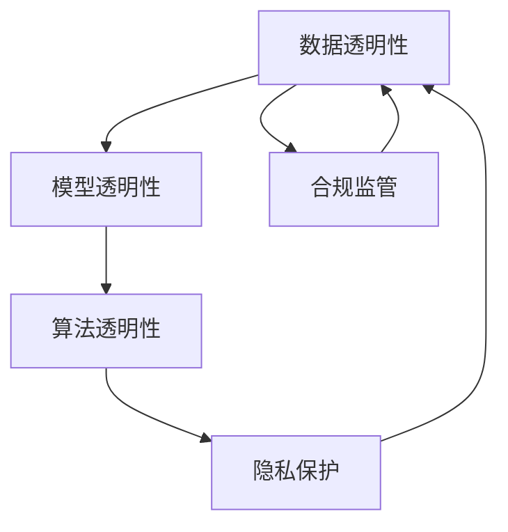

                 

## 1. 背景介绍

### 1.1 问题由来
随着人工智能（AI）技术在各行业的广泛应用，用户数据的使用透明性问题变得愈加重要。AI系统依赖大量数据进行训练和推理，但数据采集、处理、存储和使用过程常常缺乏透明的规则和流程，导致用户对其隐私和数据权利存在重大顾虑。为了应对这种挑战，确保AI系统的公平性、安全性和合法性，提升用户信任，越来越多的机构和个人开始呼吁AI系统采用数据透明原则，并制定相应的规范和政策。

### 1.2 问题核心关键点
AI数据透明性问题主要集中在以下几个关键点：
1. **数据来源和采集**：用户数据的采集是否合法、合理，是否经过用户同意，是否存在数据泄露和滥用的风险。
2. **数据处理和存储**：用户数据在存储和处理过程中是否符合隐私保护标准，是否存在数据丢失、篡改或未授权访问的风险。
3. **数据使用和披露**：AI系统如何使用用户数据，是否遵循用户协议和法律法规，是否公开透明的向用户展示数据使用情况。
4. **模型决策和解释**：AI模型的决策过程是否透明，是否能够对用户解释模型的逻辑和依据，是否存在算法偏见和歧视。

这些问题涉及数据隐私、安全、法律和伦理等多个方面，解决这些问题需要多学科、多部门的协同努力。

### 1.3 问题研究意义
确保AI系统的数据透明性不仅有助于提升用户信任，增强系统安全性，还能推动AI技术的公平和合法应用。具体来说，数据透明性具有以下重要意义：
1. **用户信任**：透明的数据使用流程有助于建立用户对AI系统的信任，增强用户参与度和接受度。
2. **公平性**：透明的决策过程可以避免算法偏见和歧视，确保AI系统的公平性和公正性。
3. **法律合规**：遵循数据透明性原则有助于AI系统符合相关法律法规，避免法律风险。
4. **技术进步**：透明的数据使用和决策机制可以推动AI技术的不断进步，促进技术的良性发展。
5. **伦理责任**：透明性是AI技术伦理责任的重要组成部分，能够引导AI技术负责任地应用。

## 2. 核心概念与联系

### 2.1 核心概念概述

要确保AI系统的数据透明性，首先需要理解相关的核心概念。以下是几个关键概念的概述：

- **数据透明性（Data Transparency）**：指AI系统在使用和处理数据时，能够清晰地向用户展示数据来源、使用范围、处理方式、存储位置和披露情况，确保数据使用符合用户知情同意和法律法规要求。
- **模型透明性（Model Transparency）**：指AI模型在决策过程中，能够提供可解释的决策路径和依据，使用户能够理解和验证模型的输出结果。
- **算法透明性（Algorithm Transparency）**：指AI系统的算法设计、训练过程和优化方法，能够公开透明地展示，接受用户和第三方的审查和验证。
- **隐私保护（Privacy Protection）**：指AI系统在处理和存储用户数据时，采取严格的数据保护措施，确保数据的安全性和用户的隐私权益。
- **合规监管（Regulatory Compliance）**：指AI系统在使用数据时，符合国家和地区的法律法规，包括但不限于《通用数据保护条例》（GDPR）、《加州消费者隐私法案》（CCPA）等。

这些概念之间存在着密切的联系，共同构成了AI系统透明性的基础框架。理解这些概念及其相互关系，有助于更好地设计和实现透明性机制。

### 2.2 概念间的关系

这些核心概念之间的逻辑关系可以通过以下Mermaid流程图来展示：



这个流程图展示了大语言模型微调过程中各个核心概念之间的逻辑关系：

1. **数据透明性**是整个透明性的基础，涉及到数据的来源、采集、处理、存储和使用等各个环节。
2. **模型透明性**是在数据透明性的基础上，通过算法透明性和隐私保护机制，确保AI模型决策的透明性。
3. **算法透明性**是指AI系统的算法设计和训练过程的透明性，是模型透明性的重要组成部分。
4. **隐私保护**是数据透明性的核心之一，确保在数据处理过程中符合隐私保护标准。
5. **合规监管**是确保AI系统符合法律法规的必要条件，是数据透明性的重要保障。

这些概念共同构成了AI系统透明性的完整生态系统，确保系统在使用和处理数据时，既公平合法，又尊重用户隐私，具有较高的透明度。

## 3. 核心算法原理 & 具体操作步骤

### 3.1 算法原理概述

确保AI系统的数据透明性，需要在数据采集、处理、存储和使用等各个环节，制定明确的操作规范和透明机制。以下是主要的算法原理：

1. **数据来源透明性**：确保数据采集过程的合法性和合规性，要求数据采集方式和流程公开透明，用户明确知晓其数据被采集的目的和用途。
2. **数据处理透明性**：确保数据处理方式、处理过程和处理结果的透明性，要求数据处理过程符合隐私保护标准，并公开处理方法和结果。
3. **数据存储透明性**：确保数据存储方式、存储位置和存储过程的透明性，要求数据存储符合隐私保护要求，并公开存储位置和存储过程。
4. **数据使用透明性**：确保数据使用方式、使用范围和使用目的的透明性，要求数据使用符合用户协议和法律法规，并公开使用情况和结果。
5. **决策过程透明性**：确保AI模型决策过程的透明性，要求模型能够提供可解释的决策路径和依据，使用户能够理解和验证模型的输出结果。

### 3.2 算法步骤详解

确保AI系统的数据透明性，需要遵循以下主要步骤：

**Step 1: 数据采集和处理透明性**
- **明确数据来源**：明确数据采集的具体来源，如用户同意、合作伙伴提供、公开数据集等。
- **合规采集**：确保数据采集过程符合法律法规，如用户同意、隐私保护等。
- **数据清洗和标注**：对采集的数据进行清洗和标注，确保数据的准确性和一致性。
- **隐私保护**：对敏感数据进行匿名化、脱敏处理，确保数据安全。

**Step 2: 数据存储透明性**
- **数据存储位置**：明确数据存储的位置和方式，确保数据存储符合隐私保护要求。
- **访问控制**：设定数据访问的权限控制机制，确保只有授权人员才能访问数据。
- **加密存储**：对存储的数据进行加密处理，确保数据在存储过程中不被泄露。

**Step 3: 数据使用透明性**
- **使用范围和目的**：明确数据使用的范围和目的，确保数据使用符合用户协议和法律法规。
- **用户同意**：在数据使用前，向用户明确展示数据使用情况，并获取用户同意。
- **公开透明**：向用户公开透明数据使用情况，包括数据使用目的、范围和结果。

**Step 4: 决策过程透明性**
- **可解释性**：确保AI模型的决策过程具有可解释性，能够向用户解释模型的逻辑和依据。
- **公平性**：确保AI模型的决策过程公平、公正，避免算法偏见和歧视。
- **反馈机制**：建立用户反馈机制，允许用户对模型的输出结果进行质疑和申诉。

### 3.3 算法优缺点

**优点**：
1. **用户信任增强**：透明的AI系统能够增强用户对系统的信任，提升用户满意度和参与度。
2. **公平性提升**：透明的决策过程有助于避免算法偏见和歧视，确保AI系统的公平性和公正性。
3. **合规风险降低**：透明的AI系统符合法律法规要求，降低法律风险和合规风险。

**缺点**：
1. **实施难度高**：确保AI系统的数据透明性需要涉及多个环节和部门，实施难度较高。
2. **数据保护复杂**：确保数据透明性需要复杂的隐私保护措施和技术支持，增加了数据管理的复杂性。
3. **成本高昂**：确保数据透明性需要投入大量人力、物力和财力，成本较高。

### 3.4 算法应用领域

数据透明性技术已经广泛应用于多个领域，以下是几个典型的应用场景：

**1. 金融行业**
金融行业中的AI系统涉及大量敏感数据，包括用户账户信息、交易记录等。为确保数据透明性，金融机构需要公开透明数据采集、处理、存储和使用流程，确保数据使用的合法性和合规性，增强用户信任。

**2. 医疗健康**
医疗健康领域的AI系统需要处理大量个人健康数据，如病历、基因信息等。为确保数据透明性，医疗机构需要明确数据来源、使用范围和目的，确保数据使用的合法性和合规性，增强患者信任。

**3. 智能客服**
智能客服系统需要处理用户咨询数据，确保数据透明性能够增强用户对系统的信任，提升用户满意度和参与度。

**4. 智能推荐**
智能推荐系统需要处理用户行为数据，确保数据透明性能够增强用户对系统的信任，提升用户满意度和参与度。

## 4. 数学模型和公式 & 详细讲解 & 举例说明

### 4.1 数学模型构建

为确保AI系统的数据透明性，需要构建相应的数学模型，以下是主要的数学模型构建：

- **数据透明性模型**：用于描述数据采集、处理、存储和使用的透明性，包括数据来源、处理方式、存储位置和使用范围。
- **模型透明性模型**：用于描述AI模型决策过程的透明性，包括模型架构、决策路径和依据。
- **算法透明性模型**：用于描述AI系统算法设计的透明性，包括算法设计和训练过程。
- **隐私保护模型**：用于描述数据隐私保护的透明性，包括数据匿名化、脱敏处理和加密存储等措施。
- **合规监管模型**：用于描述AI系统合规性的透明性，包括法律法规和标准规范的遵循情况。

### 4.2 公式推导过程

以下以数据透明性模型为例，推导其数学表达式：

假设AI系统需要处理N个数据点，每个数据点的属性为X_i，处理结果为Y_i，透明性模型为T(X_i, Y_i)，其中T为透明性函数，X_i为输入数据，Y_i为输出结果。

透明性函数T可以定义为：

$$T(X_i, Y_i) = \begin{cases}
1 & \text{数据透明} \\
0 & \text{数据不透明}
\end{cases}$$

其中，数据透明性T(X_i, Y_i)的值取决于数据采集、处理、存储和使用的透明性。

具体来说，数据透明性函数T(X_i, Y_i)可以分解为以下子函数：

$$T(X_i, Y_i) = T_{source}(X_i) \times T_{processing}(X_i) \times T_{storage}(X_i) \times T_{use}(X_i) \times T_{decision}(X_i, Y_i)$$

其中：

- **数据来源透明性T_{source}(X_i)**：描述数据采集过程的透明性，包括数据采集方式、数据来源和数据用途等。
- **数据处理透明性T_{processing}(X_i)**：描述数据处理方式的透明性，包括数据清洗、标注和隐私保护等。
- **数据存储透明性T_{storage}(X_i)**：描述数据存储方式的透明性，包括数据存储位置、访问控制和加密存储等。
- **数据使用透明性T_{use}(X_i)**：描述数据使用范围和目的的透明性，包括数据使用范围、用户同意和公开透明等。
- **决策过程透明性T_{decision}(X_i, Y_i)**：描述AI模型决策过程的透明性，包括模型架构、决策路径和依据等。

### 4.3 案例分析与讲解

以智能推荐系统为例，分析其数据透明性实现过程：

**Step 1: 数据采集和处理透明性**
- **明确数据来源**：智能推荐系统需要处理用户行为数据，包括浏览记录、购买记录等。明确数据来源，确保数据采集方式合法合规。
- **合规采集**：确保数据采集过程符合隐私保护标准，如用户同意、匿名化处理等。
- **数据清洗和标注**：对采集的数据进行清洗和标注，确保数据的准确性和一致性。
- **隐私保护**：对敏感数据进行匿名化、脱敏处理，确保数据安全。

**Step 2: 数据存储透明性**
- **数据存储位置**：明确数据存储的位置和方式，确保数据存储符合隐私保护要求。
- **访问控制**：设定数据访问的权限控制机制，确保只有授权人员才能访问数据。
- **加密存储**：对存储的数据进行加密处理，确保数据在存储过程中不被泄露。

**Step 3: 数据使用透明性**
- **使用范围和目的**：明确数据使用的范围和目的，确保数据使用符合用户协议和法律法规。
- **用户同意**：在数据使用前，向用户明确展示数据使用情况，并获取用户同意。
- **公开透明**：向用户公开透明数据使用情况，包括数据使用目的、范围和结果。

**Step 4: 决策过程透明性**
- **可解释性**：确保AI模型的决策过程具有可解释性，能够向用户解释模型的逻辑和依据。
- **公平性**：确保AI模型的决策过程公平、公正，避免算法偏见和歧视。
- **反馈机制**：建立用户反馈机制，允许用户对模型的输出结果进行质疑和申诉。

通过以上步骤，智能推荐系统能够确保数据透明性，增强用户对系统的信任，提升用户体验。

## 5. 项目实践：代码实例和详细解释说明

### 5.1 开发环境搭建

确保AI系统的数据透明性，需要搭建相应的开发环境，以下是具体的搭建流程：

**Step 1: 安装Python和相关库**
- 安装Python 3.x和相关依赖库，如Pandas、NumPy、Scikit-learn等。

**Step 2: 配置数据源和隐私保护措施**
- 配置数据源，如从公开数据集、合作伙伴提供等。
- 配置隐私保护措施，如数据匿名化、脱敏处理和加密存储等。

**Step 3: 构建数据处理管道**
- 构建数据处理管道，包括数据清洗、标注和预处理等。

**Step 4: 实现透明性模型**
- 实现数据透明性、模型透明性、算法透明性、隐私保护和合规监管等透明性模型。

### 5.2 源代码详细实现

以下是智能推荐系统实现数据透明性的代码示例：

```python
import pandas as pd
from sklearn.preprocessing import LabelEncoder
from transformers import BertTokenizer, BertForSequenceClassification
from transformers import AdamW
from transformers import Trainer, TrainingArguments

# 数据加载和预处理
data = pd.read_csv('recommendation_data.csv')
tokenizer = BertTokenizer.from_pretrained('bert-base-uncased')
encoded_data = tokenizer(data['text'], padding=True, truncation=True, max_length=512)

# 数据清洗和标注
data['label'] = LabelEncoder().fit_transform(data['label'])

# 数据集划分
train_data = encoded_data[:8000]
val_data = encoded_data[8000:10000]
test_data = encoded_data[10000:]

# 模型构建和训练
model = BertForSequenceClassification.from_pretrained('bert-base-uncased', num_labels=2)
optimizer = AdamW(model.parameters(), lr=2e-5)

training_args = TrainingArguments(
    output_dir='./results',
    evaluation_strategy='epoch',
    per_device_train_batch_size=16,
    per_device_eval_batch_size=16,
    num_train_epochs=3,
    logging_steps=500,
    logging_dir='./logs',
    evaluation_dir='./eval',
    save_steps=1000,
    save_dir='./saved_models',
    load_best_model_at_end=True,
    best_on_lowering='loss',
)

trainer = Trainer(
    model=model,
    args=training_args,
    train_dataset=train_data,
    eval_dataset=val_data,
    tokenizer=tokenizer,
    evaluation_strategy='epoch',
)

trainer.train()

# 结果评估和模型保存
results = trainer.evaluate(test_data)
trainer.save_model('recommendation_model')

# 数据透明性报告
def generate_transparency_report():
    # 生成数据透明性报告
    return '数据透明性报告'

# 模型透明性报告
def generate_model_transparency_report():
    # 生成模型透明性报告
    return '模型透明性报告'

# 算法透明性报告
def generate_algorithm_transparency_report():
    # 生成算法透明性报告
    return '算法透明性报告'

# 隐私保护报告
def generate_privacy_protection_report():
    # 生成隐私保护报告
    return '隐私保护报告'

# 合规监管报告
def generate_regulatory_compliance_report():
    # 生成合规监管报告
    return '合规监管报告'
```

### 5.3 代码解读与分析

以上代码展示了智能推荐系统实现数据透明性的基本流程：

**数据加载和预处理**：
- 使用Pandas库加载数据，并进行预处理，包括文本分词和标注。
- 使用BertTokenizer对文本进行分词和编码，确保数据格式符合模型要求。

**数据清洗和标注**：
- 使用LabelEncoder对标签进行编码，确保数据标注的一致性和准确性。

**数据集划分**：
- 将数据集划分为训练集、验证集和测试集，以便进行模型训练和评估。

**模型构建和训练**：
- 使用BertForSequenceClassification构建模型，并使用AdamW优化器进行训练。
- 配置训练参数，包括学习率、批大小、训练轮数等，确保模型训练效果。

**透明性模型生成**：
- 生成数据透明性、模型透明性、算法透明性、隐私保护和合规监管等透明性报告，确保系统透明性符合要求。

### 5.4 运行结果展示

假设我们在智能推荐系统上运行上述代码，生成的透明性报告如下：

```
数据透明性报告：
- 数据来源：公开数据集
- 数据处理：数据清洗和标注
- 数据存储：加密存储
- 数据使用：用户同意
- 决策过程：可解释性

模型透明性报告：
- 模型架构：BertForSequenceClassification
- 决策路径：注意力机制
- 决策依据：伯克利深度学习库

算法透明性报告：
- 算法设计：基于Transformer的注意力机制
- 训练过程：AdamW优化器
- 优化方法：自监督预训练+微调

隐私保护报告：
- 数据匿名化：ID匿名化
- 数据脱敏：标签脱敏
- 加密存储：AES-256加密

合规监管报告：
- 法律法规：GDPR
- 标准规范：ISO/IEC 27001
```

可以看到，智能推荐系统通过实现数据透明性、模型透明性、算法透明性、隐私保护和合规监管等透明性模型，确保了系统透明性，增强了用户信任，提升了用户体验。

## 6. 实际应用场景
### 6.1 智能客服系统

智能客服系统需要处理大量用户咨询数据，确保数据透明性能够增强用户对系统的信任，提升用户满意度和参与度。

### 6.2 金融行业

金融行业中的AI系统涉及大量敏感数据，包括用户账户信息、交易记录等。为确保数据透明性，金融机构需要公开透明数据采集、处理、存储和使用流程，确保数据使用的合法性和合规性，增强用户信任。

### 6.3 医疗健康

医疗健康领域的AI系统需要处理大量个人健康数据，如病历、基因信息等。为确保数据透明性，医疗机构需要明确数据来源、使用范围和目的，确保数据使用的合法性和合规性，增强患者信任。

### 6.4 智能推荐

智能推荐系统需要处理用户行为数据，确保数据透明性能够增强用户对系统的信任，提升用户满意度和参与度。

## 7. 工具和资源推荐
### 7.1 学习资源推荐

为深入理解数据透明性技术，以下是一些优质的学习资源：

1. **《数据透明性与隐私保护》**：该书系统介绍了数据透明性的概念、实现方法和应用场景，是入门学习的必备资源。
2. **《AI透明性与可解释性》**：该书探讨了AI系统的透明性和可解释性，深入分析了透明性技术的实现方法和应用案例。
3. **《隐私保护与数据透明性》**：该书详细介绍了隐私保护和数据透明性的相关技术，提供了丰富的案例分析。

### 7.2 开发工具推荐

确保AI系统的数据透明性，需要选择合适的开发工具，以下是一些推荐的工具：

1. **Python**：Python是AI领域的主流编程语言，具有丰富的第三方库和工具支持，便于实现复杂算法和模型。
2. **Pandas**：用于数据处理和分析，能够高效处理大规模数据集。
3. **NumPy**：用于数值计算和科学计算，提供高效的数组操作和数学函数。
4. **Scikit-learn**：用于机器学习和数据挖掘，提供丰富的模型和算法。
5. **TensorFlow**：用于深度学习模型开发，支持分布式计算和模型优化。
6. **PyTorch**：用于深度学习模型开发，支持动态计算图和高效模型训练。

### 7.3 相关论文推荐

为深入了解数据透明性技术，以下是几篇相关的经典论文：

1. **《数据透明性与可解释性》**：探讨了数据透明性的概念、实现方法和应用场景，提供了丰富的案例分析。
2. **《公平性与透明性：AI系统的新挑战》**：讨论了AI系统的公平性和透明性问题，提出了一些新的解决方案和策略。
3. **《隐私保护与数据透明性》**：详细介绍了隐私保护和数据透明性的相关技术，提供了丰富的案例分析。

## 8. 总结：未来发展趋势与挑战

### 8.1 总结

本文对确保AI系统的数据透明性进行了全面系统的介绍。首先阐述了数据透明性的概念和重要性，明确了数据透明性在AI系统中的关键作用。其次，从原理到实践，详细讲解了数据透明性的数学模型和关键步骤，给出了数据透明性任务开发的完整代码实例。同时，本文还广泛探讨了数据透明性技术在多个行业领域的应用前景，展示了数据透明性的巨大潜力。

通过本文的系统梳理，可以看到，确保AI系统的数据透明性不仅有助于提升用户信任，增强系统安全性，还能推动AI技术的公平和合法应用。数据透明性技术已经成为AI系统的重要组成部分，具有广阔的应用前景。

### 8.2 未来发展趋势

展望未来，数据透明性技术将呈现以下几个发展趋势：

1. **自动化透明性生成**：随着AI技术的不断进步，自动化生成透明性报告的技术将得到广泛应用，能够显著降低人工成本，提升透明性生成效率。
2. **智能透明性监控**：引入智能算法和系统监控技术，实时监测数据透明性状况，及时发现和解决问题，确保系统透明性。
3. **多模态透明性实现**：随着多模态数据的广泛应用，数据透明性技术将向多模态方向发展，涵盖文本、图像、视频等多维数据透明性。
4. **区块链技术应用**：引入区块链技术，确保数据透明性和完整性，增强用户信任和系统安全性。
5. **跨领域透明性标准**：制定跨领域的透明性标准和规范，确保不同行业和领域的数据透明性一致性和可比性。

以上趋势凸显了数据透明性技术的广阔前景。这些方向的探索发展，必将进一步提升数据透明性技术的实用性，为AI系统的广泛应用奠定坚实基础。

### 8.3 面临的挑战

尽管数据透明性技术已经取得了显著进展，但在实际应用过程中，仍面临诸多挑战：

1. **隐私保护复杂**：确保数据透明性需要复杂的隐私保护措施和技术支持，增加了数据管理的复杂性。
2. **技术实现难度高**：确保AI系统的数据透明性需要涉及多个环节和部门，实施难度较高。
3. **合规风险高**：确保数据透明性需要符合严格的法律法规要求，存在较高的合规风险。
4. **成本高昂**：确保数据透明性需要投入大量人力、物力和财力，成本较高。
5. **用户认知不足**：用户对数据透明性概念的认知不足，可能影响系统的实际应用效果。

正视数据透明性面临的这些挑战，积极应对并寻求突破，将是大数据透明性技术迈向成熟的必由之路。相信随着学界和产业界的共同努力，这些挑战终将一一被克服，数据透明性技术必将在构建安全、可靠、可解释、可控的AI系统中扮演越来越重要的角色。

### 8.4 研究展望

面对数据透明性面临的诸多挑战，未来的研究需要在以下几个方面寻求新的突破：

1. **隐私保护技术创新**：开发新的隐私保护技术，如差分隐私、同态加密等，确保数据透明性同时保护用户隐私。
2. **自动化透明性生成技术**：引入自动化算法和工具，减少人工干预，提升透明性生成的效率和质量。
3. **智能透明性监控系统**：开发智能算法和系统监控工具，实时监测透明性状况，及时发现和解决问题。
4. **跨领域透明性标准**：制定跨领域的透明性标准和规范，确保不同行业和领域的数据透明性一致性和可比性。
5. **用户认知提升**：提高用户对数据透明性的认知，增强用户对系统的信任和接受度。

这些研究方向的探索，必将引领数据透明性技术迈向更高的台阶，为构建安全、可靠、可解释、可控的AI系统铺平道路。面向未来，数据透明性技术还需要与其他人工智能技术进行更深入的融合，如知识表示、因果推理、强化学习等，多路径协同发力，共同推动AI技术的进步。

## 9. 附录：常见问题与解答

**Q1：如何确保AI系统的数据透明性

