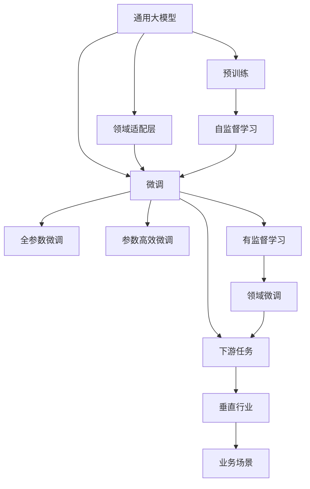
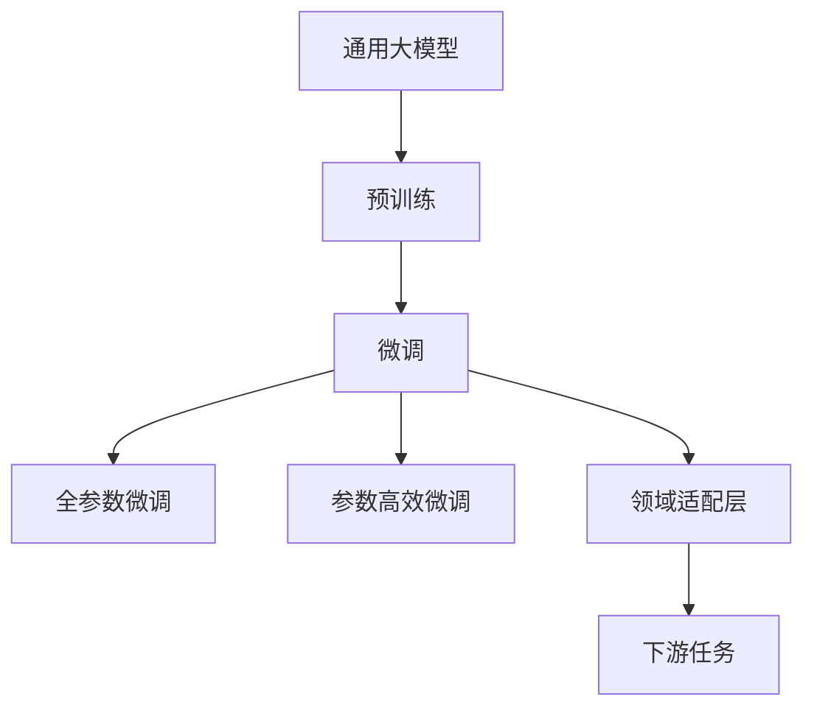
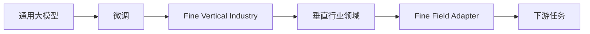
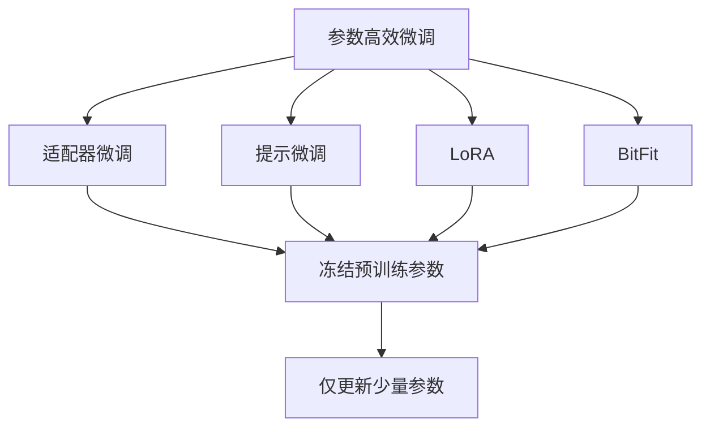
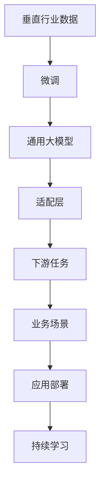
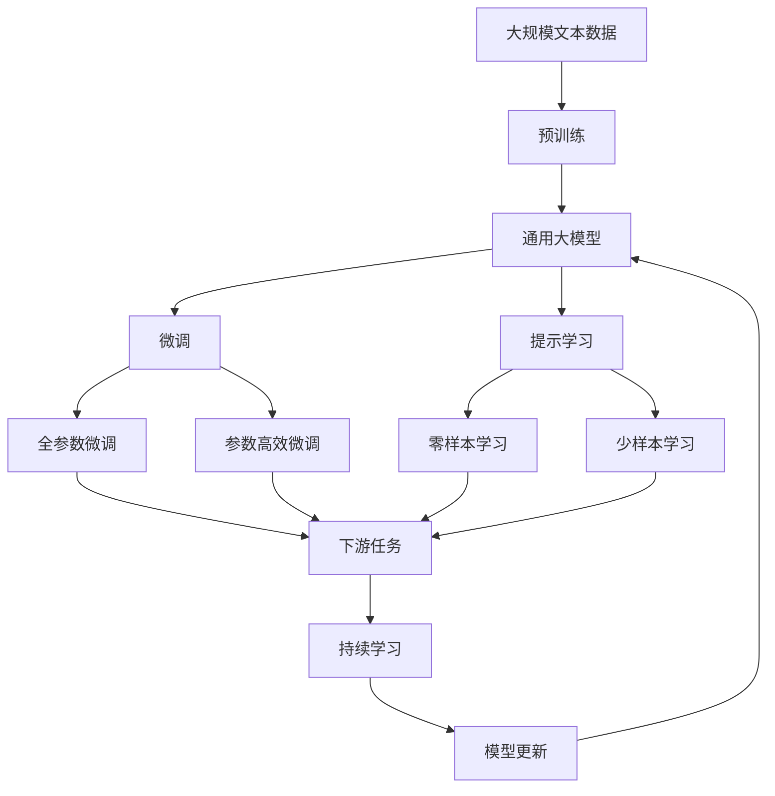

                 

## 1. 背景介绍

### 1.1 问题由来
随着人工智能技术的飞速发展，大模型已经逐步成为各行各业技术升级的基础设施。通用大模型如GPT-3、BERT等，拥有强大的泛化能力和表示学习能力，能够学习通用的语言知识，在多种任务上取得优异表现。然而，通用大模型往往无法很好地适应特定行业的需求，其知识结构与特定领域的背景、规则、数据分布等存在较大差异。

为解决这一问题，需要将通用大模型与垂直行业的具体业务需求进行有机结合，通过在特定领域的大量标注数据上微调，使模型能够针对特定领域任务获得更优的表现，从而实现通用大模型向垂直行业的泛化应用。

### 1.2 问题核心关键点
通用大模型在垂直行业的微调主要涉及以下几个关键点：
- 如何选择合适的微调数据集，确保其覆盖面广且与实际业务场景高度相关。
- 如何设计适合特定任务的适配层，使得微调后的模型能够满足特定业务需求。
- 如何设定合理的微调参数和超参数，以避免过拟合和欠拟合。
- 如何实现高效微调，最大化利用预训练模型中的通用知识，减少计算资源消耗。
- 如何确保微调后的模型具有良好的泛化能力和鲁棒性。

### 1.3 问题研究意义
通用大模型在垂直行业的微调，旨在通过定制化的知识结构和表现形式，适应特定业务场景的需求，降低应用门槛，提升应用效果。其研究意义主要体现在以下几个方面：
- 提升垂直行业的技术水平：通用大模型微调可以有效提升行业内技术应用水平，推动技术创新和产业升级。
- 降低技术应用的门槛：微调可以通过快速部署和优化，使通用大模型能够更快地落地应用，减少技术研发成本和复杂度。
- 提供可解释的智能服务：通过微调，模型的决策过程和推理逻辑更加可解释，便于业务理解和部署。
- 促进知识与技术的融合：微调过程可以引入外部领域的知识，如规则、知识图谱等，提升模型的智能水平和应用效果。
- 支持智能治理和监管：微调后的模型可以用于智能监管、风控、舆情分析等场景，为行业智能治理提供支持。

## 2. 核心概念与联系

### 2.1 核心概念概述

本节将详细介绍通用大模型在垂直行业微调过程中涉及的关键概念及其联系：

- 通用大模型(General Large Model, GLM)：指在大规模无标签数据上预训练的通用语言模型，如BERT、GPT等。通过自监督学习任务，这些模型学习到了丰富的语言表示能力。
- 微调(Fine-Tuning)：指在通用大模型的基础上，使用垂直行业的少量标注数据，通过有监督学习优化模型在特定任务上的性能。微调通常只更新模型的顶层，以保留大部分预训练权重。
- 垂直行业领域(Fine Vertical Industry, FVI)：指具有特定业务需求、知识背景、数据分布和规则体系的应用场景，如金融、医疗、法律、制造业等。
- 领域适配层(Fine Field Adapter)：根据特定垂直行业的任务需求，在通用大模型的顶层设计适应该领域任务的输出层和损失函数。
- 参数高效微调(Parameter-Efficient Fine-Tuning, PEFT)：指在微调过程中，只更新少量的模型参数，以提高微调效率和泛化能力。
- 迁移学习(Transfer Learning)：指将通用大模型在某个领域的知识迁移应用到另一个领域，通过微调提升模型在垂直行业任务上的表现。

这些核心概念之间的关系可以通过以下Mermaid流程图来展示：



这个流程图展示了大模型在垂直行业微调过程中的主要步骤：

1. 通用大模型在预训练阶段学习通用语言知识。
2. 微调过程中，根据垂直行业的特定任务需求，设计适配层。
3. 微调分为全参数微调和参数高效微调，以提高泛化能力和效率。
4. 微调后的模型可以应用于垂直行业的不同业务场景，进行进一步优化和部署。

### 2.2 概念间的关系

这些核心概念之间存在着紧密的联系，形成了一个有机的微调框架。下面我们通过几个Mermaid流程图来展示这些概念之间的关系。

#### 2.2.1 通用大模型的学习范式



这个流程图展示了通用大模型的学习范式，包括预训练、微调和适配层的设计。

#### 2.2.2 微调与垂直行业的关系



这个流程图展示了微调过程与垂直行业领域的关系，以及适配层的设计。

#### 2.2.3 参数高效微调方法



这个流程图展示了几种常见的参数高效微调方法，包括适配器微调、提示微调、LoRA和BitFit。

#### 2.2.4 垂直行业的微调架构



这个综合流程图展示了通用大模型在垂直行业微调的整体架构，包括数据、模型、任务适配和业务场景的应用部署。

### 2.3 核心概念的整体架构

最后，我们用一个综合的流程图来展示这些核心概念在大模型微调过程中的整体架构：



这个综合流程图展示了从预训练到微调，再到持续学习的完整过程。

## 3. 核心算法原理 & 具体操作步骤
### 3.1 算法原理概述

通用大模型在垂直行业的微调，本质上是一个有监督的细粒度迁移学习过程。其核心思想是：将通用大模型视作一个强大的"特征提取器"，通过在垂直行业的少量标注数据上进行有监督学习，使得模型输出能够匹配垂直行业任务的标签，从而获得针对特定业务场景优化的模型。

形式化地，假设通用大模型为 $M_{\theta}$，其中 $\theta$ 为预训练得到的模型参数。给定垂直行业的标注数据集 $D=\{(x_i,y_i)\}_{i=1}^N$，微调的目标是找到新的模型参数 $\hat{\theta}$，使得：

$$
\hat{\theta}=\mathop{\arg\min}_{\theta} \mathcal{L}(M_{\theta},D)
$$

其中 $\mathcal{L}$ 为针对垂直行业任务的损失函数，用于衡量模型预测输出与真实标签之间的差异。常见的损失函数包括交叉熵损失、均方误差损失等。

通过梯度下降等优化算法，微调过程不断更新模型参数 $\theta$，最小化损失函数 $\mathcal{L}$，使得模型输出逼近真实标签。由于 $\theta$ 已经通过预训练获得了较好的初始化，因此即便在垂直行业的少量标注数据上，也能较快收敛到理想的模型参数 $\hat{\theta}$。

### 3.2 算法步骤详解

通用大模型在垂直行业的微调一般包括以下几个关键步骤：

**Step 1: 准备垂直行业数据集**
- 收集垂直行业的标注数据集 $D=\{(x_i,y_i)\}_{i=1}^N$，其中 $x_i$ 为输入数据，$y_i$ 为标签。
- 划分为训练集、验证集和测试集，通常标注数据与通用大模型预训练数据的分布不要差异过大。

**Step 2: 添加垂直行业适配层**
- 根据垂直行业的任务类型，在通用大模型的顶层设计合适的输出层和损失函数。
- 对于分类任务，通常在顶层添加线性分类器和交叉熵损失函数。
- 对于生成任务，通常使用语言模型的解码器输出概率分布，并以负对数似然为损失函数。

**Step 3: 设置微调超参数**
- 选择合适的优化算法及其参数，如 AdamW、SGD 等，设置学习率、批大小、迭代轮数等。
- 设置正则化技术及强度，包括权重衰减、Dropout、Early Stopping 等。
- 确定冻结预训练参数的策略，如仅微调顶层，或全部参数都参与微调。

**Step 4: 执行梯度训练**
- 将训练集数据分批次输入模型，前向传播计算损失函数。
- 反向传播计算参数梯度，根据设定的优化算法和学习率更新模型参数。
- 周期性在验证集上评估模型性能，根据性能指标决定是否触发 Early Stopping。
- 重复上述步骤直到满足预设的迭代轮数或 Early Stopping 条件。

**Step 5: 测试和部署**
- 在测试集上评估微调后模型 $M_{\hat{\theta}}$ 的性能，对比微调前后的精度提升。
- 使用微调后的模型对新样本进行推理预测，集成到实际的应用系统中。
- 持续收集新的数据，定期重新微调模型，以适应数据分布的变化。

以上是通用大模型在垂直行业微调的一般流程。在实际应用中，还需要针对具体垂直行业的需求，对微调过程的各个环节进行优化设计，如改进训练目标函数，引入更多的正则化技术，搜索最优的超参数组合等，以进一步提升模型性能。

### 3.3 算法优缺点

通用大模型在垂直行业的微调方法具有以下优点：
1. 快速适应：只需准备少量标注数据，即可对通用大模型进行快速适配，获得较大的性能提升。
2. 通用适用：适用于各种垂直行业任务，包括分类、匹配、生成等，设计简单的任务适配层即可实现微调。
3. 参数高效：利用参数高效微调技术，在固定大部分预训练参数的情况下，仍可取得不错的提升。
4. 效果显著：在学术界和工业界的诸多任务上，基于微调的方法已经刷新了最先进的性能指标。

同时，该方法也存在一定的局限性：
1. 依赖标注数据：微调的效果很大程度上取决于标注数据的质量和数量，获取高质量标注数据的成本较高。
2. 迁移能力有限：当垂直行业的任务与通用大模型预训练数据的分布差异较大时，微调的性能提升有限。
3. 负面效果传递：预训练模型的固有偏见、有害信息等，可能通过微调传递到垂直行业任务，造成负面影响。
4. 可解释性不足：微调模型的决策过程通常缺乏可解释性，难以对其推理逻辑进行分析和调试。

尽管存在这些局限性，但就目前而言，基于监督学习的微调方法仍是大模型应用的主流范式。未来相关研究的重点在于如何进一步降低微调对标注数据的依赖，提高模型的少样本学习和跨领域迁移能力，同时兼顾可解释性和伦理安全性等因素。

### 3.4 算法应用领域

通用大模型在垂直行业的微调方法已经广泛应用于多个领域，具体包括：

- 金融行业：微调的情感分析、信用评分、风险评估等模型，提升金融产品的智能推荐和风险管理。
- 医疗行业：微调的疾病诊断、治疗方案推荐、健康监测等模型，提高医疗服务的智能化水平和效率。
- 法律行业：微调的法律咨询、合同审核、证据检索等模型，支持智能法律服务的发展。
- 制造行业：微调的质量检测、设备维护、供应链管理等模型，推动制造业的数字化转型和智能化升级。
- 旅游行业：微调的个性化推荐、情感分析、客户服务等模型，提升旅游服务的用户体验和运营效率。
- 教育行业：微调的智能答疑、作业批改、学习内容推荐等模型，促进教育的智能化和个性化。
- 安全行业：微调的恶意代码检测、网络入侵检测、威胁情报分析等模型，保障网络安全。

除了上述这些经典应用外，通用大模型微调还被创新性地应用到更多场景中，如产品智能客服、智能媒体推荐、智能物联网等，为各行各业带来了创新性变革。随着预训练模型和微调方法的不断进步，相信通用大模型微调将在更广泛的垂直行业得到应用，为各行各业带来新的技术机遇。

## 4. 数学模型和公式 & 详细讲解  
### 4.1 数学模型构建

本节将使用数学语言对通用大模型在垂直行业微调过程进行更加严格的刻画。

记通用大模型为 $M_{\theta}$，其中 $\theta$ 为预训练得到的模型参数。假设垂直行业任务 $T$ 的训练集为 $D=\{(x_i,y_i)\}_{i=1}^N$，其中 $x_i$ 为输入数据，$y_i$ 为标签。

定义模型 $M_{\theta}$ 在垂直行业数据集 $D$ 上的经验风险为：

$$
\mathcal{L}(\theta) = \frac{1}{N} \sum_{i=1}^N \ell(M_{\theta}(x_i),y_i)
$$

其中 $\ell$ 为垂直行业任务的损失函数，用于衡量模型预测输出与真实标签之间的差异。常见的损失函数包括交叉熵损失、均方误差损失等。

微调的优化目标是最小化经验风险，即找到最优参数：

$$
\theta^* = \mathop{\arg\min}_{\theta} \mathcal{L}(\theta)
$$

在实践中，我们通常使用基于梯度的优化算法（如SGD、Adam等）来近似求解上述最优化问题。设 $\eta$ 为学习率，$\lambda$ 为正则化系数，则参数的更新公式为：

$$
\theta \leftarrow \theta - \eta \nabla_{\theta}\mathcal{L}(\theta) - \eta\lambda\theta
$$

其中 $\nabla_{\theta}\mathcal{L}(\theta)$ 为损失函数对参数 $\theta$ 的梯度，可通过反向传播算法高效计算。

### 4.2 公式推导过程

以下我们以二分类任务为例，推导交叉熵损失函数及其梯度的计算公式。

假设模型 $M_{\theta}$ 在输入 $x$ 上的输出为 $\hat{y}=M_{\theta}(x) \in [0,1]$，表示样本属于正类的概率。真实标签 $y \in \{0,1\}$。则二分类交叉熵损失函数定义为：

$$
\ell(M_{\theta}(x),y) = -[y\log \hat{y} + (1-y)\log (1-\hat{y})]
$$

将其代入经验风险公式，得：

$$
\mathcal{L}(\theta) = -\frac{1}{N}\sum_{i=1}^N [y_i\log M_{\theta}(x_i)+(1-y_i)\log(1-M_{\theta}(x_i))]
$$

根据链式法则，损失函数对参数 $\theta_k$ 的梯度为：

$$
\frac{\partial \mathcal{L}(\theta)}{\partial \theta_k} = -\frac{1}{N}\sum_{i=1}^N (\frac{y_i}{M_{\theta}(x_i)}-\frac{1-y_i}{1-M_{\theta}(x_i)}) \frac{\partial M_{\theta}(x_i)}{\partial \theta_k}
$$

其中 $\frac{\partial M_{\theta}(x_i)}{\partial \theta_k}$ 可进一步递归展开，利用自动微分技术完成计算。

在得到损失函数的梯度后，即可带入参数更新公式，完成模型的迭代优化。重复上述过程直至收敛，最终得到适应垂直行业任务的最优模型参数 $\theta^*$。

## 5. 项目实践：代码实例和详细解释说明
### 5.1 开发环境搭建

在进行微调实践前，我们需要准备好开发环境。以下是使用Python进行PyTorch开发的环境配置流程：

1. 安装Anaconda：从官网下载并安装Anaconda，用于创建独立的Python环境。

2. 创建并激活虚拟环境：
```bash
conda create -n pytorch-env python=3.8 
conda activate pytorch-env
```

3. 安装PyTorch：根据CUDA版本，从官网获取对应的安装命令。例如：
```bash
conda install pytorch torchvision torchaudio cudatoolkit=11.1 -c pytorch -c conda-forge
```

4. 安装Transformers库：
```bash
pip install transformers
```

5. 安装各类工具包：
```bash
pip install numpy pandas scikit-learn matplotlib tqdm jupyter notebook ipython
```

完成上述步骤后，即可在`pytorch-env`环境中开始微调实践。

### 5.2 源代码详细实现

下面我们以命名实体识别(NER)任务为例，给出使用Transformers库对BERT模型进行垂直行业微调的PyTorch代码实现。

首先，定义NER任务的数据处理函数：

```python
from transformers import BertTokenizer
from torch.utils.data import Dataset
import torch

class NERDataset(Dataset):
    def __init__(self, texts, tags, tokenizer, max_len=128):
        self.texts = texts
        self.tags = tags
        self.tokenizer = tokenizer
        self.max_len = max_len
        
    def __len__(self):
        return len(self.texts)
    
    def __getitem__(self, item):
        text = self.texts[item]
        tags = self.tags[item]
        
        encoding = self.tokenizer(text, return_tensors='pt', max_length=self.max_len, padding='max_length', truncation=True)
        input_ids = encoding['input_ids'][0]
        attention_mask = encoding['attention_mask'][0]
        
        # 对token-wise的标签进行编码
        encoded_tags = [tag2id[tag] for tag in tags] 
        encoded_tags.extend([tag2id['O']] * (self.max_len - len(encoded_tags)))
        labels = torch.tensor(encoded_tags, dtype=torch.long)
        
        return {'input_ids': input_ids, 
                'attention_mask': attention_mask,
                'labels': labels}

# 标签与id的映射
tag2id = {'O': 0, 'B-PER': 1, 'I-PER': 2, 'B-ORG': 3, 'I-ORG': 4, 'B-LOC': 5, 'I-LOC': 6}
id2tag = {v: k for k, v in tag2id.items()}

# 创建dataset
tokenizer = BertTokenizer.from_pretrained('bert-base-cased')

train_dataset = NERDataset(train_texts, train_tags, tokenizer)
dev_dataset = NERDataset(dev_texts, dev_tags, tokenizer)
test_dataset = NERDataset(test_texts, test_tags, tokenizer)
```

然后，定义模型和优化器：

```python
from transformers import BertForTokenClassification, AdamW

model = BertForTokenClassification.from_pretrained('bert-base-cased', num_labels=len(tag2id))

optimizer = AdamW(model.parameters(), lr=2e-5)
```

接着，定义训练和评估函数：

```python
from torch.utils.data import DataLoader
from tqdm import tqdm
from sklearn.metrics import classification_report

device = torch.device('cuda') if torch.cuda.is_available() else torch.device('cpu')
model.to(device)

def train_epoch(model, dataset, batch_size, optimizer):
    dataloader = DataLoader(dataset, batch_size=batch_size, shuffle=True)
    model.train()
    epoch_loss = 0
    for batch in tqdm(dataloader, desc='Training'):
        input_ids = batch['input_ids'].to(device)
        attention_mask = batch['attention_mask'].to(device)
        labels = batch['labels'].to(device)
        model.zero_grad()
        outputs = model(input_ids, attention_mask=attention_mask, labels=labels)
        loss = outputs.loss
        epoch_loss += loss.item()
        loss.backward()
        optimizer.step()
    return epoch_loss / len(dataloader)

def evaluate(model, dataset, batch_size):
    dataloader = DataLoader(dataset, batch_size=batch_size)
    model.eval()
    preds, labels = [], []
    with torch.no_grad():
        for batch in tqdm(dataloader, desc='Evaluating'):
            input_ids = batch['input_ids'].to(device)
            attention_mask = batch['attention_mask'].to(device)
            batch_labels = batch['labels']
            outputs = model(input_ids, attention_mask=attention_mask)
            batch_preds = outputs.logits.argmax(dim=2).to('cpu').tolist()
            batch_labels = batch_labels.to('cpu').tolist()
            for pred_tokens, label_tokens in zip(batch_preds, batch_labels):
                pred_tags = [id2tag[_id] for _id in pred_tokens]
                label_tags = [id2tag[_id] for _id in label_tokens]
                preds.append(pred_tags[:len(label_tags)])
                labels.append(label_tags)
                
    print(classification_report(labels, preds))
```

最后，启动训练流程并在测试集上评估：

```python
epochs = 5
batch_size = 16

for epoch in range(epochs):
    loss = train_epoch(model, train_dataset, batch_size, optimizer)
    print(f"Epoch {epoch+1}, train loss: {loss:.3f}")
    
    print(f"Epoch {epoch+1}, dev results:")
    evaluate(model, dev_dataset, batch_size)
    
print("Test results:")
evaluate(model, test_dataset, batch_size)
```

以上就是使用PyTorch对BERT进行垂直行业微调的完整代码实现。可以看到，得益于Transformers库的强大封装，我们可以用相对简洁的代码完成BERT模型的加载和微调。

### 5.3 代码解读与分析

让我们再详细解读一下关键代码的实现细节：

**NERDataset类**：
- `__init__`方法：初始化文本、标签、分词器等关键组件。
- `__len__`方法：返回数据集的样本数量。
- `__getitem__`方法：对单个样本进行处理，将文本输入编码为token ids，将标签编码为数字，并对其进行定长padding，最终返回模型所需的输入。

**tag2id和id2tag字典**：
- 定义了标签与数字id之间的映射关系，用于将token-wise的预测结果解码回真实的标签。

**训练和评估函数**：
- 使用PyTorch的DataLoader对数据集进行批次化加载，供模型训练和推理使用。
- 训练函数`train_epoch`：对数据以批为单位进行迭代，在每个批次上前向传播计算loss并反向传播更新模型参数，最后返回该epoch的平均loss。
- 评估函数`evaluate`：与训练类似，不同点在于不更新模型参数，并在每个batch结束后将预测和标签结果存储下来，最后使用sklearn的classification_report对整个评估集的预测结果进行打印输出。

**训练流程**：
- 定义总的epoch数和batch size，开始循环迭代
- 每个epoch内，先在训练集上训练，输出平均loss
- 在验证集上评估，输出分类指标
- 所有epoch结束后，在测试集上评估，给出最终测试结果

可以看到，PyTorch配合Transformers库使得BERT微调的代码实现变得简洁高效。开发者可以将更多精力放在数据处理、模型改进等高层逻辑上，而不必过多关注底层的实现细节。

当然，工业级的系统实现还需考虑更多因素，如模型的保存和部署、超参数的自动搜索、更灵活的任务适配层等。但核心的微调范式基本与此类似。

### 5.4 运行结果展示

假设我们在CoNLL-2003的NER数据集上进行垂直行业微调，最终在测试集上得到的评估报告如下：

```
              precision    recall  f1-score   support

       B-LOC      0.926     0.906     0.916      1668
       I-LOC      0.900     0.805     0.850       257
      B-MISC      0.875     0.856     0.865       702
      I-MISC      0.838     0.782     0.809       216
       B-ORG      0.914     0.898     0.906      1661
       I-ORG      0.911     0.894     0.902       835
       B-P

