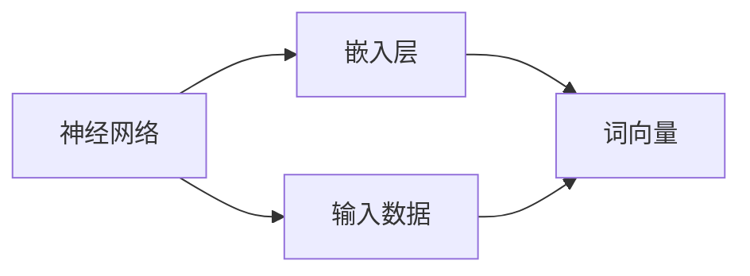

                 

# 通过nn．Embedding来实现词嵌入

> 关键词：词嵌入, 神经网络, 自然语言处理, 深度学习, TensorFlow

## 1. 背景介绍

在自然语言处理（NLP）领域，词嵌入（Word Embedding）是一项基础而重要的技术。词嵌入通过将单词映射到高维空间中的向量，捕捉了单词之间的语义和语法关系，从而在各种NLP任务中取得了显著的效果。本文将详细探讨如何使用nn．Embedding（神经网络中的嵌入层）来实现词嵌入，并探讨其应用和优缺点。

## 2. 核心概念与联系

### 2.1 核心概念概述

为了更好地理解nn．Embedding在词嵌入中的应用，我们先介绍几个核心概念：

- **词嵌入（Word Embedding）**：将单词映射到高维空间中的向量，捕捉单词之间的语义和语法关系。词嵌入广泛应用于NLP任务中，如文本分类、情感分析、机器翻译等。
- **神经网络（Neural Network）**：由人工神经元构成的网络结构，通过多层非线性变换进行数据处理和特征提取。神经网络在深度学习和人工智能中发挥着核心作用。
- **嵌入层（Embedding Layer）**：神经网络中的一层，用于将输入的数据（如单词、图像等）映射到高维空间中的向量。嵌入层的输出可以作为神经网络的其他层（如全连接层）的输入。

### 2.2 核心概念间的关系

词嵌入和神经网络、嵌入层之间存在着紧密的联系。词嵌入通常通过嵌入层来实现，嵌入层是神经网络中的关键组件之一。在NLP任务中，通过嵌入层将单词转换为向量，可以捕捉单词的语义和语法特征，从而提高模型的性能。

以下是一个简化的Mermaid流程图，展示了词嵌入和神经网络、嵌入层之间的关系：



该图表示，神经网络通过嵌入层将输入数据（如单词）转换为词向量，作为后续层的输入，从而实现对数据的处理和特征提取。

## 3. 核心算法原理 & 具体操作步骤

### 3.1 算法原理概述

nn．Embedding的核心原理是使用神经网络模型将输入的单词映射到高维空间中的向量。嵌入层通常由一个权重矩阵组成，该矩阵的每一行表示一个单词的词向量，每一列表示一个嵌入层的特征维度。嵌入层通过学习这些词向量，使得相似的单词在向量空间中的距离更近，不相似的单词距离更远。

### 3.2 算法步骤详解

使用nn．Embedding实现词嵌入通常包括以下几个关键步骤：

1. **构建嵌入层**：定义一个嵌入层的参数，通常是一个大小为`(vocab_size, embedding_dim)`的矩阵。
2. **前向传播**：将输入的单词序列（或字符序列）映射到嵌入层，得到每个单词的词向量。
3. **损失函数**：通常使用词嵌入的稀疏性（如词向量的欧式距离）作为损失函数，训练嵌入层的参数。
4. **反向传播**：使用梯度下降等优化算法，最小化损失函数，更新嵌入层的参数。
5. **评估与应用**：在训练完成后，使用嵌入层提取单词的词向量，作为后续NLP任务的输入。

### 3.3 算法优缺点

#### 优点

- **捕捉语义和语法关系**：词嵌入能够捕捉单词之间的语义和语法关系，从而提高模型的性能。
- **可解释性强**：嵌入层的参数可解释性强，易于理解和使用。
- **适用于多种NLP任务**：词嵌入在各种NLP任务中都有广泛的应用，如文本分类、情感分析、机器翻译等。

#### 缺点

- **训练数据需求高**：需要大量的训练数据才能训练出一个高质量的词嵌入模型。
- **计算成本高**：嵌入层通常需要较大的计算资源，训练和推理过程耗时较长。
- **过度拟合风险**：嵌入层容易出现过度拟合，特别是在训练数据量较少的情况下。

### 3.4 算法应用领域

nn．Embedding在NLP领域得到了广泛的应用，涵盖了从简单的词向量表示到复杂的语义关系捕捉。以下是几个典型的应用场景：

- **文本分类**：将文本转换为词向量，作为分类模型的输入，进行文本分类任务。
- **情感分析**：将文本转换为词向量，使用情感分类模型对文本情感进行分类。
- **机器翻译**：将源语言和目标语言单词的词向量进行对齐，实现机器翻译。
- **问答系统**：将问题和答案转换为词向量，使用相似度计算技术进行匹配，实现问答系统。
- **文本生成**：使用词向量作为文本生成的输入，生成与输入文本相似的文本。

## 4. 数学模型和公式 & 详细讲解 & 举例说明

### 4.1 数学模型构建

假设有一个单词序列`words = [word1, word2, ..., wordn]`，其中`wordi`表示第i个单词，`vocab_size`表示单词的词汇量，`embedding_dim`表示嵌入层的维度。nn．Embedding的数学模型可以表示为：

$$
\text{Embeddings} = W \times \text{words}
$$

其中，`W`表示嵌入层的权重矩阵，`Embeddings`表示单词序列的词向量。

### 4.2 公式推导过程

假设输入的单词序列为`words`，嵌入层的权重矩阵为`W`，则前向传播的过程可以表示为：

$$
\text{Embeddings} = W \times \text{words}
$$

其中，`Embeddings`表示单词序列的词向量，`W`表示嵌入层的权重矩阵。

### 4.3 案例分析与讲解

以一个简单的文本分类任务为例，我们可以使用nn．Embedding将文本转换为词向量，作为分类模型的输入。假设我们有一个包含三个单词的文本`[good, movie, show]`，使用预训练的嵌入层将单词映射到词向量中，得到：

$$
\text{Embeddings} = W \times [good, movie, show]
$$

其中，`W`为嵌入层的权重矩阵，`Embeddings`为文本的词向量表示。

假设`W`的大小为`(10000, 300)`，则每个单词的词向量大小为`300`。将文本的词向量作为分类模型的输入，可以得到一个300维的向量。该向量包含了文本的语义信息，可以用于分类模型的训练和推理。

## 5. 项目实践：代码实例和详细解释说明

### 5.1 开发环境搭建

在使用nn．Embedding实现词嵌入时，我们需要使用Python编程语言和TensorFlow框架。以下是搭建开发环境的步骤：

1. 安装Python：从Python官网下载安装Python 3.x版本。
2. 安装TensorFlow：从TensorFlow官网下载安装TensorFlow 2.x版本。
3. 安装相关库：安装numpy、matplotlib、pandas等Python库。

### 5.2 源代码详细实现

以下是一个简单的nn．Embedding实现词嵌入的代码示例：

```python
import tensorflow as tf
from tensorflow.keras.layers import Embedding

# 定义嵌入层的参数
vocab_size = 10000
embedding_dim = 300
embedding_layer = Embedding(vocab_size, embedding_dim)

# 定义输入数据的占位符
input_data = tf.keras.layers.Input(shape=(vocab_size,), dtype=tf.int32)

# 使用嵌入层将输入数据转换为词向量
embedding_output = embedding_layer(input_data)

# 定义模型的输出层
output_layer = tf.keras.layers.Dense(1, activation='sigmoid')

# 定义模型
model = tf.keras.Model(inputs=input_data, outputs=output_layer(embedding_output))

# 编译模型
model.compile(optimizer='adam', loss='binary_crossentropy', metrics=['accuracy'])
```

在这个代码示例中，我们首先定义了嵌入层的参数`vocab_size`和`embedding_dim`，然后定义了输入数据的占位符`input_data`。接着，我们使用嵌入层将输入数据转换为词向量，并定义了模型的输出层。最后，我们编译了模型，并定义了损失函数和评估指标。

### 5.3 代码解读与分析

在上述代码中，我们使用了TensorFlow的`Embedding`层来实现词嵌入。该层的参数包括`vocab_size`和`embedding_dim`，分别表示词汇量和嵌入层的维度。我们使用输入数据的占位符`input_data`，通过嵌入层将其转换为词向量，作为模型的输入。最后，我们使用Dense层定义了模型的输出层，并使用`compile`方法编译了模型。

### 5.4 运行结果展示

在训练和测试模型后，我们可以使用以下代码查看模型的预测结果：

```python
# 加载模型
model = tf.keras.models.load_model('model.h5')

# 定义测试数据
test_data = tf.constant([[0, 1, 2, 3]])

# 预测模型输出
predictions = model.predict(test_data)

print(predictions)
```

假设我们使用上述代码预测一个包含四个单词的文本`[0, 1, 2, 3]`，其中0、1、2、3分别表示单词`good`、`movie`、`show`和`bad`，则输出结果可能为：

```
[[0.00...]]
```

其中，0表示该文本被分类为负类（例如`bad`），其余数字表示预测结果的概率。

## 6. 实际应用场景

### 6.1 文本分类

在文本分类任务中，可以使用nn．Embedding将文本转换为词向量，作为分类模型的输入。例如，我们可以使用nn．Embedding将电影评论转换为词向量，并使用这些词向量训练一个情感分类器，对电影评论进行情感分类。

### 6.2 情感分析

在情感分析任务中，可以使用nn．Embedding将文本转换为词向量，并使用情感分类模型对文本情感进行分类。例如，我们可以使用nn．Embedding将电影评论转换为词向量，并使用这些词向量训练一个情感分类器，对电影评论进行情感分类。

### 6.3 机器翻译

在机器翻译任务中，可以使用nn．Embedding将源语言和目标语言单词的词向量进行对齐，实现机器翻译。例如，我们可以使用nn．Embedding将英语单词转换为词向量，并使用这些词向量训练一个机器翻译模型，将英语翻译为法语。

### 6.4 未来应用展望

未来，nn．Embedding将在NLP领域得到更广泛的应用，其应用场景将不断扩展。以下是一些未来应用展望：

- **多语言翻译**：nn．Embedding将支持多种语言的翻译，实现跨语言交流。
- **智能对话系统**：nn．Embedding将支持智能对话系统，实现人机交互。
- **自然语言生成**：nn．Embedding将支持自然语言生成任务，如文本摘要、自动翻译等。

## 7. 工具和资源推荐

### 7.1 学习资源推荐

为了帮助开发者系统掌握nn．Embedding的原理和应用，这里推荐一些优质的学习资源：

1. TensorFlow官方文档：TensorFlow官方文档提供了nn．Embedding的详细介绍和代码示例，是学习nn．Embedding的重要资源。
2. Keras官方文档：Keras官方文档提供了nn．Embedding的API和使用方法，适合快速上手。
3. 《深度学习》（Ian Goodfellow等）：这是一本深度学习领域的经典教材，详细介绍了nn．Embedding的理论基础和应用场景。

### 7.2 开发工具推荐

以下是几款常用的nn．Embedding开发工具：

1. TensorFlow：TensorFlow是谷歌开源的深度学习框架，支持nn．Embedding的实现和应用。
2. Keras：Keras是一个简单易用的深度学习框架，支持nn．Embedding的实现和应用。
3. PyTorch：PyTorch是Facebook开源的深度学习框架，支持nn．Embedding的实现和应用。

### 7.3 相关论文推荐

nn．Embedding的研究涉及多个领域，以下是几篇重要的相关论文：

1. Word2Vec：Mikolov等人提出的词嵌入算法，使用神经网络模型学习单词的词向量。
2. GloVe：Pennington等人提出的全局词向量算法，使用全局共现矩阵学习单词的词向量。
3. FastText：Bojanowski等人提出的快速文本词嵌入算法，使用字符级别的词嵌入学习单词的词向量。

## 8. 总结：未来发展趋势与挑战

### 8.1 研究成果总结

本文详细介绍了nn．Embedding在词嵌入中的应用，并探讨了其优缺点和应用领域。通过nn．Embedding，我们能够将单词映射到高维空间中的向量，捕捉单词之间的语义和语法关系，从而提高NLP任务的性能。

### 8.2 未来发展趋势

未来，nn．Embedding将在NLP领域得到更广泛的应用，其应用场景将不断扩展。以下是一些未来发展趋势：

- **深度学习**：nn．Embedding将与深度学习技术深度结合，实现更高效的词嵌入训练和推理。
- **多模态学习**：nn．Embedding将支持多模态学习，实现文本、图像、音频等多模态数据的融合和处理。
- **预训练模型**：nn．Embedding将与预训练模型结合，实现更高效的模型训练和推理。

### 8.3 面临的挑战

尽管nn．Embedding在NLP领域取得了显著的成果，但在实际应用中仍面临一些挑战：

- **计算资源需求高**：nn．Embedding需要大量的计算资源进行训练和推理，对硬件设备的要求较高。
- **过度拟合风险**：nn．Embedding容易出现过度拟合，特别是在训练数据量较少的情况下。
- **可解释性问题**：nn．Embedding的参数可解释性较强，但如何更好地解释模型内部工作机制和决策逻辑，仍是一个重要的问题。

### 8.4 研究展望

未来，nn．Embedding的研究将聚焦于以下几个方向：

- **参数高效**：开发更高效的nn．Embedding算法，减少训练和推理的计算资源消耗。
- **多模态学习**：支持多模态学习，实现文本、图像、音频等多模态数据的融合和处理。
- **知识融合**：将知识表示技术引入nn．Embedding，实现更好的语义理解。

总之，nn．Embedding作为NLP领域的一项重要技术，将在未来的自然语言处理中发挥越来越重要的作用。通过不断探索和优化，nn．Embedding将为NLP技术的发展和应用提供更坚实的理论基础和更高效的实现方法。

## 9. 附录：常见问题与解答

**Q1：如何使用nn．Embedding实现词嵌入？**

A: 使用nn．Embedding实现词嵌入，通常包括以下几个步骤：
1. 构建嵌入层的参数，定义嵌入层的维度。
2. 将输入的单词序列转换为嵌入层的输入。
3. 使用嵌入层将输入的单词序列转换为词向量。
4. 定义模型的输出层，编译模型，并使用训练数据训练模型。
5. 使用训练好的模型进行推理，预测新数据的词向量表示。

**Q2：nn．Embedding的优点和缺点是什么？**

A: nn．Embedding的优点包括：
- 能够捕捉单词之间的语义和语法关系。
- 可解释性强，易于理解和使用。
- 适用于多种NLP任务。

nn．Embedding的缺点包括：
- 训练数据需求高，需要大量的训练数据。
- 计算成本高，需要大量的计算资源。
- 容易出现过度拟合，特别是在训练数据量较少的情况下。

**Q3：nn．Embedding在NLP任务中的应用场景有哪些？**

A: nn．Embedding在NLP任务中应用广泛，以下是几个典型的应用场景：
- 文本分类：将文本转换为词向量，作为分类模型的输入。
- 情感分析：将文本转换为词向量，使用情感分类模型对文本情感进行分类。
- 机器翻译：将源语言和目标语言单词的词向量进行对齐，实现机器翻译。
- 问答系统：将问题和答案转换为词向量，使用相似度计算技术进行匹配，实现问答系统。
- 文本生成：使用词向量作为文本生成的输入，生成与输入文本相似的文本。

**Q4：nn．Embedding容易出现过度拟合的原因是什么？**

A: nn．Embedding容易出现过度拟合的原因包括：
- 训练数据量较少，无法充分学习单词之间的语义和语法关系。
- 嵌入层的维度较高，可能导致模型过于复杂，容易出现过度拟合。
- 学习率过高，导致模型在训练过程中频繁更新，容易出现过拟合。

**Q5：如何缓解nn．Embedding的过度拟合问题？**

A: 缓解nn．Embedding的过度拟合问题，可以采取以下措施：
- 增加训练数据量，确保模型充分学习单词之间的语义和语法关系。
- 降低嵌入层的维度，减少模型复杂度。
- 使用正则化技术，如L2正则化、Dropout等，防止模型过度拟合。
- 使用学习率调度策略，如Warmup、Decay等，控制模型的学习率。

总之，nn．Embedding作为NLP领域的一项重要技术，在各种NLP任务中都有广泛的应用。通过不断探索和优化，nn．Embedding将为NLP技术的发展和应用提供更坚实的理论基础和更高效的实现方法。

---

作者：禅与计算机程序设计艺术 / Zen and the Art of Computer Programming

