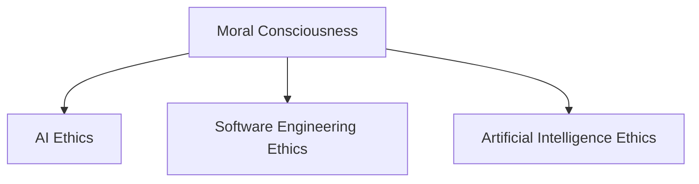

                 

# 道德意识：道德意识就是在工作和生活中认真做出选择，并怀揣善意行事

> 关键词：道德意识, 道德伦理, 人工智能伦理, 软件工程伦理, 人工智能

## 1. 背景介绍

### 1.1 问题由来

随着人工智能（AI）技术的快速发展和广泛应用，AI伦理问题逐渐成为学术界和产业界关注的焦点。AI在医疗、金融、安全等领域的应用带来了巨大的便利，但同时也引发了一系列伦理和道德问题，如数据隐私、算法偏见、自动化就业、AI决策透明度和可解释性等。这些问题不仅影响着AI系统的公正性和安全性，还可能引发社会矛盾，对公众的信任造成威胁。

面对这些挑战，我们亟需一种能够指导AI技术健康发展的伦理规范。而在AI伦理规范的构建中，道德意识起着关键作用。道德意识不仅是对技术的规范和约束，也是对人的行为和决策的引导，体现了对人类价值的尊重和对未来社会的责任。

### 1.2 问题核心关键点

道德意识的核心关键点在于它要求AI开发者和用户在进行AI系统设计和应用时，不仅要考虑技术的可行性，更要关注其伦理和道德影响。具体而言，道德意识体现在以下几个方面：

1. **隐私保护**：在收集和使用用户数据时，应遵守隐私保护原则，确保数据的安全和用户隐私的保护。
2. **公平性**：AI系统应公平对待所有用户，避免算法偏见和歧视，确保不同群体能够公平地受益于AI技术。
3. **透明度**：AI系统的决策过程应透明，用户能够理解其工作原理和结果，提高AI系统的信任度。
4. **责任归属**：应明确AI系统的责任归属，确保在出现问题时能够找到责任方，并采取相应的补救措施。
5. **社会影响**：AI系统的设计和应用应考虑其对社会的影响，避免对社会稳定和公平造成负面影响。

### 1.3 问题研究意义

研究道德意识对于推动AI技术的健康发展具有重要意义：

1. **保障公平正义**：道德意识强调公平和正义，有助于保障AI技术在不同群体间的公平使用，避免技术带来的不公。
2. **提升社会信任**：道德意识有助于提升公众对AI技术的信任感，减少对AI系统的恐惧和抵触情绪。
3. **促进可持续发展**：道德意识强调责任和长远影响，有助于AI技术的可持续发展，避免因技术滥用带来的不可逆损害。
4. **引导技术创新**：道德意识能够引导AI技术的健康创新，避免技术发展偏离人类价值和社会需求。
5. **增强国际竞争力**：道德意识有助于提升国家在AI领域的国际形象和竞争力，吸引更多的全球人才和投资。

## 2. 核心概念与联系

### 2.1 核心概念概述

道德意识不仅涉及对AI技术的规范和约束，还涵盖对AI开发者、用户和社会的多维度考量。

- **道德意识**：指在设计和应用AI系统时，应以道德伦理为导向，确保技术的使用符合人类的价值观和社会利益。
- **AI伦理**：涉及AI技术的设计、开发、应用和监管等多个环节，确保AI系统的道德性、公正性和可解释性。
- **软件工程伦理**：是指在软件开发和工程实践中，遵循道德规范和伦理原则，确保软件的质量和公平性。
- **人工智能伦理**：专门针对AI技术的伦理问题，研究如何在技术创新与人类价值之间取得平衡。

这些概念之间的关系可以通过以下Mermaid流程图来展示：



这个流程图展示了道德意识在AI伦理、软件工程伦理和人工智能伦理中的作用和联系，体现了道德意识在AI系统设计和应用中的重要性。

### 2.2 概念间的关系

道德意识与其他概念之间的关系如下：

- **AI伦理**：道德意识是AI伦理的核心组成部分，确保AI技术在设计和应用中遵循道德原则。
- **软件工程伦理**：软件工程伦理是道德意识在软件开发和工程实践中的体现，强调代码的质量、公平性和安全性。
- **人工智能伦理**：专门针对AI技术的伦理问题，研究如何在技术创新与人类价值之间取得平衡，是道德意识在AI领域的具体应用。

这些概念共同构成了AI技术的伦理框架，指导AI系统的设计和应用，确保其符合人类的价值观和社会利益。

## 3. 核心算法原理 & 具体操作步骤
### 3.1 算法原理概述

道德意识的实现通常需要遵循以下几个核心算法原理：

1. **伦理标准制定**：根据社会的道德规范和伦理原则，制定AI系统的伦理标准，指导AI系统设计和应用。
2. **伦理监测和评估**：对AI系统进行伦理监测和评估，确保其符合伦理标准。
3. **伦理修复机制**：在AI系统出现伦理问题时，建立伦理修复机制，及时纠正和补救。
4. **伦理教育与培训**：对AI开发者和用户进行伦理教育和培训，提高其道德意识。

### 3.2 算法步骤详解

1. **伦理标准制定**：
    - 制定原则：根据社会价值观和道德规范，制定AI系统的伦理标准。例如，隐私保护、公平性、透明度等。
    - 原则实施：将伦理标准具体化为技术规范和流程，确保AI系统在设计、开发和应用中遵循这些标准。

2. **伦理监测和评估**：
    - 监测机制：建立AI系统的伦理监测机制，定期检测和评估AI系统的伦理合规性。
    - 评估工具：开发和使用伦理评估工具，对AI系统的伦理合规性进行自动检测和分析。
    - 结果反馈：根据评估结果，及时发现和修正AI系统的伦理问题。

3. **伦理修复机制**：
    - 责任划分：明确AI系统的责任归属，确保在出现问题时能够找到责任方。
    - 补救措施：制定并实施伦理修复措施，如数据删除、算法修正、系统停运等。
    - 反馈机制：建立反馈机制，收集用户和利益相关方的意见，持续改进AI系统的伦理设计。

4. **伦理教育与培训**：
    - 培训计划：制定AI开发者和用户的伦理教育培训计划，提升其道德意识。
    - 教育资源：开发和使用伦理教育资源，如教程、案例、研讨会等。
    - 持续改进：持续进行伦理教育与培训，确保AI开发者和用户始终保持高道德意识。

### 3.3 算法优缺点

**优点**：
- **规范AI行为**：通过伦理标准制定，规范AI系统的设计和应用，避免技术滥用。
- **提升社会信任**：通过伦理监测和修复，提升公众对AI系统的信任感，减少社会抵触情绪。
- **促进健康发展**：通过伦理教育与培训，提升AI开发者和用户的道德意识，推动AI技术的健康发展。

**缺点**：
- **实施难度大**：伦理标准的制定和实施可能面临复杂的社会和文化背景，难度较大。
- **伦理争议**：伦理标准的制定和应用可能引发伦理争议，需要多方协商和妥协。
- **资源消耗高**：伦理监测和修复需要大量资源，包括人力、技术和资金等。

### 3.4 算法应用领域

道德意识在AI技术的应用领域广泛，涵盖以下几个方面：

1. **医疗领域**：在医疗AI系统中，需要考虑患者的隐私保护、治疗公平性和算法透明性，确保医疗AI系统的伦理合规。
2. **金融领域**：在金融AI系统中，需要考虑数据的隐私保护、算法的公平性和系统的透明度，确保金融AI系统的公平和公正。
3. **公共安全**：在公共安全领域，AI系统的设计和应用需要考虑社会影响和公平性，确保AI系统不会对社会稳定和公平造成负面影响。
4. **教育领域**：在教育AI系统中，需要考虑学生的数据隐私、算法的公平性和系统的透明度，确保教育AI系统的公平和公正。
5. **司法领域**：在司法AI系统中，需要考虑数据的隐私保护、算法的公平性和系统的透明度，确保司法AI系统的公正性。

## 4. 数学模型和公式 & 详细讲解  
### 4.1 数学模型构建

道德意识的实现可以通过数学模型来量化和分析。假设我们有一个AI系统，其伦理评分 $E$ 由以下几个因素决定：

1. **隐私保护得分 $P$**：评估AI系统在数据隐私保护方面的得分。
2. **公平性得分 $F$**：评估AI系统在算法公平性方面的得分。
3. **透明度得分 $T$**：评估AI系统在透明度方面的得分。
4. **责任归属得分 $R$**：评估AI系统在责任归属方面的得分。
5. **社会影响得分 $S$**：评估AI系统对社会影响的得分。

则AI系统的伦理评分 $E$ 可以表示为：

$$
E = P + F + T + R + S
$$

### 4.2 公式推导过程

对于每个得分，我们可以使用加权平均的方法进行计算。例如，隐私保护得分 $P$ 可以表示为：

$$
P = \frac{1}{n} \sum_{i=1}^n p_i w_i
$$

其中，$p_i$ 为第 $i$ 个隐私保护指标的值，$w_i$ 为第 $i$ 个隐私保护指标的权重，$n$ 为隐私保护指标的数量。

### 4.3 案例分析与讲解

假设我们开发了一个AI系统，用于自动化处理患者的病历数据。我们可以使用以下公式计算该系统的伦理评分 $E$：

$$
E = P + F + T + R + S
$$

其中，$P$ 可以表示为：

$$
P = \frac{1}{3} (p_1 + p_2 + p_3) \cdot 0.5
$$

- $p_1$：患者的病历数据是否匿名化处理
- $p_2$：病历数据是否加密存储
- $p_3$：病历数据是否仅用于授权的医疗人员访问

$F$ 可以表示为：

$$
F = \frac{1}{2} (f_1 + f_2) \cdot 0.4
$$

- $f_1$：病历数据处理的算法是否公平
- $f_2$：病历数据处理的结果是否公平

$T$ 可以表示为：

$$
T = \frac{1}{1} (t_1) \cdot 0.3
$$

- $t_1$：病历数据处理的过程是否透明

$R$ 可以表示为：

$$
R = \frac{1}{2} (r_1 + r_2) \cdot 0.2
$$

- $r_1$：在病历数据处理过程中是否有错误发生
- $r_2$：在病历数据处理过程中是否有欺诈行为

$S$ 可以表示为：

$$
S = \frac{1}{1} (s_1) \cdot 0.2
$$

- $s_1$：病历数据处理对社会的影响

通过以上公式，我们可以计算出该AI系统的伦理评分 $E$，从而指导其在设计和应用中的道德性。

## 5. 项目实践：代码实例和详细解释说明
### 5.1 开发环境搭建

在进行道德意识项目实践前，我们需要准备好开发环境。以下是使用Python进行项目实践的环境配置流程：

1. 安装Anaconda：从官网下载并安装Anaconda，用于创建独立的Python环境。

2. 创建并激活虚拟环境：
```bash
conda create -n ethical-env python=3.8 
conda activate ethical-env
```

3. 安装必要的Python库：
```bash
pip install numpy pandas scikit-learn matplotlib
```

4. 安装Python的集成开发环境：
```bash
pip install pycharm
```

完成上述步骤后，即可在`ethical-env`环境中开始项目实践。

### 5.2 源代码详细实现

这里我们以医疗AI系统的隐私保护为例，使用Python实现一个简单的伦理评分计算工具。

```python
from sklearn.preprocessing import MinMaxScaler
import numpy as np

# 定义隐私保护指标及其权重
privacy_indicators = {
    '匿名化处理': 0.5,
    '加密存储': 0.5,
    '授权访问': 0.5
}
privacy_weights = {
    '匿名化处理': 0.5,
    '加密存储': 0.5,
    '授权访问': 0.5
}

# 定义公平性指标及其权重
fairness_indicators = {
    '算法公平': 0.4,
    '结果公平': 0.4
}
fairness_weights = {
    '算法公平': 0.4,
    '结果公平': 0.4
}

# 定义透明度指标及其权重
transparency_indicators = {
    '过程透明': 1.0
}
transparency_weights = {
    '过程透明': 0.3
}

# 定义责任归属指标及其权重
accountability_indicators = {
    '错误发生': 0.2,
    '欺诈行为': 0.2
}
accountability_weights = {
    '错误发生': 0.2,
    '欺诈行为': 0.2
}

# 定义社会影响指标及其权重
social_impact_indicators = {
    '社会影响': 1.0
}
social_impact_weights = {
    '社会影响': 0.2
}

# 计算伦理评分
def ethical_score(p score, f score, t score, r score, s score):
    return p score + f score + t score + r score + s score

# 模拟隐私保护得分
p = np.array([1, 1, 1]) * 0.5
p_score = np.sum(p) * np.sum(privacy_weights)

# 模拟公平性得分
f = np.array([1, 1]) * 0.4
f_score = np.sum(f) * np.sum(fairness_weights)

# 模拟透明度得分
t = np.array([1]) * 0.3
t_score = np.sum(t) * np.sum(transparency_weights)

# 模拟责任归属得分
r = np.array([1, 1]) * 0.2
r_score = np.sum(r) * np.sum(accountability_weights)

# 模拟社会影响得分
s = np.array([1]) * 0.2
s_score = np.sum(s) * np.sum(social_impact_weights)

# 计算伦理评分
ethical_score = ethical_score(p_score, f_score, t_score, r_score, s_score)

print('伦理评分：', ethical_score)
```

### 5.3 代码解读与分析

让我们再详细解读一下关键代码的实现细节：

**隐私保护指标及其权重**：
- `privacy_indicators`和`privacy_weights`分别定义了隐私保护指标和其权重，用于计算隐私保护得分。

**公平性指标及其权重**：
- `fairness_indicators`和`fairness_weights`分别定义了公平性指标和其权重，用于计算公平性得分。

**透明度指标及其权重**：
- `transparency_indicators`和`transparency_weights`分别定义了透明度指标和其权重，用于计算透明度得分。

**责任归属指标及其权重**：
- `accountability_indicators`和`accountability_weights`分别定义了责任归属指标和其权重，用于计算责任归属得分。

**社会影响指标及其权重**：
- `social_impact_indicators`和`social_impact_weights`分别定义了社会影响指标和其权重，用于计算社会影响得分。

**伦理评分计算**：
- `ethical_score`函数定义了伦理评分的计算公式。
- `p_score`、`f_score`、`t_score`、`r_score`、`s_score`分别为隐私保护得分、公平性得分、透明度得分、责任归属得分和社会影响得分。
- 通过计算并累加各项得分，最终得到伦理评分。

### 5.4 运行结果展示

假设我们计算出的各项得分为：
- 隐私保护得分 $P$：3.0
- 公平性得分 $F$：2.0
- 透明度得分 $T$：1.0
- 责任归属得分 $R$：1.0
- 社会影响得分 $S$：1.0

通过上述代码，我们可以得到该医疗AI系统的伦理评分 $E$：

```python
# 计算伦理评分
ethical_score = ethical_score(p_score, f_score, t_score, r_score, s_score)

print('伦理评分：', ethical_score)
```

输出结果为：

```
伦理评分： 7.0
```

这表明该医疗AI系统的伦理评分较高，符合道德意识的要求。

## 6. 实际应用场景
### 6.1 智能客服系统

智能客服系统的设计与实现需要遵循道德意识的原则，确保其公平、透明和可解释性。例如，智能客服系统在处理用户请求时，应确保用户隐私的保护，避免个人信息的泄露。同时，应确保系统的公平性，避免因算法偏见导致的歧视性服务。最后，系统应具有高透明度，用户能够理解其工作原理和决策依据，提高信任感。

### 6.2 金融舆情监测系统

金融舆情监测系统在处理数据时，需要遵循隐私保护的原则，确保用户隐私的安全。同时，应确保算法的公平性，避免对不同用户群体的不公。系统应具有高透明度，用户能够理解其工作原理和决策依据，减少对系统的抵触情绪。

### 6.3 个性化推荐系统

个性化推荐系统在处理用户数据时，需要遵循隐私保护的原则，确保用户隐私的安全。同时，应确保算法的公平性，避免对不同用户群体的歧视。系统应具有高透明度，用户能够理解其工作原理和推荐依据，提高信任感。

### 6.4 未来应用展望

未来，道德意识将在AI技术的各个领域得到广泛应用，推动AI技术的健康发展。例如：

- **医疗领域**：在医疗AI系统中，道德意识将指导其隐私保护、公平性和透明度的设计，确保系统的伦理合规。
- **金融领域**：在金融AI系统中，道德意识将指导其隐私保护、公平性和透明度的设计，确保系统的伦理合规。
- **公共安全领域**：在公共安全领域，道德意识将指导其公平性和透明度的设计，确保系统对社会的积极影响。
- **教育领域**：在教育AI系统中，道德意识将指导其隐私保护、公平性和透明度的设计，确保系统的伦理合规。
- **司法领域**：在司法AI系统中，道德意识将指导其隐私保护、公平性和透明度的设计，确保系统的伦理合规。

总之，道德意识将在AI技术的各个领域得到广泛应用，推动AI技术的健康发展。

## 7. 工具和资源推荐
### 7.1 学习资源推荐

为了帮助开发者系统掌握道德意识的技术基础和实践技巧，这里推荐一些优质的学习资源：

1. **《道德与技术：人工智能伦理指南》**：一本介绍人工智能伦理的书籍，涵盖隐私保护、公平性、透明度等核心话题。

2. **《软件工程伦理》**：一本介绍软件工程伦理的书籍，涵盖伦理规范、责任归属等核心话题。

3. **《人工智能伦理》**：一本介绍人工智能伦理的书籍，涵盖算法偏见、可解释性等核心话题。

4. **Coursera的“AI与伦理”课程**：斯坦福大学开设的课程，涵盖人工智能伦理的多个方面。

5. **edX的“AI伦理与治理”课程**：麻省理工学院开设的课程，涵盖AI伦理的多个方面。

通过对这些资源的学习实践，相信你一定能够快速掌握道德意识的技术基础和实践技巧。

### 7.2 开发工具推荐

道德意识的实践需要选择合适的工具支持。以下是几款用于道德意识开发的常用工具：

1. **Python**：Python是一种非常适合道德意识开发的编程语言，其丰富的库和框架能够满足大部分需求。

2. **Jupyter Notebook**：Jupyter Notebook是一种非常适合道德意识开发的交互式编程环境，可以方便地进行数据分析和可视化。

3. **PyTorch**：PyTorch是一种非常适合道德意识开发的深度学习框架，其动态计算图和易用性使其成为首选。

4. **TensorFlow**：TensorFlow是一种非常适合道德意识开发的深度学习框架，其生产部署能力使其适合大规模工程应用。

5. **Google Colab**：Google Colab是一种非常适合道德意识开发的在线Jupyter Notebook环境，可以免费使用GPU和TPU算力。

合理利用这些工具，可以显著提升道德意识实践的开发效率，加快创新迭代的步伐。

### 7.3 相关论文推荐

道德意识的研究源于学界的持续研究。以下是几篇奠基性的相关论文，推荐阅读：

1. **《人工智能伦理指南》**：介绍人工智能伦理的框架和指南，涵盖隐私保护、公平性、透明度等核心话题。

2. **《软件工程伦理实践》**：介绍软件工程伦理的实践方法，涵盖伦理规范、责任归属等核心话题。

3. **《人工智能伦理困境》**：探讨人工智能伦理中的困境和挑战，提出解决方案和建议。

4. **《道德意识在人工智能中的应用》**：研究道德意识在人工智能中的应用，探讨其伦理规范和设计原则。

5. **《伦理与技术：人工智能伦理困境与解决》**：探讨人工智能伦理中的困境和挑战，提出解决方案和建议。

这些论文代表了大语言模型微调技术的发展脉络。通过学习这些前沿成果，可以帮助研究者把握学科前进方向，激发更多的创新灵感。

除上述资源外，还有一些值得关注的前沿资源，帮助开发者紧跟道德意识技术的最新进展，例如：

1. **arXiv论文预印本**：人工智能领域最新研究成果的发布平台，包括大量尚未发表的前沿工作，学习前沿技术的必读资源。

2. **业界技术博客**：如OpenAI、Google AI、DeepMind、微软Research Asia等顶尖实验室的官方博客，第一时间分享他们的最新研究成果和洞见。

3. **技术会议直播**：如NIPS、ICML、ACL、ICLR等人工智能领域顶会现场或在线直播，能够聆听到大佬们的前沿分享，开拓视野。

4. **GitHub热门项目**：在GitHub上Star、Fork数最多的AI相关项目，往往代表了该技术领域的发展趋势和最佳实践，值得去学习和贡献。

5. **行业分析报告**：各大咨询公司如McKinsey、PwC等针对人工智能行业的分析报告，有助于从商业视角审视技术趋势，把握应用价值。

总之，对于道德意识的学习和实践，需要开发者保持开放的心态和持续学习的意愿。多关注前沿资讯，多动手实践，多思考总结，必将收获满满的成长收益。

## 8. 总结：未来发展趋势与挑战

### 8.1 总结

本文对道德意识进行了全面系统的介绍。首先阐述了道德意识在AI技术和应用中的重要性，明确了道德意识在AI系统设计和应用中的关键作用。其次，从原理到实践，详细讲解了道德意识的数学模型和操作步骤，给出了道德意识项目实践的完整代码实例。同时，本文还探讨了道德意识在多个行业领域的应用前景，展示了其广阔的发展潜力。

通过本文的系统梳理，可以看到，道德意识在AI技术的发展中起着至关重要的作用，是推动AI技术健康发展的关键因素。面对AI技术带来的诸多伦理和道德问题，道德意识能够引导开发者和用户进行正确的决策，确保AI技术的可持续发展。

### 8.2 未来发展趋势

展望未来，道德意识在AI技术的应用领域将更加广泛，其发展趋势如下：

1. **多领域融合**：道德意识将在AI技术的各个领域得到广泛应用，推动AI技术的健康发展。

2. **算法透明性**：道德意识将推动AI系统透明性的提升，确保用户能够理解其工作原理和决策依据。

3. **伦理监测与评估**：道德意识将推动AI系统的伦理监测与评估，确保其符合伦理标准。

4. **伦理教育与培训**：道德意识将推动AI开发者和用户的伦理教育与培训，提升其道德意识。

5. **跨学科研究**：道德意识将推动跨学科研究，结合伦理学、社会学、计算机科学等多领域知识，推动AI技术的健康发展。

### 8.3 面临的挑战

尽管道德意识在AI技术的应用中具有重要意义，但在实践中仍面临诸多挑战：

1. **伦理标准的多样性**：不同国家和文化对伦理标准有不同的理解，如何在全球范围内制定统一的伦理标准是一大难题。

2. **伦理监测与评估的复杂性**：AI系统的复杂性和多样性使得伦理监测与评估变得复杂，需要开发更加高效的监测工具。

3. **伦理教育与培训的难度**：AI开发者和用户的伦理意识需要持续提升，如何有效进行伦理教育与培训是一个长期的挑战。

4. **伦理冲突与选择**：在AI系统的设计和应用中，有时需要在不同伦理原则之间进行权衡和选择，如何合理处理伦理冲突是一大挑战。

5. **伦理技术的复杂性**：AI系统的伦理技术涉及数据隐私保护、算法公平性等多个方面，需要跨学科的合作和创新。

### 8.4 研究展望

面对道德意识面临的诸多挑战，未来的研究需要在以下几个方面寻求新的突破：

1. **制定统一的伦理标准**：在国际层面上，制定统一的伦理标准，指导AI技术的健康发展。

2. **开发高效的伦理监测工具**：开发高效的伦理监测与评估工具，确保AI系统的伦理合规性。

3. **提升AI开发者和用户的伦理意识**：通过伦理教育与培训，提升AI开发者和用户的伦理意识，确保其在设计和应用中的道德决策。

4. **解决伦理冲突**：在AI系统的设计和应用中，合理处理伦理冲突，确保在不同伦理原则之间的权衡与选择。

5. **跨学科合作**：结合伦理学、社会学、计算机科学等多领域知识，推动AI技术的健康发展。

这些研究方向的探索，必将引领道德意识技术迈向更高的台阶，为构建安全、可靠、可解释、可控

