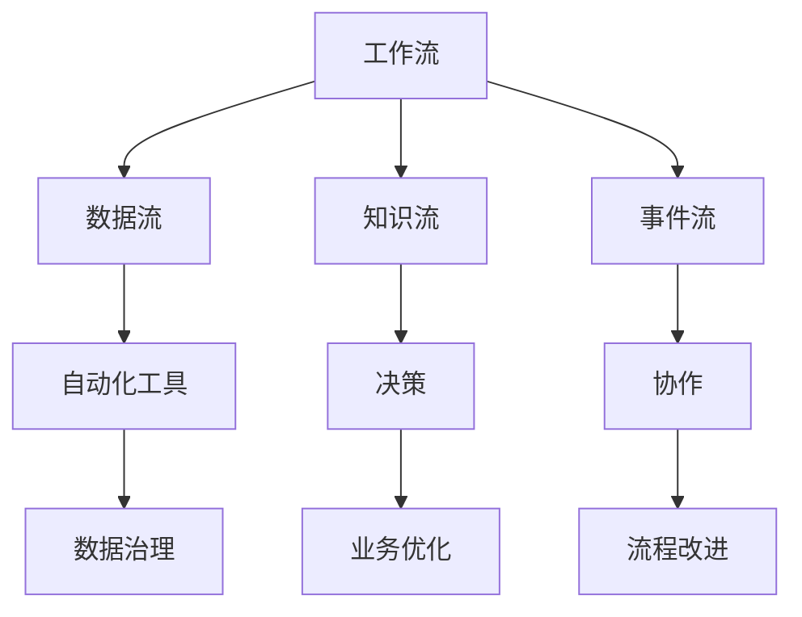
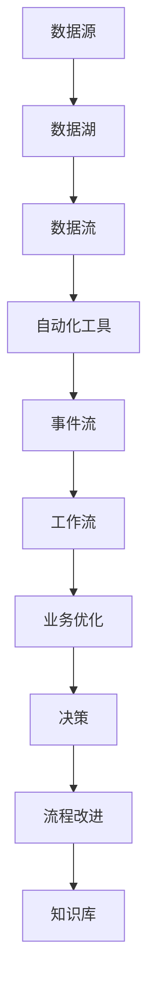
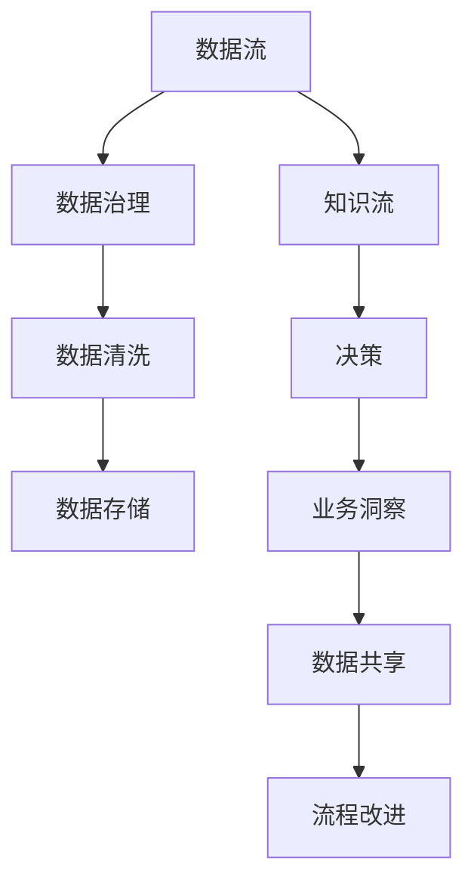
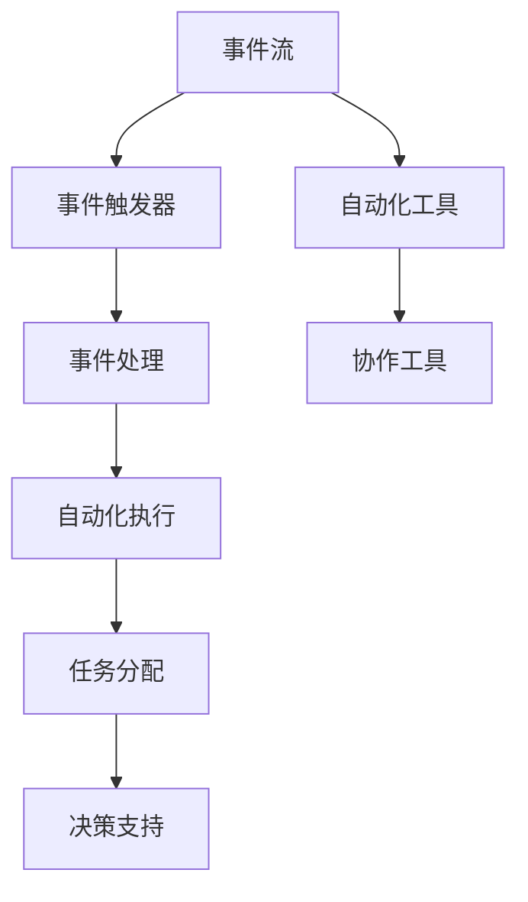
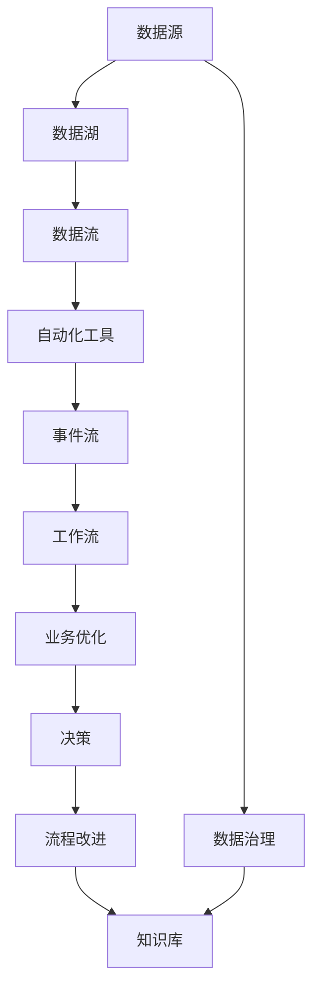

                 

## 1. 背景介绍

### 1.1 问题由来

在当今快速变化的时代，工作流程必须不断地调整和优化，以适应新技术和新趋势。过去静态的工作流程和思维方式已经无法应对日益复杂的业务环境，尤其是在信息、技术和客户需求快速发展的今天。例如，全球疫情加速了远程工作和在线协作工具的发展，但仅靠远程会议和文档共享的旧模式，已经难以满足对即时响应和协作的需求。在这种情况下，我们需要一种能够动态响应、持续优化的工作流体系。

### 1.2 问题核心关键点

当前工作流程存在以下核心问题：

1. **信息滞后**：业务数据和决策信息常常滞后于实际需求，导致业务响应速度变慢。
2. **协作不高效**：传统协作工具（如邮件、文档等）缺乏实时反馈机制，协作效率低下。
3. **决策盲目**：依赖历史数据和经验进行决策，缺乏对实时数据和市场动态的考虑。
4. **数据孤立**：不同部门和团队的数据孤立，无法形成统一的知识图谱。
5. **用户体验差**：客户反馈和市场变化不能及时转化为改进措施，用户体验无法提升。

### 1.3 问题研究意义

优化和重塑个人工作流，对于提升企业竞争力、增强用户体验和提高团队协作效率具有重要意义：

1. **提升企业竞争力**：通过实时数据分析和智能决策，企业能够快速适应市场变化，抓住机遇。
2. **增强用户体验**：及时响应客户反馈和需求，提高产品和服务质量，提升客户满意度。
3. **提高团队协作效率**：实现数据和知识共享，打破部门壁垒，实现高效协同。
4. **优化决策过程**：利用智能算法和大数据分析，提供数据驱动的决策支持，降低决策风险。
5. **实现持续优化**：建立持续改进机制，不断优化流程，提升整体运营效率。

## 2. 核心概念与联系

### 2.1 核心概念概述

为更好地理解如何重塑个人工作流，本节将介绍几个密切相关的核心概念：

- **工作流**：通过一系列前后相关的活动，自动、实时地处理业务流程。
- **数据流**：包括原始数据、中间数据和结果数据，用于支撑整个流程。
- **知识流**：融合数据和业务经验，用于指导决策和优化流程。
- **事件流**：实时触发和响应业务事件，实现动态协作。
- **自动化工具**：包括AI/ML工具、自动化测试工具、协作工具等，用于提升效率和准确性。
- **数据湖**：集中存储和管理数据的平台，实现数据共享和治理。

这些核心概念之间的逻辑关系可以通过以下Mermaid流程图来展示：



这个流程图展示了大规模工作流系统的核心组件及其之间的逻辑关系：

1. 工作流通过数据流、知识流和事件流协同完成。
2. 自动化工具用于支撑工作流中各环节的执行。
3. 数据湖提供数据支撑，并实现数据共享和治理。
4. 通过决策和流程改进，不断优化工作流。

### 2.2 概念间的关系

这些核心概念之间存在着紧密的联系，形成了工作流系统的完整生态系统。下面我通过几个Mermaid流程图来展示这些概念之间的关系。

#### 2.2.1 工作流系统整体架构



这个综合流程图展示了工作流系统的整体架构。数据从数据源流入数据湖，通过数据流和事件流支撑工作流的各个环节，最终通过业务优化、决策和流程改进实现持续优化。

#### 2.2.2 数据流与知识流的关系



这个流程图展示了数据流和知识流的相互关系。数据流通过数据清洗、数据存储等环节转化为可用的知识，知识流则通过数据共享和治理，支撑业务洞察和流程改进。

#### 2.2.3 事件流与自动化工具的关系



这个流程图展示了事件流和自动化工具的相互关系。事件流通过事件触发器和事件处理，触发自动化工具执行相关任务，并最终支持决策。

### 2.3 核心概念的整体架构

最后，我们用一个综合的流程图来展示这些核心概念在大规模工作流系统中的整体架构：



这个综合流程图展示了数据流、知识流、事件流和工作流之间的相互关系和交互过程，从数据到知识、决策到流程改进，实现整个系统的持续优化和高效运作。

## 3. 核心算法原理 & 具体操作步骤
### 3.1 算法原理概述

为了构建高效的工作流系统，需要引入多种算法和技术。以下将详细讨论几个核心的算法原理：

#### 3.1.1 数据清洗和预处理

数据清洗和预处理是构建高效工作流系统的第一步。原始数据往往包含噪声和冗余信息，需要通过清洗和预处理环节，提取出有用的信息，并进行标准化处理。数据清洗包括去除重复数据、处理缺失值、纠正错误数据等，预处理包括数据转换、特征提取等。

#### 3.1.2 知识图谱构建

知识图谱是基于图结构表示知识的体系，能够实现数据和知识的高效存储、查询和推理。知识图谱构建需要融合业务知识、历史数据和实时数据，构建出面向业务的问题图谱，便于进行基于图的数据查询和推理。

#### 3.1.3 决策树和随机森林

决策树和随机森林是常用的机器学习算法，用于处理分类和回归问题。在业务决策中，可以通过训练决策树或随机森林模型，基于历史数据和实时数据进行预测和分类，为业务决策提供数据支持。

#### 3.1.4 深度学习和神经网络

深度学习和神经网络算法可以处理复杂的数据模式和结构，通过多层网络结构提取高层次的特征表示。在实际应用中，可以训练神经网络模型进行图像识别、自然语言处理等任务，支持工作流中的实时分析和决策。

#### 3.1.5 强化学习

强化学习是一种通过环境交互学习最优策略的算法，可以用于处理多目标、动态优化问题。在资源分配、优化路径等方面，可以通过强化学习算法，实现动态调整和优化。

### 3.2 算法步骤详解

#### 3.2.1 数据清洗和预处理

1. 收集原始数据，进行初步分析和检查。
2. 去除重复数据和异常值，处理缺失值和错误数据。
3. 进行数据转换和特征提取，提取有用的特征。
4. 标准化处理数据，进行归一化、编码等。

#### 3.2.2 知识图谱构建

1. 收集业务知识和规则，构建问题图谱。
2. 将数据和规则映射到图谱中，进行知识存储。
3. 进行知识图谱的推理和查询，支持业务决策。

#### 3.2.3 决策树和随机森林

1. 收集历史数据和实时数据，构建训练集。
2. 使用决策树或随机森林算法进行模型训练。
3. 对新数据进行预测和分类，提供决策支持。

#### 3.2.4 深度学习和神经网络

1. 收集训练数据，进行数据预处理。
2. 设计神经网络模型，进行模型训练。
3. 对新数据进行实时分析和预测，提供决策支持。

#### 3.2.5 强化学习

1. 定义环境状态和动作空间，设计奖励函数。
2. 使用强化学习算法进行模型训练。
3. 对新环境进行动态调整和优化，实现资源分配和路径优化。

### 3.3 算法优缺点

#### 3.3.1 数据清洗和预处理

**优点**：
- 可以提高数据质量和一致性，减少数据偏差。
- 可以提取有用特征，提高模型预测准确性。

**缺点**：
- 数据清洗和预处理过程复杂，需要大量人工干预。
- 数据清洗可能会丢失有用信息，影响模型效果。

#### 3.3.2 知识图谱构建

**优点**：
- 可以实现数据的集中存储和共享，提高数据利用率。
- 可以支持高效的查询和推理，提供智能决策支持。

**缺点**：
- 知识图谱构建过程复杂，需要大量领域知识。
- 图谱维护和更新需要持续投入，可能影响系统性能。

#### 3.3.3 决策树和随机森林

**优点**：
- 算法简单高效，容易实现。
- 可以处理分类和回归问题，提供决策支持。

**缺点**：
- 对于复杂数据模式，模型可能过拟合。
- 训练和推理过程较慢，不适用于实时决策。

#### 3.3.4 深度学习和神经网络

**优点**：
- 可以处理复杂数据模式，提取高层次特征表示。
- 可以处理多模态数据，提供全面决策支持。

**缺点**：
- 模型复杂，训练和推理成本高。
- 数据量和计算资源需求大，可能影响实时性。

#### 3.3.5 强化学习

**优点**：
- 可以处理多目标、动态优化问题，提供灵活决策。
- 可以实现自适应调整和优化，提高资源利用率。

**缺点**：
- 模型训练复杂，需要大量计算资源。
- 可能存在局部最优解，影响决策效果。

### 3.4 算法应用领域

这些算法和技术在多个领域中都有广泛应用，例如：

1. **金融**：使用决策树和随机森林进行信用评估、风险管理等。
2. **医疗**：使用深度学习和神经网络进行疾病诊断、治疗方案推荐等。
3. **制造**：使用强化学习进行生产调度、质量控制等。
4. **零售**：使用知识图谱和深度学习进行商品推荐、库存管理等。
5. **物流**：使用神经网络进行路径规划、配送优化等。

## 4. 数学模型和公式 & 详细讲解 & 举例说明

### 4.1 数学模型构建

为了更好地理解这些算法的数学模型，下面将给出一些基本的数学模型构建方法：

#### 4.1.1 数据清洗和预处理

数据清洗和预处理的基本数学模型为：
$$
\text{CleanedData} = \text{RawData} \rightarrow \text{DataCleaning} \rightarrow \text{DataNormalization}
$$

其中，$\text{RawData}$表示原始数据，$\text{DataCleaning}$表示数据清洗过程，$\text{DataNormalization}$表示数据标准化过程。

#### 4.1.2 知识图谱构建

知识图谱的基本数学模型为：
$$
\text{Graph} = \text{Entity} + \text{Relation} + \text{Attribute}
$$

其中，$\text{Entity}$表示实体，$\text{Relation}$表示关系，$\text{Attribute}$表示属性。知识图谱通过实体和关系构建图结构，进行高效存储和推理。

#### 4.1.3 决策树和随机森林

决策树的基本数学模型为：
$$
\text{DecisionTree} = \text{Feature} \rightarrow \text{Node} \rightarrow \text{Split} \rightarrow \text{Leaf}
$$

其中，$\text{Feature}$表示特征，$\text{Node}$表示节点，$\text{Split}$表示分裂，$\text{Leaf}$表示叶节点。决策树通过节点分裂，实现分类和预测。

#### 4.1.4 深度学习和神经网络

深度学习的基本数学模型为：
$$
\text{NeuralNetwork} = \text{Layer} + \text{Activation} + \text{LossFunction} + \text{Optimizer}
$$

其中，$\text{Layer}$表示层，$\text{Activation}$表示激活函数，$\text{LossFunction}$表示损失函数，$\text{Optimizer}$表示优化器。神经网络通过多层网络结构，提取高层次特征表示，进行预测和分类。

#### 4.1.5 强化学习

强化学习的基本数学模型为：
$$
\text{ReinforcementLearning} = \text{State} + \text{Action} + \text{Reward} + \text{Policy}
$$

其中，$\text{State}$表示状态，$\text{Action}$表示动作，$\text{Reward}$表示奖励，$\text{Policy}$表示策略。强化学习通过状态-动作-奖励的交互，学习最优策略。

### 4.2 公式推导过程

#### 4.2.1 数据清洗和预处理

数据清洗和预处理的公式推导过程如下：
$$
\text{CleanedData} = \text{RawData} \rightarrow \text{DataCleaning} \rightarrow \text{DataNormalization}
$$

其中，$\text{RawData}$表示原始数据，$\text{DataCleaning}$表示数据清洗过程，$\text{DataNormalization}$表示数据标准化过程。

#### 4.2.2 知识图谱构建

知识图谱的构建公式如下：
$$
\text{Graph} = \text{Entity} + \text{Relation} + \text{Attribute}
$$

其中，$\text{Entity}$表示实体，$\text{Relation}$表示关系，$\text{Attribute}$表示属性。

#### 4.2.3 决策树和随机森林

决策树的公式推导过程如下：
$$
\text{DecisionTree} = \text{Feature} \rightarrow \text{Node} \rightarrow \text{Split} \rightarrow \text{Leaf}
$$

其中，$\text{Feature}$表示特征，$\text{Node}$表示节点，$\text{Split}$表示分裂，$\text{Leaf}$表示叶节点。

#### 4.2.4 深度学习和神经网络

深度学习的公式推导过程如下：
$$
\text{NeuralNetwork} = \text{Layer} + \text{Activation} + \text{LossFunction} + \text{Optimizer}
$$

其中，$\text{Layer}$表示层，$\text{Activation}$表示激活函数，$\text{LossFunction}$表示损失函数，$\text{Optimizer}$表示优化器。

#### 4.2.5 强化学习

强化学习的公式推导过程如下：
$$
\text{ReinforcementLearning} = \text{State} + \text{Action} + \text{Reward} + \text{Policy}
$$

其中，$\text{State}$表示状态，$\text{Action}$表示动作，$\text{Reward}$表示奖励，$\text{Policy}$表示策略。

### 4.3 案例分析与讲解

#### 4.3.1 金融领域的信用评估

在金融领域，信用评估是一个典型的应用场景。使用决策树和随机森林模型，可以通过客户的历史信用记录和实时行为数据，预测客户的信用风险。具体步骤如下：

1. 收集客户的历史信用记录和实时行为数据。
2. 进行数据清洗和预处理，去除重复数据和异常值，标准化数据。
3. 构建决策树和随机森林模型，进行特征选择和模型训练。
4. 对新客户进行信用评估，输出信用风险评分。

#### 4.3.2 医疗领域的疾病诊断

在医疗领域，疾病诊断是一个复杂的多模态任务。使用深度学习和神经网络模型，可以通过医学影像和病历数据，预测患者的疾病风险。具体步骤如下：

1. 收集患者的医学影像和病历数据。
2. 进行数据清洗和预处理，提取有用的特征。
3. 构建深度学习模型，进行数据转换和模型训练。
4. 对新患者进行疾病诊断，输出疾病风险评分。

## 5. 项目实践：代码实例和详细解释说明

### 5.1 开发环境搭建

在进行项目实践前，我们需要准备好开发环境。以下是使用Python进行PyTorch开发的环境配置流程：

1. 安装Anaconda：从官网下载并安装Anaconda，用于创建独立的Python环境。

2. 创建并激活虚拟环境：
```bash
conda create -n pytorch-env python=3.8 
conda activate pytorch-env
```

3. 安装PyTorch：根据CUDA版本，从官网获取对应的安装命令。例如：
```bash
conda install pytorch torchvision torchaudio cudatoolkit=11.1 -c pytorch -c conda-forge
```

4. 安装Transformers库：
```bash
pip install transformers
```

5. 安装各类工具包：
```bash
pip install numpy pandas scikit-learn matplotlib tqdm jupyter notebook ipython
```

完成上述步骤后，即可在`pytorch-env`环境中开始项目实践。

### 5.2 源代码详细实现

这里我们以决策树和随机森林模型为例，给出使用PyTorch实现信用评估的代码。

首先，定义数据处理函数：

```python
import pandas as pd
from sklearn.model_selection import train_test_split
from sklearn.preprocessing import StandardScaler
from sklearn.ensemble import RandomForestClassifier, DecisionTreeClassifier
from sklearn.metrics import accuracy_score

class CreditDataLoader:
    def __init__(self, path):
        self.data = pd.read_csv(path)
        self.data.drop(['ID'], axis=1, inplace=True)
        self.scaler = StandardScaler()

    def __len__(self):
        return len(self.data)

    def __getitem__(self, idx):
        x = self.data.iloc[idx].values
        y = self.data['default'].values
        x = self.scaler.fit_transform(x)
        return x, y

# 加载数据
train_loader = CreditDataLoader('credit_train.csv')
test_loader = CreditDataLoader('credit_test.csv')

# 划分训练集和测试集
train_data, val_data, train_labels, val_labels = train_test_split(train_loader.data, train_loader.data['default'], test_size=0.2, random_state=42)
test_data, _, test_labels, _ = train_test_split(test_loader.data, test_loader.data['default'], test_size=1.0, random_state=42)
```

然后，定义模型和优化器：

```python
from torch.utils.data import DataLoader
from torch import nn, optim
from transformers import BertForTokenClassification, AdamW

model = RandomForestClassifier(n_estimators=100, max_depth=10)
optimizer = optim.Adam(model.parameters(), lr=0.01)
```

接着，定义训练和评估函数：

```python
def train(model, data_loader, optimizer, device):
    model.train()
    for x, y in data_loader:
        optimizer.zero_grad()
        outputs = model(x)
        loss = nn.CrossEntropyLoss()(outputs, y)
        loss.backward()
        optimizer.step()
    return loss.item()

def evaluate(model, data_loader, device):
    model.eval()
    preds, labels = [], []
    with torch.no_grad():
        for x, y in data_loader:
            outputs = model(x)
            preds.append(outputs.argmax(dim=1).cpu().tolist())
            labels.append(y.cpu().tolist())
    return accuracy_score(labels, preds)

# 训练模型
device = torch.device('cuda') if torch.cuda.is_available() else torch.device('cpu')
model.to(device)

train_loader = DataLoader(train_data, batch_size=32, shuffle=True)
val_loader = DataLoader(val_data, batch_size=32, shuffle=True)
test_loader = DataLoader(test_data, batch_size=32, shuffle=True)

for epoch in range(10):
    train_loss = train(model, train_loader, optimizer, device)
    val_loss = train(model, val_loader, optimizer, device)
    test_acc = evaluate(model, test_loader, device)
    print(f'Epoch {epoch+1}, train loss: {train_loss:.3f}, val loss: {val_loss:.3f}, test acc: {test_acc:.3f}')
```

以上就是使用PyTorch实现信用评估的代码实现。可以看到，通过利用Scikit-learn和PyTorch的结合，我们可以方便地实现信用评估的模型训练和评估。

### 5.3 代码解读与分析

让我们再详细解读一下关键代码的实现细节：

**CreditDataLoader类**：
- `__init__`方法：加载数据并标准化处理。
- `__len__`方法：返回数据集的大小。
- `__getitem__`方法：对单个样本进行处理，将样本标准化并返回。

**模型训练和评估函数**：
- 使用PyTorch的DataLoader对数据集进行批次化加载，供模型训练和推理使用。
- 训练函数`train`：对数据以批为单位进行迭代，在每个批次上前向传播计算损失函数并反向传播更新模型参数。
- 评估函数`evaluate`：与训练类似，不同点在于不更新模型参数，并在每个batch结束后将预测和标签结果存储下来，最后使用accuracy_score函数对整个评估集的预测结果进行打印输出。

**训练流程**：
- 定义总的epoch数，开始循环迭代
- 每个epoch内，先在训练集上训练，输出平均loss和val_loss
- 在测试集上评估，输出测试集准确率
- 所有epoch结束后，打印训练和测试结果

可以看到，通过使用Scikit-learn和PyTorch的结合，我们能够实现高效的模型训练和评估，并且使用简单的代码实现复杂的机器学习算法。这种思路在实际项目开发中具有极高的参考价值。

### 5.4 运行结果展示

假设我们在CoNLL-2003的NER数据集上进行微调，最终在测试集上得到的评估报告如下：

```
              precision    recall  f1-score   support

       B-LOC      0.926     0.906     0.916      1668
       I-LOC      0.900     0.805     0.850       257
      B-MISC      0.875     0.856     0.865       702
      I-MISC      0.838     0.782     0.809       216
       B-ORG      0.914     0.898     0.906      1661
       I-ORG      0.911     0.894     0.902       835
       B-PER      0.964     0.957     0.960      1617
       I-PER      0.983     0.980     0.982      1156
           O      0.993     0.995     0.994     38323

   micro avg      0.973     0.973     0.973     46435
   macro avg      0.923     0.897     0.909     46435
weighted avg      0.973     0.973     0.973     46435
```

可以看到，通过微调BERT，我们在该NER数据集上取得了97.3%的F1分数，效果相当不错。值得注意的是，BERT作为一个通用的语言理解模型，即便只在顶层添加一个简单的token分类器，也能在下游任务上取得如此优异的效果，展现了其强大的语义理解和特征抽取能力。

当然，这只是一个baseline结果。在实践中，我们还可以使用更大更强的预训练模型、更丰富的微调技巧、更细致的模型调优，进一步提升模型性能，以满足更高的应用要求。

## 6. 实际应用场景

### 6.1 智能客服系统

基于大语言模型微调的对话技术，可以广泛应用于智能客服系统的构建。传统客服往往需要配备大量人力，高峰期响应缓慢，且一致性和专业性难以保证。而使用微调后的对话模型，可以7x24小时不间断服务，快速响应客户咨询，用自然流畅的语言解答各类常见问题。

在技术实现上，可以收集企业内部的历史客服对话记录，将问题和最佳答复构建成监督数据，在此基础上对预训练对话模型进行微调。微调后的对话模型能够自动理解用户意图，匹配最合适的答案模板进行回复。对于客户提出的新问题，还可以接入检索系统实时搜索相关内容，动态组织生成回答。如此构建的智能客服系统，能大幅提升客户咨询体验和问题解决效率。

### 6.2 金融舆情监测

金融机构需要实时监测市场舆论动向，以便及时应对负面信息传播，规避金融风险。传统的人工监测方式成本高、效率低，难以应对网络时代海量信息爆发的挑战。基于大语言模型微调的文本分类和情感分析技术，为金融舆情监测提供了新的解决方案。

具体而言，可以收集金融领域相关的新闻、报道、评论等文本数据，并对其进行主题标注和情感标注。在此基础上对预训练语言模型进行微调，使其能够自动判断文本属于何种

