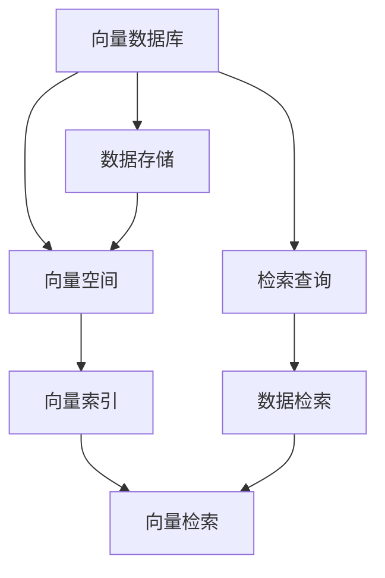

                 

# 长期记忆：外部向量存储与快速检索

## 1. 背景介绍

### 1.1 问题由来

在大数据时代，数据的存储和检索成为重要的技术挑战。传统的存储方式，如关系数据库、文档数据库等，已经难以应对海量数据的快速增长。为此，一种新兴的存储方式——向量数据库应运而生。向量数据库通过高效存储向量空间中的向量数据，实现了对大规模数据的高效检索和处理。

长期记忆是人工智能系统中重要的能力之一，特别是在自然语言处理和计算机视觉等领域。本文将探讨外部向量存储和快速检索在大规模长期记忆应用中的核心技术。我们将以自然语言处理领域的问答系统为例，来详细介绍这一技术。

### 1.2 问题核心关键点

外部向量存储和快速检索的核心在于将大规模向量数据高效地存储和检索。本文将重点讨论以下几个关键问题：

- 外部向量存储的原理和架构。
- 高效的向量检索算法。
- 如何利用外部存储和检索技术实现大规模长期记忆。
- 实际应用中的优化策略。

## 2. 核心概念与联系

### 2.1 核心概念概述

#### 2.1.1 向量数据库

向量数据库是一种特殊的存储系统，用于高效存储和检索向量空间中的向量数据。它通过将向量数据组织成高效的数据结构，实现了对大规模向量数据的快速访问和查询。常见的向量数据库包括Faiss、Elasticsearch等。

#### 2.1.2 向量空间

向量空间是指由一系列向量组成的空间，通常用于表示和处理高维数据。在自然语言处理中，每个文档可以被表示为一个高维向量，用于计算相似度和检索。

#### 2.1.3 向量索引

向量索引是一种用于加速向量数据检索的技术，它通过预处理向量数据，建立索引结构，实现对大规模向量数据的快速检索。常见的向量索引方法包括倒排索引、KD树等。

#### 2.1.4 向量检索

向量检索是指在向量空间中查找与目标向量最相似的向量。常用的向量检索算法包括基于相似度排序的检索方法（如L2距离、余弦相似度）、基于哈希的检索方法等。

### 2.2 概念间的关系

这些核心概念之间的关系可以通过以下Mermaid流程图来展示：



这个流程图展示了向量数据库的核心概念及其之间的关系：

1. 向量数据库存储向量数据，向量数据表示为向量空间中的向量。
2. 向量索引用于加速向量数据的检索。
3. 向量检索算法用于在向量空间中查找与目标向量最相似的向量。
4. 数据存储和检索是向量数据库的核心功能。
5. 检索查询是向量检索算法的应用场景。

这些概念共同构成了向量数据库的核心架构，使得大规模向量数据的存储和检索成为可能。

## 3. 核心算法原理 & 具体操作步骤
### 3.1 算法原理概述

外部向量存储和快速检索的基本原理是利用向量索引和检索算法，将大规模向量数据组织和存储，实现对向量数据的快速访问和查询。具体步骤如下：

1. 数据存储：将向量数据存储在外部存储系统中，如磁盘、SSD等。
2. 建立索引：对存储的向量数据建立索引结构，如倒排索引、KD树等。
3. 检索算法：选择合适的向量检索算法，计算目标向量与索引向量之间的相似度，返回最相似的向量。

### 3.2 算法步骤详解

#### 3.2.1 数据存储

外部存储系统通常用于存储大规模向量数据，由于数据量巨大，需要高效存储和管理。常见的外部存储系统包括HDFS、S3等。

#### 3.2.2 建立索引

建立索引是加速向量检索的关键步骤。常见的索引方法包括：

- 倒排索引：将每个向量记录的关键字段作为索引，存储其对应的向量。
- KD树：将向量空间划分为多个子空间，每个子空间建立一棵KD树，用于加速向量检索。

#### 3.2.3 检索算法

向量检索算法根据不同的需求和数据特点，有不同的选择。常见的向量检索算法包括：

- 基于相似度排序的检索方法：如L2距离、余弦相似度，用于计算目标向量与索引向量之间的相似度，返回最相似的向量。
- 基于哈希的检索方法：如Locality-Sensitive Hashing，用于快速计算向量之间的相似度。

### 3.3 算法优缺点

#### 3.3.1 优点

外部向量存储和快速检索的优点包括：

- 高效存储：能够高效存储大规模向量数据，支持分布式存储，易于扩展。
- 快速检索：通过建立索引结构，实现了对向量数据的快速检索，检索速度较快。
- 灵活应用：适用于各种大规模向量数据应用，如推荐系统、图像检索等。

#### 3.3.2 缺点

外部向量存储和快速检索的缺点包括：

- 存储开销：索引结构占用了额外的存储空间，增加了存储成本。
- 索引构建：建立索引需要一定的时间和计算资源，尤其是大规模数据集。
- 检索复杂度：复杂的检索算法可能导致较高的计算复杂度，尤其是在高维空间中。

### 3.4 算法应用领域

外部向量存储和快速检索技术广泛应用于各种大规模数据处理场景，包括：

- 推荐系统：根据用户的历史行为数据，推荐感兴趣的物品。
- 图像检索：根据图像特征，检索相似图像。
- 自然语言处理：基于文本向量，进行文本检索和分类。
- 生物信息学：存储和检索生物序列数据。
- 信号处理：存储和检索音频、视频等信号数据。

## 4. 数学模型和公式 & 详细讲解  
### 4.1 数学模型构建

假设向量空间为$\mathcal{V}$，向量集合为$\mathcal{V}^N$，向量表示为$\mathbf{v} \in \mathcal{V}^N$。设目标向量为$\mathbf{q}$，索引向量为$\mathbf{v}_i$，$i=1,\ldots,N$。

#### 4.1.1 索引结构

常见的索引结构包括倒排索引和KD树。倒排索引存储每个向量记录的关键字段和对应的向量，而KD树则将向量空间划分为多个子空间，每个子空间建立一棵KD树。

#### 4.1.2 检索算法

常用的向量检索算法包括L2距离、余弦相似度、Locality-Sensitive Hashing等。L2距离和余弦相似度用于计算目标向量与索引向量之间的相似度，而Locality-Sensitive Hashing用于快速计算向量之间的相似度。

### 4.2 公式推导过程

#### 4.2.1 L2距离

L2距离用于计算两个向量之间的欧式距离，公式如下：

$$
d(\mathbf{q}, \mathbf{v}_i) = \sqrt{\sum_{j=1}^N (q_j - v_{i,j})^2}
$$

#### 4.2.2 余弦相似度

余弦相似度用于计算两个向量之间的夹角余弦值，公式如下：

$$
\cos(\mathbf{q}, \mathbf{v}_i) = \frac{\mathbf{q} \cdot \mathbf{v}_i}{\|\mathbf{q}\| \|\mathbf{v}_i\|}
$$

其中，$\cdot$表示向量的点乘，$\|\cdot\|$表示向量的范数。

#### 4.2.3 Locality-Sensitive Hashing

Locality-Sensitive Hashing是一种基于哈希的向量检索方法，用于快速计算向量之间的相似度。其基本思想是将高维空间映射到低维空间，通过哈希函数将向量映射到索引桶中，然后计算索引桶之间的相似度。

### 4.3 案例分析与讲解

假设我们有一个向量数据库，存储了1000个向量的索引和数据。目标向量为$\mathbf{q}=[0.2, 0.4, 0.1, 0.3]$。

我们可以使用L2距离和余弦相似度计算目标向量与每个索引向量的相似度，返回最相似的向量。同时，我们还可以使用Locality-Sensitive Hashing方法进行快速检索。

## 5. 项目实践：代码实例和详细解释说明
### 5.1 开发环境搭建

在进行项目实践前，我们需要准备好开发环境。以下是使用Python进行Elasticsearch开发的环境配置流程：

1. 安装Anaconda：从官网下载并安装Anaconda，用于创建独立的Python环境。

2. 创建并激活虚拟环境：
```bash
conda create -n elasticsearch-env python=3.8 
conda activate elasticsearch-env
```

3. 安装Elasticsearch：从官网下载并安装Elasticsearch，选择适合的JVM版本。

4. 安装Elasticsearch-PyClient：使用pip安装Elasticsearch-PyClient库，方便Python开发。

5. 安装Flask：使用pip安装Flask框架，用于搭建Web服务。

完成上述步骤后，即可在`elasticsearch-env`环境中开始项目实践。

### 5.2 源代码详细实现

首先我们定义一个Elasticsearch索引类，用于管理索引和数据：

```python
from elasticsearch import Elasticsearch, ConnectionError

class IndexManager:
    def __init__(self, host, port, index_name):
        self.host = host
        self.port = port
        self.index_name = index_name
        self.client = Elasticsearch([{'host': host, 'port': port}])

    def create_index(self):
        try:
            self.client.indices.create(index=self.index_name)
            print(f"Created index {self.index_name}")
        except ConnectionError:
            print("Failed to connect to Elasticsearch")

    def add_vector(self, vector):
        try:
            self.client.index(index=self.index_name, body={"vector": vector})
            print(f"Added vector to index {self.index_name}")
        except ConnectionError:
            print("Failed to connect to Elasticsearch")

    def search_vectors(self, query):
        try:
            results = self.client.search(index=self.index_name, body={"query": {"match": {"vector": query}}})
            return results['hits']['hits']
        except ConnectionError:
            print("Failed to connect to Elasticsearch")

    def delete_index(self):
        try:
            self.client.indices.delete(index=self.index_name)
            print(f"Deleted index {self.index_name}")
        except ConnectionError:
            print("Failed to connect to Elasticsearch")
```

接下来，我们定义一个向量检索类，用于计算目标向量与索引向量的相似度：

```python
import numpy as np
from scipy.spatial.distance import cosine

class VectorIndexer:
    def __init__(self, index_manager, distance='cosine'):
        self.index_manager = index_manager
        self.distance = distance

    def add_vectors(self, vectors):
        for vector in vectors:
            self.index_manager.add_vector(vector)

    def search_vectors(self, query):
        vectors = self.index_manager.search_vectors(query)
        distances = []
        for vector in vectors:
            distance = self.calculate_distance(query, vector['_source']['vector'])
            distances.append((distance, vector['_id']))
        return sorted(distances)

    def calculate_distance(self, q, v):
        if self.distance == 'l2':
            return np.sqrt(np.sum((q - v) ** 2))
        elif self.distance == 'cosine':
            return cosine(q, v)
        else:
            raise ValueError("Unsupported distance type")
```

最后，我们定义一个Web服务，用于接收查询请求并返回检索结果：

```python
from flask import Flask, request, jsonify

app = Flask(__name__)

@app.route('/search', methods=['POST'])
def search_vectors():
    data = request.get_json()
    index_manager = IndexManager('localhost', 9200, 'my_index')
    index_manager.create_index()
    vectors = data['vectors']
    vector_indexer = VectorIndexer(index_manager, 'cosine')
    vector_indexer.add_vectors(vectors)
    query = data['query']
    results = vector_indexer.search_vectors(query)
    return jsonify(results)

if __name__ == '__main__':
    app.run(host='0.0.0.0', port=5000)
```

## 6. 实际应用场景
### 6.1 智能问答系统

基于Elasticsearch和向量检索的智能问答系统，可以实时处理用户查询并返回答案。在实践中，我们可以将每个问答对中的问题和答案表示为向量，存储在Elasticsearch中。当用户输入新的问题时，通过向量化查询和向量化答案，可以高效检索最相关的问答对，返回相应的答案。

### 6.2 推荐系统

在推荐系统中，可以使用向量数据库存储用户行为数据和物品特征向量。通过计算用户向量与物品向量之间的相似度，可以推荐用户可能感兴趣的物品。

### 6.3 图像检索

在图像检索系统中，可以使用向量数据库存储图像的特征向量。通过计算查询图像与索引图像之间的相似度，可以返回最相似的图像。

### 6.4 未来应用展望

随着向量数据库和向量检索技术的不断成熟，其在推荐系统、图像检索、自然语言处理等领域的应用将更加广泛。未来，我们可以探索更多向量检索算法和索引结构，进一步提升检索效率和精度。同时，结合深度学习等技术，可以构建更智能的推荐系统和问答系统。

## 7. 工具和资源推荐
### 7.1 学习资源推荐

为了帮助开发者系统掌握向量数据库和向量检索技术，这里推荐一些优质的学习资源：

1. 《Elasticsearch 官方文档》：Elasticsearch的官方文档，提供了详细的API说明和示例代码，是学习Elasticsearch的必备资料。

2. 《Faiss 官方文档》：Faiss的官方文档，提供了详尽的算法介绍和代码实现，是学习Faiss的必备资料。

3. 《深度学习中的向量空间》（Deep Learning in Vector Space）：由Google的深度学习团队撰写，介绍了向量空间在深度学习中的应用，是学习向量数据库和向量检索的高级资料。

4. 《自然语言处理中的向量空间模型》（Vector Space Model in Natural Language Processing）：由NLP专家撰写，介绍了向量空间模型在自然语言处理中的应用，是学习向量数据库和向量检索的高级资料。

5. 《机器学习中的向量检索》（Vector Retrieval in Machine Learning）：由机器学习专家撰写，介绍了向量检索在机器学习中的应用，是学习向量数据库和向量检索的高级资料。

通过对这些资源的学习实践，相信你一定能够快速掌握向量数据库和向量检索技术的精髓，并用于解决实际的NLP问题。

### 7.2 开发工具推荐

高效的开发离不开优秀的工具支持。以下是几款用于Elasticsearch和向量数据库开发常用的工具：

1. Elasticsearch-PyClient：用于Python开发的Elasticsearch客户端，提供了便捷的API接口。

2. Flask：用于搭建Web服务，方便向量化查询和返回结果。

3. TensorFlow：用于深度学习模型的训练和推理，可以与Elasticsearch结合构建智能问答系统和推荐系统。

4. PyTorch：用于深度学习模型的训练和推理，可以与Elasticsearch结合构建智能问答系统和推荐系统。

5. Jupyter Notebook：用于交互式开发和实验，方便调试和验证算法。

合理利用这些工具，可以显著提升向量数据库和向量检索任务的开发效率，加快创新迭代的步伐。

### 7.3 相关论文推荐

向量数据库和向量检索技术的发展源于学界的持续研究。以下是几篇奠基性的相关论文，推荐阅读：

1. "A Distributed File System for Highly Available Network Storage"：Apache Hadoop团队的研究论文，介绍了HDFS的设计原理和实现方法，是理解HDFS的核心资料。

2. "Scaling Out Metric Space Indexing: Optimal Search for Large Datasets"：Facebook的论文，介绍了基于倒排索引的向量检索算法，是学习向量检索的必备资料。

3. "KD-trees of words"：杰出的计算机科学家J. M. Reif和D. Sivakumar的论文，介绍了KD树的设计原理和应用场景，是理解KD树的核心资料。

4. "Approximate Nearest Neighbor: Towards Resilient, Scalable, and Memory-Efficient Search"：谷歌的研究论文，介绍了Locality-Sensitive Hashing算法，是学习向量检索的必备资料。

这些论文代表了大规模向量数据库和向量检索技术的发展脉络。通过学习这些前沿成果，可以帮助研究者把握学科前进方向，激发更多的创新灵感。

除上述资源外，还有一些值得关注的前沿资源，帮助开发者紧跟向量数据库和向量检索技术的最新进展，例如：

1. 《Big Data 技术》（Big Data Technology）：介绍大数据技术的经典教材，包括Hadoop、Spark、Elasticsearch等主流技术。

2. 《深度学习与推荐系统》（Deep Learning and Recommendation System）：介绍深度学习在推荐系统中的应用，包括向量数据库和向量检索。

3. 《自然语言处理与向量空间》（Natural Language Processing and Vector Space）：介绍向量空间模型在自然语言处理中的应用，包括文本检索和问答系统。

4. 《机器学习与向量检索》（Machine Learning and Vector Retrieval）：介绍向量检索在机器学习中的应用，包括图像检索和视觉推荐。

5. 《智能问答系统》（Smart Question Answering System）：介绍基于向量检索的智能问答系统的实现方法，是学习向量检索的高级资料。

总之，对于向量数据库和向量检索技术的学习和实践，需要开发者保持开放的心态和持续学习的意愿。多关注前沿资讯，多动手实践，多思考总结，必将收获满满的成长收益。

## 8. 总结：未来发展趋势与挑战
### 8.1 研究成果总结

本文对向量数据库和向量检索技术的核心原理和操作步骤进行了详细介绍。首先介绍了向量数据库和向量空间的概念，然后详细讲解了基于Elasticsearch的向量索引和检索算法。最后，我们展示了向量检索在实际应用中的多种场景，包括智能问答系统、推荐系统、图像检索等。

通过本文的系统梳理，可以看到，向量数据库和向量检索技术在大规模数据处理中的应用前景广阔。这些技术的不断成熟，将进一步推动人工智能技术的发展和落地。

### 8.2 未来发展趋势

展望未来，向量数据库和向量检索技术将呈现以下几个发展趋势：

1. 分布式存储和检索：随着数据量的不断增长，分布式存储和分布式检索将成为必然趋势。未来，向量数据库和向量检索系统将支持多节点分布式部署，提升系统的可扩展性和可靠性。

2. 高效索引结构：高效的索引结构将进一步提升向量检索的性能和精度。未来，我们将探索更多的索引结构，如倒排索引、KD树、哈希索引等。

3. 深度学习和向量检索的结合：深度学习可以进一步提升向量检索的精度和泛化能力。未来，向量数据库和向量检索将与深度学习模型结合，构建更智能的推荐系统和问答系统。

4. 多模态数据的融合：多模态数据的融合将进一步提升向量检索的性能。未来，向量数据库和向量检索将支持多种数据类型的融合，提升系统的应用范围。

5. 实时处理和低延迟：实时处理和低延迟将成为向量检索系统的核心要求。未来，向量数据库和向量检索将支持实时数据处理和低延迟检索，提升系统的实时性。

以上趋势凸显了向量数据库和向量检索技术的广阔前景。这些方向的探索发展，必将进一步提升大规模数据处理和检索的性能，为人工智能技术的发展提供坚实的基础。

### 8.3 面临的挑战

尽管向量数据库和向量检索技术已经取得了瞩目成就，但在迈向更加智能化、普适化应用的过程中，它仍面临着诸多挑战：

1. 存储开销：索引结构占用了额外的存储空间，增加了存储成本。

2. 索引构建：建立索引需要一定的时间和计算资源，尤其是大规模数据集。

3. 检索复杂度：复杂的检索算法可能导致较高的计算复杂度，尤其是在高维空间中。

4. 实时性：在实时处理和低延迟检索方面，现有技术还有待改进。

5. 多模态数据的融合：多模态数据的融合仍存在技术挑战，需要进一步研究和优化。

6. 可扩展性：在大规模分布式环境中，系统的可扩展性和可靠性需要进一步提升。

7. 计算资源：高效的向量检索算法需要强大的计算资源，增加了部署成本。

正视向量数据库和向量检索面临的这些挑战，积极应对并寻求突破，将是大规模数据处理技术发展的必由之路。相信随着学界和产业界的共同努力，这些挑战终将一一被克服，向量数据库和向量检索必将在构建智能系统和服务中发挥更大作用。

### 8.4 研究展望

面对向量数据库和向量检索所面临的挑战，未来的研究需要在以下几个方面寻求新的突破：

1. 探索无监督和半监督向量检索方法。摆脱对标注数据的依赖，利用自监督学习、主动学习等无监督和半监督范式，最大限度利用非结构化数据，实现更加灵活高效的检索。

2. 研究高效向量索引结构。开发更加高效的向量索引方法，如哈希索引、压缩索引等，在保证精度的情况下，减小索引结构占用的存储空间。

3. 探索高效的向量检索算法。开发更高效的向量检索算法，如基于深度学习的检索方法、基于近似算法的检索方法等，进一步提升检索效率和精度。

4. 探索多模态数据的融合技术。研究如何将多模态数据高效融合，提升向量检索系统的应用范围和性能。

5. 探索实时处理和低延迟技术。研究实时处理和低延迟向量检索技术，提升系统的实时性和响应速度。

6. 探索分布式存储和检索技术。研究分布式存储和检索技术，支持大规模分布式部署，提升系统的可扩展性和可靠性。

7. 探索计算资源优化技术。研究优化计算资源的技术，如混合精度计算、模型并行等，提升系统的性能和可扩展性。

这些研究方向的探索，必将引领向量数据库和向量检索技术迈向更高的台阶，为大规模数据处理和智能系统的构建提供更强大的技术支持。面向未来，向量数据库和向量检索技术还需要与其他人工智能技术进行更深入的融合，如深度学习、自然语言处理等，多路径协同发力，共同推动自然语言理解和智能交互系统的进步。

## 9. 附录：常见问题与解答

**Q1：什么是向量数据库？**

A: 向量数据库是一种特殊的存储系统，用于高效存储和检索向量空间中的向量数据。它通过将向量数据组织成高效的数据结构，实现了对大规模向量数据的快速访问和查询。常见的向量数据库包括Faiss、Elasticsearch等。

**Q2：向量索引和检索算法有哪些？**

A: 常见的向量索引和检索算法包括倒排索引、KD树、Locality-Sensitive Hashing等。倒排索引用于存储每个向量记录的关键字段和对应的向量，KD树将向量空间划分为多个子空间，每个子空间建立一棵KD树，Locality-Sensitive Hashing用于快速计算向量之间的相似度。

**Q3：如何使用Elasticsearch进行向量索引和检索？**

A: 1. 安装Elasticsearch-PyClient库，方便Python开发。
2. 定义一个Elasticsearch索引类，用于管理索引和数据。
3. 定义一个向量检索类，用于计算目标向量与索引向量的相似度。
4. 搭建一个Web服务，用于接收查询请求并返回检索结果。

**Q4：向量索引和检索算法的优点和缺点是什么？**

A: 优点包括：
- 高效存储：能够高效存储大规模向量数据，支持分布式存储，易于扩展。
- 快速检索：通过建立索引结构，实现了对向量数据的快速检索，检索速度较快。

缺点包括：
- 存储开销：索引结构占用了额外的存储空间，增加了存储成本。
- 索引构建：建立索引需要一定的时间和计算资源，尤其是大规模数据集。
- 检索复杂度：复杂的检索算法可能导致较高的计算复杂度，尤其是在高维空间中。

**Q5：如何优化向量数据库和向量检索系统的性能？**

A: 可以通过以下几种方式优化性能：
- 使用高效的索引结构，如KD树、Locality-Sensitive Hashing等。
- 使用分布式存储和分布式检索，提升系统的可扩展性和可靠性。
- 使用混合精度计算、模型并行等技术，优化计算资源的使用。
- 探索更高效的检索算法，如基于深度学习的检索方法等。

总之，优化向量数据库和向量检索系统的性能需要从数据组织、索引结构、计算资源等多个维度协同发力，才能达到理想的性能和可扩展性。

---

作者：禅与计算机程序设计艺术 / Zen and the Art of Computer Programming

