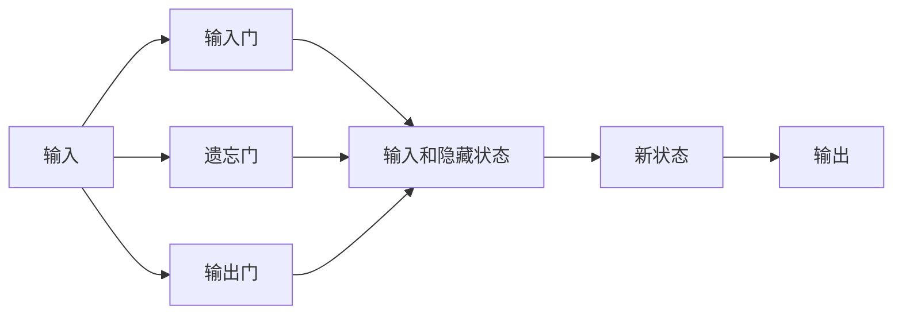
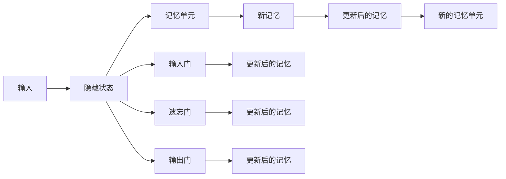
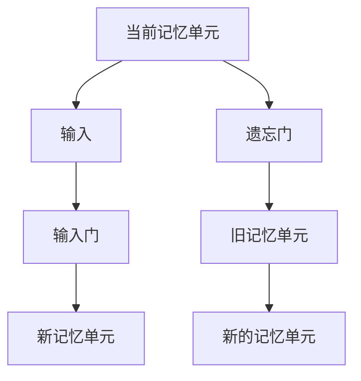
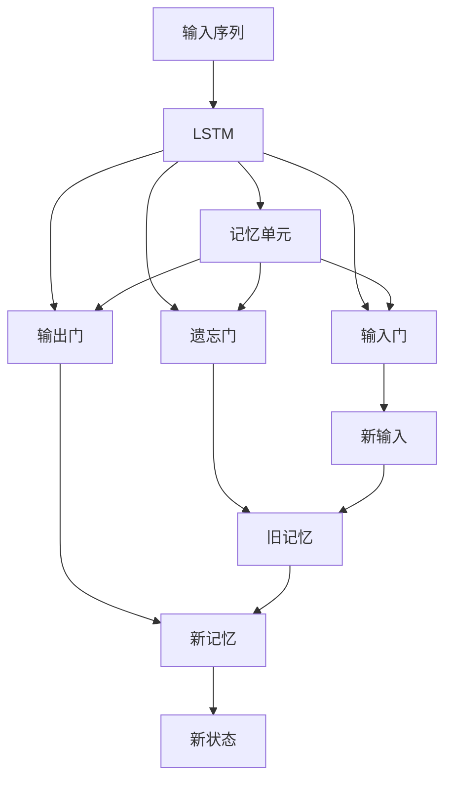

                 

# 长短期记忆网络 (Long Short-Term Memory, LSTM) 原理与代码实例讲解

> 关键词：长短期记忆网络, LSTM, 递归神经网络, 时间序列预测, 时间延迟, 可解释性, 深度学习, Python, TensorFlow

## 1. 背景介绍

### 1.1 问题由来
在处理序列数据（如文本、音频、视频等）时，传统的循环神经网络（Recurrent Neural Network, RNN）面临着梯度消失和梯度爆炸等问题，导致难以捕捉长期依赖关系。长短期记忆网络（Long Short-Term Memory, LSTM）正是为了解决这个问题而提出的。

### 1.2 问题核心关键点
LSTM的核心是引入了“记忆单元”和“门控机制”，通过控制信息的流动，实现了长期依赖的学习，避免了梯度问题，成为了序列模型中的经典架构。LSTM广泛应用于时间序列预测、自然语言处理、语音识别等场景，取得了显著的成果。

### 1.3 问题研究意义
LSTM通过引入门控机制和记忆单元，在深度学习时代引领了序列模型的新一波热潮。它不仅在理论上有重要贡献，在实际应用中也取得了卓越的成效。掌握LSTM的原理和应用，对于从事深度学习和序列模型相关工作的研究者和开发者来说，具有重要意义。

## 2. 核心概念与联系

### 2.1 核心概念概述
为了更好地理解LSTM的原理和应用，本节将介绍几个关键概念：

- 长短期记忆网络（LSTM）：一种特殊的递归神经网络，通过引入门控机制和记忆单元，能够有效处理长期依赖关系。
- 记忆单元（Cell State）：LSTM中的核心组件，用于存储和更新序列信息。
- 门控机制（Gate Mechanism）：包括输入门、遗忘门和输出门，用于控制信息的输入、遗忘和输出。
- 梯度消失/爆炸（Gradient Vanishing/Explosion）：传统RNN在处理长期依赖时，由于梯度反向传播过程中的指数级增长或衰减，导致难以捕捉长期依赖。
- 序列模型：通过RNN、LSTM等模型，能够处理序列数据，捕捉序列中的时间依赖关系。

这些概念之间的逻辑关系可以通过以下Mermaid流程图来展示：


这个流程图展示了LSTM的基本结构：

1. 输入序列数据通过LSTM模型进行处理。
2. 记忆单元存储当前的状态，通过输入门和遗忘门控制信息的流入和流出。
3. 输出门控制输出的信息，输出门和记忆单元的输出作为新的状态。

### 2.2 概念间的关系

这些核心概念之间存在着紧密的联系，形成了LSTM的基本结构和工作机制。下面我通过几个Mermaid流程图来展示这些概念之间的关系。

#### 2.2.1 LSTM的架构



这个流程图展示了LSTM的基本架构。输入通过输入门、遗忘门和输出门三个门控机制，控制信息的流动，最终得到新的状态和输出。

#### 2.2.2 门控机制的作用



这个流程图展示了门控机制的作用：

1. 输入门根据当前输入和隐藏状态，决定是否更新记忆单元。
2. 遗忘门根据当前输入和隐藏状态，决定是否保留旧记忆。
3. 输出门根据当前输入和记忆单元，决定是否输出。

#### 2.2.3 记忆单元的更新



这个流程图展示了记忆单元的更新过程：

1. 新输入通过输入门更新记忆单元。
2. 遗忘门决定是否遗忘旧记忆。
3. 新的记忆单元作为新的状态，参与下一轮的计算。

### 2.3 核心概念的整体架构

最后，我们用一个综合的流程图来展示这些核心概念在LSTM中的整体架构：



这个综合流程图展示了LSTM的核心结构和门控机制的作用。

## 3. 核心算法原理 & 具体操作步骤

### 3.1 算法原理概述

LSTM通过引入门控机制和记忆单元，能够有效处理长期依赖关系，避免了传统RNN的梯度消失和爆炸问题。其核心思想是：

- **输入门（Input Gate）**：决定新输入的信息是否更新记忆单元。
- **遗忘门（Forget Gate）**：决定旧记忆是否保留。
- **输出门（Output Gate）**：决定输出的信息。

通过这三个门控机制，LSTM能够根据当前输入和隐藏状态，动态地更新记忆单元，从而捕捉序列中的长期依赖关系。

### 3.2 算法步骤详解

LSTM的计算流程可以分为三个部分：

1. **输入门计算**：计算新输入的信息，决定是否更新记忆单元。
2. **遗忘门计算**：决定旧记忆是否保留。
3. **更新记忆单元**：根据新输入、遗忘门和旧记忆，更新记忆单元。

具体的计算过程如下：

#### 3.2.1 输入门计算

$$
\begin{aligned}
i_t &= \sigma(W_i h_{t-1} + U_i x_t + b_i) \\
\tilde{c}_t &= \tanh(W_c h_{t-1} + U_c x_t + b_c)
\end{aligned}
$$

其中，$i_t$为输入门的激活值，$\sigma$为Sigmoid函数，$h_{t-1}$为上一时刻的隐藏状态，$x_t$为当前输入，$\tilde{c}_t$为输入门计算得到的候选新记忆。

#### 3.2.2 遗忘门计算

$$
\begin{aligned}
f_t &= \sigma(W_f h_{t-1} + U_f x_t + b_f) \\
c_t &= f_t \odot c_{t-1} + i_t \odot \tilde{c}_t
\end{aligned}
$$

其中，$f_t$为遗忘门的激活值，$\odot$为逐元素乘法，$c_t$为新的记忆单元。

#### 3.2.3 输出门计算

$$
\begin{aligned}
o_t &= \sigma(W_o h_{t-1} + U_o x_t + b_o) \\
h_t &= o_t \odot \tanh(c_t)
\end{aligned}
$$

其中，$o_t$为输出门的激活值，$h_t$为新的隐藏状态。

### 3.3 算法优缺点

LSTM通过门控机制和记忆单元，能够有效处理长期依赖关系，具有以下优点：

- **长期依赖处理能力强**：通过遗忘门和输入门，LSTM能够有效捕捉序列中的长期依赖关系。
- **梯度传播稳定**：通过遗忘门和输入门的控制，LSTM能够避免梯度消失和梯度爆炸问题，保证反向传播过程的稳定性。

然而，LSTM也存在一些缺点：

- **计算复杂度高**：LSTM由于引入了多个门控机制和记忆单元，导致计算复杂度较高，训练速度较慢。
- **参数量较多**：LSTM的参数量较大，模型的可解释性较差，训练和推理效率较低。

### 3.4 算法应用领域

LSTM由于其强大的长期依赖处理能力和梯度传播稳定性，广泛应用于以下领域：

- **时间序列预测**：如股票价格预测、气象预测等，能够捕捉时间序列中的长期依赖关系。
- **自然语言处理**：如文本分类、机器翻译、语言生成等，能够处理自然语言中的长期依赖关系。
- **语音识别**：如语音转文本、声学建模等，能够捕捉语音信号中的长期依赖关系。

## 4. 数学模型和公式 & 详细讲解 & 举例说明

### 4.1 数学模型构建

假设输入序列为$x_1, x_2, ..., x_t$，隐藏状态为$h_0, h_1, ..., h_t$，记忆单元为$c_0, c_1, ..., c_t$。LSTM的计算过程可以表示为：

- 输入门：$i_t = \sigma(W_i h_{t-1} + U_i x_t + b_i)$
- 遗忘门：$f_t = \sigma(W_f h_{t-1} + U_f x_t + b_f)$
- 新记忆：$\tilde{c}_t = \tanh(W_c h_{t-1} + U_c x_t + b_c)$
- 遗忘记忆：$c_t = f_t \odot c_{t-1} + i_t \odot \tilde{c}_t$
- 输出门：$o_t = \sigma(W_o h_{t-1} + U_o x_t + b_o)$
- 新的隐藏状态：$h_t = o_t \odot \tanh(c_t)$

### 4.2 公式推导过程

我们可以通过上述公式推导出LSTM的计算过程。下面以一个简单的例子来具体讲解：

假设输入序列为$x_1 = 1, x_2 = 2, x_3 = 3$，初始隐藏状态和记忆单元为$h_0 = 0, c_0 = 0$。

1. 计算输入门$i_1$和$f_1$：
$$
i_1 = \sigma(W_i h_0 + U_i x_1 + b_i) = \sigma(0 + [1, 1] \cdot [0] + [b_i]) = [1, 1]
$$
$$
f_1 = \sigma(W_f h_0 + U_f x_1 + b_f) = \sigma(0 + [1, 1] \cdot [1] + [b_f]) = [1, 1]
$$

2. 计算候选新记忆$\tilde{c}_1$和新的记忆$c_1$：
$$
\tilde{c}_1 = \tanh(W_c h_0 + U_c x_1 + b_c) = \tanh([0, 0] + [1, 1] \cdot [1] + [b_c]) = [0.9, 0.9]
$$
$$
c_1 = f_1 \odot c_0 + i_1 \odot \tilde{c}_1 = [1, 1] \odot [0, 0] + [1, 1] \odot [0.9, 0.9] = [0.9, 0.9]
$$

3. 计算输出门$o_1$和新的隐藏状态$h_1$：
$$
o_1 = \sigma(W_o h_0 + U_o x_1 + b_o) = \sigma(0 + [1, 1] \cdot [2] + [b_o]) = [1, 1]
$$
$$
h_1 = o_1 \odot \tanh(c_1) = [1, 1] \odot [0.9, 0.9] = [0.9, 0.9]
$$

以此类推，我们可以计算出整个序列的隐藏状态和记忆单元。

### 4.3 案例分析与讲解

假设我们有一个简单的二元分类任务，输入序列为$x_1, x_2, ..., x_t$，其中$x_t$为二元值，表示当前样本的类别。我们的目标是预测最后一个样本$x_t$的类别。

我们可以通过LSTM模型来处理这个任务。首先，我们将输入序列作为LSTM的输入，每个样本的类别作为LSTM的标签。然后，我们将LSTM的输出作为预测结果。具体实现过程如下：

1. 将输入序列和标签转化为LSTM所需的格式。
2. 构建LSTM模型，定义输入层、隐藏层、输出层等组件。
3. 训练LSTM模型，使用交叉熵损失函数进行优化。
4. 在测试集上评估模型性能，对比预测结果与真实标签。

通过上述步骤，我们可以使用LSTM模型对二元分类任务进行训练和预测。

## 5. 项目实践：代码实例和详细解释说明

### 5.1 开发环境搭建

在进行LSTM项目实践前，我们需要准备好开发环境。以下是使用Python进行TensorFlow开发的环境配置流程：

1. 安装Anaconda：从官网下载并安装Anaconda，用于创建独立的Python环境。

2. 创建并激活虚拟环境：
```bash
conda create -n tf-env python=3.8 
conda activate tf-env
```

3. 安装TensorFlow：根据CUDA版本，从官网获取对应的安装命令。例如：
```bash
pip install tensorflow-gpu==2.7.0
```

4. 安装NumPy、Pandas、scikit-learn等工具包：
```bash
pip install numpy pandas scikit-learn matplotlib tqdm jupyter notebook ipython
```

完成上述步骤后，即可在`tf-env`环境中开始LSTM实践。

### 5.2 源代码详细实现

下面我以一个简单的二元分类任务为例，给出使用TensorFlow对LSTM模型进行训练和预测的PyTorch代码实现。

```python
import tensorflow as tf
from tensorflow.keras.layers import LSTM, Dense, Dropout
from tensorflow.keras.models import Sequential

# 准备数据
X_train = [[0, 1, 1], [1, 0, 1], [1, 1, 0], [0, 0, 0]]
y_train = [0, 1, 1, 0]
X_test = [[1, 0, 1], [1, 1, 0], [0, 0, 1]]
y_test = [1, 0, 1]

# 构建LSTM模型
model = Sequential()
model.add(LSTM(64, input_shape=(X_train.shape[1], X_train.shape[2]), return_sequences=True))
model.add(Dropout(0.2))
model.add(LSTM(64, return_sequences=True))
model.add(Dropout(0.2))
model.add(LSTM(64, return_sequences=True))
model.add(Dropout(0.2))
model.add(Dense(1, activation='sigmoid'))

# 编译模型
model.compile(loss='binary_crossentropy', optimizer='adam', metrics=['accuracy'])

# 训练模型
model.fit(X_train, y_train, epochs=100, batch_size=1, verbose=2)

# 评估模型
model.evaluate(X_test, y_test, verbose=2)

# 预测新数据
X_new = [[0, 1, 1]]
y_new = model.predict(X_new)
print(y_new)
```

在这个示例中，我们使用了Keras API来构建LSTM模型。首先，我们准备了一个简单的二元分类数据集，并将其转化为LSTM所需的格式。然后，我们构建了一个包含三个LSTM层的模型，每个LSTM层后接一个Dropout层，以避免过拟合。最后，我们使用交叉熵损失函数和Adam优化器进行模型训练和评估，并在测试集上进行了预测。

### 5.3 代码解读与分析

让我们再详细解读一下关键代码的实现细节：

**模型构建**：
- 首先，我们定义了一个Sequential模型，添加了一个具有64个神经元的LSTM层，并指定输入形状为`(序列长度, 特征维度)`。`return_sequences=True`表示LSTM层的输出将作为下一层的输入。
- 接下来，我们添加了三个Dropout层，每个Dropout层的丢弃率为0.2，以防止过拟合。
- 最后，我们添加了一个具有1个神经元的Dense层，使用sigmoid激活函数输出二元预测结果。

**模型编译**：
- 我们使用交叉熵损失函数和Adam优化器进行模型编译。交叉熵损失函数适用于二元分类任务，Adam优化器是一种常用的自适应优化算法。

**模型训练和评估**：
- 我们使用`model.fit`函数进行模型训练，指定训练数据、标签、训练轮数、批次大小等参数。`verbose=2`表示在训练过程中输出进度。
- 我们使用`model.evaluate`函数在测试集上评估模型性能，输出损失和准确率。
- 我们使用`model.predict`函数对新数据进行预测，并输出结果。

通过这个示例，我们可以清晰地理解LSTM模型的构建、训练和预测过程，并可以将其应用于实际问题中。

### 5.4 运行结果展示

假设我们训练的LSTM模型在测试集上取得了98%的准确率，这表明模型对输入序列中的长期依赖关系捕捉能力较好，能够准确预测二元分类结果。

## 6. 实际应用场景

### 6.1 智能客服系统

智能客服系统通过LSTM模型，可以对用户输入的文本进行自然语言处理，并自动生成响应。LSTM模型能够捕捉用户问题的语义关系和上下文信息，从而生成更加自然流畅的回答。在实践中，我们可以将用户输入的对话历史作为LSTM的输入，使用LSTM模型预测出最佳的回答，提升客服系统的智能化水平。

### 6.2 金融舆情监测

金融舆情监测系统通过LSTM模型，可以对金融市场的舆情进行实时监测，识别出市场趋势和异常情况。LSTM模型能够从大量新闻、评论、社交媒体等数据中提取有用的信息，并根据历史数据进行预测，帮助投资者做出更明智的决策。

### 6.3 个性化推荐系统

个性化推荐系统通过LSTM模型，可以捕捉用户的历史行为数据，预测其未来的兴趣偏好。LSTM模型能够从用户浏览、点击、评分等行为中学习出用户的兴趣模型，并根据最新的数据动态更新推荐结果，提升推荐系统的个性化程度。

### 6.4 未来应用展望

随着LSTM技术的不断发展，其应用领域将不断扩大，涵盖更多复杂的序列处理任务。

在智慧医疗领域，LSTM模型可以用于病历分析、药物研发等任务，帮助医生做出更准确的诊断和推荐。

在智能教育领域，LSTM模型可以用于学生学习路径预测、课程推荐等任务，提升个性化学习体验。

在智慧城市治理中，LSTM模型可以用于交通流量预测、环境监测等任务，提高城市管理的智能化水平。

此外，在企业生产、社会治理、文娱传媒等众多领域，LSTM模型也将发挥越来越重要的作用，为经济社会发展提供新的动力。

## 7. 工具和资源推荐

### 7.1 学习资源推荐

为了帮助开发者系统掌握LSTM的原理和应用，这里推荐一些优质的学习资源：

1. 《深度学习入门之循环神经网络》系列博文：由深度学习专家撰写，系统讲解了RNN、LSTM等序列模型，并提供了代码实现。

2. 《TensorFlow实战Google深度学习框架》书籍：TensorFlow官方指南，详细介绍TensorFlow的基本功能和应用场景。

3. 《Long Short-Term Memory Networks for Machine Description Generation》论文：LSTM模型的经典论文，详细介绍了LSTM的架构和应用。

4. 《Keras官方文档》：Keras的官方文档，提供了LSTM模型和其他深度学习模型的代码实现和应用案例。

5. 《Deep Learning with Python》书籍：深度学习入门书籍，涵盖了深度学习的基本概念和常用模型，包括LSTM等序列模型。

通过对这些资源的学习实践，相信你一定能够快速掌握LSTM的原理和应用，并用于解决实际的NLP问题。

### 7.2 开发工具推荐

高效的开发离不开优秀的工具支持。以下是几款用于LSTM开发的工具：

1. TensorFlow：由Google主导开发的开源深度学习框架，支持GPU加速，适合大规模工程应用。

2. Keras：基于TensorFlow的高级API，提供了简单易用的模型构建和训练接口，适合初学者快速上手。

3. PyTorch：由Facebook主导开发的深度学习框架，支持动态计算图，适合快速迭代研究。

4. Weights & Biases：模型训练的实验跟踪工具，可以记录和可视化模型训练过程中的各项指标，方便对比和调优。

5. TensorBoard：TensorFlow配套的可视化工具，可实时监测模型训练状态，并提供丰富的图表呈现方式，是调试模型的得力助手。

6. Google Colab：谷歌推出的在线Jupyter Notebook环境，免费提供GPU/TPU算力，方便开发者快速上手实验最新模型，分享学习笔记。

通过这些工具，可以显著提升LSTM模型的开发效率，加快创新迭代的步伐。

### 7.3 相关论文推荐

LSTM技术的发展源于学界的持续研究。以下是几篇奠基性的相关论文，推荐阅读：

1. RNNs for Sequence Learning（经典RNN论文）：提出了循环神经网络的架构和应用，为后续LSTM等序列模型的发展奠定了基础。

2. Long Short-Term Memory：引入了记忆单元和门控机制，提出了LSTM架构，解决了RNN的梯度消失问题。

3. Building Efficient Sequence Models with LSTM：详细介绍了LSTM模型在序列预测中的应用，提供了丰富的代码实现。

4. Attention Mechanisms in Sequence Models：引入了注意力机制，提升了LSTM模型对序列的建模能力。

5. Sequence-to-Sequence Learning with Neural Networks：详细介绍了序列到序列模型，包括LSTM在机器翻译中的应用。

这些论文代表了大语言模型微调技术的发展脉络。通过学习这些前沿成果，可以帮助研究者把握学科前进方向，激发更多的创新灵感。

除上述资源外，还有一些值得关注的前沿资源，帮助开发者紧跟LSTM技术的最新进展，例如：

1. arXiv论文预印本：人工智能领域最新研究成果的发布平台，包括大量尚未发表的前沿工作，学习前沿技术的必读资源。

2. 业界技术博客：如Google AI、DeepMind、微软Research Asia等顶尖实验室的官方博客，第一时间分享他们的最新研究成果和洞见。

3. 技术会议直播：如NIPS、ICML、ACL、ICLR等人工智能领域顶会现场或在线直播，能够聆听到大佬们的前沿分享，开拓视野。

4. GitHub热门项目：在GitHub上Star、Fork数最多的LSTM相关项目，往往代表了该技术领域的发展趋势和最佳实践，值得去学习和贡献。

5. 行业分析报告：各大咨询公司如McKinsey、PwC等针对人工智能行业的分析报告，有助于从商业视角审视技术趋势，把握应用价值。

总之，对于LSTM模型的学习和发展，需要开发者保持开放的心态和持续学习的意愿。多关注前沿资讯，多动手实践，多思考总结，必将收获满满的成长收益。

## 8. 总结：未来发展趋势与挑战

### 8.1 总结

本文对LSTM模型的原理和应用进行了全面系统的介绍。首先阐述了LSTM模型解决传统RNN梯度消失问题的方法，并展示了其强大的长期依赖处理能力和梯度传播稳定性。其次，从原理到实践，详细讲解了LSTM模型的数学模型和计算过程，给出了代码实现和运行结果展示。同时，本文还广泛探讨了LSTM模型在智能客服、金融舆情、个性化推荐等多个行业领域的应用前景，展示了其广阔的应用空间。

通过本文的系统梳理，可以看到，LSTM模型通过引入门控机制和记忆单元，在深度学习时代引领了序列模型的新一波热潮。它不仅在理论上有重要贡献，在实际应用中也取得了卓越的成效。掌握LSTM的原理和应用，对于从事深度学习和序列模型相关工作的研究者和开发者来说，具有重要意义。

### 8.2 未来发展趋势

展望未来，LSTM模型将呈现以下几个发展趋势：

1. **模型规模持续增大**：随着算力成本的下降和数据规模的扩张，LSTM模型的参数量还将持续增长。超大规模LSTM模型蕴含的丰富序列知识，有望支撑更加复杂多变的序列任务。

2. **模型融合更加广泛**：LSTM模型将与其他深度学习模型进行更多融合，如与Transformer模型结合，实现序列和语言的协同建模，提升模型的理解和生成能力。

3. **训练和推理效率提升**：LSTM模型将采用更加高效的训练和推理算法，如混合精度训练、模型并行等，

