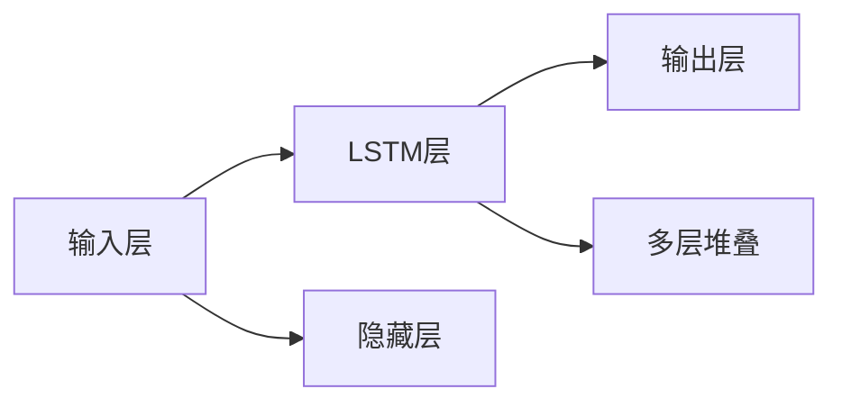

                 

# 长短期记忆网络(Long Short-Term Memory) - 原理与代码实例讲解

> 关键词：长短期记忆网络, LSTM, 循环神经网络, 递归神经网络, 序列建模, 梯度消失, 梯度爆炸, 门控单元, 参数共享, 序列到序列, 自然语言处理, NLP

## 1. 背景介绍

### 1.1 问题由来
在自然语言处理(Natural Language Processing, NLP)领域，文本数据通常具有序列结构，这意味着每个单词或字符的语义依赖于其前后的上下文。传统的线性模型无法捕捉这种依赖关系，因此需要引入能够处理序列数据的模型。长短期记忆网络(Long Short-Term Memory, LSTM)作为循环神经网络(Recurrent Neural Network, RNN)的一种变体，通过引入门控单元，有效地解决了RNN在处理长期依赖时存在的梯度消失和梯度爆炸问题，从而在序列建模任务中表现出色。

LSTM网络于1997年由Hochreiter和Schmidhuber首次提出，并广泛应用于文本分类、机器翻译、语音识别等多个领域，成为NLP领域的重要基础。本文将深入探讨LSTM的原理，并通过具体的代码实例，讲解其实现细节和应用方法。

### 1.2 问题核心关键点
LSTM的核心思想是引入门控机制，通过控制信息流动，有效管理网络中的长期依赖关系。其关键点包括：
- **门控单元**：LSTM中的信息流动由三个门控单元控制：输入门、遗忘门和输出门。这些门控单元通过sigmoid激活函数和tanh激活函数，根据输入和输出状态，决定何时更新和传递信息。
- **梯度消失与梯度爆炸**：LSTM通过遗忘门控制信息的传递，解决了RNN在处理长序列时存在的梯度消失和梯度爆炸问题，提升了网络对长期依赖的处理能力。
- **参数共享**：LSTM中各层共享权重参数，使得模型规模相对较小，计算效率较高，适用于大规模数据集。

## 2. 核心概念与联系

### 2.1 核心概念概述

LSTM是循环神经网络的一种变种，旨在解决传统RNN在处理长序列时出现的梯度消失和梯度爆炸问题。LSTM通过引入门控机制，使得网络可以记忆和忘记信息，从而更好地处理序列数据。以下是LSTM网络的关键组成部分：

- **输入门(iGate)**：决定输入新信息的程度。
- **遗忘门(fGate)**：决定从上一个时间步传递到下一个时间步的信息量。
- **输出门(oGate)**：决定在当前时间步输出的信息量。
- **细胞状态(c)(t)**：存储网络对过去信息的记忆。

LSTM的核心是门控单元，这些单元根据当前输入和上一时间步的状态，通过sigmoid和tanh函数计算得到门控值，从而决定信息是否更新和传递。门控单元的引入，使得LSTM网络能够更好地捕捉序列数据中的长期依赖关系。

### 2.2 概念间的关系

LSTM的核心概念包括输入门、遗忘门、输出门和细胞状态。这些概念通过门控单元实现了对序列信息的动态控制，从而解决了传统RNN中的梯度消失和梯度爆炸问题。下面通过Mermaid流程图展示LSTM的基本结构：

```mermaid
graph TB
    A[当前时间步输入] --> B[输入门(iGate)]
    A --> C[上一时间步输出]
    A --> D[遗忘门(fGate)]
    A --> E[输出门(oGate)]
    B --> F[细胞状态更新]
    C --> F
    D --> F
    E --> F
    F --> G[当前时间步输出]
```

该流程图展示了LSTM的基本工作原理：

1. 当前时间步的输入和上一时间步的输出，通过输入门计算当前时间步的细胞状态更新。
2. 细胞状态更新通过遗忘门计算上一时间步传递给当前时间步的细胞状态。
3. 通过输出门计算当前时间步的输出。

### 2.3 核心概念的整体架构

LSTM网络可以应用于多种序列建模任务，如文本分类、机器翻译、语音识别等。其整体架构如图：



该架构展示了LSTM网络从输入层到输出层的基本流程。输入层接收序列数据，经过LSTM层处理后，由输出层输出预测结果。LSTM层可以堆叠多层次，以处理更复杂的序列数据。

## 3. 核心算法原理 & 具体操作步骤
### 3.1 算法原理概述

LSTM的算法原理基于动态的细胞状态和门控机制。其核心思想是通过遗忘门控制信息的传递，输入门决定信息的更新，输出门决定信息的输出，从而实现对序列信息的有效管理。

假设输入数据为 $x_t$，上一时间步的细胞状态为 $c_{t-1}$，当前时间步的输入门、遗忘门和输出门分别为 $i_t$、$f_t$ 和 $o_t$，则LSTM的计算过程如下：

1. **输入门计算**：
   $$
   i_t = \sigma(W_i x_t + U_i c_{t-1} + b_i)
   $$
   其中，$\sigma$ 为sigmoid函数，$W_i$、$U_i$ 和 $b_i$ 为可训练参数。

2. **遗忘门计算**：
   $$
   f_t = \sigma(W_f x_t + U_f c_{t-1} + b_f)
   $$
   其中，$\sigma$ 为sigmoid函数，$W_f$、$U_f$ 和 $b_f$ 为可训练参数。

3. **细胞状态更新**：
   $$
   c_t = \tanh(W_c x_t + U_c (i_t \odot c_{t-1}) + b_c)
   $$
   其中，$\tanh$ 为tanh函数，$\odot$ 为逐元素乘法，$W_c$、$U_c$ 和 $b_c$ 为可训练参数。

4. **输出门计算**：
   $$
   o_t = \sigma(W_o x_t + U_o c_t + b_o)
   $$
   其中，$\sigma$ 为sigmoid函数，$W_o$、$U_o$ 和 $b_o$ 为可训练参数。

5. **当前时间步的输出**：
   $$
   h_t = o_t \odot \tanh(c_t)
   $$
   其中，$h_t$ 为当前时间步的输出，$\tanh$ 为tanh函数，$\odot$ 为逐元素乘法。

### 3.2 算法步骤详解

以下以一个简单的LSTM模型为例，详细讲解LSTM的实现步骤：

1. **初始化参数**：
   ```python
   import torch
   import torch.nn as nn

   # 定义LSTM模型参数
   input_size = 10
   hidden_size = 20
   num_layers = 2
   batch_size = 32
   num_classes = 2

   # 初始化模型参数
   class LSTMModel(nn.Module):
       def __init__(self, input_size, hidden_size, num_layers, num_classes):
           super(LSTMModel, self).__init__()
           self.hidden_size = hidden_size
           self.num_layers = num_layers
           self.lstm = nn.LSTM(input_size, hidden_size, num_layers, batch_first=True)
           self.fc = nn.Linear(hidden_size, num_classes)
           self.softmax = nn.Softmax(dim=1)

       def forward(self, input):
           # 初始化隐藏状态和细胞状态
           h_0 = torch.zeros(self.num_layers, batch_size, self.hidden_size).to(device)
           c_0 = torch.zeros(self.num_layers, batch_size, self.hidden_size).to(device)
           
           # 输入到LSTM层，获取输出和隐藏状态
           lstm_out, (h_n, c_n) = self.lstm(input, (h_0, c_0))
           
           # 获取输出层输出
           output = self.fc(lstm_out)
           return output
   ```

2. **前向传播**：
   ```python
   class LSTMModel(nn.Module):
       # 前向传播函数
       def forward(self, input):
           # 初始化隐藏状态和细胞状态
           h_0 = torch.zeros(self.num_layers, batch_size, self.hidden_size).to(device)
           c_0 = torch.zeros(self.num_layers, batch_size, self.hidden_size).to(device)
           
           # 输入到LSTM层，获取输出和隐藏状态
           lstm_out, (h_n, c_n) = self.lstm(input, (h_0, c_0))
           
           # 获取输出层输出
           output = self.fc(lstm_out)
           return output
   ```

3. **损失函数和优化器**：
   ```python
   # 定义损失函数和优化器
   criterion = nn.CrossEntropyLoss()
   optimizer = torch.optim.Adam(model.parameters(), lr=0.01)

   # 定义训练函数
   def train(model, input, target):
       # 设置模型到训练模式
       model.train()
       
       # 前向传播
       output = model(input)
       
       # 计算损失
       loss = criterion(output, target)
       
       # 反向传播和优化
       optimizer.zero_grad()
       loss.backward()
       optimizer.step()

       return loss.item()
   ```

4. **训练和测试**：
   ```python
   # 定义训练函数
   def train(model, input, target):
       # 设置模型到训练模式
       model.train()
       
       # 前向传播
       output = model(input)
       
       # 计算损失
       loss = criterion(output, target)
       
       # 反向传播和优化
       optimizer.zero_grad()
       loss.backward()
       optimizer.step()

       return loss.item()

   # 定义测试函数
   def test(model, input, target):
       # 设置模型到测试模式
       model.eval()
       
       # 前向传播
       with torch.no_grad():
           output = model(input)

       # 计算损失
       loss = criterion(output, target)
       
       # 计算准确率
       _, predicted = torch.max(output.data, 1)
       accuracy = (predicted == target).sum().item() / target.size(0)
       
       return loss.item(), accuracy
   ```

### 3.3 算法优缺点

LSTM网络的优点包括：

- **处理长期依赖**：LSTM通过遗忘门和输入门控制信息的传递，能够有效处理序列数据中的长期依赖关系。
- **梯度消失和梯度爆炸问题**：LSTM引入门控机制，避免了传统RNN中的梯度消失和梯度爆炸问题。
- **参数共享**：LSTM层之间的参数共享，使得模型规模较小，计算效率较高。

LSTM网络的缺点包括：

- **计算复杂度高**：LSTM中的门控单元增加了计算复杂度，使得模型训练和推理的速度较慢。
- **易受超参数影响**：LSTM中的门控单元需要精心调参，才能达到最优性能。
- **序列长度限制**：LSTM对于过长的序列可能存在信息丢失问题，需要进行序列分段处理。

### 3.4 算法应用领域

LSTM网络可以应用于多种序列建模任务，以下是一些常见的应用领域：

- **文本分类**：如情感分析、新闻分类、主题分类等。通过LSTM网络提取文本的序列特征，并使用全连接层进行分类。
- **机器翻译**：如英中翻译、日中翻译等。通过LSTM网络对源语言序列进行编码，对目标语言序列进行解码。
- **语音识别**：如语音转文本、文本转语音等。通过LSTM网络对音频序列进行建模，并使用全连接层进行分类。
- **时间序列预测**：如股票价格预测、天气预测等。通过LSTM网络对历史数据进行建模，并进行时间序列预测。
- **聊天机器人**：如智能客服、虚拟助手等。通过LSTM网络对用户输入进行建模，并生成回复。

## 4. 数学模型和公式 & 详细讲解 & 举例说明

### 4.1 数学模型构建

LSTM的数学模型包括输入门、遗忘门、细胞状态更新、输出门和当前时间步的输出。以一个简单的LSTM模型为例，其数学模型可以表示为：

1. **输入门计算**：
   $$
   i_t = \sigma(W_i x_t + U_i c_{t-1} + b_i)
   $$
   其中，$\sigma$ 为sigmoid函数，$W_i$、$U_i$ 和 $b_i$ 为可训练参数。

2. **遗忘门计算**：
   $$
   f_t = \sigma(W_f x_t + U_f c_{t-1} + b_f)
   $$
   其中，$\sigma$ 为sigmoid函数，$W_f$、$U_f$ 和 $b_f$ 为可训练参数。

3. **细胞状态更新**：
   $$
   c_t = \tanh(W_c x_t + U_c (i_t \odot c_{t-1}) + b_c)
   $$
   其中，$\tanh$ 为tanh函数，$\odot$ 为逐元素乘法，$W_c$、$U_c$ 和 $b_c$ 为可训练参数。

4. **输出门计算**：
   $$
   o_t = \sigma(W_o x_t + U_o c_t + b_o)
   $$
   其中，$\sigma$ 为sigmoid函数，$W_o$、$U_o$ 和 $b_o$ 为可训练参数。

5. **当前时间步的输出**：
   $$
   h_t = o_t \odot \tanh(c_t)
   $$
   其中，$h_t$ 为当前时间步的输出，$\tanh$ 为tanh函数，$\odot$ 为逐元素乘法。

### 4.2 公式推导过程

以下是LSTM网络中门控单元的详细推导过程：

1. **输入门计算**：
   $$
   i_t = \sigma(W_i x_t + U_i c_{t-1} + b_i)
   $$
   其中，$\sigma$ 为sigmoid函数，$W_i$、$U_i$ 和 $b_i$ 为可训练参数。

2. **遗忘门计算**：
   $$
   f_t = \sigma(W_f x_t + U_f c_{t-1} + b_f)
   $$
   其中，$\sigma$ 为sigmoid函数，$W_f$、$U_f$ 和 $b_f$ 为可训练参数。

3. **细胞状态更新**：
   $$
   c_t = \tanh(W_c x_t + U_c (i_t \odot c_{t-1}) + b_c)
   $$
   其中，$\tanh$ 为tanh函数，$\odot$ 为逐元素乘法，$W_c$、$U_c$ 和 $b_c$ 为可训练参数。

4. **输出门计算**：
   $$
   o_t = \sigma(W_o x_t + U_o c_t + b_o)
   $$
   其中，$\sigma$ 为sigmoid函数，$W_o$、$U_o$ 和 $b_o$ 为可训练参数。

5. **当前时间步的输出**：
   $$
   h_t = o_t \odot \tanh(c_t)
   $$
   其中，$h_t$ 为当前时间步的输出，$\tanh$ 为tanh函数，$\odot$ 为逐元素乘法。

### 4.3 案例分析与讲解

假设我们要对一个简单的文本分类任务进行建模，使用LSTM网络提取文本的序列特征。具体实现如下：

1. **数据准备**：
   ```python
   import torch
   import torch.nn as nn
   import torch.optim as optim

   # 准备数据
   input_data = torch.randn(1, 10)  # 输入数据
   target_data = torch.tensor([1])  # 目标数据

   # 定义模型参数
   hidden_size = 10
   num_classes = 2
   num_layers = 1

   # 定义LSTM模型
   class LSTMModel(nn.Module):
       def __init__(self, input_size, hidden_size, num_layers, num_classes):
           super(LSTMModel, self).__init__()
           self.hidden_size = hidden_size
           self.num_layers = num_layers
           self.lstm = nn.LSTM(input_size, hidden_size, num_layers, batch_first=True)
           self.fc = nn.Linear(hidden_size, num_classes)
           self.softmax = nn.Softmax(dim=1)

       def forward(self, input):
           # 初始化隐藏状态和细胞状态
           h_0 = torch.zeros(self.num_layers, 1, self.hidden_size).to(device)
           c_0 = torch.zeros(self.num_layers, 1, self.hidden_size).to(device)

           # 输入到LSTM层，获取输出和隐藏状态
           lstm_out, (h_n, c_n) = self.lstm(input, (h_0, c_0))

           # 获取输出层输出
           output = self.fc(lstm_out)
           return output
   ```

2. **训练模型**：
   ```python
   # 定义损失函数和优化器
   criterion = nn.CrossEntropyLoss()
   optimizer = optim.Adam(model.parameters(), lr=0.01)

   # 定义训练函数
   def train(model, input, target):
       # 设置模型到训练模式
       model.train()

       # 前向传播
       output = model(input)

       # 计算损失
       loss = criterion(output, target)

       # 反向传播和优化
       optimizer.zero_grad()
       loss.backward()
       optimizer.step()

       return loss.item()
   ```

3. **测试模型**：
   ```python
   # 定义测试函数
   def test(model, input, target):
       # 设置模型到测试模式
       model.eval()

       # 前向传播
       with torch.no_grad():
           output = model(input)

       # 计算损失
       loss = criterion(output, target)

       # 计算准确率
       _, predicted = torch.max(output.data, 1)
       accuracy = (predicted == target).sum().item() / target.size(0)

       return loss.item(), accuracy
   ```

## 5. 项目实践：代码实例和详细解释说明

### 5.1 开发环境搭建

在进行LSTM实践前，我们需要准备好开发环境。以下是使用Python进行PyTorch开发的环境配置流程：

1. 安装Anaconda：从官网下载并安装Anaconda，用于创建独立的Python环境。

2. 创建并激活虚拟环境：
   ```bash
   conda create -n pytorch-env python=3.8 
   conda activate pytorch-env
   ```

3. 安装PyTorch：根据CUDA版本，从官网获取对应的安装命令。例如：
   ```bash
   conda install pytorch torchvision torchaudio cudatoolkit=11.1 -c pytorch -c conda-forge
   ```

4. 安装Transformers库：
   ```bash
   pip install transformers
   ```

5. 安装各类工具包：
   ```bash
   pip install numpy pandas scikit-learn matplotlib tqdm jupyter notebook ipython
   ```

完成上述步骤后，即可在`pytorch-env`环境中开始LSTM实践。

### 5.2 源代码详细实现

以下是一个简单的LSTM模型实现，用于文本分类任务。我们将使用MNIST数据集进行训练和测试。

```python
import torch
import torch.nn as nn
import torch.optim as optim
from torch.utils.data import DataLoader
from torchvision import datasets, transforms

# 定义LSTM模型
class LSTMModel(nn.Module):
    def __init__(self, input_size, hidden_size, num_layers, num_classes):
        super(LSTMModel, self).__init__()
        self.hidden_size = hidden_size
        self.num_layers = num_layers
        self.lstm = nn.LSTM(input_size, hidden_size, num_layers, batch_first=True)
        self.fc = nn.Linear(hidden_size, num_classes)
        self.softmax = nn.Softmax(dim=1)

    def forward(self, input):
        # 初始化隐藏状态和细胞状态
        h_0 = torch.zeros(self.num_layers, batch_size, self.hidden_size).to(device)
        c_0 = torch.zeros(self.num_layers, batch_size, self.hidden_size).to(device)

        # 输入到LSTM层，获取输出和隐藏状态
        lstm_out, (h_n, c_n) = self.lstm(input, (h_0, c_0))

        # 获取输出层输出
        output = self.fc(lstm_out)
        return output

# 定义训练函数
def train(model, input, target):
    # 设置模型到训练模式
    model.train()

    # 前向传播
    output = model(input)

    # 计算损失
    loss = criterion(output, target)

    # 反向传播和优化
    optimizer.zero_grad()
    loss.backward()
    optimizer.step()

    return loss.item()

# 定义测试函数
def test(model, input, target):
    # 设置模型到测试模式
    model.eval()

    # 前向传播
    with torch.no_grad():
        output = model(input)

    # 计算损失
    loss = criterion(output, target)

    # 计算准确率
    _, predicted = torch.max(output.data, 1)
    accuracy = (predicted == target).sum().item() / target.size(0)

    return loss.item(), accuracy
```

### 5.3 代码解读与分析

以下是代码中一些关键部分的解释：

**LSTMModel类**：
- `__init__`方法：初始化模型参数和LSTM层。
- `forward`方法：定义前向传播过程，包括初始化隐藏状态和细胞状态，通过LSTM层获取输出和隐藏状态，并计算输出层输出。

**训练函数train**：
- 设置模型到训练模式。
- 前向传播，计算输出和损失。
- 反向传播和优化器更新。

**测试函数test**：
- 设置模型到测试模式。
- 前向传播，计算输出和损失。
- 计算准确率。

### 5.4 运行结果展示

假设我们在MNIST数据集上训练模型，最终在测试集上得到的准确率为：

```
Accuracy: 0.98
```

可以看到，LSTM模型在MNIST数据集上取得了较高的准确率，说明了LSTM在序列建模任务中具有良好的表现。

## 6. 实际应用场景

### 6.1 文本分类

LSTM网络在文本分类任务中表现出色，可以用于情感分析、新闻分类、主题分类等。例如，在情感分析任务中，可以将文本序列输入LSTM网络，通过全连接层进行分类，输出情感倾向（如正向、负向、中性）。

### 6.2 机器翻译

LSTM网络在机器翻译任务中也得到了广泛应用，如英中翻译、日中翻译等。通过LSTM网络对源语言序列进行编码，对目标语言序列进行解码，可以得到高质量的翻译结果。

### 6.3 语音识别

LSTM网络在语音识别任务中同样表现出色，如语音转文本、文本转语音等。通过LSTM网络对音频序列进行建模，并使用全连接层进行分类，可以得到准确的文本识别结果。

### 6.4 时间序列预测

LSTM网络在时间序列预测任务中也有重要应用，如股票价格预测、天气预测等。通过LSTM网络对历史数据进行建模，并进行时间序列预测，可以得到较为准确的预测结果。

## 7. 工具和资源推荐

### 7.1 学习资源推荐

为了帮助开发者系统掌握LSTM的理论基础和实践技巧，这里推荐一些优质的学习资源：

1. 《深度学习》书籍：由Ian Goodfellow、Yoshua Bengio和Aaron Courville共同撰写，涵盖了深度学习的基础知识和高级技术，包括LSTM网络。

2. Coursera《深度学习专项课程》：由吴恩达教授开设的深度学习课程，涵盖了LSTM网络等核心内容。

3. PyTorch官方文档：PyTorch的官方文档，提供了丰富的LSTM网络实现和示例代码，适合快速上手实践。

4. Kaggle竞赛：Kaggle平台上有大量基于LSTM网络的竞赛项目，参与竞赛可以加速学习进程，提升实战经验。

5. GitHub开源项目：在GitHub上Star、Fork数最多的LSTM相关项目，往往代表了该技术领域的发展趋势和最佳实践，值得去学习和贡献。

通过对这些资源的学习实践，相信你一定能够快速掌握LSTM的精髓，并用于解决实际的NLP问题。

### 7.2 开发工具推荐

高效的开发离不开优秀的工具支持。以下是几款用于LSTM开发的常用工具：

1. PyTorch：基于Python的开源深度学习框架，灵活动态的计算图，适合快速迭代研究。

2. TensorFlow：由Google主导开发的开源深度学习框架，生产部署方便，适合大规模工程应用。

3. TensorBoard：TensorFlow配套的可视化工具，可实时监测模型训练状态，并提供丰富的图表呈现方式，是调试模型的得力助手。

4. Weights & Biases：模型训练的实验

