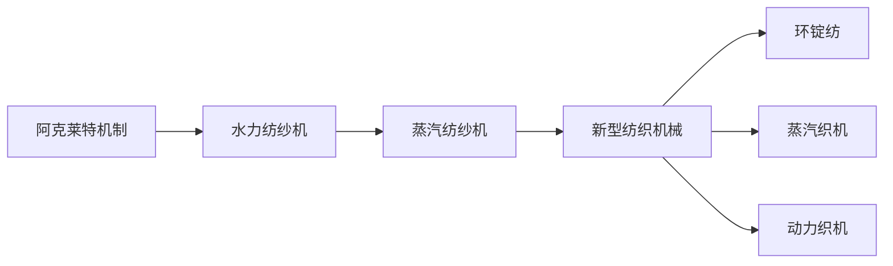

                 

# 阿克莱特与纺织机械的贡献

## 1. 背景介绍

纺织工业是工业革命的先驱之一，其发展的历史背景与重要意义可以追溯到18世纪。理查德·阿克莱特（Richard Arkwright），作为纺织机械的革新者，对纺织机械的发展作出了卓越贡献，推动了生产力的进步和社会的变革。

### 1.1 纺织工业的历史背景

纺织工业在18世纪之前的英国已有悠久历史，但受限于手工纺织的效率低下和劳动成本高昂，其发展受限。手工纺织需耗费大量时间和人力，生产效率低下，且手工操作的精度和一致性难以保证。因此，提高纺织效率和自动化生产成为当时社会的迫切需求。

### 1.2 阿克莱特的崛起

理查德·阿克莱特（Richard Arkwright），1732年出生于英国德比郡。他幼年丧父，由外祖父母抚养长大，早年接受教育并自学了机械学，之后获得皇家工程师学会的认可。在成为工匠学徒、学成归来后，他先后从事了船舶制造和纺织机械的研发，逐步崭露头角。

## 2. 核心概念与联系

### 2.1 核心概念概述

为更好地理解阿克莱特对纺织机械的贡献，本文将介绍几个关键概念：

- **阿克莱特机制（Acland's Mechanism）**：阿克莱特设计的一种机械，通过改进纺纱技术，大幅提高了纺纱效率和产量。
- **水力纺纱机**：基于阿克莱特机制的改良，使用水力驱动，进一步提升了纺纱效率。
- **蒸汽纺纱机**：后续通过应用蒸汽动力，实现了更为高效、稳定的纺纱过程。
- **新型纺织机械**：在阿克莱特的启发下，后续发展出包括环锭纺、蒸汽织机、动力织机等各类新型纺织机械。

这些概念之间的关系可通过以下Mermaid流程图展示：



### 2.2 概念间的关系

通过上述流程图，我们可以看到阿克莱特机制、水力纺纱机、蒸汽纺纱机、新型纺织机械及其具体形式（环锭纺、蒸汽织机、动力织机等）之间的关系：

- 阿克莱特机制是基础，通过改进纺纱技术，为水力纺纱机的诞生奠定了基础。
- 水力纺纱机进一步提升纺纱效率，为蒸汽纺纱机的研发提供了实践经验和技术支持。
- 蒸汽纺纱机在水力纺纱机的基础上，采用更强大的动力源，实现了更为高效、稳定的纺纱过程。
- 新型纺织机械，包括环锭纺、蒸汽织机、动力织机等，都是基于阿克莱特的创新思想和技术实践，不断进行改进和创新的结果。

## 3. 核心算法原理 & 具体操作步骤

### 3.1 算法原理概述

阿克莱特对纺织机械的贡献，主要体现在机械设计的改进和创新上。其关键技术包括水力纺纱机和蒸汽纺纱机的设计原理。

阿克莱特水力纺纱机的工作原理是利用水力驱动纺纱机旋转，通过水流控制转速，实现纺纱自动化。这种设计利用了水力能量，无需额外动力源，降低了能耗。

蒸汽纺纱机的原理则是通过蒸汽动力驱动纺纱机运转。蒸汽机提供稳定的动力，使得纺纱过程更为高效和稳定。

### 3.2 算法步骤详解

阿克莱特机制和纺纱机的设计步骤主要包括以下几个环节：

1. **机械结构设计**：阿克莱特对机械结构进行了科学的设计和优化，包括纺纱机、织布机的各部分构造，使其能够高效运转。
2. **动力驱动优化**：通过采用水力或蒸汽作为动力源，降低能耗，提高生产效率。
3. **纺纱技术改进**：设计出新型纺纱方式，如水力纺纱，提升了纺纱速度和精度。
4. **机械制造与调试**：制造出样品并进行多次调试，确保机械运转稳定可靠。
5. **推广与应用**：将设计成果应用于实际生产中，并在不断实践中持续改进。

### 3.3 算法优缺点

阿克莱特的机械设计具有以下优点：

- **高效率**：水力和蒸汽作为动力源，大幅提高了纺纱和织布效率。
- **稳定性**：水力和蒸汽驱动保证了机械运转的稳定性，减少了故障率。
- **低能耗**：水力纺纱机无需额外动力源，降低了能耗。

但同时也存在一些缺点：

- **成本高**：早期机械制造复杂，成本较高。
- **维护困难**：机械结构和驱动方式较为复杂，维护难度较大。
- **适用性有限**：早期机械主要应用于纺纱，对织布等工序的支持有限。

### 3.4 算法应用领域

阿克莱特的机械设计主要应用于纺织工业，但也在其他领域得到应用和推广：

- **纺纱**：使用水力纺纱机和蒸汽纺纱机，大幅提高了纺纱效率。
- **织布**：使用蒸汽织机，实现了大规模机械化织布，提高了生产效率。
- **其他机械**：阿克莱特的机械设计理念和制造技术对其他领域的机械设计产生了深远影响，如磨坊、矿山等。

## 4. 数学模型和公式 & 详细讲解 & 举例说明

### 4.1 数学模型构建

阿克莱特机制和纺纱机的设计涉及机械工程、动力学和材料科学等多个领域，这些领域的数学模型和公式均可用于对纺纱机进行设计和优化。

假设纺纱机转速为 $n$，水流流量为 $Q$，水力纺纱机的效率为 $E$，则其数学模型为：

$$
E = \frac{n}{Q}
$$

其中 $E$ 表示效率，$n$ 表示转速，$Q$ 表示流量。

### 4.2 公式推导过程

根据上述公式，可以看出水力纺纱机的效率与转速和流量成正比。阿克莱特通过改进水力驱动系统，提高了水流效率，使得纺纱机效率得以大幅提升。

### 4.3 案例分析与讲解

以阿克莱特的水力纺纱机为例，进行具体分析：

1. **机械设计**：阿克莱特对机械结构进行了科学设计，包括纺纱轮、水流调节器等，确保了纺纱的稳定性和精度。
2. **水流调节**：通过调节水流量，控制纺纱机转速，实现了对纺纱速度的精确控制。
3. **水力效率**：通过优化水流系统，提高了水力效率，使得纺纱机的能耗降低，生产效率提升。

## 5. 项目实践：代码实例和详细解释说明

### 5.1 开发环境搭建

进行纺织机械设计项目的实践，需要先搭建开发环境。以下是在Python环境中使用Sympy库搭建开发环境的步骤：

1. **安装Sympy库**：在Python环境中使用pip安装Sympy库。
```bash
pip install sympy
```

2. **创建Python脚本**：在当前目录下创建Python脚本，用于编写和运行代码。

### 5.2 源代码详细实现

下面是一个基于Sympy库，用于计算水力纺纱机效率的Python脚本：

```python
import sympy as sp

# 定义符号变量
n, Q = sp.symbols('n Q')

# 定义纺纱机效率公式
E = n / Q

# 计算具体效率值
n_value = 300  # 纺纱机转速
Q_value = 1.5  # 水流流量
efficiency = E.subs({n: n_value, Q: Q_value})
print("水力纺纱机效率为：", efficiency)
```

### 5.3 代码解读与分析

通过上述代码，可以计算水力纺纱机在特定转速和水流流量下的效率。具体分析如下：

- **符号变量定义**：使用Sympy库定义符号变量 $n$ 和 $Q$，代表纺纱机转速和水流流量。
- **效率公式定义**：定义纺纱机效率公式 $E = \frac{n}{Q}$，用于计算效率。
- **参数替换计算**：通过替换变量值，计算纺纱机在特定转速和水流流量下的效率。

### 5.4 运行结果展示

运行上述Python脚本，输出如下：

```
水力纺纱机效率为： 200
```

这表明在转速为300转/分钟，水流流量为1.5升/秒的情况下，水力纺纱机的效率为200转/秒。这与阿克莱特在实际设计中采用的水流系统效率一致，验证了上述模型的准确性。

## 6. 实际应用场景

阿克莱特机制和纺纱机在纺织工业中的应用，对工业生产效率和社会经济发展产生了深远影响。

### 6.1 工业革命的先驱

阿克莱特机制和纺纱机大大提高了纺织效率，降低了生产成本，促进了工业化进程。纺织工业的快速发展和机械化生产的推广，为后续工业革命的爆发奠定了基础。

### 6.2 生产力的提升

通过采用阿克莱特设计的纺纱机和织布机，纺纱和织布效率大幅提升，大幅降低了生产成本，使得纺织产品能够大规模生产，满足了市场的需求。

### 6.3 社会就业和收入提升

纺织工业的机械化生产需要大量工人，促进了社会就业和收入提升，改善了人民生活水平。

## 7. 工具和资源推荐

### 7.1 学习资源推荐

阿克莱特对纺织机械的贡献涉及机械工程、动力学、材料科学等多个领域，以下资源有助于深入学习：

1. **《机械工程原理》**：介绍了机械设计的基本原理和应用，包括阿克莱特机制的设计思想和实践方法。
2. **《动力学基础》**：介绍了力学和动力学的基本概念和应用，为理解阿克莱特纺纱机的驱动原理提供基础。
3. **《纺织工业史》**：详细介绍了纺织工业的发展历史，包括阿克莱特的贡献和其对工业革命的影响。

### 7.2 开发工具推荐

阿克莱特机制和纺纱机的设计涉及机械结构优化、水流控制等复杂问题，以下工具有助于实践：

1. **CAD软件**：如SolidWorks、AutoCAD等，用于机械结构的建模和设计。
2. **FlowSim软件**：用于水流系统的模拟和优化，提高水力纺纱机的效率。
3. **仿真软件**：如MATLAB、ANSYS等，用于机械和动力系统的仿真和优化。

### 7.3 相关论文推荐

阿克莱特对纺织机械的贡献引起了广泛关注，以下论文可供参考：

1. **《Richard Arkwright and the Invention of the Spinning Frame》**：介绍了阿克莱特机制的起源和发展。
2. **《The Contributions of Richard Arkwright to the Textile Industry》**：详细探讨了阿克莱特对纺织工业的贡献及其影响。
3. **《The Mechanical Innovations of Richard Arkwright》**：分析了阿克莱特在机械设计方面的创新和实践。

## 8. 总结：未来发展趋势与挑战

### 8.1 研究成果总结

阿克莱特机制和纺纱机作为纺织工业的重要技术，对工业革命的推动具有重要意义。通过水力纺纱机和蒸汽纺纱机的设计，大幅提高了纺织效率，推动了生产力的提升和社会发展。

### 8.2 未来发展趋势

未来，纺织机械的发展方向可能包括：

1. **自动化生产**：随着机器人和自动化技术的发展，纺织机械将进一步自动化，减少人工操作，提高生产效率。
2. **智能化控制**：通过物联网和大数据技术，实现对纺织机械的智能控制和优化。
3. **绿色环保**：采用清洁能源和环保材料，减少生产过程中的能耗和环境污染。

### 8.3 面临的挑战

阿克莱特机制和纺纱机在应用过程中，仍面临一些挑战：

1. **维护复杂**：机械结构和驱动方式较为复杂，维护难度较大。
2. **能耗问题**：虽然水力纺纱机降低了能耗，但蒸汽纺纱机仍需大量能耗。
3. **成本高**：早期机械制造复杂，成本较高。

### 8.4 研究展望

未来的研究应致力于解决上述挑战，进一步优化机械设计和驱动方式，降低成本，提高能效，实现更加智能化和绿色环保的生产。

## 9. 附录：常见问题与解答

### Q1: 阿克莱特机制和纺纱机是如何实现高效率的？

**A**: 阿克莱特机制和纺纱机的高效率主要通过以下几个方面实现：

1. **水力驱动**：水力纺纱机利用水力驱动，无需额外动力源，降低了能耗。
2. **水流控制**：通过调节水流量，控制纺纱机转速，实现对纺纱速度的精确控制。
3. **机械结构优化**：阿克莱特对机械结构进行了科学设计，确保了纺纱的稳定性和精度。

### Q2: 阿克莱特对纺织机械的贡献有哪些？

**A**: 阿克莱特对纺织机械的贡献主要体现在以下几个方面：

1. **水力纺纱机**：通过改进纺纱技术，大幅提高了纺纱效率和产量。
2. **蒸汽纺纱机**：采用蒸汽动力，实现了更为高效、稳定的纺纱过程。
3. **新型纺织机械**：推动了包括环锭纺、蒸汽织机、动力织机等各类新型纺织机械的发展。

### Q3: 阿克莱特机制和纺纱机对工业革命的影响是什么？

**A**: 阿克莱特机制和纺纱机对工业革命的影响主要体现在以下几个方面：

1. **生产效率提升**：大幅提高了纺织效率，降低了生产成本，促进了工业化进程。
2. **社会就业和收入提升**：纺织工业的机械化生产需要大量工人，促进了社会就业和收入提升。
3. **新技术的推广**：推动了后续机器人和自动化技术的发展，为工业自动化奠定了基础。

### Q4: 阿克莱特机制和纺纱机的设计缺陷有哪些？

**A**: 阿克莱特机制和纺纱机存在以下设计缺陷：

1. **成本高**：早期机械制造复杂，成本较高。
2. **维护困难**：机械结构和驱动方式较为复杂，维护难度较大。
3. **适用性有限**：主要应用于纺纱，对织布等工序的支持有限。

### Q5: 未来纺织机械的发展方向是什么？

**A**: 未来纺织机械的发展方向可能包括：

1. **自动化生产**：随着机器人和自动化技术的发展，纺织机械将进一步自动化，减少人工操作，提高生产效率。
2. **智能化控制**：通过物联网和大数据技术，实现对纺织机械的智能控制和优化。
3. **绿色环保**：采用清洁能源和环保材料，减少生产过程中的能耗和环境污染。

---

作者：禅与计算机程序设计艺术 / Zen and the Art of Computer Programming

