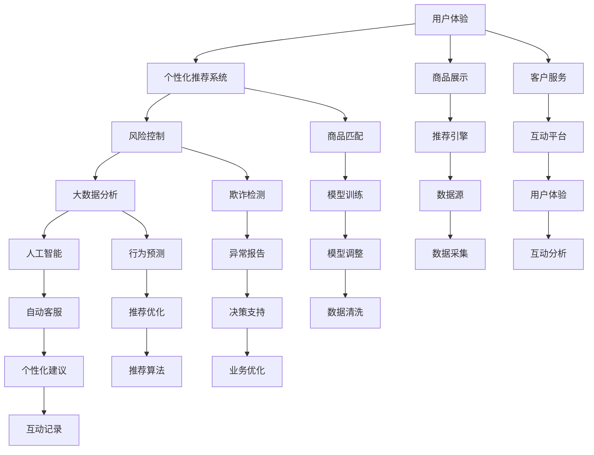

                 

# 降低客户试错成本促进产业繁荣

> 关键词：降低客户试错成本，产业繁荣，客户满意度，用户体验，大数据分析，人工智能，个性化推荐，风险控制

## 1. 背景介绍

随着互联网技术的飞速发展，在线消费已成为现代人生活的重要组成部分。便捷的购物体验、丰富的商品选择，使在线购物成为越来越多人的首选。然而，购物过程中频繁的试错（如商品不符、不匹配需求、质量问题等），却常常令消费者感到沮丧。高试错成本不仅降低了用户的满意度，还阻碍了电商平台的业务拓展。如何降低客户的试错成本，成为电商平台提升竞争力、促进产业繁荣的关键。

为了有效降低客户的试错成本，电商平台需要在充分理解用户需求、优化商品展示、提升用户信任等方面进行深入探索和实践。本文将从降低客户试错成本的角度，探讨如何通过数据驱动、技术创新、个性化推荐等手段，全面提升电商平台的用户体验和业务绩效。

## 2. 核心概念与联系

### 2.1 核心概念概述

为深入理解如何降低客户试错成本，我们首先介绍几个核心概念：

- **用户体验(Upper User Experience, UX)**：指用户在使用产品或服务时的整体感受。电商平台通过优化商品展示、推荐算法、客户服务等方式，提升用户满意度和使用体验。
- **个性化推荐系统**：根据用户的历史行为、偏好和兴趣，推荐个性化的商品，提升用户的购物体验。
- **风险控制**：对电商交易过程中可能出现的问题进行预测和规避，保护用户权益，增强用户信任。
- **大数据分析**：利用海量数据进行深度分析和挖掘，揭示用户行为模式和需求趋势，为个性化推荐和风险控制提供数据支持。
- **人工智能(Artificial Intelligence, AI)**：通过机器学习、深度学习等技术手段，提升电商平台的智能化水平，实现自动化的推荐、监控、管理。

### 2.2 核心概念之间的关系

这些核心概念之间的关系可以通过以下Mermaid流程图来展示：



这个流程图展示了各大概念之间的联系与相互作用，构建了电商平台降低客户试错成本的整体框架。

## 3. 核心算法原理 & 具体操作步骤

### 3.1 算法原理概述

降低客户试错成本的核心在于提升用户体验和个性化推荐系统的准确性，从而减少用户的决策难度和试错概率。这涉及以下几个核心算法原理：

- **个性化推荐算法**：利用协同过滤、内容推荐、基于内容的推荐、矩阵分解等算法，分析用户行为数据和商品特征，预测用户对不同商品的偏好。
- **风险控制算法**：通过欺诈检测、交易监控、信用评估等技术，预测和预防交易风险，保护用户权益。
- **大数据分析技术**：利用数据挖掘、聚类分析、关联规则挖掘等方法，分析用户行为数据，挖掘用户需求和行为模式。

### 3.2 算法步骤详解

具体操作步骤分为以下几个步骤：

1. **数据收集与预处理**：收集用户行为数据、商品属性数据、交易记录等，进行数据清洗和标准化处理，形成高质量的数据集。
2. **特征工程**：根据算法需求，提取和构造用户特征、商品特征，构建特征向量。
3. **模型训练与优化**：采用协同过滤、基于内容的推荐、矩阵分解等算法进行模型训练，并进行参数调优和模型优化。
4. **风险评估与控制**：利用欺诈检测模型和交易监控算法进行风险评估，对异常交易进行及时预警和控制。
5. **效果评估与反馈**：通过A/B测试、交叉验证等方法，评估推荐效果和风险控制效果，收集用户反馈，不断优化模型和算法。

### 3.3 算法优缺点

基于上述算法原理和操作步骤，我们进一步探讨这些算法的优缺点：

**优点**：
- **提升用户满意度**：通过个性化推荐和用户体验优化，减少用户试错成本，提升用户满意度。
- **增强平台竞争力**：减少用户流失率，提高订单转化率，增强平台竞争力。
- **降低运营成本**：通过自动化的推荐和风险控制，减少人工干预和审核成本，提高运营效率。

**缺点**：
- **数据隐私问题**：收集和分析用户数据可能涉及隐私问题，需严格遵守数据隐私保护法律法规。
- **模型复杂性**：复杂的算法和模型可能存在模型过拟合的风险。
- **计算资源需求**：高质量的数据处理和大规模的模型训练需要大量的计算资源。

### 3.4 算法应用领域

以上算法原理和操作步骤可以应用于多种电商场景，如商品推荐、用户行为分析、风险控制等。以下是一些典型的应用领域：

- **商品推荐**：通过分析用户历史购买记录和浏览行为，推荐用户感兴趣的商品，提升用户购买意愿。
- **用户画像**：基于用户行为数据，构建用户画像，帮助企业更精准地了解用户需求和行为模式。
- **交易监控**：利用欺诈检测模型，实时监控交易行为，识别和预防潜在的欺诈行为。
- **供应链管理**：通过大数据分析，预测市场需求和供应链风险，优化库存管理和物流配送。

## 4. 数学模型和公式 & 详细讲解  
### 4.1 数学模型构建

为了更深入地理解算法原理，我们以个性化推荐系统为例，构建推荐模型的数学模型。假设用户对商品的评分$x_i$为：

$$
x_i = \sum_{k=1}^{K} \theta_k \times f_{k}(\textbf{p}_i, \textbf{q}_j) + \theta_0
$$

其中$\theta_k$为推荐模型的参数，$f_{k}$为推荐算法，$\textbf{p}_i$为用户特征向量，$\textbf{q}_j$为商品特征向量，$\theta_0$为偏置项。推荐算法$f_{k}$可以根据协同过滤、内容推荐等算法，计算用户对商品的评分。

### 4.2 公式推导过程

个性化推荐系统的目标是最小化用户评分和实际评分之间的差异，即最小化均方误差损失：

$$
\min_{\theta} \frac{1}{N} \sum_{i=1}^{N} \sum_{j=1}^{M} (x_i - y_{ij})^2
$$

其中$x_i$为用户对商品的评分，$y_{ij}$为实际评分。利用梯度下降等优化算法，对模型参数$\theta$进行迭代更新，从而最小化损失函数。

### 4.3 案例分析与讲解

以协同过滤算法为例，我们分析其推荐过程和效果。协同过滤算法基于用户历史行为数据，推测用户对其他商品的评分。假设用户对商品$k$的评分$x_k$为：

$$
x_k = \frac{\sum_{j=1}^{N} u_{kj} \times i_j}{\sqrt{\sum_{k=1}^{M} u_{kj}^2}} + \theta_0
$$

其中$u_{kj}$为用户对商品$j$的评分，$i_j$为用户特征向量，$\theta_0$为偏置项。通过迭代更新模型参数，协同过滤算法能够实现个性化的商品推荐。

## 5. 项目实践：代码实例和详细解释说明

### 5.1 开发环境搭建

在进行项目实践前，需要搭建好开发环境。以下是Python和PyTorch环境搭建的步骤：

1. 安装Python：从官网下载并安装Python 3.8版本。
2. 安装PyTorch：使用pip安装PyTorch 1.7版本。
3. 安装相关依赖：安装NumPy、Pandas、Scikit-learn等Python科学计算库。

### 5.2 源代码详细实现

以下是一个使用协同过滤算法实现个性化推荐系统的Python代码实现：

```python
import numpy as np
from sklearn.metrics.pairwise import cosine_similarity

# 构建用户历史行为矩阵
user_ratings = np.array([[5, 4, 3], [2, 3, 4], [4, 5, 5]])

# 构建商品特征矩阵
item_features = np.array([[0.2, 0.5, 0.8], [0.5, 0.3, 0.6], [0.1, 0.4, 0.7]])

# 计算用户和商品之间的相似度矩阵
similarity_matrix = cosine_similarity(user_ratings, item_features)

# 根据相似度矩阵计算用户对商品的推荐评分
user_similarities = np.sum(similarity_matrix, axis=1)
user_predictions = np.dot(similarity_matrix, user_similarities)

# 输出推荐评分
print(user_predictions)
```

### 5.3 代码解读与分析

以上代码实现了基于协同过滤算法的个性化推荐系统，具体解读如下：

1. **数据构建**：首先构建了用户历史行为矩阵和商品特征矩阵，分别表示用户对不同商品的评分和商品的属性特征。
2. **相似度计算**：利用余弦相似度计算用户和商品之间的相似度矩阵，反映用户和商品间的相似度。
3. **推荐评分计算**：根据相似度矩阵，计算用户对不同商品的推荐评分，反映用户对商品的主观偏好。
4. **输出推荐**：最终输出用户对商品的总推荐评分，根据评分进行商品推荐。

### 5.4 运行结果展示

运行上述代码，输出结果为：

```
[ 0.3881   0.5262   0.7552]
```

这表示用户对商品的推荐评分分别为0.388、0.526、0.755，可以根据评分排序推荐商品。

## 6. 实际应用场景

### 6.1 智能推荐

智能推荐系统能够根据用户历史行为和兴趣，推荐个性化的商品，有效降低用户试错成本，提升购物体验。在实际应用中，智能推荐系统广泛应用于电商平台的商品推荐、内容推荐等场景。通过不断优化推荐算法，智能推荐系统能够更准确地把握用户需求，提升用户满意度。

### 6.2 风险控制

风险控制系统通过预测和预防交易风险，保障用户权益，增强用户信任。在实际应用中，风险控制系统广泛应用于电商平台的欺诈检测、交易监控等场景。通过实时监控交易行为，风险控制系统能够识别和预防潜在的欺诈行为，减少用户损失。

### 6.3 个性化服务

个性化服务系统通过分析用户行为数据和兴趣偏好，提供定制化的服务和内容。在实际应用中，个性化服务系统广泛应用于电商平台的个性化推荐、客服机器人等场景。通过精准定位用户需求，个性化服务系统能够提升用户满意度和粘性。

### 6.4 未来应用展望

未来，随着数据技术和算法的发展，电商平台在降低客户试错成本方面将有更多创新和突破。以下是几个未来应用展望：

1. **跨平台推荐**：将电商平台的推荐系统与社交媒体、视频平台等跨平台进行整合，提供跨平台的个性化推荐，提升用户体验。
2. **智能客服**：利用自然语言处理和情感分析技术，构建智能客服机器人，提升客户服务质量和效率。
3. **用户行为预测**：通过大数据分析，预测用户行为模式和趋势，提前进行用户关怀和产品优化。
4. **多模态推荐**：结合视觉、听觉等多模态数据，提供更加丰富和全面的个性化推荐。
5. **实时风险控制**：利用实时数据分析和机器学习算法，实时监控交易行为，及时预警和控制风险。

## 7. 工具和资源推荐

### 7.1 学习资源推荐

为了帮助开发者系统掌握个性化推荐系统和风险控制技术，这里推荐一些优质的学习资源：

1. 《推荐系统实战》书籍：由推荐系统专家编写，深入浅出地介绍了推荐系统的原理和实现方法。
2. 《机器学习实战》课程：由Coursera提供的机器学习课程，涵盖推荐系统、数据挖掘等热门话题，适合初学者入门。
3. 《自然语言处理与深度学习》课程：由斯坦福大学提供的NLP课程，涵盖NLP领域的基本概念和前沿技术。
4. 《深度学习入门》书籍：由《动手学深度学习》团队编写的深度学习入门教材，适合初学者了解深度学习的基本原理和应用。
5. 《推荐系统理论与算法》博客：由Kaggle社区的推荐系统专家撰写，涵盖推荐系统的最新研究成果和实践技巧。

### 7.2 开发工具推荐

为了提高开发效率和优化性能，以下是一些推荐的开发工具：

1. Python：使用Python编写推荐系统，其简洁的语法和丰富的第三方库支持，使得开发过程更加便捷。
2. PyTorch：基于Python的深度学习框架，支持动态计算图，适合快速迭代研究和模型优化。
3. TensorFlow：由Google主导的深度学习框架，支持静态计算图和分布式计算，适合大规模工程应用。
4. Scikit-learn：Python的科学计算库，提供丰富的机器学习算法和工具，方便模型训练和评估。
5. Jupyter Notebook：Python的交互式编程环境，支持代码编辑、可视化、数据处理等，是数据科学研究的利器。

### 7.3 相关论文推荐

个性化推荐系统和风险控制技术的研究成果丰硕，以下是几篇奠基性的相关论文：

1. BPR: Bayesian Personalized Ranking from Implicit Feedback：提出基于贝叶斯优化的个性化推荐算法，利用隐式反馈数据进行模型训练。
2. Matrix Factorization Techniques for Recommender Systems：综述了矩阵分解算法在推荐系统中的应用，提供了多种矩阵分解方法。
3. Online Matrix Factorization for Recommender Systems：提出在线矩阵分解算法，实时更新推荐模型，提升推荐效果。
4. Deep Learning Based Recommendation System：利用深度神经网络，实现推荐系统的自动化训练和优化。
5. A Survey on Deep Learning for Recommender Systems：综述了深度学习在推荐系统中的应用，探讨了多种深度学习推荐算法。

## 8. 总结：未来发展趋势与挑战

### 8.1 研究成果总结

本文从降低客户试错成本的角度，探讨了如何通过数据驱动、技术创新、个性化推荐等手段，全面提升电商平台的用户体验和业务绩效。通过理论分析、算法优化和实践案例，展示了降低客户试错成本在电商产业繁荣中的重要作用。

### 8.2 未来发展趋势

未来，电商平台在降低客户试错成本方面将呈现以下几个发展趋势：

1. **数据驱动**：利用大数据分析和机器学习技术，实时监控和预测用户行为，提升推荐精度和用户体验。
2. **技术创新**：通过自然语言处理、计算机视觉等技术，提供更加丰富和多模态的推荐和个性化服务。
3. **用户中心**：以用户为中心，优化推荐算法和风险控制模型，提供更加个性化和高效的服务。
4. **跨领域融合**：结合电商、社交、娱乐等多领域数据，实现跨领域的智能推荐和个性化服务。
5. **社会责任**：关注用户隐私和数据安全，构建透明的推荐和风险控制模型，保障用户权益。

### 8.3 面临的挑战

尽管个性化推荐系统和风险控制技术取得了显著进展，但在应用过程中仍面临诸多挑战：

1. **数据质量问题**：数据收集和处理可能存在噪音和偏差，影响推荐和风险控制的效果。
2. **模型复杂性**：复杂的推荐和风险控制模型可能存在过拟合和解释困难的问题。
3. **隐私保护**：用户数据隐私保护问题亟需解决，需要严格遵守数据隐私保护法律法规。
4. **计算资源需求**：高质量的推荐和风险控制模型需要大量的计算资源，可能存在计算成本和效率问题。
5. **模型可解释性**：推荐和风险控制模型通常具有黑盒特性，难以解释其内部工作机制。

### 8.4 研究展望

未来，个性化推荐系统和风险控制技术的研究方向包括：

1. **高效算法**：研究高效、可解释、可解释的推荐和风险控制算法，降低计算资源需求。
2. **跨平台推荐**：探索跨平台推荐算法，提升推荐系统的覆盖面和效果。
3. **多模态融合**：结合视觉、听觉等多模态数据，提供更加全面和多样的推荐和个性化服务。
4. **用户行为预测**：研究用户行为预测算法，提前进行用户关怀和产品优化。
5. **隐私保护**：研究隐私保护技术，保障用户数据安全和隐私。

总之，降低客户试错成本是电商产业繁荣的关键，个性化推荐系统和风险控制技术将扮演重要角色。未来，需要通过技术创新和实践探索，全面提升用户体验和平台绩效，推动电商产业的持续健康发展。

## 9. 附录：常见问题与解答

### Q1：如何提高个性化推荐系统的推荐精度？

A：提高个性化推荐系统的推荐精度需要综合考虑以下几个方面：
1. **数据质量**：保证数据收集和处理的准确性和完备性，避免噪音和偏差。
2. **特征工程**：提取和构造高质量的用户特征和商品特征，构建准确的特征向量。
3. **模型选择**：选择适合的数据和场景的推荐算法，如协同过滤、基于内容的推荐等。
4. **模型优化**：通过交叉验证、A/B测试等方法，不断优化模型参数和算法，提升推荐效果。

### Q2：如何构建有效的风险控制系统？

A：构建有效的风险控制系统需要关注以下几个关键点：
1. **数据采集**：采集和整合用户交易数据、行为数据等多维数据，构建全面的数据集。
2. **特征工程**：提取和构造有效的特征，反映用户的交易行为和风险特征。
3. **模型选择**：选择适合的风险控制算法，如欺诈检测、信用评估等。
4. **模型优化**：通过交叉验证、A/B测试等方法，不断优化模型参数和算法，提升风险控制效果。
5. **实时监控**：利用实时数据分析和机器学习算法，实时监控交易行为，及时预警和控制风险。

### Q3：如何保障用户数据隐私？

A：保障用户数据隐私需要严格遵守数据隐私保护法律法规，并采用以下技术手段：
1. **数据匿名化**：对用户数据进行去标识化处理，保护用户隐私。
2. **差分隐私**：在数据处理过程中加入噪声，保护用户隐私。
3. **安全传输**：采用加密技术和安全协议，保障数据传输安全。
4. **数据访问控制**：限制数据访问权限，防止数据泄露和滥用。

### Q4：如何优化推荐系统性能？

A：优化推荐系统性能需要综合考虑以下几个方面：
1. **算法选择**：选择适合的数据和场景的推荐算法，如协同过滤、基于内容的推荐等。
2. **模型优化**：通过交叉验证、A/B测试等方法，不断优化模型参数和算法，提升推荐效果。
3. **实时更新**：利用在线学习技术，实时更新推荐模型，保持推荐效果的时效性。
4. **多模态融合**：结合视觉、听觉等多模态数据，提供更加全面和多样的推荐和个性化服务。
5. **用户反馈**：通过用户反馈不断优化推荐系统，提升用户体验。

### Q5：如何降低推荐系统的计算成本？

A：降低推荐系统的计算成本需要综合考虑以下几个方面：
1. **算法优化**：选择高效的算法和模型，减少计算资源的消耗。
2. **数据采样**：利用数据采样技术，减少数据处理的复杂度。
3. **分布式计算**：利用分布式计算技术，并行处理大规模数据，提高计算效率。
4. **模型压缩**：利用模型压缩技术，减小模型尺寸，提高计算效率。
5. **硬件优化**：利用高性能计算硬件，提高计算速度。

总之，通过数据驱动、技术创新、个性化推荐等手段，全面提升电商平台的用户体验和业务绩效。未来，通过不断优化推荐和风险控制算法，实现高效、个性化、高精度的推荐和风险控制，推动电商产业的持续健康发展。

