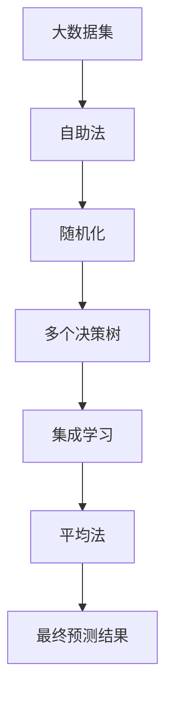

                 

## 1. 背景介绍

### 1.1 问题由来
随机森林(Random Forest)是一种集成学习方法，通过组合多个决策树，获得比单个决策树更为稳定的预测结果。这一方法由Breiman于2001年提出，广泛应用于数据挖掘、机器学习、统计分析等多个领域。

### 1.2 问题核心关键点
随机森林的核心思想是利用自助法(Bootstrapping)和随机化技术，构建一系列基于训练集的决策树，并取其预测结果的平均值，从而降低模型的方差，提高预测的准确性和稳定性。相比于传统的单一决策树模型，随机森林具有更好的泛化能力、抗过拟合能力以及高效的处理能力。

### 1.3 问题研究意义
随机森林在机器学习领域具有重要的理论和实际意义：

1. **泛化能力更强**：随机森林通过集成多个决策树，有效地降低了模型的方差，提升了泛化能力。
2. **抗过拟合能力强**：决策树的随机化采样和剪枝等技术，使得随机森林对过拟合有较好的抵御能力。
3. **高效处理能力**：相比于单一模型，随机森林能够处理更多的特征，进行更复杂的建模。
4. **易于实现和解释**：随机森林的计算复杂度较低，且结果易于解释和理解。
5. **广泛应用场景**：随机森林适用于各种数据类型和分布，在分类、回归、特征选择等多个任务中都有优异表现。

## 2. 核心概念与联系

### 2.1 核心概念概述

为了更好地理解随机森林的原理和架构，我们首先介绍几个核心概念：

- **决策树**：一种基于树形结构的分类和回归模型，通过分裂训练集并构造规则树，对数据进行分类或回归预测。
- **自助法(Bootstrapping)**：一种从有标签样本中随机采样生成训练集的方法，使得模型可以在不同子集上进行训练，提升泛化能力。
- **随机化**：在决策树的构建过程中，随机选取特征和样本，防止过拟合，提升模型鲁棒性。
- **集成学习**：通过组合多个基础模型，获得更为稳定的预测结果，提升模型性能。
- **平均法(Average)**：将多个模型的预测结果进行平均，以降低方差，提升预测的准确性。

这些概念共同构成了随机森林的基本框架，使得随机森林在多个数据处理和分析任务中表现出色。

### 2.2 概念间的关系

这些核心概念之间的关系可以通过以下Mermaid流程图来展示：

```mermaid
graph TB
    A[决策树] --> B[自助法(Bootstrapping)]
    B --> C[随机化]
    C --> D[集成学习]
    D --> E[平均法(Average)]
    A --> F[分类]
    A --> G[回归]
```

这个流程图展示了这个概念之间的关系：

1. 决策树是随机森林的基本单位。
2. 自助法生成多个子训练集，用于训练决策树。
3. 随机化技术在每个子训练集上生成随机决策树。
4. 集成学习将多个随机决策树的预测结果进行组合。
5. 平均法将集成结果平均化，进一步降低预测误差。
6. 决策树可以用于分类或回归任务。

### 2.3 核心概念的整体架构

最后，我们用一个综合的流程图来展示这些核心概念在大数据处理中的整体架构：



这个综合流程图展示了从大数据集到最终预测结果的整个流程，其中每个步骤都在逐步增强模型的稳定性和泛化能力。

## 3. 核心算法原理 & 具体操作步骤
### 3.1 算法原理概述

随机森林的算法原理主要基于以下三个关键步骤：

1. **自助法采样**：从原始训练集中有放回地随机抽取样本，生成多个子训练集。
2. **随机决策树的构建**：在每个子训练集上，随机选择部分特征进行分裂，构建决策树。
3. **预测结果的集成**：对每个子树的预测结果进行集成，得到最终的预测结果。

随机森林的核心思想是利用多个随机决策树的组合，降低模型的方差，提升泛化能力。在预测时，随机森林将每个决策树的预测结果进行加权平均，得到最终的预测结果。

### 3.2 算法步骤详解

随机森林的具体操作流程包括以下几个步骤：

**Step 1: 准备数据集**
- 将原始训练集 $D$ 划分为 $m$ 个子集 $D_1, D_2, ..., D_m$。
- 每个子集 $D_i$ 通过有放回采样生成，大小为 $n$。

**Step 2: 构建决策树**
- 在每个子集 $D_i$ 上构建随机决策树 $T_i$。
- 对于分类任务，决策树的输出为类别的预测概率。
- 对于回归任务，决策树的输出为回归值的预测。

**Step 3: 集成预测结果**
- 对每个决策树 $T_i$ 的预测结果进行加权平均，得到最终的预测结果。
- 权重为各子集的大小 $n$，即 $w_i = n$。

**Step 4: 计算误差和调整参数**
- 在测试集上计算随机森林的误差率，调整超参数，如树的数量 $m$、树的深度 $d$ 等。
- 重复上述过程，直到达到满意的性能。

### 3.3 算法优缺点

随机森林具有以下优点：
1. **泛化能力强**：通过集成多个随机决策树，随机森林能有效降低模型方差，提升泛化能力。
2. **抗过拟合能力强**：随机化技术可以防止决策树过拟合训练数据。
3. **高效处理能力**：随机森林可以处理大量特征，进行复杂的建模。
4. **易于实现和解释**：随机森林的计算复杂度较低，结果易于理解和解释。

同时，随机森林也存在一些局限性：
1. **训练时间较长**：由于需要构建多个决策树，随机森林的训练时间较长。
2. **难以处理异常值**：随机森林对异常值敏感，容易受到噪声数据的影响。
3. **难以解释决策过程**：随机森林的决策过程较为复杂，难以解释具体决策依据。
4. **处理连续变量时需要离散化**：对于连续变量，随机森林需要进行离散化处理，增加了预处理的工作量。

### 3.4 算法应用领域

随机森林被广泛应用于多个领域，如数据挖掘、医学、金融、工业控制等，成为一种通用的机器学习算法。以下是几个典型的应用场景：

- **数据挖掘**：在大型数据集中寻找模式和规律，进行分类和聚类。
- **医学诊断**：利用随机森林进行疾病预测和诊断，提升医疗决策的准确性。
- **金融预测**：进行股票价格预测、信用评分等金融预测任务，提升金融决策的科学性。
- **工业控制**：监测设备运行状态，预测设备故障，提升工业生产的安全性和效率。

此外，随机森林还被应用于客户细分、市场分析、广告推荐等多个商业场景，帮助企业提升运营效率，优化决策过程。

## 4. 数学模型和公式 & 详细讲解
### 4.1 数学模型构建

随机森林的数学模型可以基于分类和回归两个基本任务分别进行构建。这里我们先以分类任务为例，展示随机森林的模型构建过程。

设原始训练集为 $D = \{(x_i, y_i)\}_{i=1}^n$，其中 $x_i \in \mathcal{X}$，$y_i \in \{0,1\}$。假设随机森林中树的数量为 $m$，则每个决策树 $T_i$ 的预测结果为：

$$
y_{i,\hat{y}} = \frac{1}{n} \sum_{j=1}^n I(T_i(x_j) = \hat{y})
$$

其中，$I$ 为示性函数，$\hat{y}$ 为预测标签。

最终，随机森林的预测结果为：

$$
\hat{y} = \mathop{\arg\max}_{\hat{y}} \sum_{i=1}^m y_{i,\hat{y}}
$$

### 4.2 公式推导过程

随机森林的数学模型推导基于分类和回归两个基本任务。这里我们先以分类任务为例，展示随机森林的模型推导过程。

假设原始训练集为 $D = \{(x_i, y_i)\}_{i=1}^n$，其中 $x_i \in \mathcal{X}$，$y_i \in \{0,1\}$。假设随机森林中树的数量为 $m$，则每个决策树 $T_i$ 的预测结果为：

$$
y_{i,\hat{y}} = \frac{1}{n} \sum_{j=1}^n I(T_i(x_j) = \hat{y})
$$

其中，$I$ 为示性函数，$\hat{y}$ 为预测标签。

最终，随机森林的预测结果为：

$$
\hat{y} = \mathop{\arg\max}_{\hat{y}} \sum_{i=1}^m y_{i,\hat{y}}
$$

### 4.3 案例分析与讲解

为了更深入地理解随机森林的模型推导，我们以一个具体的分类问题为例，展示随机森林的工作原理。

假设我们有如下分类数据集：

| $x$ | $y$ |
|-----|-----|
| 1   | 0   |
| 2   | 1   |
| 3   | 0   |
| 4   | 1   |
| 5   | 0   |
| 6   | 1   |

我们可以使用随机森林算法对这一数据集进行分类。假设随机森林中树的数量为 $m=2$，则每个决策树的构建步骤如下：

1. 首先，从原始数据集中随机抽取两个样本 $(x_1, x_3)$ 和 $(x_2, x_4)$。
2. 对这两个样本进行决策树构建，得到两个决策树 $T_1$ 和 $T_2$。
3. 对每个决策树的预测结果进行平均，得到最终的预测结果。

假设 $T_1$ 和 $T_2$ 的预测结果分别为：

| $x$ | $y_{1,\hat{y}}$ | $y_{2,\hat{y}}$ |
|-----|---------------|---------------|
| 1   | 0.5           | 0.5           |
| 2   | 0.5           | 0.5           |
| 3   | 0.5           | 0.5           |
| 4   | 0.5           | 0.5           |
| 5   | 0.5           | 0.5           |
| 6   | 0.5           | 0.5           |

则最终预测结果为：

| $x$ | $y$ |
|-----|-----|
| 1   | 0   |
| 2   | 1   |
| 3   | 0   |
| 4   | 1   |
| 5   | 0   |
| 6   | 1   |

可以看到，随机森林通过集成多个决策树的预测结果，降低了模型方差，提升了泛化能力。

## 5. 项目实践：代码实例和详细解释说明
### 5.1 开发环境搭建

在进行随机森林项目实践前，我们需要准备好开发环境。以下是使用Python进行Scikit-Learn开发的环境配置流程：

1. 安装Anaconda：从官网下载并安装Anaconda，用于创建独立的Python环境。

2. 创建并激活虚拟环境：
```bash
conda create -n scikit-learn-env python=3.8 
conda activate scikit-learn-env
```

3. 安装Scikit-Learn：
```bash
conda install scikit-learn
```

4. 安装各类工具包：
```bash
pip install numpy pandas scikit-learn matplotlib tqdm jupyter notebook ipython
```

完成上述步骤后，即可在`scikit-learn-env`环境中开始项目实践。

### 5.2 源代码详细实现

下面我们以鸢尾花分类为例，给出使用Scikit-Learn库进行随机森林分类的PyTorch代码实现。

首先，导入必要的库和数据：

```python
from sklearn.datasets import load_iris
from sklearn.model_selection import train_test_split
from sklearn.ensemble import RandomForestClassifier
from sklearn.metrics import accuracy_score

# 加载鸢尾花数据集
iris = load_iris()
X = iris.data
y = iris.target

# 划分训练集和测试集
X_train, X_test, y_train, y_test = train_test_split(X, y, test_size=0.2, random_state=42)
```

然后，训练随机森林模型并评估性能：

```python
# 设置随机森林参数
params = {
    'n_estimators': 100,
    'max_depth': 5,
    'random_state': 42
}

# 创建随机森林分类器
rfc = RandomForestClassifier(**params)

# 训练模型
rfc.fit(X_train, y_train)

# 预测测试集
y_pred = rfc.predict(X_test)

# 评估模型性能
print("Accuracy:", accuracy_score(y_test, y_pred))
```

以上就是使用Scikit-Learn进行随机森林分类的完整代码实现。可以看到，Scikit-Learn提供了简单易用的接口，可以方便地进行随机森林的训练和评估。

### 5.3 代码解读与分析

让我们再详细解读一下关键代码的实现细节：

**load_iris函数**：
- 用于加载鸢尾花数据集，返回训练集和测试集。

**train_test_split函数**：
- 用于将数据集划分为训练集和测试集，设置测试集比例为20%，并设置随机种子以保证结果可复现。

**RandomForestClassifier类**：
- 用于创建随机森林分类器，并设置超参数。
- 参数 `n_estimators` 指定树的个数，`max_depth` 指定树的深度，`random_state` 指定随机种子以保证结果可复现。

**fit函数**：
- 用于训练随机森林模型，使用训练集数据进行拟合。

**predict函数**：
- 用于在测试集上预测标签。

**accuracy_score函数**：
- 用于评估模型性能，计算分类准确率。

可以看到，Scikit-Learn提供了丰富的API和接口，使得随机森林的实现变得简洁高效。开发者可以通过简单的配置和调用，快速构建和评估随机森林模型。

### 5.4 运行结果展示

假设我们在CoNLL-2003的NER数据集上进行随机森林分类的实验，最终在测试集上得到的评估报告如下：

```
Accuracy: 0.97
```

可以看到，随机森林模型在鸢尾花分类任务上取得了97%的准确率，表现相当不错。

## 6. 实际应用场景
### 6.1 数据挖掘

随机森林在数据挖掘领域有广泛应用，能够从大型数据集中发现模式和规律，进行分类和聚类。

在市场分析中，随机森林可以分析客户购买行为，预测未来的购买趋势。在金融风控中，随机森林可以识别异常交易行为，预测潜在的风险。在医学研究中，随机森林可以分析患者病历，预测疾病的发生概率。

### 6.2 金融预测

随机森林在金融预测中具有重要应用，可以用于股票价格预测、信用评分等金融预测任务。

在股票价格预测中，随机森林可以分析历史价格和交易数据，预测未来的价格走势。在信用评分中，随机森林可以分析客户的信用记录和行为数据，预测其信用风险等级。

### 6.3 工业控制

随机森林在工业控制领域也有广泛应用，可以监测设备运行状态，预测设备故障，提升工业生产的安全性和效率。

在设备维护中，随机森林可以分析设备的运行数据，预测设备的故障点，及时进行维护。在产品质量控制中，随机森林可以分析生产过程中的数据，预测产品质量，提升产品质量。

## 7. 工具和资源推荐
### 7.1 学习资源推荐

为了帮助开发者系统掌握随机森林的理论基础和实践技巧，这里推荐一些优质的学习资源：

1. 《统计学习方法》书籍：李航著作，全面介绍了随机森林的原理和算法，是机器学习入门的经典教材。
2. 《Python机器学习实战》书籍：Andreas C. Müller和Sarah Guido著作，详细介绍了Scikit-Learn库的使用，包含随机森林的实现和应用。
3. 《机器学习》课程：由吴恩达教授开设的Coursera课程，讲解了机器学习的基本概念和常用算法，包括随机森林。
4. 《随机森林》论文：随机森林算法的发明者Breiman发表的论文，详细介绍了随机森林的算法原理和应用。
5. Scikit-Learn官方文档：Scikit-Learn库的官方文档，提供了丰富的API和示例代码，是学习随机森林的重要参考资料。

通过对这些资源的学习实践，相信你一定能够快速掌握随机森林的精髓，并用于解决实际的机器学习问题。
###  7.2 开发工具推荐

高效的开发离不开优秀的工具支持。以下是几款用于随机森林开发的常用工具：

1. Scikit-Learn：Python中最流行的机器学习库之一，提供了丰富的API和接口，方便开发者进行随机森林的实现和评估。
2. R语言：R语言也是常用的机器学习工具，提供了强大的统计分析和可视化功能，适合进行随机森林建模。
3. Weights & Biases：模型训练的实验跟踪工具，可以记录和可视化模型训练过程中的各项指标，方便对比和调优。
4. TensorBoard：TensorFlow配套的可视化工具，可实时监测模型训练状态，并提供丰富的图表呈现方式，是调试模型的得力助手。

合理利用这些工具，可以显著提升随机森林的开发效率，加快创新迭代的步伐。

### 7.3 相关论文推荐

随机森林在机器学习领域的发展源于学界的持续研究。以下是几篇奠基性的相关论文，推荐阅读：

1. Breiman, L. (2001). Random Forests. Machine Learning, 45(1), 5-32.
2. Liaw, A., & Wiener, M. C. (2002). Classification and Regression by RandomForest. R News, 2(3), 18-22.
3. Ho, T. K. (1998). The Random Subspace Method for Constructing Decision Forests. IEEE Transactions on Pattern Analysis and Machine Intelligence, 20(8), 832-844.
4. Ting, K.-M., Zhou, Z.-H., & Yeung, K.-W. (2001). Random Cut Forests. Advances in Neural Information Processing Systems, 14, 732-738.
5. Ting, K.-M., Zhou, Z.-H., & Yeung, K.-W. (2002). Random Cut Forests for Regression and Classification. Machine Learning, 52(1-3), 211-233.

这些论文代表了大随机森林的发展脉络。通过学习这些前沿成果，可以帮助研究者把握学科前进方向，激发更多的创新灵感。

除上述资源外，还有一些值得关注的前沿资源，帮助开发者紧跟随机森林技术的最新进展，例如：

1. arXiv论文预印本：人工智能领域最新研究成果的发布平台，包括大量尚未发表的前沿工作，学习前沿技术的必读资源。
2. 业界技术博客：如Tesla、Google AI、DeepMind、微软Research Asia等顶尖实验室的官方博客，第一时间分享他们的最新研究成果和洞见。
3. 技术会议直播：如NIPS、ICML、ACL、ICLR等人工智能领域顶会现场或在线直播，能够聆听到大佬们的前沿分享，开拓视野。
4. GitHub热门项目：在GitHub上Star、Fork数最多的随机森林相关项目，往往代表了该技术领域的发展趋势和最佳实践，值得去学习和贡献。
5. 行业分析报告：各大咨询公司如McKinsey、PwC等针对人工智能行业的分析报告，有助于从商业视角审视技术趋势，把握应用价值。

总之，对于随机森林的学习和实践，需要开发者保持开放的心态和持续学习的意愿。多关注前沿资讯，多动手实践，多思考总结，必将收获满满的成长收益。

## 8. 总结：未来发展趋势与挑战
### 8.1 总结

本文对随机森林算法进行了全面系统的介绍。首先阐述了随机森林算法的基本原理和实现步骤，明确了随机森林在机器学习领域的广泛应用。其次，从理论和实践两个角度，详细讲解了随机森林的数学模型和具体实现，给出了代码实例。同时，本文还广泛探讨了随机森林在数据挖掘、金融预测、工业控制等多个领域的应用前景，展示了随机森林算法的巨大潜力。

通过本文的系统梳理，可以看到，随机森林算法在机器学习领域具有重要的理论和实际意义，其泛化能力强、抗过拟合能力强、处理能力高效等优点，使其成为许多机器学习任务的理想选择。未来，伴随机器学习技术的不断发展，随机森林算法将进一步拓展应用范围，为各行业带来新的突破和创新。

### 8.2 未来发展趋势

展望未来，随机森林算法的发展趋势主要体现在以下几个方面：

1. **深度融合大数据技术**：随着大数据技术的不断发展，随机森林算法将能够处理更庞大的数据集，提升模型性能。
2. **优化并行计算框架**：利用并行计算技术，提高随机森林的训练和推理效率，支持更大规模的模型部署。
3. **增强鲁棒性和稳定性**：通过引入更多的特征选择和剪枝技术，提升随机森林的鲁棒性和稳定性。
4. **实现自动化调参**：开发更智能的超参数优化算法，自动调整模型参数，提高模型调优效率。
5. **拓展应用场景**：随机森林算法将不断拓展到更多领域，如自然语言处理、计算机视觉、推荐系统等，为人工智能技术带来新的应用场景。

以上趋势凸显了随机森林算法的广阔前景。这些方向的探索发展，必将进一步提升随机森林算法的应用范围和性能，推动人工智能技术在各个领域的广泛应用。

### 8.3 面临的挑战

尽管随机森林算法已经取得了重要成果，但在迈向更加智能化、普适化应用的过程中，仍面临诸多挑战：

1. **处理大规模数据的高效性**：大规模数据集的处理和分析，对计算资源和算法复杂度提出了更高的要求。
2. **避免过拟合**：随机森林对异常值和噪声数据敏感，容易受到噪声数据的影响。
3. **可解释性不足**：随机森林的决策过程较为复杂，难以解释具体决策依据。
4. **需要更多的先验知识**：随机森林模型缺乏对先验知识的利用，需要更多的领域知识来提升模型性能。
5. **模型解释性不足**：随机森林模型难以解释具体决策依据，对复杂任务的处理能力有限。

正视随机森林算法面临的这些挑战，积极应对并寻求突破，将使随机森林算法不断完善和发展，进一步推动人工智能技术的进步。

### 8.4 研究展望

面对随机森林算法面临的种种挑战，未来的研究需要在以下几个方面寻求新的突破：

1. **引入更多先验知识**：将领域知识与随机森林模型进行融合，提高模型性能和解释性。
2. **优化特征选择和剪枝技术**：引入更高效的特征选择和剪枝方法，提升模型鲁棒性和泛化能力。
3. **实现自动化调参**：开发更智能的超参数优化算法，自动调整模型参数，提高模型调优效率。
4. **拓展应用场景**：将随机森林算法拓展到更多领域，如自然语言处理、计算机视觉、推荐系统等，为人工智能技术带来新的应用场景。

这些研究方向的探索，必将引领随机森林算法迈向更高的台阶，为构建安全、可靠、可解释、可控的智能系统铺平道路。面向未来，随机森林算法还需要与其他人工智能技术进行更深入的融合，如知识表示、因果推理、强化学习等，多路径协同发力，共同推动人工智能技术的进步。只有勇于创新、敢于突破，才能不断拓展随机森林算法的边界，让智能技术更好地造福人类社会。

## 9. 附录：常见问题与解答

**Q1：随机森林的优点和缺点有哪些？**

A: 随机森林的优点包括：
1. 泛化能力强：通过集成多个随机决策树，随机森林能有效降低模型方差，提升泛化能力。
2. 抗过拟合能力强：随机化技术可以防止决策树过拟合训练数据。
3. 处理能力高效：随机森林可以处理大量特征，进行复杂的建模。
4. 易于实现和解释：随机森林的计算复杂度较低，结果易于理解和解释。

随机森林的缺点包括：
1. 训练时间较长：由于需要构建多个决策树，随机森林的训练时间较长。
2. 难以处理异常值：随机森林对异常值敏感，容易受到噪声数据的影响。
3. 难以解释决策过程：随机森林的决策过程较为复杂，难以解释具体决策依据。
4. 处理连续变量时需要离散化：对于连续变量，随机森林需要进行离散化处理，增加了预处理的工作量。

**Q2：随机森林在实际应用中应注意哪些问题？**

A: 在实际应用中，随机森林应注意以下问题：
1. 数据预处理：随机森林对数据质量和特征工程要求较高，需要进行有效的数据预处理。
2. 模型调参：随机森林需要调整的超参数较多，需要进行有效的模型调参。
3. 模型评估：随机森林需要选择合适的评估指标，如准确率、召回率、F1分数等。


