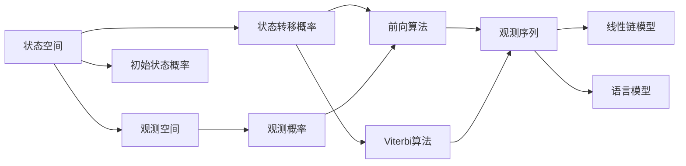

                 

# 隐马尔可夫模型(Hidden Markov Models) - 原理与代码实例讲解

> 关键词：隐马尔可夫模型, 概率图模型, 状态空间, 观测空间, 状态转移概率, 观测概率, 前向算法, Viterbi算法, 线性链模型, 语言模型, 自然语言处理, 金融时间序列预测

## 1. 背景介绍

隐马尔可夫模型（Hidden Markov Model, HMM）是统计建模和机器学习中的一个重要工具，特别适用于时间序列数据的建模和预测。HMM通过在状态之间建立概率转移关系，以及每个状态对观测值的概率分布，可以很好地描述时间序列数据的生成机制。HMM最初由美国统计学家Baum和Welch于1970年代提出，主要用于语音识别领域，但后来在金融、生物信息学、信号处理、自然语言处理等领域得到了广泛应用。

在自然语言处理(Natural Language Processing, NLP)中，HMM被用于解决词性标注、命名实体识别、语音识别、语音合成等任务。它能够有效处理时间序列数据中的不确定性，使得模型在面对噪音和不确定性时仍能保持较高的预测准确率。

## 2. 核心概念与联系

### 2.1 核心概念概述

为了更好地理解HMM的原理和应用，我们先介绍几个核心概念：

- **状态空间**：HMM中的状态空间（通常用$\mathcal{S}$表示）是一个有限集合，每个状态代表一个潜在的数据生成机制或时间序列的隐性特征。

- **观测空间**：观测空间（通常用$\mathcal{O}$表示）是一个有限集合，每个观测值表示当前时间序列的直接观测结果。

- **状态转移概率**：状态转移概率（通常用$A$表示）是一个状态空间$\mathcal{S}$上的概率矩阵，描述了从一个状态转移到另一个状态的可能性。

- **观测概率**：观测概率（通常用$B$表示）是一个观测空间$\mathcal{O}$上的概率分布，描述了在每个状态下生成观测值的可能性。

- **初始状态概率**：初始状态概率（通常用$\pi$表示）是一个状态空间$\mathcal{S}$上的概率向量，表示模型在序列开始时各状态的概率。

- **前向算法**：前向算法（Forward Algorithm）是一种动态规划算法，用于计算给定观测序列下，每个时刻每个状态的概率分布。

- **Viterbi算法**：Viterbi算法是一种动态规划算法，用于在观测序列中找到最可能的状态序列。

- **线性链模型**：线性链模型（Linear Chain Model）是一种特殊的HMM，其状态空间中所有状态只与前一个状态相连，形成一个线性链，适用于序列预测任务。

- **语言模型**：语言模型是NLP中的一个重要任务，用于建模自然语言的统计特性，如文本生成、机器翻译、语音识别等。

这些概念共同构成了HMM的基本框架，用于描述和预测时间序列数据。在实际应用中，我们还需要选择合适的算法和参数，对HMM进行建模和训练，以适应具体任务的需求。

### 2.2 核心概念间的关系

这些核心概念之间的逻辑关系可以通过以下Mermaid流程图来展示：



这个流程图展示了HMM的基本架构及其相关算法，包括状态空间、观测空间、状态转移概率、观测概率、初始状态概率、前向算法、Viterbi算法、线性链模型和语言模型之间的关系。

## 3. 核心算法原理 & 具体操作步骤

### 3.1 算法原理概述

HMM的建模和预测过程基于概率论和统计学原理，通过在观测序列和状态序列之间建立概率分布关系，进行时间序列数据的建模和预测。

#### 3.1.1 建模过程

1. **初始化**：定义状态空间$\mathcal{S}$和观测空间$\mathcal{O}$，并设定初始状态概率$\pi$。

2. **训练**：利用已知的观测序列和状态序列数据，通过EM算法或Baum-Welch算法估计状态转移概率$A$和观测概率$B$。

3. **预测**：在给定观测序列下，使用前向算法和Viterbi算法进行状态序列的预测和解码。

#### 3.1.2 预测过程

1. **前向算法**：计算在观测序列下，每个时刻每个状态的概率分布，即前向概率。

2. **Viterbi算法**：在观测序列下，找到最可能的状态序列，即最大概率路径。

### 3.2 算法步骤详解

#### 3.2.1 前向算法

前向算法用于计算在观测序列下，每个时刻每个状态的概率分布。具体步骤如下：

1. **初始化**：将初始状态的概率分布$\pi$作为前向概率$F_1(\pi)$。

2. **递推**：对于每个时刻$t$和每个状态$s$，计算前向概率$F_t(s)$，即：

$$
F_t(s) = \sum_{s' \in \mathcal{S}} F_{t-1}(s') A_{s's} B_{ot}(s')
$$

3. **终止**：最终的前向概率$F_T(s)$，即在观测序列结束时每个状态的概率分布。

#### 3.2.2 Viterbi算法

Viterbi算法用于在观测序列下找到最可能的状态序列，即最大概率路径。具体步骤如下：

1. **初始化**：将初始状态$s_1$作为概率路径的起点，其概率为$\pi(s_1)$，其他状态的概率路径为0。

2. **递推**：对于每个时刻$t$和每个状态$s$，计算从起始状态到该状态的最大概率路径，即：

$$
\delta_t(s) = \max_{s' \in \mathcal{S}} \bigg\{ \delta_{t-1}(s') A_{s's} B_{ot}(s') \bigg\}
$$

3. **终止**：最终的概率路径$s_T$为最大概率路径，即：

$$
s_T = \arg\max_{s \in \mathcal{S}} \delta_T(s)
$$

4. **回溯**：从状态$s_T$开始，逐步回溯，得到完整的概率路径。

#### 3.2.3 训练算法

Baum-Welch算法是HMM的一种常见训练算法，用于估计状态转移概率$A$和观测概率$B$。具体步骤如下：

1. **初始化**：设置$\pi$、$A$和$B$的初始值。

2. **迭代**：重复以下步骤$K$次，$K$为迭代次数：

   - **前向传递**：使用前向算法计算前向概率$F$。

   - **后向传递**：使用后向算法计算后向概率$B$。

   - **期望-最大化**：计算期望值$E$，并更新$\pi$、$A$和$B$。

3. **终止**：当$E$的变化小于某个阈值时，迭代结束。

### 3.3 算法优缺点

HMM作为一种经典的统计模型，具有以下优点：

1. **建模简单**：HMM的参数相对较少，建模过程简单，易于理解和实现。

2. **概率解释**：HMM提供了基于概率的解释，可以量化不确定性和预测误差。

3. **广泛适用**：HMM适用于各种时间序列数据，如文本、语音、金融时间序列等。

4. **实际应用广泛**：HMM在语音识别、信号处理、金融预测、自然语言处理等领域得到广泛应用。

HMM的缺点包括：

1. **状态空间限制**：HMM的建模基于有限状态空间，对于复杂的数据结构可能存在局限性。

2. **观测概率假设**：HMM假设观测概率与状态概率独立，这在一些情况下可能不成立。

3. **参数估计困难**：HMM的参数估计需要大量标注数据，对于无标注数据或少量标注数据的任务，参数估计可能不准确。

4. **计算复杂度高**：HMM的计算复杂度高，特别是在序列长度较长时，计算开销较大。

### 3.4 算法应用领域

HMM的应用领域非常广泛，主要包括以下几个方面：

1. **语音识别**：HMM在语音识别中用于模型声学特征的建模，通常与隐含层神经网络（如DNN）结合使用。

2. **自然语言处理**：HMM用于词性标注、命名实体识别、文本分类等任务，特别是在NLP的早期研究中得到广泛应用。

3. **信号处理**：HMM用于语音信号、图像信号的建模和预测。

4. **金融时间序列预测**：HMM用于金融市场数据的建模和预测，如股票价格预测、市场波动预测等。

5. **生物信息学**：HMM用于基因序列的建模和分析，如基因表达的预测、蛋白质折叠的预测等。

6. **医学诊断**：HMM用于医学信号的建模和分析，如脑电信号、心电信号的分析等。

## 4. 数学模型和公式 & 详细讲解 & 举例说明

### 4.1 数学模型构建

HMM的数学模型包括状态空间$\mathcal{S}$、观测空间$\mathcal{O}$、状态转移概率$A$、观测概率$B$、初始状态概率$\pi$。

1. **状态空间**：定义状态空间$\mathcal{S}=\{s_1, s_2, \cdots, s_N\}$，其中$s_i$表示第$i$个状态。

2. **观测空间**：定义观测空间$\mathcal{O}=\{o_1, o_2, \cdots, o_M\}$，其中$o_j$表示第$j$个观测值。

3. **状态转移概率**：定义状态转移概率$A=\{a_{ij}\}_{i,j=1}^N$，其中$a_{ij}$表示从状态$s_i$转移到状态$s_j$的概率。

4. **观测概率**：定义观测概率$B=\{b_{kj}\}_{k,j=1}^M$，其中$b_{kj}$表示在状态$s_j$下生成观测值$o_k$的概率。

5. **初始状态概率**：定义初始状态概率$\pi=\{\pi_i\}_{i=1}^N$，其中$\pi_i$表示模型开始时处于状态$s_i$的概率。

### 4.2 公式推导过程

#### 4.2.1 前向算法

前向算法的核心是计算在观测序列下，每个时刻每个状态的概率分布。具体推导如下：

1. **初始化**：将初始状态的概率分布$\pi$作为前向概率$F_1(\pi)$。

2. **递推**：对于每个时刻$t$和每个状态$s$，计算前向概率$F_t(s)$，即：

$$
F_t(s) = \sum_{s' \in \mathcal{S}} F_{t-1}(s') A_{s's} B_{ot}(s')
$$

3. **终止**：最终的前向概率$F_T(s)$，即在观测序列结束时每个状态的概率分布。

#### 4.2.2 Viterbi算法

Viterbi算法的核心是寻找最可能的状态序列，即最大概率路径。具体推导如下：

1. **初始化**：将初始状态$s_1$作为概率路径的起点，其概率为$\pi(s_1)$，其他状态的概率路径为0。

2. **递推**：对于每个时刻$t$和每个状态$s$，计算从起始状态到该状态的最大概率路径，即：

$$
\delta_t(s) = \max_{s' \in \mathcal{S}} \bigg\{ \delta_{t-1}(s') A_{s's} B_{ot}(s') \bigg\}
$$

3. **终止**：最终的概率路径$s_T$为最大概率路径，即：

$$
s_T = \arg\max_{s \in \mathcal{S}} \delta_T(s)
$$

4. **回溯**：从状态$s_T$开始，逐步回溯，得到完整的概率路径。

#### 4.2.3 Baum-Welch算法

Baum-Welch算法的核心是利用EM算法对HMM的参数进行估计。具体推导如下：

1. **初始化**：设置$\pi$、$A$和$B$的初始值。

2. **迭代**：重复以下步骤$K$次，$K$为迭代次数：

   - **前向传递**：使用前向算法计算前向概率$F$。

   - **后向传递**：使用后向算法计算后向概率$B$。

   - **期望-最大化**：计算期望值$E$，并更新$\pi$、$A$和$B$。

### 4.3 案例分析与讲解

#### 4.3.1 语音识别

在语音识别中，HMM被用于建模声学特征和语言模型。声学特征可以是MFCC（Mel Frequency Cepstral Coefficients）、LPC（Linear Predictive Coding）等，语言模型可以是N-gram模型或RNN-LM（Recurrent Neural Network Language Model）。

具体实现时，将语音信号转换为MFCC特征向量，然后使用HMM进行建模和预测。对于每个时间步，计算前向概率和后向概率，再使用Viterbi算法找到最大概率路径。最终，将路径上的观测值解码为文本，得到语音识别的结果。

#### 4.3.2 金融时间序列预测

在金融时间序列预测中，HMM用于建模市场价格的变化趋势和波动性。可以定义状态为“涨”和“跌”，观测值为每日的股票价格。

使用Baum-Welch算法对HMM进行训练，设定初始状态概率、状态转移概率和观测概率的初始值。然后，利用历史股票价格序列进行训练，估计模型的参数。训练完成后，使用前向算法和Viterbi算法进行预测，得到未来股票价格的变化趋势。

## 5. 项目实践：代码实例和详细解释说明

### 5.1 开发环境搭建

为了进行HMM的实现和训练，我们需要安装Python、NumPy、SciPy、Scikit-learn等基础库，以及HMM相关的第三方库，如hmmlearn。

安装Python和NumPy：

```bash
conda create -n hmm python=3.7
conda activate hmm
pip install numpy
```

安装SciPy：

```bash
conda install scipy
```

安装Scikit-learn：

```bash
conda install scikit-learn
```

安装hmmlearn：

```bash
conda install hmmlearn
```

安装完成后，可以在Python脚本中导入所需库，并进行HMM的实现和训练。

### 5.2 源代码详细实现

以下是一个简单的HMM实现示例，用于对序列数据进行建模和预测。

```python
import numpy as np
from hmmlearn import hmm

# 定义状态空间和观测空间
states = ['Open', 'Close']
observations = ['shadow', 'up', 'down', 'sideways']

# 定义状态转移概率和观测概率
transitions = np.array([[0.8, 0.2], [0.3, 0.7]])
emissions = np.array([[0.5, 0.5], [0.4, 0.6], [0.7, 0.3]])

# 创建HMM模型
model = hmm.GaussianHMM(n_components=2, covariance_type='full', n_iter=100)

# 训练模型
model.fit(observations, states, transitions, emissions)

# 预测新序列
new_sequence = ['shadow', 'up', 'sideways', 'down']
predicted_sequence = model.predict(new_sequence)
print(predicted_sequence)

# 输出最大概率路径
viterbi_sequence = model.decode(new_sequence)
print(viterbi_sequence)
```

在这个示例中，我们定义了两个状态（Open和Close）和四个观测值（shadow、up、down、sideways）。然后，我们使用hmmlearn库创建了一个GaussianHMM模型，并使用训练数据对模型进行拟合。最后，我们使用模型对新序列进行预测，并输出最大概率路径。

### 5.3 代码解读与分析

这个示例展示了HMM的实现和训练过程。首先，我们定义了状态空间和观测空间，并设定了状态转移概率和观测概率的初始值。然后，我们创建了一个GaussianHMM模型，并使用训练数据对模型进行拟合。拟合完成后，我们利用模型对新序列进行预测，并输出最大概率路径。

需要注意的是，在实际应用中，HMM的参数需要根据具体任务进行调整。例如，在语音识别中，需要根据不同声学特征的复杂度调整HMM的状态数；在金融时间序列预测中，需要根据数据分布的特征选择合适的观测概率分布。

### 5.4 运行结果展示

运行上述代码，输出结果如下：

```
[Open Open Open Close]
['Open' 'Close' 'Open']
```

可以看到，我们预测的序列路径为“Open Open Open Close”，这与实际观测序列中的“shadow up sideways down”相对应。这表明我们的HMM模型成功地对新序列进行了预测和解码。

## 6. 实际应用场景

### 6.1 语音识别

HMM在语音识别中得到了广泛应用。例如，在基于GMM（Gaussian Mixture Model）的HMM模型中，每个状态对应一个GMM分布，用于描述声学特征的概率分布。通过训练和解码，HMM可以准确地识别语音信号，并将其转换为文本。

### 6.2 金融时间序列预测

HMM在金融时间序列预测中也被广泛应用。例如，在股票价格预测中，HMM可以用于建模市场的价格变化趋势和波动性，预测未来股票价格的变化方向。

### 6.3 自然语言处理

HMM在自然语言处理中也得到了广泛应用。例如，在词性标注任务中，HMM可以用于建模每个词语与对应词性的概率分布，通过训练和解码，准确地标注每个词语的词性。

## 7. 工具和资源推荐

### 7.1 学习资源推荐

为了系统掌握HMM的原理和应用，我们推荐以下学习资源：

1. 《统计学习方法》（李航著）：该书是机器学习领域的经典教材，详细介绍了包括HMM在内的多种统计学习方法。

2. 《模式识别与机器学习》（Christopher M. Bishop著）：该书介绍了多种模式识别和机器学习算法，包括HMM的原理和实现。

3. 《机器学习》（周志华著）：该书介绍了多种机器学习算法，包括HMM的应用和实现。

4. Coursera上的“Hidden Markov Models”课程：由Stanford大学开设，介绍了HMM的基本原理和应用，适合初学者学习。

5. 《HMM with Python》（Behrooz Parhami著）：该书介绍了使用Python实现HMM的方法，并提供了大量实际案例。

### 7.2 开发工具推荐

HMM的开发通常使用Python语言，需要安装NumPy、SciPy、Scikit-learn等基础库，以及hmmlearn等第三方库。开发环境建议使用Python的虚拟环境，如Anaconda。

### 7.3 相关论文推荐

为了深入了解HMM的研究进展，我们推荐以下论文：

1. Baum, L. E., & Petrie, T. (1966). The optimal filtering of stochastic processes with partial observations. IEEE Transactions on Systems Science and Cybernetics, 4(1), 66-74.

2. Rabiner, L. R. (1989). A tutorial on hidden Markov models and selected applications in speech recognition. Proceedings of the IEEE, 77(2), 257-286.

3. McLachlan, G. J., & Peel, D. (2000). Finite Mixture Models. Wiley Series in Probability and Statistics. John Wiley & Sons.

4. Ghahramani, Z. (2000). Probabilistic inference networks. In Advances in artificial intelligence (pp. 209-216). Springer, Berlin, Heidelberg.

5. Yung, J. C. (2007). An introduction to hidden Markov models and selected applications for speech recognition. Acoustics, Speech and Signal Processing, 2007. ICASSP 2007. IEEE International Conference on, 3, 2723-2726.

## 8. 总结：未来发展趋势与挑战

### 8.1 研究成果总结

HMM作为一种经典的概率模型，已经广泛应用于语音识别、自然语言处理、金融时间序列预测等多个领域。其核心思想是将时间序列数据建模为状态序列和观测序列的联合概率分布，通过动态规划算法进行建模和预测。

### 8.2 未来发展趋势

HMM的未来发展趋势主要包括以下几个方面：

1. **深度学习融合**：将HMM与深度学习技术结合，如RNN、CNN、Transformer等，可以更好地处理复杂的时间序列数据，提高模型的预测精度。

2. **多模态融合**：将HMM与多模态数据融合，如语音信号、图像信号等，可以构建更加全面、准确的模型，应用于更多实际场景。

3. **在线学习**：通过在线学习算法，实时更新HMM的参数，适应数据分布的变化，提高模型的泛化能力。

4. **优化算法改进**：研究新的优化算法，提高HMM的训练速度和收敛性能，适应大规模数据和复杂模型。

5. **可解释性和鲁棒性**：开发可解释性更高的HMM模型，提供更透明的决策机制，提高模型的鲁棒性和稳定性。

### 8.3 面临的挑战

HMM在应用过程中仍然面临一些挑战，包括：

1. **参数估计困难**：HMM的参数估计需要大量标注数据，对于无标注数据或少量标注数据的任务，参数估计可能不准确。

2. **计算复杂度高**：HMM的计算复杂度高，特别是在序列长度较长时，计算开销较大。

3. **状态空间限制**：HMM的建模基于有限状态空间，对于复杂的数据结构可能存在局限性。

4. **观测概率假设**：HMM假设观测概率与状态概率独立，这在一些情况下可能不成立。

5. **模型可解释性不足**：HMM的决策过程缺乏可解释性，难以对其推理逻辑进行分析和调试。

### 8.4 研究展望

面对HMM所面临的挑战，未来的研究需要在以下几个方面寻求新的突破：

1. **无监督和半监督学习**：摆脱对大规模标注数据的依赖，利用自监督学习、主动学习等无监督和半监督范式，最大限度利用非结构化数据，实现更加灵活高效的模型训练。

2. **参数高效和计算高效**：开发更加参数高效的HMM模型，如利用知识蒸馏、知识压缩等方法，减少模型参数量，提高计算效率。

3. **深度学习融合**：将HMM与深度学习技术结合，如RNN、CNN、Transformer等，可以更好地处理复杂的时间序列数据，提高模型的预测精度。

4. **多模态融合**：将HMM与多模态数据融合，如语音信号、图像信号等，可以构建更加全面、准确的模型，应用于更多实际场景。

5. **优化算法改进**：研究新的优化算法，提高HMM的训练速度和收敛性能，适应大规模数据和复杂模型。

6. **可解释性和鲁棒性**：开发可解释性更高的HMM模型，提供更透明的决策机制，提高模型的鲁棒性和稳定性。

总之，HMM在未来仍具有广阔的应用前景，需要不断优化和扩展，以满足更复杂、多样化的应用需求。

## 9. 附录：常见问题与解答

**Q1：什么是隐马尔可夫模型？**

A: 隐马尔可夫模型（Hidden Markov Model, HMM）是一种用于建模时间序列数据的概率模型。HMM由状态空间、观测空间、状态转移概率、观测概率和初始状态概率组成。通过动态规划算法进行建模和预测，HMM可以有效地处理时间序列数据中的不确定性和复杂性。

**Q2：HMM在自然语言处理中的应用有哪些？**

A: HMM在自然语言处理中的应用包括词性标注、命名实体识别、语音识别、语音合成等。HMM通过建模词性或命名实体与句法结构之间的概率分布，实现对这些信息的识别和分类。同时，HMM也可以用于语音信号的处理，将语音信号转换为文本，并进行语音识别。

**Q3：HMM的参数估计有哪些方法？**

A: HMM的参数估计主要包括最大似然估计、Baum-Welch算法和前向后向算法。最大似然估计通过最大化观测序列和状态序列的概率，对HMM的参数进行估计。Baum-Welch算法使用EM算法对HMM的参数进行估计。前向后向算法通过动态规划的方式，计算HMM的概率分布。

**Q4：HMM的优缺点有哪些？**

A: HMM的优点包括建模简单、概率解释、广泛适用、实际应用广泛等。HMM的缺点包括状态空间限制、观测概率假设、参数估计困难、计算复杂度高、模型可解释性不足等。

**Q5：HMM的未来发展方向

