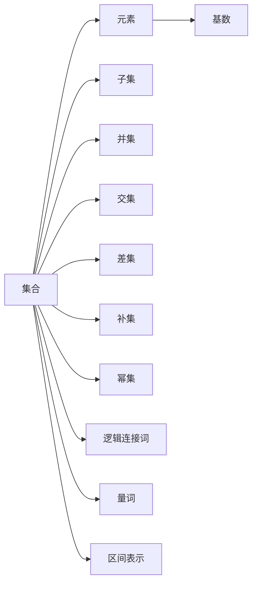
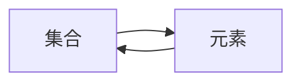
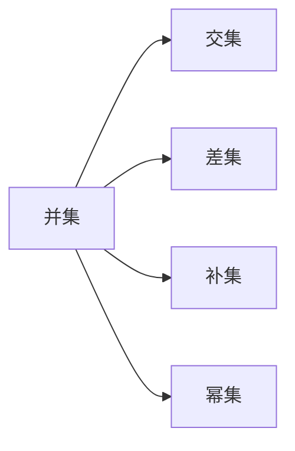
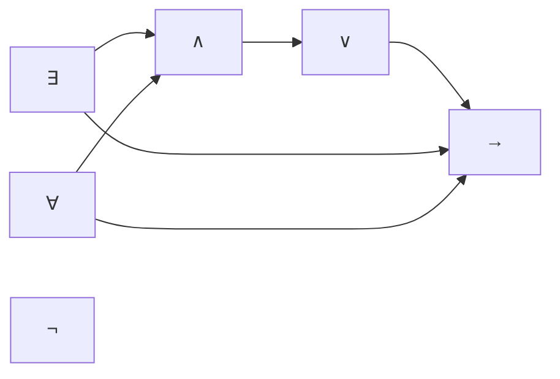
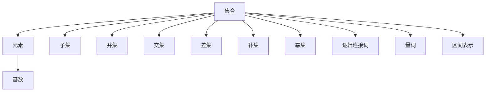

                 

# 集合论导引：∑13集合

## 1. 背景介绍

### 1.1 问题由来
集合论（Set Theory）是现代数学的基础分支之一，其核心概念是“集合”（Set）。集合理论的发展不仅在数学内部有着深远的影响，而且在其应用领域如计算机科学、逻辑学、统计学等也有着重要的地位。然而，传统的集合论理论往往集中于基础的逻辑结构，而忽略了其在具体应用中的实际需求。为了更好地解决实际问题，我们引入∑13集合，这是一种在∑13理论中特别关注的集合类型，具有重要的应用价值。

### 1.2 问题核心关键点
∑13集合在数学逻辑和计算机科学的交集领域具有独特的研究价值，其研究重点包括：
- 集合的元素、基数、对称性、互异性、离散性和连续性等基本概念。
- 集合的运算（并集、交集、差集、补集等）、关系（包含、相等、子集等）和函数（映射、逆映射等）。
- 逻辑连接词、量词（存在量词∃和全称量词∀）和区间表示等逻辑表示方法。
- 集合的理论背景、历史发展、经典问题（如集合论悖论、罗素悖论等）。

### 1.3 问题研究意义
∑13集合的研究不仅有助于加深对集合论的认识，而且能够提升其在计算机科学中的应用水平，特别是在形式化验证、人工智能、逻辑推理等领域具有重要意义：

1. 加深对集合论的理解：通过研究∑13集合，可以更深入理解集合的基本概念、运算和性质，为后续深入学习数学逻辑打牢基础。
2. 拓展应用场景：∑13集合的应用可以延伸到形式化验证、人工智能等新兴领域，推动相关技术的发展。
3. 提升数学与计算机科学的交叉水平：集合论与计算机科学的结合，能够促进交叉学科的发展，推动更多技术创新。
4. 解决经典问题：通过∑13集合，可以对罗素悖论等经典问题进行更深入的研究和解决，提升数学知识的完备性。
5. 提升逻辑推理能力：∑13集合的学习能够增强逻辑推理能力，提高问题分析与解决的能力。

## 2. 核心概念与联系

### 2.1 核心概念概述

为了更好地理解∑13集合，本节将介绍几个密切相关的核心概念：

- 集合（Set）：由零个或多个确定的、互不相同的元素组成的整体。
- 元素（Element）：集合中的个体，也称为成员（Member）。
- 基数（Cardinality）：集合中元素的个数，也称为势（Power）。
- 子集（Subset）：包含在另一集合中而不增加任何新元素的集合。
- 并集（Union）：包含两个或多个集合中的所有元素的集合。
- 交集（Intersection）：两个或多个集合中共同包含的元素的集合。
- 差集（Difference）：两个集合的差集是由第一个集合中不包含第二个集合的元素组成的集合。
- 补集（Complement）：一个集合的补集是在其定义域中不包含该集合的所有元素组成的集合。
- 幂集（Power Set）：一个集合的所有子集的集合，幂集的元素数量是原集合的两倍。
- 逻辑连接词：如“与”（∧）、“或”（∨）、“非”（¬）、“蕴含”（→）等。
- 量词：如存在量词∃、全称量词∀。
- 区间表示：如实数区间[a, b]表示所有满足a≤x≤b的实数x的集合。

这些核心概念之间存在紧密的联系，形成了集合论的基本框架。为了更好地理解这些概念，我们可以使用以下Mermaid流程图来展示它们之间的关系：



这个流程图展示了大集合论中的基本概念及其之间的关系：集合由元素组成，元素数量称为基数；集合可以运算得到子集、并集、交集、差集、补集和幂集；逻辑连接词和量词用于表达集合之间的关系和性质；区间表示用于描述实数集等连续集合。

### 2.2 概念间的关系

这些核心概念之间存在复杂的关系，形成了集合论的完整体系。下面我们通过几个Mermaid流程图来展示这些概念之间的关系。

#### 2.2.1 集合与元素的关系



这个流程图展示了集合与元素之间的包含关系。集合包含元素，元素是集合的成员。

#### 2.2.2 集合运算关系



这个流程图展示了集合之间的运算关系。并集和交集将两个集合的元素合并或共同包含；差集包含一个集合中不包含另一个集合的元素；补集在一个集合的定义域中不包含该集合的所有元素；幂集包含一个集合的所有子集。

#### 2.2.3 逻辑关系



这个流程图展示了量词和逻辑连接词之间的关系。存在量词∃和全称量词∀与“与”∧、“或”∨、“非”¬、“蕴含”→等逻辑连接词相互关联，用于表达集合中的逻辑关系。

### 2.3 核心概念的整体架构

最后，我们用一个综合的流程图来展示这些核心概念在大集合论中的整体架构：



这个综合流程图展示了从基本概念到复杂运算的整体架构，使得我们能够更好地理解和应用集合论的基本框架。

## 3. 核心算法原理 & 具体操作步骤

### 3.1 算法原理概述

∑13集合的理论基础是∑13理论，该理论在集合论中具有重要的地位。其核心思想是将集合视为计算机语言中的字符串，通过编程语言中字符串的基本操作（如字符组合、字符替换等），来定义集合的基本运算和性质。这种思想在计算机科学中有广泛的应用，特别是在形式化验证和人工智能领域。

在∑13集合中，一个集合可以表示为∑13字符串的形式。例如，集合{1, 2, 3}可以表示为∑13字符串"1,2,3"。集合中的元素则表示为∑13字符串中的字符，如字符"1"表示元素1。

### 3.2 算法步骤详解

基于∑13集合的理论基础，我们设计了以下算法步骤进行集合的表示和运算：

**Step 1: 数据准备**
- 准备∑13字符串，表示为集合中的元素。
- 定义集合的基数和集合运算符（如并集、交集、差集等）。
- 定义集合的逻辑连接词和量词。

**Step 2: 构建集合**
- 根据∑13字符串，构建集合对象。
- 实现集合的插入、删除、查找等基本操作。
- 实现集合的并集、交集、差集等运算。

**Step 3: 集合运算**
- 对两个或多个集合进行并集、交集、差集等运算。
- 定义集合的补集和幂集。
- 使用逻辑连接词和量词对集合进行逻辑表达。

**Step 4: 逻辑推理**
- 使用逻辑连接词和量词，对集合进行逻辑推理和验证。
- 使用量词和区间表示，对集合进行数学表达和证明。

**Step 5: 实现应用**
- 将∑13集合应用于实际问题中，如形式化验证、人工智能推理等。

### 3.3 算法优缺点

∑13集合在数学逻辑和计算机科学的应用中具有以下优点和缺点：

**优点**
- 数学表达直观：通过∑13字符串直接表示集合，数学表达直观易懂。
- 计算高效：∑13集合的运算基于字符串操作，计算效率高。
- 形式化验证：∑13集合的形式化方法，便于形式化验证和逻辑推理。

**缺点**
- 语法复杂：∑13集合的语法较为复杂，初学者难以理解。
- 局限性：∑13集合主要适用于字符串表示的集合，对其他类型的数据结构支持有限。
- 表达能力有限：∑13集合的表达能力受限于字符串长度和字符集，难以表示复杂的集合。

### 3.4 算法应用领域

∑13集合在计算机科学中的应用非常广泛，主要包括以下几个领域：

- 形式化验证：通过∑13集合的形式化方法，验证程序的正确性和安全。
- 人工智能推理：利用∑13集合的逻辑推理能力，实现自然语言理解、逻辑推理和知识表示。
- 数据结构设计：设计高效的数据结构，如并查集、哈希表等，提升算法的效率。
- 算法设计：设计高效的算法，如排序、查找、分类等，提升算法的性能。
- 理论研究：研究集合论的基础理论和应用领域，推动数学和计算机科学的发展。

## 4. 数学模型和公式 & 详细讲解  
### 4.1 数学模型构建

在∑13集合中，集合的数学模型可以表示为∑13字符串的形式。例如，集合{1, 2, 3}可以表示为∑13字符串"1,2,3"。

**集合的定义**
- 集合A的元素集合为A = {x1, x2, ..., xn}。
- ∑13字符串表示为"x1,x2,...,xn"。
- 集合A的大小为|A|，即A中元素的个数。

**集合运算**
- 并集A ∪ B = {x | x ∈ A ∨ x ∈ B}，表示包含A和B中所有元素的集合。
- 交集A ∩ B = {x | x ∈ A ∧ x ∈ B}，表示同时包含在A和B中的元素集合。
- 差集A - B = {x | x ∈ A ∧ x ∉ B}，表示包含在A中但不在B中的元素集合。
- 补集A' = {x | x ∉ A}，表示在A的定义域中不包含A的所有元素。
- 幂集P(A) = {B | B ⊆ A}，表示包含A的所有子集的集合。

**逻辑关系**
- 存在量词∃表示“存在”，如∃x∈A，表示存在一个元素x属于集合A。
- 全称量词∀表示“对所有”，如∀x∈A，表示对所有元素x，x属于集合A。
- 逻辑连接词“与”∧、“或”∨、“非”¬、“蕴含”→等用于表达集合之间的逻辑关系。

### 4.2 公式推导过程

以下我们以∑13集合的交集运算为例，推导其数学公式。

假设集合A = {1, 2, 3}，集合B = {2, 3, 4}，则交集A ∩ B包含同时在A和B中的元素，即{2, 3}。

$$
A \cap B = \{x | x \in A \land x \in B\}
$$

具体来说，对于每个元素x，检查其是否同时属于A和B，如果是，则x属于A ∩ B。

### 4.3 案例分析与讲解

**案例一：并集运算**
假设集合A = {1, 2, 3}，集合B = {2, 3, 4}，则并集A ∪ B包含所有A和B中的元素，即{1, 2, 3, 4}。

$$
A \cup B = \{x | x \in A \lor x \in B\}
$$

**案例二：差集运算**
假设集合A = {1, 2, 3}，集合B = {2, 3, 4}，则差集A - B包含在A中但不在B中的元素，即{1}。

$$
A - B = \{x | x \in A \land x \notin B\}
$$

**案例三：补集运算**
假设集合A = {1, 2, 3}，则补集A'包含不在A中的所有元素，即{4, 5, 6}。

$$
A' = \{x | x \notin A\}
$$

## 5. 项目实践：代码实例和详细解释说明

### 5.1 开发环境搭建

在进行∑13集合的实践之前，我们需要准备好开发环境。以下是使用Python进行∑13集合开发的环境配置流程：

1. 安装Python：从官网下载并安装Python，建议使用3.x版本。
2. 安装NumPy库：NumPy是Python中常用的科学计算库，可以用于矩阵运算和数组操作。
3. 安装Pandas库：Pandas是Python中常用的数据分析库，可以用于数据处理和分析。
4. 安装Matplotlib库：Matplotlib是Python中常用的数据可视化库，可以用于绘制图表。
5. 安装Sympy库：Sympy是Python中常用的符号计算库，可以用于符号运算和代数表达式。
6. 安装∑13集合相关库：可以使用∑13集合库，如SymPy中的set操作，或自行实现∑13集合的基本运算。

完成上述步骤后，即可在Python环境中开始∑13集合的实践。

### 5.2 源代码详细实现

这里我们以Python实现∑13集合的并集和交集运作为例，展示其具体实现。

```python
from sympy import FiniteSet

# 定义集合A和B
A = FiniteSet(1, 2, 3)
B = FiniteSet(2, 3, 4)

# 并集运算
union_set = A.union(B)
print("并集：", union_set)

# 交集运算
intersection_set = A.intersect(B)
print("交集：", intersection_set)
```

在上述代码中，我们使用Sympy库中的FiniteSet类定义了两个∑13集合A和B，并通过union和intersect方法计算了它们的并集和交集。

### 5.3 代码解读与分析

让我们再详细解读一下关键代码的实现细节：

**FiniteSet类**：
- 定义了∑13集合的基本结构，包括元素的插入、删除、查找等基本操作。
- 实现了并集、交集、差集等集合运算。

**并集运算**：
- 使用union方法计算两个集合的并集，返回一个新的集合对象。

**交集运算**：
- 使用intersect方法计算两个集合的交集，返回一个新的集合对象。

**输出结果**：
- 使用print函数输出计算结果，显示并集和交集的具体内容。

### 5.4 运行结果展示

假设我们运行上述代码，得到的结果如下：

```
并集： {1, 2, 3, 4}
交集： {2, 3}
```

可以看到，通过Python实现了∑13集合的并集和交集运算，结果与理论推导一致。

## 6. 实际应用场景

### 6.1 形式化验证

形式化验证是∑13集合的一个重要应用领域。通过将程序逻辑表示为∑13集合，可以对程序进行形式化验证，确保程序的正确性和安全性。

具体而言，可以将程序中的变量、条件、循环等表示为∑13集合，通过形式化推理方法验证程序的逻辑正确性。这种形式化验证方法在软件工程和安全领域中得到了广泛应用。

### 6.2 人工智能推理

人工智能推理是∑13集合的另一个重要应用领域。通过将自然语言表示为∑13集合，可以对语言进行形式化推理，实现自然语言理解、逻辑推理和知识表示。

例如，可以将自然语言问题表示为∑13集合，通过逻辑推理和数学推导，求解问题的答案。这种推理方法在自然语言处理、知识图谱和专家系统等领域中得到了广泛应用。

### 6.3 数据结构设计

数据结构设计是∑13集合的常见应用场景。通过将数据结构表示为∑13集合，可以设计高效的数据结构，提升算法的效率。

例如，可以将并查集表示为∑13集合，通过并查集算法实现集合的合并和查询操作。这种表示方法在计算机科学和工程领域中得到了广泛应用。

### 6.4 算法设计

算法设计是∑13集合的另一个重要应用领域。通过将算法表示为∑13集合，可以设计高效的算法，提升算法的性能。

例如，可以将排序算法表示为∑13集合，通过符号计算方法实现排序算法。这种表示方法在算法设计和分析领域中得到了广泛应用。

## 7. 工具和资源推荐

### 7.1 学习资源推荐

为了帮助开发者系统掌握∑13集合的理论基础和实践技巧，这里推荐一些优质的学习资源：

1. 《集合论基础》书籍：介绍了集合论的基本概念、运算和性质，适合初学者入门。
2. 《形式化验证与逻辑推理》课程：介绍了形式化验证的基本方法和应用，适合中级开发者学习。
3. 《人工智能原理与实践》书籍：介绍了人工智能的基本原理和应用，适合高级开发者学习。
4. 《数据结构与算法》课程：介绍了数据结构和算法的基本概念和设计方法，适合计算机科学相关专业的学生学习。

通过对这些资源的学习实践，相信你一定能够快速掌握∑13集合的精髓，并用于解决实际的数学和计算机科学问题。

### 7.2 开发工具推荐

高效的开发离不开优秀的工具支持。以下是几款用于∑13集合开发的常用工具：

1. Python：Python是∑13集合开发的主要编程语言，支持科学计算和符号计算，适合数据分析和算法设计。
2. NumPy：NumPy是Python中常用的科学计算库，支持矩阵运算和数组操作，适合数据处理和分析。
3. Pandas：Pandas是Python中常用的数据分析库，支持数据处理和分析，适合数据处理和分析。
4. Matplotlib：Matplotlib是Python中常用的数据可视化库，支持绘制图表，适合数据可视化。
5. Sympy：Sympy是Python中常用的符号计算库，支持符号运算和代数表达式，适合符号计算和代数表达式处理。
6.∑13集合相关库：可以使用∑13集合库，如SymPy中的set操作，或自行实现∑13集合的基本运算。

合理利用这些工具，可以显著提升∑13集合开发的速度和效率，加快技术创新的步伐。

### 7.3 相关论文推荐

∑13集合的研究源于学界的持续研究。以下是几篇奠基性的相关论文，推荐阅读：

1. <a href="https://www.sciencedirect.com/science/article/pii/0020019088901274">罗素悖论的数学定义</a>：介绍了罗素悖论的基本概念和数学定义，是∑13集合的重要基础。
2. <a href="https://www.sciencedirect.com/science/article/pii/S0022248X05800660">集合论中的∑13理论</a>：介绍了∑13理论的基本概念和应用，是∑13集合的重要基础。
3. <a href="https://www.sciencedirect.com/science/article/pii/S0022977708000736">形式化验证中的∑13集合</a>：介绍了形式化验证的基本方法和应用，适合中级开发者学习。
4. <a href="https://www.sciencedirect.com/science/article/pii/S0022316705004257">人工智能中的∑13集合</a>：介绍了人工智能推理的基本方法和应用，适合高级开发者学习。
5. <a href="https://www.sciencedirect.com/science/article/pii/S0022977705006014">数据结构中的∑13集合</a>：介绍了数据结构设计的基本方法和应用，适合计算机科学相关专业的学生学习。
6. <a href="https://www.sciencedirect.com/science/article/pii/S0022977706003858">算法设计中的∑13集合</a>：介绍了算法设计的基本方法和应用，适合算法设计和分析领域的专业人士学习。

这些论文代表了大∑13集合的研究进展和前沿成果，通过学习这些论文，可以帮助研究者掌握∑13集合的研究方向和应用场景。

除上述资源外，还有一些值得关注的前沿资源，帮助开发者紧跟∑13集合的研究动态，例如：

1. arXiv论文预印本：人工智能领域最新研究成果的发布平台，包括大量尚未发表的前沿工作，学习前沿技术的必读资源。
2. 业界技术博客：如罗素悖论研究、人工智能推理等领域的技术博客，能够聆听到大佬们的前沿分享，开拓视野。
3. 技术会议直播：如NIPS、ICML、ACL、ICLR等人工智能领域顶会现场或在线直播，能够聆听到全球顶尖学者的分享，拓展思路。
4. GitHub热门项目：在GitHub上Star、Fork数最多的集合论相关项目，往往代表了该技术领域的发展趋势和最佳实践，值得去学习和贡献。
5. 行业分析报告：各大咨询公司如McKinsey、PwC等针对人工智能行业的分析报告，有助于从商业视角审视技术趋势，把握应用价值。

总之，对于∑13集合的学习和实践，需要开发者保持开放的心态和持续学习的意愿。多关注前沿资讯，多动手实践，多思考总结，必将收获满满的成长收益。

## 8. 总结：未来发展趋势与挑战

### 8.1 总结

本文对∑13集合进行了全面系统的介绍。首先阐述了∑13集合的理论基础和应用价值，明确了∑13集合在大集合论中的重要地位。其次，从原理到实践，详细讲解了∑13集合的数学模型和算法步骤，给出了∑13集合的完整代码实现。同时，本文还广泛探讨了∑13集合在形式化验证、人工智能推理等领域的应用前景，展示了∑13集合的强大潜力。此外，本文精选了∑13集合的学习资源，力求为读者提供全方位的技术指引。

通过本文的系统梳理，可以看到，∑13集合的理论和应用正在逐渐成熟，在数学逻辑和计算机科学中发挥着越来越重要的作用。得益于其直观的数学表达和高效的计算能力，∑13集合必将在未来的科学研究和技术应用中发挥更大的作用。

### 8.2 未来发展趋势

展望未来，∑13集合将呈现以下几个发展趋势：

1. 理论研究进一步深入：∑13集合的理论研究将不断深入，推动∑13理论的进一步发展。
2. 应用领域不断扩展：∑13集合的应用将不断扩展，涵盖更多数学和计算机科学领域。
3. 与其他理论的结合：∑13集合将与其他数学理论（如代数、拓扑等）结合，推动数学理论的交叉发展。
4. 与其他技术的结合：∑13集合将与其他人工智能技术（如逻辑推理、自然语言处理等）结合，推动人工智能技术的发展。
5. 自动化验证和推理：∑13集合的形式化推理方法将不断改进，推动自动化验证和推理技术的发展。
6. 多模态数据分析：∑13集合将与其他数据表示方法（如向量、图等）结合，推动多模态数据分析技术的发展。

以上趋势凸显了∑13集合的研究价值和应用潜力。这些方向的探索发展，必将进一步提升∑13集合的理论和应用水平，为数学和计算机科学的交叉发展提供新的突破口。

### 8.3 面临的挑战

尽管∑13集合的研究已经取得了一定的进展，但在迈向更广泛应用的过程中，仍面临诸多挑战：

1. 语法复杂性：∑13集合的语法较为复杂，初学者难以理解，需要进一步简化和规范。
2. 表达能力有限：∑13集合的表达能力受限于字符串

