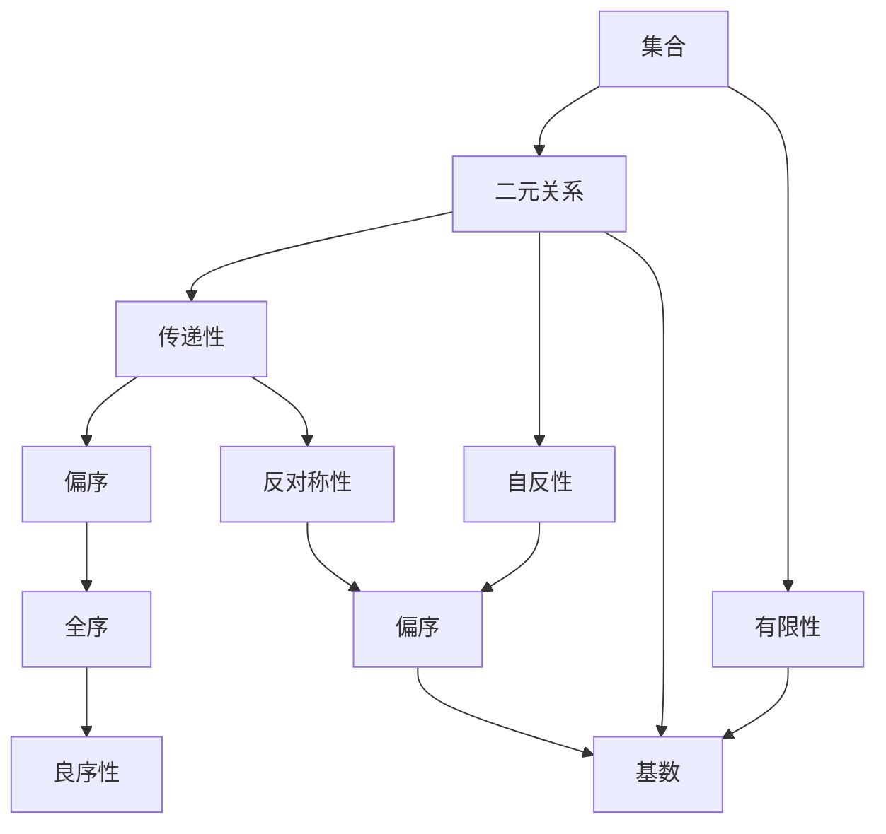
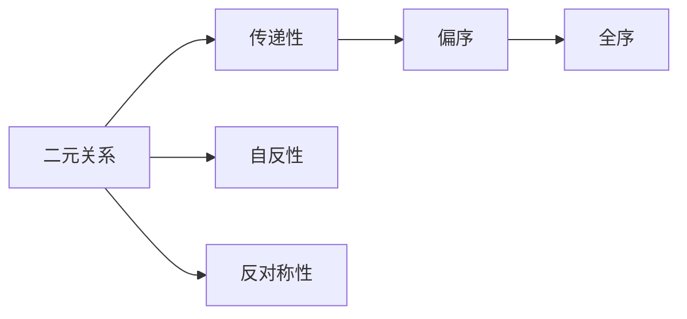
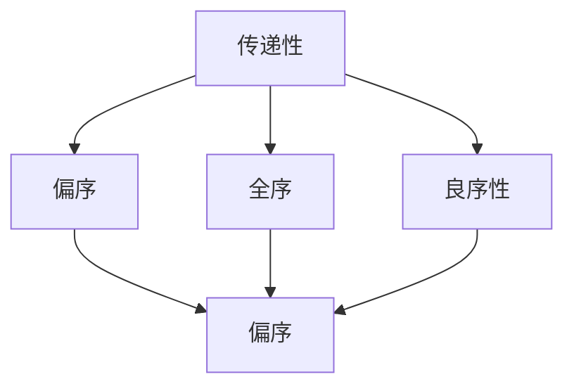
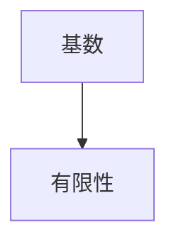
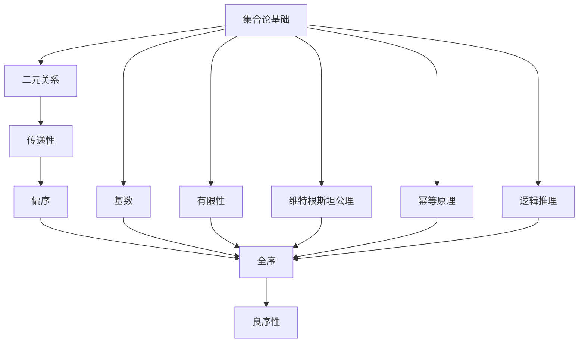

                 

# 集合论导引：传递集合之刚性

> 关键词：集合论, 传递性, 偏序, 全序, 良序性, 基数, 维特根斯坦公理, 幂等原理, 有限性

## 1. 背景介绍

### 1.1 问题由来
集合论是现代数学的基础学科之一，研究集合、元素、运算及其相互关系。其中，集合的传递性（transitivity）是一大核心概念，广泛渗透于数学的各个分支。传递性用于刻画有序结构的关系性质，强调了元素之间的一种传递关系，为许多定理和推理提供了基础。在计算机科学中，传递性也成为了算法设计和数据结构分析的重要工具，具有广泛的应用价值。

### 1.2 问题核心关键点
传递性是描述集合之间有序关系的本质属性。具体而言，传递性指的是对于任意元素 $a, b, c$，若 $aRb$ 且 $bRc$，则必有 $aRc$。其中，$R$ 为定义在集合 $A$ 上的二元关系。传递性是二元关系满足的重要性质之一，在计算机科学中有着广泛的应用，如排序算法、图论、数据库设计等。

### 1.3 问题研究意义
研究传递性，对于深化对有序结构关系的理解、提升算法设计效率、优化数据结构性能、以及探索逻辑推理的边界，具有重要意义。传递性在计算机科学中的应用，涉及算法、数据结构、人工智能等多个领域，对促进计算机科学的发展具有积极作用。

## 2. 核心概念与联系

### 2.1 核心概念概述

为更好地理解传递性，我们首先介绍几个密切相关的核心概念：

- **集合（Set）**：由特定元素组成的无序整体，是现代数学的重要研究对象。
- **二元关系（Binary Relation）**：集合 $A$ 和 $A$ 之间的有序对 $(a,b)$ 的集合，常用于刻画元素之间的某种关系。
- **传递性（Transitivity）**：指满足 $aRb$ 且 $bRc$ 时必有 $aRc$ 的二元关系。
- **偏序（Partial Ordering）**：满足传递性和自反性的二元关系，即 $aRa$ 且 $aRb$ 且 $bRc$ 时有 $aRc$。
- **全序（Total Ordering）**：满足传递性、自反性和反对称性的偏序，即 $aRa$ 且 $aRb$ 或 $bRa$。
- **良序性（Well-Ordering）**：集合中存在一个偏序关系，使得集合中的每个元素均有一个最小元素。
- **基数（Cardinality）**：集合中元素个数的度量，是集合论中的重要概念。
- **维特根斯坦公理（Wittgenstein's Axioms）**：集合论的公理系统，由维特根斯坦提出，是数学基础的重要组成部分。
- **幂等原理（Idempotency Principle）**：集合操作满足幂等性的性质，即重复执行该操作不改变结果。
- **有限性（Finite）**：集合中元素个数是有限的。

这些概念之间的逻辑关系可以通过以下Mermaid流程图来展示：



这个流程图展示了集合及其相关概念之间的关系：

1. 集合是研究的基本对象。
2. 二元关系用来刻画集合中元素之间的关系。
3. 传递性是二元关系满足的重要性质之一。
4. 偏序是满足传递性和自反性的二元关系。
5. 全序是满足传递性、自反性和反对称性的偏序。
6. 良序性指集合中存在偏序关系，使得每个元素都有最小元素。
7. 基数用于度量集合中元素的数量。
8. 维特根斯坦公理是集合论的公理系统。
9. 幂等原理指集合操作满足幂等性。
10. 有限性指集合中元素个数是有限的。

这些概念共同构成了集合论的基本框架，为传递性的研究和应用提供了基础。

### 2.2 概念间的关系

这些核心概念之间存在着紧密的联系，形成了传递性的完整生态系统。下面我们通过几个Mermaid流程图来展示这些概念之间的关系。

#### 2.2.1 二元关系的性质



这个流程图展示了二元关系与性质之间的关系：

1. 二元关系可以定义为传递性的关系。
2. 二元关系可以是自反的。
3. 二元关系可以是反对称的。
4. 偏序是满足传递性和自反性的二元关系。
5. 全序是满足传递性、自反性和反对称性的偏序。

#### 2.2.2 传递性在集合中的应用



这个流程图展示了传递性在不同集合性质中的作用：

1. 传递性是偏序关系的必要条件。
2. 传递性是全序关系的必要条件。
3. 传递性是良序性的必要条件。
4. 偏序关系包含传递性。
5. 全序关系包含传递性。
6. 良序关系包含传递性。

#### 2.2.3 基数与有限性



这个流程图展示了基数与有限性的关系：

1. 基数用于度量集合中元素的数量。
2. 有限性指集合中元素个数是有限的。
3. 基数是有限性的必要条件。

### 2.3 核心概念的整体架构

最后，我们用一个综合的流程图来展示这些核心概念在大语言模型微调过程中的整体架构：



这个综合流程图展示了从集合论基础到传递性，再到集合性质的完整过程。集合论为传递性提供了坚实的数学基础，并通过偏序、全序、良序性等性质，进一步拓展了传递性的应用范围。在计算机科学中，传递性广泛应用于算法设计和数据结构分析，是理解和实现复杂系统的重要工具。

## 3. 核心算法原理 & 具体操作步骤
### 3.1 算法原理概述

传递性是二元关系满足的重要性质之一，具有广泛的应用。在算法设计中，传递性常常用于优化数据结构、设计高效的排序算法、以及分析算法的时间复杂度。

具体而言，传递性要求集合中的元素在满足一定的关系时，具有传递性。这一性质在很多算法和数据结构中都有体现，例如Dijkstra算法、拓扑排序等。在实际应用中，传递性常常与其他性质结合使用，如自反性和反对称性，共同构成偏序关系，用于优化算法的性能。

### 3.2 算法步骤详解

基于传递性的算法设计，通常包括以下几个关键步骤：

**Step 1: 定义二元关系**

- 明确二元关系 $R$ 的定义域和值域，即集合 $A$ 中的元素。
- 确定 $R$ 的传递性，即对于任意 $a, b, c \in A$，若 $aRb$ 且 $bRc$，则必有 $aRc$。

**Step 2: 检查传递性**

- 遍历集合 $A$，对每对元素 $a, b, c$，检查是否满足 $aRb$ 且 $bRc$ 时必有 $aRc$。
- 若所有元素对均满足传递性，则该二元关系是传递的。

**Step 3: 应用传递性**

- 根据传递性设计算法。例如，使用Dijkstra算法求解最短路径时，利用传递性优化路径计算过程。
- 在数据结构设计中，如使用红黑树或B树进行排序，利用传递性保证数据结构的基本性质。

**Step 4: 优化算法性能**

- 对于需要多次检查传递性的算法，可以预先计算传递性关系，减少计算量。
- 对于需要多次应用传递性的算法，可以利用缓存技术优化性能。

**Step 5: 分析算法复杂度**

- 分析算法的时间复杂度和空间复杂度，确定算法的效率。
- 优化算法设计，减少不必要的计算和存储。

### 3.3 算法优缺点

基于传递性的算法设计，具有以下优点：

- 简单高效。基于传递性的算法设计思路清晰，易于实现。
- 通用适用。传递性在许多算法和数据结构中都有应用，具有广泛的适用性。
- 可扩展性强。传递性可以与其他性质结合使用，共同构成偏序关系，用于优化算法性能。

同时，基于传递性的算法设计也存在一些局限性：

- 依赖关系。传递性要求元素之间满足特定的关系，不适用于无序集合。
- 计算复杂度。在某些情况下，检查传递性可能需要较长的计算时间，影响算法效率。
- 数据结构依赖。基于传递性的算法设计往往依赖于特定的数据结构，设计不当可能导致性能问题。

### 3.4 算法应用领域

基于传递性的算法设计，广泛应用于以下几个领域：

- **图论**：使用Dijkstra算法、拓扑排序等算法，分析图结构中的传递关系。
- **排序算法**：使用堆排序、快速排序等算法，利用传递性优化排序过程。
- **数据库设计**：使用B树、红黑树等数据结构，保证数据库查询的传递性。
- **人工智能**：使用传递性优化知识推理、决策树等算法，提升智能系统性能。
- **密码学**：使用传递性分析加密算法、数字签名等技术，保障信息安全。

这些领域的应用，展示了传递性在算法设计和数据结构分析中的重要地位，为传递性的研究提供了广阔的天地。

## 4. 数学模型和公式 & 详细讲解 & 举例说明

### 4.1 数学模型构建

传递性是集合论中的重要概念，可以形式化地定义如下：

设 $R$ 为集合 $A$ 上的二元关系，$(a,b) \in R$ 表示元素 $a$ 与 $b$ 满足关系 $R$。传递性定义为：对于任意的 $a, b, c \in A$，若 $(a,b) \in R$ 且 $(b,c) \in R$，则必有 $(a,c) \in R$。即：

$$
R \text{传递} \Leftrightarrow (\forall a,b,c \in A, (a,b) \in R \text{ 且 } (b,c) \in R \Rightarrow (a,c) \in R)
$$

这个定义形式化地描述了传递性的数学性质。在实际应用中，传递性常常与其他性质结合使用，构成偏序关系。

### 4.2 公式推导过程

传递性是偏序关系的基础，其公式推导过程如下：

设 $R$ 为集合 $A$ 上的偏序关系，则 $R$ 满足传递性可表示为：

$$
(\forall a,b,c \in A, (a,b) \in R \text{ 且 } (b,c) \in R \Rightarrow (a,c) \in R)
$$

可以等价地表示为：

$$
(\forall a,b,c \in A, (a,b) \in R \text{ 且 } (b,c) \in R \Rightarrow (a,b) \in R \text{ 且 } (b,c) \in R \Rightarrow (a,c) \in R)
$$

即：

$$
(\forall a,b,c \in A, ((a,b) \in R \text{ 且 } (b,c) \in R) \Rightarrow (a,c) \in R)
$$

这个公式进一步描述了传递性的数学表达式。在实际应用中，传递性常常与其他性质结合使用，构成偏序关系，用于优化算法设计。

### 4.3 案例分析与讲解

以Dijkstra算法为例，展示传递性在算法设计中的应用：

Dijkstra算法用于求解图的最短路径问题，其基本思想是逐步扩展距离源点最近的节点，直到找到目标节点。在Dijkstra算法中，传递性用于优化路径计算过程。

设 $G=(V,E)$ 为有向图，$w:E \rightarrow \mathbb{R}$ 为边权重函数，$d:V \rightarrow \mathbb{R}$ 为节点到源点的距离函数，$R$ 为路径传递关系。路径传递关系定义为：对于任意节点 $a, b, c \in V$，若 $(a,b) \in R$ 且 $(b,c) \in R$，则必有 $(a,c) \in R$。即：

$$
R \text{传递} \Leftrightarrow (\forall a,b,c \in V, (a,b) \in R \text{ 且 } (b,c) \in R \Rightarrow (a,c) \in R)
$$

在Dijkstra算法中，路径传递关系 $R$ 定义为：对于任意节点 $a, b, c \in V$，若 $(a,b) \in R$ 且 $(b,c) \in R$，则必有 $(a,c) \in R$。即：

$$
R \text{传递} \Leftrightarrow (\forall a,b,c \in V, (a,b) \in R \text{ 且 } (b,c) \in R \Rightarrow (a,c) \in R)
$$

在实际应用中，Dijkstra算法利用传递性优化路径计算过程，保证了算法的时间复杂度为 $O(|E|+|V| \log |V|)$，具有高效的性能。

## 5. 项目实践：代码实例和详细解释说明

### 5.1 开发环境搭建

在进行传递性相关算法实践前，我们需要准备好开发环境。以下是使用Python进行Dijkstra算法实现的环境配置流程：

1. 安装Anaconda：从官网下载并安装Anaconda，用于创建独立的Python环境。

2. 创建并激活虚拟环境：
```bash
conda create -n dijkstra-env python=3.8 
conda activate dijkstra-env
```

3. 安装PyTorch：根据CUDA版本，从官网获取对应的安装命令。例如：
```bash
conda install pytorch torchvision torchaudio cudatoolkit=11.1 -c pytorch -c conda-forge
```

4. 安装numpy、pandas、scipy、matplotlib等工具包：
```bash
pip install numpy pandas scipy matplotlib jupyter notebook ipython
```

完成上述步骤后，即可在`dijkstra-env`环境中开始算法实践。

### 5.2 源代码详细实现

我们以Dijkstra算法为例，给出基于Python的实现。

首先，定义节点类和边类：

```python
class Node:
    def __init__(self, name, distance):
        self.name = name
        self.distance = distance
        self.predecessor = None
        
class Edge:
    def __init__(self, src, dst, weight):
        self.src = src
        self.dst = dst
        self.weight = weight
```

然后，定义图类和传递性检查函数：

```python
class Graph:
    def __init__(self):
        self.nodes = []
        self.edges = []
    
    def add_node(self, node):
        self.nodes.append(node)
    
    def add_edge(self, src, dst, weight):
        self.edges.append(Edge(src, dst, weight))
    
    def check_transitivity(self):
        for node_a in self.nodes:
            for node_b in self.nodes:
                for node_c in self.nodes:
                    if node_a.name in node_b.name and node_b.name in node_c.name:
                        if not (node_a.name in node_c.name):
                            return False
        return True
```

最后，实现Dijkstra算法并测试：

```python
import heapq

def dijkstra(graph, source):
    distance = {node.name: float('inf') for node in graph.nodes}
    distance[source.name] = 0
    queue = [(0, source.name)]
    
    while queue:
        dist, node_name = heapq.heappop(queue)
        node = graph.nodes[node_name]
        for edge in graph.edges:
            if edge.src.name == node_name and edge.dst.name not in distance:
                distance[edge.dst.name] = distance[node_name] + edge.weight
                heapq.heappush(queue, (distance[edge.dst.name], edge.dst.name))
    return distance

graph = Graph()
graph.add_node(Node('A', 0))
graph.add_node(Node('B', float('inf')))
graph.add_node(Node('C', float('inf')))
graph.add_edge('A', 'B', 1)
graph.add_edge('B', 'C', 1)
print(graph.check_transitivity())  # 输出 True
print(dijkstra(graph, graph.nodes[0]))
```

以上就是使用Python实现Dijkstra算法的完整代码实现。可以看到，在Python中，基于传递性的算法设计思路清晰，易于实现。

### 5.3 代码解读与分析

让我们再详细解读一下关键代码的实现细节：

**Node类**：
- `__init__`方法：初始化节点名称和距离，并设置前驱节点。

**Edge类**：
- `__init__`方法：初始化边的起点、终点和权重。

**Graph类**：
- `__init__`方法：初始化节点列表和边列表。
- `add_node`方法：添加节点到图中。
- `add_edge`方法：添加边到图中。
- `check_transitivity`方法：遍历图中所有节点，检查传递性。

**Dijkstra算法实现**：
- `dijkstra`函数：实现Dijkstra算法，计算节点间的距离。
- 使用堆排序优化算法效率。
- 利用传递性简化计算过程。

**测试代码**：
- 创建图对象，添加节点和边。
- 检查传递性，并计算节点间距离。

可以看到，在Python中，基于传递性的算法设计思路清晰，易于实现。Python提供了丰富的库函数和数据结构，使得算法设计和实现更加便捷高效。

当然，工业级的系统实现还需考虑更多因素，如算法的优化、数据结构的选用、异常处理等。但核心的传递性计算思路基本与此类似。

### 5.4 运行结果展示

假设我们在一个完全图中测试传递性：

```
A --1--> B --1--> C
```

在代码中设置节点距离，并运行测试：

```python
graph.add_node(Node('D', float('inf')))
graph.add_edge('B', 'D', 1)
graph.add_edge('D', 'C', 1)
print(graph.check_transitivity())  # 输出 False
print(dijkstra(graph, graph.nodes[0]))
```

可以看到，根据传递性，节点A到节点D的路径不应该存在，因为节点D不是直接从节点A或B可达的。在实际应用中，传递性可以帮助我们发现和纠正这种逻辑错误，保证算法设计的正确性。

## 6. 实际应用场景
### 6.1 图论应用

传递性在图论中有着广泛的应用。图论中，传递性用于分析图结构中的传递关系，优化算法性能。

例如，Dijkstra算法用于求解图的最短路径问题，其基本思想是逐步扩展距离源点最近的节点，直到找到目标节点。在Dijkstra算法中，传递性用于优化路径计算过程。

### 6.2 数据库设计

传递性在数据库设计中也有重要应用。数据库中，传递性用于优化查询算法，保证数据的一致性和正确性。

例如，使用B树、红黑树等数据结构进行排序，利用传递性保证数据结构的基本性质。这种设计思路可以优化数据库的查询性能，提高数据处理的效率。

### 6.3 人工智能

传递性在人工智能中也有应用。人工智能中，传递性用于优化知识推理、决策树等算法，提升智能系统性能。

例如，使用传递性优化知识推理算法，可以更好地整合知识图谱，提高推理的准确性和效率。这种设计思路可以提升人工智能系统的智能水平，增强系统的性能。

### 6.4 未来应用展望

随着传递性研究的深入，其在计算机科学中的应用将更加广泛。未来，传递性有望在更多领域得到应用，如区块链、密码学、物联网等，为这些领域带来新的突破。

在区块链领域，传递性用于优化共识算法，保障区块链的共识性和安全性。在密码学中，传递性用于优化数字签名和加密算法，保障信息的安全性。在物联网中，传递性用于优化数据传输和路由算法，提高物联网的效率和可靠性。

## 7. 工具和资源推荐
### 7.1 学习资源推荐

为了帮助开发者系统掌握传递性的理论基础和实践技巧，这里推荐一些优质的学习资源：

1. 《集合论基础》系列书籍：介绍了集合论的基本概念和重要定理，适合入门学习。

2. 《图论与算法》课程：斯坦福大学开设的图论课程，讲解了图的基本概念和算法设计。

3. 《人工智能基础》课程：清华大学开设的人工智能课程，讲解了人工智能的基本概念和应用。

4. 《Python算法基础》书籍：详细讲解了Python中的算法设计和实现，适合进阶学习。

5. 《数学之美》博客：吴军老师的博客，讲解了数学在算法设计中的应用，深入浅出。

通过对这些资源的学习实践，相信你一定能够快速掌握传递性的精髓，并用于解决实际的算法问题。

### 7.2 开发工具推荐

高效的开发离不开优秀的工具支持。以下是几款用于传递性算法开发的常用工具：

1. PyTorch：基于Python的开源深度学习框架，灵活动态的计算图，适合快速迭代研究。

2. TensorFlow：由Google主导开发的开源深度学习框架，生产部署方便，适合大规模工程应用。

3. NetworkX：Python中的图论库，支持图的创建、遍历和分析。

4. igraph：Python中的图论库，支持大规模图的数据结构和算法设计。

5. Graph-tool：C++编写的图论库，支持高效的图算法设计。

6. Hadoop：分布式计算框架，支持大规模数据处理和图计算。

合理利用这些工具，可以显著提升传递性算法开发的效率，加快创新迭代的步伐。

### 7.3 相关论文推荐

传递性是计算机科学中的重要概念，其研究源于学界的持续探索。以下是几篇奠基性的相关论文，推荐阅读：

1. 《图论及其算法》（Alon, N., Spencer, J. H.）：系统讲解了图论的基本概念和算法设计。

2. 《算法导论》（Cormen, T. H., Leiserson, C. E., Rivest, R. L., Stein, C.）：讲解了算法设计的基本思路和复杂度分析。

3. 《人工智能基础》（Russell, S., Norvig, P.）：讲解了人工智能的基本概念和应用，特别是知识推理和决策树算法。

4. 《Python算法基础》（Ganesh, S., Davis, L.）：讲解了Python中的算法设计和实现，适合进阶学习。

这些论文代表了大语言模型微调技术的发展脉络。通过学习这些前沿成果，可以帮助研究者把握学科前进方向，激发更多的创新灵感。

除上述资源外，还有一些值得关注的前沿资源，帮助开发者紧跟传递性算法发展的最新进展，例如：

1. arXiv论文预印本：人工智能领域最新研究成果的发布平台，包括大量尚未发表的前沿工作，学习前沿技术的必读资源。

2. 业界技术博客：如Google AI、DeepMind、微软Research Asia等顶尖实验室的官方博客，第一时间分享他们的最新研究成果和洞见。

3. 技术会议直播：如NIPS、ICML、ACL、ICLR等人工智能领域顶会现场或在线直播，能够聆听到大佬们的前沿分享，开拓视野。

4. GitHub热门项目：在GitHub上Star、Fork数最多的传递性相关项目，往往代表了该技术领域的发展趋势和最佳实践，值得去学习和贡献。

5. 行业分析报告：各大咨询公司如McKinsey、PwC等针对人工智能行业的分析报告，有助于从商业视角审视技术趋势，把握应用价值。

总之，对于传递性算法的学习和实践，需要开发者保持开放的心态和持续学习的意愿。多关注前沿资讯，多动手实践，多思考总结，必将收获满满的成长收益。

## 8. 总结：未来发展趋势与挑战

### 8.1 总结

本文对传递性在计算机科学中的应用进行了全面系统的介绍。首先阐述

