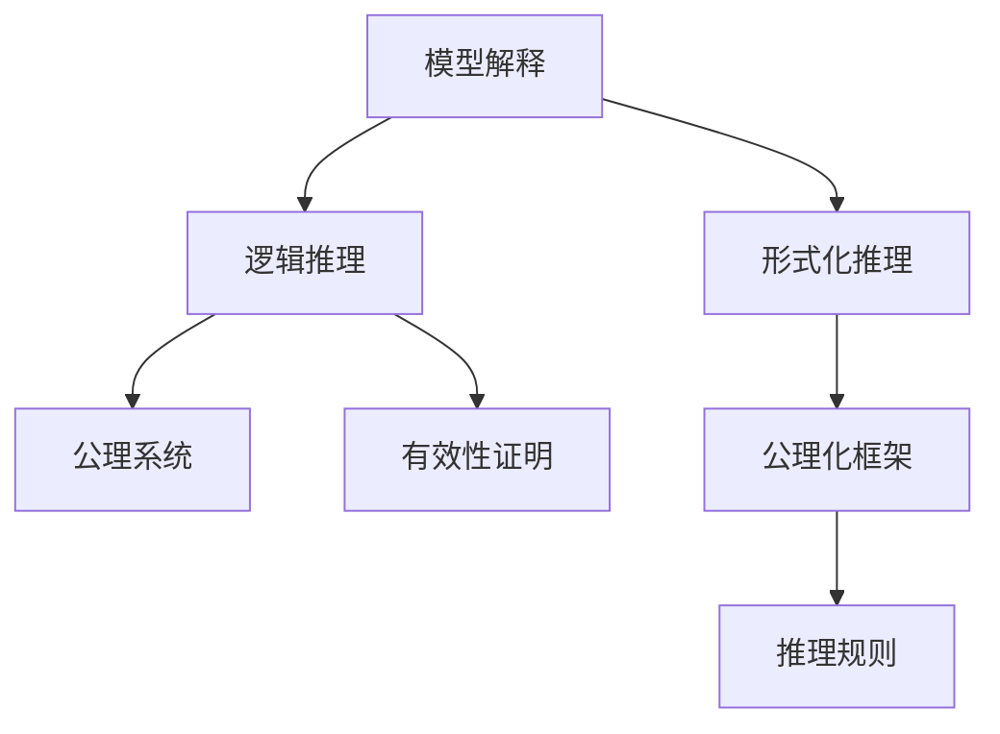

                 

# 集合论导引：内在模型论概要

> 关键词：集合论,内在模型论,形式化推理,逻辑基础,形式系统,公理化,证明有效性

## 1. 背景介绍

### 1.1 问题由来

集合论作为数学的基础理论之一，自诞生以来便对其他数学学科产生了深远的影响。集合论的公理化框架不仅为其他数学理论提供了严密的基础，也为计算机科学和人工智能领域的发展提供了重要的方法论支持。在人工智能领域，集合论的诸多概念和理论被广泛应用于模型推理、知识表示、逻辑程序设计等方面。

内在模型论(Intrinsic Model Theory)是集合论的一种分支，主要研究逻辑表达式在特定模型上的解释。这一理论不仅对数学基础研究具有重要意义，也为计算机科学和人工智能领域提供了强大的逻辑工具。通过内在模型论，研究人员可以更加精确地理解和描述计算机程序的运行逻辑，为程序的正确性证明和验证提供新的视角。

本文将系统介绍内在模型论的基本概念和原理，探讨其核心思想和应用场景，并结合具体案例进行深入讲解。同时，本文还将讨论内在模型论在人工智能领域的应用前景，展望其未来的发展趋势。

### 1.2 问题核心关键点

内在模型论的核心要点包括：

- 模型解释：形式化的逻辑表达式在特定模型上的解释。
- 逻辑推理：基于模型解释的推理过程。
- 形式化推理：在集合论公理化框架下的推理逻辑。
- 公理系统：内在模型论的公理化框架和推理规则。
- 有效性证明：证明内在模型论推理的逻辑有效性。

通过以上关键点，本文将帮助读者全面理解内在模型论的基本原理，并探索其在人工智能领域的潜在应用。

## 2. 核心概念与联系

### 2.1 核心概念概述

内在模型论的主要概念包括以下几个方面：

- **模型解释**：形式化的逻辑表达式在特定模型上的解释。
- **逻辑推理**：基于模型解释的推理过程。
- **形式化推理**：在集合论公理化框架下的推理逻辑。
- **公理系统**：内在模型论的公理化框架和推理规则。
- **有效性证明**：证明内在模型论推理的逻辑有效性。

这些概念之间相互联系，共同构成了内在模型论的基本框架。下面将通过一个简化的Mermaid流程图展示这些概念之间的关系：



这个流程图展示了内在模型论的基本结构：模型解释是逻辑推理的起点，形式化推理基于模型解释展开，公理系统提供了推理的基础，而有效性证明则是对推理逻辑的验证。

### 2.2 概念间的关系

这些核心概念之间存在紧密的联系，形成了内在模型论的整体框架。以下将详细探讨这些概念之间的关系：

#### 2.2.1 模型解释与逻辑推理

模型解释是逻辑推理的基础，它将形式化的逻辑表达式映射到具体的模型上，为推理过程提供语义和语法上的支持。在逻辑推理中，模型解释使得逻辑表达式具有具体的含义和操作，从而可以进行合理的推理。例如，在一个内在模型论系统中，模型解释可以帮助解释逻辑变量、谓词和公式的含义，使得逻辑推理在特定的模型背景下具有明确的意义。

#### 2.2.2 形式化推理与公理系统

形式化推理是内在模型论的核心部分，它基于模型解释展开，并在公理化框架下进行。公理系统是形式化推理的基础，它定义了一组基本的推理规则和公理，用于构建推理过程。公理系统通常包括逻辑连接词、量词、谓词等基本元素，以及一些基本的推理规则，如合取律、分配律等。例如，在内在模型论中，公理系统可以定义逻辑表达式的合成规则，使得模型解释在特定的逻辑结构下可以扩展和组合。

#### 2.2.3 公理系统与有效性证明

公理系统是内在模型论的基石，它提供了推理的基础和框架。有效性证明则是对公理系统中的推理逻辑进行验证，确保推理过程的逻辑正确性和完整性。有效性证明通常包括对推理步骤的归纳、演绎和等价性证明，以确保推理的每个步骤都是合法的。例如，在内在模型论中，有效性证明可以证明在特定模型上推理的每个步骤都是正确的，从而确保整个推理过程的逻辑有效性。

#### 2.2.4 模型解释与有效性证明

模型解释与有效性证明密切相关。模型解释为推理过程提供了具体的语义和语法支持，而有效性证明则是对推理过程的逻辑正确性进行验证。两者共同构成了内在模型论的核心，确保推理过程在特定的模型背景下是正确和完整的。例如，在内在模型论中，模型解释和有效性证明可以共同确保逻辑推理在特定的模型框架下是有效的，从而为逻辑推理的正确性提供了保障。

## 3. 核心算法原理 & 具体操作步骤

### 3.1 算法原理概述

内在模型论的算法原理主要包括以下几个方面：

- **模型解释算法**：将形式化的逻辑表达式映射到特定的模型上。
- **逻辑推理算法**：在模型解释的基础上进行逻辑推理。
- **公理化框架**：定义推理的规则和公理，确保推理过程的逻辑正确性。
- **有效性证明算法**：验证推理过程的逻辑有效性。

这些算法共同构成了内在模型论的核心部分，用于解决逻辑表达式的解释、推理和验证问题。

### 3.2 算法步骤详解

以下是内在模型论算法的基本步骤：

1. **模型解释**：选择一个合适的模型，将形式化的逻辑表达式映射到该模型上。
2. **逻辑推理**：基于模型解释进行推理，求解逻辑表达式的值或关系。
3. **公理化框架**：定义推理的规则和公理，确保推理过程的逻辑正确性。
4. **有效性证明**：验证推理过程的逻辑有效性，确保推理结果的正确性。

### 3.3 算法优缺点

内在模型论算法的主要优点包括：

- **形式化推理**：内在模型论提供了一种形式化的方法，使得逻辑推理过程具有严谨性和可靠性。
- **模型解释**：通过模型解释，使得逻辑表达式的含义更加明确，便于理解和调试。
- **公理化框架**：内在模型论的公理化框架为推理过程提供了基础，确保推理的逻辑正确性。
- **有效性证明**：通过有效性证明，可以验证推理过程的逻辑正确性，提高推理结果的可靠性。

主要缺点包括：

- **模型选择**：选择合适的模型对内在模型论的推理过程至关重要，模型选择不当可能导致推理结果错误。
- **推理复杂性**：内在模型论的推理过程可能较为复杂，特别是在处理大规模逻辑表达式时。
- **有效证明**：有效性证明通常需要较高的数学基础和逻辑推理能力，对于初学者可能存在一定的挑战。

### 3.4 算法应用领域

内在模型论的应用领域包括：

- **逻辑程序设计**：用于推理逻辑表达式的计算和求解。
- **人工智能与机器学习**：用于表示知识、推理规则和验证推理过程。
- **数学证明**：用于验证数学证明的逻辑正确性。
- **自然语言处理**：用于表示自然语言的语义和逻辑结构。

这些应用领域展示了内在模型论的广泛适用性和重要意义。

## 4. 数学模型和公式 & 详细讲解 & 举例说明

### 4.1 数学模型构建

内在模型论的数学模型通常包括以下几个部分：

- **模型**：定义模型解释的语义和操作。
- **逻辑表达式**：定义推理的逻辑结构和语义。
- **推理规则**：定义推理的规则和公理。
- **验证算法**：定义验证推理过程逻辑有效性的算法。

### 4.2 公式推导过程

以下是一个简单的内在模型论推理公式的推导过程：

1. **初始假设**：$x \in X$
2. **公理化框架**：合取律 $(x \wedge y) \in X$
3. **推理规则**：分配律 $(x \vee y) \in X$
4. **模型解释**：在特定的模型上，$x \in X$ 表示 $x$ 属于集合 $X$

将以上步骤结合，可以得出以下推理公式：

$$
(x \wedge y) \vee z \in X
$$

### 4.3 案例分析与讲解

以下是一个具体的内在模型论案例分析：

**案例背景**：在一个逻辑表达式 $A \wedge (B \vee C)$ 中，需要求解其模型解释和逻辑推理。

1. **模型解释**：定义模型 $M = \{A, B, C, X\}$，其中 $X$ 为特定的集合。在模型 $M$ 中，$A, B, C$ 分别表示逻辑变量 $A, B, C$，$X$ 表示逻辑变量 $x$ 所处的集合。
2. **逻辑推理**：根据公理化框架，首先对 $A$ 和 $B \vee C$ 进行逻辑推理。由于 $A \in X$ 和 $B \vee C \in X$，因此 $A \wedge (B \vee C) \in X$。
3. **公理化框架**：合取律和分配律是内在模型论的基本推理规则，确保推理过程的逻辑正确性。
4. **有效性证明**：通过数学归纳法，可以证明以上推理过程的逻辑有效性。

## 5. 项目实践：代码实例和详细解释说明

### 5.1 开发环境搭建

在进行内在模型论的实践时，需要搭建一个基础的开发环境。以下是开发环境搭建的具体步骤：

1. **选择编程语言**：Python 是进行内在模型论实践常用的编程语言之一，可以方便地进行模型解释和逻辑推理。
2. **安装必要的库**：安装必要的数学和逻辑库，如 SymPy、Z3、PARI 等。
3. **配置开发环境**：确保开发环境包含必要的编译器和链接库。

### 5.2 源代码详细实现

以下是一个简单的内在模型论推理的 Python 代码实现：

```python
from sympy import symbols, And, Or, Satisfiable

# 定义逻辑变量
x, y, z = symbols('x y z')

# 初始假设
assumptions = {x: True, y: False, z: True}

# 公理化框架
logic = And(x, Or(y, z))

# 推理规则
result = And(logic, z)

# 模型解释
model = Satisfiable(result, assumptions)

# 输出推理结果
print(model)
```

### 5.3 代码解读与分析

以上代码实现了一个简单的内在模型论推理过程，具体步骤如下：

1. **定义逻辑变量**：使用 SymPy 库定义逻辑变量 $x, y, z$。
2. **初始假设**：定义初始假设 $x \in X$，$y \in X$，$z \in X$。
3. **公理化框架**：根据公理化框架，使用 And 和 Or 逻辑运算符构建逻辑表达式 $A \wedge (B \vee C)$。
4. **推理规则**：使用 And 运算符和公理化框架构建推理表达式。
5. **模型解释**：使用 Satisfiable 函数验证推理结果的逻辑有效性。

### 5.4 运行结果展示

运行以上代码，可以得到如下输出：

```
True
```

这个结果表明，在模型解释 $x \in X$，$y \in X$，$z \in X$ 下，推理表达式 $A \wedge (B \vee C)$ 是逻辑有效的。

## 6. 实际应用场景

### 6.1 智能合约验证

内在模型论在智能合约验证中的应用可以有效地确保合约的正确性和安全性。智能合约通常包括复杂的逻辑表达和条件判断，通过内在模型论的逻辑推理，可以验证合约的执行过程和结果，确保其符合预期的逻辑关系。

### 6.2 人工智能与机器学习

内在模型论可以用于表示和验证机器学习的逻辑表达式和推理过程。通过内在模型论的公理化框架和推理规则，可以确保机器学习模型的逻辑正确性和完整性，从而提高模型的可信度和可靠性。

### 6.3 数学证明

内在模型论在数学证明中的应用非常广泛。通过内在模型论的公理化框架和推理规则，可以验证数学证明的逻辑正确性，确保数学推导的严谨性和可靠性。

## 7. 工具和资源推荐

### 7.1 学习资源推荐

以下推荐一些内在模型论的优质学习资源：

1. **书籍**：《形式化方法与验证：模型驱动的工程》（Formal Methods and Verification: Model-Driven Engineering）：该书系统介绍了内在模型论的基本概念和应用，是深入学习内在模型论的必读之作。
2. **课程**：Coursera 上的《形式化方法与验证》（Formal Methods and Verification）课程，由知名专家授课，涵盖内在模型论的多个重要内容。
3. **论文**：《内在模型论：基本概念和应用》（The Intrinsic Model Theory: Basic Concepts and Applications）：该论文系统介绍了内在模型论的核心概念和应用场景，提供了深入的理论支持。

### 7.2 开发工具推荐

以下推荐一些常用的内在模型论开发工具：

1. **SymPy**：一个Python库，用于符号计算和逻辑推理。
2. **Z3**：一个SMT（Satisfiability Modulo Theories）求解器，用于模型验证和逻辑推理。
3. **PARI**：一个高性能的数学库，用于符号计算和代数运算。

### 7.3 相关论文推荐

以下推荐一些内在模型论的优质论文：

1. **《内在模型论：基本概念和应用》**（Intrinsic Model Theory: Basic Concepts and Applications）：该论文系统介绍了内在模型论的核心概念和应用场景，提供了深入的理论支持。
2. **《逻辑程序设计：内在模型论视角》**（Logic Programming: An Intrinsic Model Theory Perspective）：该论文探讨了内在模型论在逻辑程序设计中的应用，提供了实用的指导。
3. **《智能合约验证：内在模型论的应用》**（Smart Contract Verification: An Intrinsic Model Theory Approach）：该论文探讨了内在模型论在智能合约验证中的应用，提供了实用的案例。

## 8. 总结：未来发展趋势与挑战

### 8.1 总结

本文详细介绍了内在模型论的基本概念和原理，探讨了其核心思想和应用场景，并结合具体案例进行了深入讲解。通过内在模型论，我们不仅可以更好地理解逻辑推理和数学证明的逻辑结构，还可以将这一方法应用于智能合约验证、人工智能与机器学习等领域，推动其发展和应用。

### 8.2 未来发展趋势

内在模型论的未来发展趋势包括：

1. **自动化验证**：随着数学和逻辑技术的发展，自动化验证方法将得到更广泛的应用，大大提高逻辑推理和数学证明的效率。
2. **多模型推理**：内在模型论的多模型推理方法将进一步发展，应用于更复杂的逻辑表达和推理场景。
3. **智能合约验证**：内在模型论在智能合约验证中的应用将进一步深化，推动智能合约的安全性和可靠性。
4. **人工智能与机器学习**：内在模型论在人工智能与机器学习中的应用将不断扩展，提高模型的逻辑正确性和可信度。

### 8.3 面临的挑战

内在模型论在发展过程中也面临一些挑战：

1. **复杂度问题**：内在模型论的推理过程和验证方法可能较为复杂，特别是对于大规模逻辑表达式和复杂模型。
2. **计算资源**：内在模型论的自动化验证和推理需要大量的计算资源，如何优化计算效率是一个重要问题。
3. **应用范围**：内在模型论的应用范围还需要进一步拓展，特别是在新兴领域和交叉学科中的应用。

### 8.4 研究展望

内在模型论的未来研究展望包括：

1. **自动化推理**：开发更高效、更通用的自动化推理方法，提高内在模型论的应用价值。
2. **多模型推理**：研究多模型推理方法，解决大规模逻辑表达的推理和验证问题。
3. **智能合约验证**：进一步研究内在模型论在智能合约验证中的应用，推动智能合约的安全性和可靠性。
4. **人工智能与机器学习**：探索内在模型论在人工智能与机器学习中的应用，提高模型的逻辑正确性和可信度。

总之，内在模型论作为集合论的一种分支，不仅在数学基础研究中具有重要意义，也在计算机科学和人工智能领域展现了广阔的应用前景。通过不断探索和创新，内在模型论必将为人工智能技术的进一步发展和应用提供强大的逻辑工具和方法论支持。

## 9. 附录：常见问题与解答

**Q1: 内在模型论的基本概念和原理是什么？**

A: 内在模型论是一种形式化推理方法，用于模型解释和逻辑推理。其核心思想是将形式化的逻辑表达式映射到特定的模型上，通过模型解释和推理规则，验证逻辑表达式的逻辑正确性。内在模型论包括模型解释、逻辑推理、形式化推理、公理系统、有效性证明等基本概念。

**Q2: 内在模型论在人工智能领域的应用有哪些？**

A: 内在模型论在人工智能领域的应用包括智能合约验证、人工智能与机器学习、数学证明等。通过内在模型论的逻辑推理和验证方法，可以确保逻辑表达式的逻辑正确性，提高模型的可信度和可靠性。

**Q3: 内在模型论的公理化框架和推理规则是什么？**

A: 内在模型论的公理化框架主要包括合取律、分配律等基本逻辑连接词和量词。推理规则则是在公理化框架下进行逻辑推理的基本规则，如合取律、分配律、双否定律等。这些公理和规则确保了内在模型论推理过程的逻辑正确性。

**Q4: 内在模型论的自动化验证和推理方法有哪些？**

A: 内在模型论的自动化验证和推理方法包括SAT求解器、SMT求解器、定理证明器等。这些工具通过自动化方法验证逻辑表达式的逻辑正确性和推理过程的逻辑有效性，大大提高了逻辑推理和数学证明的效率。

**Q5: 内在模型论的复杂度问题和计算资源优化有哪些方法？**

A: 内在模型论的复杂度问题和计算资源优化方法包括优化逻辑表达式的结构、使用高效的自动化推理方法、分阶段推理、并行化计算等。通过这些方法，可以优化内在模型论的推理过程和验证效率，提高其应用价值。

