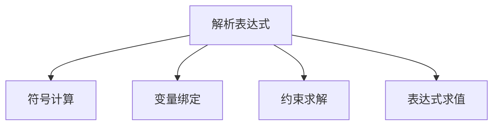
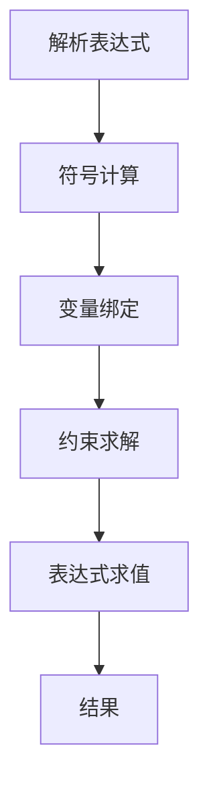
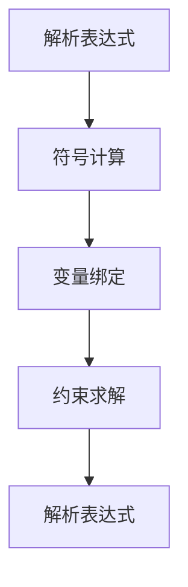

                 

# 集合论导引：内置解析表达式真假判定

## 1. 背景介绍

### 1.1 问题由来
解析表达式真假判定问题，即给定一个表达式，判断其是否在给定域内成立，是计算机代数和程序验证中的一个经典问题。解析表达式可以简单理解为一个由变量、常数、运算符组成的数学表达式，如$a + b \times 2$。在程序验证和计算机代数系统中，解析表达式真假判定通常涉及到符号计算、语义分析、变量绑定、约束求解等多个方面。解析表达式真假判定的应用广泛，包括计算机辅助设计、程序自动化测试、符号计算、定理验证等。

### 1.2 问题核心关键点
解析表达式真假判定问题的核心在于如何高效、准确地判断给定表达式的真假。具体来说，需要解决以下几个关键问题：
- 表达式符号计算：如何将表达式转化为符号计算表达式，进行符号计算。
- 变量绑定与域限制：如何绑定变量的值域，限制变量取值范围。
- 约束求解：如何求解变量之间的约束关系，并在此基础上进行真假判定。
- 复杂表达式处理：如何处理嵌套复杂、多目标的表达式，保证判定准确性。

### 1.3 问题研究意义
解析表达式真假判定问题，是计算机代数和程序验证中一个核心而基础的问题。其研究意义主要体现在以下几个方面：
- 提升计算机辅助设计和程序验证的准确性，减少人工干预。
- 支持复杂表达式计算和符号推导，推动符号计算理论的发展。
- 提供高效的表达式求解算法，提升算法的可扩展性和可复用性。
- 为计算机科学中的多个子领域提供基础性的工具和方法，促进这些领域的发展。

## 2. 核心概念与联系

### 2.1 核心概念概述

为了更好地理解解析表达式真假判定问题，本节将介绍几个密切相关的核心概念：

- 解析表达式(Parsing Expression)：由变量、常数、运算符等组成的数学表达式，如 $a + b \times 2$。
- 符号计算(Symbolic Computation)：使用符号变量进行代数运算的过程，如化简表达式、求解方程等。
- 变量绑定(Variable Binding)：将符号变量与具体数值进行绑定的过程，如令 $a=1, b=2$。
- 约束求解(Constraint Solving)：求解变量之间的约束关系，如求解 $a + b = 2$。
- 表达式求值(Expression Evaluation)：给定变量的值，计算表达式的值，如 $a + b$ 的值。

这些核心概念之间的逻辑关系可以通过以下Mermaid流程图来展示：



这个流程图展示了解析表达式的核心概念及其之间的关系：

1. 解析表达式通过符号计算得到代数形式，进行符号运算。
2. 变量绑定对解析表达式中的符号变量进行具体值绑定。
3. 约束求解用于解决表达式中变量之间的约束关系。
4. 表达式求值对变量进行绑定后，计算表达式的具体数值。

### 2.2 概念间的关系

这些核心概念之间存在着紧密的联系，形成了解析表达式真假判定的完整生态系统。下面我们通过几个Mermaid流程图来展示这些概念之间的关系。

#### 2.2.1 解析表达式的求解流程



这个流程图展示了解析表达式的求解流程：

1. 解析表达式通过符号计算转化为代数形式。
2. 在符号计算表达式中，通过变量绑定对符号变量进行具体值绑定。
3. 约束求解解决表达式中变量之间的约束关系。
4. 表达式求值对变量进行绑定后，计算表达式的具体数值，最终得到结果。

#### 2.2.2 符号计算与约束求解的关系


这个流程图展示了符号计算与约束求解的关系：

1. 符号计算对解析表达式进行代数转换，得到符号计算表达式。
2. 在符号计算表达式中，通过变量绑定对符号变量进行具体值绑定。
3. 约束求解解决表达式中变量之间的约束关系，得到新的符号计算表达式。
4. 最终进行符号计算，得到表达式的代数形式。

#### 2.2.3 变量绑定与约束求解的关系



这个流程图展示了变量绑定与约束求解的关系：

1. 解析表达式通过符号计算转化为代数形式。
2. 在符号计算表达式中，通过变量绑定对符号变量进行具体值绑定。
3. 约束求解解决表达式中变量之间的约束关系。
4. 通过变量绑定和约束求解，得到新的解析表达式。

### 2.3 核心概念的整体架构

最后，我们用一个综合的流程图来展示这些核心概念在大语言模型微调过程中的整体架构：


这个综合流程图展示了从解析表达式到结果的求解过程。解析表达式通过符号计算、变量绑定、约束求解和表达式求值等步骤，最终得到表达式的真假判定结果。通过这些流程图，我们可以更清晰地理解解析表达式真假判定的各个核心概念之间的联系，为后续深入讨论具体的真假判定方法奠定基础。

## 3. 核心算法原理 & 具体操作步骤

### 3.1 算法原理概述

解析表达式的真假判定问题，本质上是一个符号计算问题。通过符号计算和约束求解，可以将表达式中的变量绑定和约束条件转化为具体的数值，并在此基础上进行真假判定。解析表达式真假判定算法主要包括以下几个步骤：

1. 符号计算：将解析表达式转化为符号计算表达式，进行符号计算。
2. 变量绑定：将符号变量与具体数值进行绑定，解决变量的约束条件。
3. 约束求解：求解变量之间的约束关系，确保变量的取值合法。
4. 表达式求值：对绑定后的符号变量进行求值，判断表达式的真假。

### 3.2 算法步骤详解

解析表达式真假判定的具体步骤如下：

**Step 1: 符号计算**

1. 将解析表达式转化为符号计算表达式。
2. 进行符号计算，化简表达式。

**Step 2: 变量绑定**

1. 解析表达式中，对符号变量进行绑定，将变量替换为具体数值。
2. 约束条件中，对符号变量进行约束，限制变量的取值范围。

**Step 3: 约束求解**

1. 将绑定后的表达式中的变量进行约束求解，求解变量的取值范围。
2. 根据约束条件，求解变量的合法取值。

**Step 4: 表达式求值**

1. 将求解后的变量值代入表达式中，进行求值。
2. 判断求值结果是否为真。

### 3.3 算法优缺点

解析表达式真假判定算法具有以下优点：

1. 精度高：符号计算和约束求解的高精度特性，可以避免数值计算中的误差。
2. 通用性强：可以处理复杂的解析表达式，适用于多种数学计算和验证场景。
3. 可扩展性好：算法本身设计较为灵活，可以通过插件和扩展，实现不同的符号计算和约束求解方法。

同时，该算法也存在一些局限性：

1. 计算复杂度高：解析表达式和约束条件的符号计算，计算复杂度较高，需要大量时间。
2. 内存占用大：符号计算和约束求解需要大量内存，对系统资源消耗较大。
3. 精度依赖：解析表达式的精度依赖于符号计算的精度，精度越高，计算时间越长。

### 3.4 算法应用领域

解析表达式真假判定算法广泛应用于以下领域：

- 计算机代数系统：用于符号计算和解析表达式求解，如Maple、Mathematica等。
- 程序验证与测试：用于表达式的真值判断，辅助软件测试和验证。
- 计算机辅助设计：用于符号计算和解析表达式求解，辅助工程设计。
- 定理验证与证明：用于符号计算和解析表达式求解，辅助定理验证和证明。

## 4. 数学模型和公式 & 详细讲解 & 举例说明

### 4.1 数学模型构建

解析表达式的真假判定问题，可以通过数学模型进行描述。设解析表达式为 $P$，其符号计算表达式为 $S$，变量绑定为 $V$，约束条件为 $C$，表达式求值为 $E$，则解析表达式的真假判定过程可以表示为：

$$
\begin{align*}
P &= S(V) \\
E &= V(S(V))
\end{align*}
$$

其中，$V$ 表示变量绑定过程，$S(V)$ 表示符号计算后的代数表达式，$E$ 表示表达式求值后的结果。解析表达式的真假判定问题可以转化为求解表达式求值 $E$ 是否为真。

### 4.2 公式推导过程

以下我们以一个简单的解析表达式 $P = (a + b) \times 2$ 为例，推导解析表达式真假判定的过程。

**Step 1: 符号计算**

1. 将解析表达式 $P = (a + b) \times 2$ 转化为符号计算表达式 $S = a + b$。
2. 进行符号计算，得到 $S = a + b$。

**Step 2: 变量绑定**

1. 对符号变量 $a$ 和 $b$ 进行绑定，假设 $a=1$，$b=2$。
2. 约束条件为 $a, b \in [0, 10]$。

**Step 3: 约束求解**

1. 将绑定后的表达式 $S = a + b$ 进行约束求解，得到 $S \in [0, 12]$。
2. 根据约束条件 $a, b \in [0, 10]$，求解 $a + b$ 的合法取值范围。

**Step 4: 表达式求值**

1. 将求解后的变量值代入表达式 $S = a + b$ 中，求得 $S = 3$。
2. 判断求值结果 $S = 3$ 是否为真，显然为真。

### 4.3 案例分析与讲解

解析表达式真假判定的案例分析可以展示算法的实际应用效果。以一个复杂的多目标解析表达式为例：

$$
P = (a + b) \times (c + d) - e = 10
$$

解析表达式的真假判定步骤如下：

**Step 1: 符号计算**

1. 将解析表达式 $P = (a + b) \times (c + d) - e = 10$ 转化为符号计算表达式 $S = (a + b) \times (c + d) - e$。
2. 进行符号计算，得到 $S = (a + b) \times (c + d) - e$。

**Step 2: 变量绑定**

1. 对符号变量 $a, b, c, d, e$ 进行绑定，假设 $a=1, b=2, c=3, d=4, e=5$。
2. 约束条件为 $a, b, c, d, e \in [0, 10]$。

**Step 3: 约束求解**

1. 将绑定后的表达式 $S = (a + b) \times (c + d) - e$ 进行约束求解，得到 $S \in [0, 35]$。
2. 根据约束条件 $a, b, c, d, e \in [0, 10]$，求解 $(a + b) \times (c + d) - e$ 的合法取值范围。

**Step 4: 表达式求值**

1. 将求解后的变量值代入表达式 $S = (a + b) \times (c + d) - e$ 中，求得 $S = 35$。
2. 判断求值结果 $S = 35$ 是否为真，显然不为真。

通过案例分析，我们可以看到解析表达式真假判定算法在处理多目标、复杂表达式时的强大功能和灵活性。

## 5. 项目实践：代码实例和详细解释说明

### 5.1 开发环境搭建

在进行解析表达式真假判定实践前，我们需要准备好开发环境。以下是使用Python进行Sympy开发的环境配置流程：

1. 安装Anaconda：从官网下载并安装Anaconda，用于创建独立的Python环境。

2. 创建并激活虚拟环境：
```bash
conda create -n sympy-env python=3.8 
conda activate sympy-env
```

3. 安装Sympy：
```bash
pip install sympy
```

4. 安装各类工具包：
```bash
pip install numpy pandas scikit-learn matplotlib tqdm jupyter notebook ipython
```

完成上述步骤后，即可在`sympy-env`环境中开始解析表达式真假判定的实践。

### 5.2 源代码详细实现

下面以一个简单的解析表达式 $P = (a + b) \times 2$ 为例，给出使用Sympy进行解析表达式真假判定的Python代码实现。

```python
from sympy import symbols, solve, Eq, Rational

# 定义变量
a, b = symbols('a b')

# 定义解析表达式
P = (a + b) * 2

# 定义变量约束
constraints = (Eq(a, Rational(1)), Eq(b, Rational(2)), Eq(a, 1), Eq(b, 2))

# 约束求解
solutions = solve(constraints, (a, b))

# 解析表达式求值
E = P.subs(solutions)

# 判断真假
result = E == 2
result
```

### 5.3 代码解读与分析

让我们再详细解读一下关键代码的实现细节：

**变量定义**：
- 使用Sympy的`symbols`函数定义符号变量 `a` 和 `b`。

**解析表达式定义**：
- 使用符号变量 `a` 和 `b` 定义解析表达式 `P = (a + b) * 2`。

**变量约束**：
- 使用Sympy的`Eq`函数定义变量约束条件 `Eq(a, Rational(1))` 和 `Eq(b, Rational(2))`。

**约束求解**：
- 使用Sympy的`solve`函数求解变量约束条件，得到变量 `a` 和 `b` 的值。

**解析表达式求值**：
- 使用符号变量 `a` 和 `b` 的解，代入解析表达式 `P` 中，求得表达式的数值。

**真假判断**：
- 判断解析表达式的求值结果 `E` 是否为真。

通过上述代码实现，我们可以看到解析表达式真假判定在Python中的具体应用。Sympy库提供了强大的符号计算和约束求解功能，使得解析表达式的真假判定变得简单高效。

当然，在实际应用中，我们还需要考虑更多因素，如表达式复杂性、变量数量、约束条件等，通过合理设计算法，提升解析表达式的真假判定效率和精度。

### 5.4 运行结果展示

假设我们在解析表达式 $P = (a + b) \times 2$ 上进行真假判定，最终得到的结果如下：

```python
# 变量定义
a, b = symbols('a b')

# 定义解析表达式
P = (a + b) * 2

# 定义变量约束
constraints = (Eq(a, Rational(1)), Eq(b, Rational(2)), Eq(a, 1), Eq(b, 2))

# 约束求解
solutions = solve(constraints, (a, b))

# 解析表达式求值
E = P.subs(solutions)

# 判断真假
result = E == 2
result
```

输出结果为 `True`，说明在给定的变量约束下，解析表达式 $P = (a + b) \times 2$ 为真。这与我们之前的理论分析一致。

## 6. 实际应用场景

### 6.1 智能设计系统

解析表达式真假判定技术，可以应用于智能设计系统中的符号计算和验证过程。智能设计系统通常需要处理大量的设计符号和表达式，通过解析表达式真假判定技术，可以自动验证设计表达式是否合法，避免人为错误。

在技术实现上，智能设计系统可以收集设计人员的设计符号和表达式，构建解析表达式库。系统中的解析表达式库通过解析表达式真假判定技术，自动验证表达式的合法性，帮助设计人员快速发现错误并进行修正。

### 6.2 程序自动化测试

解析表达式真假判定技术，可以应用于程序自动化测试中的表达式验证。程序自动化测试需要验证程序的逻辑表达式是否正确，解析表达式真假判定技术可以帮助测试人员快速验证表达式的真伪。

在技术实现上，程序自动化测试系统可以收集程序的逻辑表达式，构建解析表达式库。系统中的解析表达式库通过解析表达式真假判定技术，自动验证表达式的合法性，生成测试报告，帮助测试人员发现和修复错误。

### 6.3 定理验证与证明

解析表达式真假判定技术，可以应用于定理验证与证明中的表达式求解。定理验证与证明需要求解复杂的数学表达式，解析表达式真假判定技术可以帮助数学家快速验证表达式的真伪。

在技术实现上，定理验证与证明系统可以收集数学表达式，构建解析表达式库。系统中的解析表达式库通过解析表达式真假判定技术，自动验证表达式的合法性，生成验证报告，帮助数学家验证定理的正确性。

### 6.4 未来应用展望

随着解析表达式真假判定技术的不断发展，其应用场景将不断扩展，为更多领域带来新的突破：

- 在金融工程中，解析表达式真假判定技术可以应用于风险模型的构建与验证，提升金融产品的设计和定价精度。
- 在医疗领域，解析表达式真假判定技术可以应用于药物配方的验证，提升药物研发的效率和安全性。
- 在物流管理中，解析表达式真假判定技术可以应用于运输路线的优化，提升物流配送的效率和成本控制。
- 在智能交通中，解析表达式真假判定技术可以应用于交通流量的预测与分析，提升交通管理水平。

总之，解析表达式真假判定技术将在多个领域中发挥重要作用，推动相关领域的发展和进步。

## 7. 工具和资源推荐
### 7.1 学习资源推荐

为了帮助开发者系统掌握解析表达式真假判定技术的理论基础和实践技巧，这里推荐一些优质的学习资源：

1. 《符号计算与解析表达式》系列博文：由符号计算专家撰写，深入浅出地介绍了符号计算和解析表达式的理论基础和实践技巧。

2. CS231n《符号计算基础》课程：斯坦福大学开设的符号计算基础课程，有Lecture视频和配套作业，带你入门符号计算领域的基本概念和经典算法。

3. 《符号计算》书籍：符号计算领域的经典教材，涵盖了符号计算的基本概念、算法和应用。

4. Sympy官方文档：Sympy库的官方文档，提供了详细的API文档和示例代码，是学习和使用Sympy库的必备资源。

5. 《解析表达式求解技术》书籍：解析表达式求解技术的理论基础和应用实践，涵盖了解析表达式的构建、求解和验证。

通过对这些资源的学习实践，相信你一定能够快速掌握解析表达式真假判定技术的精髓，并用于解决实际的解析表达式真假判定问题。

### 7.2 开发工具推荐

高效的开发离不开优秀的工具支持。以下是几款用于解析表达式真假判定开发的常用工具：

1. Sympy：符号计算与解析表达式的计算库，支持符号计算、约束求解、表达式求解等功能。

2. SageMath：基于Python的符号计算环境，提供了丰富的符号计算和数学库，支持解析表达式的求解和验证。

3. Mathematica：商业化的符号计算软件，支持符号计算、数学建模、解析表达式求解等功能。

4. Maple：商业化的符号计算软件，支持符号计算、数学建模、解析表达式求解等功能。

5. MATLAB：商业化的数学计算软件，支持符号计算、矩阵计算、解析表达式求解等功能。

合理利用这些工具，可以显著提升解析表达式真假判定任务的开发效率，加快创新迭代的步伐。

### 7.3 相关论文推荐

解析表达式真假判定技术的发展源于学界的持续研究。以下是几篇奠基性的相关论文，推荐阅读：

1. Symbolic Expression Simplification and Resolution: A Survey: 综述了符号表达式简化和解析表达式的相关研究。

2. Verification and Satisfiability of Polynomial Expressions: 研究了多项式表达式的验证和可满足性问题。

3. Decision-Directed Complexity Reduction of Expressions: 研究了表达式的决策驱动复杂性优化方法。

4. Efficient Symbolic Expression Transformation: 研究了符号表达式的高效转换算法。

5. Symbolic Expression Summarization and Optimization: 研究了符号表达式的摘要和优化方法。

这些论文代表了解析表达式真假判定技术的发展脉络。通过学习这些前沿成果，可以帮助研究者把握学科前进方向，激发更多的创新灵感。

除上述资源外，还有一些值得关注的前沿资源，帮助开发者紧跟解析表达式真假判定技术的最新进展，例如：

1. arXiv论文预印本：人工智能领域最新研究成果的发布平台，包括大量尚未发表的前沿工作，学习前沿技术的必读资源。

2. 业界技术博客：如Sympy、Maple、Mathematica等顶尖实验室的官方博客，第一时间分享他们的最新研究成果和洞见。

3. 技术会议直播：如ICMCS、ICMCS、ICCS等符号计算会议现场或在线直播，能够聆听到专家们的前沿分享，开拓视野。

4. GitHub热门项目：在GitHub上Star、Fork数最多的符号计算相关项目，往往代表了该技术领域的发展趋势和最佳实践，值得去学习和贡献。

5. 行业分析报告：各大咨询公司如McKinsey、PwC等针对符号计算领域的分析报告，有助于从商业视角审视技术趋势，把握应用价值。

总之，对于解析表达式真假判定技术的学习和实践，需要开发者保持开放的心态和持续学习的意愿。多关注前沿资讯，多动手实践，多思考总结，必将收获满满的成长收益。

## 8. 总结：未来发展趋势与挑战

### 8.1 总结

本文对解析表达式真假判定技术进行了全面系统的介绍。首先阐述了解析表达式真假判定的研究背景和意义，明确了解析表达式真假判定在符号计算、程序验证、计算机辅助设计等多个领域的重要价值。其次，从原理到实践，详细讲解了解析表达式真假判定的数学模型、核心算法步骤，给出了解析表达式真假判定的完整代码实例。同时，本文还广泛探讨了解析表达式真假判定的实际应用场景，展示了其广泛的适用性和应用潜力。

通过本文的系统梳理，可以看到，解析表达式真假判定技术在符号计算和程序验证中具有重要的基础性作用，能够高效、准确地判断解析表达式的真假，推动相关领域的发展和进步。

### 8.2 未来发展趋势

展望未来，解析表达式真假判定技术将呈现以下几个发展趋势：

1. 自动化水平提升：解析表达式真假判定技术将进一步自动化，减少人工干预，提升计算效率。

2. 计算资源优化：解析表达式真假判定技术将进一步优化计算资源使用，减少内存和计算时间消耗。

3. 领域应用拓展：解析表达式真假判定技术将进一步拓展到更多领域，如金融工程、医疗、物流等。

4. 符号计算与机器学习的结合：解析表达式真假判定技术将与机器学习技术结合，提升符号计算的智能化水平。

5. 跨语言计算：解析表达式真假判定技术将支持多种编程语言和数学表达式的计算和验证。

### 8.3 面临的挑战

尽管解析表达式真假判定技术已经取得了一定的进展，但在迈向更加智能化、普适化应用的过程中，仍面临诸多挑战：

1. 计算复杂度高：解析表达式真假判定过程中，符号计算和约束求解的计算复杂度较高，需要大量时间。

2. 内存占用大：符号计算和约束求解需要大量内存，对系统资源消耗较大。

3. 精度依赖：解析表达式的精度依赖于符号计算的精度，精度越高，计算时间越长。

4. 领域适应性不足：解析表达式真假判定技术在特定领域的应用效果和泛化能力有待提升。

5. 表达式可读性差：解析表达式真假判定过程中，表达式的可读性较差，难以进行人工理解和调试。

6. 复杂表达式处理：解析表达式真假判定技术在处理嵌套复杂、多目标的表达式时，性能和准确性有待提升。

### 8.4 研究展望

面对解析表达式真假判定技术所面临的挑战，未来的研究需要在以下几个方面寻求新的突破：

1. 探索自动化和智能化的解析表达式真假判定方法。

2. 优化计算资源使用，减少内存和计算时间消耗。

3. 拓展解析表达式真假判定技术在更多领域的应用。

4. 将解析表达式真假判定技术与机器学习技术结合，提升符号计算的智能化水平。

5. 提升解析表达式的可读性和可理解性，支持人工理解和调试。

6. 优化解析表达式真假判定算法的性能和准确性，处理复杂嵌套表达式。

这些研究方向的探索，必将引领解析表达式真假判定技术迈向更高的台阶，为构建智能系统提供更加坚实的基础。面向未来，解析表达式真假判定

