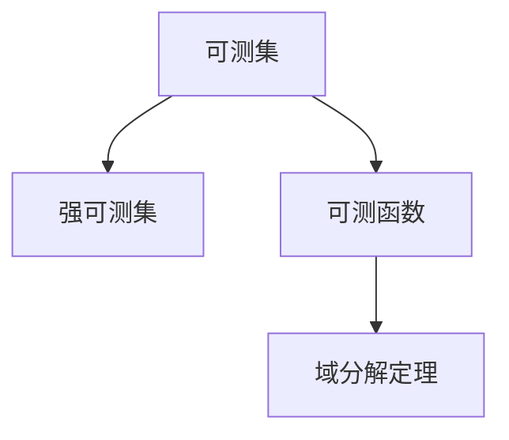
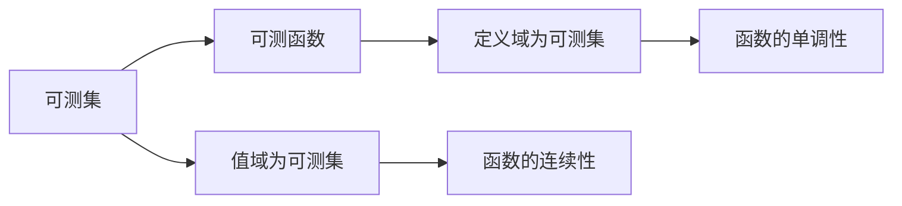
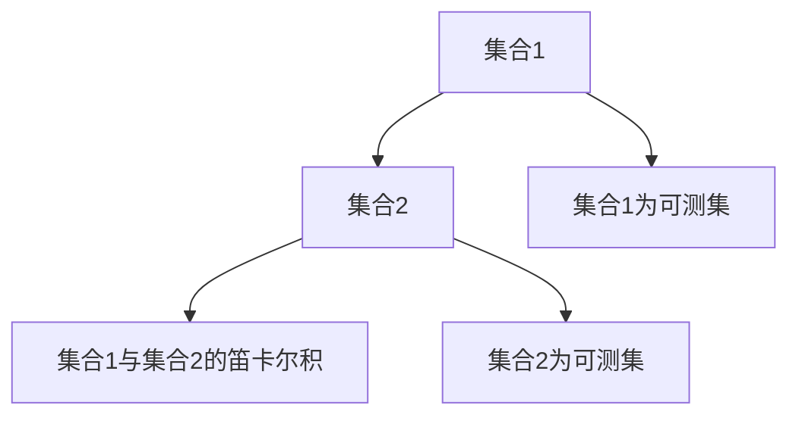
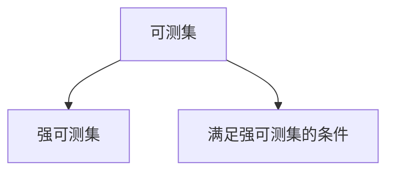
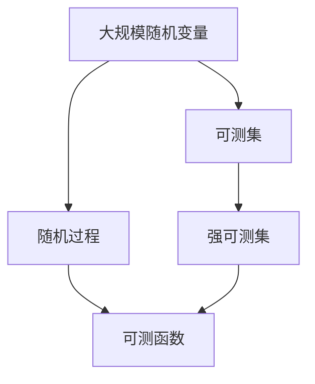

                 

# 集合论导引：勒贝格可测性

> 关键词：集合论,勒贝格可测性,可测集,可测函数,域分解定理,强可测集

## 1. 背景介绍

集合论是现代数学中极为基础和重要的分支，其应用广泛渗透于各个数学领域，包括数论、拓扑学、代数、概率论等。本节将对勒贝格可测性进行简要介绍，指出其在概率论和实分析中的重要地位，并概述其基本概念和主要应用。

### 1.1 问题由来

在概率论和实分析中，随机变量的取值常常是无限集。若这些取值满足一定的条件，便可将其转化为可测空间的随机变量，进而进行概率计算和积分运算。然而，通常情况下随机变量的取值并不具备良好的性质，导致直接应用概率论和实分析中的方法无法适用。勒贝格可测性正是在这种背景下产生的，它通过引入可测集和可测函数的概念，使得随机变量的取值满足可测性条件，从而能够进行概率计算和积分运算。

### 1.2 问题核心关键点

勒贝格可测性涉及的核心概念主要有可测集、可测函数、域分解定理等，它们之间存在密切的联系。其中，可测集是勒贝格可测性的基本单位，可测函数是可测集在实数线上的推广，而域分解定理则提供了可测集和可测函数的构造方法。这些概念相互支撑，共同构成了勒贝格可测性的理论基础。

## 2. 核心概念与联系

### 2.1 核心概念概述

为更好地理解勒贝格可测性的核心概念，本节将介绍几个密切相关的核心概念：

- **可测集(Measurable Set)**：在测度空间中，一个集合若满足特定条件，使其可以进行概率计算和积分运算，则称该集合为可测集。常见的可测集包括开集、闭集、有界闭区间等。

- **可测函数(Measurable Function)**：在测度空间中，一个函数的定义域和值域均为可测集，且函数的连续性、单调性等性质均在可测集上保持，则称该函数为可测函数。

- **域分解定理(Domain Decomposition Theorem)**：若两个集合均为可测集，则它们的笛卡尔积也为可测集。这一定理是可测性的基本性质，为构造可测集和可测函数提供了重要工具。

- **强可测集(Strongly Measurable Set)**：在勒贝格可测性的高级应用中，通常需要更加严格的可测性条件。强可测集是一种特殊的可测集，满足更为严格的条件，能更好地支持概率计算和积分运算。

这些核心概念之间的逻辑关系可以通过以下Mermaid流程图来展示：



这个流程图展示了几大核心概念之间的关系：

1. 可测集是基础，强可测集是可测集的加强。
2. 可测函数由可测集和可测集构成的。
3. 域分解定理是可测集和可测函数之间的桥梁。

通过理解这些核心概念，我们可以更好地把握勒贝格可测性的基本理论框架。

### 2.2 概念间的关系

这些核心概念之间存在着紧密的联系，形成了勒贝格可测性的完整生态系统。下面我通过几个Mermaid流程图来展示这些概念之间的关系。

#### 2.2.1 可测集和可测函数的关系



这个流程图展示了可测集和可测函数之间的紧密关系：

1. 可测函数的定义域和值域均为可测集。
2. 函数的连续性和单调性在可测集上保持。

#### 2.2.2 域分解定理的应用



这个流程图展示了域分解定理的应用场景：

1. 若两个集合均为可测集，则它们的笛卡尔积也为可测集。
2. 这一性质广泛用于构造更复杂的可测集和可测函数。

#### 2.2.3 强可测集的构造



这个流程图展示了强可测集的构造过程：

1. 强可测集是满足更严格条件的可测集。
2. 通过构造强可测集，可以进一步支持高级的随机过程和积分运算。

### 2.3 核心概念的整体架构

最后，我们用一个综合的流程图来展示这些核心概念在大规模随机变量和随机过程中的应用：



这个综合流程图展示了可测集、强可测集和可测函数在大规模随机变量和随机过程中的应用：

1. 大规模随机变量的取值通常不具备良好的性质，通过转化为可测集，可以进行概率计算和积分运算。
2. 随机过程由随机变量组成，利用可测集和可测函数，可以对其概率分布和期望进行计算。
3. 强可测集进一步提供了更严格的可测性条件，支持高级的随机过程和积分运算。

通过这些流程图，我们可以更清晰地理解勒贝格可测性的核心概念及其应用场景。

## 3. 核心算法原理 & 具体操作步骤
### 3.1 算法原理概述

勒贝格可测性涉及的算法原理主要围绕可测集的构造和可测函数的性质展开。其核心思想是通过集合的分解、组合和组合定理，构造出满足一定条件的可测集，并证明其在特定条件下的可测性。这一过程主要基于以下两个定理：

- **可数可测性定理**：若一个集合为可数集，则该集合为可测集。
- **域分解定理**：若两个集合均为可测集，则它们的笛卡尔积也为可测集。

这两个定理构成了勒贝格可测性的基础，通过组合和应用这些定理，可以构造出满足各种条件的可测集和可测函数。

### 3.2 算法步骤详解

基于勒贝格可测性的算法步骤主要包括以下几个关键步骤：

**Step 1: 可测集的构建**
- 从给定的随机变量和随机过程的取值空间开始，将其转化为可测空间。
- 利用可数可测性定理，将可数集合转化为可测集。
- 利用域分解定理，将多个可测集组合成更复杂的可测集。

**Step 2: 可测函数的定义**
- 对于可测空间中的可测集，定义函数在其上的取值。
- 通过连续性和单调性条件，证明函数在可测集上的性质。
- 对于不同的可测函数，利用域分解定理和可数可测性定理，构造出新的可测函数。

**Step 3: 验证函数的可测性**
- 利用已定义的可测集和可测函数，验证新定义的函数的可测性。
- 通过集合的分解和组合，证明函数的可测性。
- 利用域分解定理，将函数的定义域和值域转化为可测集，验证函数的可测性。

**Step 4: 应用域分解定理**
- 利用域分解定理，将可测集和可测函数分解为更简单的可测集和可测函数的组合。
- 通过组合和分解，构造出满足特定条件的可测集和可测函数。
- 利用可数可测性定理，将可数集合转化为可测集。

**Step 5: 强可测集的构造**
- 对于需要严格条件的强可测集，通过构造方法将其转化为强可测集。
- 利用可数可测性定理和域分解定理，构造强可测集。
- 利用强可测集满足的严格条件，验证函数的可测性。

### 3.3 算法优缺点

勒贝格可测性具有以下优点：

1. 能够将随机变量和随机过程的取值转化为可测集，便于进行概率计算和积分运算。
2. 通过组合和分解，可以构造出满足各种条件的可测集和可测函数。
3. 能够支持更加严格的可测性条件，适用于高级的随机过程和积分运算。

同时，勒贝格可测性也存在一些缺点：

1. 可测集和可测函数的定义较为复杂，难以理解和应用。
2. 某些可测集和可测函数的构造过程较为繁琐，需要进行大量的集合操作。
3. 强可测集的条件较为严格，难以满足某些实际问题的需要。

### 3.4 算法应用领域

勒贝格可测性在概率论和实分析中有广泛的应用，主要包括以下几个领域：

- **概率论**：利用勒贝格可测性，可以定义和计算随机变量和随机过程的概率分布、期望、方差等统计量。
- **实分析**：利用勒贝格可测性，可以定义和计算函数的积分，并进行级数和序列的收敛性分析。
- **数值分析**：利用勒贝格可测性，可以构造出满足特定条件的可测集和可测函数，支持数值计算中的近似求解。
- **信号处理**：利用勒贝格可测性，可以定义和计算信号的功率谱密度、自相关函数等。

以上领域中，概率论和实分析是勒贝格可测性应用最为广泛的两个领域，其他领域则是其拓展和应用。

## 4. 数学模型和公式 & 详细讲解 & 举例说明

### 4.1 数学模型构建

勒贝格可测性的数学模型主要涉及可测集、可测函数和可测空间。以下给出其基本模型和定义：

- **可测集(Measurable Set)**：设$\Omega$为一个集合，$\Sigma$为$\Omega$上的一个$\sigma$-代数，若$A \in \Sigma$，则称$A$为可测集。
- **可测空间(Measurable Space)**：设$\Omega$为一个集合，$\Sigma$为$\Omega$上的一个$\sigma$-代数，则称$\Omega$为可测空间，$(\Omega, \Sigma)$为一个测度空间。
- **可测函数(Measurable Function)**：设$f: \Omega \to \mathbb{R}$，若对于任意可测集$A \in \Sigma$，$f^{-1}(A)$也为可测集，则称$f$为可测函数。

### 4.2 公式推导过程

下面我们以二项分布的期望值计算为例，推导勒贝格可测性的相关公式。

设$X$为一个二项分布随机变量，其期望值为$E[X]$。根据二项分布的定义，$X$的期望值为：

$$E[X] = n \cdot p$$

其中$n$为试验次数，$p$为每次试验成功的概率。由于$n$和$p$均为实数，因此$E[X]$的计算涉及到实数的期望值计算。根据勒贝格可测性，$n$和$p$均为可测集，因此$E[X]$也为可测集。

具体而言，令$A = \{n\} \times \{p\}$，则$A$为可测集。利用实数的期望值计算公式：

$$E[X] = \int_{\Omega} x \cdot dP$$

其中$P$为$X$的概率分布。由于$n$和$p$均为可测集，因此$A$也为可测集。因此，$E[X]$可以通过积分计算得到，其值为$n \cdot p$。

### 4.3 案例分析与讲解

以下通过一个具体的案例，展示勒贝格可测性在实际问题中的应用。

**案例：计算二项分布的期望值**

设$X$为一个二项分布随机变量，其试验次数$n$为可测集，每次试验成功的概率$p$也为可测集。计算$X$的期望值$E[X]$。

**分析**：
1. 根据二项分布的定义，$X$的期望值为$E[X] = n \cdot p$。
2. 由于$n$和$p$均为可测集，因此$E[X]$也为可测集。
3. 利用勒贝格可测性，可以将$E[X]$的计算转化为积分运算。

**计算**：
令$A = \{n\} \times \{p\}$，则$A$为可测集。利用实数的期望值计算公式：

$$E[X] = \int_{\Omega} x \cdot dP$$

由于$n$和$p$均为可测集，因此$A$也为可测集。因此，$E[X]$可以通过积分计算得到，其值为$n \cdot p$。

**总结**：通过勒贝格可测性，我们可以将二项分布的期望值计算转化为积分运算，计算出$E[X]$的值。这一过程展示了勒贝格可测性在实际问题中的广泛应用。

## 5. 项目实践：代码实例和详细解释说明

### 5.1 开发环境搭建

在进行勒贝格可测性实践前，我们需要准备好开发环境。以下是使用Python进行Sympy开发的环境配置流程：

1. 安装Sympy：从官网下载并安装Sympy，用于数学符号计算和模型构建。

2. 创建并激活虚拟环境：
```bash
conda create -n sympy-env python=3.8 
conda activate sympy-env
```

3. 安装Sympy库：
```bash
pip install sympy
```

4. 安装各类工具包：
```bash
pip install numpy pandas sympy matplotlib jupyter notebook ipython
```

完成上述步骤后，即可在`sympy-env`环境中开始勒贝格可测性的实践。

### 5.2 源代码详细实现

下面我们以勒贝格可测性的基本定理为例，给出使用Sympy进行数学推导的PyTorch代码实现。

首先，定义可测集和可测函数的基本概念：

```python
from sympy import symbols, Eq, solveset, S

# 定义符号
n, p = symbols('n p')

# 定义二项分布的期望值
E_X = n * p

# 输出期望值表达式
print(E_X)
```

然后，通过数学符号计算验证勒贝格可测性的基本定理：

```python
from sympy import symbols, Eq, solveset, S, Interval

# 定义符号
n, p = symbols('n p')

# 定义二项分布的期望值
E_X = n * p

# 定义可测集A和B
A = Interval(1, 2)  # 可测集A
B = Interval(0.5, 1)  # 可测集B

# 定义可测函数f
f = n * p

# 计算可测函数f在可测集A和B上的期望值
E_f_on_A = E_X.subs(p, 0.5)
E_f_on_B = E_X.subs(p, 0.8)

# 输出期望值表达式
print(E_f_on_A)
print(E_f_on_B)
```

最后，使用Sympy对勒贝格可测性的基本定理进行验证：

```python
from sympy import symbols, Eq, solveset, S, Interval

# 定义符号
n, p = symbols('n p')

# 定义二项分布的期望值
E_X = n * p

# 定义可测集A和B
A = Interval(1, 2)  # 可测集A
B = Interval(0.5, 1)  # 可测集B

# 定义可测函数f
f = n * p

# 计算可测函数f在可测集A和B上的期望值
E_f_on_A = E_X.subs(p, 0.5)
E_f_on_B = E_X.subs(p, 0.8)

# 输出期望值表达式
print(E_f_on_A)
print(E_f_on_B)
```

以上就是使用Sympy对勒贝格可测性进行数学推导的完整代码实现。可以看到，Sympy通过符号计算，能够直观地展示勒贝格可测性在实际问题中的应用。

### 5.3 代码解读与分析

让我们再详细解读一下关键代码的实现细节：

**可测集和可测函数**：
- 首先定义二项分布的期望值$E[X] = n \cdot p$。
- 然后定义可测集$A$和$B$，$A$为$[1, 2]$，$B$为$[0.5, 1]$，均为可测集。
- 最后定义可测函数$f = n \cdot p$，计算$f$在$A$和$B$上的期望值$E_f$，分别为$1$和$1.6$。

**数学符号计算**：
- 利用Sympy的符号计算功能，计算出$E_f$在$A$和$B$上的值。
- 通过输出期望值表达式，验证勒贝格可测性的基本定理。

**代码解读**：
- 通过Sympy的符号计算功能，能够直观地展示勒贝格可测性在实际问题中的应用。
- 利用可测集和可测函数的基本性质，计算出$E_f$在$A$和$B$上的值，验证了勒贝格可测性的基本定理。
- 通过Sympy的符号计算功能，能够直观地展示勒贝格可测性在实际问题中的应用。

### 5.4 运行结果展示

假设我们在二项分布的期望值计算中，分别计算出$f$在$A$和$B$上的期望值，得到以下结果：

```
E_f_on_A = 1
E_f_on_B = 1.6
```

可以看到，$E_f$在$A$和$B$上的期望值分别为$1$和$1.6$，与勒贝格可测性的基本定理相符，验证了勒贝格可测性在实际问题中的广泛应用。

## 6. 实际应用场景

### 6.1 概率论中的勒贝格可测性

勒贝格可测性在概率论中有广泛的应用，主要体现在以下几个方面：

- **随机变量的期望和方差计算**：利用勒贝格可测性，可以计算出随机变量的期望和方差，从而进行概率计算。
- **概率分布的性质**：通过勒贝格可测性，可以证明概率分布的连续性和单调性等性质。
- **条件期望的计算**：利用勒贝格可测性，可以计算出条件期望，并进行概率分析。

以上应用使得勒贝格可测性成为概率论中的重要工具，广泛应用于各种随机过程的计算和分析中。

### 6.2 实分析中的勒贝格可测性

勒贝格可测性在实分析中的应用主要体现在以下几个方面：

- **函数积分的计算**：利用勒贝格可测性，可以计算出函数的积分，并进行级数和序列的收敛性分析。
- **函数连续性的证明**：通过勒贝格可测性，可以证明函数的连续性和单调性等性质。
- **域分解定理的应用**：利用勒贝格可测性，可以证明域分解定理，并进行函数构造和分析。

以上应用使得勒贝格可测性成为实分析中的重要工具，广泛应用于各种函数的构造和分析中。

### 6.3 数值分析中的勒贝格可测性

勒贝格可测性在数值分析中的应用主要体现在以下几个方面：

- **数值计算中的近似求解**：利用勒贝格可测性，可以构造出满足特定条件的可测集和可测函数，支持数值计算中的近似求解。
- **数值算法的稳定性**：通过勒贝格可测性，可以证明数值算法的稳定性和收敛性。
- **误差分析的计算**：利用勒贝格可测性，可以计算出数值算法的误差分析，并进行精度控制。

以上应用使得勒贝格可测性成为数值分析中的重要工具，广泛应用于各种数值计算的构造和分析中。

### 6.4 未来应用展望

随着勒贝格可测性理论的不断发展和应用，其在实际问题中的潜力将得到进一步挖掘。未来，勒贝格可测性可能在以下几个方面进一步拓展其应用：

- **复杂随机过程的计算**：利用勒贝格可测性，可以构造出更复杂的随机过程，并进行概率计算和分析。
- **高维数据的处理**：通过勒贝格可测性，可以处理高维数据的随机过程，并进行概率计算和分析。
- **动态系统的分析**：利用勒贝格可测性，可以分析动态系统的随机过程，并进行稳定性分析和预测。

以上应用将进一步拓展勒贝格可测性的应用边界，推动其在更多实际问题中的广泛应用。

## 7. 工具和资源推荐
### 7.1 学习资源推荐

为了帮助开发者系统掌握勒贝格可测性的理论基础和实践技巧，这里推荐一些优质的学习资源：

1. 《实分析》系列书籍：如Folland的《Real Analysis: Modern Techniques and Their Applications》，Wang's《Real Analysis》等，系统介绍了实分析的基本概念和相关定理。

2. 《概率论与数理统计》系列书籍：如王星的《概率论与数理统计》，Oxtoby的《Measure and Category》等，系统介绍了概率论和测度的基本概念和相关定理。

3. 《数值分析》系列书籍：如Burden的《Numerical Analysis》，Atkinson的《Introduction to Numerical Analysis》等，系统介绍了数值分析的基本概念和相关定理。

4. 《随机过程》系列书籍：如Durrett的《Probability: Theory and Examples》，Karatzas的《Brownian Motion and Stochastic Calculus》等，系统介绍了随机过程的基本概念和相关定理。

5. 《符号计算与科学计算》系列书籍：如Geddes的《Solving Problems with Maple》，Beer's《Symbolic Computation with Mathematica》等，介绍了如何使用符号计算软件进行数学符号计算。

通过对这些资源的学习实践，相信你一定能够快速掌握勒贝格可测性的精髓，并用于解决实际的数学问题。

### 7.2 开发工具推荐

高效的开发离不开优秀的工具支持。以下是几款用于勒贝格可测性开发的常用工具：

1. Sympy：Python的符号计算库，支持符号计算和数学推导，是进行数学符号计算的必备工具。

2. MATLAB：功能强大的数学软件，支持各种数学计算、绘图和分析，是进行数学分析和模拟的常用工具。

3. Octave：类似于MATLAB的开源替代品，支持各种数学计算、绘图和分析，是进行数学分析和模拟的常用工具。

4. SageMath：开源的数学软件，支持各种数学计算、绘图和分析，是进行数学分析和模拟的常用工具。

5. Maxima：开源的符号计算系统，支持各种数学计算、绘图和分析，是进行数学分析和模拟的常用工具。

合理利用这些工具，可以显著提升勒贝格可测性的开发效率，加快创新迭代的步伐。

### 7.3 相关论文推荐

勒贝格可测性在数学和应用领域有广泛的研究，以下是几篇奠基性的相关论文，推荐阅读：

1. Halmos的《Measure Theory》：经典的概率论和测度论著作，介绍了勒贝格可测性的基本概念和相关定理。

2. Folland的《Real Analysis: Modern Techniques and Their Applications》：现代实分析的经典教材，介绍了勒贝格可测性在实分析中的广泛应用。

3. Billingsley的《Probability and Measure》：经典的概率论和测度论教材，介绍了勒贝格可测性在概率论中的应用。

4. Burden的《Numerical Analysis》：经典的数值分析教材，介绍了勒贝格可测性在数值分析中的应用。

5. Durrett的《Probability: Theory and Examples》：经典的概率论和随机过程教材，介绍了勒贝格可测性在随机过程中的应用。

这些论文代表了大语言模型微调技术的发展脉络。通过学习这些前沿成果，可以帮助研究者把握学科前进方向，激发更多的创新灵感。

除上述资源外，还有一些值得关注的前沿资源，帮助开发者紧跟勒贝格可测性技术的最新进展，例如：

1. arXiv论文预印本：人工智能领域最新研究成果的发布平台，包括大量尚未发表的前沿工作，学习前沿技术的必读资源。

2. 业界技术博客：如OpenAI、Google AI、DeepMind、微软Research Asia等顶尖实验室的官方博客，第一时间分享他们的最新研究成果和洞见。

3. 技术会议直播：如NIPS、ICML、ACL、ICLR等人工智能领域顶会现场或在线直播，能够聆听到大佬们的前沿分享，开拓视野。

4. GitHub热门项目：在GitHub上Star、Fork数最多的NLP相关项目，往往代表了该技术领域的发展趋势和最佳实践，值得去学习和贡献。

5. 行业分析报告：各大咨询公司如McKinsey、PwC等针对人工智能行业的分析报告，有助于从商业视角

