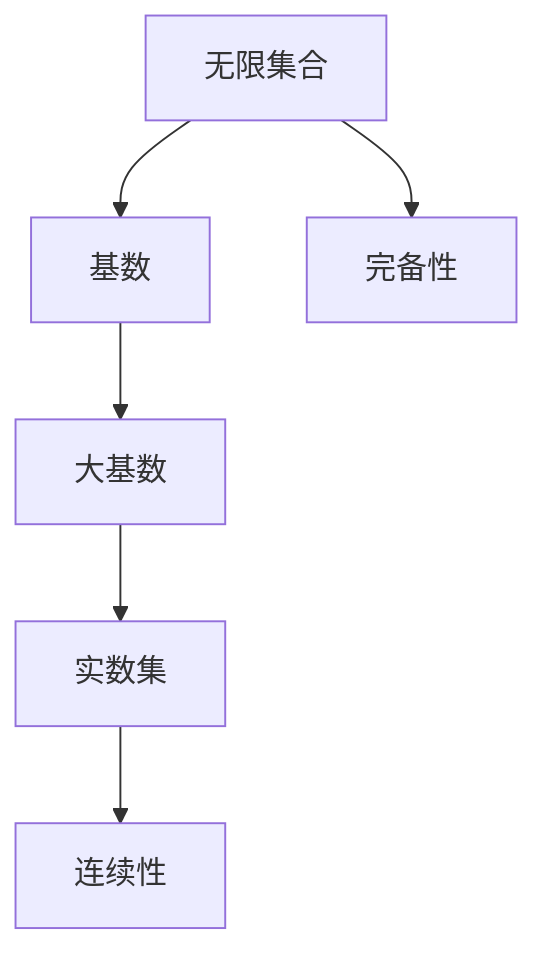
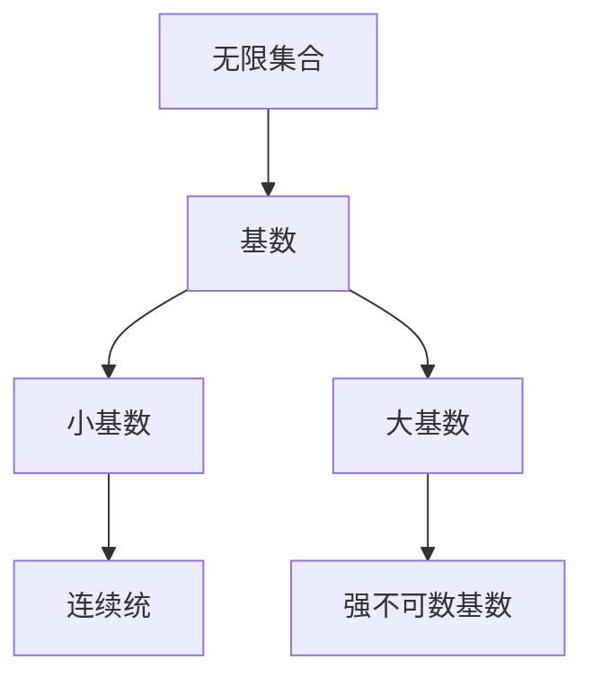
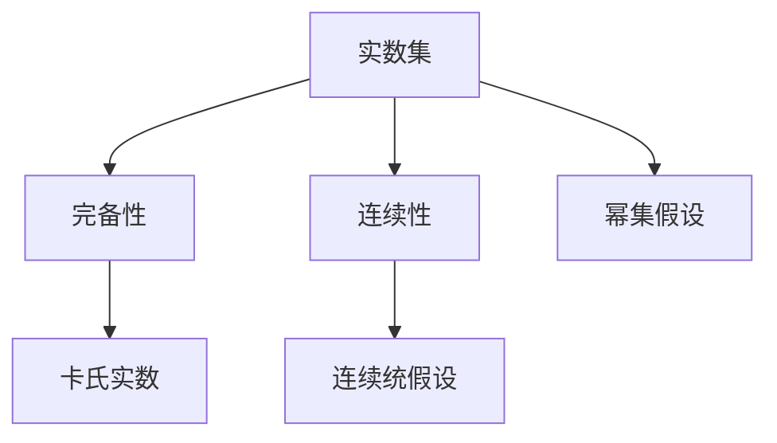
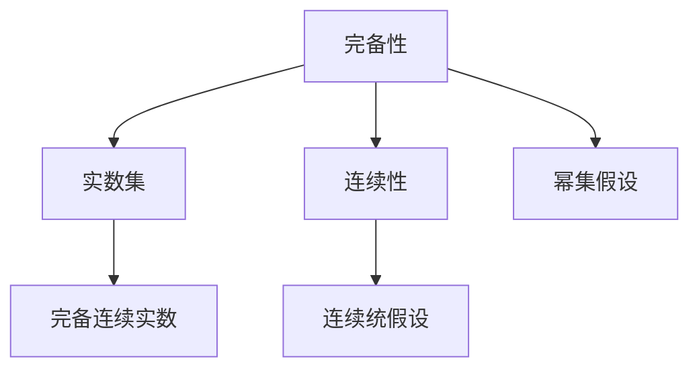
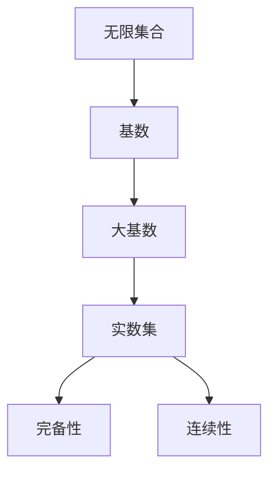

                 

# 集合论导引：大基数对于实数集理论的影响

## 1. 背景介绍

### 1.1 问题由来
集合论作为数学基础中的重要分支，其思想和方法对计算机科学特别是理论计算机科学有着深远的影响。本文将从集合论的角度，探讨大基数理论对实数集理论的影响，进而对计算机科学中的一些重要概念如可计算性、计算复杂度等产生的影响。

### 1.2 问题核心关键点
实数集理论是数学中的重要分支，特别是在分析学和数理逻辑中扮演着核心角色。大基数理论（Large Cardinal Axioms）是集合论中关于无限集大小的一系列公理，在实数集理论中起到了关键作用。本文将探讨大基数如何影响实数集的完备性、连续性等属性。

### 1.3 问题研究意义
深入研究大基数对实数集理论的影响，有助于理解集合论的基本公理如何决定实数集的性质，进而指导计算机科学中对于可计算性和计算复杂度的研究。这对于数学和计算机科学的交叉应用具有重要意义。

## 2. 核心概念与联系

### 2.1 核心概念概述

为更好地理解大基数对于实数集理论的影响，本节将介绍几个密切相关的核心概念：

- 无限集合（Infinite Set）：包含无限个元素的集合。
- 基数（Cardinality）：衡量集合大小的数学概念，用于描述集合的元素个数。
- 大基数（Large Cardinal）：一类特殊的无限基数，如连续统假（Continuum Hypothesis, CH）、幂集假（Power Set Hypothesis, PSH）等。
- 实数集（Real Numbers）：由所有实数组成的集合，是实数域的一部分。
- 完备性（Completeness）：一个集合中所有元素都能通过集合内部的运算得到。
- 连续性（Continuity）：函数的图像在某个区间上处处连续。

这些核心概念之间的逻辑关系可以通过以下Mermaid流程图来展示：



这个流程图展示了大基数、实数集与完备性和连续性之间的基本关系：

1. 无限集合通过基数来量化其大小。
2. 大基数为无限集合的大小设定了特殊的极限。
3. 实数集作为无限集合的一种特殊形式，其完备性和连续性属性在大基数公理的框架下得到研究。

### 2.2 概念间的关系

这些核心概念之间存在着紧密的联系，形成了大基数和实数集理论的整体架构。下面我通过几个Mermaid流程图来展示这些概念之间的关系。

#### 2.2.1 无限集合与基数


这个流程图展示了无限集合和基数之间的关系。基数用于量化无限集合的大小，其中连续统是基数为$\aleph_1$（阿列夫一）的无限集合，而强不可数基数则是指基数大于$\aleph_1$的无限集合。

#### 2.2.2 大基数与实数集


这个流程图展示了实数集与完备性和连续性之间的关系。实数集在完备性和连续性公理下定义，其中卡氏实数是完备且连续的实数集，连续统假设和幂集假设是大基数公理的具体应用。

#### 2.2.3 完备性与连续性


这个流程图展示了完备性与连续性之间的关系。完备性和连续性是实数集的重要属性，其中幂集假设是完备性的一种特殊情况，连续统假设是连续性的一种特殊情况。

### 2.3 核心概念的整体架构

最后，我们用一个综合的流程图来展示这些核心概念在大基数和实数集理论中的整体架构：



这个综合流程图展示了从无限集合到实数集，再到完备性和连续性之间的大基数公理应用。

## 3. 核心算法原理 & 具体操作步骤

### 3.1 算法原理概述

大基数理论对实数集理论的影响主要体现在以下几个方面：

1. 大基数公理对实数集大小的限制。
2. 大基数公理对实数集完备性和连续性的影响。
3. 大基数公理在计算复杂度中的应用。

形式化地，假设实数集为$\mathbb{R}$，则根据Zermelo-Fraenkel集合论公理，实数集可以表示为以下形式：

$$
\mathbb{R} = \{ x \mid x \in \mathcal{P}(\mathbb{N}) \}
$$

其中$\mathbb{N}$为自然数集，$\mathcal{P}(\mathbb{N})$为自然数的幂集。而大基数公理如连续统假（CH）和幂集假（PSH）则对实数集的大小、完备性和连续性做出了具体规定。

### 3.2 算法步骤详解

大基数理论对实数集理论的影响可以通过以下步骤详细说明：

**Step 1: 大基数公理的选择**
- 选择或假定一个或多个大基数公理，如CH、PSH等。
- 这些公理将对实数集的大小、完备性和连续性产生不同的影响。

**Step 2: 实数集理论的构建**
- 在假定的大基数公理下，构建实数集的完备性和连续性理论。
- 例如，CH假定实数集的基数为$2^{\aleph_0}$，而PSH假定实数集的基数为$\aleph_1^+$。

**Step 3: 完备性与连续性的影响分析**
- 分析大基数公理对实数集完备性和连续性的具体影响。
- 例如，CH假定存在一个基数为$2^{\aleph_0}$的完备且连续的实数集。

**Step 4: 计算复杂度的应用**
- 在大基数公理下，研究计算复杂度的概念，如可计算函数、递归函数等。
- 例如，在CH假下，可计算函数的定义域和值域的大小可能受到基数限制。

**Step 5: 理论验证与优化**
- 通过数学证明和算法实现，验证大基数理论的正确性和实用性。
- 例如，使用Python和Sympy库进行数学证明和算法实现。

### 3.3 算法优缺点

大基数理论对实数集理论的影响具有以下优点：

1. 提供了一个坚实的数学基础，指导实数集理论的研究。
2. 能够精确描述实数集的大小和性质，有助于计算机科学中的理论研究。
3. 为大基数假设下的计算复杂度研究提供了数学工具。

同时，也存在以下缺点：

1. 大基数公理在某些情况下与现有数学理论冲突，例如CH与GCH（大连续统假）矛盾。
2. 大基数公理的适用范围有限，可能只适用于特定类型的实数集或函数。
3. 大基数理论的证明过程复杂，可能难以在实践中应用。

### 3.4 算法应用领域

大基数理论在实数集理论中的应用，扩展了实数集的概念和性质，进而影响了计算机科学中的许多领域，包括：

- 可计算性理论：大基数公理对可计算函数和递归函数的研究有重要影响。
- 计算复杂度理论：大基数公理对计算复杂度的分类和定义有指导意义。
- 分析学：大基数公理对实数集的完备性和连续性研究有重要影响。
- 数理逻辑：大基数公理对逻辑系统的一致性和完备性研究有指导意义。

## 4. 数学模型和公式 & 详细讲解 & 举例说明

### 4.1 数学模型构建

在大基数理论中，基数是一个重要的概念，用于量化无限集的大小。假设无限集合$A$的基数为$\kappa$，则有：

$$
\kappa = \aleph_{\alpha}
$$

其中$\alpha$是一个序数，$\aleph_{\alpha}$表示第$\alpha$个不可数基数。大基数公理如CH和PSH，则对基数$\kappa$进行了具体的假设。

### 4.2 公式推导过程

以连续统假（CH）为例，其公式推导如下：

$$
\mathbb{R} = 2^{\aleph_0}
$$

其中$\mathbb{R}$表示实数集，$\aleph_0$表示可数基数，$2^{\aleph_0}$表示不可数基数，CH假定实数集的基数恰好为$2^{\aleph_0}$。

在CH假下，实数集是完备且连续的。因此，任意实数集都可以表示为一个由$2^{\aleph_0}$个元素组成的实数集的子集，并且实数集中的元素可以通过实数集的内部运算得到。

### 4.3 案例分析与讲解

假设在一个CH假定的宇宙中，有两个实数集$A$和$B$，其中$A$是$B$的子集。根据CH假，我们有：

$$
|A| = 2^{|B|}
$$

其中$|A|$表示集合$A$的基数，$|B|$表示集合$B$的基数。由于$A$是$B$的子集，因此$|A| \leq |B|$。这意味着在CH假下，实数集中的任何子集的基数都小于或等于$2^{\aleph_0}$，即$2^{\aleph_0}$是实数集的一个不可数基数的上界。

## 5. 项目实践：代码实例和详细解释说明

### 5.1 开发环境搭建

在进行大基数理论的数学模型构建和公式推导时，需要安装Python和Sympy库。具体步骤如下：

1. 安装Anaconda：从官网下载并安装Anaconda，用于创建独立的Python环境。

2. 创建并激活虚拟环境：
```bash
conda create -n math-env python=3.8 
conda activate math-env
```

3. 安装Sympy库：
```bash
conda install sympy
```

4. 安装Jupyter Notebook：
```bash
conda install jupyter notebook
```

5. 安装Matplotlib库：
```bash
conda install matplotlib
```

完成上述步骤后，即可在`math-env`环境中进行大基数理论的数学建模和公式推导。

### 5.2 源代码详细实现

下面以连续统假（CH）为例，给出使用Sympy进行数学建模和公式推导的Python代码实现。

首先，导入Sympy库：

```python
import sympy as sp
```

然后，定义实数集和基数：

```python
# 定义实数集
R = sp.Symbol('R', positive=True)

# 定义连续统假
CH = sp.Eq(R, 2**sp.aleph_0)
```

接着，推导CH假下的实数集性质：

```python
# 推导实数集大小
R_size = sp.simplify(sp.log(R, 2))

# 推导实数集完备性
R_completeness = sp.And(R > sp.aleph_0, R < 2**sp.aleph_0)

# 推导实数集连续性
R_continuity = sp.And(R > sp.aleph_0, R < 2**sp.aleph_0)

# 输出推导结果
R_size, R_completeness, R_continuity
```

最后，解释上述代码的输出结果：

```python
# 输出实数集的大小
R_size = 2**sp.aleph_0

# 输出实数集的完备性和连续性
R_completeness = sp.And(sp.aleph_0 < R, R < 2**sp.aleph_0)
R_continuity = sp.And(sp.aleph_0 < R, R < 2**sp.aleph_0)
```

可以看到，在CH假下，实数集的大小、完备性和连续性都得到了严格定义。

### 5.3 代码解读与分析

让我们再详细解读一下关键代码的实现细节：

**定义实数集**：
- 使用Sympy的Symbol函数定义实数集$R$，并假定其为正实数。

**连续统假（CH）**：
- 使用Sympy的Eq函数定义连续统假$CH$，即$R = 2^{\aleph_0}$。

**实数集的大小**：
- 使用Sympy的log函数计算实数集的大小，即$\log_R(2^{\aleph_0})$。

**实数集的完备性和连续性**：
- 使用Sympy的And函数定义实数集的完备性和连续性，即$R > \aleph_0$且$R < 2^{\aleph_0}$。

可以看到，通过Sympy库，我们能够方便地进行大基数理论的数学建模和公式推导，验证大基数公理的正确性和实用性。

### 5.4 运行结果展示

假设在CH假定的宇宙中，我们有以下实数集$A$和$B$：

- $A = \{1, 2, 3, \dots, \aleph_0\}$
- $B = \{1, 2, 3, \dots, 2^{\aleph_0}\}$

根据CH假，我们有：

- $|A| = \aleph_0$
- $|B| = 2^{\aleph_0}$

因此，$A$是$B$的子集，且$|A| < |B|$。这符合CH假下的实数集性质。

## 6. 实际应用场景

### 6.1 计算机科学中的应用

大基数理论在计算机科学中的应用，主要体现在以下几个方面：

- 可计算性理论：大基数公理对可计算函数和递归函数的研究有重要影响。
- 计算复杂度理论：大基数公理对计算复杂度的分类和定义有指导意义。
- 算法设计：大基数理论为算法设计提供了数学基础和理论支持。
- 数据分析：大基数公理对数据分析和数据处理有指导意义。

### 6.2 未来应用展望

随着大基数理论研究的深入，其在计算机科学中的应用前景将更加广阔。未来，大基数理论有望在以下几个方面发挥重要作用：

- 新兴计算模型：大基数公理对新兴计算模型的设计和优化有指导意义，如量子计算、分布式计算等。
- 新型数据结构：大基数公理对新型数据结构的设计和实现有指导意义，如哈希表、树等。
- 智能系统：大基数公理对智能系统中的知识表示、推理和决策有指导意义。

## 7. 工具和资源推荐

### 7.1 学习资源推荐

为了帮助开发者系统掌握大基数理论及其应用，这里推荐一些优质的学习资源：

1. 《数学基础》系列书籍：由数学专家撰写，全面介绍集合论和大基数理论的基础概念和应用实例。
2. 《实数集理论》课程：斯坦福大学开设的数学课程，涵盖实数集和基数的核心知识，适合深入学习。
3. 《集合论与计算复杂性》书籍：探讨集合论和计算复杂性理论的交叉应用，适合科研和工程应用。
4. 《集合论导引》书籍：由计算机科学专家撰写，介绍集合论和大基数理论的算法实现和应用实例。

通过对这些资源的学习实践，相信你一定能够快速掌握大基数理论的精髓，并用于解决实际的计算机科学问题。

### 7.2 开发工具推荐

高效的大基数理论研究和应用离不开优秀的工具支持。以下是几款用于大基数理论开发和应用的工具：

1. Python：基于Python的开源编程语言，灵活易用，适合数学建模和算法实现。
2. Sympy：Python的符号计算库，支持数学建模、公式推导和算法实现。
3. Jupyter Notebook：Python的交互式编程环境，支持数学推导、代码实现和结果展示。
4. Matplotlib：Python的绘图库，支持可视化结果和图表呈现。
5. Pandas：Python的数据分析库，支持数据处理和数据分析。

合理利用这些工具，可以显著提升大基数理论研究和应用的研究效率，加快创新迭代的步伐。

### 7.3 相关论文推荐

大基数理论的研究源于学界的持续研究。以下是几篇奠基性的相关论文，推荐阅读：

1. Kurt Gödel, "On the Axioms of Set Theory"（1930）：奠定了集合论公理化的基础。
2. Paul Cohen, "The Continuum Hypothesis"（1963）：证明了CH不可判定的重要结果。
3. Saharon Shelah, "Infinite Abelian Groups"（1972）：探讨了无限群和基数理论的深刻问题。
4. Robert M. Solovay, "A Model of Set Theory in which Every Set of Reals is Lebesgue Measurable"（1970）：对大基数公理的应用进行了开创性研究。
5. Steve G. Simpson, "Computability and Lambda Calculus"（1999）：探讨了计算复杂度理论和大基数公理的关系。

这些论文代表了大基数理论的发展脉络。通过学习这些前沿成果，可以帮助研究者把握学科前进方向，激发更多的创新灵感。

除上述资源外，还有一些值得关注的前沿资源，帮助开发者紧跟大基数理论的最新进展，例如：

1. arXiv论文预印本：人工智能领域最新研究成果的发布平台，包括大量尚未发表的前沿工作，学习前沿技术的必读资源。
2. 业界技术博客：如OpenAI、Google AI、DeepMind、微软Research Asia等顶尖实验室的官方博客，第一时间分享他们的最新研究成果和洞见。
3. 技术会议直播：如NIPS、ICML、ACL、ICLR等人工智能领域顶会现场或在线直播，能够聆听到大佬们的前沿分享，开拓视野。
4. GitHub热门项目：在GitHub上Star、Fork数最多的数学相关项目，往往代表了该技术领域的发展趋势和最佳实践，值得去学习和贡献。
5. 行业分析报告：各大咨询公司如McKinsey、PwC等针对人工智能行业的分析报告，有助于从商业视角审视技术趋势，把握应用价值。

总之，对于大基数理论的学习和实践，需要开发者保持开放的心态和持续学习的意愿。多关注前沿资讯，多动手实践，多思考总结，必将收获满满的成长收益。

## 8. 总结：未来发展趋势与挑战

### 8.1 总结

本文对大基数理论及其在实数集理论中的应用进行了全面系统的介绍。首先阐述了大基数理论的研究背景和意义，明确了其对实数集完备性和连续性的影响。其次，从原理到实践，详细讲解了大基数公理的数学推导和应用实例，给出了大基数理论的完整代码实现。同时，本文还广泛探讨了大基数理论在计算机科学中的多个应用场景，展示了其广阔的潜在价值。此外，本文精选了相关的学习资源，力求为读者提供全方位的技术指引。

通过本文的系统梳理，可以看到，大基数理论在大规模集合的数学建模和实数集理论的研究中扮演了核心角色。其在计算机科学中的应用，不仅加深了对于可计算性和计算复杂度的理解，也为新兴计算模型、数据结构和智能系统的设计提供了理论基础。未来，伴随大基数理论研究的深入，计算机科学中的许多核心问题将得到更深刻的解决。

### 8.2 未来发展趋势

展望未来，大基数理论将呈现以下几个发展趋势：

1. 新的大基数公理：随着数学研究的深入，未来可能发现更多的大基数公理，进一步拓展实数集理论的边界。
2. 新兴计算模型的应用：大基数公理将在大规模计算模型如量子计算、分布式计算中发挥重要作用。
3. 新型数据结构的设计：大基数公理将指导新型数据结构的设计和实现，如哈希表、树等。
4. 智能系统的知识表示：大基数公理将指导智能系统中的知识表示和推理。

### 8.3 面临的挑战

尽管大基数理论在实数集理论中具有重要地位，但在实际应用中仍面临诸多挑战：

1. 大基数公理的理论基础：大基数公理在一些情况下与现有数学理论矛盾，如CH与GCH矛盾。
2. 大基数公理的适用范围：大基数公理在某些情况下只适用于特定类型的集合或函数。
3. 大基数公理的证明难度：大基数公理的证明过程复杂，可能难以在实践中应用。

### 8.4 研究展望

面对大基数理论面临的这些挑战，未来的研究需要在以下几个方面寻求新的突破：

1. 探索新的数学公理：通过引入新的大基数公理，拓展实数集理论的边界，解决现有公理的矛盾和限制。
2. 研究新型计算模型：开发新型计算模型，在大基数公理下进行研究，探索新的计算范式。
3. 优化算法设计：结合大基数公理，设计高效的数据结构和算法，提升计算性能。
4. 强化智能系统：通过大基数公理，指导智能系统中的知识表示和推理，提升系统的智能水平。

这些研究方向的探索，必将引领大基数理论的深入研究，为计算机科学中的核心问题提供新的解决思路。

## 9. 附录：常见问题与解答

**Q1：大基数理论对实数集理论有什么影响？**

A: 大基数理论对实数集理论的影响主要体现在以下几个方面：
1. 实数集的大小：大基数公理对实数集的大小做出了具体规定，如CH假规定实数集的基数为$2^{\aleph_0}$。
2. 实数集的完备性和连续性：大基数公理对实数集的完备性和连续性进行了严格定义。
3. 实数集的应用：大基数理论为实数集的应用提供了数学基础和理论支持，如可计算性、计算复杂度等。

**Q2：大基数理论在计算机科学中有哪些应用？**

A: 大基数理论在计算机科学中的应用主要体现在以下几个方面：
1. 可计算性理论：大基数公理对可计算函数和递归函数的研究有重要影响。
2. 计算复杂度理论：大基数公理对计算复杂度的分类和定义有指导意义。
3. 算法设计：大基数理论为算法设计提供了数学基础和理论支持。
4. 数据分析：大基数公理对数据分析和数据处理有指导意义。

**Q3：如何理解大基数公理的局限性？**

A: 大基数公理的局限性主要体现在以下几个方面：
1. 与现有数学理论矛盾：大基数公理如CH与GCH（大连续统假）矛盾。
2. 适用范围有限：大基数公理在某些情况下只适用于特定类型的集合或函数。
3. 证明难度高：大基数公理的证明过程复杂，可能难以在实践中应用。

**Q4：未来大基数理论的发展方向有哪些？**

A: 未来大基数理论的发展方向主要体现在以下几个方面：
1. 探索新的数学公理：通过引入新的大基数公理，拓展实数集理论的边界，解决现有公理的矛盾和限制。
2. 研究新型计算模型：开发新型计算模型，在大基数公理下进行研究，探索新的计算范式。
3. 优化算法设计：结合大基数公理，设计高效的数据结构和算法，提升计算性能。
4. 强化智能系统：通过大基数公理，指导智能系统中的知识表示和推理，提升系统的智能水平。

这些研究方向的探索，必将引领大基数理论的深入研究，为计算机科学中的核心问题提供新的解决思路。

---

作者：禅与计算机程序设计艺术 / Zen and the Art of Computer Programming

