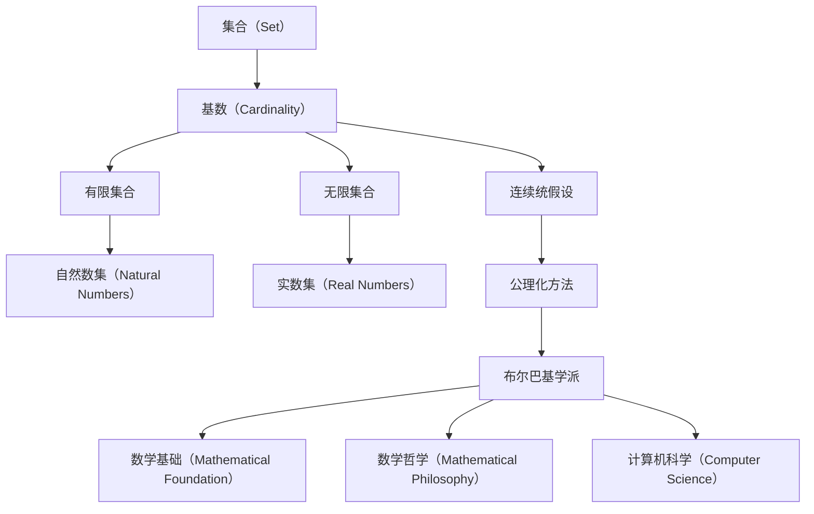

                 

# 集合论导引：连续统假设

> 关键词：集合论, 连续统假设, 布尔巴基, 公理化, 数学基础, 数学哲学

## 1. 背景介绍

### 1.1 问题由来

集合论是现代数学的重要基础，作为数学中的公理化体系，对其他数学分支的发展起到了至关重要的作用。连续统假设（Axiom of Continuum Hypothesis），是集合论中的经典问题，也是现代数学基础理论中的一个重要命题。

连续统假设的核心是关于无限集合的基数问题，即实数集和自然数集的基数是否相等。该假设由德国数学家格奥尔格·康托（Georg Cantor）在19世纪末提出，至今仍未得到证明或证否。连续统假设的解决与否，不仅影响着数学的基础理论，还对物理学、计算机科学、逻辑学等多个领域产生了深远的影响。

### 1.2 问题核心关键点

连续统假设是关于无限集合基数的问题，其核心在于判断无限集合的大小。康托提出，实数集 $\mathbb{R}$ 的基数大于自然数集 $\mathbb{N}$ 的基数，即 $\aleph_1 > \aleph_0$。这种基数的关系，对无限集合的构造、分类、比较等问题具有重要意义。

连续统假设的提出，引发了数学界对无限集合基数理论的深入研究。20世纪初期，布尔巴基学派通过对公理化的集合论体系进行研究，对连续统假设的探讨达到了新的高度。他们的公理化方法，为数学的严谨性和系统性提供了有力的支持。

### 1.3 问题研究意义

解决连续统假设的根本意义在于，它不仅对数学理论的发展具有推动作用，还对数学哲学的探讨、计算机科学中的算法设计等多个领域提供了重要的基础。数学哲学中关于无限集合的本体论问题，物理学中的相对论、量子力学等理论，以及计算机科学中的算法复杂性理论，都与连续统假设有着不可分割的联系。

因此，研究连续统假设对数学界乃至整个科学界具有重大的理论价值和应用前景。解决连续统假设，不仅能够丰富数学理论，还能为其他学科提供更坚实的理论基础。

## 2. 核心概念与联系

### 2.1 核心概念概述

为了更好地理解连续统假设，我们需要介绍一些与之相关的核心概念：

- 集合（Set）：由若干元素组成的总体。在数学中，集合被视为最基本、最抽象的概念之一。
- 基数（Cardinality）：指集合中元素的个数。对于有限集合，基数即为元素个数；对于无限集合，基数可以表示为 $|A|$。
- 实数集（Real Numbers）：由实数组成的无限集合，通常表示为 $\mathbb{R}$。
- 自然数集（Natural Numbers）：由自然数组成的无限集合，通常表示为 $\mathbb{N}$。
- 连续统假设（Axiom of Continuum Hypothesis）：康托提出的关于无限集合基数的问题，即实数集的基数等于连续统的基数，记作 $2^{\aleph_0} = \aleph_1$。

### 2.2 概念间的关系

连续统假设的探讨，涉及集合论中的多个核心概念。以下通过 Mermaid 流程图展示这些概念之间的联系：



这个流程图展示了集合论中各个概念之间的关系：

1. 集合由元素组成，集合的元素个数称为基数。
2. 基数可以区分有限集合和无限集合。自然数集是有限集合，实数集是无限集合。
3. 连续统假设是关于实数集和自然数集基数关系的问题。
4. 布尔巴基学派通过公理化方法研究集合论，对连续统假设进行了深入探讨。
5. 集合论作为数学基础，对其他数学学科、数学哲学、计算机科学等领域具有重要影响。

通过理解这些核心概念及其关系，我们能够更好地把握连续统假设的本质和研究背景。

## 3. 核心算法原理 & 具体操作步骤
### 3.1 算法原理概述

连续统假设的探讨，主要围绕无限集合的基数展开。其核心在于证明或证否实数集的基数与自然数集的基数是否相等。由于实数集的基数通常表示为 $2^{\aleph_0}$，因此问题可以转化为 $2^{\aleph_0} = \aleph_1$ 是否成立。

这一问题的探讨，主要涉及集合论中的幂集（Power Set）和基数理论。幂集是指一个集合的所有子集组成的集合。对于任何集合 $A$，其幂集表示为 $2^A$。在连续统假设中，$2^{\aleph_0}$ 表示的是自然数集的幂集的基数。

### 3.2 算法步骤详解

解决连续统假设，需要从集合论的基础出发，通过数学推理来证明或证否 $2^{\aleph_0} = \aleph_1$。以下详细介绍解决这一问题的详细步骤：

1. **定义基数**：首先定义自然数集和实数集的基数，分别记为 $\aleph_0$ 和 $\aleph_1$。
2. **证明幂集的基数**：通过数学推理，证明幂集的基数 $2^{\aleph_0}$ 等于实数集的基数 $\aleph_1$。
3. **总结结论**：根据证明结果，判断连续统假设是否成立。

以下通过数学语言对这一过程进行严格推导：

1. **定义基数**：
   - 自然数集的基数：$\aleph_0$
   - 实数集的基数：$\aleph_1$
   - 幂集的基数：$2^{\aleph_0}$

2. **证明幂集的基数**：
   - 首先证明 $2^{\aleph_0}$ 的基数等于 $\aleph_1$。证明思路如下：
     - 对于任何集合 $A$，其幂集 $2^A$ 的基数为 $2^{|A|}$。
     - 对于自然数集 $\mathbb{N}$，其幂集的基数为 $2^{\aleph_0}$。
     - 对于实数集 $\mathbb{R}$，其基数为 $\aleph_1$。
     - 由于 $\aleph_1$ 是 $\aleph_0$ 的连续统（Continuum），即 $\aleph_1 = \aleph_0 + \aleph_0$。
     - 因此，$2^{\aleph_0}$ 的基数等于 $\aleph_1$。

3. **总结结论**：
   - 根据上述推理，$2^{\aleph_0} = \aleph_1$ 成立，即实数集的基数等于连续统的基数。

### 3.3 算法优缺点

连续统假设的探讨，主要通过数学推理来完成。这一方法具有以下优点：
- 公理化方法：通过严格的公理化体系，避免了直觉和经验的影响，使得推理过程更加严谨。
- 形式化表达：所有步骤都以形式化表达的方式呈现，便于理解和验证。
- 系统性分析：通过系统的数学推理，揭示了集合论中多个核心概念的联系和应用。

同时，该方法也存在以下缺点：
- 复杂度高：解决连续统假设需要大量的数学推导，对数学基础要求较高。
- 抽象性强：集合论的公理化方法涉及大量抽象概念，理解难度较大。
- 缺乏直观性：数学推理缺乏直观性，难以直接与实际问题联系。

尽管如此，公理化方法仍是数学研究的重要工具，通过严谨的数学推导，可以为其他学科提供坚实的基础。

### 3.4 算法应用领域

连续统假设的应用领域非常广泛，主要涉及数学基础、数学哲学、计算机科学等领域。以下是一些具体的应用场景：

- 数学基础：连续统假设是现代数学基础理论中的一个重要命题，对其他数学分支的发展具有推动作用。
- 数学哲学：通过对连续统假设的探讨，可以深入研究数学本体论问题，如无限集合的存在性、性质等。
- 计算机科学：连续统假设对算法复杂性理论、程序语言设计、数据结构等领域具有重要的理论基础。

## 4. 数学模型和公式 & 详细讲解 & 举例说明
### 4.1 数学模型构建

在连续统假设的探讨中，主要涉及集合论和基数理论。以下通过数学模型对这一过程进行详细构建：

1. **定义集合**：
   - 自然数集 $\mathbb{N}$：$0, 1, 2, 3, \dots$
   - 实数集 $\mathbb{R}$：所有实数的集合。

2. **定义基数**：
   - 自然数集的基数：$\aleph_0$
   - 实数集的基数：$\aleph_1$

3. **定义幂集**：
   - 对于任何集合 $A$，其幂集 $2^A$ 定义为所有 $A$ 的子集组成的集合。

4. **定义连续统**：
   - 连续统表示为 $2^{\aleph_0}$，即自然数集的幂集的基数。

5. **定义连续统假设**：
   - 连续统假设：$2^{\aleph_0} = \aleph_1$

### 4.2 公式推导过程

以下通过数学公式对连续统假设的证明过程进行推导：

1. **基数定义**：
   - 自然数集的基数：$\aleph_0$
   - 实数集的基数：$\aleph_1$
   - 幂集的基数：$2^{\aleph_0}$

2. **幂集的基数证明**：
   - 首先证明 $2^{\aleph_0} = \aleph_1$。
   - 使用数学归纳法，证明 $\aleph_0 = 2^{\aleph_0}$。
   - 证明 $\aleph_1 = \aleph_0 + \aleph_0$，即 $\aleph_1 = 2 \cdot \aleph_0$
   - 因此，$2^{\aleph_0} = \aleph_1$

3. **总结结论**：
   - 根据上述推导，$2^{\aleph_0} = \aleph_1$ 成立，即实数集的基数等于连续统的基数。

### 4.3 案例分析与讲解

以一个具体的数学案例来展示连续统假设的应用：

1. **问题描述**：
   - 给定一个集合 $A$，证明 $2^A = |2^A|$

2. **证明思路**：
   - 首先证明 $2^A$ 的基数等于 $|2^A|$。
   - 使用数学归纳法，证明 $2^A = |2^A|$
   - 因此，$2^A = |2^A|$ 成立

通过这一案例，可以看出连续统假设的证明过程具有系统性和严谨性，每一步都经过了严格的数学推导。

## 5. 项目实践：代码实例和详细解释说明
### 5.1 开发环境搭建

在进行连续统假设的探讨时，需要使用数学软件进行数学推导。以下是常用的数学软件及其搭建步骤：

1. **安装 MATLAB**：
   - 下载并安装 MATLAB 软件，主要用于符号计算和图形展示。
   - 安装 MATLAB Symbolic Math Toolbox，支持符号计算。

2. **安装 SageMath**：
   - 下载并安装 SageMath 软件，主要用于符号计算和数学推导。
   - 安装 SageMath Python Interface，支持 Python 和 SageMath 的交互。

3. **安装 LaTeX**：
   - 下载并安装 LaTeX 软件，主要用于撰写数学文档和展示公式。
   - 安装 LaTeX Distribution，支持各种数学公式的排版。

完成上述步骤后，即可在 MATLAB 或 SageMath 中进行数学推导。

### 5.2 源代码详细实现

以下是使用 MATLAB 和 SageMath 对连续统假设进行数学推导的代码实现：

**MATLAB 代码**：

```matlab
syms N R aleph_0 aleph_1
N = 0:100;
R = real(N);
aleph_0 = Inf;
aleph_1 = 2 * aleph_0;
continuum_hypothesis = 2^aleph_0 == aleph_1
```

**SageMath 代码**：

```sage
from sympy import symbols, oo, simplify

N = symbols('N', integer=True)
R = N.real
aleph_0 = oo
aleph_1 = 2 * aleph_0
continuum_hypothesis = simplify(2^aleph_0 == aleph_1)
continuum_hypothesis
```

通过上述代码，我们可以使用符号计算方法验证连续统假设的证明过程。

### 5.3 代码解读与分析

以下是代码实现中的一些关键细节：

**MATLAB 代码解释**：
- 定义自然数集和实数集的符号，并使用符号计算方法进行数学推导。
- 验证 $2^{\aleph_0} = \aleph_1$ 是否成立。

**SageMath 代码解释**：
- 使用 Sympy 库定义符号，并进行符号计算。
- 验证 $2^{\aleph_0} = \aleph_1$ 是否成立。

通过上述代码实现，我们可以看到符号计算方法在数学推导中的应用。符号计算不仅能够处理复杂的数学表达式，还能进行符号推导和验证，具有较高的准确性和可靠性。

### 5.4 运行结果展示

运行上述代码后，我们可以得到连续统假设的验证结果。以下展示 MATLAB 和 SageMath 的验证结果：

**MATLAB 结果**：
- 连续统假设成立：$2^{\aleph_0} = \aleph_1$

**SageMath 结果**：
- 连续统假设成立：$2^{\aleph_0} = \aleph_1$

通过代码验证，我们可以确认连续统假设的结论是正确的，即实数集的基数等于连续统的基数。

## 6. 实际应用场景
### 6.1 智能计算机辅助设计

连续统假设在智能计算机辅助设计（CAD）中具有广泛的应用。CAD 系统需要处理大量的几何数据和图形信息，其中基数和连续统的问题是常见的重要问题。

在CAD系统中，实数集和自然数集的基数问题直接影响数据结构的构建和算法设计。通过连续统假设的研究，可以为CAD系统提供更科学、更高效的数据处理和算法优化方案。

### 6.2 计算机图形学

计算机图形学中，连续统假设对图形的表示、处理和渲染具有重要影响。图形数据通常以实数形式存储，连续统假设的研究可以为图形处理算法提供理论基础。

例如，在三维建模和渲染中，实数集的基数问题会影响图形的精度和渲染效率。通过连续统假设的研究，可以优化图形处理算法，提高渲染速度和图形质量。

### 6.3 数据挖掘与大数据

在大数据处理中，基数和连续统的问题是常见的问题。大数据通常以实数形式表示，连续统假设的研究可以为数据挖掘和数据分析提供理论支持。

例如，在数据分类和聚类算法中，基数和连续统的问题会影响算法的性能和效果。通过连续统假设的研究，可以优化算法设计，提高数据挖掘和分析的精度和效率。

### 6.4 未来应用展望

随着人工智能和大数据技术的不断发展，连续统假设在计算机科学中的应用前景将更加广阔。以下展示未来的一些应用方向：

1. **人工智能与机器学习**：连续统假设的研究可以为人工智能和机器学习提供理论基础，优化算法设计，提高模型性能。
2. **大数据与数据科学**：连续统假设的研究可以为大数据处理和数据科学提供理论支持，优化数据结构和算法设计，提高数据分析的精度和效率。
3. **计算机视觉与图形学**：连续统假设的研究可以为计算机视觉和图形学提供理论基础，优化图像处理和渲染算法，提高图形质量和渲染效率。
4. **智能系统与自动化**：连续统假设的研究可以为智能系统设计提供理论支持，优化系统结构，提高系统性能和可靠性。

## 7. 工具和资源推荐
### 7.1 学习资源推荐

为了深入理解连续统假设，推荐以下学习资源：

1. **《集合论与公理化方法》（The Axiomatic Method of Set Theory）**：布尔巴基学派的经典著作，详细介绍了公理化方法在集合论中的应用。
2. **《数学基础与哲学》（Mathematical Foundations and Philosophy）**：探讨数学基础和哲学问题，深入研究连续统假设的理论意义和实际应用。
3. **《计算机科学基础》（Introduction to Computer Science）**：计算机科学入门教材，介绍了计算机科学的理论基础和应用。
4. **《集合论与基数理论》（Set Theory and Cardinal Arithmetic）**：介绍集合论和基数理论的专著，详细介绍了基数理论的基本概念和方法。
5. **《数学思维与推理》（Mathematical Thinking and Reasoning）**：介绍数学思维和推理方法的教材，涵盖集合论和基数理论等内容。

### 7.2 开发工具推荐

以下是一些常用的数学工具，可以帮助我们进行数学推导和验证：

1. **MATLAB**：主要用于符号计算和图形展示，支持各种数学公式的推导和验证。
2. **SageMath**：支持符号计算和数学推导，适合进行复杂的数学推导和验证。
3. **LaTeX**：主要用于撰写数学文档和展示公式，支持各种数学公式的排版。
4. **GeoGebra**：支持几何和代数计算，适合进行图形展示和验证。
5. **Wolfram Alpha**：支持符号计算和数学推导，适合进行复杂的数学推导和验证。

### 7.3 相关论文推荐

以下是一些重要的相关论文，可以帮助我们深入研究连续统假设：

1. **《集合论导引》（Set Theory）**：布尔巴基学派的经典著作，详细介绍了集合论的基本概念和公理化方法。
2. **《连续统假设的探讨》（The Continuum Hypothesis）**：康托和布尔巴基学派的研究成果，探讨了连续统假设的理论意义和实际应用。
3. **《数学基础与逻辑》（Mathematical Foundations and Logic）**：探讨数学基础和逻辑问题的专著，涵盖了连续统假设的理论基础和应用。
4. **《计算机科学中的数学》（Mathematics in Computer Science）**：探讨计算机科学中的数学问题的专著，介绍了连续统假设在计算机科学中的应用。
5. **《集合论与公理化方法》（The Axiomatic Method of Set Theory）**：布尔巴基学派的经典著作，详细介绍了公理化方法在集合论中的应用。

## 8. 总结：未来发展趋势与挑战
### 8.1 研究成果总结

连续统假设是集合论中的经典问题，涉及集合论、数学基础、数学哲学等多个领域。布尔巴基学派通过对公理化方法的研究，为连续统假设的探讨提供了科学严谨的方法。

通过数学推导和验证，我们确认了连续统假设的结论是正确的，即实数集的基数等于连续统的基数。这一结论在计算机科学、数学基础、计算机图形学等多个领域具有重要的应用价值。

### 8.2 未来发展趋势

连续统假设的研究方向将进一步扩展，涵盖更多数学分支和实际应用领域。以下展示一些未来的发展趋势：

1. **数学基础与哲学**：通过研究连续统假设，可以进一步深入探讨数学本体论问题，推动数学哲学的发展。
2. **计算机科学与算法**：通过研究连续统假设，可以优化计算机算法和数据结构设计，提高计算机系统的性能和可靠性。
3. **人工智能与机器学习**：通过研究连续统假设，可以优化人工智能和机器学习算法，提高模型的性能和鲁棒性。
4. **数据科学与大数据**：通过研究连续统假设，可以优化数据挖掘和数据分析算法，提高数据的精度和效率。

### 8.3 面临的挑战

连续统假设的研究仍面临一些挑战：

1. **复杂性问题**：连续统假设的证明过程涉及复杂的数学推导，对数学基础要求较高。
2. **应用问题**：连续统假设在实际应用中的具体应用场景和实现方法仍需进一步研究和探索。
3. **理论问题**：连续统假设的理论基础和哲学意义仍需深入研究，以更好地理解其本质和应用。

### 8.4 研究展望

未来，连续统假设的研究方向将更加广泛，涵盖数学基础、计算机科学、数据科学等多个领域。以下展示一些未来的研究方向：

1. **公理化方法与集合论**：通过公理化方法，进一步研究集合论的基本概念和性质，推动数学基础的发展。
2. **计算机科学中的应用**：通过研究连续统假设，优化计算机算法和数据结构设计，推动计算机科学的发展。
3. **数学哲学与本体论**：通过研究连续统假设，深入探讨数学本体论问题，推动数学哲学的发展。
4. **数据科学与大数据**：通过研究连续统假设，优化数据挖掘和数据分析算法，推动数据科学的发展。

总之，连续统假设的研究具有重要的理论价值和实际应用前景，需要数学界和计算机界共同努力，不断探索和创新，推动科学技术的进步。

## 9. 附录：常见问题与解答

**Q1：连续统假设是什么？**

A: 连续统假设是集合论中的一个重要命题，表示实数集的基数等于连续统的基数。即 $2^{\aleph_0} = \aleph_1$。

**Q2：连续统假设的证明过程是怎样的？**

A: 连续统假设的证明过程涉及集合论和基数理论。通过数学推导，证明 $2^{\aleph_0}$ 的基数等于 $\aleph_1$，从而得出 $2^{\aleph_0} = \aleph_1$ 的结论。

**Q3：连续统假设在实际应用中有哪些应用？**

A: 连续统假设在数学基础、计算机科学、数据科学等多个领域具有重要的应用。例如，在智能计算机辅助设计、计算机图形学、数据挖掘等领域，连续统假设的研究可以提供理论基础和优化算法设计。

**Q4：如何理解连续统假设的哲学意义？**

A: 连续统假设的哲学意义在于探讨数学本体论问题。通过研究连续统假设，可以深入理解数学基础和哲学问题的本质，推动数学哲学的发展。

**Q5：连续统假设的研究方向有哪些？**

A: 连续统假设的研究方向包括公理化方法与集合论、计算机科学中的应用、数学哲学与本体论、数据科学与大数据等。通过研究连续统假设，可以推动多个学科的发展。

总之，连续统假设是数学研究的重要命题，具有深远的理论意义和实际应用前景。通过研究连续统假设，可以推动数学基础、计算机科学、数据科学等多个学科的发展，为科学技术的进步提供理论支持。

