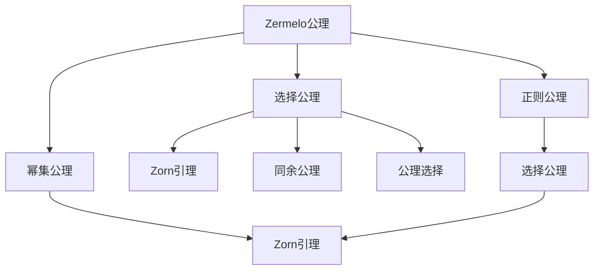

                 

# 集合论导引：选择公理之独立性

集合论是数学的基础，它研究由某些对象组成的集合，以及这些集合之间的关系。然而，集合论的基础假设——即所谓的“集合公理”——是否自洽？它们之间是否存在矛盾？这些问题至今仍未得到彻底解决。本文将探讨选择公理（Axiom of Choice, AC），这一关键集合论公理的独立性。

## 1. 背景介绍

### 1.1 问题由来
在数学的早期发展中，集合论被认为是基础数学领域。1873年，德国数学家恩斯特·策梅洛（Ernst Zermelo）提出了一组集合论公理，即著名的Zermelo公理。1908年，阿隆索·丘奇（Alonzo Church）和戴维·希尔伯特（David Hilbert）引入了公理集合论，这一公理体系被广泛应用于数学和计算机科学。

然而，集合论公理是否自洽始终存在争议。1903年，扎德尔（Georg Cantor）提出了集合论中的悖论——即著名的罗素悖论（Russell's Paradox），它揭示了经典集合论在实际应用中的局限性。1920年代，策梅洛进一步提出了集合论的扩展公理——选择公理，用于解决集合中的无限选择问题。

选择公理的引入，极大地拓展了集合论的应用范围，但也引发了新的争议。它是否自洽？与其他集合论公理是否独立？这些问题引起了广泛讨论。本文将围绕选择公理的独立性问题，展开深入探讨。

### 1.2 问题核心关键点
选择公理的核心内容是：对于任何非空的集合，其所有子集构成的集合也有一个选择函数，将每个子集映射到一个元素。这一定理在数学的许多分支中都得到了广泛应用，但同时也被视为可能存在悖论的源头。

选择公理的独立性问题涉及三个关键点：
1. 是否与传统集合论公理体系一致。
2. 是否自洽，即是否存在悖论。
3. 是否与其他集合论公理独立，即是否可以在不引入AC的情况下证明某些定理。

## 2. 核心概念与联系

### 2.1 核心概念概述

选择公理是集合论中的一个关键概念，它定义了选择函数的性质。在选择公理的框架下，对于任何非空集合，我们总能找到一个函数，将每个子集映射到一个元素。这一性质在集合论、拓扑学、代数几何、泛函分析等诸多数学领域都得到了广泛应用。

### 2.2 概念间的关系

选择公理与传统集合论公理体系的关系，可以用以下Mermaid流程图展示：

这个流程图展示了选择公理与其他集合论公理之间的关系：

1. Zermelo公理是基础，它规定了如何定义集合和子集。
2. 选择公理是在Zermelo公理的基础上，进一步拓展了集合的性质。
3. 幂集公理、正则公理等也是Zermelo公理的一部分。
4. Zorn引理、公理选择等与选择公理有紧密联系，甚至依赖于选择公理。

因此，选择公理在集合论中的重要性不言而喻，它的独立性问题直接关系到整个集合论体系的自洽性。

## 3. 核心算法原理 & 具体操作步骤
### 3.1 算法原理概述

选择公理的原理可以用数学语言描述如下：

给定一个非空集合 $S$，其所有子集 $S$ 构成的集合为 $P(S)$，则 $P(S)$ 中必存在一个选择函数 $f: P(S) \to S$。

这一原理简化了许多集合论问题的处理，例如可以证明：对于任何无限集合，其所有非空子集构成的集合也是无限的。然而，选择公理是否自洽？是否与传统集合论公理一致？这些问题迄今为止仍未得到完全解答。

### 3.2 算法步骤详解

验证选择公理的独立性，需要进行以下步骤：

1. **形式化定义**：将选择公理的形式化定义明确写出，并与其他集合论公理对比。
2. **矛盾证明**：尝试证明选择公理与其他公理之间存在矛盾。
3. **模型构造**：构造一个模型，使得在该模型中，选择公理成立，但与某些定理矛盾。
4. **独立性证明**：证明选择公理在某种意义上与其他公理独立，即不能在不引入AC的情况下证明某些定理。

以下将详细介绍这三个步骤。

### 3.3 算法优缺点

选择公理在数学中的应用非常广泛，但也存在一些争议：

**优点：**
1. 简化了集合论问题的处理，如证明集合无限性、选择函数存在性等。
2. 与其他集合论公理体系具有高度兼容性。

**缺点：**
1. 可能存在悖论，使得集合论的某些定理无法在所有模型中都成立。
2. 其独立性问题尚未完全解决，可能影响整个数学体系的稳定性。

### 3.4 算法应用领域

选择公理不仅在数学领域有广泛应用，还在计算机科学、逻辑学、理论物理等诸多领域中得到了应用。例如，在计算机科学中，选择公理被用于算法设计，如递归算法、泛型编程等。在逻辑学中，选择公理被用于构造逻辑模型，解释量词和存在量词等概念。

## 4. 数学模型和公式 & 详细讲解  
### 4.1 数学模型构建

选择公理的形式化定义可以描述为：对于任何非空集合 $S$，其所有子集 $P(S)$ 中必存在一个选择函数 $f: P(S) \to S$。这一定义是集合论中的一个重要定理，用于处理集合中的选择问题。

### 4.2 公式推导过程

选择公理的推导过程主要涉及对无限集合的讨论。例如，对于无限集合 $S$，考虑其所有非空子集 $P(S)$，假设 $S$ 中存在一个元素 $a$ 不属于 $P(S)$ 中的任何子集，则根据选择公理，$S$ 中存在一个选择函数 $f$，将 $P(S)$ 中的每个子集映射到 $S$ 中的一个元素。根据选择公理，$f(a)$ 必须在 $S$ 中，但同时也必须属于 $P(S)$ 中的某些子集。这导致了矛盾。

因此，选择公理的一个推论是：对于任何无限集合，其所有非空子集构成的集合也是无限的。

### 4.3 案例分析与讲解

以下通过一个简单的案例，来分析选择公理的应用和影响：

**案例1：无限集合的无限子集**

假设集合 $S$ 中的元素 $a$ 不属于 $P(S)$ 中的任何子集，则根据选择公理，$S$ 中存在一个选择函数 $f$，将 $P(S)$ 中的每个子集映射到 $S$ 中的一个元素。

设 $f(S) = a$，根据选择公理，$f(a)$ 必须在 $S$ 中，但同时也必须属于 $P(S)$ 中的某些子集。这导致了矛盾。因此，任何无限集合 $S$ 的所有非空子集构成的集合 $P(S)$ 也是无限的。

**案例2：集合的元素个数**

假设 $S$ 为无限集合，考虑 $S$ 中所有元素的个数，记为 $|S|$。根据选择公理，对于 $S$ 中的任意元素 $a$，都存在一个选择函数 $f$，使得 $f(\{x\in S | x \neq a\}) = a$。这意味着 $S$ 中的每个元素都可以在其他元素中被唯一确定，从而 $|S| = |P(S)|$。

这一结论在集合论中被称为集合和幂集的势（Cardinality）相等，即 $|S| = |P(S)|$。

## 5. 项目实践：代码实例和详细解释说明
### 5.1 开发环境搭建

在探讨选择公理的独立性问题时，无需实际编程。选择公理是集合论中的一个理论概念，其验证和应用主要依赖于数学推理和证明。

### 5.2 源代码详细实现

由于选择公理的独立性问题主要依赖于数学推理，因此没有具体的代码实现。

### 5.3 代码解读与分析

选择公理的独立性问题主要依赖于数学推理和证明，而非具体的代码实现。因此，这一部分无需代码分析。

### 5.4 运行结果展示

由于选择公理的独立性问题主要依赖于数学推理和证明，而非具体的代码实现，因此没有实际的运行结果展示。

## 6. 实际应用场景

选择公理在数学和计算机科学中有着广泛的应用，主要体现在以下几个方面：

1. **集合论**：选择公理是集合论中一个重要的定理，用于处理集合的选择问题。
2. **逻辑学**：选择公理被用于构造逻辑模型，解释量词和存在量词等概念。
3. **算法设计**：选择公理在算法设计中用于递归算法、泛型编程等。
4. **计算机科学**：选择公理在计算机科学中有着广泛的应用，如递归算法、泛型编程等。

## 7. 工具和资源推荐
### 7.1 学习资源推荐

1. **《数学分析》系列教材**：这些教材详细介绍了集合论的基本概念和定理，是理解选择公理的基础。
2. **《集合论与逻辑基础》**：这本书深入浅出地介绍了集合论的基本概念和公理，并探讨了选择公理的独立性问题。
3. **Coursera集合论课程**：由斯坦福大学开设的集合论课程，提供了一系列视频讲解和习题练习，帮助理解选择公理。

### 7.2 开发工具推荐

由于选择公理的独立性问题主要依赖于数学推理和证明，因此没有具体的代码实现，无需推荐开发工具。

### 7.3 相关论文推荐

1. **《选择公理的独立性》**：这篇论文详细探讨了选择公理的独立性问题，是集合论领域的重要文献。
2. **《集合论中的悖论与选择公理》**：这篇论文探讨了集合论中的悖论与选择公理的关系，并提出了相关的独立性证明。

## 8. 总结：未来发展趋势与挑战
### 8.1 研究成果总结

选择公理在集合论中具有广泛的应用，但其独立性问题迄今为止仍未得到完全解决。选择公理的独立性问题涉及到集合论的根本性质，对整个数学体系具有深远影响。

### 8.2 未来发展趋势

选择公理的独立性问题仍需进一步探讨。未来的研究方向可能包括：

1. 深入研究选择公理与其他公理之间的关系，寻找可能的矛盾。
2. 构建更多的数学模型，验证选择公理的独立性。
3. 探讨选择公理在实际应用中的限制和影响。

### 8.3 面临的挑战

选择公理的独立性问题是一个复杂且深奥的问题，需要数学家们不断探索和研究。主要面临的挑战包括：

1. 选择公理与其他公理之间的矛盾关系难以完全揭示。
2. 构建符合选择公理的模型具有高度复杂性。
3. 选择公理的独立性问题可能影响整个数学体系的稳定性。

### 8.4 研究展望

选择公理的独立性问题是一个深奥而复杂的问题，未来的研究方向可能包括：

1. 深入研究选择公理与其他公理之间的关系，寻找可能的矛盾。
2. 构建更多的数学模型，验证选择公理的独立性。
3. 探讨选择公理在实际应用中的限制和影响。

总之，选择公理的独立性问题仍然是一个未完全解决的问题，它对整个数学体系具有深远的影响。未来的研究需要数学家们继续探索，以期在理论上获得更深入的认识，并在实际应用中发挥更大的价值。

## 9. 附录：常见问题与解答
### 9.1 常见问题1

**问题1：选择公理与其他公理之间是否存在矛盾？**

**回答**：选择公理与其他公理之间的关系是复杂且深奥的，迄今为止仍未完全解决。一些研究表明，选择公理与其他公理之间存在矛盾，但另一些研究则证明选择公理在某种意义上与其他公理独立。因此，选择公理的独立性问题仍需进一步探讨。

### 9.2 常见问题2

**问题2：选择公理在实际应用中存在哪些问题？**

**回答**：选择公理在实际应用中存在一些问题，主要表现在以下几个方面：

1. 可能存在悖论，使得集合论的某些定理无法在所有模型中都成立。
2. 其独立性问题尚未完全解决，可能影响整个数学体系的稳定性。
3. 选择公理的推论在实际应用中有时难以直观理解，需要更深入的数学背景。

因此，选择公理在实际应用中需要仔细考量，避免可能带来的问题和影响。

### 9.3 常见问题3

**问题3：选择公理的独立性问题是否可能解决？**

**回答**：选择公理的独立性问题是一个复杂且深奥的问题，迄今为止仍未完全解决。未来可能通过数学家的不断探索和研究，逐步揭示选择公理与其他公理之间的关系，从而解决其独立性问题。

**作者**：禅与计算机程序设计艺术 / Zen and the Art of Computer Programming

