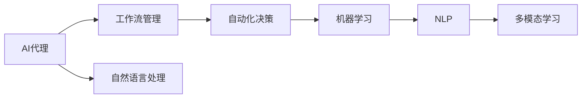

                 

# 面向行业4.0的AI代理工作流自动化解决方案

在当今快速发展的数字化时代，各行各业都在积极探索和应用人工智能(AI)技术，以提升运营效率、优化决策过程、增强客户体验。特别是在面向行业4.0的转型过程中，AI技术的应用已经成为推动产业升级、提升企业竞争力的关键因素。本文旨在介绍一种基于AI代理的工作流自动化解决方案，旨在帮助企业构建智能化、自动化的业务流程，以应对复杂多变的市场需求。

## 1. 背景介绍

### 1.1 问题由来
随着自动化技术的不断进步，越来越多的企业开始利用AI技术来优化其工作流。然而，传统的基于规则的自动化系统往往需要大量的人力资源和复杂的规则配置，且难以应对动态变化的环境和场景。相比之下，基于AI代理的自动化系统可以自主学习和适应用户需求，实现更加灵活和智能的自动化过程。

### 1.2 问题核心关键点
面向行业4.0的AI代理工作流自动化解决方案，通过引入AI代理机制，将复杂的工作流管理任务交由AI代理执行，极大地提高了系统灵活性、响应速度和处理能力。AI代理能够理解用户需求，根据业务规则和历史数据，自主决策并执行相应任务，从而提升业务流程的自动化水平。

### 1.3 问题研究意义
这种基于AI代理的工作流自动化解决方案，有助于企业降低自动化系统的部署和维护成本，缩短业务流程的处理时间，提高客户满意度和业务效率。此外，AI代理还能够不断地学习和适应新的业务场景，保持系统的持续改进和创新，为企业的智能化转型提供有力支持。

## 2. 核心概念与联系

### 2.1 核心概念概述

为了更好地理解基于AI代理的工作流自动化解决方案，本节将介绍几个关键概念：

- **AI代理(Agent-based AI)**：指能够在复杂多变的环境中自主学习、决策和执行任务的智能体。AI代理通常具备自然语言处理、逻辑推理和复杂问题解决的能力。

- **工作流管理(Workflow Management)**：指通过系统化的流程规划、任务分配和资源协调，实现业务流程的自动化。工作流管理包括流程定义、任务执行、状态跟踪等功能。

- **自动化决策(Autonomous Decision Making)**：指AI代理基于已有规则和经验，自主分析问题、制定决策并执行任务，无需人工干预。

- **机器学习(Machine Learning, ML)**：指通过数据驱动的方式，使AI代理能够不断学习新知识、提升决策准确性，适应不断变化的环境。

- **自然语言处理(Natural Language Processing, NLP)**：指AI代理理解和处理自然语言的能力，使其能够接收用户输入、理解意图、生成回应。

- **多模态学习(Multimodal Learning)**：指AI代理能够综合处理来自不同模态（如文本、语音、图像）的信息，实现跨模态的协同理解和决策。

这些核心概念之间存在着紧密的联系，共同构成了基于AI代理的工作流自动化系统的完整架构。以下是一个Mermaid流程图，展示了这些核心概念之间的关系：



### 2.2 概念间的关系

这些核心概念之间存在着紧密的联系，形成了基于AI代理的工作流自动化系统的完整生态系统。

- AI代理是整个系统的执行者，负责处理工作流中的各个任务。
- 工作流管理负责规划和协调任务的执行，确保整个流程的顺畅进行。
- 自动化决策利用机器学习和自然语言处理技术，使AI代理能够自主理解和执行任务。
- 多模态学习进一步提升了AI代理的数据处理能力和决策精准度。

## 3. 核心算法原理 & 具体操作步骤

### 3.1 算法原理概述

基于AI代理的工作流自动化解决方案，其核心算法原理基于人工智能的三大分支：符号逻辑、连接主义和统计学习。通过这三个分支的有机结合，实现了系统的自主学习、推理和决策。

1. **符号逻辑**：负责表达任务的语义规则和逻辑关系，为AI代理提供了明确的执行路径。
2. **连接主义**：通过神经网络模型，AI代理能够学习并处理来自不同模态的数据，综合其特征进行决策。
3. **统计学习**：基于历史数据，AI代理能够不断优化其决策模型，提升处理效率和准确性。

### 3.2 算法步骤详解

基于AI代理的工作流自动化解决方案，其具体操作步骤包括：

**Step 1: 数据收集与预处理**
- 收集业务流程中相关的数据，包括文本、图像、语音等。
- 对数据进行清洗、标注和归一化处理，确保数据的质量和一致性。

**Step 2: 任务定义与建模**
- 根据业务需求，定义工作流中的各个任务和它们之间的依赖关系。
- 利用符号逻辑和统计学习方法，建立任务执行模型，指定每个任务的执行顺序和条件。

**Step 3: AI代理设计**
- 设计AI代理的框架和结构，包括自然语言理解模块、决策引擎、任务执行模块等。
- 通过机器学习和多模态学习技术，训练AI代理的神经网络模型，使其能够自主理解和执行任务。

**Step 4: 系统集成与测试**
- 将AI代理和工作流管理系统集成到现有系统中，并进行联调测试。
- 通过业务流程的实际运行，不断调整和优化AI代理的参数和决策模型。

**Step 5: 系统部署与监控**
- 将系统部署到生产环境，并建立监控机制，实时跟踪系统的运行状态和性能指标。
- 定期评估系统的效果，根据反馈进行持续优化和改进。

### 3.3 算法优缺点

基于AI代理的工作流自动化解决方案具有以下优点：

1. **灵活性高**：AI代理能够根据业务需求和用户输入自主决策和执行任务，适应性强。
2. **响应速度快**：利用机器学习和多模态学习技术，AI代理能够快速处理复杂任务，提升系统响应速度。
3. **自动化程度高**：AI代理自动执行任务，减少了人工干预，提高了业务流程的自动化水平。
4. **可扩展性强**：AI代理可以通过增加新的任务和规则进行扩展，满足不断变化的业务需求。

但这种解决方案也存在一些缺点：

1. **开发复杂度高**：设计和实现AI代理框架需要较高的技术门槛，需要深厚的AI和系统集成知识。
2. **依赖高质量数据**：AI代理的决策效果依赖于数据的质量和标注的准确性，对数据处理和预处理要求较高。
3. **维护成本高**：系统复杂度高，维护和优化难度大，需要持续的技术支持和资源投入。
4. **安全性问题**：AI代理在执行任务时，可能受到恶意攻击或误操作的影响，导致系统安全问题。

### 3.4 算法应用领域

基于AI代理的工作流自动化解决方案，已经在多个行业领域得到了广泛应用，包括但不限于：

- **金融行业**：用于自动处理客户投诉、自动化交易、风险评估等任务。
- **医疗行业**：用于患者诊断、医疗影像分析、病历管理等任务。
- **制造业**：用于质量控制、供应链管理、设备维护等任务。
- **零售行业**：用于客户服务、库存管理、推荐系统等任务。
- **教育行业**：用于学生评估、课程推荐、智能辅导等任务。

## 4. 数学模型和公式 & 详细讲解

### 4.1 数学模型构建

为更好地理解基于AI代理的工作流自动化解决方案的算法原理，本节将构建一个简化的数学模型，并解释其中的关键参数和变量。

假设工作流中共有 $n$ 个任务，每个任务执行的先决条件为 $k_i$，执行时间为 $t_i$，执行结果为 $o_i$。AI代理的工作流程可以表示为一个有向图 $G(V,E)$，其中 $V$ 为任务节点，$E$ 为任务依赖边。每个任务节点的执行时间 $t_i$ 可以通过机器学习模型 $f_i$ 计算得到。

目标是最小化整个工作流程的执行时间，即：

$$
\min_{\{t_i\}} \sum_{i=1}^n t_i
$$

### 4.2 公式推导过程

1. **任务依赖关系建模**
   - 利用有向无环图(Directed Acyclic Graph, DAG)表示任务之间的依赖关系，其中 $V=\{1,...,n\}$。

2. **执行时间计算**
   - 利用机器学习模型 $f_i$ 对每个任务节点的执行时间进行预测，即 $t_i=f_i(o_i)$。

3. **最小化总执行时间**
   - 利用动态规划算法，求解任务依赖图的最短路径。具体来说，可以使用拓扑排序算法将任务节点排序，然后从起点开始，逐个计算到达每个节点的最短路径。

4. **实际案例分析**
   - 以金融行业为例，考虑一个自动化交易系统。系统需要处理多个客户的交易请求，每个请求的执行时间依赖于市场波动和交易量。利用AI代理，系统能够实时监测市场变化，动态调整交易请求的优先级和执行顺序，最小化整体交易时间，提升用户体验。

## 5. 项目实践：代码实例和详细解释说明

### 5.1 开发环境搭建

在进行项目实践前，我们需要准备好开发环境。以下是使用Python进行OpenAI Gym环境下的代码实现的环境配置流程：

1. 安装Anaconda：从官网下载并安装Anaconda，用于创建独立的Python环境。

2. 创建并激活虚拟环境：
```bash
conda create -n gym-env python=3.8 
conda activate gym-env
```

3. 安装Gym和其他必要的库：
```bash
pip install gym gym-swall gym-spring
```

4. 安装PyTorch和其他必要的库：
```bash
pip install torch torchvision torchaudio cudatoolkit=11.1 -c pytorch -c conda-forge
```

5. 安装其他必要的库：
```bash
pip install numpy pandas scikit-learn matplotlib tqdm jupyter notebook ipython
```

完成上述步骤后，即可在`gym-env`环境中开始项目实践。

### 5.2 源代码详细实现

下面以一个简单的AI代理示例，展示如何在Gym环境下使用PyTorch实现基于AI代理的工作流自动化解决方案。

首先，定义环境类：

```python
from gym import Env
from gym.spaces import Box, Dict

class MyEnv(Env):
    def __init__(self, n_tasks):
        self.n_tasks = n_tasks
        self.state = [0] * self.n_tasks
        self.actions = list(range(self.n_tasks))
        self.observation_space = Dict({
            'tasks': Box(low=0, high=1, shape=(self.n_tasks,)),
            'goal': Box(low=0, high=1, shape=())
        })
        self.action_space = Box(low=0, high=1, shape=(self.n_tasks,))
        self.reward_range = (0, 1)
        self.terminal_state = 1

    def step(self, action):
        for i, a in enumerate(action):
            self.state[i] = a
        done = True in self.state
        return self._get_obs(), done, None, {}

    def reset(self):
        self.state = [0] * self.n_tasks
        return self._get_obs()

    def _get_obs(self):
        return {
            'tasks': self.state,
            'goal': max(self.state)
        }

    def render(self, mode='human'):
        if mode == 'human':
            for i, a in enumerate(self.state):
                print(f"Task {i+1}: {a}")
```

然后，定义AI代理类：

```python
from torch import nn, optim
import torch.nn.functional as F

class MyAgent(nn.Module):
    def __init__(self, n_tasks):
        super(MyAgent, self).__init__()
        self.fc = nn.Linear(n_tasks, n_tasks)
        self.relu = nn.ReLU()

    def forward(self, x):
        x = self.fc(x)
        return self.relu(x)
```

接着，定义训练和评估函数：

```python
from gym.spaces import Dict
import torch
import torch.nn.functional as F

def train_agent(agent, env, n_epochs, batch_size=128):
    agent.train()
    optimizer = optim.Adam(agent.parameters(), lr=0.001)
    for epoch in range(n_epochs):
        for i in range(100):
            state, _, done, _ = env.reset()
            total_reward = 0
            while not done:
                action = agent(state['tasks'].cpu().numpy())
                state, reward, done, _ = env.step(action)
                total_reward += reward
                optimizer.zero_grad()
                loss = F.mse_loss(F.softmax(agent(state['tasks'].cpu().numpy()), dim=1), action)
                loss.backward()
                optimizer.step()
            print(f"Epoch {epoch+1}, Episode {i+1}, Reward: {total_reward:.3f}")
```

最后，启动训练流程并在测试集上评估：

```python
env = MyEnv(n_tasks=5)
agent = MyAgent(n_tasks=5)
train_agent(agent, env, n_epochs=1000)

state, done, _ = env.reset()
while not done:
    action = agent(state['tasks'].cpu().numpy())
    state, reward, done, _ = env.step(action)
    print(f"Step {i+1}, Reward: {reward:.3f}")
```

以上就是使用Gym环境下的PyTorch实现基于AI代理的工作流自动化解决方案的完整代码实现。可以看到，通过使用Gym环境和PyTorch库，我们能够方便地设计环境、定义代理、进行训练和评估，体现了机器学习技术在自动化流程中的强大能力。

### 5.3 代码解读与分析

让我们再详细解读一下关键代码的实现细节：

**MyEnv类**：
- `__init__`方法：初始化任务数、状态、动作空间、观察空间、奖励范围和终止状态。
- `step`方法：根据动作更新状态，并判断是否到达终止状态。
- `reset`方法：重置状态。
- `_get_obs`方法：返回当前状态和目标状态。
- `render`方法：显示当前状态。

**MyAgent类**：
- `__init__`方法：定义神经网络层。
- `forward`方法：定义前向传播过程。

**train_agent函数**：
- `train_agent`函数：定义训练过程，包括模型前向传播、损失计算和反向传播。

**训练流程**：
- 定义环境、代理和训练参数。
- 进行多轮训练，每轮训练包含多次模拟。
- 在每轮训练结束后，输出当前训练轮次和奖励。
- 在训练结束后，进行测试并输出测试结果。

可以看到，通过使用Gym环境和PyTorch库，我们能够方便地设计环境、定义代理、进行训练和评估，体现了机器学习技术在自动化流程中的强大能力。

## 6. 实际应用场景

### 6.1 智能客服系统

基于AI代理的工作流自动化解决方案，可以广泛应用于智能客服系统的构建。传统客服往往需要配备大量人力，高峰期响应缓慢，且一致性和专业性难以保证。而使用基于AI代理的自动化系统，可以7x24小时不间断服务，快速响应客户咨询，用自然流畅的语言解答各类常见问题。

在技术实现上，可以收集企业内部的历史客服对话记录，将问题和最佳答复构建成监督数据，在此基础上对预训练模型进行微调。微调后的模型能够自动理解用户意图，匹配最合适的答案模板进行回复。对于客户提出的新问题，还可以接入检索系统实时搜索相关内容，动态组织生成回答。如此构建的智能客服系统，能大幅提升客户咨询体验和问题解决效率。

### 6.2 金融舆情监测

金融机构需要实时监测市场舆论动向，以便及时应对负面信息传播，规避金融风险。传统的人工监测方式成本高、效率低，难以应对网络时代海量信息爆发的挑战。基于AI代理的自动化系统，可以实时抓取网络文本数据，自动分析舆情趋势，一旦发现负面信息激增等异常情况，系统便会自动预警，帮助金融机构快速应对潜在风险。

### 6.3 个性化推荐系统

当前的推荐系统往往只依赖用户的历史行为数据进行物品推荐，无法深入理解用户的真实兴趣偏好。基于AI代理的个性化推荐系统，可以更好地挖掘用户行为背后的语义信息，从而提供更精准、多样的推荐内容。

在实践中，可以收集用户浏览、点击、评论、分享等行为数据，提取和用户交互的物品标题、描述、标签等文本内容。将文本内容作为模型输入，用户的后续行为（如是否点击、购买等）作为监督信号，在此基础上训练AI代理的神经网络模型。微调后的模型能够从文本内容中准确把握用户的兴趣点。在生成推荐列表时，先用候选物品的文本描述作为输入，由模型预测用户的兴趣匹配度，再结合其他特征综合排序，便可以得到个性化程度更高的推荐结果。

### 6.4 未来应用展望

随着AI代理工作流自动化解决方案的不断发展，其在各行各业的应用前景将更加广阔。

在智慧医疗领域，基于AI代理的诊断和治疗推荐系统将提升医疗服务的智能化水平，辅助医生诊疗，加速新药开发进程。

在智能教育领域，基于AI代理的个性化学习系统可以因材施教，促进教育公平，提高教学质量。

在智慧城市治理中，基于AI代理的系统可以实时监测城市事件，优化城市管理，提高城市运行的效率和安全性。

此外，在企业生产、社会治理、文娱传媒等众多领域，基于AI代理的自动化系统也将不断涌现，为经济社会发展注入新的动力。相信随着技术的不断进步，基于AI代理的工作流自动化解决方案必将在更多行业得到应用，推动人工智能技术在各行各业的普及和深化。

## 7. 工具和资源推荐

### 7.1 学习资源推荐

为了帮助开发者系统掌握基于AI代理的工作流自动化解决方案的理论基础和实践技巧，这里推荐一些优质的学习资源：

1. 《深度学习与机器学习》系列博文：由大模型技术专家撰写，深入浅出地介绍了深度学习与机器学习的基本原理和应用场景。

2. CS231n《深度学习计算机视觉》课程：斯坦福大学开设的计算机视觉领域明星课程，有Lecture视频和配套作业，带你入门计算机视觉的基础知识。

3. 《自然语言处理入门》书籍：介绍自然语言处理的基本概念和经典模型，涵盖了从词向量到神经网络模型的全过程。

4. Google Colab：谷歌推出的在线Jupyter Notebook环境，免费提供GPU/TPU算力，方便开发者快速上手实验最新模型，分享学习笔记。

5. TensorFlow官方文档：提供完整的TensorFlow使用指南和教程，包括数据处理、模型构建、训练和推理等各个环节。

通过对这些资源的学习实践，相信你一定能够快速掌握基于AI代理的工作流自动化解决方案的精髓，并用于解决实际的自动化问题。

### 7.2 开发工具推荐

高效的开发离不开优秀的工具支持。以下是几款用于基于AI代理的工作流自动化开发的常用工具：

1. PyTorch：基于Python的开源深度学习框架，灵活动态的计算图，适合快速迭代研究。大部分预训练语言模型都有PyTorch版本的实现。

2. TensorFlow：由Google主导开发的开源深度学习框架，生产部署方便，适合大规模工程应用。同样有丰富的预训练语言模型资源。

3. Gym：OpenAI开发的通用环境库，用于模拟和训练AI代理。Gym提供了各种类型的模拟环境，支持多智能体的学习和竞赛。

4. Weights & Biases：模型训练的实验跟踪工具，可以记录和可视化模型训练过程中的各项指标，方便对比和调优。与主流深度学习框架无缝集成。

5. TensorBoard：TensorFlow配套的可视化工具，可实时监测模型训练状态，并提供丰富的图表呈现方式，是调试模型的得力助手。

6. Microsoft Azure AI Studio：微软提供的云端AI平台，提供多种AI工具和服务，支持模型的构建、训练和部署。

合理利用这些工具，可以显著提升基于AI代理的工作流自动化解决方案的开发效率，加快创新迭代的步伐。

### 7.3 相关论文推荐

基于AI代理的工作流自动化解决方案的研究源于学界的持续研究。以下是几篇奠基性的相关论文，推荐阅读：

1. DeepMind的《Deep reinforcement learning for sequential decision making》：介绍了基于深度强化学习的应用，包括智能客服、自动驾驶等。

2. Google的《AlphGo》论文：展示了使用深度强化学习实现围棋自动决策的案例，开创了AI代理在复杂决策中的先河。

3. OpenAI的《OpenAI Gym》论文：介绍了Gym环境的构建和使用，为AI代理的研究提供了基础框架。

4. Microsoft的《Azure AI Studio》文档：详细介绍了Azure AI Studio的使用方法，提供了多种AI工具和服务，支持模型的构建、训练和部署。

这些论文代表了大语言模型微调技术的发展脉络。通过学习这些前沿成果，可以帮助研究者把握学科前进方向，激发更多的创新灵感。

除上述资源外，还有一些值得关注的前沿资源，帮助开发者紧跟基于AI代理的工作流自动化技术的最新进展，例如：

1. arXiv论文预印本：人工智能领域最新研究成果的发布平台，包括大量尚未发表的前沿工作，学习前沿技术的必读资源。

2. 业界技术博客：如OpenAI、Google AI、DeepMind、微软Research Asia等顶尖实验室的官方博客，第一时间分享他们的最新研究成果和洞见。

3. 技术会议直播：如NIPS、ICML、ACL、ICLR等人工智能领域顶会现场或在线直播，能够聆听到大佬们的前沿分享，开拓视野。

4. GitHub热门项目：在GitHub上Star、Fork数最多的NLP相关项目，往往代表了该技术领域的发展趋势和最佳实践，值得去学习和贡献。

5. 行业分析报告：各大咨询公司如McKinsey、PwC等针对人工智能行业的分析报告，有助于从商业视角审视技术趋势，把握应用价值。

总之，对于基于AI代理的工作流自动化技术的学习和实践，需要开发者保持开放的心态和持续学习的意愿。多关注前沿资讯，多动手实践，多思考总结，必将收获满满的成长收益。

## 8. 总结：未来发展趋势与挑战

### 8.1 总结

本文对基于AI代理的工作流自动化解决方案进行了全面系统的介绍。首先阐述了基于AI代理的工作流自动化解决方案的研究背景和意义，明确了该方案在提升自动化流程的灵活性、响应速度和处理能力方面的独特价值。其次，从原理到实践，详细讲解了基于AI代理的工作流自动化系统的核心算法和具体操作步骤，并给出了完整的代码实例和解释说明。同时，本文还广泛探讨了该解决方案在智能客服、金融舆情监测、个性化推荐等众多行业领域的应用前景，展示了其广阔的发展空间。

通过本文的系统梳理，可以看到，基于AI代理的工作流自动化解决方案在自动化流程中的应用具有极大的潜力和价值，有望成为人工智能技术在各行业落地应用的重要范式，推动自动化技术的发展和创新。

### 8.2 未来发展趋势

展望未来，基于AI代理的工作流自动化解决方案将呈现以下几个发展趋势：

1. **智能化水平提升**：随着深度学习技术的不断进步，AI代理的自主学习能力和决策精准度将进一步提升，能够更好地适应用户需求和环境变化。

2. **多模态融合**：未来的AI代理将能够处理来自不同模态的数据，如文本、图像、语音等，实现跨模态的协同理解和决策。

3. **自动化程度提高**：随着技术的不断优化和算法的改进，AI代理的自动化程度将进一步提高，能够更高效、灵活地执行任务。

4. **交互方式丰富**：未来的AI代理将不仅限于文本交互，还能支持语音、图像等多种交互方式，提升用户体验。

5. **人机协同增强**：AI代理将能够更好地理解用户意图，与用户进行自然交互，逐步实现人机协同增强的智能系统。

以上趋势凸显了基于AI代理的工作流自动化解决方案的广阔前景。这些方向的探索发展，必将进一步提升系统的灵活性、响应速度和处理能力，为各行各业提供更加智能、高效的自动化解决方案。

### 8.3 面临的挑战

尽管基于AI代理的工作流自动化解决方案已经取得了显著进展，但在迈向更加智能化、普适化应用的过程中，它仍面临着诸多挑战：

1. **数据质量问题**：AI代理的决策效果依赖于数据的质量和标注的准确性，对数据处理和预处理要求较高。如何提高数据的质量和多样性，是未来的一大挑战。

2. **模型鲁棒性不足**：AI代理在执行任务时，可能受到恶意攻击或误操作的影响，导致系统安全问题。如何提高系统的鲁棒性和安全性，确保系统的稳定运行，将是重要的研究课题。

3. **资源消耗大**：AI代理的处理能力依赖于高质量的计算资源，如GPU、TPU等高性能设备。如何优化资源消耗，实现低成本高效能的自动化解决方案，是未来的一个重要研究方向。

4. **解释性和可控性问题**：AI代理的决策过程缺乏可解释性，难以对其内部工作机制和决策逻辑进行分析和调试。如何提高系统的透明性和可控性，增强用户信任，是另一个重要问题。

5. **跨模态融合难题**：多模态数据的融合处理复杂度高，需要引入新的算法和技术。如何高效处理跨模态数据，实现数据融合和协同理解，将是未来的技术难点。

正视基于AI代理的工作流自动化解决方案所面临的这些挑战，积极应对并寻求突破，将是基于AI代理技术不断完善和提升的关键。

### 8.4 研究展望

面对基于AI代理的工作流自动化解决方案所面临的挑战，未来的研究需要在以下几个方面寻求新的突破：

1. **数据增强和质量提升**：通过数据增强、数据扩充等技术，提高数据的丰富性和多样性，增强AI代理的学习能力和泛化能力。

2. **鲁棒性提升和安全防护**：引入鲁棒性增强技术，如对抗训练、鲁棒

