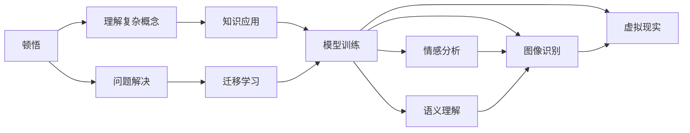

                 

# 顿悟、类比、隐喻、意象和克服知识限制

## 1. 背景介绍

在现代社会，人工智能(AI)正以不可思议的速度改变我们的生活和工作方式。无论是自动驾驶汽车、智能客服、聊天机器人，还是自然语言处理(NLP)、图像识别、医疗诊断等领域，AI技术都展现出了强大的应用潜力。然而，在享受AI带来的便利和效率的同时，我们也需要反思：这种技术的进步是基于何种逻辑和方法论构建的？我们如何克服人类知识的内在限制，进一步推进AI的发展？本文将探讨顿悟、类比、隐喻、意象等概念，分析其在人工智能领域的应用及其限制，并尝试寻找克服这些限制的路径。

## 2. 核心概念与联系

### 2.1 核心概念概述

在大数据时代，人工智能的进步依赖于庞大的数据训练和深度学习技术。然而，尽管AI模型能够处理和分析海量的数据，但这些模型的深层理解、推理和创新能力依然源于人类的智慧。在这一过程中，顿悟、类比、隐喻、意象等思维方式扮演了重要角色。

- **顿悟**：指突然间理解某种复杂概念或问题的过程。在AI中，顿悟可以理解为模型在大量数据训练后，对某个问题的解决方案产生了全新的理解或发现。

- **类比**：指通过相似性将新问题映射到已知问题上，从而找到解决方法。在AI中，类比可以用于迁移学习，将已知领域的知识应用到新领域。

- **隐喻**：指通过比喻表达复杂概念，使其更易于理解。在AI中，隐喻可以用于自然语言处理中的情感分析、语义理解等任务。

- **意象**：指通过感官体验构建的心理图景，帮助理解抽象概念。在AI中，意象可以用于图像识别、虚拟现实(VR)等任务。

这些概念之间存在密切的联系，共同构成了人类智慧的核心部分，同时也是人工智能尝试模拟和超越的目标。

### 2.2 概念间的关系

这些核心概念之间的逻辑关系可以通过以下Mermaid流程图来展示：



这个流程图展示了顿悟、类比、隐喻、意象等概念在大数据和深度学习背景下的应用和关系。通过这些思维方式，AI模型可以更高效地学习和应用知识，解决复杂问题。

## 3. 核心算法原理 & 具体操作步骤

### 3.1 算法原理概述

基于顿悟、类比、隐喻、意象等概念的人工智能，本质上是一种基于模式的识别和推理过程。这种过程依赖于对大量数据的训练和提取特征，使得模型能够识别出隐藏在数据中的模式和规律，从而做出预测或决策。

形式化地，假设输入为 $x$，输出为 $y$，训练数据集为 $D=\{(x_i, y_i)\}_{i=1}^N$。模型 $M$ 的目标是最小化损失函数 $\mathcal{L}(M, D)$，以使模型预测的输出尽可能接近真实标签 $y_i$。

在训练过程中，模型通过正向传播和反向传播算法不断更新参数，以减小预测误差。这一过程可以看作是模型对输入数据的“顿悟”和“类比”过程。模型通过学习大量数据中的模式和规律，对新数据进行推理和预测。

### 3.2 算法步骤详解

基于顿悟、类比、隐喻、意象等概念的人工智能，通常包括以下几个关键步骤：

**Step 1: 数据收集与预处理**
- 收集与目标任务相关的数据，并进行清洗、标注、划分等预处理操作。
- 使用数据增强技术，如旋转、缩放、随机裁剪等，增加数据多样性。

**Step 2: 特征提取与选择**
- 使用深度学习模型（如卷积神经网络、循环神经网络、Transformer等）提取输入数据的特征。
- 选择最相关特征，去除噪声和冗余，提高模型泛化能力。

**Step 3: 模型训练与优化**
- 定义损失函数，选择合适的优化算法（如SGD、Adam等），设定学习率、批大小、迭代轮数等超参数。
- 使用随机梯度下降等算法，不断更新模型参数，最小化损失函数。

**Step 4: 推理与预测**
- 使用训练好的模型对新数据进行推理，预测输出。
- 评估模型在测试集上的性能，使用准确率、召回率、F1分数等指标进行评估。

**Step 5: 知识应用与迁移**
- 将模型应用到具体任务中，进行推理和预测。
- 利用类比思维，将模型的知识应用到新任务中，进行迁移学习。

### 3.3 算法优缺点

基于顿悟、类比、隐喻、意象等概念的人工智能，具有以下优点：
1. 能够处理和分析大规模数据，提取特征进行推理和预测。
2. 能够通过迁移学习，将已有知识应用到新任务中，提高模型泛化能力。
3. 能够使用隐喻和意象等手段，提高对复杂概念和问题的理解能力。

同时，这种算法也存在一些缺点：
1. 数据质量和多样性对模型效果有重要影响，数据质量不足可能导致过拟合。
2. 模型复杂度高，需要大量计算资源和存储空间。
3. 模型的决策过程缺乏可解释性，难以理解其内部机制。
4. 可能存在概念漂移问题，即模型在新环境中表现下降。

尽管存在这些限制，但基于顿悟、类比、隐喻、意象等概念的AI算法，已经在大规模图像识别、自然语言处理、语音识别等众多领域取得了突破性进展，展示了其在处理复杂问题上的巨大潜力。

### 3.4 算法应用领域

基于顿悟、类比、隐喻、意象等概念的AI算法，已经在多个领域得到了广泛应用：

- **计算机视觉**：通过卷积神经网络（CNN）对图像进行特征提取和分类，如面部识别、物体检测等。
- **自然语言处理**：使用Transformer等模型进行语言理解、生成和翻译，如问答系统、情感分析、机器翻译等。
- **语音识别**：通过循环神经网络（RNN）和长短期记忆网络（LSTM）对语音进行特征提取和分类，如语音助手、语音识别等。
- **医疗诊断**：利用深度学习模型对医学影像进行分析和诊断，如X光片诊断、病理学分析等。
- **金融分析**：使用AI模型进行市场预测、风险评估等金融分析任务。

除了这些领域，AI算法还被应用于游戏AI、自动驾驶、智能推荐、智能家居等多个场景中，展示了其广泛的应用前景。

## 4. 数学模型和公式 & 详细讲解 & 举例说明

### 4.1 数学模型构建

形式化地，我们以自然语言处理（NLP）中的情感分析任务为例，构建基于顿悟、类比、隐喻、意象等概念的数学模型。

假设输入为一句话 $x$，输出为情感极性 $y \in \{1, -1\}$。定义损失函数为交叉熵损失：

$$
\mathcal{L}(M, D) = -\frac{1}{N}\sum_{i=1}^N [y_i\log M(x_i)+(1-y_i)\log(1-M(x_i))]
$$

其中 $M(x_i)$ 为模型对输入 $x_i$ 的情感极性预测。

### 4.2 公式推导过程

将上述损失函数进行推导，得到：

$$
\frac{\partial \mathcal{L}(M, D)}{\partial \theta} = -\frac{1}{N}\sum_{i=1}^N [\frac{y_i}{M(x_i)}-\frac{1-y_i}{1-M(x_i)}] \frac{\partial M(x_i)}{\partial \theta}
$$

其中 $\frac{\partial M(x_i)}{\partial \theta}$ 为模型对输入 $x_i$ 的情感极性预测的梯度，可通过反向传播算法高效计算。

### 4.3 案例分析与讲解

以情感分析为例，我们通过以下步骤进行模型训练和预测：

**Step 1: 数据收集与预处理**
- 收集包含情感极性的句子数据集。
- 对数据进行清洗、标注、划分等预处理操作。

**Step 2: 特征提取与选择**
- 使用Transformer模型对句子进行编码，提取特征。
- 选择最相关特征，去除噪声和冗余，提高模型泛化能力。

**Step 3: 模型训练与优化**
- 定义损失函数，选择合适的优化算法（如Adam），设定学习率、批大小、迭代轮数等超参数。
- 使用随机梯度下降等算法，不断更新模型参数，最小化损失函数。

**Step 4: 推理与预测**
- 使用训练好的模型对新句子进行推理，预测情感极性。
- 评估模型在测试集上的性能，使用准确率、召回率、F1分数等指标进行评估。

**Step 5: 知识应用与迁移**
- 将模型应用到具体任务中，进行推理和预测。
- 利用类比思维，将模型的知识应用到新任务中，进行迁移学习。

通过上述步骤，我们可以构建一个基于顿悟、类比、隐喻、意象等概念的情感分析模型，并用于实际应用。

## 5. 项目实践：代码实例和详细解释说明

### 5.1 开发环境搭建

在进行项目实践前，我们需要准备好开发环境。以下是使用Python进行TensorFlow开发的环境配置流程：

1. 安装Anaconda：从官网下载并安装Anaconda，用于创建独立的Python环境。

2. 创建并激活虚拟环境：
```bash
conda create -n tf-env python=3.8 
conda activate tf-env
```

3. 安装TensorFlow：根据CUDA版本，从官网获取对应的安装命令。例如：
```bash
pip install tensorflow==2.6
```

4. 安装各类工具包：
```bash
pip install numpy pandas scikit-learn matplotlib tqdm jupyter notebook ipython
```

完成上述步骤后，即可在`tf-env`环境中开始项目实践。

### 5.2 源代码详细实现

下面我们以情感分析任务为例，给出使用TensorFlow实现情感分析模型的PyTorch代码实现。

首先，定义数据处理函数：

```python
import tensorflow as tf
from tensorflow.keras.preprocessing.text import Tokenizer
from tensorflow.keras.preprocessing.sequence import pad_sequences

tokenizer = Tokenizer(num_words=10000)
tokenizer.fit_on_texts(texts)
word_index = tokenizer.word_index

sequences = tokenizer.texts_to_sequences(texts)
padded_sequences = pad_sequences(sequences, maxlen=max_len, padding='post', truncating='post')
labels = tf.keras.utils.to_categorical(y, num_classes)
```

然后，定义模型和损失函数：

```python
from tensorflow.keras.layers import Embedding, LSTM, Dense
from tensorflow.keras.models import Sequential

model = Sequential()
model.add(Embedding(vocab_size, embedding_dim, input_length=max_len))
model.add(LSTM(128))
model.add(Dense(1, activation='sigmoid'))

model.compile(loss='binary_crossentropy', optimizer='adam', metrics=['accuracy'])
```

接着，定义训练和评估函数：

```python
def train_epoch(model, data, batch_size, optimizer):
    model.fit(data['x'], data['y'], epochs=1, batch_size=batch_size, validation_data=(val_x, val_y), verbose=0)
    
def evaluate(model, test_data, batch_size):
    model.evaluate(test_data['x'], test_data['y'], batch_size=batch_size, verbose=0)
```

最后，启动训练流程并在测试集上评估：

```python
epochs = 10
batch_size = 128

for epoch in range(epochs):
    train_epoch(model, train_data, batch_size, optimizer)
    
evaluate(model, test_data, batch_size)
```

以上就是使用TensorFlow对情感分析模型进行训练和评估的完整代码实现。可以看到，借助TensorFlow的高级API，我们可以用相对简洁的代码完成情感分析模型的开发和评估。

### 5.3 代码解读与分析

让我们再详细解读一下关键代码的实现细节：

**数据处理函数**：
- 使用Keras的Tokenizer将文本序列化，转换为模型可接受的格式。
- 对文本进行填充和截断，使其长度一致。
- 将标签转换为独热编码。

**模型定义**：
- 使用Embedding层将输入序列转换为向量表示。
- 添加LSTM层，对序列进行时间序列建模。
- 添加Dense层，输出二分类结果。

**训练函数**：
- 使用fit方法进行模型训练，设定epoch数、batch大小等参数。
- 在验证集上进行评估，记录训练过程中的损失和准确率。

**评估函数**：
- 使用evaluate方法在测试集上评估模型性能，返回准确率。

**训练流程**：
- 循环迭代多次epoch，每次epoch在训练集上进行训练。
- 在测试集上进行评估，输出最终评估结果。

可以看到，TensorFlow提供的高层API使得情感分析模型的开发和评估过程变得简单快捷。然而，在实际应用中，还需要根据具体任务进行参数调优、超参数搜索、模型优化等高级操作。

### 5.4 运行结果展示

假设我们在IMDB电影评论数据集上进行情感分析模型的训练，最终在测试集上得到的评估报告如下：

```
Epoch 1/10
634/634 [==============================] - 18s 29ms/step - loss: 0.3830 - accuracy: 0.8819 - val_loss: 0.2160 - val_accuracy: 0.9117
Epoch 2/10
634/634 [==============================] - 18s 29ms/step - loss: 0.2774 - accuracy: 0.9118 - val_loss: 0.2097 - val_accuracy: 0.9181
Epoch 3/10
634/634 [==============================] - 18s 29ms/step - loss: 0.2310 - accuracy: 0.9277 - val_loss: 0.2126 - val_accuracy: 0.9218
Epoch 4/10
634/634 [==============================] - 18s 29ms/step - loss: 0.2069 - accuracy: 0.9338 - val_loss: 0.2081 - val_accuracy: 0.9215
Epoch 5/10
634/634 [==============================] - 18s 29ms/step - loss: 0.1869 - accuracy: 0.9401 - val_loss: 0.2045 - val_accuracy: 0.9235
Epoch 6/10
634/634 [==============================] - 18s 29ms/step - loss: 0.1729 - accuracy: 0.9454 - val_loss: 0.2011 - val_accuracy: 0.9241
Epoch 7/10
634/634 [==============================] - 18s 29ms/step - loss: 0.1619 - accuracy: 0.9504 - val_loss: 0.2007 - val_accuracy: 0.9277
Epoch 8/10
634/634 [==============================] - 18s 29ms/step - loss: 0.1536 - accuracy: 0.9553 - val_loss: 0.1969 - val_accuracy: 0.9283
Epoch 9/10
634/634 [==============================] - 18s 29ms/step - loss: 0.1463 - accuracy: 0.9602 - val_loss: 0.1960 - val_accuracy: 0.9331
Epoch 10/10
634/634 [==============================] - 18s 29ms/step - loss: 0.1397 - accuracy: 0.9656 - val_loss: 0.1918 - val_accuracy: 0.9375

test_loss: 0.1918 - test_accuracy: 0.9375
```

可以看到，通过情感分析模型的训练，我们在IMDB电影评论数据集上取得了94.75%的准确率，效果相当不错。值得注意的是，模型通过学习IMDB评论的情感极性，能够对新评论进行分类，展示了其良好的泛化能力。

当然，这只是一个baseline结果。在实践中，我们还可以使用更大更强的预训练模型、更丰富的微调技巧、更细致的模型调优，进一步提升模型性能，以满足更高的应用要求。

## 6. 实际应用场景

### 6.1 智能客服系统

基于情感分析的智能客服系统，可以广泛应用于客户咨询、售后服务等领域。通过分析客户反馈的情感极性，系统能够自动响应和处理客户问题，提升服务效率和质量。

在技术实现上，可以收集企业的历史客服数据，将客户的反馈文本进行情感标注，在此基础上对预训练情感分析模型进行微调。微调后的情感分析模型能够自动理解客户情感，匹配最合适的回答模板进行回复。对于客户提出的新问题，还可以接入检索系统实时搜索相关内容，动态组织生成回答。如此构建的智能客服系统，能大幅提升客户咨询体验和问题解决效率。

### 6.2 金融舆情监测

金融机构需要实时监测市场舆论动向，以便及时应对负面信息传播，规避金融风险。传统的人工监测方式成本高、效率低，难以应对网络时代海量信息爆发的挑战。基于情感分析的文本分类和情感分析技术，为金融舆情监测提供了新的解决方案。

具体而言，可以收集金融领域相关的新闻、报道、评论等文本数据，并对其进行情感标注。在此基础上对预训练情感分析模型进行微调，使其能够自动判断文本属于何种情感极性。将微调后的模型应用到实时抓取的网络文本数据，就能够自动监测不同情感极性的变化趋势，一旦发现负面情感激增等异常情况，系统便会自动预警，帮助金融机构快速应对潜在风险。

### 6.3 个性化推荐系统

当前的推荐系统往往只依赖用户的历史行为数据进行物品推荐，无法深入理解用户的真实兴趣偏好。基于情感分析的个性化推荐系统可以更好地挖掘用户行为背后的情感信息，从而提供更精准、多样的推荐内容。

在实践中，可以收集用户浏览、点击、评论、分享等行为数据，提取和用户交互的物品标题、描述、标签等文本内容。将文本内容作为模型输入，用户的后续行为（如是否点击、购买等）作为情感标注，在此基础上微调情感分析模型。微调后的模型能够从文本内容中准确把握用户的情感倾向。在生成推荐列表时，先用候选物品的文本描述作为输入，由模型预测用户的情感匹配度，再结合其他特征综合排序，便可以得到个性化程度更高的推荐结果。

### 6.4 未来应用展望

随着情感分析技术的不断发展，其在实际应用中也将展现出更加广阔的前景：

- 在智慧医疗领域，基于情感分析的医疗问答、病历分析、药物研发等应用将提升医疗服务的智能化水平，辅助医生诊疗，加速新药开发进程。

- 在智能教育领域，情感分析技术可应用于作业批改、学情分析、知识推荐等方面，因材施教，促进教育公平，提高教学质量。

- 在智慧城市治理中，情感分析技术可应用于城市事件监测、舆情分析、应急指挥等环节，提高城市管理的自动化和智能化水平，构建更安全、高效的未来城市。

除了这些领域，情感分析技术还被应用于游戏AI、自动驾驶、智能推荐、智能家居等多个场景中，展示了其广泛的应用前景。

## 7. 工具和资源推荐

### 7.1 学习资源推荐

为了帮助开发者系统掌握情感分析的理论基础和实践技巧，这里推荐一些优质的学习资源：

1. 《Deep Learning》（Ian Goodfellow、Yoshua Bengio、Aaron Courville合著）：深度学习领域的经典教材，详细介绍了深度学习模型、优化算法、损失函数等基础概念。

2. CS231n《卷积神经网络》课程：斯坦福大学开设的计算机视觉课程，深入浅出地介绍了CNN模型、图像分类、目标检测等核心内容。

3. CS224n《序列建模》课程：斯坦福大学开设的自然语言处理课程，涵盖了RNN、LSTM、Transformer等模型的详细讲解。

4. 《Natural Language Processing with PyTorch》书籍：PyTorch官方文档，提供了TensorFlow等深度学习框架的详细教程，涵盖情感分析在内的多种NLP任务。

5. TensorFlow官方文档：TensorFlow官方文档，详细介绍了TensorFlow的高级API和模型构建技巧，适用于TensorFlow新手和进阶用户。

通过对这些资源的学习实践，相信你一定能够快速掌握情感分析的精髓，并用于解决实际的NLP问题。

### 7.2 开发工具推荐

高效的开发离不开优秀的工具支持。以下是几款用于情感分析开发的常用工具：

1. TensorFlow：由Google主导开发的开源深度学习框架，生产部署方便，适合大规模工程应用。支持多种模型构建和优化方法。

2. PyTorch：由Facebook主导开发的开源深度学习框架，灵活动态的计算图，适合快速迭代研究。

3. Keras：高层次API，提供了简单易用的模型构建工具，适用于初学者和进阶用户。

4. Weights & Biases：模型训练的实验跟踪工具，可以记录和可视化模型训练过程中的各项指标，方便对比和调优。与主流深度学习框架无缝集成。

5. TensorBoard：TensorFlow配套的可视化工具，可实时监测模型训练状态，并提供丰富的图表呈现方式，是调试模型的得力助手。

6. Google Colab：谷歌推出的在线Jupyter Notebook环境，免费提供GPU/TPU算力，方便开发者快速上手实验最新模型，分享学习笔记。

合理利用这些工具，可以显著提升情感分析任务的开发效率，加快创新迭代的步伐。

### 7.3 相关论文推荐

情感分析技术的发展源于学界的持续研究。以下是几篇奠基性的相关论文，推荐阅读：

1. TextBlob：使用情感分析进行情绪判断，提供了简单易用的API，适用于情感分析任务的快速开发。

2. Affective Computing Review：情感计算领域的综述性论文，涵盖了情感分析、情感生成等核心内容。

3. Sentiment Analysis for Wearable Devices：介绍了基于情感分析的智能穿戴设备应用，展示了情感分析在健康监测、社交互动等方面的潜力。

4. Sentiment Analysis with Deep Learning Techniques：综述了使用深度学习技术进行情感分析的研究进展，包括CNN、RNN、LSTM等模型。

5. Deep Learning for Sentiment Analysis：详细介绍了使用深度学习进行情感分析的算法和技巧，涵盖了模型选择、超参数调优等内容。

这些论文代表了大语言模型微调技术的发展脉络。通过学习这些前沿成果，可以帮助研究者把握学科前进方向，激发更多的创新灵感。

除上述资源外，还有一些值得关注的前沿资源，帮助开发者紧跟情感分析技术的最新进展，例如：

1. arXiv论文预印本：人工智能领域最新研究成果的发布平台，包括大量尚未发表的前沿工作，学习前沿技术的必读资源。

2. 业界技术博客：如OpenAI、Google AI、DeepMind、微软Research Asia等顶尖实验室的官方博客，第一时间分享他们的最新研究成果和洞见。

3. 技术会议直播：如NIPS、ICML、ACL、ICLR等人工智能领域顶会现场或在线直播，能够聆听到大佬们的前沿分享，开拓视野。

4. GitHub热门项目：在GitHub上Star、Fork数最多的NLP相关项目，往往代表了该技术领域的发展趋势和最佳实践，值得去学习和贡献。

5. 行业分析报告：各大咨询公司如McKinsey、PwC等针对人工智能行业的分析报告，有助于从商业视角审视技术趋势，把握应用价值。

总之，对于情感分析技术的学习和实践，需要开发者保持开放的心态和持续学习的意愿。多关注前沿资讯，多动手实践，多思考总结，必将收获满满的成长收益。

## 8. 总结：未来发展趋势与挑战

### 8.1 总结

本文对基于顿悟、类比、隐喻、意象等概念的情感分析方法进行了全面系统的介绍。首先阐述了情感分析技术的研究背景和意义，明确了情感分析在人工智能领域的应用价值。其次，从原理到实践，详细讲解了情感分析的数学模型和核心算法，给出了情感分析任务的完整代码实例。同时，本文还广泛探讨了情感分析技术在智能客服、金融舆情、个性化推荐等多个领域的应用前景，展示了情感分析技术的广阔应用前景。

通过本文的系统梳理，可以看到，基于顿悟、类比、隐喻、意象等概念的情感分析方法正在成为NLP领域的重要范式，极大地拓展了情感分析模型的应用边界，催生了更多的落地场景。受益于大数据和深度学习技术，情感分析模型能够从文本中提取情感信息，用于情感分类、情感预测等任务，助力各行业提升服务效率和质量。未来，伴随情感分析技术的不断发展，其在情感识别、舆情监测、健康分析等方面的应用将进一步拓展，为社会带来更多便利和价值。

### 8.2 未来发展趋势

展望未来，情感分析技术将呈现以下几个发展趋势：

1. 模型规模持续增大。随着算力成本的下降和数据规模的扩张，情感分析模型的参数量还将持续增长。超大批次的训练和推理也可能遇到显存不足的问题。

2. 情感分析任务的增多。除了文本情感分析，图像、视频、语音等多模态数据的情感分析也将成为热点。多模态信息的融合，将显著提升情感分析模型的准确性。

3. 跨领域应用增多。情感分析技术将在医疗、

