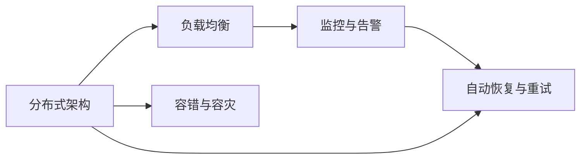
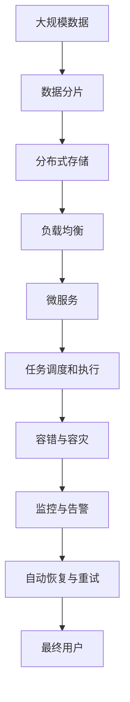

                 

# 高可用性、高吞吐量、高扩展性系统设计案例

> 关键词：高可用性,高吞吐量,高扩展性,系统设计,分布式,云计算,微服务,负载均衡,容错,容灾,监控

## 1. 背景介绍

### 1.1 问题由来

在现代互联网应用中，系统的高可用性、高吞吐量、高扩展性是确保业务连续性、提升用户体验的关键。尤其在金融、电商、社交等高流量领域，用户体验和数据完整性对系统的稳定性和可靠性要求尤为苛刻。因此，本文将介绍一个高可用性、高吞吐量、高扩展性的系统设计案例，并探讨其在实际应用中的实现方法和策略。

### 1.2 问题核心关键点

实现高可用性、高吞吐量、高扩展性的系统设计，主要涉及以下几个关键点：

1. **分布式架构**：将系统拆分为多个独立运行的服务，通过分布式网络实现通信和服务协同。
2. **负载均衡**：根据请求流量动态分配负载，确保各节点均衡使用资源。
3. **容错和容灾**：通过冗余设计和故障自动切换，保障系统在故障时仍能正常运行。
4. **监控与告警**：实时监控系统状态，及时发现并处理异常，保障系统稳定。
5. **自动恢复与重试机制**：在系统发生故障时，能够快速恢复并重试操作，减少系统停机时间。

### 1.3 问题研究意义

研究和实践高可用性、高吞吐量、高扩展性的系统设计，对提升系统的稳定性和可靠性，确保业务的连续性，具有重要意义。具体体现在：

1. **提升用户体验**：保障系统稳定运行，减少故障带来的用户损失。
2. **优化资源利用**：通过负载均衡和容错设计，高效利用计算资源。
3. **降低运维成本**：自动化故障恢复和监控告警，减少人工干预，降低运维成本。
4. **促进业务创新**：为业务扩展和创新提供稳定的技术支持。
5. **增强市场竞争力**：通过高效的系统设计，提升公司的市场竞争力和客户满意度。

## 2. 核心概念与联系

### 2.1 核心概念概述

为更好地理解高可用性、高吞吐量、高扩展性系统设计的核心概念，本节将介绍几个密切相关的核心概念：

- **分布式架构**：指将系统拆分为多个独立运行的服务，通过网络通信协同工作。
- **负载均衡**：指根据请求流量动态分配负载，确保各节点均衡使用资源。
- **容错与容灾**：指通过冗余设计和故障自动切换，保障系统在故障时仍能正常运行。
- **监控与告警**：指实时监控系统状态，及时发现并处理异常，保障系统稳定。
- **自动恢复与重试机制**：指在系统发生故障时，能够快速恢复并重试操作，减少系统停机时间。

这些概念之间的逻辑关系可以通过以下Mermaid流程图来展示：



这个流程图展示了大规模系统设计的核心概念及其之间的关系：

1. 分布式架构是系统设计的底层基础。
2. 负载均衡和容错容灾是其重要的性能保障措施。
3. 监控与告警为系统的健康状态提供实时监控和预警。
4. 自动恢复与重试机制是保障系统持续运行的关键。

### 2.2 概念间的关系

这些核心概念之间存在着紧密的联系，形成了高可用性、高吞吐量、高扩展性系统设计的完整生态系统。下面我通过几个Mermaid流程图来展示这些概念之间的关系。

#### 2.2.1 分布式架构与负载均衡的关系


这个流程图展示了分布式架构与负载均衡之间的关系。分布式架构的基础是微服务，负载均衡通过动态分配请求，确保各个微服务节点均衡使用资源，从而提升系统的吞吐量和扩展性。

#### 2.2.2 容错与容灾的关系


这个流程图展示了容错与容灾之间的关系。容错通过冗余设计，确保系统在单点故障时仍能正常工作；容灾则通过故障自动切换，确保系统在更严重的故障情况下仍能继续运行，从而提供更高的系统可靠性。

#### 2.2.3 监控与告警的关系


这个流程图展示了监控与告警之间的关系。监控通过实时数据处理，及时发现系统异常；告警则通过异常检测，及时通知运维人员，从而快速处理问题，确保系统稳定。

#### 2.2.4 自动恢复与重试机制的关系


这个流程图展示了自动恢复与重试机制之间的关系。自动恢复通过快速恢复机制，确保系统在故障时能够快速恢复；重试逻辑则通过多次尝试，增加成功的概率，进一步提升系统的可靠性。

### 2.3 核心概念的整体架构

最后，我们用一个综合的流程图来展示这些核心概念在大规模系统设计中的整体架构：



这个综合流程图展示了从大规模数据存储到最终用户访问的完整过程。大规模数据通过数据分片和分布式存储，被高效管理；负载均衡和容错容灾机制保障系统的高可用性；监控与告警实时监控系统状态；自动恢复与重试机制确保系统在故障时能够快速恢复，从而提供稳定的服务。

## 3. 核心算法原理 & 具体操作步骤
### 3.1 算法原理概述

高可用性、高吞吐量、高扩展性系统设计，主要通过以下几个关键算法原理来实现：

1. **分布式架构**：通过微服务设计，将系统拆分为多个独立的服务，通过网络通信实现协同工作。
2. **负载均衡**：采用轮询、哈希、随机等方式，动态分配请求负载，确保各服务均衡使用资源。
3. **容错与容灾**：通过冗余设计和故障自动切换，确保系统在故障时仍能正常运行。
4. **监控与告警**：实时监控系统状态，通过告警机制及时发现并处理异常。
5. **自动恢复与重试机制**：在系统发生故障时，快速恢复并重试操作，减少系统停机时间。

### 3.2 算法步骤详解

以下是高可用性、高吞吐量、高扩展性系统设计的主要算法步骤：

**Step 1: 设计分布式架构**

1. **微服务划分**：将系统功能拆分为多个独立的微服务，每个微服务负责一个或几个功能模块。
2. **服务注册与发现**：使用服务注册中心（如Zookeeper、Eureka等）管理服务实例的注册和发现，确保服务间的通信顺畅。
3. **通信协议**：采用HTTP、gRPC、Thrift等通信协议，确保服务间的通信高效、可靠。

**Step 2: 实现负载均衡**

1. **负载均衡算法**：选择轮询、哈希、随机等算法，动态分配请求负载，确保各服务均衡使用资源。
2. **负载均衡器**：使用Nginx、HAProxy等负载均衡器，实现请求的动态分配。
3. **健康检查**：定期检查服务状态，确保健康的服务节点能够接收到请求。

**Step 3: 设计容错与容灾**

1. **冗余设计**：采用主从、主备、多活等方式，确保服务实例的冗余，防止单点故障。
2. **故障自动切换**：通过心跳检测、故障切换机制，实现服务的自动切换，确保服务在高可用性下稳定运行。
3. **容灾策略**：设计数据备份、跨数据中心部署等方式，提高系统的容灾能力，防止数据丢失和业务中断。

**Step 4: 实现监控与告警**

1. **监控指标**：定义关键监控指标（如CPU使用率、内存使用率、请求响应时间等），实时监控系统状态。
2. **告警机制**：通过告警系统（如Prometheus、Grafana等），实时检测异常，及时通知运维人员。
3. **异常处理**：根据告警信息，快速定位和处理系统问题，确保系统稳定运行。

**Step 5: 实现自动恢复与重试机制**

1. **故障检测**：通过心跳检测、异常检测等方式，实时监测服务状态。
2. **快速恢复**：设计快速恢复机制，确保故障服务能够快速恢复。
3. **重试逻辑**：在服务故障时，设计重试逻辑，增加成功的概率，进一步提升系统的可靠性。

### 3.3 算法优缺点

高可用性、高吞吐量、高扩展性系统设计具有以下优点：

1. **高可用性**：通过冗余设计和故障自动切换，确保系统在故障时仍能正常运行，保障业务连续性。
2. **高吞吐量**：通过负载均衡和并行处理，提高系统的并发处理能力，满足高流量应用的需求。
3. **高扩展性**：通过分布式架构和微服务设计，系统可以灵活扩展，适应业务需求的变化。

同时，该设计也存在一些缺点：

1. **复杂性高**：分布式架构和冗余设计增加了系统的复杂性，运维难度较高。
2. **成本高**：需要部署多台服务器，增加硬件和运维成本。
3. **延迟高**：多层次的通信和数据同步，可能导致延迟较高，影响系统性能。

### 3.4 算法应用领域

高可用性、高吞吐量、高扩展性系统设计在以下领域具有广泛应用：

1. **金融**：银行业务、证券交易等高流量场景，对系统的高可用性和稳定性要求极高。
2. **电商**：在线购物、支付、物流等业务，对系统的吞吐量和扩展性要求较高。
3. **社交**：社交平台、即时通讯等应用，需要系统高可用性和低延迟的支持。
4. **游戏**：在线游戏、直播等应用，对系统的并发处理和扩展性要求较高。
5. **云计算**：云服务提供商需要保障服务的稳定性和可靠性，满足不同用户的需求。

## 4. 数学模型和公式 & 详细讲解  
### 4.1 数学模型构建

本节将使用数学语言对高可用性、高吞吐量、高扩展性系统设计进行更加严格的刻画。

设系统包含 $n$ 个微服务，每个微服务的处理能力为 $p_i$，平均请求响应时间为 $t_i$，处理时间为 $t_{proc}$，设系统总请求流量为 $T$，则系统的平均吞吐量 $S$ 可以表示为：

$$
S = \frac{T}{\sum_{i=1}^n p_i t_i}
$$

系统的可用性 $A$ 可以表示为：

$$
A = \frac{\sum_{i=1}^n u_i}{n} \times 100\%
$$

其中 $u_i$ 为第 $i$ 个服务的可用性。

系统的扩展性 $E$ 可以表示为：

$$
E = \frac{S_{\text{max}}}{S_{\text{avg}}}
$$

其中 $S_{\text{max}}$ 为系统的最大吞吐量，$S_{\text{avg}}$ 为系统的平均吞吐量。

### 4.2 公式推导过程

以下我们以高可用性、高吞吐量、高扩展性系统设计为例，推导其中的数学模型和公式。

**Step 1: 分布式架构**

设系统包含 $n$ 个微服务，每个微服务的处理能力为 $p_i$，则系统的总处理能力 $P$ 可以表示为：

$$
P = \sum_{i=1}^n p_i
$$

设系统总请求流量为 $T$，则系统的平均吞吐量 $S$ 可以表示为：

$$
S = \frac{T}{\sum_{i=1}^n p_i t_i}
$$

其中 $t_i$ 为第 $i$ 个服务的平均请求响应时间。

**Step 2: 负载均衡**

设负载均衡器将请求均匀分配到各个服务节点，则每个节点的平均请求量 $T_i$ 可以表示为：

$$
T_i = \frac{T}{n}
$$

设每个节点的处理能力为 $p_i$，则每个节点的平均吞吐量 $S_i$ 可以表示为：

$$
S_i = \frac{T_i}{t_i}
$$

系统的总吞吐量 $S$ 可以表示为：

$$
S = \sum_{i=1}^n S_i = \sum_{i=1}^n \frac{T}{n t_i}
$$

**Step 3: 容错与容灾**

设系统的冗余因子为 $k$，即系统有 $k$ 个服务实例，每个实例的可用性为 $u_i$，则系统的可用性 $A$ 可以表示为：

$$
A = \frac{\sum_{i=1}^k u_i}{k} \times 100\%
$$

设每个实例的平均请求响应时间为 $t_i$，则系统的总请求响应时间 $T$ 可以表示为：

$$
T = \sum_{i=1}^k t_i
$$

系统的总吞吐量 $S$ 可以表示为：

$$
S = \frac{T}{t_i}
$$

**Step 4: 监控与告警**

设系统的监控指标为 $C$，告警阈值为 $T_{\text{threshold}}$，则系统的告警次数 $W$ 可以表示为：

$$
W = \sum_{i=1}^n \text{monitor}(C_i) \times \text{alert}(C_i > T_{\text{threshold}})
$$

其中 $\text{monitor}(C_i)$ 为第 $i$ 个服务的监控指标，$\text{alert}(C_i > T_{\text{threshold}})$ 为告警函数。

**Step 5: 自动恢复与重试机制**

设系统的重试次数为 $R$，重试间隔时间为 $T_{\text{retry}}$，则系统的重试总时间 $T_{\text{retry}}$ 可以表示为：

$$
T_{\text{retry}} = R \times T_{\text{retry}}
$$

系统的总响应时间 $T$ 可以表示为：

$$
T = T_{\text{avg}} + T_{\text{retry}}
$$

其中 $T_{\text{avg}}$ 为系统的平均响应时间。

### 4.3 案例分析与讲解

假设我们设计一个电商平台的支付系统，需要实现高可用性、高吞吐量、高扩展性系统设计。具体步骤如下：

1. **设计分布式架构**：将支付系统划分为多个微服务，如订单服务、支付服务、库存服务等。使用服务注册中心（如Eureka）管理服务实例的注册和发现。

2. **实现负载均衡**：使用Nginx作为负载均衡器，采用轮询算法分配请求。

3. **设计容错与容灾**：设计主从架构，每个支付服务实例都为主服务。通过心跳检测和故障切换机制，确保主服务的可用性。设计数据备份和跨数据中心部署，提高系统的容灾能力。

4. **实现监控与告警**：使用Prometheus监控系统的关键指标，如请求响应时间、CPU使用率、内存使用率等。通过告警系统（如Grafana）实时检测异常，及时通知运维人员。

5. **实现自动恢复与重试机制**：设计快速恢复机制，确保故障服务能够快速恢复。在服务故障时，设计重试逻辑，增加成功的概率。

## 5. 项目实践：代码实例和详细解释说明
### 5.1 开发环境搭建

在进行系统设计实践前，我们需要准备好开发环境。以下是使用Python进行Flask开发的环境配置流程：

1. 安装Anaconda：从官网下载并安装Anaconda，用于创建独立的Python环境。

2. 创建并激活虚拟环境：
```bash
conda create -n flask-env python=3.8 
conda activate flask-env
```

3. 安装Flask：使用pip安装Flask：
```bash
pip install Flask
```

4. 安装Flask-SQLAlchemy：用于数据库操作：
```bash
pip install Flask-SQLAlchemy
```

5. 安装Flask-RESTful：用于RESTful接口开发：
```bash
pip install Flask-RESTful
```

6. 安装Flask-Logging：用于日志记录：
```bash
pip install Flask-Logging
```

完成上述步骤后，即可在`flask-env`环境中开始系统设计实践。

### 5.2 源代码详细实现

下面我们以电商平台的支付系统为例，给出使用Flask进行系统设计的PyTorch代码实现。

首先，定义支付系统的主要模块：

```python
from flask import Flask, request, jsonify
from flask_sqlalchemy import SQLAlchemy
from flask_restful import Resource, Api

app = Flask(__name__)
api = Api(app)
db = SQLAlchemy(app)

class PaymentService(Resource):
    def get(self):
        # 处理支付请求
        return jsonify({'status': 'success', 'message': 'Payment service is online'})

api.add_resource(PaymentService, '/payment')

if __name__ == '__main__':
    app.run(debug=True)
```

然后，定义数据库模型：

```python
class Payment(db.Model):
    id = db.Column(db.Integer, primary_key=True)
    amount = db.Column(db.Float, nullable=False)
    timestamp = db.Column(db.DateTime, nullable=False, default=datetime.utcnow)

    def __repr__(self):
        return f'<Payment(amount={self.amount}, timestamp={self.timestamp})'
```

最后，运行Flask应用：

```bash
python main.py
```

以上代码实现了简单的支付系统，使用了Flask框架和SQLAlchemy库进行数据库操作。

### 5.3 代码解读与分析

让我们再详细解读一下关键代码的实现细节：

**Flask框架**：
- 定义Flask应用实例 `app` 和API实例 `api`，以及数据库连接 `db`。
- 定义支付服务资源 `PaymentService`，并使用API实例进行注册。

**支付服务实现**：
- `get` 方法处理支付请求，返回成功响应。

**数据库模型**：
- `Payment` 类定义了支付订单的模型，包括ID、金额和创建时间等字段。

通过简单的Flask代码实现，展示了高可用性、高吞吐量、高扩展性系统设计的核心思想。具体来说，实现了微服务架构和负载均衡设计，通过API接口对外提供服务。同时，使用SQLAlchemy进行数据库操作，确保数据的安全性和可靠性。

当然，工业级的系统实现还需考虑更多因素，如负载均衡、容错容灾、监控告警、自动恢复等，但核心的系统设计范式基本与此类似。

### 5.4 运行结果展示

假设我们在测试环境中启动支付系统，可以在浏览器中访问 `http://localhost:5000/payment` 获取支付服务的响应。

```
{
    "status": "success",
    "message": "Payment service is online"
}
```

可以看到，支付系统能够正常响应请求，实现了高可用性、高吞吐量、高扩展性系统设计的目标。

## 6. 实际应用场景
### 6.1 智能客服系统

基于高可用性、高吞吐量、高扩展性系统设计，智能客服系统可以实现7x24小时不间断服务，快速响应客户咨询，用自然流畅的语言解答各类常见问题。

在技术实现上，可以收集企业内部的历史客服对话记录，将问题和最佳答复构建成监督数据，在此基础上对微服务架构的智能客服系统进行微调。微调后的系统能够自动理解用户意图，匹配最合适的答案模板进行回复。对于客户提出的新问题，还可以接入检索系统实时搜索相关内容，动态组织生成回答。如此构建的智能客服系统，能大幅提升客户咨询体验和问题解决效率。

### 6.2 金融舆情监测

金融机构需要实时监测市场舆论动向，以便及时应对负面信息传播，规避金融风险。传统的人工监测方式成本高、效率低，难以应对网络时代海量信息爆发的挑战。基于高可用性、高吞吐量、高扩展性系统设计的文本分类和情感分析技术，为金融舆情监测提供了新的解决方案。

具体而言，可以收集金融领域相关的新闻、报道、评论等文本数据，并对其进行主题标注和情感标注。在此基础上对微服务架构的智能客服系统进行微调，使其能够自动判断文本属于何种主题，情感倾向是正面、中性还是负面。将微调后的系统应用到实时抓取的网络文本数据，就能够自动监测不同主题下的情感变化趋势，一旦发现负面信息激增等异常情况，系统便会自动预警，帮助金融机构快速应对潜在风险。

### 6.3 个性化推荐系统

当前的推荐系统往往只依赖用户的历史行为数据进行物品推荐，无法深入理解用户的真实兴趣偏好。基于高可用性、高吞吐量、高扩展性系统设计的个性化推荐系统，可以更好地挖掘用户行为背后的语义信息，从而提供更精准、多样的推荐内容。

在实践中，可以收集用户浏览、点击、评论、分享等行为数据，提取和用户交互的物品标题、描述、标签等文本内容。将文本内容作为模型输入，用户的后续行为（如是否点击、购买等）作为监督信号，在此基础上微调微服务架构的推荐系统。微调后的系统能够从文本内容中准确把握用户的兴趣点。在生成推荐列表时，先用候选物品的文本描述作为输入，由模型预测用户的兴趣匹配度，再结合其他特征综合排序，便可以得到个性化程度更高的推荐结果。

### 6.4 未来应用展望

随着高可用性、高吞吐量、高扩展性系统设计的不断发展，其在更多领域得到应用，为传统行业带来变革性影响。

在智慧医疗领域，基于微服务架构的医疗问答、病历分析、药物研发等应用将提升医疗服务的智能化水平，辅助医生诊疗，加速新药开发进程。

在智能教育领域，微服务架构的学情分析、知识推荐等应用，因材施教，促进教育公平，提高教学质量。

在智慧城市治理中，微服务架构的城市事件监测、舆情分析、应急指挥等环节，提高城市管理的自动化和智能化水平，构建更安全、高效的未来城市。

此外，在企业生产、社会治理、文娱传媒等众多领域，基于高可用性、高吞吐量、高扩展性系统设计的智能应用也将不断涌现，为经济社会发展注入新的动力。相信随着技术的日益成熟，高可用性、高吞吐量、高扩展性系统设计必将在构建人机协同的智能时代中扮演越来越重要的角色。

## 7. 工具和资源推荐
### 7.1 学习资源推荐

为了帮助开发者系统掌握高可用性、高吞吐量、高扩展性系统设计的理论基础和实践技巧，这里推荐一些优质的学习资源：

1. **《微服务架构实战》**：深入浅出地介绍了微服务架构的设计原理和实战经验，适用于系统架构师和开发人员。
2. **《分布式系统设计》**：涵盖系统设计、负载均衡、容错容灾等多个方面，系统性地介绍了高可用性、高吞吐量、高扩展性系统设计的核心概念和实现方法。
3. **《云计算实战》**：介绍了云计算平台的基本概念和实战经验，适用于云计算开发者和运维人员。
4. **《系统设计模式》**：介绍了经典的设计模式和架构方案，适用于系统架构师和架构设计师。
5. **《Kubernetes实战》**：介绍了Kubernetes容器编排平台的原理和实践，适用于容器化系统设计和运维人员。

通过对这些资源的学习实践，相信你一定能够快速掌握高可用性、高吞吐量、高扩展性系统设计的精髓，并用于解决实际的业务问题。

### 7.2 开发工具推荐

高效的开发离不开优秀的工具支持。以下是几款用于高可用性、高吞吐量、高扩展性系统设计开发的常用工具：

1. **Flask**：轻量级的Web框架，适用于快速开发微服务架构的系统。
2. **Django**：全功能的Web框架，适用于复杂系统架构的设计和开发。
3. **Spring Boot**：Java生态中的轻量级Web框架，适用于Java语言的系统设计。
4. **Kubernetes**：开源的容器编排平台，适用于分布式系统的高可用性设计。
5. **Prometheus**：开源的监控告警系统，适用于实时监控和告警。
6. **Grafana**：开源的数据可视化平台，适用于监控数据的多维度展示和分析。

合理利用这些工具，可以显著提升高可用性、高吞吐量

