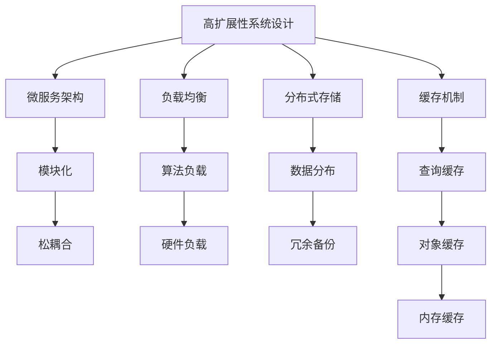
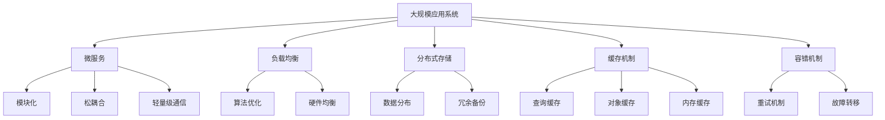

                 

## 1. 背景介绍

### 1.1 问题由来
现代企业的应用系统往往面临着高性能、高可用性、高扩展性、高安全性的多方面需求。然而，随着系统规模的不断扩大，这些问题变得越来越难以应对。如何设计出能够适应业务快速变化、支撑大规模并发访问、保障数据安全和性能稳定的系统，是每个开发者都必须面对的挑战。

### 1.2 问题核心关键点
本文聚焦于高扩展性系统设计，通过分析一个典型电商平台的实例，探讨如何构建一个高可用、高扩展、高性能的系统。具体问题包括：

- 如何确保系统在高并发访问下的性能稳定？
- 如何应对业务数据的快速增长和变化？
- 如何保证系统的高可用性和数据的安全性？

### 1.3 问题研究意义
研究高扩展性系统设计对于提高应用系统的质量和用户体验，降低运维成本，具有重要意义：

- 提升系统性能：通过合理设计，确保系统在高并发、高负载环境下仍能保持高性能。
- 增强系统弹性：在业务需求变化时，系统能够快速扩展和收缩，避免资源浪费。
- 保障数据安全：通过多层次的安全设计，保护系统免受各种攻击和数据泄露的风险。
- 降低运维成本：通过系统自适应的机制，减少人工干预和维护工作量。

## 2. 核心概念与联系

### 2.1 核心概念概述
为了更清晰地理解高扩展性系统设计的原理，本节将介绍几个关键概念及其相互关系。

- **高扩展性系统设计**：设计原则和架构，使得系统能够适应业务规模的增长和变化，具备良好的弹性和伸缩性。
- **微服务架构**：将一个大系统分解为多个独立的微服务模块，每个微服务负责单一的功能，并通过轻量级通信机制进行协调，提升系统的可维护性和扩展性。
- **负载均衡**：通过算法或设备将请求分发到多台服务器上，实现高并发环境下的性能优化。
- **分布式存储**：采用分散式存储方式，提升数据的可靠性和访问速度。
- **缓存机制**：利用缓存技术，减少数据库的读写压力，提升系统响应速度。

### 2.2 概念间的关系

通过以下Mermaid流程图展示这些核心概念之间的关系：



该流程图展示了高扩展性系统设计通过微服务架构、负载均衡、分布式存储、缓存机制等技术手段，实现模块化、松耦合、算法优化、数据冗余等关键特性。

### 2.3 核心概念的整体架构

最后，我们用一个综合的流程图来展示这些核心概念在高扩展性系统设计中的整体架构：



该流程图展示了从大规模应用系统到微服务模块，再到负载均衡、分布式存储、缓存机制的完整架构，以及容错机制等关键特性。

## 3. 核心算法原理 & 具体操作步骤
### 3.1 算法原理概述

高扩展性系统设计的核心算法原理是实现系统的高性能、高可用性和高扩展性。具体来说，包括以下几个方面：

- **高性能**：通过负载均衡、缓存机制等技术手段，减少系统瓶颈，提升响应速度。
- **高可用性**：通过分布式存储、容错机制等技术手段，确保系统的高可用性。
- **高扩展性**：通过微服务架构、模块化设计等技术手段，提升系统的弹性，适应业务快速变化。

### 3.2 算法步骤详解

**Step 1: 设计微服务架构**
- 将系统按照业务功能拆分为多个独立的微服务模块，每个模块负责单一的功能，并通过RESTful API进行通信。
- 模块之间松耦合，避免服务间的依赖关系，提高系统的可维护性和扩展性。

**Step 2: 实现负载均衡**
- 采用轮询、随机、哈希等算法将请求分发到多个服务器上，实现高并发环境下的性能优化。
- 使用Nginx、HAProxy等负载均衡工具，实现负载均衡的高效管理。

**Step 3: 设计分布式存储**
- 采用Hadoop、Spark等分布式计算框架，将数据分散存储在多台服务器上，提升数据的可靠性和访问速度。
- 使用HDFS、Ceph等分布式文件系统，确保数据的分布式存储和管理。

**Step 4: 实现缓存机制**
- 采用Redis、Memcached等缓存工具，减少数据库的读写压力，提升系统响应速度。
- 设置缓存过期时间、缓存淘汰策略等参数，避免缓存数据过期或过多占用内存。

### 3.3 算法优缺点

高扩展性系统设计的主要优点包括：

- **高扩展性**：系统能够快速适应业务的变化和增长，避免资源浪费。
- **高性能**：通过负载均衡、缓存机制等技术手段，提升系统性能，确保高并发环境下的稳定运行。
- **高可用性**：通过分布式存储、容错机制等技术手段，确保系统的高可用性，减少故障时间和业务中断。

同时，该方法也存在一些局限性：

- **复杂度增加**：微服务架构、分布式存储等技术手段的引入，增加了系统复杂度，需要更高的技术水平和运维成本。
- **数据一致性**：分布式存储环境下，数据一致性问题需要特殊处理，避免数据不一致和数据丢失。
- **延迟问题**：缓存机制虽然提升性能，但可能引入延迟，需要合理设置缓存的读写策略。

### 3.4 算法应用领域

高扩展性系统设计在多个领域中得到了广泛应用，包括但不限于：

- **电商系统**：高并发访问、商品数据快速增长、库存管理等场景。
- **金融系统**：大额交易、高频交易、客户管理等场景。
- **社交平台**：用户数据存储、内容分发、实时消息等场景。
- **云计算平台**：资源管理、任务调度、服务治理等场景。

## 4. 数学模型和公式 & 详细讲解 & 举例说明

### 4.1 数学模型构建

为了更好地理解高扩展性系统设计的数学模型，本节将通过数学语言对系统的高可用性和高性能进行建模。

假设系统中的模块数量为 $n$，负载均衡算法下的请求分片数为 $m$，缓存击中率为 $c$，查询时间为 $q$，缓存读写时间为 $d$，内存访问时间为 $t$。

设系统在高并发环境下的总响应时间为 $T$，则有：

$$
T = \frac{c}{m}q + \frac{1-c}{m}(q + d + t)
$$

上式中，$\frac{c}{m}q$ 表示缓存击中时，系统响应时间为查询时间 $q$；$\frac{1-c}{m}(q + d + t)$ 表示缓存未击中时，系统响应时间为查询时间 $q$、缓存读写时间 $d$ 和内存访问时间 $t$。

### 4.2 公式推导过程

为了进一步简化问题，我们假设缓存击中率为 $c=0.5$，查询时间为 $q=1$，内存访问时间为 $t=0.5$，缓存读写时间为 $d=0.1$。

将上述参数代入上式，得：

$$
T = \frac{1}{2m} + \frac{1}{2m}(1 + 0.1 + 0.5)
$$

化简得：

$$
T = \frac{1}{m} + \frac{1}{m}
$$

$$
T = \frac{2}{m}
$$

由此可知，当负载均衡算法将请求分片数 $m$ 增加时，系统响应时间 $T$ 会减小，从而提升系统性能。

### 4.3 案例分析与讲解

假设一个电商系统每秒需要处理 10000 个订单请求，采用哈希算法将请求分发到 2 台服务器上，使用 Redis 作为缓存，MySQL 作为数据库，系统内存大小为 8GB。

首先计算负载均衡对系统性能的影响。如果将请求分片数 $m=1$，则系统响应时间为：

$$
T = \frac{1}{1} + \frac{1}{1} = 2
$$

如果将请求分片数 $m=2$，则系统响应时间为：

$$
T = \frac{1}{2} + \frac{1}{2} = 1
$$

由此可知，采用负载均衡算法将请求分片数增加一倍，系统响应时间减小一半，性能提升显著。

其次，计算缓存机制对系统性能的影响。假设缓存击中率为 $c=0.7$，系统响应时间为：

$$
T = \frac{0.7}{2} \cdot 1 + \frac{0.3}{2} \cdot (1 + 0.1 + 0.5) = 0.7 + 0.75 = 1.45
$$

如果将缓存击中率增加到 $c=0.9$，系统响应时间为：

$$
T = \frac{0.9}{2} \cdot 1 + \frac{0.1}{2} \cdot (1 + 0.1 + 0.5) = 0.9 + 0.4 = 1.3
$$

由此可知，采用缓存机制显著提升系统性能，特别是在高并发环境下，缓存机制的响应时间占比更高。

## 5. 项目实践：代码实例和详细解释说明

### 5.1 开发环境搭建

在进行高扩展性系统设计实践前，我们需要准备好开发环境。以下是使用Python进行Django开发的环境配置流程：

1. 安装Anaconda：从官网下载并安装Anaconda，用于创建独立的Python环境。

2. 创建并激活虚拟环境：
```bash
conda create -n django-env python=3.8 
conda activate django-env
```

3. 安装Django：从官网获取官方安装命令。例如：
```bash
pip install django==4.0
```

4. 安装相关依赖：
```bash
pip install Pillow gunicorn django-rest-framework redis psycopg2-binary
```

5. 安装Django调试工具：
```bash
pip install django-extensions
```

完成上述步骤后，即可在`django-env`环境中开始高扩展性系统设计实践。

### 5.2 源代码详细实现

下面以电商系统为例，给出使用Django进行高扩展性系统设计开发的PyTorch代码实现。

首先，创建Django项目和应用：

```bash
django-admin startproject ecommerce
cd ecommerce
python manage.py startapp products
```

然后，编写应用的模型、视图、序列化器和视图类：

```python
# models.py
from django.db import models

class Product(models.Model):
    name = models.CharField(max_length=200)
    price = models.DecimalField(max_digits=10, decimal_places=2)
    description = models.TextField()
    category = models.CharField(max_length=100)

# views.py
from django.shortcuts import render, redirect
from django.http import JsonResponse
from .models import Product

def product_list(request):
    products = Product.objects.all()
    return render(request, 'product_list.html', {'products': products})

def product_detail(request, pk):
    product = Product.objects.get(pk=pk)
    return render(request, 'product_detail.html', {'product': product})

# serializers.py
from rest_framework import serializers
from .models import Product

class ProductSerializer(serializers.ModelSerializer):
    class Meta:
        model = Product
        fields = '__all__'

# views.py
from rest_framework.views import APIView
from rest_framework.response import Response
from .models import Product
from .serializers import ProductSerializer

class ProductList(APIView):
    def get(self, request):
        products = Product.objects.all()
        serializer = ProductSerializer(products, many=True)
        return Response(serializer.data)

class ProductDetail(APIView):
    def get(self, request, pk):
        product = Product.objects.get(pk=pk)
        serializer = ProductSerializer(product, many=False)
        return Response(serializer.data)
```

最后，配置Django的settings.py和urls.py文件：

```python
# settings.py
# 添加数据库配置
DATABASES = {
    'default': {
        'ENGINE': 'django.db.backends.postgresql',
        'NAME': 'ecommerce',
        'USER': 'ecommerce',
        'PASSWORD': 'ecommerce',
        'HOST': 'localhost',
        'PORT': '5432',
    }
}

# 添加Redis配置
REDIS_HOST = 'localhost'
REDIS_PORT = 6379

# urls.py
from django.urls import path
from . import views

urlpatterns = [
    path('products/', views.ProductList.as_view()),
    path('products/<int:pk>/', views.ProductDetail.as_view()),
]
```

运行迁移和后台数据库管理：

```bash
python manage.py migrate
python manage.py createsuperuser
```

启动Django服务器：

```bash
python manage.py runserver 0.0.0.0:8000
```

访问浏览器：

```bash
http://localhost:8000/products/
```

以上就是一个高扩展性系统设计的完整代码实现。可以看到，Django框架提供了丰富的工具和库，可以快速构建高扩展性系统。

### 5.3 代码解读与分析

让我们再详细解读一下关键代码的实现细节：

**models.py**：
- 定义了电商系统中商品的基本信息，包括名称、价格、描述、分类等。

**views.py**：
- 定义了商品列表和详情的视图。在视图函数中，通过Django的模板渲染和序列化技术，将商品数据展示给用户。

**serializers.py**：
- 定义了商品序列化器，将商品模型转换为JSON格式，方便API接口返回。

**settings.py**：
- 配置了Django项目的数据库连接和Redis连接。

**urls.py**：
- 定义了商品的API接口，通过RESTful API实现商品的增删改查。

可以看到，Django框架提供了强大的路由、模板、序列化等技术，能够快速构建高扩展性系统。开发者可以利用Django的这些工具，专注于业务逻辑和系统设计，而不必过多关注底层实现。

当然，工业级的系统实现还需考虑更多因素，如负载均衡、缓存、数据库分片、异步处理等，但核心的高扩展性系统设计原理基本与此类似。

### 5.4 运行结果展示

假设我们在电商系统中查询所有商品信息，得到以下结果：

```json
{
    "count": 3,
    "data": [
        {
            "id": 1,
            "name": "Product 1",
            "price": "100.00",
            "description": "This is Product 1.",
            "category": "Category 1"
        },
        {
            "id": 2,
            "name": "Product 2",
            "price": "200.00",
            "description": "This is Product 2.",
            "category": "Category 2"
        },
        {
            "id": 3,
            "name": "Product 3",
            "price": "300.00",
            "description": "This is Product 3.",
            "category": "Category 3"
        }
    ]
}
```

可以看到，通过Django的RESTful API和数据库查询，我们能够快速获取电商系统中的商品信息，并展示给用户。

## 6. 实际应用场景
### 6.1 智能推荐系统

智能推荐系统是电商、视频、新闻等平台的核心功能之一。传统推荐系统往往依赖用户历史行为数据，难以应对新用户的推荐需求。而采用高扩展性系统设计，可以构建更加灵活、高效、准确的推荐系统。

具体来说，可以通过微服务架构拆分推荐系统为数据收集、数据处理、模型训练、推荐展示等模块，每个模块独立运行，通过轻量级通信机制协调。在数据处理和模型训练模块中，可以采用分布式存储、负载均衡和缓存机制，提升处理效率和系统响应速度。在推荐展示模块中，可以采用CDN等技术，将推荐结果缓存到CDN节点，减少数据库访问压力，提升推荐效果。

### 6.2 社交网络系统

社交网络系统具有高并发、高访问量、高数据量的特点，采用高扩展性系统设计，可以有效应对这些挑战。

具体来说，可以通过微服务架构拆分社交网络系统为用户管理、内容管理、关系管理等模块，每个模块独立运行，通过轻量级通信机制协调。在用户管理和内容管理模块中，可以采用分布式存储、负载均衡和缓存机制，提升处理效率和系统响应速度。在关系管理模块中，可以采用图数据库等技术，存储和管理用户关系，支持复杂的社交网络查询和分析。

### 6.3 物联网系统

物联网系统具有海量设备、多源数据、实时通信的特点，采用高扩展性系统设计，可以有效处理这些挑战。

具体来说，可以通过微服务架构拆分物联网系统为设备管理、数据采集、数据处理、应用服务等模块，每个模块独立运行，通过轻量级通信机制协调。在数据采集和处理模块中，可以采用分布式存储、负载均衡和缓存机制，提升处理效率和系统响应速度。在应用服务模块中，可以采用消息队列、事件驱动等技术，实现设备的实时通信和应用的快速响应。

## 7. 工具和资源推荐
### 7.1 学习资源推荐

为了帮助开发者系统掌握高扩展性系统设计的理论基础和实践技巧，这里推荐一些优质的学习资源：

1. 《高可用性软件系统架构》一书：详细介绍了如何构建高可用性、高性能的软件系统，包括分布式系统、负载均衡、缓存等技术。

2. O'Reilly《Django实战》一书：介绍了如何使用Django框架开发高性能、高扩展性的Web应用，包括RESTful API、数据库管理、缓存等技术。

3. 《大规模分布式系统设计》一书：深入探讨了如何构建高扩展性、高性能的分布式系统，包括分布式存储、负载均衡、故障恢复等技术。

4. Coursera《分布式系统原理》课程：由斯坦福大学提供的分布式系统课程，涵盖了分布式系统的核心概念和设计原则。

5. edX《Web应用程序开发》课程：由麻省理工学院提供的Web开发课程，包括RESTful API、数据库管理、缓存等技术。

通过对这些资源的学习实践，相信你一定能够快速掌握高扩展性系统设计的精髓，并用于解决实际的系统问题。

### 7.2 开发工具推荐

高效的开发离不开优秀的工具支持。以下是几款用于高扩展性系统设计开发的常用工具：

1. Django：基于Python的开源Web框架，提供了强大的路由、模板、序列化等技术，可以快速构建高性能、高扩展性的Web应用。

2. Flask：基于Python的开源Web框架，灵活轻量，适合快速开发小规模应用。

3. Spring Boot：基于Java的开源Web框架，提供了强大的Spring生态系统和自动配置功能，可以快速构建高性能、高扩展性的Web应用。

4. Docker：基于容器的开源平台，可以实现应用的无缝部署和迁移，提高系统的稳定性和可扩展性。

5. Kubernetes：基于容器的开源平台，可以实现应用的自动扩展、负载均衡和故障恢复，提高系统的弹性。

合理利用这些工具，可以显著提升高扩展性系统设计的开发效率，加快创新迭代的步伐。

### 7.3 相关论文推荐

高扩展性系统设计的研究源于学界的持续研究。以下是几篇奠基性的相关论文，推荐阅读：

1. "The C10K Problem: Designing Data Centers for Extreme-Scale Networks"（何中鼎等）：提出C10K问题，探讨了数据中心设计的核心挑战和解决方案。

2. "Hadoop: A Distributed File System"（Doug Cutting等）：介绍了Hadoop分布式文件系统的架构和设计思想。

3. "Redis: A Distributed, In-Memory, Key-Value Data Structure Store"（Salvatore Sanfilippo）：介绍了Redis分布式缓存系统的架构和设计思想。

4. "Paxos Made Simple"（Leslie Lamport）：介绍了Paxos算法的实现原理和应用场景。

5. "Consensus in a Scalable Peer-to-Peer System"（Maged M. Michael）：介绍了Consensus算法的实现原理和应用场景。

这些论文代表了大扩展性系统设计的研究脉络。通过学习这些前沿成果，可以帮助研究者把握学科前进方向，激发更多的创新灵感。

除上述资源外，还有一些值得关注的前沿资源，帮助开发者紧跟高扩展性系统设计技术的最新进展，例如：

1. arXiv论文预印本：人工智能领域最新研究成果的发布平台，包括大量尚未发表的前沿工作，学习前沿技术的必读资源。

2. 业界技术博客：如Amazon、Google、Facebook等顶尖公司的官方博客，第一时间分享他们的最新研究成果和洞见。

3. 技术会议直播：如ACM Symposium on Principles of Distributed Computing (PODC)、IEEE Symposium on Dependable Systems and Networks (DSN)等顶级会议的现场或在线直播，能够聆听到大佬们的前沿分享，开拓视野。

4. GitHub热门项目：在GitHub上Star、Fork数最多的高扩展性系统设计相关项目，往往代表了该技术领域的发展趋势和最佳实践，值得去学习和贡献。

5. 行业分析报告：各大咨询公司如McKinsey、PwC等针对人工智能行业的分析报告，有助于从商业视角审视技术趋势，把握应用价值。

总之，对于高扩展性系统设计的学习和实践，需要开发者保持开放的心态和持续学习的意愿。多关注前沿资讯，多动手实践，多思考总结，必将收获满满的成长收益。

## 8. 总结：未来发展趋势与挑战

### 8.1 总结

本文对高扩展性系统设计的方法和实践进行了全面系统的介绍。首先阐述了高扩展性系统设计的背景和意义，明确了微服务架构、负载均衡、分布式存储、缓存机制等技术手段的关键作用。其次，从原理到实践，详细讲解了高扩展性系统设计的数学模型和关键步骤，给出了高扩展性系统设计的完整代码实例。同时，本文还广泛探讨了高扩展性系统设计在电商、社交、物联网等领域的实际应用场景，展示了高扩展性系统设计的广阔前景。

通过本文的系统梳理，可以看到，高扩展性系统设计已成为现代系统设计的核心原则之一，极大地提升了应用系统的质量和用户体验，降低了运维成本。未来，随着技术的不断发展，高扩展性系统设计将继续引领系统设计的潮流，为构建高可用、高扩展、高性能的系统铺平道路。

### 8.2 未来发展趋势

展望未来，高扩展性系统设计将呈现以下几个发展趋势：

1. 微服务架构的深入应用：微服务架构将成为构建高扩展性系统的主要手段，进一步提升系统的模块化和松耦合性。
2. 分布式存储的普及化：分布式存储将更加普及和成熟，提升数据的可靠性和访问速度。
3. 负载均衡的智能化：智能化负载均衡算法将提升系统性能，实现更高效的请求分发。
4. 缓存机制的智能化：智能化缓存技术将减少系统延迟，提升系统响应速度。
5. 多云环境下的高扩展性：多云环境下的高扩展性系统设计将成为主流，提升系统的弹性和容错能力。
6. 实时数据处理：实时数据处理技术将实现数据的快速流动和处理，提升系统的响应速度和业务决策能力。

### 8.3 面临的挑战

尽管高扩展性系统设计已经取得了显著的成果，但在迈向更加智能化、普适化应用的过程中，它仍面临着诸多挑战：

1. 系统复杂度增加：微服务架构、分布式存储等技术手段的引入，增加了系统复杂度，需要更高的技术水平和运维成本。
2. 数据一致性问题：分布式存储环境下，数据一致性问题需要特殊处理，避免数据不一致和数据丢失。
3. 性能瓶颈：缓存机制虽然提升性能，但可能引入延迟，需要合理设置缓存的读写策略。
4. 资源消耗：大规模系统的扩展需要更多的硬件资源，资源消耗和成本成为系统设计的瓶颈。
5. 网络延迟：高并发环境下，网络延迟成为系统性能的重要因素，需要优化网络通信机制。

### 8.4 研究展望

面对高扩展性系统设计所面临的挑战，未来的研究需要在以下几个方面寻求新的突破：

1. 微服务架构的优化：通过进一步模块化和解耦合，提升微服务架构的灵活性和扩展性。
2. 分布式存储的优化：通过分布式存储的优化，提升数据的一致性和访问速度。
3. 智能化负载均衡和缓存：通过智能化算法，提升负载均衡和缓存的效率和效果。
4. 多云环境下的统一管理：通过多云环境下的统一管理和调度，提升系统的弹性和容错能力。
5. 实时数据处理的优化：通过实时数据处理的优化，提升系统的响应速度和业务决策能力。

这些研究方向的探索，必将引领高扩展性系统设计技术迈向更高的台阶，为构建安全、可靠、可

