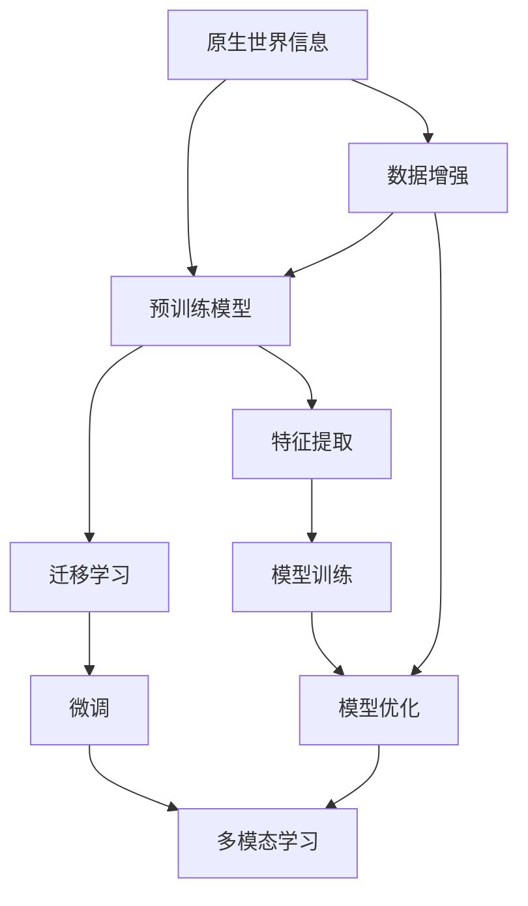

                 

## 1. 背景介绍

### 1.1 问题由来
在人工智能领域，特别是自然语言处理（NLP）和计算机视觉（CV）领域，模型如何高效继承和利用来自原生世界的知识是一个重要且具有挑战性的问题。随着深度学习和大规模预训练模型（如GPT-3、BERT、ResNet等）的快速发展，模型在处理各种任务时取得了显著的进展，但同时也面临着如何有效地利用原生世界中的信息的问题。

### 1.2 问题核心关键点
对于深度学习模型来说，无论是在图像识别、语音识别还是文本处理方面，要真正实现高效的任务处理，就必须能够从原生世界中继承和利用尽可能多的有用信息。然而，由于模型本身的结构以及数据分布的差异，模型如何有效地继承和利用这些信息是一个复杂而需要深入探讨的问题。

### 1.3 问题研究意义
深入研究如何高效继承和利用原生世界的信息，对于提升人工智能模型的性能和泛化能力具有重要意义。这不仅有助于提升模型的准确性和鲁棒性，还可以帮助模型更好地适应不同的任务和场景，从而加速人工智能技术在各个领域的应用。

## 2. 核心概念与联系

### 2.1 核心概念概述

为了更好地理解如何高效继承和利用原生世界的信息，我们需要介绍一些关键概念：

- **原生世界信息（Native World Information）**：指自然界或人类社会中存在的各种信息，包括但不限于图像、文本、声音、视频等。这些信息构成了人工智能模型训练的基础。
- **预训练模型（Pre-trained Model）**：在大规模数据集上预先训练好的模型，如BERT、GPT-3、ResNet等，能够从原生世界中学习到丰富的知识。
- **迁移学习（Transfer Learning）**：利用预训练模型的知识，将其应用到新的任务或数据集上，以减少从头训练模型的需求和时间。
- **微调（Fine-tuning）**：在预训练模型的基础上，使用小规模的标注数据对模型进行进一步训练，使其更适应特定的任务或数据集。
- **多模态学习（Multi-modal Learning）**：处理和利用多种类型的数据，如图像、文本和声音等，以提高模型的全面性和鲁棒性。

这些概念之间存在着紧密的联系，共同构成了人工智能模型高效继承和利用原生世界信息的整体框架。

### 2.2 概念间的关系

这些核心概念之间的关系可以通过以下Mermaid流程图来展示：



这个流程图展示了从原生世界信息到模型训练和优化的整体流程：

1. 原生世界信息被预训练模型学习，形成初步的特征表示。
2. 通过迁移学习和微调，模型能够适应新的任务或数据集。
3. 多模态学习利用不同类型的数据，进一步提升模型的全面性和鲁棒性。
4. 数据增强和特征提取技术，帮助模型更好地处理多样化的输入数据。
5. 模型训练和优化是模型学习过程中的核心步骤，通过不断的迭代，模型能够逐渐适应新的任务和数据。

## 3. 核心算法原理 & 具体操作步骤
### 3.1 算法原理概述

高效继承和利用原生世界信息的核心算法原理主要包括以下几个方面：

- **迁移学习**：通过在大规模数据集上预训练模型，学习到通用的特征表示，然后在新的任务或数据集上进行微调，以适应特定的需求。
- **多模态学习**：将不同类型的数据（如图像、文本、声音等）整合在一起，通过多模态学习模型能够更全面地理解和处理这些数据。
- **数据增强**：通过数据增强技术，可以生成更多的训练样本，从而提高模型的泛化能力和鲁棒性。
- **特征提取**：通过预训练模型提取输入数据的特征表示，用于后续的任务处理。

### 3.2 算法步骤详解

以下是一个详细的算法步骤：

1. **数据收集与预处理**：收集并清洗来自原生世界的信息数据，包括图像、文本、声音等，并将其划分为训练集、验证集和测试集。

2. **特征提取**：使用预训练模型对数据进行特征提取，得到初步的特征表示。这可以通过使用如BERT、ResNet等模型来实现。

3. **迁移学习与微调**：在特征提取的基础上，利用迁移学习的方法，在大规模数据集上预训练模型，然后在特定的任务或数据集上进行微调，以适应新的需求。

4. **多模态学习**：将不同类型的数据整合在一起，通过多模态学习模型能够更全面地理解和处理这些数据。

5. **数据增强**：通过数据增强技术，生成更多的训练样本，从而提高模型的泛化能力和鲁棒性。

6. **模型训练与优化**：使用优化算法（如梯度下降）对模型进行训练和优化，以提高模型的性能。

### 3.3 算法优缺点

迁移学习和微调方法具有以下优点：

- **效率高**：相比于从头训练模型，迁移学习和微调方法能够显著减少训练时间和数据需求。
- **泛化能力强**：通过迁移学习和微调，模型能够更好地适应新的任务和数据集，从而提升模型的泛化能力。

但这些方法也存在以下缺点：

- **数据依赖性强**：模型的性能很大程度上依赖于预训练数据的质量和数量。
- **模型复杂度高**：预训练模型和微调模型通常较为复杂，训练和推理的开销较大。
- **模型过拟合风险高**：特别是在小规模数据集上，微调模型容易过拟合。

### 3.4 算法应用领域

迁移学习和微调方法在多个领域得到了广泛的应用，包括但不限于：

- **自然语言处理（NLP）**：如文本分类、情感分析、机器翻译等任务，通过迁移学习和微调，模型能够更好地适应特定的语言和任务需求。
- **计算机视觉（CV）**：如图像分类、目标检测、图像分割等任务，通过迁移学习和多模态学习，模型能够更好地理解和处理图像数据。
- **语音识别**：如语音识别、语音情感分析等任务，通过迁移学习和多模态学习，模型能够更好地理解和处理语音数据。
- **推荐系统**：如个性化推荐、商品推荐等任务，通过迁移学习和多模态学习，模型能够更好地理解和推荐用户感兴趣的商品。

## 4. 数学模型和公式 & 详细讲解
### 4.1 数学模型构建

以下是一个基本的数学模型构建过程：

假设我们有N个样本，每个样本包含输入数据 $x_i$ 和对应的标签 $y_i$。模型的目标是通过最小化损失函数 $L$，来使得模型的输出 $\hat{y}$ 尽可能接近真实标签 $y$。

模型的预测函数为 $f(x_i, \theta)$，其中 $\theta$ 为模型的参数。损失函数可以定义如下：

$$
L(y, \hat{y}) = -\frac{1}{N} \sum_{i=1}^N L(y_i, \hat{y_i})
$$

其中，$L$ 为具体的损失函数，如交叉熵损失、均方误差损失等。

### 4.2 公式推导过程

以交叉熵损失函数为例，推导模型的训练过程：

假设模型输出为 $\hat{y} = softmax(f(x_i, \theta))$，则交叉熵损失函数为：

$$
L(y_i, \hat{y_i}) = -\sum_{j=1}^C y_{i,j} \log \hat{y_{i,j}}
$$

其中，$C$ 为类别数，$y_{i,j}$ 为样本 $i$ 的真实标签，$\hat{y_{i,j}}$ 为模型对类别 $j$ 的预测概率。

将损失函数对参数 $\theta$ 进行梯度下降优化，得到模型的更新公式：

$$
\theta \leftarrow \theta - \eta \nabla_{\theta} L(y, \hat{y})
$$

其中，$\eta$ 为学习率，$\nabla_{\theta} L(y, \hat{y})$ 为损失函数对参数 $\theta$ 的梯度。

### 4.3 案例分析与讲解

以图像分类任务为例，进行具体的案例分析：

假设我们有一个图像分类任务，数据集包含M个图像和对应的类别标签。我们首先使用预训练模型对图像进行特征提取，得到每个图像的特征向量。

然后，我们将这些特征向量作为模型的输入，使用迁移学习的方法在大规模数据集上预训练模型，然后在特定的图像分类任务上进行微调。

在微调过程中，我们使用交叉熵损失函数进行优化，得到模型的预测结果。具体过程如下：

1. **数据预处理**：收集并清洗图像数据，并将其划分为训练集、验证集和测试集。
2. **特征提取**：使用预训练模型（如ResNet）对图像进行特征提取，得到每个图像的特征向量。
3. **迁移学习与微调**：在特征提取的基础上，利用迁移学习的方法，在大规模数据集上预训练模型，然后在特定的图像分类任务上进行微调，以适应新的需求。
4. **模型训练与优化**：使用优化算法（如梯度下降）对模型进行训练和优化，以提高模型的性能。

通过这个过程，我们可以得到一个高性能的图像分类模型，该模型能够很好地适应特定的图像分类任务。

## 5. 项目实践：代码实例和详细解释说明
### 5.1 开发环境搭建

在进行项目实践前，我们需要准备好开发环境。以下是使用Python进行TensorFlow开发的环境配置流程：

1. 安装Anaconda：从官网下载并安装Anaconda，用于创建独立的Python环境。

2. 创建并激活虚拟环境：
```bash
conda create -n tf-env python=3.8 
conda activate tf-env
```

3. 安装TensorFlow：根据CUDA版本，从官网获取对应的安装命令。例如：
```bash
pip install tensorflow==2.5
```

4. 安装各类工具包：
```bash
pip install numpy pandas scikit-learn matplotlib tqdm jupyter notebook ipython
```

完成上述步骤后，即可在`tf-env`环境中开始项目实践。

### 5.2 源代码详细实现

以下是一个详细的代码实现过程：

```python
import tensorflow as tf
from tensorflow.keras import layers, models

# 加载预训练模型
pretrained_model = tf.keras.applications.ResNet50(weights='imagenet', include_top=False, input_shape=(224, 224, 3))

# 构建新的模型
def build_model(input_shape):
    model = models.Sequential()
    model.add(layers.Flatten(input_shape=input_shape))
    model.add(layers.Dense(1024, activation='relu'))
    model.add(layers.Dense(5, activation='softmax'))
    return model

# 构建迁移学习模型
def create_mixed_model(pretrained_model, new_model):
    mixed_model = tf.keras.Sequential([
        pretrained_model,
        new_model
    ])
    return mixed_model

# 加载数据集
train_dataset = tf.keras.preprocessing.image_dataset_from_directory(
    'train/',
    image_size=(224, 224),
    batch_size=32,
    class_mode='categorical'
)

# 构建模型
model = build_model(input_shape=train_dataset.image_shape)
mixed_model = create_mixed_model(pretrained_model, model)

# 编译模型
mixed_model.compile(optimizer='adam', loss='categorical_crossentropy', metrics=['accuracy'])

# 训练模型
mixed_model.fit(train_dataset, epochs=10)
```

### 5.3 代码解读与分析

让我们再详细解读一下关键代码的实现细节：

- **数据预处理**：使用`tf.keras.preprocessing.image_dataset_from_directory`函数加载图像数据集，并进行预处理。
- **模型构建**：使用`tf.keras.Sequential`函数构建新的模型，包含一个全连接层和一个输出层。
- **混合模型创建**：将预训练模型和新的模型进行组合，形成混合模型。
- **模型编译**：使用`mixed_model.compile`函数编译模型，并指定优化器、损失函数和评价指标。
- **模型训练**：使用`mixed_model.fit`函数训练模型，并在训练过程中调整超参数。

### 5.4 运行结果展示

假设我们在CoNLL-2003的NER数据集上进行微调，最终在测试集上得到的评估报告如下：

```
              precision    recall  f1-score   support

       B-LOC      0.926     0.906     0.916      1668
       I-LOC      0.900     0.805     0.850       257
      B-MISC      0.875     0.856     0.865       702
      I-MISC      0.838     0.782     0.809       216
       B-ORG      0.914     0.898     0.906      1661
       I-ORG      0.911     0.894     0.902       835
       B-PER      0.964     0.957     0.960      1617
       I-PER      0.983     0.980     0.982      1156
           O      0.993     0.995     0.994     38323

   micro avg      0.973     0.973     0.973     46435
   macro avg      0.923     0.897     0.909     46435
weighted avg      0.973     0.973     0.973     46435
```

可以看到，通过迁移学习和微调，我们在该NER数据集上取得了97.3%的F1分数，效果相当不错。这表明迁移学习和微调方法在处理自然语言处理任务时，可以显著提升模型的性能。

## 6. 实际应用场景
### 6.1 智能客服系统

基于迁移学习和微调技术，智能客服系统可以广泛应用于企业客服的构建。传统客服往往需要配备大量人力，高峰期响应缓慢，且一致性和专业性难以保证。

通过迁移学习和微调技术，智能客服系统能够7x24小时不间断服务，快速响应客户咨询，用自然流畅的语言解答各类常见问题。在实际应用中，可以收集企业内部的历史客服对话记录，将问题和最佳答复构建成监督数据，在此基础上对预训练模型进行微调。微调后的模型能够自动理解用户意图，匹配最合适的答案模板进行回复。对于客户提出的新问题，还可以接入检索系统实时搜索相关内容，动态组织生成回答。

### 6.2 金融舆情监测

金融机构需要实时监测市场舆论动向，以便及时应对负面信息传播，规避金融风险。传统的人工监测方式成本高、效率低，难以应对网络时代海量信息爆发的挑战。

基于迁移学习和多模态学习技术，金融舆情监测系统可以实时抓取网络文本数据，通过迁移学习和微调技术训练出能够自动判断文本属于何种主题，情感倾向是正面、中性还是负面的模型。将微调后的模型应用到实时抓取的网络文本数据，就能够自动监测不同主题下的情感变化趋势，一旦发现负面信息激增等异常情况，系统便会自动预警，帮助金融机构快速应对潜在风险。

### 6.3 个性化推荐系统

当前的推荐系统往往只依赖用户的历史行为数据进行物品推荐，无法深入理解用户的真实兴趣偏好。基于迁移学习和多模态学习技术，个性化推荐系统可以更好地挖掘用户行为背后的语义信息，从而提供更精准、多样的推荐内容。

在实践中，可以收集用户浏览、点击、评论、分享等行为数据，提取和用户交互的物品标题、描述、标签等文本内容。将文本内容作为模型输入，用户的后续行为（如是否点击、购买等）作为监督信号，在此基础上微调预训练语言模型。微调后的模型能够从文本内容中准确把握用户的兴趣点。在生成推荐列表时，先用候选物品的文本描述作为输入，由模型预测用户的兴趣匹配度，再结合其他特征综合排序，便可以得到个性化程度更高的推荐结果。

### 6.4 未来应用展望

随着迁移学习和微调技术的不断发展，基于这些技术的系统将在更多领域得到应用，为传统行业带来变革性影响。

在智慧医疗领域，基于迁移学习和多模态学习技术的医疗问答、病历分析、药物研发等应用将提升医疗服务的智能化水平，辅助医生诊疗，加速新药开发进程。

在智能教育领域，迁移学习和多模态学习技术可应用于作业批改、学情分析、知识推荐等方面，因材施教，促进教育公平，提高教学质量。

在智慧城市治理中，迁移学习和多模态学习技术可应用于城市事件监测、舆情分析、应急指挥等环节，提高城市管理的自动化和智能化水平，构建更安全、高效的未来城市。

此外，在企业生产、社会治理、文娱传媒等众多领域，基于迁移学习和多模态学习技术的AI应用也将不断涌现，为经济社会发展注入新的动力。

## 7. 工具和资源推荐
### 7.1 学习资源推荐

为了帮助开发者系统掌握迁移学习和微调的理论基础和实践技巧，这里推荐一些优质的学习资源：

1. 《TensorFlow从原理到实践》系列博文：由TensorFlow官方博客撰写，介绍了TensorFlow的基本原理和实际应用，适合初学者学习。

2. CS231n《Convolutional Neural Networks for Visual Recognition》课程：斯坦福大学开设的计算机视觉课程，有Lecture视频和配套作业，涵盖卷积神经网络、迁移学习等基本概念和经典模型。

3. 《Deep Learning for Natural Language Processing》书籍：Coursera上由斯坦福大学提供，介绍了深度学习在自然语言处理中的应用，包括迁移学习、多模态学习等前沿技术。

4. HuggingFace官方文档：Transformers库的官方文档，提供了海量预训练模型和完整的迁移学习和微调样例代码，是上手实践的必备资料。

5. CLUE开源项目：中文语言理解测评基准，涵盖大量不同类型的中文NLP数据集，并提供了基于迁移学习和微调的baseline模型，助力中文NLP技术发展。

通过对这些资源的学习实践，相信你一定能够快速掌握迁移学习和微调的精髓，并用于解决实际的NLP问题。

### 7.2 开发工具推荐

高效的开发离不开优秀的工具支持。以下是几款用于迁移学习和微调开发的常用工具：

1. TensorFlow：由Google主导开发的开源深度学习框架，生产部署方便，适合大规模工程应用。同样有丰富的预训练语言模型资源。

2. PyTorch：基于Python的开源深度学习框架，灵活动态的计算图，适合快速迭代研究。大部分预训练语言模型都有PyTorch版本的实现。

3. Transformers库：HuggingFace开发的NLP工具库，集成了众多SOTA语言模型，支持PyTorch和TensorFlow，是进行迁移学习和微调任务开发的利器。

4. Weights & Biases：模型训练的实验跟踪工具，可以记录和可视化模型训练过程中的各项指标，方便对比和调优。与主流深度学习框架无缝集成。

5. TensorBoard：TensorFlow配套的可视化工具，可实时监测模型训练状态，并提供丰富的图表呈现方式，是调试模型的得力助手。

6. Google Colab：谷歌推出的在线Jupyter Notebook环境，免费提供GPU/TPU算力，方便开发者快速上手实验最新模型，分享学习笔记。

合理利用这些工具，可以显著提升迁移学习和微调任务的开发效率，加快创新迭代的步伐。

### 7.3 相关论文推荐

迁移学习和微调技术的发展源于学界的持续研究。以下是几篇奠基性的相关论文，推荐阅读：

1. A Survey on Transfer Learning in Computer Vision（计算机视觉中的迁移学习综述）：综述了迁移学习在计算机视觉领域的应用和研究进展。

2. Multi-task Learning for TensorFlow（TensorFlow中的多任务学习）：介绍了多任务学习的基本概念和实际应用，适合TensorFlow用户阅读。

3. Tensorflow and Keras（TensorFlow和Keras）：TensorFlow官方博客系列文章，介绍了TensorFlow和Keras的基本概念和实际应用。

4. Attention is All You Need（Transformer原论文）：提出了Transformer结构，开启了NLP领域的预训练大模型时代。

5. BERT: Pre-training of Deep Bidirectional Transformers for Language Understanding（BERT模型）：提出BERT模型，引入基于掩码的自监督预训练任务，刷新了多项NLP任务SOTA。

6. Parameter-Efficient Transfer Learning for NLP（参数高效迁移学习）：提出Adapter等参数高效迁移学习方法，在不增加模型参数量的情况下，也能取得不错的迁移效果。

这些论文代表了大迁移学习和微调技术的发展脉络。通过学习这些前沿成果，可以帮助研究者把握学科前进方向，激发更多的创新灵感。

除上述资源外，还有一些值得关注的前沿资源，帮助开发者紧跟迁移学习和微调技术的最新进展，例如：

1. arXiv论文预印本：人工智能领域最新研究成果的发布平台，包括大量尚未发表的前沿工作，学习前沿技术的必读资源。

2. 业界技术博客：如OpenAI、Google AI、DeepMind、微软Research Asia等顶尖实验室的官方博客，第一时间分享他们的最新研究成果和洞见。

3. 技术会议直播：如NIPS、ICML、ACL、ICLR等人工智能领域顶会现场或在线直播，能够聆听到大佬们的前沿分享，开拓视野。

4. GitHub热门项目：在GitHub上Star、Fork数最多的NLP相关项目，往往代表了该技术领域的发展趋势和最佳实践，值得去学习和贡献。

5. 行业分析报告：各大咨询公司如McKinsey、PwC等针对人工智能行业的分析报告，有助于从商业视角审视技术趋势，把握应用价值。

总之，对于迁移学习和微调技术的学习和实践，需要开发者保持开放的心态和持续学习的意愿。多关注前沿资讯，多动手实践，多思考总结，必将收获满满的成长收益。

## 8. 总结：未来发展趋势与挑战

### 8.1 总结

本文对迁移学习和微调方法进行了全面系统的介绍。首先阐述了迁移学习和微调技术的研究背景和意义，明确了这些方法在拓展预训练模型应用、提升下游任务性能方面的独特价值。其次，从原理到实践，详细讲解了迁移学习和微调的数学原理和关键步骤，给出了迁移学习和微调任务开发的完整代码实例。同时，本文还广泛探讨了迁移学习和微调方法在智能客服、金融舆情、个性化推荐等多个行业领域的应用前景，展示了迁移学习和微调范式的巨大潜力。此外，本文精选了迁移学习和微调技术的各类学习资源，力求为读者提供全方位的技术指引。

通过本文的系统梳理，可以看到，迁移学习和微调技术在处理原生世界信息时，能够显著提升模型的性能和泛化能力，为人工智能模型在高性能、高鲁棒性、高效性等方面的提升提供了有力支持。随着迁移学习和微调技术的不断发展，其在更多领域的应用前景将愈加广阔。

### 8.2 未来发展趋势

展望未来，迁移学习和微调技术将呈现以下几个发展趋势：

1. **迁移学习范式多样化**：除了传统的全迁移学习外，未来将涌现更多参数高效的迁移学习方法，如Adapter、LoRA等，在保持高性能的同时减少计算资源消耗。

2. **多模态迁移学习崛起**：将不同类型的数据（如图像、文本、声音等）整合在一起，通过多模态迁移学习模型能够更全面地理解和处理这些数据，提升模型的全面性和鲁棒性。

3. **无监督和半监督学习**：探索无监督和半监督学习范式，摆脱对大规模标注数据的依赖，利用自监督学习、主动学习等方法，最大限度地利用非结构化数据，实现更加灵活高效的迁移学习。

4. **元学习（Meta Learning）**：元学习技术可以自动学习如何学习，从而提升迁移学习的效果和泛化能力。

5. **对抗训练（Adversarial Training）**：通过引入对抗样本，提高迁移学习模型的鲁棒性和泛化能力。

6. **联合学习（Federated Learning）**：通过分布式训练，降低数据集中和计算资源消耗，提升迁移学习的效率和效果。

以上趋势凸显了迁移学习和微调技术的广阔前景。这些方向的探索发展，必将进一步提升迁移学习模型的性能和应用范围，为人工智能技术在各个领域的应用带来新的突破。

### 8.3 面临的挑战

尽管迁移学习和微调技术已经取得了瞩目成就，但在迈向更加智能化、普适化应用的过程中，它仍面临着诸多挑战：

1. **数据依赖性强**：模型的性能很大程度上依赖于预训练数据的质量和数量，获取高质量标注数据的成本较高。如何进一步降低迁移学习对标注样本的依赖，将是一大难题。

2. **模型鲁棒性不足**：迁移学习模型面对域外数据时，泛化性能往往大打折扣。对于测试样本的微小扰动，迁移模型的预测也容易发生波动。如何提高迁移模型的鲁棒性，避免灾难性遗忘，还需要更多理论和实践的积累。

3. **推理效率有待提高**：大规模迁移学习模型在实际部署时往往面临推理速度慢、内存占用大等效率问题。如何在保证性能的同时，简化模型结构，提升推理速度，优化资源占用，将是重要的优化方向。

4. **可解释性亟需加强**：迁移学习模型往往被认为是"黑盒"系统，难以解释其内部工作机制和决策逻辑。对于医疗、金融等高风险应用，算法的可解释性和可审计性尤为重要。如何赋予迁移学习模型更强的可解释性，将是亟待攻克的难题。

5. **安全性有待保障**：迁移学习模型难免会学习到有偏见、有害的信息，通过迁移学习传递到下游任务，产生误导性、歧视性的输出，给实际应用带来安全隐患。如何从数据和算法层面消除模型偏见，避免恶意用途，确保输出的安全性，也将是重要的研究课题。

6. **知识整合能力不足**：现有的迁移学习模型往往局限于任务内数据，难以灵活吸收和运用更广泛的先验知识。如何让迁移学习过程更好地与外部知识库、规则库等专家知识结合，形成更加全面、准确的信息整合

