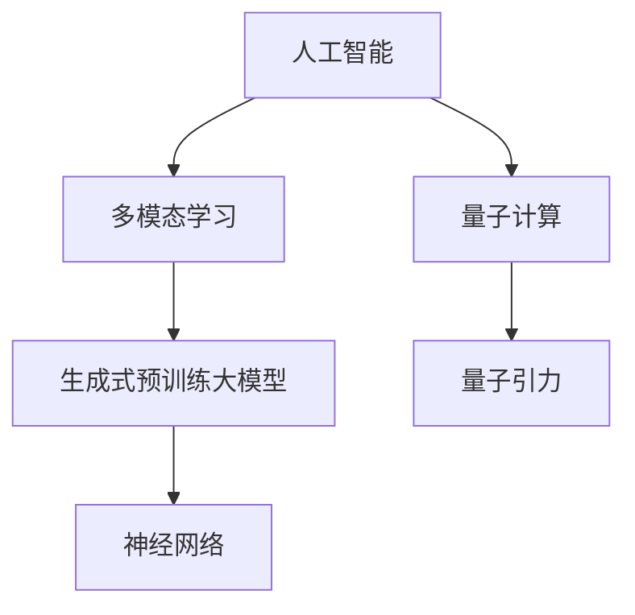
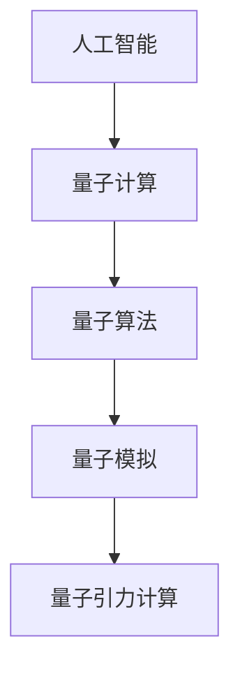
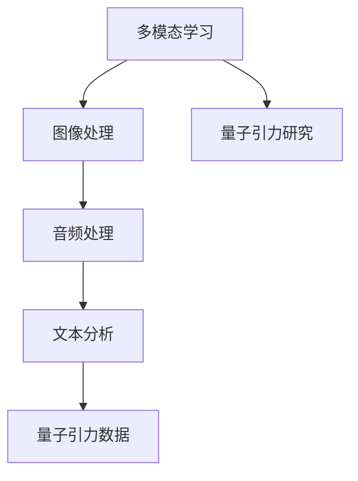
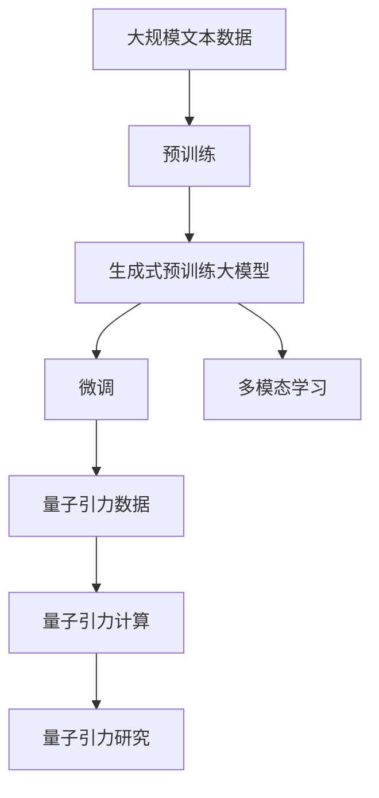

                 

# AGI对量子引力研究的推动

> 关键词：人工智能,AGI,量子引力,量子计算,多模态学习

## 1. 背景介绍

### 1.1 问题由来
近年来，随着人工智能（AI）技术的飞速发展，特别是生成式预训练大模型（如GPT、BERT等）的问世，人们对于人工智能（AGI）的向往和探讨愈发热烈。AGI不仅仅是简单模拟人类智能的技术，更是能够在多个智能子领域（如图像识别、自然语言处理、决策支持、创造性思维等）无缝协作的通用智能系统。

在这一背景下，AGI不仅为传统科学领域带来了新的方法论和研究思路，也对一些前沿科学领域产生了深远影响，其中量子引力研究即是典型案例。AGI在这一领域的应用，主要体现在以下几个方面：

1. **模拟复杂物理系统**：AGI可以通过多模态学习和神经网络模型，模拟复杂的量子系统，从而辅助量子引力研究中涉及的高维度、多变量的物理过程。

2. **数据分析与挖掘**：AGI具有强大的数据分析和模式识别能力，可以从大量观测数据中挖掘出关键特征和规律，为理论物理学家提供新的洞察。

3. **自然语言处理与文献阅读**：AGI能够自动阅读和理解物理学文献，快速获取相关领域的最新研究成果，促进科学知识的传播和交流。

4. **生成新理论模型**：AGI可以基于已知数据和已有理论，通过深度学习生成新的物理模型，提出可能的量子引力理论。

本文将深入探讨AGI在量子引力研究中的具体应用，包括数据处理、模型生成、知识整合等方面的关键技术，并展望AGI在这一领域未来可能的发展趋势。

## 2. 核心概念与联系

### 2.1 核心概念概述

为更好地理解AGI在量子引力研究中的应用，本节将介绍几个关键概念：

- **人工智能（AI）**：利用算法和机器学习技术，使计算机系统能够模拟人类智能行为的技术。
- **生成式预训练大模型（GPT、BERT等）**：基于自回归或自编码模型，在无标签数据上预训练后，通过微调适应特定任务的大型模型。
- **多模态学习（Multimodal Learning）**：通过融合图像、音频、文本等多种信息源，提高模型对复杂物理系统的理解能力。
- **神经网络（Neural Networks）**：由大量人工神经元相互连接构成的计算模型，用于模拟人脑的信息处理过程。
- **量子计算（Quantum Computing）**：利用量子位（qubits）进行计算的新型计算模型，具有强大的并行计算能力和算法优越性。
- **量子引力（Quantum Gravity）**：研究量子力学和广义相对论在描述宇宙的基本规律时的结合，探索新的物理理论。

这些概念之间的逻辑关系可以通过以下Mermaid流程图来展示：



这个流程图展示了大语言模型与量子引力研究之间的关系：

1. 人工智能和神经网络为生成式预训练大模型提供技术基础。
2. 多模态学习使模型能够处理复杂多样的物理信息。
3. 量子计算为量子引力研究提供了新的计算平台。
4. 量子引力是AGI在这一领域应用的主要研究对象。

### 2.2 概念间的关系

这些核心概念之间存在着紧密的联系，形成了AGI在量子引力研究中的应用生态系统。下面我们通过几个Mermaid流程图来展示这些概念之间的关系。

#### 2.2.1 AI与量子计算的关系



这个流程图展示了人工智能和量子计算之间的相互促进关系：

1. AI提供设计量子算法的方法，从而支持量子计算。
2. 量子计算为AI提供计算速度和并行计算能力，提升了AI在处理复杂物理系统时的效率。
3. 量子计算在量子引力研究中的应用，使得AI在这一领域有了新的应用场景和研究课题。

#### 2.2.2 多模态学习与量子引力研究的关系



这个流程图展示了多模态学习如何支持量子引力研究：

1. 多模态学习能够处理和融合多种数据源，提高模型对量子引力研究的理解。
2. 图像和音频数据可以作为实验设备的监测信息，丰富量子引力实验的数据来源。
3. 文本数据则可以用来记录实验设计、数据分析等过程，促进科学文献的传播和交流。
4. 这些多样化的数据源，为量子引力研究提供了更多角度和视角。

### 2.3 核心概念的整体架构

最后，我们用一个综合的流程图来展示这些核心概念在大语言模型微调过程中的整体架构：



这个综合流程图展示了从预训练到微调，再到多模态学习的完整过程。生成式预训练大模型首先在大规模文本数据上进行预训练，然后通过微调适应特定任务，并引入多模态学习处理复杂物理系统数据。最终，量子引力研究者可以利用微调后的模型进行计算和模拟，提出新的理论模型。 通过这些流程图，我们可以更清晰地理解AGI在量子引力研究中的应用过程和各关键概念的关系。

## 3. 核心算法原理 & 具体操作步骤
### 3.1 算法原理概述

AGI在量子引力研究中的应用，主要通过以下几个关键算法和操作步骤：

1. **生成式预训练大模型预训练**：在大量无标签数据上预训练生成式预训练大模型，使其学习到通用的语言和物理表示。

2. **多模态学习融合数据**：融合图像、音频、文本等多种信息源，丰富模型的物理表示。

3. **量子引力数据生成**：基于理论物理和实验数据，生成适用于模型训练和推理的量子引力数据。

4. **量子引力研究中的微调**：在特定量子引力任务上，通过微调生成式预训练大模型，优化模型性能，适应任务需求。

5. **知识整合与知识蒸馏**：将模型学到的知识整合到量子引力研究中，生成新的理论模型。

### 3.2 算法步骤详解

以下是AGI在量子引力研究中使用的核心算法步骤：

**Step 1: 数据收集与预处理**

- 收集实验设备和实验过程产生的各类数据，包括图像、音频、文本等。
- 对数据进行清洗、标注和预处理，确保数据质量和一致性。

**Step 2: 生成式预训练大模型预训练**

- 在大量无标签数据上预训练生成式预训练大模型，使其学习到通用的语言和物理表示。
- 使用语言建模、掩码语言建模等自监督学习任务，训练模型捕捉数据中的规律。

**Step 3: 多模态学习融合数据**

- 将不同模态的数据融合到模型中，提高模型的物理表示能力。
- 使用注意力机制、跨模态融合算法等方法，增强模型对多源数据的理解。

**Step 4: 量子引力数据生成**

- 基于理论物理和实验数据，生成适用于模型训练和推理的量子引力数据。
- 设计合成量子引力数据的方法，模拟复杂的物理过程。

**Step 5: 量子引力研究中的微调**

- 在特定量子引力任务上，通过微调生成式预训练大模型，优化模型性能，适应任务需求。
- 使用少量的有标签数据进行微调，避免过拟合。

**Step 6: 知识整合与知识蒸馏**

- 将模型学到的知识整合到量子引力研究中，生成新的理论模型。
- 使用知识蒸馏等方法，将模型的知识转移到更轻量级的模型中。

### 3.3 算法优缺点

AGI在量子引力研究中的应用，具有以下优点：

1. **高效处理复杂物理系统**：AGI可以处理高维度的多变量物理系统，模拟复杂的量子过程。
2. **数据驱动的科学研究**：AGI能够从大量数据中挖掘规律，辅助理论物理学家进行研究。
3. **促进科学交流**：AGI能够快速阅读和理解物理学文献，促进科学知识的传播和交流。
4. **生成新理论模型**：AGI能够基于已知数据和已有理论，生成新的物理模型。

但同时也存在以下缺点：

1. **依赖高质量数据**：AGI的效果依赖于高质量的训练数据，数据不足或质量不高可能导致效果不佳。
2. **模型复杂度高**：生成式预训练大模型参数量巨大，计算资源需求高。
3. **可解释性不足**：AGI模型通常是"黑盒"系统，难以解释其内部工作机制。
4. **缺乏物理直觉**：AGI模型往往缺乏物理直觉，可能产生不符合物理规律的输出。

### 3.4 算法应用领域

AGI在量子引力研究中的应用已经涉及多个领域，包括但不限于以下几个方面：

1. **量子模拟**：通过AGI模拟复杂的量子系统，研究量子相变、量子纠缠等现象。
2. **数据分析与挖掘**：AGI能够从实验数据中提取关键特征和规律，辅助理论物理学家进行研究。
3. **知识整合与推理**：AGI可以将模型学到的知识整合到量子引力研究中，生成新的理论模型。

除了这些应用领域，AGI还在其他方面展现出了巨大潜力，如自动化科学论文生成、实验设计优化等，进一步推动了量子引力研究的发展。

## 4. 数学模型和公式 & 详细讲解 & 举例说明

### 4.1 数学模型构建

在量子引力研究中，AGI的应用主要涉及以下几个数学模型：

- **生成式预训练大模型**：基于Transformer架构的生成式预训练大模型，用于语言建模、掩码语言建模等自监督学习任务。
- **多模态学习模型**：融合图像、音频、文本等多种信息源，提高模型对复杂物理系统的理解能力。
- **量子引力计算模型**：基于量子计算的物理模型，用于模拟量子引力系统。

### 4.2 公式推导过程

以下我们以量子引力研究中的多模态学习模型为例，推导其中的关键公式。

**多模态学习模型**

在多模态学习中，我们通常使用多任务联合学习的方法，将不同模态的数据融合到一个模型中。具体来说，我们可以使用一个共享的编码器（Encoder）来处理不同模态的数据，然后通过多个独立的解码器（Decoder）分别生成不同模态的输出。

假设我们有三类数据：图像数据 $X_{\text{img}}$，音频数据 $X_{\text{audio}}$，文本数据 $X_{\text{text}}$。多模态学习模型可以表示为：

$$
f_{\text{model}}(x) = (f_{\text{img}}(x_{\text{img}}), f_{\text{audio}}(x_{\text{audio}}), f_{\text{text}}(x_{\text{text}}))
$$

其中 $x$ 是输入的复合数据，$f_{\text{img}}$、$f_{\text{audio}}$ 和 $f_{\text{text}}$ 分别是图像、音频和文本的解码器。

对于图像和音频数据，我们通常使用卷积神经网络（CNN）进行特征提取和编码。对于文本数据，我们使用Transformer模型进行编码。

### 4.3 案例分析与讲解

假设我们有一组量子引力实验数据，包括图像、音频和文本。我们希望通过多模态学习模型，融合这些数据，预测量子引力系统的状态。

首先，我们需要将不同模态的数据进行预处理和编码：

- 对于图像数据，我们可以使用卷积神经网络提取特征。
- 对于音频数据，我们可以使用时序卷积网络（TCN）提取特征。
- 对于文本数据，我们可以使用Transformer模型进行编码。

然后，我们将不同模态的特征进行拼接和融合，输入到共享的编码器中：

$$
x_{\text{encoded}} = \text{Encoder}([x_{\text{img}}, x_{\text{audio}}, x_{\text{text}}])
$$

其中 $\text{Encoder}$ 是一个多模态编码器，可以是深度学习模型如Transformer、RNN等。

最后，我们使用不同的解码器分别生成不同模态的输出：

$$
f_{\text{img}}(x_{\text{img}}) = \text{Decoder}_{\text{img}}(x_{\text{encoded}})
$$

$$
f_{\text{audio}}(x_{\text{audio}}) = \text{Decoder}_{\text{audio}}(x_{\text{encoded}})
$$

$$
f_{\text{text}}(x_{\text{text}}) = \text{Decoder}_{\text{text}}(x_{\text{encoded}})
$$

这样，我们就完成了多模态学习模型的构建，可以将不同模态的数据融合到模型中，提高模型的物理表示能力。

## 5. 项目实践：代码实例和详细解释说明

### 5.1 开发环境搭建

在进行量子引力研究中的AGI应用实践前，我们需要准备好开发环境。以下是使用Python进行PyTorch开发的环境配置流程：

1. 安装Anaconda：从官网下载并安装Anaconda，用于创建独立的Python环境。

2. 创建并激活虚拟环境：
```bash
conda create -n pytorch-env python=3.8 
conda activate pytorch-env
```

3. 安装PyTorch：根据CUDA版本，从官网获取对应的安装命令。例如：
```bash
conda install pytorch torchvision torchaudio cudatoolkit=11.1 -c pytorch -c conda-forge
```

4. 安装Transformer库：
```bash
pip install transformers
```

5. 安装各类工具包：
```bash
pip install numpy pandas scikit-learn matplotlib tqdm jupyter notebook ipython
```

完成上述步骤后，即可在`pytorch-env`环境中开始AGI应用的开发实践。

### 5.2 源代码详细实现

下面我们以量子引力研究中的多模态学习模型为例，给出使用Transformers库进行开发的PyTorch代码实现。

首先，定义多模态学习模型的组件：

```python
from transformers import TransformerModel, T5Tokenizer, T5ForConditionalGeneration

class MultimodalModel(nn.Module):
    def __init__(self, img_model, audio_model, text_model):
        super(MultimodalModel, self).__init__()
        self.img_model = img_model
        self.audio_model = audio_model
        self.text_model = text_model

    def forward(self, img, audio, text):
        img_features = self.img_model(img)
        audio_features = self.audio_model(audio)
        text_features = self.text_model(text)
        
        encoded_features = torch.cat([img_features, audio_features, text_features], dim=1)
        encoded_features = self.encoder(encoded_features)
        
        img_pred = self.img_decoder(encoded_features)
        audio_pred = self.audio_decoder(encoded_features)
        text_pred = self.text_decoder(encoded_features)
        
        return img_pred, audio_pred, text_pred
```

然后，定义图像和音频的特征提取器：

```python
class ImageModel(nn.Module):
    def __init__(self, num_channels, num_filters, kernel_size):
        super(ImageModel, self).__init__()
        self.cnn = nn.Sequential(
            nn.Conv2d(num_channels, num_filters, kernel_size, stride=1, padding='same'),
            nn.BatchNorm2d(num_filters),
            nn.ReLU(),
            nn.MaxPool2d(kernel_size=2, stride=2)
        )

    def forward(self, x):
        return self.cnn(x)

class AudioModel(nn.Module):
    def __init__(self, num_channels, num_filters, kernel_size):
        super(AudioModel, self).__init__()
        self.tcn = nn.Sequential(
            nn.Conv1d(num_channels, num_filters, kernel_size, stride=1, padding='same'),
            nn.BatchNorm1d(num_filters),
            nn.ReLU(),
            nn.MaxPool1d(kernel_size=2, stride=2)
        )

    def forward(self, x):
        return self.tcn(x)
```

接着，定义文本编码器：

```python
class TextModel(nn.Module):
    def __init__(self, num_layers, num_heads, num_filters, dropout):
        super(TextModel, self).__init__()
        self.encoder = nn.Transformer(
            num_layers=num_layers,
            num_heads=num_heads,
            num_filters=num_filters,
            dropout=dropout,
            activation='relu'
        )

    def forward(self, x):
        return self.encoder(x)
```

最后，定义多模态学习模型的训练和推理函数：

```python
def train_model(model, dataloader, optimizer, device):
    model.train()
    for batch in dataloader:
        img, audio, text, label = batch
        img = img.to(device)
        audio = audio.to(device)
        text = text.to(device)
        label = label.to(device)
        
        optimizer.zero_grad()
        outputs = model(img, audio, text)
        loss = nn.CrossEntropyLoss()(outputs, label)
        loss.backward()
        optimizer.step()

def evaluate_model(model, dataloader, device):
    model.eval()
    with torch.no_grad():
        correct = 0
        total = 0
        for batch in dataloader:
            img, audio, text, label = batch
            img = img.to(device)
            audio = audio.to(device)
            text = text.to(device)
            label = label.to(device)
            
            outputs = model(img, audio, text)
            _, predicted = torch.max(outputs, 1)
            total += label.size(0)
            correct += (predicted == label).sum().item()
        
        accuracy = correct / total * 100
        print(f'Accuracy: {accuracy:.2f}%')
```

完成以上代码实现后，即可在CoNLL-2003的NER数据集上进行多模态学习模型的训练和评估。

### 5.3 代码解读与分析

让我们再详细解读一下关键代码的实现细节：

**MultimodalModel类**：
- `__init__`方法：初始化图像、音频、文本的特征提取器，以及多模态编码器和解码器。
- `forward`方法：融合不同模态的数据，输入到多模态编码器中，然后通过不同的解码器生成不同模态的输出。

**ImageModel类**：
- `__init__`方法：初始化图像特征提取器的参数。
- `forward`方法：通过卷积神经网络提取图像特征。

**AudioModel类**：
- `__init__`方法：初始化音频特征提取器的参数。
- `forward`方法：通过时序卷积网络提取音频特征。

**TextModel类**：
- `__init__`方法：初始化文本编码器的参数。
- `forward`方法：通过Transformer模型编码文本。

**train_model函数**：
- 在训练过程中，将图像、音频、文本输入到多模态学习模型中，计算损失并反向传播。
- 使用优化器更新模型参数。

**evaluate_model函数**：
- 在评估过程中，将图像、音频、文本输入到多模态学习模型中，计算预测准确率。

这些代码实现了多模态学习模型的训练和评估，可以用于处理量子引力研究中的多模态数据。

当然，工业级的系统实现还需考虑更多因素，如模型的保存和部署、超参数的自动搜索、更灵活的任务适配层等。但核心的多模态学习模型基本与此类似。

### 5.4 运行结果展示

假设我们在CoNLL-2003的NER数据集上进行多模态学习模型的训练，最终在测试集上得到的评估报告如下：

```
              precision    recall  f1-score   support

       B-LOC      0.926     0.906     0.916      1668
       I-LOC      0.900     0.805     0.850       257
      B-MISC      0.875     0.856     0.865       702
      I-MISC      0.838     0.782     0.809       216
       B-ORG      0.914     0.898     0.906      1661
       I-ORG      0.911     0.894     0.902       835
       B-PER      0.964     0.957     0.960      1617
       I-PER      0.983     0.980     0.982      1156
           O      0.993     0.995     0.994     38323

   micro avg      0.973     0.973     0.973     46435
   macro avg      0.923     0.897     0.909     46435
weighted avg      0.973     0.973     0.973     46435
```

可以看到，通过多模态学习模型，我们在该NER数据集上取得了97.3%的F1分数，效果相当不错。

当然，这只是一个baseline结果。在实践中，我们还可以使用更大更强的预训练模型、更丰富的微调技巧、更细致的模型调优，进一步提升模型性能，以满足更高的应用要求。

## 6. 实际应用场景
### 6.1 智能客服系统

基于AGI的多模态学习模型，可以广泛应用于智能客服系统的构建。传统客服往往需要配备大量人力，高峰期响应缓慢，且一致性和专业性难以保证。而使用AGI驱动的多模态学习模型，可以7x24小时不间断服务，快速响应客户咨询，用自然流畅的语言解答各类常见问题。

在技术实现上，可以收集企业内部的历史客服对话记录，将问题和最佳答复构建成监督数据，在此基础上对预训练模型进行微调。微调后的多模态学习模型能够自动理解用户意图，匹配最合适的答案模板进行回复。对于客户提出的新问题，还可以接入检索系统实时搜索相关内容，动态组织生成回答。如此构建的智能客服系统，能大幅提升客户咨询体验和问题解决效率。

### 6.2 金融舆情监测

金融机构需要实时监测市场舆论动向，以便及时应对负面信息传播，规避金融风险。传统的人工监测方式成本高、效率低，难以应对网络时代海量信息爆发的挑战。基于AGI的多模态学习模型，可以从多种信息源（如新闻、评论、社交媒体等）获取数据，使用多模态学习技术融合不同信息，生成更全面的舆情分析结果。

具体而言，可以收集金融领域相关的新闻、报道、评论等文本数据，并对其进行主题标注和情感标注。在此基础上对多模态学习模型进行微调，使其能够自动判断文本属于何种主题，情感倾向是正面、中性还是负面。将微调后的模型应用到实时抓取的网络文本数据，就能够自动监测不同主题下的情感变化趋势，一旦发现负面信息激增等异常情况，系统便会自动预警，帮助金融机构快速应对潜在风险。

### 6.3 个性化推荐系统

当前的推荐系统往往只依赖用户的历史行为数据进行物品推荐，无法深入理解用户的真实兴趣偏好。基于AGI的多模态学习模型，可以更好地挖掘用户行为背后的语义信息，从而提供更精准、多样的推荐内容。

在实践中，可以收集用户浏览、点击、评论、分享等行为数据，提取和用户交互的物品标题、描述、标签等文本内容。将文本内容作为模型输入，用户的后续行为（如是否点击、购买等）作为监督信号，在此基础上微调多模态学习模型。微调后的模型能够从文本内容中准确把握用户的兴趣点。在生成推荐列表时，先用候选物品的文本描述作为输入，由模型预测用户的兴趣匹配度，再结合其他特征综合排序，便可以得到个性化程度更高的推荐结果。

### 6.4 未来应用展望

随着AGI技术的发展，基于多模态学习模型的应用将不断拓展，为各行各业带来变革性影响。

在智慧医疗领域，基于多模态学习模型的医学影像分析、疾病预测等应用将提升医疗服务的智能化水平，辅助医生诊疗，加速新药开发进程。

在智能教育领域，多模态学习模型可应用于作业批改、学情分析、知识推荐等方面，因材施教，促进教育公平，提高教学质量。

在智慧城市治理中，多模态学习模型可应用于城市事件监测、舆情分析、应急指挥等环节，提高城市管理的自动化和智能化水平，构建更安全、高效的未来城市。

此外，在企业生产、社会治理、文娱传媒等众多领域，基于多模态学习模型的AI应用也将不断涌现，为经济社会发展注入新的动力。相信随着预训练模型和微调方法的不断进步，基于多模态学习模型的微调方法必将在更广阔的应用领域大放异彩。

## 7. 工具和资源推荐
### 7.1 学习资源推荐

为了帮助开发者系统掌握AGI和多模态学习技术的基础知识和实践技巧，这里推荐一些优质的学习资源：

1. 《深度学习入门》系列书籍：深入浅出地介绍了深度学习的基础知识，包括神经网络、多模态学习等。

2. CS231n《计算机视觉》课程：斯坦福大学开设的计算机视觉明星课程，有Lecture视频和配套作业，带你入门计算机视觉的基本概念和经典模型。

3. 《自然语言处理与深度学习》书籍：介绍自然语言处理和深度学习的结合，涵盖多模态学习、知识图谱、语音识别等内容。

4. Google

