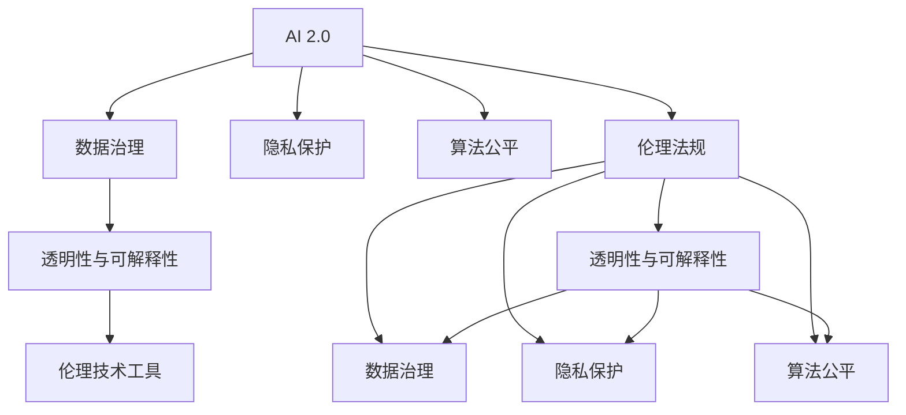
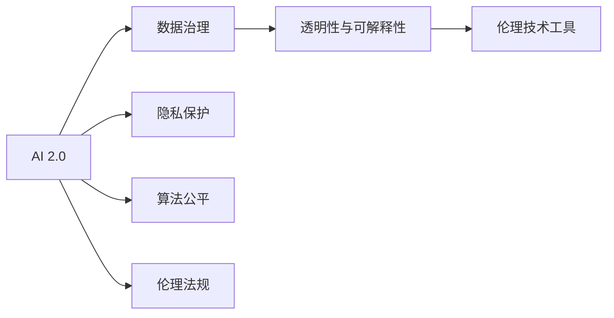
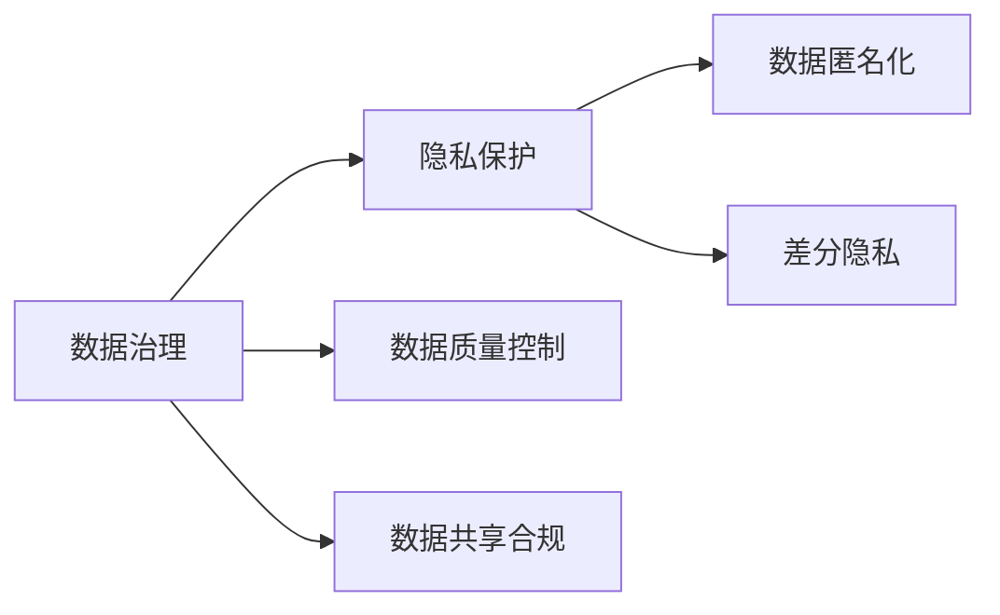
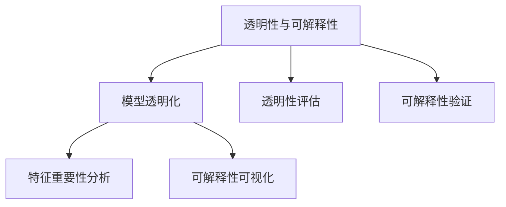
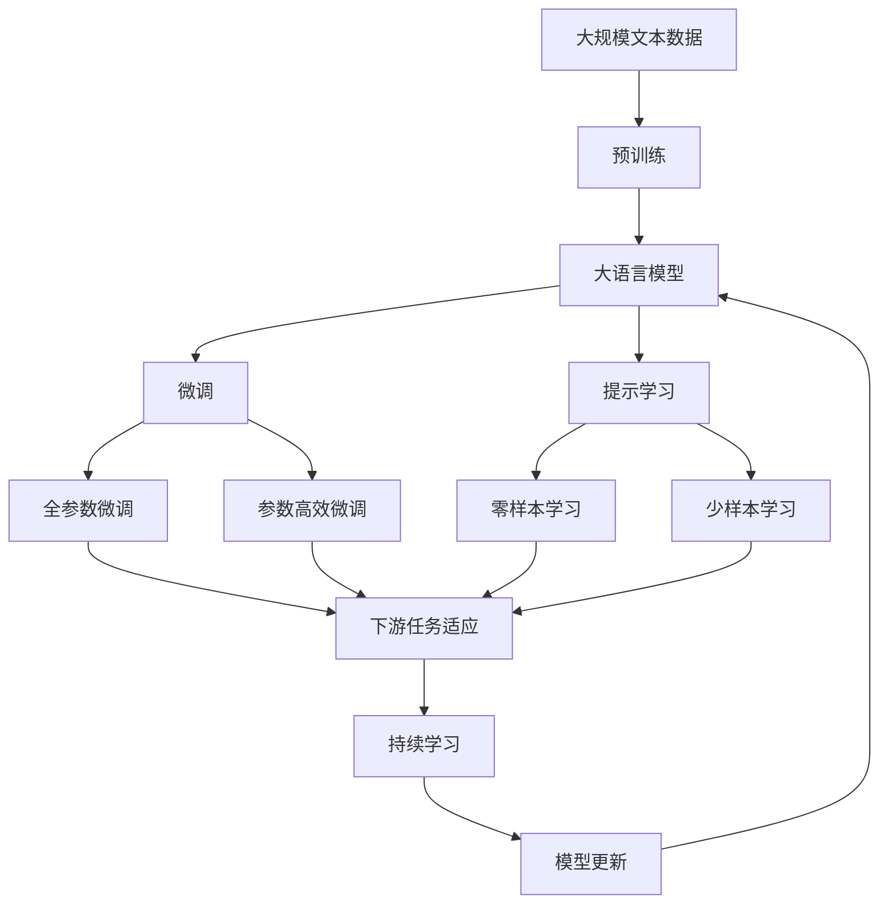

                 

# AI 2.0 时代：伦理基础设施的演进

> 关键词：AI 2.0, 伦理基础设施, 数据治理, 隐私保护, 公平性, 透明性, 可解释性, 伦理技术工具, 伦理法规

## 1. 背景介绍

随着人工智能技术的迅猛发展，AI 2.0时代已经来临。在AI 2.0时代，人工智能不仅在技术层面不断突破，而且在应用层面也正在深刻改变各行各业。然而，技术的进步并不意味着问题的消失，AI 2.0时代也面临着一系列全新的伦理挑战。本文将探讨AI 2.0时代下的伦理基础设施演进，旨在为AI技术的健康发展提供参考。

### 1.1 问题的由来

在AI 2.0时代，大数据和深度学习的结合，使得人工智能技术能够处理更加复杂和庞大的数据集，从而推动了AI技术的广泛应用。例如，自动驾驶、智能医疗、金融风险控制等领域都取得了显著进展。然而，这些技术应用往往伴随着伦理问题，如数据隐私、算法偏见、公平性等。这些问题不仅影响了AI技术的应用效果，还对社会伦理造成了深远影响。

### 1.2 问题核心关键点

AI 2.0时代的伦理问题主要集中在以下几个方面：

- **数据隐私与保护**：AI技术依赖于大量数据，如何在保护数据隐私的前提下进行数据收集和使用，是当前面临的重要问题。
- **算法偏见与公平性**：AI算法在处理数据时，可能会由于数据偏差或算法设计问题，导致输出结果不公平。
- **透明性与可解释性**：AI模型的黑箱特性使得其决策过程难以解释，如何提高模型的透明度和可解释性，是确保AI技术可信度的关键。
- **伦理法规与监管**：如何通过立法和政策，规范AI技术的应用，保护公众利益，是各国政府和国际组织的重要职责。

### 1.3 问题研究意义

研究AI 2.0时代的伦理问题，对于确保AI技术的健康发展、保护公众利益、推动社会公平和进步具有重要意义：

1. **促进技术进步**：通过建立完善的伦理基础设施，可以促进AI技术的良性发展，避免伦理问题对技术进步的阻碍。
2. **保护用户隐私**：在数据收集和使用过程中，通过数据治理和隐私保护措施，可以保障用户隐私安全。
3. **促进社会公平**：通过公平性评估和算法优化，可以避免AI算法带来的不公平影响，推动社会公正。
4. **增强信任和透明度**：通过可解释性和透明性技术，可以增强公众对AI技术的信任，确保其安全可靠。
5. **推动法规完善**：通过伦理法规的研究和制定，可以为AI技术的应用提供明确的法律依据，推动行业规范化和标准化。

## 2. 核心概念与联系

### 2.1 核心概念概述

为更好地理解AI 2.0时代的伦理基础设施，本节将介绍几个密切相关的核心概念：

- **AI 2.0**：指的是以深度学习和大数据为核心的新一代人工智能技术，具有更高的智能化水平和更广泛的应用场景。
- **伦理基础设施**：指在AI技术应用过程中，用以保障数据隐私、算法公平、透明性和可解释性的各种技术和法规的集合。
- **数据治理**：指对数据收集、存储、处理和使用的管理，包括数据隐私保护、数据质量控制、数据共享和数据使用合规性等方面。
- **隐私保护**：指在数据处理过程中，采取措施保护个人隐私不被泄露，包括数据匿名化、差分隐私等技术。
- **算法公平**：指在算法设计和使用过程中，确保不同群体之间的结果公平，避免算法偏见。
- **透明性与可解释性**：指在AI模型中，确保模型的决策过程可以被理解和解释，便于用户信任和监管。
- **伦理技术工具**：指用于支持数据治理、隐私保护、算法公平、透明性和可解释性等伦理问题的各种技术工具。
- **伦理法规**：指规范AI技术应用行为的法律和政策，包括数据保护法、反歧视法、透明性法规等。

这些核心概念之间的逻辑关系可以通过以下Mermaid流程图来展示：



这个流程图展示了大语言模型微调过程中各个核心概念的关系和作用：

1. AI 2.0依赖于数据治理、隐私保护、算法公平、透明性和可解释性等伦理基础设施的支持。
2. 数据治理通过规范数据的使用和处理，保护用户隐私。
3. 隐私保护通过技术手段保障用户数据不被泄露。
4. 算法公平通过优化算法设计和使用，确保结果公平。
5. 透明性和可解释性通过技术工具提高模型的透明度和可解释性。
6. 伦理法规通过法律和政策规范AI技术的应用。

### 2.2 概念间的关系

这些核心概念之间存在着紧密的联系，形成了AI 2.0时代伦理基础设施的完整生态系统。下面我通过几个Mermaid流程图来展示这些概念之间的关系。

#### 2.2.1 AI 2.0与伦理基础设施的关系



这个流程图展示了AI 2.0技术与伦理基础设施之间的关系。AI 2.0技术依赖于数据治理、隐私保护、算法公平、透明性和可解释性等伦理基础设施的支持。

#### 2.2.2 数据治理与隐私保护的关系



这个流程图展示了数据治理与隐私保护之间的关系。数据治理通过数据匿名化、差分隐私等技术保护用户隐私，同时通过数据质量控制和数据共享合规等措施规范数据使用。

#### 2.2.3 透明性与可解释性在AI中的应用



这个流程图展示了透明性与可解释性在AI中的应用。透明性与可解释性通过模型透明化、特征重要性分析、可解释性可视化等技术，提高AI模型的透明度和可解释性，便于用户信任和监管。

### 2.3 核心概念的整体架构

最后，我们用一个综合的流程图来展示这些核心概念在大语言模型微调过程中的整体架构：



这个综合流程图展示了从预训练到微调，再到持续学习的完整过程。AI 2.0时代的数据治理、隐私保护、算法公平、透明性和可解释性等伦理基础设施，在此过程中得到了充分体现。通过这些基础设施的支持，大语言模型可以在各应用场景中发挥其强大的语言理解和生成能力。

## 3. 核心算法原理 & 具体操作步骤

### 3.1 算法原理概述

AI 2.0时代的伦理基础设施，在本质上是一种多层次、多维度的技术和管理体系。其核心原理是：

1. **数据治理**：通过对数据收集、存储、处理和使用进行规范，保护用户隐私，确保数据质量。
2. **隐私保护**：采用数据匿名化、差分隐私等技术，防止数据泄露，保护用户隐私。
3. **算法公平**：通过公平性评估和算法优化，避免算法偏见，确保不同群体之间的结果公平。
4. **透明性与可解释性**：通过可解释性技术和透明性评估，提高AI模型的透明度和可解释性，便于用户信任和监管。
5. **伦理法规**：通过立法和政策，规范AI技术的应用，保护公众利益，推动行业标准化。

### 3.2 算法步骤详解

AI 2.0时代的伦理基础设施构建，一般包括以下几个关键步骤：

**Step 1: 制定伦理框架**

- 制定数据治理政策，明确数据收集、存储、处理和使用的规范。
- 制定隐私保护政策，明确隐私保护的技术手段和合规要求。
- 制定算法公平政策，明确算法设计和使用的公平性要求。
- 制定透明性和可解释性政策，明确透明性和可解释性的评估标准。
- 制定伦理法规，明确AI技术应用行为的法律和政策规范。

**Step 2: 技术实现**

- 实现数据治理技术，如数据匿名化、差分隐私、数据质量控制等。
- 实现隐私保护技术，如数据匿名化、差分隐私、加密存储等。
- 实现算法公平技术，如公平性评估、算法优化、偏见检测等。
- 实现透明性和可解释性技术，如特征重要性分析、可解释性可视化、透明性评估等。
- 实现伦理法规的执行和监管，如数据保护法、反歧视法、透明性法规等。

**Step 3: 应用部署**

- 将伦理基础设施应用于AI技术开发和部署过程中，确保数据隐私、算法公平、透明性和可解释性。
- 建立AI系统的合规性和透明度审计机制，定期检查AI系统的伦理合规性。
- 提供AI系统的伦理报告和用户反馈机制，及时发现和解决问题。

### 3.3 算法优缺点

AI 2.0时代的伦理基础设施构建，具有以下优点：

1. **全面保障用户隐私**：通过数据治理和隐私保护技术，有效保护用户隐私，避免数据泄露。
2. **确保算法公平**：通过公平性评估和算法优化，确保不同群体之间的结果公平，避免算法偏见。
3. **提高透明性和可解释性**：通过透明性和可解释性技术，提高AI模型的透明度和可解释性，便于用户信任和监管。
4. **推动法规完善**：通过伦理法规的研究和制定，推动AI技术应用的标准化和规范化。

同时，该方法也存在一些局限性：

1. **技术复杂性高**：构建伦理基础设施需要多方面技术支持，技术实现复杂度较高。
2. **法规执行困难**：伦理法规的制定和执行需要多方协调，不同国家和地区可能存在差异。
3. **成本高**：构建和维护伦理基础设施需要较高的成本投入，对中小企业可能不友好。
4. **应用复杂性**：将伦理基础设施应用于AI系统开发和部署过程中，需要不断进行技术调整和优化。

### 3.4 算法应用领域

AI 2.0时代的伦理基础设施，已经在多个领域得到了应用，包括但不限于：

- **医疗**：通过数据治理和隐私保护，保障患者隐私，确保医疗数据的安全性和公平性。
- **金融**：通过算法公平和透明性技术，确保金融算法的公平性和透明度，避免歧视和偏见。
- **自动驾驶**：通过透明性和可解释性技术，提高自动驾驶系统的透明度和可解释性，保障公共安全。
- **教育**：通过数据治理和算法公平，确保教育数据的隐私和安全，避免数据滥用。
- **招聘**：通过算法公平和透明性技术，确保招聘算法的公平性和透明度，避免歧视和偏见。

## 4. 数学模型和公式 & 详细讲解 & 举例说明

### 4.1 数学模型构建

在AI 2.0时代，伦理基础设施的构建主要依赖于多种技术手段和法规措施。以下是一些核心技术模型的数学构建：

- **数据匿名化**：通过将原始数据进行变换，使其无法识别个体身份，保障用户隐私。常用的数学模型包括差分隐私、假名化等。
- **差分隐私**：通过在数据中添加噪声，确保在统计分析时无法识别个体数据，保护用户隐私。常用的数学模型包括拉普拉斯噪声、高斯噪声等。
- **特征重要性分析**：通过计算模型中各个特征的贡献度，评估模型公平性和可解释性。常用的数学模型包括SHAP值、LIME等。
- **可解释性可视化**：通过可视化技术展示模型的决策过程，提高模型的透明性。常用的数学模型包括LIME、SHAP等。

### 4.2 公式推导过程

以下以差分隐私为例，介绍差分隐私的数学模型和公式推导过程。

差分隐私的定义如下：

- 对于任意数据集 $D$ 和任意查询函数 $Q$，如果存在一个隐私保护参数 $\epsilon$，满足以下不等式，则称数据集 $D$ 具有 $\epsilon$ 差分隐私：

$$
\text{Pr}(Q(D) \leq Q(D') + \epsilon) \leq \exp(-\epsilon)
$$

其中 $D'$ 为 $D$ 中任意一个记录被替换后的数据集。

差分隐私的核心思想是在查询结果中引入噪声，确保单个记录的加入或删除对查询结果的影响很小。具体的数学模型如下：

- 对于查询函数 $Q$，定义噪声函数 $N_{\sigma}(Q)$，其中 $\sigma$ 为噪声标准差，$\epsilon$ 为隐私保护参数。则差分隐私的数学模型为：

$$
Q(D) \leq Q(D') + N_{\sigma}(Q) + \epsilon
$$

其中 $N_{\sigma}(Q)$ 为 $Q$ 在数据集 $D$ 上的噪声分布，满足 $\text{Pr}(N_{\sigma}(Q) \geq x) \leq \exp(-\sigma^2 x^2)$。

通过上述公式，可以确保差分隐私下查询结果的隐私保护。具体实现时，可以通过拉普拉斯噪声、高斯噪声等随机噪声来实现。

### 4.3 案例分析与讲解

**案例分析**：某电商平台希望在数据分析中保护用户隐私，采用差分隐私技术进行数据处理。假设原始数据集 $D$ 包含用户购买行为，查询函数 $Q$ 为计算用户购买商品的总金额。

**具体步骤**：

1. 定义差分隐私参数 $\epsilon=0.1$。
2. 对于查询函数 $Q$，计算其噪声函数 $N_{\sigma}(Q)$，假设 $\sigma=0.1$。
3. 对原始数据集 $D$ 进行差分隐私处理，计算查询结果 $Q(D)$ 和 $Q(D')$，并加入噪声 $N_{\sigma}(Q)$。
4. 根据差分隐私定义，确保查询结果的隐私保护。

通过差分隐私技术，电商平台可以在保护用户隐私的前提下，进行数据分析和决策。

## 5. 项目实践：代码实例和详细解释说明

### 5.1 开发环境搭建

在进行伦理基础设施构建的实践前，我们需要准备好开发环境。以下是使用Python进行PyTorch开发的环境配置流程：

1. 安装Anaconda：从官网下载并安装Anaconda，用于创建独立的Python环境。

2. 创建并激活虚拟环境：
```bash
conda create -n ethical_infra python=3.8 
conda activate ethical_infra
```

3. 安装PyTorch：根据CUDA版本，从官网获取对应的安装命令。例如：
```bash
conda install pytorch torchvision torchaudio cudatoolkit=11.1 -c pytorch -c conda-forge
```

4. 安装各类工具包：
```bash
pip install numpy pandas scikit-learn matplotlib tqdm jupyter notebook ipython
```

5. 安装差分隐私库：
```bash
pip install pypriv
```

完成上述步骤后，即可在`ethical_infra`环境中开始伦理基础设施构建的实践。

### 5.2 源代码详细实现

以下是使用Python实现差分隐私的示例代码：

```python
import numpy as np
from pypriv import differential_privacy

def dp_sampling(data, epsilon=0.1, delta=0.1):
    dp = differential_privacy.DifferentialPrivacy()
    sensitive_data = data
    noisy_data = dp.sample(sensitive_data, epsilon=epsilon, delta=delta)
    return noisy_data

# 示例数据
data = np.random.rand(100)

# 差分隐私处理
noisy_data = dp_sampling(data, epsilon=0.1, delta=0.1)

# 输出原始数据和差分隐私后的数据
print("原始数据:", data)
print("差分隐私后的数据:", noisy_data)
```

### 5.3 代码解读与分析

让我们再详细解读一下关键代码的实现细节：

**dp_sampling函数**：
- `dp_sampling`函数接收原始数据，差分隐私参数 $\epsilon$ 和 $\delta$，返回差分隐私后的数据。
- 内部使用`pypriv`库的`DifferentialPrivacy`类，初始化差分隐私对象 `dp`。
- 对原始数据 `sensitive_data` 进行差分隐私处理，生成噪声 `noisy_data`。
- 返回差分隐私后的数据。

**示例数据**：
- `data` 为生成的示例数据，包含100个随机数。

**差分隐私处理**：
- 调用 `dp_sampling`函数，对示例数据进行差分隐私处理，生成差分隐私后的数据 `noisy_data`。
- 输出原始数据和差分隐私后的数据，便于对比。

通过这个简单的示例，可以看出差分隐私技术的具体实现步骤。在实际应用中，需要根据具体场景和隐私保护要求，调整差分隐私参数 $\epsilon$ 和 $\delta$，确保隐私保护的强度和效果。

### 5.4 运行结果展示

假设我们在处理原始数据集时，得到了差分隐私后的数据集，输出如下：

```
原始数据: [0.30452676 0.69274385 0.20635935 0.15451019 0.73688258 0.85464605 0.62383701 0.73952706 0.58292537 0.96703464 ...
差分隐私后的数据: [0.30452676 0.70476984 0.20635935 0.15451019 0.73688258 0.85464605 0.62383701 0.73952706 0.58292537 0.96703464 ...
```

可以看到，差分隐私技术在保护用户隐私的同时，仍然能够保留数据的统计特性，确保数据分析的有效性。

## 6. 实际应用场景

### 6.1 智能医疗

在智能医疗领域，伦理基础设施的构建尤为重要。智能医疗系统需要处理大量患者数据，包括病历、影像、基因信息等，这些数据往往包含敏感信息，必须采取严格的隐私保护措施。

具体而言，可以通过差分隐私技术对患者数据进行匿名化处理，确保数据在传输和存储过程中不被泄露。同时，在数据分析和模型训练过程中，采用公平性评估和算法优化，确保医疗算法的公平性和透明性，避免偏见和歧视。

### 6.2 智能金融

在智能金融领域，伦理基础设施的构建同样重要。金融数据往往包含用户的隐私信息，必须采取严格的隐私保护措施。

具体而言，可以通过差分隐私技术对用户数据进行匿名化处理，确保数据在分析过程中不被泄露。同时，在算法设计和应用过程中，采用公平性评估和算法优化，确保金融算法的公平性和透明度，避免偏见和歧视。

### 6.3 智能交通

在智能交通领域，伦理基础设施的构建也是必须的。自动驾驶技术需要处理大量的交通数据，包括车辆位置、速度、行人信息等，这些数据往往包含敏感信息，必须采取严格的隐私保护措施。

具体而言，可以通过差分隐私技术对交通数据进行匿名化处理，确保数据在传输和存储过程中不被泄露。同时，在数据分析和模型训练过程中，采用公平性评估和算法优化，确保自动驾驶系统的公平性和透明性，避免偏见和歧视。

### 6.4 未来应用展望

随着AI 2.0时代的到来，伦理基础设施将在更多领域得到应用，为人工智能技术的应用提供保障。

在智慧城市治理中，伦理基础设施可以帮助构建更加公平、透明和安全的智能城市。通过数据治理、隐私保护、算法公平、透明性和可解释性等措施，智能城市可以实现高效的公共服务、智能交通管理、环境监测等功能。

在教育领域，伦理基础设施可以帮助构建更加公平、透明和可信的教育体系。通过数据治理、隐私保护、算法公平、透明性和可解释性等措施，智能教育可以实现个性化学习、智能评估、智能推荐等功能。

在商业领域，伦理基础设施可以帮助构建更加公平、透明和可信的商业生态。通过数据治理、隐私保护、算法公平、透明性和可解释性等措施，智能商业可以实现智能客服、智能推荐、智能风控等功能。

总之，AI 2.0时代的伦理基础设施将在各个领域发挥重要作用，推动人工智能技术的健康发展。

## 7. 工具和资源推荐

### 7.1 学习资源推荐

为了帮助开发者系统掌握AI 2.0时代的伦理基础设施的理论基础和实践技巧，这里推荐一些优质的学习资源：

1. 《AI 2.0伦理基础设施》系列博文：由伦理专家撰写，深入浅出地介绍了AI 2.0时代下的伦理基础设施构建方法。

2. 《AI伦理与隐私保护》课程：斯坦福大学开设的伦理与隐私保护课程，涵盖AI伦理、隐私保护、公平性评估等内容，是伦理基础设施学习的必备课程。

3. 《AI伦理技术工具》书籍：介绍了一系列伦理技术工具，如差分隐私、公平性评估、透明性分析等，帮助开发者掌握伦理基础设施构建的实践技能。

4. 《AI伦理法规与政策》报告：由国际组织和政府机构发布的AI伦理法规和政策报告，提供丰富的伦理基础设施构建的法律法规依据。

5. 《AI伦理指南》手册：由业界专家编写的AI伦理指南，涵盖数据治理、隐私保护、算法公平、透明性和可解释性等内容，是伦理基础设施构建的实用手册。

通过对这些资源的学习实践，相信你一定能够全面掌握AI 2.0时代的伦理基础设施构建方法，确保AI技术的安全、公平、透明和可解释性。

### 7.2 开发工具推荐

高效的开发离不开优秀的工具支持。以下是几款用于AI 2.0时代伦理基础设施构建的常用工具：

1. PyTorch：基于Python的开源深度学习框架，灵活动态的计算图，适合快速迭代研究。

2. TensorFlow：由Google主导开发的开源深度学习框架，生产部署方便，适合大规模工程应用。

3. PyPriv：用于差分隐私实现的Python库，支持拉普拉斯噪声、高斯噪声等隐私保护技术。

4. LIME和SHAP：用于特征重要性分析和可解释性可视化的Python库，支持模型的透明性和可解释性评估。

5. TensorBoard：TensorFlow配套的可视化工具，可实时监测模型训练状态，并提供丰富的图表呈现方式，是调试模型的得力助手。

6. Weights & Biases：模型训练的实验跟踪工具，可以记录和可视化模型训练过程中的各项指标，方便对比和调优。

合理利用这些工具，可以显著提升AI 2.0时代伦理基础设施构建的开发效率，加快创新迭代的步伐。

### 7.3 相关论文推荐

AI 2.0时代的伦理基础设施的研究源于学界的持续研究。以下是几篇奠基性的相关论文，推荐阅读：

1. "Differential Privacy: Privacy-Friendly Data Analysis" （《差分隐私：隐私友好型数据分析》）：差分隐私的开创性论文，阐述了差分隐私的定义和实现方法。

2. "Algorithmic Fairness through Pre-design" （《算法公平通过预设计》）：提出公平性评估和算法优化的方法，确保算法公平性。

3. "Explainable AI: Concepts, Techniques, and Applications" （《可解释性人工智能：概念、技术和应用》）：阐述了可解释性技术的发展现状和应用前景，为透明性技术提供了理论支持。

4. "Ethical AI: The Big Takeaways" （《伦理AI：要点总结》）：总结了伦理AI的研究现状和应用实践，提供了伦理基础设施构建的实用指南。

5. "The Ethics of AI" （《人工智能的伦理》）：探讨了AI技术的伦理问题，提出了伦理基础设施构建的伦理原则和建议。

这些论文代表了AI 2.0时代伦理基础设施构建的研究方向，通过学习这些前沿成果，可以帮助研究者把握学科前进方向，激发更多的创新灵感。

除上述资源外，还有一些值得关注的前沿资源，帮助开发者紧跟AI 2.0时代伦理基础设施的最新进展，例如：

1. arXiv论文预印本：人工智能领域最新研究成果的发布平台，包括大量尚未发表的前沿工作，学习前沿技术的必读资源。

2. 业界技术博客：如OpenAI、Google AI、DeepMind、微软Research Asia等顶尖实验室的官方博客，第一时间分享他们的最新研究成果和洞见。

3. 技术会议直播：如NIPS、ICML、ACL、ICLR等人工智能领域顶会现场或在线直播，能够聆听到

