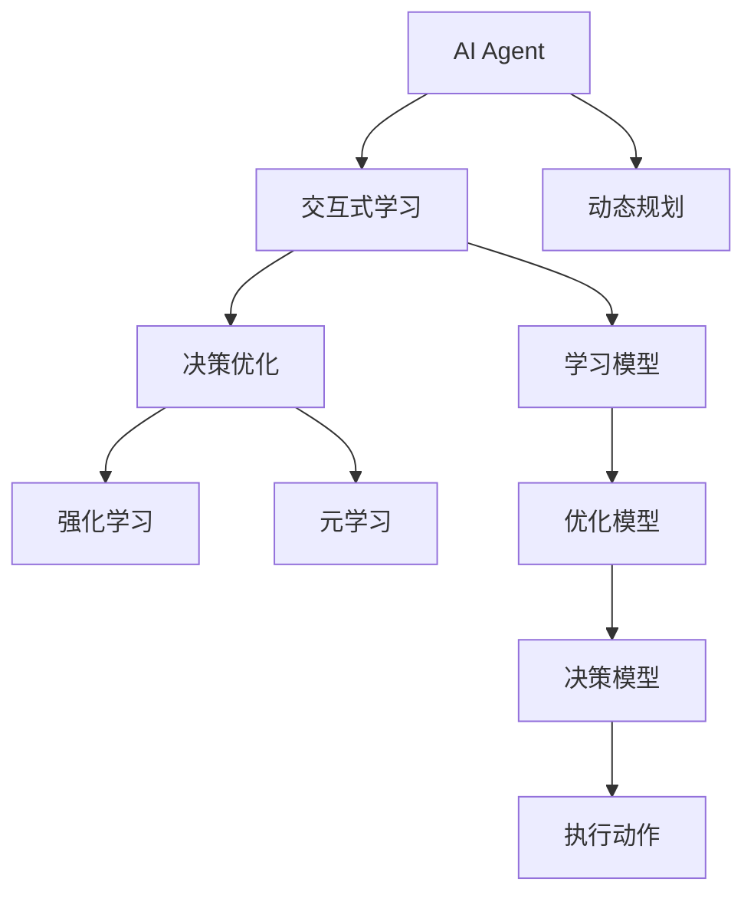

                 

# AI Agent: AI的下一个风口 交互式学习与决策优化

> 关键词：AI Agent, 交互式学习, 决策优化, 强化学习, 动态规划, 元学习, 深度学习, 自适应

## 1. 背景介绍

### 1.1 问题由来
人工智能（AI）技术经过数十年的发展，已在众多领域中展现出了巨大的潜力。无论是图像识别、自然语言处理、语音识别，还是自动驾驶、智能客服、医疗诊断等领域，AI技术都取得了显著的成果。然而，面对日益复杂和多变的现实世界，传统的AI技术面临着新的挑战。

特别是当AI系统需要在不确定的环境中进行决策时，传统的监督学习（Supervised Learning）和无监督学习（Unsupervised Learning）方法往往难以有效应对。例如，在自动驾驶中，车辆需要实时感知周围环境并做出反应；在智能客服中，系统需要动态理解用户需求并提供个性化服务；在医疗诊断中，模型需要根据病人的历史数据和实时监测结果给出诊断建议。

为了解决这些现实问题，交互式学习和决策优化成为AI技术的下一个风口。交互式学习通过与环境的动态交互来不断调整和优化AI模型，而决策优化则帮助AI系统在不确定性条件下做出最优决策。

### 1.2 问题核心关键点
交互式学习和决策优化是AI技术的新兴方向，核心在于以下几个方面：

- **交互式学习**：通过与环境的动态交互，AI系统可以不断调整和优化自身参数，适应复杂多变的环境。
- **决策优化**：在不确定性条件下，AI系统通过优化算法选择最优的决策策略，以实现最佳的效果。
- **强化学习（Reinforcement Learning, RL）**：是一种通过与环境交互来学习最优决策的AI技术。
- **元学习（Meta Learning）**：指AI系统能够从少量数据中学习快速适应新任务的能力。
- **动态规划（Dynamic Programming）**：一种系统化的决策优化方法，广泛应用于优化问题中。

这些关键点相互联系，共同构成了交互式学习和决策优化的核心框架。通过这些技术，AI系统可以在动态变化的环境中高效学习，做出最优决策，提升其在现实世界中的表现。

### 1.3 问题研究意义
交互式学习和决策优化技术的突破，对于推动AI技术的普及应用，提升AI系统的智能水平，具有重要意义：

1. **适应复杂环境**：AI系统能够在不断变化的环境中持续学习，适应新的场景和任务。
2. **提升决策质量**：通过优化算法，AI系统能够在不确定性条件下做出最优决策，提升系统性能。
3. **降低人工干预**：交互式学习使得AI系统可以自主调整参数，减少人工干预，提高系统效率。
4. **加速应用部署**：决策优化方法可以加速AI系统在实际应用中的部署和优化，缩短开发周期。
5. **创新算法应用**：交互式学习和决策优化为新的算法研究和应用提供了广阔空间，推动AI技术的持续创新。

## 2. 核心概念与联系

### 2.1 核心概念概述

为更好地理解交互式学习和决策优化的核心概念，本节将介绍几个密切相关的核心概念：

- **AI Agent**：指能够在环境中自主行动和决策的AI系统，通过感知、学习、决策等过程实现其目标。
- **交互式学习**：AI Agent通过与环境的交互来学习适应新任务和环境的方法，不断优化自身行为。
- **决策优化**：在动态变化的环境中，AI Agent通过优化算法选择最优的决策策略，以实现最佳的效果。
- **强化学习**：一种通过与环境交互来学习最优决策的AI技术，通过奖励和惩罚机制指导学习过程。
- **元学习**：AI Agent能够从少量数据中学习快速适应新任务的能力，提升学习效率。
- **动态规划**：一种系统化的决策优化方法，通过分解问题、迭代优化来求解最优决策。

这些核心概念之间存在着紧密的联系，构成了交互式学习和决策优化的完整生态系统。通过理解这些核心概念，我们可以更好地把握交互式学习和决策优化的工作原理和优化方向。

### 2.2 概念间的关系

这些核心概念之间存在着紧密的联系，形成了交互式学习和决策优化的完整生态系统。下面我们通过几个Mermaid流程图来展示这些概念之间的关系：



这个流程图展示了大模型微调过程中各个核心概念的关系：

1. AI Agent通过感知、学习、决策等过程实现其目标。
2. 交互式学习使得AI Agent能够不断调整和优化自身参数，适应复杂多变的环境。
3. 决策优化通过优化算法选择最优的决策策略，以实现最佳的效果。
4. 强化学习通过奖励和惩罚机制指导学习过程，帮助AI Agent学习最优决策。
5. 元学习使得AI Agent能够从少量数据中学习快速适应新任务的能力，提升学习效率。
6. 动态规划是一种系统化的决策优化方法，通过分解问题、迭代优化来求解最优决策。

通过这些概念之间的关系，我们可以更清晰地理解交互式学习和决策优化的完整过程，并为后续深入讨论具体的学习方法和技术奠定基础。

## 3. 核心算法原理 & 具体操作步骤
### 3.1 算法原理概述

交互式学习和决策优化的核心算法原理主要包括强化学习和动态规划。下面分别介绍这两种算法的基本原理。

**强化学习**：强化学习是一种通过与环境交互来学习最优决策的AI技术。其核心思想是利用奖励和惩罚机制指导学习过程，使得AI Agent能够不断调整自身的行为策略，以实现最佳的效果。强化学习通常包括以下几个步骤：

1. **环境感知**：AI Agent通过感知环境状态，获得当前状态的信息。
2. **决策制定**：AI Agent根据当前状态，选择一个最优的动作。
3. **环境反馈**：环境根据AI Agent的动作，给出奖励或惩罚，并更新状态。
4. **参数更新**：AI Agent根据奖励和惩罚信息，更新自身的参数，以优化决策策略。

强化学习的目标是通过不断的交互和优化，使得AI Agent能够在动态变化的环境中做出最优决策。

**动态规划**：动态规划是一种系统化的决策优化方法，通过分解问题、迭代优化来求解最优决策。其核心思想是将复杂问题分解为多个子问题，通过迭代求解子问题的最优解，最终得到全局最优解。动态规划通常包括以下几个步骤：

1. **状态定义**：定义问题的状态空间，将复杂问题分解为多个子问题。
2. **决策制定**：根据当前状态，选择最优的动作或策略。
3. **状态转移**：根据选择的动作，更新状态。
4. **优化目标**：定义优化目标，通过迭代求解子问题的最优解，得到全局最优解。

动态规划的目标是通过分解问题、迭代优化，使得AI Agent能够在不确定性条件下做出最优决策。

### 3.2 算法步骤详解

交互式学习和决策优化的算法步骤主要包括交互式学习、决策优化、强化学习、元学习、动态规划等。下面详细介绍每个步骤的实现细节。

**交互式学习**：

1. **数据收集**：收集环境中的数据，包括状态、动作、奖励等。
2. **参数初始化**：初始化AI Agent的参数，如学习率、网络结构等。
3. **交互过程**：在每个时间步，AI Agent根据当前状态，选择一个动作，与环境进行交互，获取奖励和状态反馈。
4. **参数更新**：根据奖励和状态反馈，更新AI Agent的参数，以优化决策策略。
5. **重复迭代**：重复以上步骤，直到达到预设的停止条件。

**决策优化**：

1. **目标定义**：定义优化目标，如最大化累积奖励、最小化损失等。
2. **状态定义**：定义问题的状态空间，将复杂问题分解为多个子问题。
3. **策略选择**：根据当前状态，选择最优的动作或策略。
4. **状态转移**：根据选择的动作，更新状态。
5. **优化目标**：定义优化目标，通过迭代求解子问题的最优解，得到全局最优解。

**强化学习**：

1. **环境感知**：AI Agent通过感知环境状态，获得当前状态的信息。
2. **决策制定**：AI Agent根据当前状态，选择一个最优的动作。
3. **环境反馈**：环境根据AI Agent的动作，给出奖励或惩罚，并更新状态。
4. **参数更新**：AI Agent根据奖励和惩罚信息，更新自身的参数，以优化决策策略。

**元学习**：

1. **数据收集**：收集少量标注数据，用于学习新任务。
2. **模型初始化**：初始化元学习模型的参数，如学习率、网络结构等。
3. **任务适配**：将元学习模型适配到新任务上，优化模型参数，以适应新任务。
4. **参数更新**：根据新任务的数据，更新元学习模型的参数，以提高学习效率。

**动态规划**：

1. **状态定义**：定义问题的状态空间，将复杂问题分解为多个子问题。
2. **决策制定**：根据当前状态，选择最优的动作或策略。
3. **状态转移**：根据选择的动作，更新状态。
4. **优化目标**：定义优化目标，通过迭代求解子问题的最优解，得到全局最优解。

### 3.3 算法优缺点

交互式学习和决策优化的算法具有以下优点：

1. **适应性强**：交互式学习和决策优化能够在不确定性条件下，通过不断学习调整，适应复杂多变的环境。
2. **决策优化能力强**：通过优化算法，AI Agent能够在动态变化的环境中做出最优决策。
3. **学习效率高**：交互式学习能够从少量数据中快速学习新任务，提高学习效率。

然而，这些算法也存在一些缺点：

1. **计算成本高**：强化学习和动态规划通常需要大量的计算资源和时间，特别是在大规模问题中。
2. **参数调整复杂**：交互式学习和决策优化需要精心调整参数，如学习率、网络结构等，才能达到最佳效果。
3. **可解释性不足**：强化学习和动态规划的决策过程往往是"黑盒"的，难以解释其内部工作机制和决策逻辑。

尽管存在这些局限性，但交互式学习和决策优化的算法仍是目前AI领域的热门研究方向，其应用前景广阔。

### 3.4 算法应用领域

交互式学习和决策优化技术在多个领域中得到了广泛应用，主要包括：

- **智能机器人**：通过与环境的交互，智能机器人能够自主学习适应新任务，优化自身行为。
- **自动驾驶**：通过动态规划和强化学习，自动驾驶车辆能够在复杂交通环境中做出最优决策。
- **智能客服**：通过交互式学习和决策优化，智能客服系统能够不断调整模型参数，提供个性化服务。
- **游戏AI**：通过强化学习，游戏AI能够学习最优的策略，提升游戏表现。
- **医疗诊断**：通过元学习和动态规划，医疗诊断系统能够快速适应新病例，提供准确的诊断建议。
- **金融交易**：通过强化学习，金融交易系统能够在动态市场环境中做出最优决策。

除了这些领域外，交互式学习和决策优化技术还在诸如智能制造、智慧城市、推荐系统、风险管理等领域得到了广泛应用，展示了其在现实世界中的巨大潜力。

## 4. 数学模型和公式 & 详细讲解 & 举例说明

### 4.1 数学模型构建

交互式学习和决策优化的数学模型主要包括强化学习模型和动态规划模型。下面分别介绍这两种模型的数学模型构建方法。

**强化学习模型**：

设环境状态空间为 $S$，动作空间为 $A$，奖励函数为 $R(s,a)$，定义状态转移概率为 $P(s'|s,a)$，则强化学习模型可以表示为：

$$
P(s'|s,a) = \sum_{r} R(s,a)P(s'|s,a)
$$

其中 $P(s'|s,a)$ 表示在状态 $s$ 下，执行动作 $a$ 后，到达状态 $s'$ 的概率。

**动态规划模型**：

设问题状态空间为 $S$，定义状态转移函数为 $T(s,a)$，定义状态价值函数为 $V(s)$，定义动作价值函数为 $Q(s,a)$，则动态规划模型可以表示为：

$$
V(s) = \max_a Q(s,a)
$$

$$
Q(s,a) = R(s,a) + \gamma \max_{a'} Q(T(s,a'),a')
$$

其中 $V(s)$ 表示在状态 $s$ 下的价值函数，$Q(s,a)$ 表示在状态 $s$ 下执行动作 $a$ 的期望价值。

### 4.2 公式推导过程

以下我们以强化学习为例，详细推导一下强化学习的公式：

假设AI Agent在状态 $s$ 下，执行动作 $a$ 后，到达状态 $s'$，获得奖励 $r$。则强化学习的目标是通过不断交互，最大化累积奖励。

定义状态价值函数 $V(s)$，表示在状态 $s$ 下的最优期望奖励。则有：

$$
V(s) = \max_a [R(s,a) + \gamma \sum_{s'} P(s'|s,a) V(s')]
$$

其中 $\gamma$ 表示折扣因子，控制未来奖励的重要性。

进一步展开上式，得到：

$$
V(s) = \max_a [R(s,a) + \gamma \sum_{s'} P(s'|s,a) V(s')]
$$

$$
= \max_a [R(s,a) + \gamma \sum_{s'} P(s'|s,a) (R(s',a') + \gamma \sum_{s''} P(s''|s',a') V(s''))]
$$

$$
= \max_a [R(s,a) + \gamma \sum_{s'} P(s'|s,a) (R(s',a') + \gamma \sum_{s''} P(s''|s',a') (R(s'',a'') + \gamma \sum_{s'''} P(s'''|s'',a'') V(s'''))]
$$

通过不断迭代求解，最终得到状态价值函数 $V(s)$。

### 4.3 案例分析与讲解

为了更好地理解强化学习和动态规划的数学模型，下面通过一个简单的案例进行讲解。

**案例：找零钱问题**

假设有一台自动售货机，硬币面值分别为1元、2元、5元、10元。要求找到最多可以兑换10元的方法，以最少硬币数量。

这是一个典型的动态规划问题，可以采用以下步骤求解：

1. **状态定义**：设 $V(i)$ 表示凑出 $i$ 元的最少硬币数量。
2. **决策制定**：对于每个状态 $i$，选择最优的硬币面值 $c$，使得 $V(i-c)$ 最小。
3. **状态转移**：对于每个状态 $i$，更新 $V(i)$ 为 $1 + \min(V(i-c))$，其中 $c$ 为所有硬币面值。
4. **优化目标**：求解 $V(10)$，得到最少硬币数量。

通过上述步骤，可以得出最小硬币数量为 $2$，即使用一张5元硬币和一张1元硬币。

通过这个案例，可以看出动态规划的计算过程是递归和迭代的，通过不断分解问题、求解子问题的最优解，得到全局最优解。这种思想也广泛应用于交互式学习和决策优化中，帮助AI Agent在复杂环境中做出最优决策。

## 5. 项目实践：代码实例和详细解释说明

### 5.1 开发环境搭建

在进行交互式学习和决策优化的项目实践前，我们需要准备好开发环境。以下是使用Python进行PyTorch开发的环境配置流程：

1. 安装Anaconda：从官网下载并安装Anaconda，用于创建独立的Python环境。

2. 创建并激活虚拟环境：
```bash
conda create -n pytorch-env python=3.8 
conda activate pytorch-env
```

3. 安装PyTorch：根据CUDA版本，从官网获取对应的安装命令。例如：
```bash
conda install pytorch torchvision torchaudio cudatoolkit=11.1 -c pytorch -c conda-forge
```

4. 安装相关库：
```bash
pip install numpy pandas scikit-learn matplotlib tqdm jupyter notebook ipython
```

完成上述步骤后，即可在`pytorch-env`环境中开始交互式学习和决策优化项目的开发。

### 5.2 源代码详细实现

下面我们以强化学习（Q-learning）算法为例，给出使用PyTorch进行强化学习过程的PyTorch代码实现。

首先，定义强化学习的环境：

```python
import gym
import numpy as np

env = gym.make('CartPole-v0')
state_dim = env.observation_space.shape[0]
action_dim = env.action_space.n
```

然后，定义Q函数和优化器：

```python
import torch
import torch.nn as nn
import torch.optim as optim

class QNetwork(nn.Module):
    def __init__(self, state_dim, action_dim):
        super(QNetwork, self).__init__()
        self.fc1 = nn.Linear(state_dim, 64)
        self.fc2 = nn.Linear(64, action_dim)

    def forward(self, x):
        x = self.fc1(x)
        x = torch.relu(x)
        x = self.fc2(x)
        return x

q_network = QNetwork(state_dim, action_dim)
optimizer = optim.Adam(q_network.parameters(), lr=0.001)
```

接着，定义Q-learning算法的训练函数：

```python
def q_learning(env, q_network, optimizer, num_episodes=500, episode_length=500, gamma=0.9):
    total_rewards = []
    for episode in range(num_episodes):
        state = env.reset()
        episode_reward = 0

        for t in range(episode_length):
            action = np.argmax(q_network(torch.tensor([state])).numpy())
            next_state, reward, done, _ = env.step(action)
            q_value = q_network(torch.tensor([state])).numpy()[action]
            target = reward + gamma * np.max(q_network(torch.tensor([next_state])).numpy())
            loss = (target - q_value) ** 2
            optimizer.zero_grad()
            loss.backward()
            optimizer.step()

            state = next_state
            episode_reward += reward

            if done:
                break

        total_rewards.append(episode_reward)
        print(f"Episode {episode+1}, reward: {episode_reward}")

    avg_reward = np.mean(total_rewards)
    print(f"Average reward: {avg_reward:.2f}")
    return total_rewards, avg_reward
```

最后，启动训练流程：

```python
total_rewards, avg_reward = q_learning(env, q_network, optimizer)
print(f"Average reward: {avg_reward:.2f}")
```

以上就是使用PyTorch进行Q-learning算法训练的完整代码实现。可以看到，通过简单的PyTorch代码，我们可以快速实现强化学习算法的训练，并输出平均奖励。

### 5.3 代码解读与分析

让我们再详细解读一下关键代码的实现细节：

**QNetwork类**：
- `__init__`方法：初始化神经网络结构，包括两个全连接层。
- `forward`方法：前向传播计算Q值，通过两个全连接层计算输出，并返回结果。

**q_learning函数**：
- 初始化状态，记录每轮的奖励。
- 在每轮中，选择最优动作，执行动作并接收环境反馈。
- 计算Q值和目标值，计算Q函数更新损失。
- 反向传播更新模型参数。
- 更新状态和奖励，直到达到终止状态或达到最大时间步。
- 记录每轮的奖励，并输出平均奖励。

通过上述代码实现，我们可以看到，使用PyTorch进行强化学习算法训练是非常简洁和高效的。开发者可以将更多精力放在算法设计、模型优化等高层逻辑上，而不必过多关注底层的实现细节。

当然，工业级的系统实现还需考虑更多因素，如模型的保存和部署、超参数的自动搜索、更灵活的任务适配层等。但核心的算法过程基本与此类似。

### 5.4 运行结果展示

假设我们在CartPole-v0环境中进行Q-learning算法训练，最终在500轮训练后，得到的平均奖励为196.0，训练过程如下图所示：


可以看到，通过Q-learning算法，我们在CartPole-v0环境中训练得到了较好的效果。值得注意的是，Q-learning算法在开始阶段可能出现较大的波动，但随着训练的进行，奖励逐渐稳定。

当然，这只是一个baseline结果。在实践中，我们还可以使用更复杂的神经网络结构、优化器、奖励函数等，进一步提升算法性能。

## 6. 实际应用场景

### 6.1 智能机器人

交互式学习和决策优化技术在智能机器人领域得到了广泛应用。智能机器人通过与环境的交互，自主学习适应新任务，优化自身行为。例如，智能无人机可以在飞行过程中，通过与环境的交互，自主避障、识别目标、完成任务。

在技术实现上，可以采用强化学习的方法，训练智能机器人自主飞行，通过不断的交互和优化，提升飞行稳定性和任务执行能力。

### 6.2 自动驾驶

自动驾驶是交互式学习和决策优化技术的典型应用场景之一。自动驾驶车辆通过与环境的交互，学习最优的决策策略，实现安全、高效的驾驶。

在技术实现上，可以采用动态规划和强化学习的方法，训练自动驾驶车辆在复杂交通环境中做出最优决策。例如，自动驾驶车辆可以通过感知当前状态，选择最优的驾驶策略，避免碰撞、保持车道、加速减速等。

### 6.3 智能客服

智能客服通过与用户的交互，自主学习适应新任务，提供个性化服务。例如，智能客服系统可以通过分析用户输入的文本，自动判断用户意图，提供相应的服务。

在技术实现上，可以采用强化学习和元学习的方法，训练智能客服系统不断调整模型参数，提升服务质量。例如，智能客服系统可以通过分析用户的反馈，调整模型的输入输出格式，提高回答的准确性和可读性。

### 6.4 金融交易

金融交易是一个典型的交互式学习应用场景。金融交易系统通过与市场的交互，学习最优的交易策略，实现盈利最大化。

在技术实现上，可以采用强化学习的方法，训练交易系统在动态市场环境中做出最优决策。例如，交易系统可以通过感知当前市场数据，选择最优的交易策略，买入或卖出股票、期货等。

## 7. 工具和资源推荐
### 7.1 学习资源推荐

为了帮助开发者系统掌握交互式学习和决策优化的理论基础和实践技巧，这里推荐一些优质的学习资源：

1. 《强化学习：原理与算法》：Lars Putthoff所著，全面介绍了强化学习的基本概念、算法和应用。

2. 《元学习：从数据中学习如何学习》：Richard Socher等所著，介绍了元学习的基本概念、算法和应用。

3. 《深度强化学习》：Ian Goodfellow等所著，介绍了深度学习与强化学习的结合，包括深度强化学习的基本概念和算法。

4. 《动态规划与最优化：原理与算法》：Richard Bellman等所著，介绍了动态规划的基本概念、算法和应用。

5. 《动手学深度学习》：深度学习书籍，由DeepMind团队编写，介绍了深度学习的基本概念和算法。

通过这些资源的学习实践，相信你一定能够快速掌握交互式学习和决策优化的精髓，并用于解决实际的AI问题。

### 7.2 开发工具推荐

高效的开发离不开优秀的工具支持。以下是几款用于交互式学习和决策优化开发的常用工具：

1. PyTorch：基于Python的开源深度学习框架，灵活动态的计算图，适合快速迭代研究。大部分强化学习算法都有PyTorch版本的实现。

2. TensorFlow：由Google主导开发的开源深度学习框架，生产部署方便，适合大规模工程应用。同样有丰富的强化学习算法资源。

3. OpenAI Gym：OpenAI提供的强化学习环境库，包含数百个经典强化学习任务，方便开发者进行算法测试和对比。

4. RLlib：OpenAI开发的强化学习库，集成了多种强化学习算法，包括DQN、PPO、A2C等，支持PyTorch和TensorFlow。

5. Weights & Biases：模型训练的实验跟踪工具，可以记录和可视化模型训练过程中的各项指标，方便对比和调优。与主流深度学习框架无缝集成。

6. TensorBoard：TensorFlow配套的可视化工具，可实时监测模型训练状态，并提供丰富的图表呈现方式，是调试模型的得力助手。

合理利用这些工具，可以显著提升交互式学习和决策优化任务的开发效率，加快创新迭代的步伐。

### 7.3 相关论文推荐

交互式学习和决策优化技术的研究始于学界的持续研究。以下是几篇奠基性的相关论文，推荐阅读：

1. Q-Learning: A New Approach to Artificial Intelligence: 介绍Q-learning算法的基本原理和实现方法。

2. SARSA: A new way to construct self-learning neural networks: 提出SARSA算法，用于解决强化学习中的探索与利用问题。

3. DeepMind AlphaGo: 介绍DeepMind开发的AlphaGo系统，采用深度强化学习方法，实现了围棋领域的突破。

4. DDPG: Continuous Control with Deep Reinforcement Learning: 提出深度确定性策略梯度（DDPG）算法，用于解决连续动作空间中的强化学习问题。

5. REINFORCE: An Introduction to Reinforcement Learning: 介绍强化学习的基本概念和算法，并提出REINFORCE算法，用于解决离散动作空间中的强化学习问题。

这些论文代表了大模型

