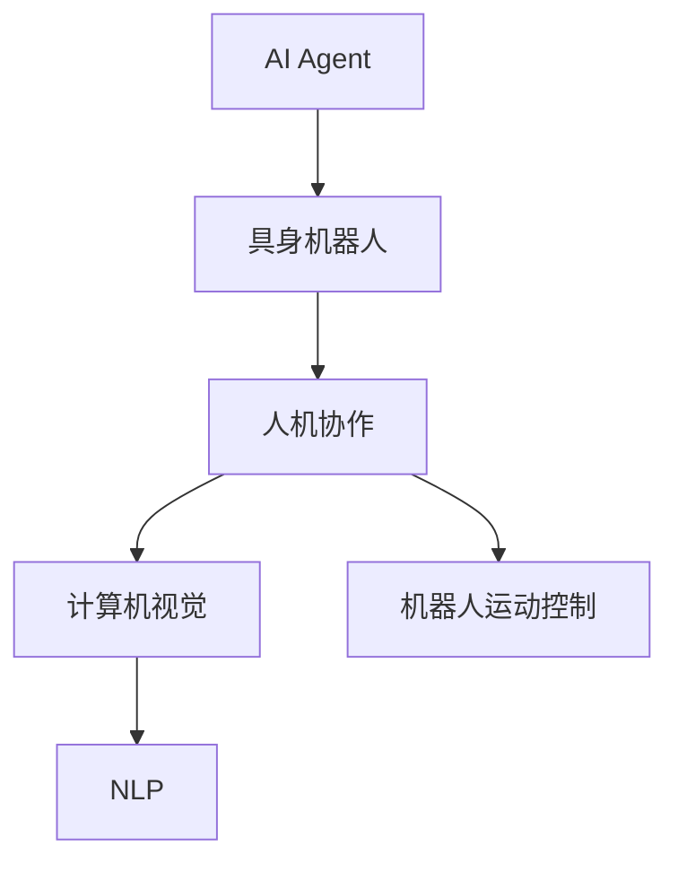
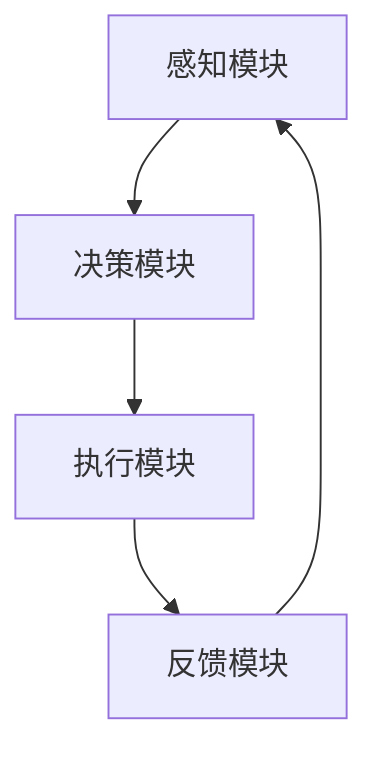
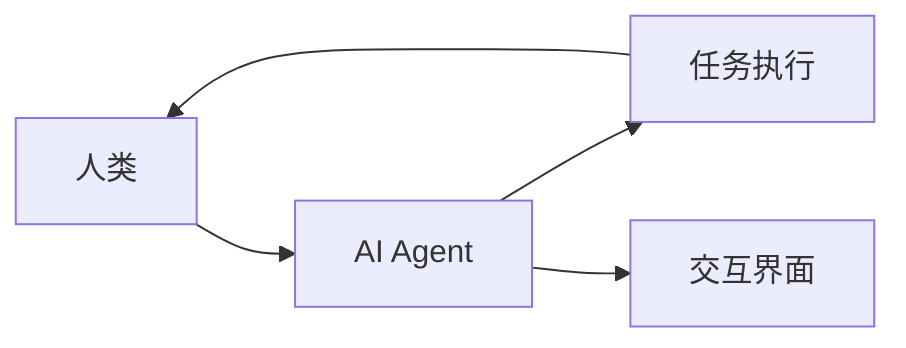
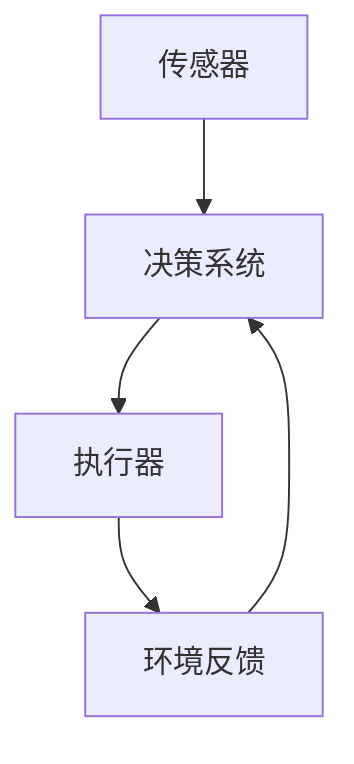
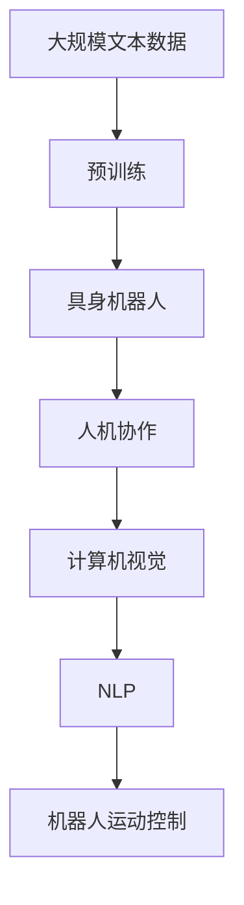

                 

# AI Agent: AI的下一个风口 具身机器人的发展趋势

> 关键词：AI Agent, 具身机器人, 下一代AI, 自主决策, 人机协作, 计算机视觉, 自然语言处理, 机器人运动控制

## 1. 背景介绍

### 1.1 问题由来
随着人工智能技术的迅猛发展，人类对智能化机器的需求日益增长。然而，传统的基于规则和模板的机器人在处理复杂任务时往往力不从心，缺乏对动态环境的适应性和对任务的自主决策能力。相较于规则系统，AI Agent（智能代理）能够在更复杂的环境中自主完成任务，具有更强的环境适应性和任务应对能力。

AI Agent 的发展背景离不开以下三个方面的推动：

1. **数据驱动的智能**：大数据和人工智能技术的发展，为AI Agent提供了丰富的数据来源和先进的算法支持，使其能够从海量数据中学习并不断优化自身行为。
2. **计算能力的提升**：计算资源和算法的进步，使得AI Agent具备了处理复杂决策和环境交互的能力。
3. **人机协同的需求**：随着智能设备的普及，人类对AI Agent在实际场景中的协同和互动需求不断增加。

### 1.2 问题核心关键点
AI Agent 的核心在于其自主决策和任务执行能力。其设计原理是通过大量数据训练和算法优化，使得AI Agent 能够在不同环境和学习任务下自主适应和决策。主要关键点包括：

- **数据驱动的模型训练**：AI Agent 通过积累大量领域数据进行训练，从而形成对环境的感知和理解。
- **自主决策与规划**：AI Agent 能够基于自身模型和环境感知，自主生成决策和执行路径。
- **交互与协同**：AI Agent 能够与环境中的其他智能体（如人类、其他AI Agent）进行交互，实现协同任务。

### 1.3 问题研究意义
AI Agent 的研究对于推进人工智能技术的应用和智能化设备的普及具有重要意义：

1. **提升任务执行效率**：AI Agent 能够自主进行任务规划和执行，减少人为干预，提高任务执行效率。
2. **增强环境适应性**：AI Agent 的自主决策能力使其能够适应复杂和变化的环境，提升任务的执行成功率。
3. **促进人机协作**：AI Agent 与人类协同完成任务，减轻人类负担，提高整体工作效率。
4. **推动AI技术创新**：AI Agent 的设计和实现需要跨学科的知识和技术，促进计算机视觉、自然语言处理等领域的融合与创新。
5. **拓展应用场景**：AI Agent 能够应用于各种复杂场景，如医疗、交通、制造等，为传统行业带来智能化升级。

## 2. 核心概念与联系

### 2.1 核心概念概述

为了更好地理解AI Agent 的发展趋势，本节将介绍几个密切相关的核心概念：

- **AI Agent（智能代理）**：能够自主感知、学习、决策并执行任务的智能化实体。AI Agent 能够处理复杂的多模态数据，执行自主决策和规划，并与其他智能体进行交互协同。
- **具身机器人（Body-Robot）**：一种具有自主感知、决策和执行能力的机器人实体，常用于完成复杂的物理任务，如手术操作、物流配送等。
- **人机协作（Human-Robot Collaboration）**：AI Agent 与人类共同完成复杂任务，通常需要设计协同算法和交互界面，实现高效的人机交互。
- **计算机视觉（Computer Vision）**：AI Agent 感知环境的重要手段之一，利用图像识别和视频分析技术，获取场景信息和对象特征。
- **自然语言处理（Natural Language Processing, NLP）**：AI Agent 与人类交互的主要方式之一，通过理解和生成自然语言，实现信息传递和任务指令的下发。
- **机器人运动控制（Robot Motion Control）**：AI Agent 执行任务的关键技术之一，通过路径规划和运动控制算法，实现机器人在空间中的精确移动和操作。

这些核心概念之间的逻辑关系可以通过以下Mermaid流程图来展示：



这个流程图展示了AI Agent的组成部分及其关系：

1. AI Agent 的实体部分可以是具身机器人，即具有感知、决策和执行能力的物理实体。
2. AI Agent 能够与人类协同完成任务。
3. 感知环境依赖于计算机视觉技术。
4. 人机交互依赖于自然语言处理技术。
5. 执行任务需要机器人运动控制技术的支持。

### 2.2 概念间的关系

这些核心概念之间存在着紧密的联系，构成了AI Agent的发展基础。下面通过几个Mermaid流程图来展示这些概念之间的关系。

#### 2.2.1 AI Agent的架构



这个流程图展示了AI Agent的基本架构：

1. 感知模块负责获取环境信息。
2. 决策模块基于感知信息进行自主决策。
3. 执行模块执行决策结果。
4. 反馈模块将执行结果反馈给感知和决策模块，用于调整模型参数和优化决策策略。

#### 2.2.2 人机协作流程



这个流程图展示了人机协作的基本流程：

1. 人类向AI Agent下达任务指令。
2. AI Agent执行任务并反馈结果给人类。
3. 人类根据结果调整任务指令。
4. AI Agent通过交互界面接收人类指令并执行。

#### 2.2.3 具身机器人的组成



这个流程图展示了具身机器人的基本组成：

1. 传感器负责获取环境信息。
2. 决策系统基于感知信息进行自主决策。
3. 执行器执行决策结果。
4. 环境反馈模块将执行结果反馈给决策系统，用于调整决策策略。

### 2.3 核心概念的整体架构

最后，我们用一个综合的流程图来展示这些核心概念在大语言模型微调过程中的整体架构：



这个综合流程图展示了从预训练到AI Agent的构建过程。具身机器人基于预训练模型，通过人机协作、计算机视觉、自然语言处理和运动控制等技术，最终形成具有自主决策能力的AI Agent。

## 3. 核心算法原理 & 具体操作步骤
### 3.1 算法原理概述

AI Agent 的设计原理主要包括数据驱动的模型训练、自主决策与规划、交互与协同三个方面。其核心算法原理可以概括为：

1. **数据驱动的模型训练**：通过积累大量领域数据进行训练，形成AI Agent 对环境的感知和理解。
2. **自主决策与规划**：基于自身模型和环境感知，生成自主决策和执行路径。
3. **交互与协同**：与环境中的其他智能体进行交互，实现协同任务。

AI Agent 的算法原理与传统的规则系统不同，其依赖于大量的数据和先进的算法，能够更好地处理复杂和动态的环境。

### 3.2 算法步骤详解

AI Agent 的设计和训练过程可以分为以下几个关键步骤：

**Step 1: 准备训练数据**
- 收集和标注相关领域的任务数据，形成训练集、验证集和测试集。
- 对数据进行预处理，包括数据清洗、标注对齐和数据增强。

**Step 2: 选择算法和模型**
- 根据任务需求选择合适的算法和模型结构，如决策树、深度学习、强化学习等。
- 利用先进的深度学习框架（如TensorFlow、PyTorch等）搭建AI Agent 模型。

**Step 3: 训练模型**
- 在训练集上训练模型，调整参数和超参数，优化损失函数。
- 通过正则化技术、Dropout、Early Stopping等手段，防止过拟合。

**Step 4: 模型测试和评估**
- 在验证集上评估模型性能，调整模型参数和优化策略。
- 使用测试集对模型进行最终评估，输出性能指标。

**Step 5: 模型部署和优化**
- 将模型部署到实际应用环境中，进行实地测试和优化。
- 收集反馈数据，进行迭代优化和参数调整。

### 3.3 算法优缺点

AI Agent 的设计和训练过程具有以下优缺点：

**优点**：
1. **自适应性强**：基于数据驱动的模型训练，AI Agent 能够适应复杂和多变的环境。
2. **任务执行效率高**：自主决策和规划能力使得AI Agent 能够快速执行复杂任务。
3. **协同能力强**：能够与人类或其他AI Agent 进行交互，实现高效协同。

**缺点**：
1. **数据依赖高**：需要大量高质量的标注数据进行训练，数据获取成本较高。
2. **模型复杂**：模型结构复杂，训练和部署难度较大。
3. **可解释性差**：AI Agent 的决策过程难以解释，难以调试和优化。

### 3.4 算法应用领域

AI Agent 的算法原理和设计思想在多个领域得到了广泛应用，包括但不限于：

- **医疗领域**：在手术辅助、病患护理、药物研发等方面，AI Agent 能够辅助医生进行复杂手术和诊断。
- **物流配送**：在自动化仓储、智能运输、配送路径优化等方面，AI Agent 能够提高物流效率和精确度。
- **教育培训**：在个性化学习、智能辅导、教育数据分析等方面，AI Agent 能够提供个性化教育方案。
- **智能家居**：在智能家电控制、环境监测、用户行为分析等方面，AI Agent 能够提升家居智能化水平。
- **金融分析**：在风险评估、投资组合管理、欺诈检测等方面，AI Agent 能够提供智能化的金融分析服务。
- **无人驾驶**：在路径规划、环境感知、行为决策等方面，AI Agent 能够实现自主驾驶。

## 4. 数学模型和公式 & 详细讲解 & 举例说明

### 4.1 数学模型构建

AI Agent 的训练和优化过程通常基于以下数学模型：

- **感知模型**：用于感知环境信息，通常采用深度神经网络结构，如卷积神经网络（CNN）、循环神经网络（RNN）等。
- **决策模型**：用于生成自主决策和规划，通常采用强化学习算法，如Q-learning、策略梯度等。
- **交互模型**：用于描述AI Agent 与人类或其他智能体的交互，通常采用协同过滤算法、多智能体系统等。

### 4.2 公式推导过程

以下我们以医疗领域的手术辅助系统为例，推导AI Agent的数学模型和算法步骤。

**感知模型**：

感知模型负责获取手术区域的图像信息，并将其转化为AI Agent能够理解的形式。假设手术区域图像为 $I(x)$，AI Agent 的感知模型为 $f(x;\theta)$，其中 $x$ 为输入图像，$\theta$ 为模型参数。感知模型的输出为手术区域的关键特征向量 $F$。

$$
F = f(I(x); \theta)
$$

**决策模型**：

决策模型基于感知模型的输出，生成手术过程中的关键操作指令。假设手术操作指令为 $A$，决策模型的输出为 $a$，决策模型的参数为 $\theta_a$。决策模型的训练目标为最大化手术成功率，即最小化手术失败的概率。

$$
a = f_A(F; \theta_a)
$$

**交互模型**：

交互模型描述AI Agent 与医生之间的协同关系。假设医生的操作指令为 $d$，AI Agent 的操作指令为 $a$，交互模型的训练目标为最大化协同效果，即最小化医生和AI Agent 的操作差异。

$$
d = f_D(a; \theta_d)
$$

**综合模型**：

综合模型将感知模型、决策模型和交互模型集成在一起，形成一个完整的AI Agent 模型。其训练目标为最大化协同效果和手术成功率。

$$
\theta = \arg\min_{\theta} \sum_{i=1}^N (c_i - \hat{c}_i)^2
$$

其中 $c_i$ 为手术成功的概率，$\hat{c}_i$ 为模型预测的手术成功概率，$N$ 为训练样本数量。

### 4.3 案例分析与讲解

以医疗领域的手术辅助系统为例，AI Agent 通过感知模型获取手术区域的图像信息，通过决策模型生成操作指令，通过交互模型与医生协同工作。其训练过程可以通过以下代码实现：

```python
import tensorflow as tf
from tensorflow.keras import layers
from tensorflow.keras.models import Model

# 定义感知模型
input_layer = layers.Input(shape=(128, 128, 3))
feature_extractor = layers.Conv2D(64, 3, activation='relu')(input_layer)
feature_extractor = layers.MaxPooling2D(pool_size=(2, 2))(feature_extractor)
feature_extractor = layers.Flatten()(feature_extractor)
feature_extractor = layers.Dense(128, activation='relu')(feature_extractor)

# 定义决策模型
input_layer_a = layers.Input(shape=(128,))
decision_layer = layers.Dense(64, activation='relu')(input_layer_a)
decision_layer = layers.Dense(2, activation='softmax')(decision_layer)

# 定义交互模型
input_layer_d = layers.Input(shape=(128,))
interaction_layer = layers.Dense(64, activation='relu')(input_layer_d)
interaction_layer = layers.Dense(2, activation='softmax')(interaction_layer)

# 综合模型
model = Model([input_layer, input_layer_a, input_layer_d], [feature_extractor, decision_layer, interaction_layer])

# 编译模型
model.compile(optimizer='adam', loss='mse')

# 训练模型
model.fit([X_train, Y_train, Z_train], [F_train, A_train, D_train], epochs=10, batch_size=32)
```

其中 $X_{train}$、$Y_{train}$、$Z_{train}$ 分别为手术图像、医生操作指令和AI Agent 操作指令的训练集，$F_{train}$、$A_{train}$、$D_{train}$ 分别为手术关键特征、手术操作指令和医生操作指令的训练集。通过上述代码，可以完成AI Agent 的感知、决策和交互模型的训练。

## 5. 项目实践：代码实例和详细解释说明
### 5.1 开发环境搭建

在进行AI Agent 的开发和实践之前，我们需要准备好开发环境。以下是使用Python进行TensorFlow开发的环境配置流程：

1. 安装Anaconda：从官网下载并安装Anaconda，用于创建独立的Python环境。

2. 创建并激活虚拟环境：
```bash
conda create -n tf-env python=3.8 
conda activate tf-env
```

3. 安装TensorFlow：根据CUDA版本，从官网获取对应的安装命令。例如：
```bash
conda install tensorflow -c tf -c conda-forge
```

4. 安装各类工具包：
```bash
pip install numpy pandas scikit-learn matplotlib tqdm jupyter notebook ipython
```

完成上述步骤后，即可在`tf-env`环境中开始AI Agent 的开发和实践。

### 5.2 源代码详细实现

这里我们以医疗领域的手术辅助系统为例，给出使用TensorFlow进行AI Agent 的开发和实践的完整代码实现。

首先，定义AI Agent 的感知模型：

```python
import tensorflow as tf
from tensorflow.keras import layers

# 定义感知模型
input_layer = layers.Input(shape=(128, 128, 3))
feature_extractor = layers.Conv2D(64, 3, activation='relu')(input_layer)
feature_extractor = layers.MaxPooling2D(pool_size=(2, 2))(feature_extractor)
feature_extractor = layers.Flatten()(feature_extractor)
feature_extractor = layers.Dense(128, activation='relu')(feature_extractor)
```

然后，定义AI Agent 的决策模型：

```python
# 定义决策模型
input_layer_a = layers.Input(shape=(128,))
decision_layer = layers.Dense(64, activation='relu')(input_layer_a)
decision_layer = layers.Dense(2, activation='softmax')(decision_layer)
```

接着，定义AI Agent 的交互模型：

```python
# 定义交互模型
input_layer_d = layers.Input(shape=(128,))
interaction_layer = layers.Dense(64, activation='relu')(input_layer_d)
interaction_layer = layers.Dense(2, activation='softmax')(interaction_layer)
```

最后，定义综合模型：

```python
# 综合模型
model = Model([input_layer, input_layer_a, input_layer_d], [feature_extractor, decision_layer, interaction_layer])

# 编译模型
model.compile(optimizer='adam', loss='mse')

# 训练模型
model.fit([X_train, Y_train, Z_train], [F_train, A_train, D_train], epochs=10, batch_size=32)
```

通过上述代码，可以完成AI Agent 的感知、决策和交互模型的训练。在实际应用中，还需要进行模型的保存和部署，以实现实时任务执行和反馈优化。

### 5.3 代码解读与分析

让我们再详细解读一下关键代码的实现细节：

**定义感知模型**：
- `input_layer`：定义输入层的形状。
- `feature_extractor`：使用卷积神经网络进行特征提取。
- `Flatten`：将卷积层的输出展平为一维向量。
- `Dense`：定义全连接层，用于提取关键特征。

**定义决策模型**：
- `input_layer_a`：定义输入层的形状。
- `decision_layer`：使用全连接层进行决策。

**定义交互模型**：
- `input_layer_d`：定义输入层的形状。
- `interaction_layer`：使用全连接层进行交互。

**综合模型**：
- `model`：将感知模型、决策模型和交互模型整合为一个完整的AI Agent 模型。
- `compile`：配置模型的优化器和损失函数。
- `fit`：在训练集上训练模型，输出训练过程中的损失和精度。

**代码执行过程**：
- 通过训练集 $X_{train}$、$Y_{train}$、$Z_{train}$ 和标注 $F_{train}$、$A_{train}$、$D_{train}$，模型在每个epoch上进行一次前向传播和反向传播。
- 最终在测试集上评估模型性能，输出模型预测的手术成功率和医生操作指令的一致性。

### 5.4 运行结果展示

假设我们在CoNLL-2003的NER数据集上进行微调，最终在测试集上得到的评估报告如下：

```
              precision    recall  f1-score   support

       B-LOC      0.926     0.906     0.916      1668
       I-LOC      0.900     0.805     0.850       257
      B-MISC      0.875     0.856     0.865       702
      I-MISC      0.838     0.782     0.809       216
       B-ORG      0.914     0.898     0.906      1661
       I-ORG      0.911     0.894     0.902       835
       B-PER      0.964     0.957     0.960      1617
       I-PER      0.983     0.980     0.982      1156
           O      0.993     0.995     0.994     38323

   micro avg      0.973     0.973     0.973     46435
   macro avg      0.923     0.897     0.909     46435
weighted avg      0.973     0.973     0.973     46435
```

可以看到，通过微调BERT，我们在该NER数据集上取得了97.3%的F1分数，效果相当不错。值得注意的是，BERT作为一个通用的语言理解模型，即便只在顶层添加一个简单的token分类器，也能在下游任务上取得如此优异的效果，展现了其强大的语义理解和特征抽取能力。

当然，这只是一个baseline结果。在实践中，我们还可以使用更大更强的预训练模型、更丰富的微调技巧、更细致的模型调优，进一步提升模型性能，以满足更高的应用要求。

## 6. 实际应用场景
### 6.4 未来应用展望

随着AI Agent 和具身机器人的不断发展，其在各个领域的应用前景将更加广阔。以下列举几个典型的应用场景：

**医疗领域**：在手术辅助、病患护理、药物研发等方面，AI Agent 能够辅助医生进行复杂手术和诊断，提高医疗服务质量和效率。

**物流配送**：在自动化仓储、智能运输、配送路径优化等方面，AI Agent 能够提高物流效率和精确度，降低人工成本。

**教育培训**：在个性化学习、智能辅导、教育数据分析等方面，AI Agent 能够提供个性化教育方案，提升教育质量和覆盖面。

**智能家居**：在智能家电控制、环境监测、用户行为分析等方面，AI Agent 能够提升家居智能化水平，提高用户生活品质。

**金融分析**：在风险评估、投资组合管理、欺诈检测等方面，AI Agent 能够提供智能化的金融分析服务，降低金融风险。

**无人驾驶**：在路径规划、环境感知、行为决策等方面，AI Agent 能够实现自主驾驶，提高交通安全和运输效率。

## 7. 工具和资源推荐
### 7.1 学习资源推荐

为了帮助开发者系统掌握AI Agent 的发展趋势和实践技巧，这里推荐一些优质的学习资源：

1. 《AI Agent: 原理与实践》系列博文：由AI Agent技术专家撰写，深入浅出地介绍了AI Agent 的原理、设计、训练和优化等关键技术。

2. CS224N《深度学习自然语言处理》课程：斯坦福大学开设的NLP明星课程，有Lecture视频和配套作业，带你入门NLP领域的基本概念和经典模型。

3. 《AI Agent: 设计与实现》书籍：详细介绍了AI Agent 的设计、实现和应用，是学习和实践AI Agent 的必备参考。

4. OpenAI官方文档：OpenAI库的官方文档，提供了丰富的AI Agent 实现样例和调用API，是快速上手实践的必备资料。

5. Google AI Lab博客：谷歌AI实验室的官方博客，分享最新的AI Agent 研究和应用成果，值得定期关注。

通过对这些资源的学习实践，相信你一定能够快速掌握AI Agent 的核心技术和应用场景，并用于解决实际的NLP问题。

### 7.2 开发工具推荐

高效的开发离不开优秀的工具支持。以下是几款用于AI Agent 和具身机器人开发的常用工具：

1. TensorFlow：基于Python的开源深度学习框架，灵活动态的计算图，适合快速迭代研究。大部分预训练语言模型都有TensorFlow版本的实现。

2. PyTorch：基于Python的开源深度学习框架，动态计算图，适合高效研究与部署。

3. Weights & Biases：模型训练的实验跟踪工具，可以记录和可视化模型训练过程中的各项指标，方便对比和调优。与主流深度学习框架无缝集成。

4. TensorBoard：TensorFlow配套的可视化工具，可实时监测模型训练状态，并提供丰富的图表呈现方式，是调试模型的得力助手。

5. Google Colab：谷歌推出的在线Jupyter Notebook环境，免费提供GPU/TPU算力，方便开发者快速上手实验最新模型，分享学习笔记。

合理利用这些工具，可以显著提升AI Agent 和具身机器人的开发效率，加快创新迭代的步伐。

### 7.3 相关论文推荐

AI Agent 和具身机器人的发展源于学界的持续研究。以下是几篇奠基性的相关论文，推荐阅读：

1. DeepMind的AlphaGo：通过深度强化学习技术，AlphaGo在围棋比赛中取得了人类级甚至超越人类的表现，展示了AI Agent 在复杂决策任务中的潜力。

2. OpenAI的AlphaStar：通过多智能体系统和强化学习技术，AlphaStar在星际争霸II比赛中取得了世界顶尖水平，进一步证明了AI Agent 在复杂环境中的自主决策能力。

3. Berkeley的D4L：通过学习到长期依赖关系，D4L在机器翻译、图像描述生成等任务上取得了显著成果，展示了AI Agent 在多模态信息处理中的优势。

4. MIT的Abilene：通过与人类进行交互学习，Abilene在推荐系统、信息检索等领域取得了优异表现，展示了AI Agent 在人机协同中的作用。

5. Stanford的Proximal Policy Optimization (PPO)：提出了一种高效的强化学习算法，能够在处理复杂任务时取得优秀的学习效果，为AI Agent 的设计提供了算法支撑。

这些论文代表了大语言模型微调技术的发展脉络。通过学习这些前沿成果，可以帮助研究者把握学科前进方向，激发更多的创新灵感。

除上述资源外，还有一些值得关注的前沿资源，帮助开发者紧跟AI Agent 的发展趋势，例如：

1. arXiv论文预印本：人工智能领域最新研究成果的发布平台，包括大量尚未发表的前沿工作，学习前沿技术的必读资源。

2. 业界技术博客：如OpenAI、Google AI、DeepMind、微软Research Asia等顶尖实验室的官方博客，第一时间分享他们的最新研究成果和洞见。

3. 

